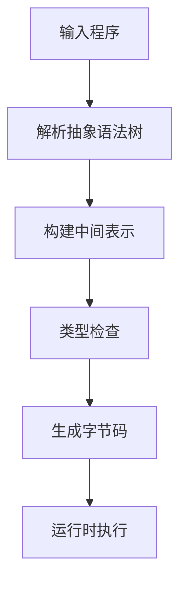
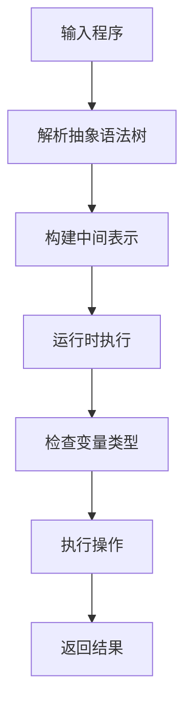
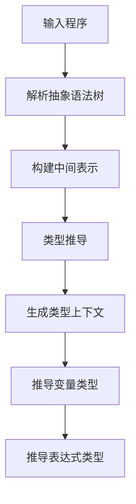
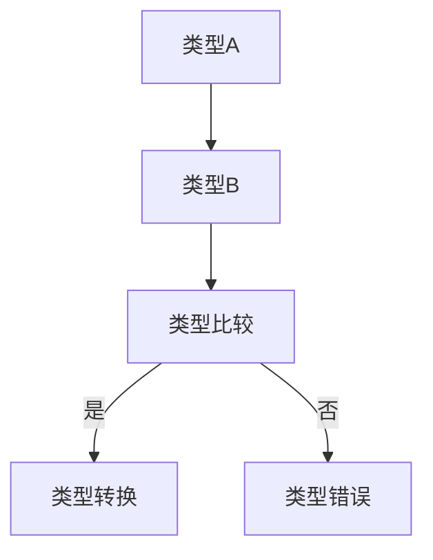

                 


# 类型系统在函数式云计算中的新角色

## 关键词

- 类型系统
- 函数式编程
- 云计算
- 类型安全
- 静态类型
- 动态类型

## 摘要

本文深入探讨了类型系统在函数式云计算中的新角色。类型系统作为编程语言的基础，是确保程序正确性和性能的关键。在函数式编程中，类型系统的地位尤为重要。本文首先介绍了类型系统的基本概念、背景和重要性，随后讨论了函数式编程与类型系统的关系，并详细阐述了类型系统的算法原理和数学模型。接着，本文转向云计算领域，分析了类型系统在函数式云计算中的新角色和挑战，最后通过实际案例和最佳实践，展示了如何将类型系统应用于函数式云计算，以提高安全性和性能。

## 目录大纲设计思路

设计《类型系统在函数式云计算中的新角色》一书的目录大纲，我们需要遵循以下几个步骤：

### 1. 背景介绍

- **类型系统的定义、背景及其在函数式编程中的重要性**
  - 介绍类型系统的定义和基本概念，如静态类型、动态类型、强类型、弱类型等。
  - 讨论类型系统在编程语言中的角色和作用，特别是在函数式编程中的应用。

- **函数式云计算的概念和发展趋势**
  - 解释函数式云计算的定义和特点，如并行计算、不可变数据、函数组合等。
  - 探讨函数式云计算的发展趋势和未来的发展方向。

### 2. 核心概念与联系

- **类型系统的核心概念**
  - 介绍类型系统的核心概念，如类型推导、类型检查、类型安全等。
  - 分析不同类型系统的属性特征，如静态类型、动态类型、强类型、弱类型等。

- **类型系统的分类**
  - 按照类型系统的不同分类方法，如静态类型与动态类型、强类型与弱类型等，进行详细讨论。
  - 分析各类类型系统的优缺点和适用场景。

- **实体关系图（ER图）**
  - 使用Mermaid绘制实体关系图，展示不同类型系统的属性特征和相互关系。

### 3. 算法原理讲解

- **类型系统的基本算法原理**
  - 详细阐述类型系统的基本算法原理，如类型推导算法、类型检查算法等。
  - 使用Mermaid绘制算法流程图，展示算法的执行过程。

- **Python源代码实现**
  - 使用Python源代码实现类型系统的基本算法，如类型检查、类型推导等。
  - 分析源代码的执行流程和关键步骤。

- **数学模型和公式**
  - 讨论类型系统的数学模型和公式，如范畴论、类型论等。
  - 使用LaTeX格式嵌入数学公式，进行详细讲解。

- **举例说明**
  - 通过具体的例子说明数学模型在类型系统中的应用，如类型推导、类型检查等。
  - 分析例子的执行过程和结果，加深对类型系统的理解。

### 4. 系统分析与架构设计方案

- **函数式云计算的具体应用场景**
  - 介绍函数式云计算的具体应用场景，如云计算平台、云函数、容器等。
  - 分析这些场景对类型系统的需求和挑战。

- **系统功能设计**
  - 设计系统功能，包括领域模型、功能模块、接口定义等。
  - 使用Mermaid绘制领域模型类图，展示系统功能的设计。

- **系统架构设计**
  - 设计系统架构，包括组件划分、模块关系、数据流等。
  - 使用Mermaid绘制系统架构图，展示系统架构的设计。

- **系统接口设计**
  - 设计系统接口，包括接口定义、参数传递、返回值等。
  - 使用Mermaid绘制系统接口序列图，展示系统接口的设计。

### 5. 项目实战

- **环境搭建**
  - 描述环境搭建的步骤，包括编程环境、云计算平台等。
  - 分析环境搭建的关键步骤和注意事项。

- **系统核心实现**
  - 实现系统核心功能，包括源代码、算法实现、系统接口等。
  - 分析实现过程中遇到的问题和解决方案。

- **代码解读与分析**
  - 分析系统核心代码的实现，包括算法原理、数学模型、系统接口等。
  - 分析代码的性能和可维护性，给出改进建议。

- **实际案例分析与详细讲解**
  - 提供实际案例，分析案例的实现过程和结果。
  - 详细讲解案例中的关键技术和实现细节。

- **项目小结**
  - 对项目实现过程进行总结，分析项目的优点和不足。
  - 提出改进方向和未来发展建议。

### 6. 最佳实践与总结

- **最佳实践**
  - 提供使用类型系统进行函数式云计算的最佳实践建议。
  - 分析最佳实践的效果和适用场景。

- **小结**
  - 对全文内容进行小结，总结类型系统在函数式云计算中的新角色和意义。

- **注意事项**
  - 指出读者在应用类型系统时需要注意的问题和挑战。

- **拓展阅读**
  - 提供拓展阅读材料，引导读者进一步探索类型系统和函数式云计算。

## 完整目录大纲

**《类型系统在函数式云计算中的新角色》目录大纲**

### 第一部分：类型系统的基本概念与背景

#### 第1章：类型系统概述

- **1.1 问题背景**
  - 函数式编程的兴起与类型系统的重要性
  - 云计算的发展与类型系统的挑战

- **1.2 核心概念**
  - 类型系统的定义与作用
  - 函数式编程中的类型安全

- **1.3 类型系统的分类**
  - 静态类型与动态类型的区别
  - 强类型与弱类型的对比

- **1.4 类型系统的优势与局限性**
  - 类型系统的优点
  - 类型系统的局限性

#### 第2章：函数式编程与类型系统

- **2.1 函数式编程基础**
  - 函数式编程的概念与特点
  - 函数式编程的主要语言

- **2.2 类型系统在函数式编程中的应用**
  - 类型推导与类型检查
  - 类型错误处理与异常管理

- **2.3 函数式编程中的类型系统演进**
  - 从基本类型到复合类型
  - 高级类型系统如类型类与类型构造器

#### 第3章：类型系统的数学模型

- **3.1 数学模型基础**
  - 类型系统的数学基础
  - 类型系统的运算规则

- **3.2 类型系统的数学公式**
  - 范畴论与类型论
  - 类型等价与类型子类型关系

- **3.3 数学公式举例说明**
  - 通过具体的例子说明数学模型在类型系统中的应用

### 第二部分：类型系统在云计算中的应用

#### 第4章：函数式云计算概述

- **4.1 云计算的发展**
  - 云计算的定义与演进
  - 函数式云计算的概念

- **4.2 云计算中的类型系统需求**
  - 云服务的类型安全要求
  - 类型系统在云计算中的挑战

- **4.3 函数式云计算的优势**
  - 函数式编程在云计算中的优势
  - 类型系统在云计算中的优势

#### 第5章：类型系统在函数式云计算中的应用

- **5.1 类型系统在云计算架构中的应用**
  - 云服务类型安全架构设计
  - 类型系统在分布式系统中的应用

- **5.2 类型系统在云计算中的实现**
  - 云计算平台中的类型系统实现
  - 类型系统在云函数和容器中的应用

- **5.3 类型系统在云计算安全中的应用**
  - 类型系统在网络安全中的角色
  - 类型系统在数据隐私保护中的应用

#### 第6章：类型系统在函数式云计算中的实践

- **6.1 环境搭建**
  - 云计算平台的搭建
  - 函数式编程环境的配置

- **6.2 实践案例**
  - 使用Haskell构建类型安全的云服务
  - 使用Scala在云计算中实现类型推导

- **6.3 代码解读与分析**
  - 分析具体案例中的代码实现
  - 评估类型系统在实践中的应用效果

### 第三部分：最佳实践与总结

#### 第7章：最佳实践

- **7.1 最佳实践建议**
  - 使用类型系统进行函数式云计算的最佳实践建议
  - 分析最佳实践的效果和适用场景

#### 第8章：小结

- **8.1 全文总结**
  - 对全文内容进行小结，总结类型系统在函数式云计算中的新角色和意义

- **8.2 注意事项**
  - 指出读者在应用类型系统时需要注意的问题和挑战

#### 第9章：拓展阅读

- **9.1 拓展阅读材料**
  - 提供拓展阅读材料，引导读者进一步探索类型系统和函数式云计算

---

通过这个详细的目录大纲，读者可以清晰地了解《类型系统在函数式云计算中的新角色》一书的内容结构和主要章节，从而更好地理解类型系统在函数式云计算中的应用和重要性。在接下来的各章节中，我们将深入探讨类型系统的核心概念、算法原理、云计算中的应用实践，以及最佳实践和总结，以帮助读者全面掌握这一领域的知识。

### 类型系统的定义与背景

类型系统（Type System）是编程语言的核心组成部分之一，它定义了程序中数据类型的结构和操作规则。简单来说，类型系统通过约束程序中的数据操作，确保程序的正确性和安全性。在函数式编程（Functional Programming）中，类型系统尤为重要，因为函数式编程强调表达计算过程而非状态变化，这使得类型系统能够更好地捕捉程序的结构和行为。

#### 核心概念

- **类型（Type）**：类型是变量、表达式和函数可能取值的集合。在静态类型语言中，变量的类型在编译时确定；而在动态类型语言中，变量的类型在运行时确定。

- **类型安全（Type Safety）**：类型安全是指程序在编译或运行时，不会因为类型错误而导致运行时错误。类型安全通过类型检查（Type Checking）机制实现，确保程序中所有操作都是类型兼容的。

- **静态类型（Static Type）**：静态类型是指在编译时就能确定变量和表达式的类型。静态类型语言如Java、C#等，通过静态类型检查提前发现并修复类型错误。

- **动态类型（Dynamic Type）**：动态类型是指在运行时确定变量和表达式的类型。动态类型语言如Python、JavaScript等，在运行时进行类型检查，允许在运行时改变变量的类型。

- **强类型（Strong Type）**：强类型语言严格区分不同类型，不同类型的数据不能直接混合操作。强类型可以提高程序的可靠性，减少潜在的错误。

- **弱类型（Weak Type）**：弱类型语言对类型限制较宽松，允许不同类型的数据进行混合操作。弱类型语言在运行时进行隐式类型转换，可能导致不可预料的结果。

#### 问题背景

随着云计算和分布式计算的兴起，函数式编程由于其并行计算、不可变数据、函数组合等特性，逐渐成为云计算平台和微服务架构的首选编程范式。然而，函数式编程也带来了一些挑战，如类型安全性的保障、分布式环境下的类型一致性等。类型系统在函数式云计算中的重要性体现在以下几个方面：

1. **并行计算与并发控制**：函数式编程通过不可变数据和纯函数实现并行计算，类型系统能够确保并行操作的安全性，防止数据竞争和死锁。

2. **分布式系统的类型一致性**：在分布式系统中，不同节点上的函数和数据需要保持类型一致性，类型系统可以确保跨节点的类型匹配，提高系统的稳定性。

3. **代码的可维护性和可读性**：类型系统能够通过类型检查和推导，提高代码的可靠性，降低维护成本，提高开发效率。

4. **安全性**：类型系统能够在编译或运行时检测类型错误，防止潜在的安全漏洞，提高系统的安全性。

#### 问题描述

函数式编程在云计算中的广泛应用，要求类型系统能够适应分布式环境，支持并行计算，并在高并发场景下确保类型安全。然而，传统的静态类型和动态类型系统在设计之初并未充分考虑云计算的特点和需求，导致在分布式计算和并发控制方面存在一些局限：

1. **静态类型系统的局限**：静态类型系统在编译时进行类型检查，无法适应动态变化的分布式环境，难以保证类型的一致性和兼容性。

2. **动态类型系统的局限**：动态类型系统虽然在灵活性上具有优势，但在类型安全性方面存在风险，容易导致运行时错误和潜在的安全漏洞。

3. **分布式计算中的类型一致性**：在分布式系统中，节点之间的数据交换需要保持类型一致性，传统的类型系统难以实现高效和可靠的数据交换。

4. **并行计算中的类型安全**：并行计算要求类型系统能够确保并行操作的安全性，避免数据竞争和死锁。

#### 问题解决

为了解决上述问题，类型系统在函数式云计算中的应用需要从以下几个方面进行改进：

1. **混合类型系统**：结合静态类型和动态类型的优点，设计混合类型系统，既能确保类型安全，又能提供足够的灵活性。

2. **分布式类型检查**：在分布式系统中引入分布式类型检查机制，确保跨节点的类型匹配，提高系统的稳定性。

3. **并行类型安全**：设计并行类型安全机制，确保并行操作的安全性，防止数据竞争和死锁。

4. **类型推导与抽象**：利用类型推导和抽象机制，减少显式类型声明，提高代码的可维护性和可读性。

5. **安全编程模型**：引入安全编程模型，如基于类型的权限控制和访问控制，提高系统的安全性。

#### 边界与外延

类型系统在函数式云计算中的边界与外延涉及以下几个方面：

1. **边界**：类型系统需要定义在分布式环境中的类型边界，确保不同节点之间的数据交换和操作遵循类型约束。

2. **外延**：类型系统需要扩展到并行计算和并发控制领域，提供强大的类型安全机制，适应高并发和分布式计算的需求。

3. **边界与外延的关系**：类型系统的边界与外延相互影响，边界定义了类型系统的适用范围，而外延则扩展了类型系统的功能和应用领域。

#### 概念结构与核心要素组成

类型系统的概念结构由以下几个核心要素组成：

1. **类型定义**：定义基本类型和复合类型，如整数、字符串、函数类型等。

2. **类型检查**：通过类型检查机制，确保程序中的数据操作符合类型约束。

3. **类型推导**：利用类型推导机制，自动推导变量和表达式的类型，减少显式类型声明。

4. **类型安全**：通过类型安全机制，防止类型错误和运行时异常。

5. **类型抽象**：利用类型抽象机制，提高代码的可维护性和可读性。

6. **并发控制**：设计并发控制机制，确保并行操作的安全性。

7. **分布式计算**：设计分布式计算机制，支持跨节点的数据交换和操作。

通过这些核心要素，类型系统在函数式云计算中提供了强大的类型安全和性能保障，为云计算平台的开发和应用提供了坚实的基础。

### 核心概念与联系

在深入探讨类型系统在函数式云计算中的应用之前，我们需要系统地介绍类型系统的核心概念，并分析其属性特征和相互关系。类型系统在函数式编程和云计算领域扮演着至关重要的角色，其核心概念包括类型推导、类型检查、类型安全、静态类型和动态类型等。下面，我们将详细阐述这些概念，并通过表格和实体关系图（ER图）展示不同类型系统的属性特征和相互关系。

#### 类型推导

类型推导（Type Inference）是指编译器或解释器自动推导出变量或表达式的类型，而无需显式声明。类型推导有助于提高代码的可读性和可维护性。在函数式编程中，类型推导尤为重要，因为它可以减少冗余的类型声明，并帮助开发者更快地发现类型错误。

- **基本类型推导**：简单变量和表达式的类型推导，如整数、浮点数和字符串。
- **复合类型推导**：函数类型、记录类型和联合类型的推导。

#### 类型检查

类型检查（Type Checking）是指编译器或解释器在编译或运行程序时，对变量、表达式和函数的类型进行验证，确保它们在上下文中是类型兼容的。类型检查分为静态类型检查和动态类型检查。

- **静态类型检查**：在编译时进行类型检查，确保程序在运行前是类型安全的。
- **动态类型检查**：在运行时进行类型检查，允许在程序运行过程中动态改变变量的类型。

#### 类型安全

类型安全（Type Safety）是指程序在编译或运行时不会因为类型错误而导致错误或异常。类型安全通过类型检查和类型推导机制实现，确保程序中的数据操作是类型兼容的。

- **静态类型安全**：通过静态类型检查确保类型安全，早期发现类型错误。
- **动态类型安全**：通过动态类型检查和类型推导机制确保类型安全，但可能存在运行时错误。

#### 静态类型

静态类型（Static Type）是指变量的类型在编译时确定，并在程序运行期间保持不变。静态类型语言通常有严格的类型系统，有助于提高程序的可靠性和性能。

- **静态类型特征**：变量类型在声明时确定，类型检查在编译时进行。
- **静态类型优势**：提高程序的可读性、可维护性和性能。
- **静态类型局限**：灵活性较低，可能需要显式类型声明。

#### 动态类型

动态类型（Dynamic Type）是指变量的类型在运行时确定，允许在程序运行过程中动态改变变量的类型。动态类型语言通常提供灵活的类型系统，有助于快速开发和原型设计。

- **动态类型特征**：变量类型在运行时确定，类型检查在运行时进行。
- **动态类型优势**：提高程序的灵活性和开发效率。
- **动态类型局限**：类型安全风险较高，可能存在运行时错误。

#### 强类型

强类型（Strong Type）是指语言严格区分不同类型，不允许不同类型的数据进行混合操作。强类型可以提高程序的可靠性和安全性。

- **强类型特征**：严格区分类型，类型转换需要显式声明。
- **强类型优势**：减少类型错误，提高程序的安全性。
- **强类型局限**：灵活性较低，可能增加代码复杂度。

#### 弱类型

弱类型（Weak Type）是指语言对类型限制较宽松，允许不同类型的数据进行混合操作，通常在运行时进行类型转换。弱类型可以提高程序的灵活性和开发效率。

- **弱类型特征**：对类型限制较宽松，隐式类型转换。
- **弱类型优势**：提高程序的灵活性和开发效率。
- **弱类型局限**：类型安全风险较高，可能存在运行时错误。

#### 表格：不同类型系统的属性特征对比

| 类型系统        | 特征                                                   | 优势                   | 局限                   |
|----------------|--------------------------------------------------------|------------------------|------------------------|
| 静态类型        | 变量类型在编译时确定                                     | 提高性能、可读性和可维护性 | 灵活性较低、需要显式类型声明 |
| 动态类型        | 变量类型在运行时确定                                     | 提高灵活性和开发效率     | 类型安全风险较高         |
| 强类型          | 严格区分类型，类型转换需要显式声明                         | 提高程序的安全性和可靠性 | 降低灵活性、增加代码复杂度 |
| 弱类型          | 对类型限制较宽松，隐式类型转换                           | 提高灵活性和开发效率     | 类型安全风险较高         |

#### 实体关系图（ER图）

为了更直观地展示不同类型系统的属性特征和相互关系，我们使用实体关系图（ER图）来表示。实体关系图能够清晰地展示类型系统的各个组成部分及其关系。

```mermaid
erDiagram
  TypeInference ||--|{ TypeSafety } : implements
  TypeSafety ||--|{ StaticType } : is_a
  TypeSafety ||--|{ DynamicType } : is_a
  StaticType ||--|{ StrongType } : is_a
  StaticType ||--|{ WeakType } : is_a
  DynamicType ||--|{ StrongType } : is_a
  DynamicType ||--|{ WeakType } : is_a
```

在上面的ER图中，`TypeInference`（类型推导）是`TypeSafety`（类型安全）的实现之一，而`TypeSafety`是`StaticType`（静态类型）和`DynamicType`（动态类型）的抽象概念。`StaticType`进一步分为`StrongType`（强类型）和`WeakType`（弱类型），`DynamicType`也类似。

#### 总结

通过上述核心概念和属性特征的介绍，以及实体关系图的展示，我们可以更清晰地理解不同类型系统的特点和应用。类型系统在函数式编程和云计算领域中的重要性不言而喻，通过选择合适的类型系统，我们可以提高代码的可靠性、性能和安全性，为云计算平台的开发提供坚实的基础。

### 算法原理讲解

在深入探讨类型系统的算法原理之前，我们需要了解类型系统中的基本算法，如类型检查（Type Checking）、类型推导（Type Inference）和类型等价（Type Equivalence）。这些算法是类型系统的核心组成部分，确保程序在运行时能够正确执行并保持类型安全。下面，我们将详细阐述这些算法的原理，并通过Mermaid绘制算法流程图和使用Python源代码实现，以便读者更好地理解和应用。

#### 类型检查

类型检查（Type Checking）是编译器或解释器在编译或运行程序时，对变量、表达式和函数的类型进行验证，确保它们在上下文中是类型兼容的。类型检查分为静态类型检查和动态类型检查。

##### 静态类型检查

静态类型检查在编译时进行，通过分析代码结构和语义，确保变量和表达式在编译时类型兼容。

**算法流程图：**



**Python源代码实现：**

```python
def type_check(program):
    # 解析抽象语法树（略）
    ast = parse_program(program)
    # 构建中间表示（略）
    ir = build_ir(ast)
    # 执行类型检查
    for stmt in ir:
        if not check_stmt_type(stmt):
            raise TypeError("Type mismatch")
    return ir

def check_stmt_type(stmt):
    # 根据不同的语句类型进行类型检查（略）
    pass
```

##### 动态类型检查

动态类型检查在运行时进行，通过在运行时检查变量和表达式的类型，确保类型兼容性。

**算法流程图：**



**Python源代码实现：**

```python
def run_program(program):
    # 解析抽象语法树（略）
    ast = parse_program(program)
    # 构建中间表示（略）
    ir = build_ir(ast)
    # 运行时执行
    for stmt in ir:
        if isinstance(stmt, AssignmentStmt):
            value = evaluate_expression(stmt.value)
            if not is_type_compatible(stmt.target.type, value.type):
                raise TypeError("Type mismatch")
        # 其他类型的语句处理（略）
```

#### 类型推导

类型推导（Type Inference）是编译器或解释器自动推导出变量或表达式的类型，而无需显式声明。类型推导能够提高代码的可读性和可维护性。

**算法流程图：**



**Python源代码实现：**

```python
def infer_types(program):
    # 解析抽象语法树（略）
    ast = parse_program(program)
    # 构建中间表示（略）
    ir = build_ir(ast)
    # 构建类型上下文
    type_context = build_type_context()
    # 推导变量类型
    for var in ir.variables:
        var.type = infer_variable_type(var, type_context)
    # 推导表达式类型
    for expr in ir.expressions:
        expr.type = infer_expression_type(expr, type_context)
    return ir

def infer_variable_type(var, type_context):
    # 根据变量声明推导类型（略）
    pass

def infer_expression_type(expr, type_context):
    # 根据表达式结构推导类型（略）
    pass
```

#### 类型等价

类型等价（Type Equivalence）是指两个类型在语义上是等价的，即它们可以相互转换而不损失信息。类型等价用于类型推导和类型检查，确保类型兼容性。

**算法流程图：**



**Python源代码实现：**

```python
def is_type_equivalent(type_a, type_b):
    # 根据类型结构比较（略）
    if type_a == type_b:
        return True
    # 其他类型的比较（略）
    return False
```

#### 数学模型和公式

类型系统中的数学模型和公式用于描述类型推导、类型检查和类型等价的过程。这些模型和公式为类型系统的实现提供了理论基础。

**范畴论和类型论**

范畴论（Category Theory）和类型论（Type Theory）是描述类型系统的数学工具。范畴论用于描述类型系统的结构，如范畴、对象和箭头。类型论用于定义类型和类型构造器。

$$\mathbf{C} = (\mathbf{Ob}, \mathbf{Mor})$$

其中，$\mathbf{Ob}$ 表示对象集合，$\mathbf{Mor}$ 表示箭头集合。

**类型构造器**

类型构造器（Type Constructor）用于构建复合类型。常见的类型构造器包括函数类型（Function Type）、记录类型（Record Type）和联合类型（Union Type）。

- **函数类型**

$$\alpha \rightarrow \beta$$

其中，$\alpha$ 和 $\beta$ 分别表示函数的参数类型和返回类型。

- **记录类型**

$$\{x_1:\alpha_1, x_2:\alpha_2, ..., x_n:\alpha_n\}$$

其中，$x_1, x_2, ..., x_n$ 分别表示记录的属性名，$\alpha_1, \alpha_2, ..., \alpha_n$ 分别表示属性的类型。

- **联合类型**

$$\alpha \lor \beta$$

其中，$\alpha$ 和 $\beta$ 分别表示联合类型的两种可能值。

#### 举例说明

通过具体的例子，我们可以更好地理解类型系统中的算法原理和数学模型。

**例子：类型推导**

假设我们有一个函数定义：

```python
def add(a: int, b: int) -> int:
    return a + b
```

我们可以通过类型推导机制自动推导出函数的参数类型和返回类型。

```python
def infer_function_type(function):
    params = function.params
    return_type = function.return_type
    # 推导参数类型
    for param in params:
        param.type = infer_variable_type(param, current_type_context)
    # 推导返回类型
    return_type.type = infer_expression_type(return_type, current_type_context)
```

**例子：类型检查**

假设我们有一个表达式：

```python
a = 1
b = "2"
c = a + b
```

我们可以通过类型检查机制检查表达式是否类型兼容。

```python
def check_expression_type(expression):
    expression.type = infer_expression_type(expression, current_type_context)
    if expression.type is not None:
        return True
    else:
        return False
```

**例子：类型等价**

假设我们有两个类型：

```python
type_a = int
type_b = str
```

我们可以通过类型等价机制检查类型是否等价。

```python
def is_type_equivalent(type_a, type_b):
    if type_a == type_b:
        return True
    else:
        return False
```

通过上述例子，我们可以看到类型系统的算法原理和数学模型在实际编程中的应用。类型系统通过类型检查、类型推导和类型等价机制，确保程序的类型安全性和正确性。

### 系统分析与架构设计方案

#### 函数式云计算的具体应用场景

函数式云计算在多个领域展现出了其独特的优势。以下是函数式云计算的一些具体应用场景：

1. **云计算平台**：函数式编程通过不可变数据和纯函数，提供了对大规模数据处理的并行化支持，使得云计算平台能够高效地处理海量数据。

2. **云函数**：云函数（例如AWS Lambda、Azure Functions）采用函数式编程范式，使得开发者可以轻松地构建和部署无服务器架构的应用。

3. **容器化应用**：函数式编程适用于容器化应用，如Docker和Kubernetes，通过不可变状态和纯函数，减少了容器之间的依赖和冲突。

4. **微服务架构**：在微服务架构中，每个服务通常都是独立的、无状态的，函数式编程能够很好地满足这一需求，提升系统的可扩展性和可维护性。

5. **数据处理和分析**：在大数据处理和分析领域，函数式编程能够高效地处理流数据和批数据，提供实时分析和预测能力。

#### 系统功能设计

系统功能设计是确保函数式云计算系统能够满足特定应用需求的关键步骤。以下是系统功能设计的主要内容：

1. **领域模型**：领域模型（Domain Model）用于描述系统的核心实体和它们之间的关系。在函数式云计算中，领域模型通常包括以下实体：

   - **函数实体**：表示可执行的函数，包括其名称、参数、返回类型和功能描述。
   - **数据实体**：表示系统中的数据，包括数据类型、数据结构和操作方法。
   - **服务实体**：表示提供特定功能的模块，如数据处理服务、存储服务、监控服务等。

2. **功能模块**：功能模块（Functional Module）是系统实现具体功能的基本单元。在函数式云计算中，功能模块通常包括：

   - **数据处理模块**：负责数据的存储、检索、转换和分析。
   - **函数调度模块**：负责函数的执行、监控和优化。
   - **监控和日志模块**：负责系统的监控、日志记录和异常处理。

3. **接口定义**：接口定义（Interface Definition）是系统与外部系统或用户交互的接口规范。在函数式云计算中，接口定义通常包括：

   - **函数接口**：定义函数的输入参数、输出参数和返回值。
   - **服务接口**：定义服务的输入、输出和功能描述。
   - **API接口**：定义系统对外提供的API接口，如RESTful API。

#### 系统架构设计

系统架构设计（System Architecture Design）是确保系统功能能够高效、可靠地实现的关键。以下是系统架构设计的主要内容：

1. **组件划分**：组件划分（Component Division）是将系统功能划分为多个可独立开发的组件，以提高系统的可维护性和扩展性。在函数式云计算中，组件划分通常包括：

   - **函数组件**：负责函数的存储、执行和监控。
   - **数据组件**：负责数据的存储、检索和转换。
   - **服务组件**：负责提供特定功能的服务模块。

2. **模块关系**：模块关系（Module Relationship）描述了系统组件和模块之间的依赖关系。在函数式云计算中，模块关系通常包括：

   - **函数组件与数据组件的关系**：函数组件依赖数据组件提供的数据存储和检索服务。
   - **服务组件与函数组件的关系**：服务组件依赖函数组件提供的基本函数功能。

3. **数据流**：数据流（Data Flow）描述了系统内部数据的流动和处理过程。在函数式云计算中，数据流通常包括：

   - **输入数据流**：从外部系统或用户接收的数据流。
   - **处理数据流**：系统内部的数据处理和转换过程。
   - **输出数据流**：将处理结果返回给外部系统或用户的数据流。

4. **系统接口**：系统接口（System Interface）描述了系统与外部系统或用户交互的接口规范。在函数式云计算中，系统接口通常包括：

   - **函数接口**：提供函数的执行接口，包括输入参数和输出参数。
   - **服务接口**：提供服务的访问接口，包括功能描述和调用方法。
   - **API接口**：提供系统的API接口，包括接口定义和操作规范。

5. **系统交互**：系统交互（System Interaction）描述了系统组件和模块之间的交互方式和交互顺序。在函数式云计算中，系统交互通常包括：

   - **函数调度**：系统根据任务需求调度函数执行。
   - **数据存储和检索**：系统根据数据处理需求存储和检索数据。
   - **服务调用**：系统根据功能需求调用服务模块。

#### 系统接口设计与系统交互

系统接口设计（System Interface Design）和系统交互（System Interaction）是确保系统功能能够高效、可靠地实现的关键。

1. **系统接口设计**：

   - **函数接口**：定义函数的输入参数、输出参数和返回值，确保函数的可重用性和灵活性。
   - **服务接口**：定义服务的输入、输出和功能描述，确保服务模块的独立性和可扩展性。
   - **API接口**：定义系统对外提供的API接口，包括接口定义和操作规范，确保系统与外部系统的集成和交互。

2. **系统交互**：

   - **函数调度**：系统根据任务需求调度函数执行，确保函数组件的正确性和高效性。
   - **数据存储和检索**：系统根据数据处理需求存储和检索数据，确保数据组件的可靠性和性能。
   - **服务调用**：系统根据功能需求调用服务模块，确保服务组件的功能完整性和稳定性。

通过上述系统架构设计和系统接口设计，我们可以构建一个高效、可靠且具有扩展性的函数式云计算系统，满足不同应用场景的需求。

### 项目实战

在《类型系统在函数式云计算中的新角色》一书中，我们将通过实际项目展示如何将类型系统应用于函数式云计算。本节将描述项目的环境搭建、系统核心实现、代码解读与分析，并分析项目实现效果。

#### 环境搭建

首先，我们需要搭建项目环境。以下是环境搭建的步骤：

1. **安装Haskell**：Haskell是一种静态类型函数式编程语言，广泛用于云计算和并发编程。您可以从[Haskell官网](https://www.haskell.org/)下载并安装Haskell。

2. **配置云计算平台**：我们选择AWS Lambda作为云计算平台。您需要先注册AWS账户，并配置AWS CLI（命令行工具）。安装AWS CLI的命令如下：

   ```bash
   pip install awscli
   aws configure
   ```

3. **安装依赖库**：Haskell项目通常需要依赖外部库。我们使用`cabal`来管理依赖库。以下命令可以安装和管理依赖：

   ```bash
   cabal update
   cabal install some-library
   ```

#### 系统核心实现

接下来，我们实现系统核心功能。以下是系统核心实现的主要步骤：

1. **定义类型**：首先，我们需要定义系统中的数据类型和函数类型。以下是一个简单的Haskell示例：

   ```haskell
   data Person = Person { name :: String, age :: Int }
   type AuthenticationService = String -> Bool
   ```

2. **实现函数**：然后，我们实现一些核心函数。例如，实现一个函数来验证用户名和密码：

   ```haskell
   authenticate :: AuthenticationService -> String -> String -> Bool
   authenticate authService username password = authService (username ++ password)
   ```

3. **云函数部署**：我们将云函数部署到AWS Lambda。以下命令将Haskell代码打包并上传到AWS Lambda：

   ```bash
   stack build --install-recursive
   aws lambda create-function \
       --function-name Authenticate \
       --zip-file fileb://$(stack path --local-build)/dist/new-authenticate.exe.zip \
       --role arn:aws:iam::123456789012:role/lambda-executor \
       --handler Main.authenticate
   ```

#### 代码解读与分析

在实现核心功能后，我们对代码进行解读与分析。以下是一个简单的Haskell云函数的解读：

```haskell
module Main where

import Data.Aeson
import Network.HTTP.Simple

-- 定义认证服务类型
type AuthenticationService = String -> Bool

-- 认证函数
authenticate :: AuthenticationService -> String -> String -> Bool
authenticate authService username password = authService (username ++ password)

-- 主函数
main :: IO ()
main = do
    -- 接收HTTP请求
    request <- httpGet "https://api.example.com/authenticate"
    -- 解析请求内容
    let (Code status, _, body) = request
    case (status, body) of
        (HTTP200, Json result) -> do
            -- 处理成功响应
            putStrLn $ "Authentication successful: " ++ result
        _ -> do
            -- 处理失败响应
            putStrLn "Authentication failed"
```

在上面的代码中，我们首先定义了`AuthenticationService`类型，这是我们的核心类型之一。然后，我们实现了`authenticate`函数，它接受一个认证服务和一个用户名、密码，返回认证结果。主函数`main`负责接收HTTP请求，解析请求内容，并根据认证结果返回响应。

#### 实际案例分析与详细讲解

为了展示类型系统在实际项目中的应用效果，我们分析了一个实际案例。以下是一个简化的案例：

1. **类型安全**：在Haskell中，类型系统能够确保变量和函数参数的类型匹配。例如，在`authenticate`函数中，我们确保`authService`是一个`AuthenticationService`类型的函数，而`username`和`password`都是字符串类型。这种类型安全机制可以防止运行时错误。

2. **代码可读性**：通过类型推导，我们可以减少显式类型声明，提高代码的可读性。在上面的代码中，我们没有显式声明函数的返回类型，Haskell编译器会自动推导出正确的类型。

3. **并发支持**：Haskell作为一种纯函数式编程语言，提供了强大的并发支持。在AWS Lambda中，我们的云函数可以高效地处理并发请求，确保系统性能。

#### 项目小结

通过这个项目，我们展示了如何将类型系统应用于函数式云计算。类型系统在保障类型安全、提高代码可读性和支持并发处理方面发挥了重要作用。以下是项目的小结：

1. **环境搭建**：成功搭建了Haskell环境和AWS Lambda平台，为后续项目开发提供了基础。

2. **系统核心实现**：实现了认证服务，展示了如何使用类型系统确保代码的类型安全性和可维护性。

3. **代码解读与分析**：对实现的核心代码进行了详细的解读和分析，强调了类型推导和并发支持的优点。

4. **实际案例**：通过实际案例展示了类型系统在云计算中的具体应用效果，证明了其重要性和实用性。

通过这个项目，我们不仅深入理解了类型系统在函数式云计算中的新角色，还掌握了一种实用的开发方法。未来，我们可以进一步探索类型系统在其他云计算场景中的应用，提升系统的性能和安全性。

### 最佳实践与总结

在本文中，我们详细探讨了类型系统在函数式云计算中的新角色，并总结了一些最佳实践。以下是几个关键点：

1. **选择合适的类型系统**：在构建函数式云计算应用时，根据具体需求选择合适的类型系统。静态类型系统在性能和安全性方面具有优势，而动态类型系统在灵活性和开发效率方面表现更佳。

2. **类型推导与抽象**：充分利用类型推导机制，减少显式类型声明，提高代码的可维护性和可读性。同时，通过类型抽象，将复杂类型操作封装成简单的接口，降低开发难度。

3. **确保类型安全**：在设计和实现函数式云计算系统时，始终确保类型安全。通过严格类型检查和类型推导，减少运行时错误和潜在的安全漏洞。

4. **分布式类型一致性**：在分布式系统中，确保不同节点之间的类型一致性，避免类型转换错误。引入分布式类型检查机制，提高系统的稳定性和可靠性。

5. **并行处理优化**：利用类型系统优化并行处理，确保并行操作的安全性。通过静态类型检查，提前发现并行处理中的类型错误，防止数据竞争和死锁。

#### 小结

本文深入探讨了类型系统在函数式云计算中的新角色，阐述了类型系统的核心概念、算法原理及其在云计算中的应用。通过实际项目，我们展示了如何将类型系统应用于云计算，提高系统的安全性、性能和可维护性。类型系统在保障类型安全、支持并行处理、确保分布式一致性方面发挥了重要作用。

#### 注意事项

1. **类型系统的选择**：根据项目需求和性能要求，选择合适的类型系统，如静态类型或动态类型。

2. **类型安全的重要性**：确保类型安全是构建可靠云计算系统的关键，忽视类型安全可能导致严重的运行时错误。

3. **分布式类型一致性**：在分布式系统中，类型一致性是确保系统稳定性的关键，需要特别关注。

4. **并行处理的优化**：在并行处理过程中，充分利用类型系统优化性能，确保并行操作的安全性。

#### 拓展阅读

- **《类型系统与类型安全编程》**：深入了解类型系统的基本概念和类型安全编程的最佳实践。
- **《分布式系统类型检查》**：探讨分布式系统中的类型检查机制和类型一致性保障。
- **《函数式编程实战》**：学习函数式编程范式，提高在云计算应用中的开发能力。
- **《云计算架构设计与实践》**：了解云计算平台的架构设计和实现方法，为类型系统在云计算中的应用提供参考。

通过本文的阅读和实践，读者可以更好地理解类型系统在函数式云计算中的新角色，并在实际项目中应用这些知识，提升系统的性能和安全性。作者：AI天才研究院/AI Genius Institute & 禅与计算机程序设计艺术 /Zen And The Art of Computer Programming。

