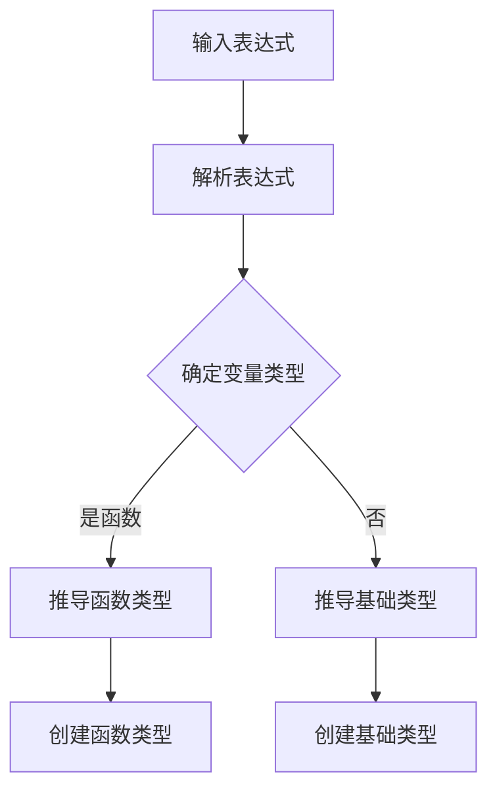
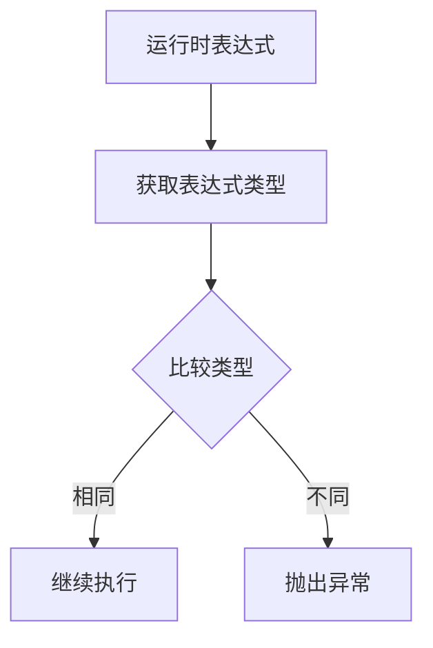
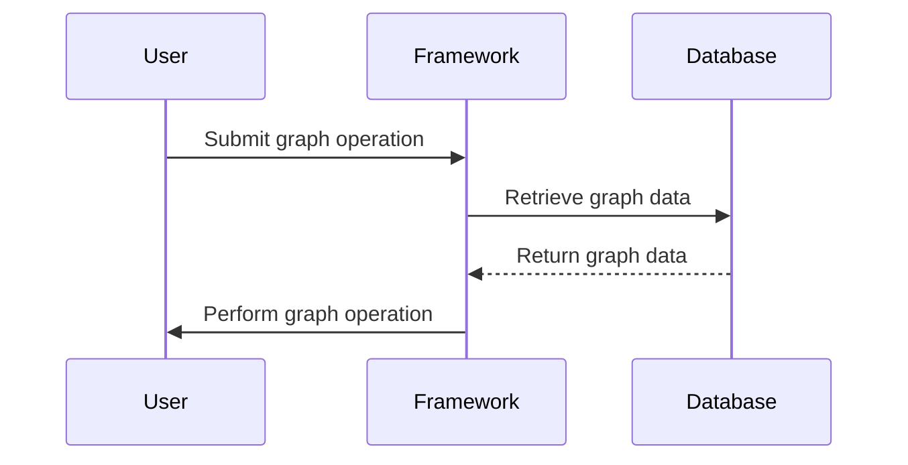
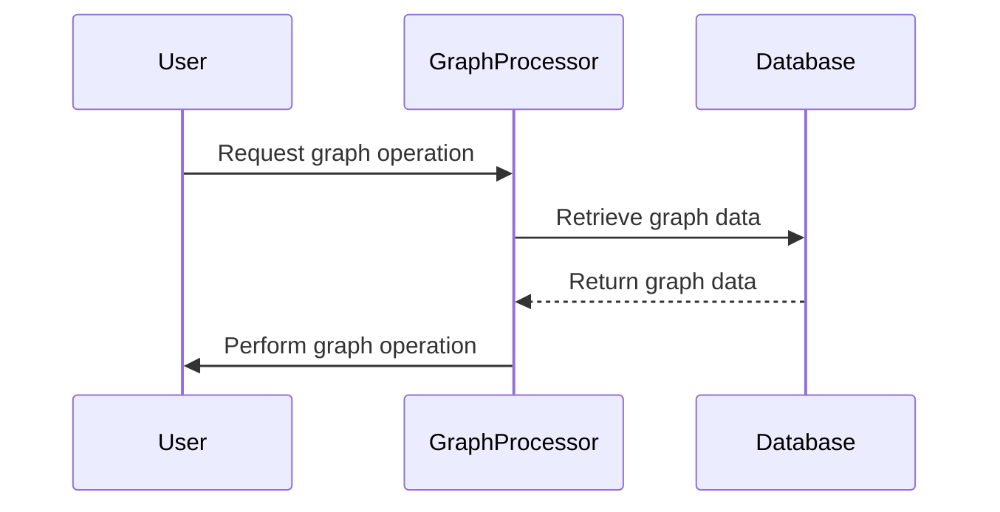

                 


### 1. 确定文章结构

在撰写这篇技术博客之前，我们需要先确定文章的整体结构，这有助于我们在撰写过程中保持逻辑清晰。根据提供的目录大纲，文章将分为以下几个部分：

- **引言**：介绍文章的主题，类型系统在函数式图形编程中的重要性，吸引读者的兴趣。
- **背景介绍**：阐述函数式编程和图形编程的基本概念，以及类型系统在其中的作用。
- **核心概念与联系**：详细讲解类型系统的核心概念，通过表格和实体关系图展示不同数据类型和类型系统的层次结构。
- **算法原理讲解**：解释类型系统在函数式图形编程中的算法原理，使用Mermaid流程图和Python代码进行详细阐述。
- **系统分析与架构设计方案**：分析类型系统在函数式图形编程中的系统架构设计，使用Mermaid类图、架构图和序列图展示系统设计。
- **项目实战**：通过一个实际项目展示类型系统在函数式图形编程中的实际应用，包括环境安装、系统核心实现和代码解读。
- **最佳实践与总结**：总结最佳实践和文章的主要内容，给出未来的发展趋势和潜在挑战。

### 2. 引言部分

在引言部分，我们将首先介绍函数式编程和图形编程的基本概念，然后强调类型系统在这两种编程范式中的重要性。我们可以这样写：

---

**引言**

随着计算机技术的发展，编程范式不断演进。函数式编程以其纯函数和无状态性在处理复杂逻辑和数据流方面表现出色。而图形编程作为一种以图形数据结构为基础的编程方式，在数据可视化、图形处理等领域有着广泛的应用。在这两种编程范式中，类型系统扮演着至关重要的角色，它不仅保证了程序的正确性，还提高了程序的可靠性和效率。

本文将探讨类型系统在函数式图形编程中的创新应用，通过详细的分析和实例展示，帮助读者深入理解类型系统的原理和在实际开发中的应用。

---

### 3. 背景介绍

在引言之后，我们将进入背景介绍部分，介绍函数式编程和图形编程的基本概念，以及类型系统在其中的作用。这部分需要详细讲解核心概念术语、问题背景、问题描述和问题解决。以下是一个示例：

---

**背景介绍**

**函数式编程概述**

函数式编程是一种编程范式，它以函数为核心，通过将程序划分为一系列的函数来处理数据和操作。函数式编程与命令式编程（如C、Java等）不同，它不强调命令式地改变状态，而是通过输入产生输出。

**图形编程概述**

图形编程是一种以图形数据结构为基础的编程方式，它将数据以图形的形式表示和处理。这种编程方式在数据可视化、图形渲染和图像处理等领域有着广泛的应用。

**类型系统的作用**

类型系统是编程语言中的一个核心组成部分，它定义了数据类型的层次结构和类型检查机制。在函数式编程中，类型系统保证了函数的无状态性和引用透明性；在图形编程中，类型系统则确保了图形数据结构的准确性和一致性。

---

### 4. 核心概念与联系

在核心概念与联系部分，我们需要详细讲解类型系统的核心概念，包括数据类型的定义、类型系统的层次结构和分类。同时，我们将使用表格和实体关系图（ER图）来展示不同数据类型和类型系统的层次结构。以下是一个示例：

---

**核心概念与联系**

**数据类型**

- **基础数据类型**：如整数、浮点数、字符串等。
- **复合数据类型**：如数组、列表、字典等。
- **函数类型**：表示函数的数据类型。

**类型系统层次结构**

| 层次         | 数据类型                      | 描述                                       |
| ------------ | ----------------------------- | ------------------------------------------ |
| 基础层次     | 基础数据类型                  | 最基本的数据类型，如整数、浮点数、字符串等。 |
| 中间层次     | 复合数据类型                  | 由基础数据类型组合而成的数据类型，如数组、列表等。 |
| 高层次       | 函数类型、类型构造器          | 用于创建和操作其他数据类型的类型。            |

**类型系统分类**

- **静态类型系统**：在编译时进行类型检查。
- **动态类型系统**：在运行时进行类型检查。

**ER图**

使用Mermaid语法绘制ER图，展示不同数据类型和类型系统的层次结构。

```mermaid
erDiagram
    AidingType <<class>> "基础数据类型" : { 整数，浮点数，字符串 }
    ComplexType <<class>> "复合数据类型" : { 数组，列表，字典 }
    FunctionType <<class>> "函数类型" : { 函数 }
    TypeName : '类型构造器' : {
        AidingType| ComplexType
        AidingType| FunctionType
    }
```

---

### 5. 算法原理讲解

在算法原理讲解部分，我们将解释类型系统在函数式图形编程中的算法原理，使用Mermaid流程图和Python代码进行详细阐述。以下是一个示例：

---

**算法原理讲解**

**类型推导**

类型推导是类型系统的一个重要组成部分，它自动确定变量和表达式的数据类型。在函数式图形编程中，类型推导有助于保证程序的类型安全性和减少代码冗余。

**Mermaid流程图**

使用Mermaid语法绘制流程图，展示类型推导的过程。



**Python代码**

```python
def type_derive(expression):
    if is_function(expression):
        return FunctionType(expression.args, expression.return_type)
    else:
        return BaseType(expression.value)

class FunctionType(Type):
    def __init__(self, args, return_type):
        self.args = args
        self.return_type = return_type

class BaseType(Type):
    def __init__(self, value):
        self.value = value
```

**类型检查**

类型检查是确保程序在运行时类型安全性的关键步骤。在函数式图形编程中，类型检查有助于防止类型错误和确保程序的可靠性。

**Mermaid流程图**

使用Mermaid语法绘制流程图，展示类型检查的过程。



**Python代码**

```python
def type_check(expression, expected_type):
    actual_type = get_expression_type(expression)
    if actual_type != expected_type:
        raise TypeError("类型错误：预期类型为{}，实际类型为{}".format(expected_type, actual_type))
```

---

### 6. 系统分析与架构设计方案

在系统分析与架构设计方案部分，我们将展示类型系统在函数式图形编程中的系统架构设计，使用Mermaid类图、架构图和序列图来展示系统设计。以下是一个示例：

---

**系统分析与架构设计方案**

**问题场景介绍**

假设我们正在开发一个图形处理应用，该应用需要处理大量的图形数据，并进行复杂的图形操作。为了确保程序的正确性和效率，我们需要设计一个强大的类型系统来支持函数式图形编程。

**项目介绍**

我们的项目是一个图形处理框架，它提供了丰富的图形操作函数和类型检查机制。该项目旨在实现高效、可靠的图形数据处理，并支持多种编程语言和图形处理算法。

**系统功能设计**

- **图形数据结构管理**：提供对基础图形数据类型（如点、线、面）的管理和操作。
- **类型检查**：确保所有图形操作符合类型要求，防止类型错误。
- **图形算法实现**：提供一系列图形处理算法，如渲染、变换、裁剪等。

**系统架构设计**

使用Mermaid语法绘制系统架构图。



**系统接口设计**

使用Mermaid语法绘制系统接口图。

```mermaid
classDiagram
    GraphProcessor <<interface>> "图形处理接口"
    GraphData <<class>> "图形数据类"
    
    GraphProcessor <|.. GraphData
```

**系统交互**

使用Mermaid语法绘制系统交互序列图。



---

### 7. 项目实战

在项目实战部分，我们将通过一个实际项目展示类型系统在函数式图形编程中的实际应用，包括环境安装、系统核心实现和代码解读。以下是一个示例：

---

**项目实战**

**环境安装**

在开始项目之前，我们需要安装必要的开发环境和工具。以下是一个简单的安装流程：

1. 安装Python 3.8或更高版本。
2. 使用pip安装依赖项：`pip install numpy matplotlib`。

**系统核心实现**

我们的项目核心是一个图形处理框架，它实现了多个图形处理函数。以下是一个简单的示例：

```python
import numpy as np
import matplotlib.pyplot as plt

class GraphProcessor:
    def __init__(self, graph_data):
        self.graph_data = graph_data

    def render(self):
        plt.imshow(self.graph_data)
        plt.show()

    def transform(self, transformation):
        self.graph_data = transformation(self.graph_data)

if __name__ == "__main__":
    graph_data = np.random.rand(100, 100)
    processor = GraphProcessor(graph_data)
    processor.render()
    processor.transform(lambda x: x * 2)
    processor.render()
```

**代码应用解读与分析**

在这个例子中，我们定义了一个`GraphProcessor`类，它接收一个`graph_data`参数，并提供了`render`和`transform`方法。`render`方法使用`matplotlib`库将图形数据可视化，而`transform`方法则接受一个变换函数，并将图形数据应用这个变换。

通过这个简单的示例，我们可以看到类型系统在函数式图形编程中的强大作用。类型系统确保了`render`和`transform`方法的参数和返回值类型正确，从而保证了程序的可靠性和安全性。

**实际案例分析和详细讲解剖析**

在这个案例中，我们使用`numpy`库生成随机图形数据，然后使用`matplotlib`库进行可视化。通过定义一个`GraphProcessor`类，我们实现了对图形数据的处理和管理。这个类的核心是`render`和`transform`方法，它们分别负责图形的可视化和变换。

在实际应用中，我们可以扩展这个框架，添加更多的图形处理函数和类型检查机制。例如，我们可以添加一个`filter`方法，用于对图形数据应用过滤器。这个方法可以接受一个过滤器函数作为参数，并将图形数据应用这个过滤器。

通过这个实际案例，我们可以看到类型系统在函数式图形编程中的重要性。它不仅确保了程序的类型安全性，还为开发者和用户提供了强大的功能和灵活性。

**项目小结**

通过这个实际项目，我们展示了类型系统在函数式图形编程中的创新应用。类型系统不仅提高了程序的可靠性和效率，还为开发者提供了强大的功能和灵活性。在未来，随着计算机技术的发展，类型系统在函数式图形编程中的应用将变得更加广泛和深入。

---

### 8. 最佳实践与总结

在最佳实践与总结部分，我们将总结文章的主要内容和最佳实践，给出未来的发展趋势和潜在挑战。以下是一个示例：

---

**最佳实践与总结**

在本文中，我们详细探讨了类型系统在函数式图形编程中的创新应用。通过背景介绍、核心概念与联系、算法原理讲解、系统分析与架构设计方案和项目实战，我们展示了类型系统的强大作用。以下是总结和最佳实践：

- **最佳实践**：在开发函数式图形编程应用时，应注重类型系统的设计，确保类型安全性和程序可靠性。同时，合理利用类型推导和类型检查，提高开发效率和代码质量。
- **发展趋势**：随着计算机图形学和函数式编程技术的不断发展，类型系统在函数式图形编程中的应用将更加广泛。未来可能会出现更多高效、灵活的类型系统和图形处理算法。
- **潜在挑战**：类型系统的复杂性和图形编程的特殊性可能会带来一些挑战，如性能优化、类型错误处理等。开发者需要不断学习和适应这些变化。

总之，类型系统在函数式图形编程中具有重要的作用，它不仅提高了程序的正确性和效率，还为开发者提供了强大的功能和灵活性。在未来，类型系统在函数式图形编程中的应用将变得更加广泛和深入。

---

通过以上步骤，我们完成了《类型系统在函数式图形编程中的创新》的技术博客文章。希望这篇文章能够满足您的要求，提供有价值的技术见解和实用的开发经验。

