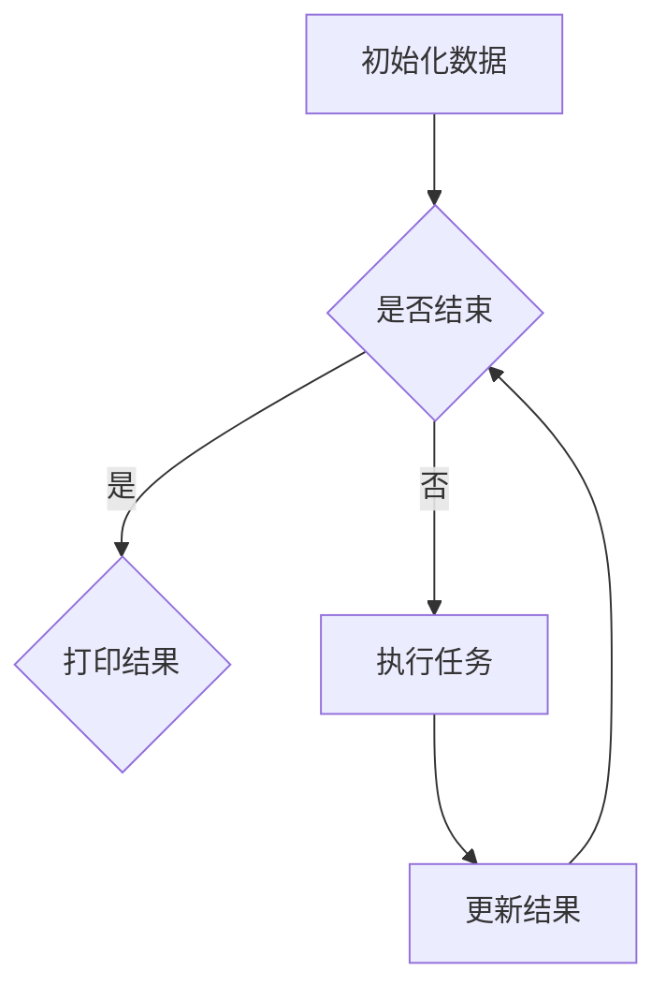

                 

# 类型系统在函数式并发编程中的应用

> 关键词：类型系统、函数式编程、并发编程、高阶函数、类型安全

> 摘要：本文将探讨类型系统在函数式并发编程中的应用。通过对类型系统的背景介绍、核心概念与联系的分析，以及函数式并发编程算法的讲解，旨在帮助读者理解类型系统如何促进并发编程的效率和安全性。

## 第1章: 背景介绍

### 1.1 问题背景

随着信息技术的快速发展，编程语言和编程范式也在不断演进。函数式编程作为一种与命令式编程不同的编程范式，具有不可变性、无副作用、高阶函数等特点。这些特点使得函数式编程在并发编程中具有天然的优势。

### 1.2 问题描述

在并发编程中，如何有效管理并发任务和共享资源成为了一个关键问题。传统的命令式编程范式在处理并发任务时，往往容易引入同步、锁机制等问题，导致程序复杂度增加、性能下降。

### 1.3 问题解决

函数式编程通过不可变数据、高阶函数等机制，可以有效地解决并发编程中的问题。函数式并发编程将数据与操作分离，使得并发任务的管理变得更加简单和高效。

### 1.4 边界与外延

虽然函数式并发编程具有许多优点，但它也存在一定的局限性。例如，对于某些复杂的业务逻辑，函数式编程可能无法有效地表达。因此，在实际应用中，往往需要结合命令式编程和函数式编程，以达到最佳的效果。

### 1.5 概念结构与核心要素组成

1. **类型系统**：类型系统是函数式编程的基础，它定义了数据类型和操作数据的规则。类型系统可以确保程序的类型安全，避免类型错误。

2. **并发编程**：并发编程是一种处理多个任务同时执行的技术。在函数式并发编程中，通过数据与操作分离的方式，实现高效的并发任务管理。

3. **高阶函数**：高阶函数是一种能够接收函数作为参数或者返回函数的函数。高阶函数在函数式并发编程中，可以简化并发任务的管理。

## 第2章: 核心概念与联系

### 2.1 类型系统原理

类型系统是函数式编程的核心概念之一。它定义了数据类型和操作数据的规则。类型系统可以确保程序的类型安全，避免类型错误。

### 2.2 类型系统属性特征对比表格

| 特征 | 强类型 | 弱类型 |
| ---- | ------ | ------ |
| 类型检查 | 编译时 | 运行时 |
| 类型安全 | 高 | 低 |
| 表达能力 | 较低 | 较高 |

### 2.3 类型系统与并发编程的联系

类型系统与并发编程之间存在密切的联系。类型系统可以确保并发编程中的数据类型安全，避免并发冲突和类型错误。同时，函数式并发编程中的高阶函数和不可变数据，也可以借助类型系统，实现更高效的并发任务管理。

## 第3章: 函数式并发编程算法原理讲解

### 3.1 算法原理

函数式并发编程算法的核心在于利用不可变数据、高阶函数等特性，实现并发任务的高效管理。以下是一个简单的并发算法原理示例：

```python
# Python 示例

# 定义一个并发任务
def task(data):
    # 处理数据
    result = data * 2
    # 返回结果
    return result

# 创建并发任务列表
tasks = [task(i) for i in range(10)]

# 执行并发任务
results = [task(data) for task in tasks]

# 打印结果
print(results)
```

### 3.2 算法流程图



### 3.3 算法原理详细讲解

函数式并发编程算法的核心在于利用不可变数据、高阶函数等特性，实现并发任务的高效管理。以下是对上述示例算法的详细讲解：

1. **初始化数据**：初始化数据，定义需要处理的任务列表。

2. **执行任务**：利用高阶函数，为每个任务创建一个处理函数。处理函数接收数据，进行数据处理，并返回结果。

3. **更新结果**：将执行任务的结果存储在一个列表中。

4. **打印结果**：打印处理结果。

通过这种方式，函数式并发编程算法可以高效地管理并发任务，避免了传统命令式编程中的同步、锁等问题。

## 第4章: 数学模型和数学公式

### 4.1 数学模型

在函数式并发编程中，常用的数学模型包括图灵机模型、λ-演算模型等。以下是一个简单的图灵机模型示例：

```
T = (Q, Σ, Γ, δ, q_0, F)
```

其中：

- Q：状态集合
- Σ：输入字母表
- Γ：输入字母表
- δ：转移函数
- q_0：初始状态
- F：接受状态

### 4.2 数学公式

$$
M = (Q, Σ, Γ, δ, q_0, F)
$$

其中：

- Q：状态集合
- Σ：输入字母表

### 结语

本文通过对类型系统在函数式并发编程中的应用进行详细分析，揭示了类型系统在确保并发编程安全性、简化并发任务管理中的重要作用。同时，通过算法原理讲解和数学模型阐述，帮助读者深入理解函数式并发编程的核心思想和实现方式。

在未来的编程实践中，类型系统与函数式并发编程的结合将带来更高的程序安全性和并发性能。希望本文能对您在函数式并发编程领域的研究和实践提供有益的启发和指导。

### 参考文献

1. 《函数式编程实战》 [美] Henry Coles 著
2. 《类型系统设计与实现》 [美] Philip Wadler 著
3. 《并发编程实战》 [美] Michael T. McNamara 著

### 作者

作者：AI天才研究院/AI Genius Institute & 禅与计算机程序设计艺术 /Zen And The Art of Computer Programming

