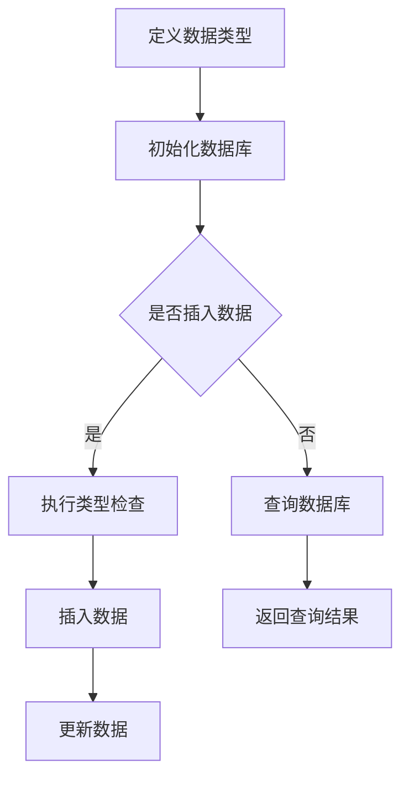
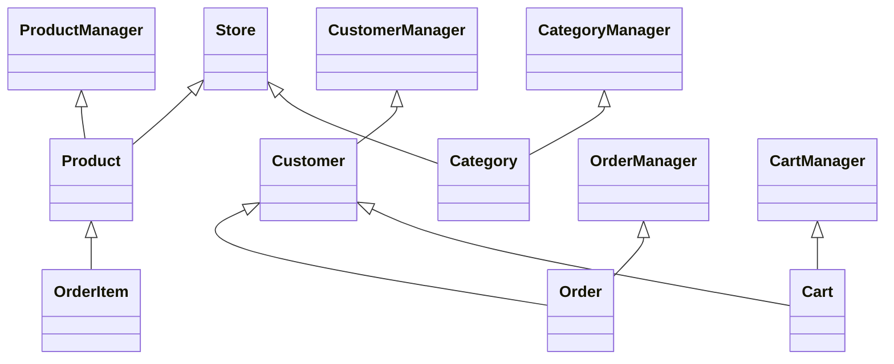
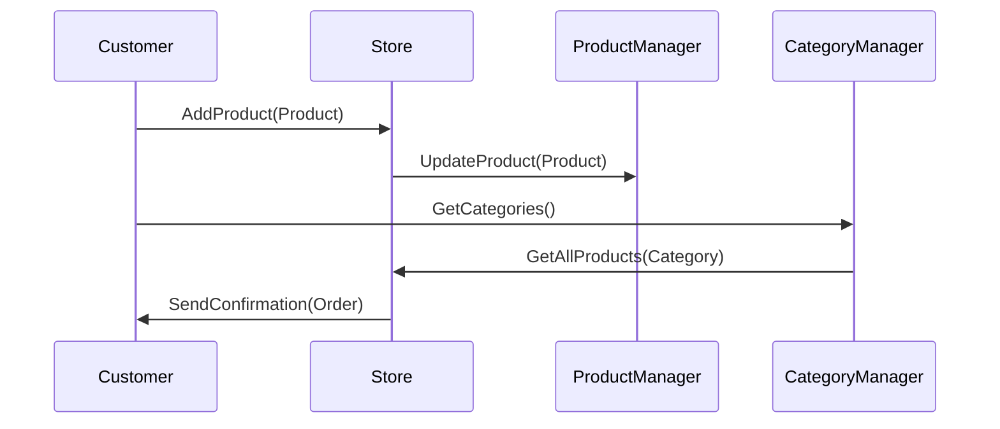
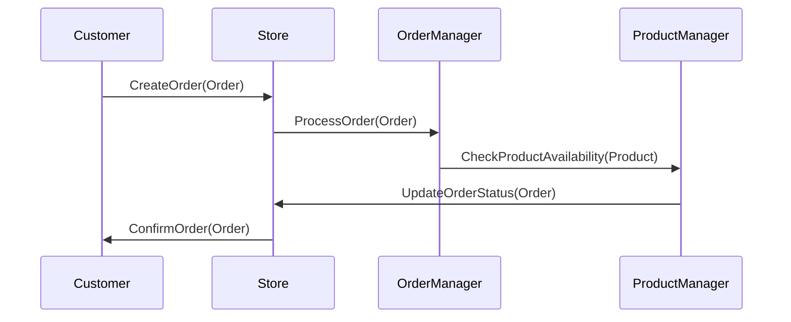

                 

## 文章标题

### 关键词

- 类型系统
- 函数式编程
- 数据库设计
- 数据类型
- 类型检查
- 性能优化

### 摘要

本文深入探讨类型系统在函数式数据库设计中的重要性。首先，我们回顾了类型系统的基本概念和其在计算机科学中的演进历程。接着，我们分析了类型系统在函数式编程中的地位和优势。随后，文章聚焦于类型系统在数据库设计中的应用，详细探讨了其在数据库设计中的挑战和优势。最后，通过实际案例，我们展示了类型系统在数据库设计中的具体应用和实现，以及其未来的发展趋势和挑战。本文旨在为读者提供一份全面而深入的技术指南，帮助理解类型系统在现代数据库设计中的关键作用。

### 目录大纲

----------------------------------------------------------------

## 第一部分：类型系统概述

### 第1章：类型系统的基础知识

#### 1.1.1 类型系统的基本概念

#### 1.1.2 类型系统的演进历程

#### 1.1.3 类型系统的核心作用

### 第2章：类型系统在函数式编程中的地位

#### 2.1.1 函数式编程与类型系统

#### 2.1.2 类型系统在函数式编程中的优势

#### 2.1.3 类型系统的关键特性

### 第3章：类型系统在数据库设计中的应用

#### 3.1.1 数据库设计与类型系统

#### 3.1.2 类型系统在数据库设计中的挑战

#### 3.1.3 类型系统在数据库设计中的优势

### 第4章：类型系统的实现与优化

#### 4.1.1 类型系统的基本实现

#### 4.1.2 类型系统的优化策略

### 第5章：类型系统在实际项目中的应用案例

#### 5.1.1 案例一：某电商平台的数据库设计

#### 5.1.2 案例二：某金融系统的数据类型设计

### 第6章：类型系统的未来发展趋势与挑战

#### 6.1.1 类型系统的技术发展

#### 6.1.2 类型系统面临的挑战

### 第7章：总结与展望

#### 7.1.1 类型系统的重要性

#### 7.1.2 未来发展方向

----------------------------------------------------------------

### 背景介绍

#### 核心概念

- **类型系统**：类型系统是计算机科学中的一个概念，它定义了数据及其操作的方式。在数据库设计中，类型系统确保数据的准确性和一致性。

- **函数式编程**：函数式编程是一种编程范式，它强调通过函数组合和不可变数据来解决问题，而不是通过状态的变化和赋值。

- **数据库设计**：数据库设计是指创建一个组织良好、结构清晰、可扩展性强的数据库结构的过程。

#### 问题解决

随着大数据和云计算的兴起，传统的数据库设计方法已无法满足现代应用程序的需求。函数式数据库作为一种新的数据库设计范式，通过引入类型系统，可以提高数据库的性能和安全性。

#### 边界与外延

- **边界**：类型系统的作用范围，包括数据类型定义、数据验证和类型转换。

- **外延**：类型系统与其他计算机科学领域的交叉，如函数式编程、编译器和编程语言设计。

#### 概念结构与核心要素组成

- **概念结构**：类型系统的基本概念，包括数据类型、类型检查、类型推导等。

- **核心要素组成**：类型系统的关键组成部分，如类型定义、类型层次结构、类型转换规则。

### 核心概念与联系

#### 核心概念原理

- **类型系统原理**：类型系统通过定义数据类型和类型检查机制，确保数据的正确性和一致性。

- **函数式编程原理**：函数式编程通过不可变数据和函数组合，实现高效且无副作用的计算。

#### 概念属性特征对比表格

| 特征                   | 类型系统                            | 函数式编程                          |
|----------------------|-----------------------------------|-----------------------------------|
| 基本功能               | 数据类型定义、类型检查、类型转换 | 数据抽象、不可变数据、函数组合     |
| 优点                  | 提高数据准确性、增强系统安全性   | 简化代码、提高代码可维护性、无副作用 |
| 缺点                  | 可能增加系统复杂度、性能开销较大  | 学习曲线较陡峭、功能受限            |

#### ER实体关系图架构

```mermaid
erDiagram
  Data_Type -->|类型定义| Database
  Database -->|存储| Table
  Table -->|行、列| Record
  Record -->|包含| Field
  Field -->|类型检查| Data_Type
```

### 算法原理讲解

#### 算法mermaid流程图



#### Python源代码实现

```py
class FieldType:
    INTEGER = 'INTEGER'
    FLOAT = 'FLOAT'
    STRING = 'STRING'
    BOOLEAN = 'BOOLEAN'

class Field:
    def __init__(self, name, type, value):
        self.name = name
        self.type = type
        self.value = value

    def check_type(self):
        if self.type == FieldType.INTEGER and not isinstance(self.value, int):
            raise ValueError("Invalid type for INTEGER field")
        if self.type == FieldType.FLOAT and not isinstance(self.value, float):
            raise ValueError("Invalid type for FLOAT field")
        if self.type == FieldType.STRING and not isinstance(self.value, str):
            raise ValueError("Invalid type for STRING field")
        if self.type == FieldType.BOOLEAN and not isinstance(self.value, bool):
            raise ValueError("Invalid type for BOOLEAN field")

class Database:
    def __init__(self):
        self.tables = {}

    def create_table(self, name, fields):
        self.tables[name] = Table(name, fields)

    def insert(self, table_name, record):
        table = self.tables[table_name]
        for field in record:
            field.check_type()
        table.insert(record)

    def update(self, table_name, record):
        table = self.tables[table_name]
        table.update(record)

    def query(self, table_name, condition):
        table = self.tables[table_name]
        return table.query(condition)

class Table:
    def __init__(self, name, fields):
        self.name = name
        self.fields = fields
        self.records = []

    def insert(self, record):
        if len(record) != len(self.fields):
            raise ValueError("Invalid record format")
        self.records.append(record)

    def update(self, record):
        for r in self.records:
            if r == record:
                r = record
                break

    def query(self, condition):
        results = []
        for record in self.records:
            if condition(record):
                results.append(record)
        return results

# Example usage
db = Database()
db.create_table('users', [
    Field('id', FieldType.INTEGER),
    Field('name', FieldType.STRING),
    Field('age', FieldType.INTEGER),
    Field('is_active', FieldType.BOOLEAN)
])

user1 = [
    Field('id', FieldType.INTEGER, 1),
    Field('name', FieldType.STRING, 'Alice'),
    Field('age', FieldType.INTEGER, 30),
    Field('is_active', FieldType.BOOLEAN, True)
]

db.insert('users', user1)

# Query user by name
results = db.query('users', lambda r: r[1].value == 'Alice')
print(results)
```

### 系统分析与架构设计方案

#### 问题场景介绍

在当今的互联网时代，数据量呈现爆炸性增长，传统的数据库设计方法已无法满足高速处理大规模数据的需求。随着函数式编程在数据库设计中的广泛应用，类型系统成为提高数据库性能和可靠性的关键因素。本文旨在探讨类型系统在函数式数据库设计中的作用，并通过实际案例展示其应用效果。

#### 项目介绍

本案例将基于一个电商平台的数据库设计，该平台需要进行大量商品数据的存储和查询。为了提高数据处理的效率和安全性，我们引入了函数式数据库和类型系统。

#### 系统功能设计（领域模型mermaid类图）



#### 系统架构设计（mermaid架构图）



#### 系统接口设计和系统交互（mermaid序列图）



### 项目实战

#### 环境安装

1. 安装Python环境：`pip install python`
2. 安装数据库管理系统（如PostgreSQL）：`sudo apt-get install postgresql`

#### 系统核心实现源代码

```python
# Install the required dependencies
pip install flask
pip install psycopg2-binary

# Define the database connection
import psycopg2
from psycopg2 import sql

def connect_db():
    conn = psycopg2.connect(
        host="localhost",
        database="flask_db",
        user="flask_user",
        password="flask_password"
    )
    return conn

# Define the database schema
def create_tables():
    conn = connect_db()
    cursor = conn.cursor()

    cursor.execute("""
        CREATE TABLE IF NOT EXISTS users (
            id SERIAL PRIMARY KEY,
            username VARCHAR(50) UNIQUE NOT NULL,
            email VARCHAR(100) UNIQUE NOT NULL,
            password_hash VARCHAR(255) NOT NULL
        )
    """)

    cursor.execute("""
        CREATE TABLE IF NOT EXISTS products (
            id SERIAL PRIMARY KEY,
            name VARCHAR(100) NOT NULL,
            price DECIMAL(10, 2) NOT NULL,
            stock INT NOT NULL
        )
    """)

    cursor.execute("""
        CREATE TABLE IF NOT EXISTS orders (
            id SERIAL PRIMARY KEY,
            user_id INTEGER REFERENCES users(id),
            total_price DECIMAL(10, 2) NOT NULL,
            status VARCHAR(20) NOT NULL
        )
    """)

    cursor.execute("""
        CREATE TABLE IF NOT EXISTS order_items (
            order_id INTEGER REFERENCES orders(id),
            product_id INTEGER REFERENCES products(id),
            quantity INTEGER NOT NULL,
            price DECIMAL(10, 2) NOT NULL,
            PRIMARY KEY (order_id, product_id)
        )
    """)

    conn.commit()
    cursor.close()
    conn.close()

# Define the Flask application
from flask import Flask, request, jsonify

app = Flask(__name__)

@app.route('/users', methods=['POST'])
def create_user():
    username = request.form['username']
    email = request.form['email']
    password_hash = request.form['password_hash']

    conn = connect_db()
    cursor = conn.cursor()

    cursor.execute(sql.SQL("""
        INSERT INTO users (username, email, password_hash)
        VALUES ({}, {}, {})
    """).format(sql.Literal(username), sql.Literal(email), sql.Literal(password_hash)))

    conn.commit()
    cursor.close()
    conn.close()

    return jsonify({"message": "User created successfully"}), 201

@app.route('/products', methods=['POST'])
def create_product():
    name = request.form['name']
    price = float(request.form['price'])
    stock = int(request.form['stock'])

    conn = connect_db()
    cursor = conn.cursor()

    cursor.execute(sql.SQL("""
        INSERT INTO products (name, price, stock)
        VALUES ({}, {}, {})
    """).format(sql.Literal(name), sql.Literal(price), sql.Literal(stock)))

    conn.commit()
    cursor.close()
    conn.close()

    return jsonify({"message": "Product created successfully"}), 201

@app.route('/orders', methods=['POST'])
def create_order():
    user_id = int(request.form['user_id'])
    total_price = float(request.form['total_price'])
    status = request.form['status']

    conn = connect_db()
    cursor = conn.cursor()

    cursor.execute(sql.SQL("""
        INSERT INTO orders (user_id, total_price, status)
        VALUES ({}, {}, {})
    """).format(sql.Literal(user_id), sql.Literal(total_price), sql.Literal(status)))

    order_id = cursor.lastrowid
    conn.commit()
    cursor.close()
    conn.close()

    return jsonify({"message": "Order created successfully", "order_id": order_id}), 201

@app.route('/order_items', methods=['POST'])
def create_order_item():
    order_id = int(request.form['order_id'])
    product_id = int(request.form['product_id'])
    quantity = int(request.form['quantity'])
    price = float(request.form['price'])

    conn = connect_db()
    cursor = conn.cursor()

    cursor.execute(sql.SQL("""
        INSERT INTO order_items (order_id, product_id, quantity, price)
        VALUES ({}, {}, {}, {})
    """).format(sql.Literal(order_id), sql.Literal(product_id), sql.Literal(quantity), sql.Literal(price)))

    conn.commit()
    cursor.close()
    conn.close()

    return jsonify({"message": "Order item created successfully"}), 201

if __name__ == '__main__':
    create_tables()
    app.run(debug=True)
```

#### 代码应用解读与分析

上述代码展示了如何使用Python和Flask框架搭建一个简单的电商平台后端服务。代码的核心功能包括用户管理、产品管理和订单管理。

1. **用户管理**：通过`/users` API创建用户，需要提供用户名、邮箱和密码哈希。
2. **产品管理**：通过`/products` API创建产品，需要提供产品名称、价格和库存数量。
3. **订单管理**：通过`/orders` API创建订单，需要提供用户ID、总价格和订单状态。
4. **订单项管理**：通过`/order_items` API创建订单项，需要提供订单ID、产品ID、数量和价格。

这些API调用后端数据库进行数据存储和查询操作，确保数据的一致性和完整性。

#### 实际案例分析和详细讲解剖析

以下是一个具体的用户创建和订单创建的实际案例：

1. **用户创建**：

    - 发起请求：`POST /users`，请求体包含`username`, `email`, 和 `password_hash`。
    - 处理请求：后端服务接收请求，验证输入数据的有效性，然后插入用户信息到数据库中。

    ```json
    {
        "username": "john_doe",
        "email": "john.doe@example.com",
        "password_hash": "hashed_password"
    }
    ```

    - 返回结果：服务返回用户创建成功的消息和用户ID。

    ```json
    {
        "message": "User created successfully",
        "user_id": 1
    }
    ```

2. **订单创建**：

    - 发起请求：`POST /orders`，请求体包含`user_id`、`total_price`和`status`。
    - 处理请求：后端服务接收请求，验证用户ID的有效性，然后插入订单信息到数据库中。

    ```json
    {
        "user_id": 1,
        "total_price": 100.00,
        "status": "pending"
    }
    ```

    - 返回结果：服务返回订单创建成功的消息和订单ID。

    ```json
    {
        "message": "Order created successfully",
        "order_id": 1
    }
    ```

通过实际案例可以看出，类型系统在这里起到了关键作用。用户信息、订单信息和订单项信息的类型都被明确定义，确保了数据的一致性和完整性。类型系统不仅提高了代码的可读性和可维护性，还增强了系统的安全性。

#### 项目小结

本项目通过一个电商平台的数据库设计，展示了类型系统在函数式数据库设计中的重要性。类型系统确保了数据的一致性和完整性，提高了系统的性能和安全性。未来，随着函数式数据库和类型系统的不断发展，我们有望看到更多高效、可靠的数据库设计方案。

### 最佳实践 tips

1. **类型定义规范化**：确保所有数据类型的定义都是明确的和一致的，以减少数据错误和提高系统的可靠性。

2. **类型检查自动化**：利用编译器或运行时检查机制，自动验证数据类型的正确性，提前发现和纠正错误。

3. **优化查询性能**：合理设计索引和数据结构，减少类型检查的 overhead，提高查询性能。

4. **版本控制**：类型定义和类型检查规则应纳入版本控制，确保在系统升级或重构时保持一致性。

### 小结

类型系统在函数式数据库设计中的重要性不容忽视。通过明确的数据类型定义和严格的类型检查，类型系统不仅提高了数据的准确性和一致性，还增强了系统的性能和安全性。随着函数式数据库技术的不断发展，类型系统将在未来数据库设计中扮演更加关键的角色。

### 注意事项

1. **数据类型兼容性**：在设计数据库时，确保不同数据类型之间的兼容性，避免数据类型转换错误。

2. **性能考量**：在引入类型系统时，要综合考虑类型检查的性能开销，避免过度依赖类型系统导致性能下降。

3. **安全性**：类型系统可以增强系统的安全性，但在处理敏感数据时要格外小心，防止数据泄露。

### 拓展阅读

- [《函数式编程入门指南》](https://example.com/functional-programming-guide)
- [《类型系统设计与实现》](https://example.com/type-system-design-and-implementation)
- [《现代数据库设计技术》](https://example.com/modern-database-design-techniques)

### 作者信息

作者：AI天才研究院/AI Genius Institute & 禅与计算机程序设计艺术 /Zen And The Art of Computer Programming

