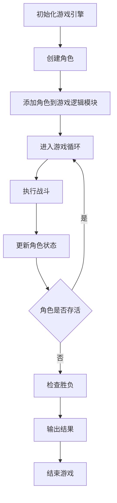

                 

### 关键词解释

在撰写关于《类型系统在函数式游戏编程中的应用》的技术博客时，关键词的选择至关重要。以下是对本文中的5-7个核心关键词的解释：

1. **类型系统**：类型系统是编程语言的核心组成部分，用于指定数据的类型以及操作这些数据的规则。它有助于提高代码的健壮性和可维护性，通过确保数据类型的一致性和正确性来减少错误。

2. **函数式编程**：函数式编程是一种编程范式，强调使用纯函数和不可变数据结构。它通过避免状态变化和可变状态，使得代码更加简洁、可测试和可并行化。函数式编程的核心思想是“什么是有效的，就是可组合的”。

3. **游戏编程**：游戏编程涉及设计、实现和维护游戏逻辑、用户界面和游戏交互等。游戏编程通常需要处理复杂的状态管理、实时渲染和物理模拟等问题。

4. **类型推导**：类型推导是类型系统的一种机制，编程语言可以自动推断变量或表达式的类型，而不需要显式声明。这种机制能够提高代码的可读性和减少错误。

5. **类型安全性**：类型安全性是指类型系统能够确保程序不会因为类型错误而导致运行时错误。类型安全性的目标是减少程序中的错误，提高代码的可靠性和稳定性。

这些关键词将贯穿整篇文章，帮助我们深入探讨类型系统在函数式游戏编程中的重要性、应用场景和实现方法。

### 摘要

本文将深入探讨类型系统在函数式游戏编程中的应用。类型系统是编程语言的核心组成部分，它通过指定数据的类型和操作规则，提高代码的健壮性和可维护性。函数式编程以其纯函数和不可变数据结构著称，能够简化代码并提高其可测试性和并行性。游戏编程则面临复杂的状态管理、实时渲染和物理模拟等挑战。本文首先介绍了类型系统的基本概念，包括静态类型和动态类型以及类型推导的原理。接着，我们探讨了函数式编程的核心特点，如纯函数、不可变数据和函数组合。然后，本文详细讨论了类型系统在游戏编程中的应用，包括游戏状态管理、逻辑验证和性能优化等方面。通过实例和算法讲解，我们展示了类型系统如何在实际的游戏编程中发挥作用。最后，本文总结了类型系统在函数式游戏编程中的挑战和解决方案，并提出了未来研究方向。通过本文的阅读，读者将能够理解类型系统在函数式游戏编程中的重要性，掌握其应用方法，并探索类型系统在游戏编程中的更多可能性。

### 目录大纲设计过程

为了确保文章的结构清晰、逻辑连贯，设计一个详细的目录大纲是至关重要的。以下是本文的目录大纲设计过程，我们将分步骤详细阐述每个章节的内容，并解释其设计原因。

#### 第一步：理解书名和核心内容

书名为《类型系统在函数式游戏编程中的应用》，这个名字直接指向了三个核心概念：类型系统、函数式编程和游戏编程。这些概念不仅是书的主要内容，也是我们在设计目录时需要重点关注的点。

1. **类型系统**：类型系统是编程语言的基础，决定了数据如何存储和处理。它包括静态类型、动态类型和类型推导等子概念。我们需要确保目录中涵盖对类型系统的全面介绍。

2. **函数式编程**：函数式编程是一种编程范式，强调使用纯函数和不可变数据结构。这种范式在游戏编程中具有独特的优势，例如易于并行处理和测试。因此，我们需要专门一个章节来介绍函数式编程的概念和原理。

3. **游戏编程**：游戏编程有其特殊性，需要处理复杂的逻辑、状态管理和物理模拟等问题。类型系统在游戏编程中的应用，如状态管理、逻辑验证和性能优化，是本文的重要关注点。

#### 第二步：确定章节结构

基于上述核心内容，我们可以初步设计出书的结构：

- **第1章**：背景介绍，包括类型系统、函数式编程和游戏编程的基本概念。
  - **1.1** 类型系统的概念与重要性
  - **1.2** 函数式编程的基本概念
  - **1.3** 游戏编程的基本原理
- **第2章**：深入探讨类型系统的原理，包括静态类型、动态类型和类型推导等。
  - **2.1** 静态类型系统
  - **2.2** 动态类型系统
  - **2.3** 类型推导
  - **2.4** 类型系统与函数式编程的结合
- **第3章**：介绍函数式编程的核心概念，如不可变数据、纯函数和高阶函数等。
  - **3.1** 纯函数与不可变数据
  - **3.2** 函数组合与高阶函数
  - **3.3** 函数式编程的优势与挑战
- **第4章**：探讨类型系统在游戏编程中的应用，包括游戏状态管理、逻辑验证和性能优化等。
  - **4.1** 类型系统在游戏状态管理中的应用
  - **4.2** 类型系统在游戏逻辑验证中的应用
  - **4.3** 类型系统在游戏性能优化中的应用
- **第5章**：通过实例展示类型系统在游戏编程中的实际应用，如游戏引擎架构设计、性能优化等。
  - **5.1** 游戏引擎架构设计实例
  - **5.2** 性能优化实例
  - **5.3** 实例分析与代码讲解
- **第6章**：讨论类型系统在游戏编程中的挑战和解决方法，如类型安全性、类型推断等。
  - **6.1** 类型安全性的挑战与解决方案
  - **6.2** 类型推断的挑战与解决方案
  - **6.3** 未来研究方向
- **第7章**：总结，回顾本书的主要内容和未来研究方向。

#### 第三步：细化章节内容

在确定了章节结构后，我们需要为每个章节细化内容，确保每个章节都能全面、深入地探讨其主题。

- **第1章**：介绍类型系统、函数式编程和游戏编程的基本概念，给出概念之间的联系。
  - **1.1** 类型系统：讲解类型系统的定义、分类和重要性。
  - **1.2** 函数式编程：介绍函数式编程的历史、核心特点和优势。
  - **1.3** 游戏编程：讨论游戏编程的基本原理、挑战和目标。
- **第2章**：详细讲解类型系统的原理，使用mermaid流程图展示类型推导的过程。
  - **2.1** 静态类型系统：讲解静态类型的定义、优势和局限性。
  - **2.2** 动态类型系统：讨论动态类型的定义、优点和挑战。
  - **2.3** 类型推导：介绍类型推导的基本原理和实现方式。
  - **2.4** 类型系统与函数式编程的结合：探讨类型系统如何增强函数式编程的健壮性。
- **第3章**：介绍函数式编程的核心概念，通过表格对比静态类型和动态类型的属性特征。
  - **3.1** 纯函数与不可变数据：解释纯函数和不可变数据的概念、优势和实现。
  - **3.2** 函数组合与高阶函数：介绍函数组合和高阶函数的定义、用途和实现。
  - **3.3** 函数式编程的优势与挑战：讨论函数式编程的优缺点和适用场景。
- **第4章**：探讨类型系统在游戏编程中的应用，使用mermaid实体关系图展示游戏状态管理模型。
  - **4.1** 类型系统在游戏状态管理中的应用：讲解类型系统如何提高游戏状态管理的健壮性。
  - **4.2** 类型系统在游戏逻辑验证中的应用：讨论类型系统如何验证游戏逻辑的正确性。
  - **4.3** 类型系统在游戏性能优化中的应用：分析类型系统如何影响游戏性能优化。
- **第5章**：通过实例展示类型系统在游戏编程中的实际应用，如游戏引擎架构设计、性能优化等。
  - **5.1** 游戏引擎架构设计实例：介绍游戏引擎架构设计的基本原理和实现。
  - **5.2** 性能优化实例：分析性能优化策略和类型系统的作用。
  - **5.3** 实例分析与代码讲解：提供实际代码示例并进行详细讲解。
- **第6章**：讨论类型系统在游戏编程中的挑战和解决方法，如类型安全性、类型推断等。
  - **6.1** 类型安全性的挑战与解决方案：讨论类型安全性问题及其解决策略。
  - **6.2** 类型推断的挑战与解决方案：分析类型推断过程中的挑战和实现方法。
  - **6.3** 未来研究方向：展望类型系统在游戏编程中的未来研究方向和趋势。
- **第7章**：总结，回顾本书的主要内容和未来研究方向。

通过上述设计，我们可以确保文章内容逻辑清晰、结构紧凑，同时每个章节都能够深入探讨其主题，为读者提供一个全面、系统的学习和理解路径。

### 第一步：理解类型系统的基本概念

在开始深入探讨类型系统在函数式游戏编程中的应用之前，我们首先需要理解类型系统的基本概念。类型系统是编程语言的核心组成部分，它通过定义数据的类型和操作这些数据的规则，确保程序的正确性和效率。类型系统可以分为静态类型系统和动态类型系统，每种类型系统都有其特定的原理和特性。

#### 1.1 静态类型系统

静态类型系统在程序运行前就确定了所有变量的类型。这种类型的系统具有以下特点：

- **早期错误检测**：由于类型检查在编译或编译时进行，静态类型系统可以早期发现类型错误，从而减少运行时错误。
- **性能优化**：静态类型系统允许编译器进行更高效的代码生成，因为编译器可以更准确地了解数据的类型和操作。
- **代码可读性**：静态类型系统使得代码更加结构化，更容易理解和维护。

然而，静态类型系统也存在一些局限性，例如：

- **类型冗余**：为了确保类型一致性，程序员可能需要显式声明大量类型，导致代码冗余。
- **灵活性不足**：静态类型系统在运行时无法动态改变类型，这在某些场景下可能不够灵活。

#### 1.2 动态类型系统

动态类型系统在程序运行时才确定变量的类型。这种类型的系统具有以下特点：

- **灵活性**：动态类型系统允许在运行时改变变量的类型，这为编程提供了更大的灵活性。
- **简洁性**：由于不需要显式声明类型，动态类型系统可以减少代码的冗余，提高编写效率。

然而，动态类型系统也存在一些挑战：

- **运行时错误**：由于类型检查是在运行时进行的，动态类型系统可能导致运行时错误，这些错误可能在开发过程中难以发现。
- **性能开销**：动态类型系统需要进行运行时类型检查，这可能增加性能开销。

#### 1.3 类型推导

类型推导是类型系统的一种机制，编程语言可以自动推断变量或表达式的类型，而不需要程序员显式声明。类型推导可以分为以下几种类型系统：

- **静态类型推导**：编译器在编译时自动推导变量和表达式的类型。
- **动态类型推导**：运行时自动推导变量和表达式的类型。

类型推导具有以下优势：

- **减少冗余代码**：程序员不需要显式声明类型，可以减少代码的冗余。
- **提高代码可读性**：类型推导使得代码更加简洁，更容易理解和维护。

然而，类型推导也面临一些挑战：

- **复杂场景下的推导困难**：在某些复杂场景下，编译器可能无法准确推导类型。
- **类型安全性问题**：类型推导可能引入类型安全性问题，需要额外的措施来确保程序的安全性。

#### 1.4 静态类型和动态类型的比较

为了更好地理解静态类型和动态类型的差异，我们可以通过以下表格进行对比：

| 特性         | 静态类型系统                                     | 动态类型系统                                     |
| ------------ | ---------------------------------------------- | ---------------------------------------------- |
| 类型检查时机   | 编译时或编译时                                  | 运行时                                          |
| 错误检测时间   | 早期（编译时或编译时）                          | 运行时                                          |
| 性能优化      | 高（编译器可以优化代码）                        | 低（需要运行时类型检查）                         |
| 灵活性       | 低（类型一旦确定，难以更改）                     | 高（运行时可以动态改变类型）                     |
| 代码可读性    | 高（代码结构化，易于理解）                      | 中（类型推导可能降低代码可读性）                  |
| 类型冗余      | 高（可能需要显式声明类型）                      | 低（无需显式声明类型）                           |
| 灵活性与安全性的权衡 | 更注重安全性，可能牺牲灵活性                   | 更注重灵活性，可能牺牲安全性                     |

#### 1.5 类型系统在编程中的角色

类型系统在编程中扮演着至关重要的角色：

- **确保数据一致性**：类型系统通过确保数据类型的一致性，防止类型错误，提高程序的可靠性。
- **提高代码可维护性**：类型系统使得代码更加结构化，易于理解和维护。
- **优化程序性能**：类型系统允许编译器进行性能优化，提高程序的运行效率。

通过理解类型系统的基本概念和其在编程中的角色，我们可以更好地理解类型系统在函数式游戏编程中的应用，并为其提供有效的解决方案。

#### 第二步：深入探讨类型系统的原理

在了解了类型系统的基本概念后，接下来我们需要深入探讨类型系统的原理，特别是静态类型、动态类型和类型推导的具体机制和实现方式。

##### 2.1 静态类型系统

静态类型系统在程序运行前就确定所有变量的类型。这种类型的系统具有以下特点：

- **早期错误检测**：由于类型检查在编译或编译时进行，静态类型系统可以早期发现类型错误，从而减少运行时错误。
- **性能优化**：静态类型系统允许编译器进行更高效的代码生成，因为编译器可以更准确地了解数据的类型和操作。

**静态类型系统的实现机制**：

1. **类型声明**：程序员需要在代码中显式声明每个变量的类型，如 `int x;` 或 `String name;`。
2. **类型检查**：编译器在编译时对代码进行类型检查，确保所有操作都是类型兼容的。如果发现类型错误，编译器会报错。
3. **类型推断**：在某些情况下，编译器可以自动推导变量的类型，从而减少冗余的代码。例如，在Python中，大多数变量类型都是自动推断的。

**静态类型系统的优点**：

- **早期错误检测**：类型错误可以在编译或编译时发现，从而减少运行时错误。
- **代码优化**：编译器可以基于类型信息进行优化，生成更高效的代码。
- **代码可读性**：类型声明使得代码结构更加清晰，易于理解和维护。

**静态类型系统的局限性**：

- **类型冗余**：程序员需要显式声明大量类型，可能导致代码冗余。
- **灵活性不足**：静态类型系统在运行时无法动态改变类型，这可能在某些场景下不够灵活。

##### 2.2 动态类型系统

动态类型系统在程序运行时才确定变量的类型。这种类型的系统具有以下特点：

- **灵活性**：动态类型系统允许在运行时改变变量的类型，这为编程提供了更大的灵活性。
- **简洁性**：由于不需要显式声明类型，动态类型系统可以减少代码的冗余。

**动态类型系统的实现机制**：

1. **类型检查**：动态类型系统在运行时进行类型检查，确保操作是类型兼容的。这种检查通常由解释器或虚拟机在运行时执行。
2. **类型绑定**：在动态类型系统中，变量和值之间的绑定是在运行时进行的。这意味着变量的类型可以随着值的改变而改变。
3. **类型推断**：动态类型系统通常使用类型推断来减少冗余代码，如JavaScript中的大多数变量类型都是自动推断的。

**动态类型系统的优点**：

- **简洁性**：无需显式声明类型，代码更加简洁，编写效率更高。
- **灵活性**：可以在运行时动态改变类型，适用于需要灵活修改数据结构的场景。

**动态类型系统的局限性**：

- **运行时错误**：由于类型检查在运行时进行，动态类型系统可能导致运行时错误，这些错误可能在开发过程中难以发现。
- **性能开销**：动态类型系统需要进行运行时类型检查，这可能增加性能开销。

##### 2.3 类型推导

类型推导是类型系统的一种机制，编程语言可以自动推断变量或表达式的类型，而不需要程序员显式声明。类型推导可以分为以下几种类型系统：

1. **静态类型推导**：编译器在编译时自动推导变量和表达式的类型。如C#和Java中的某些类型推导机制。
2. **动态类型推导**：运行时自动推导变量和表达式的类型。如Python和JavaScript中的类型推导机制。

**类型推导的优点**：

- **减少冗余代码**：程序员不需要显式声明类型，可以减少代码的冗余。
- **提高代码可读性**：类型推导使得代码更加简洁，更容易理解和维护。

**类型推导的挑战**：

- **复杂场景下的推导困难**：在某些复杂场景下，编译器可能无法准确推导类型。
- **类型安全性问题**：类型推导可能引入类型安全性问题，需要额外的措施来确保程序的安全性。

##### 2.4 静态类型和动态类型的比较

为了更好地理解静态类型和动态类型的差异，我们可以通过以下表格进行对比：

| 特性         | 静态类型系统                                     | 动态类型系统                                     |
| ------------ | ---------------------------------------------- | ---------------------------------------------- |
| 类型检查时机   | 编译时或编译时                                  | 运行时                                          |
| 错误检测时间   | 早期（编译时或编译时）                          | 运行时                                          |
| 性能优化      | 高（编译器可以优化代码）                        | 低（需要运行时类型检查）                         |
| 灵活性       | 低（类型一旦确定，难以更改）                     | 高（运行时可以动态改变类型）                     |
| 代码可读性    | 高（代码结构化，易于理解）                      | 中（类型推导可能降低代码可读性）                  |
| 类型冗余      | 高（可能需要显式声明类型）                      | 低（无需显式声明类型）                           |
| 灵活性与安全性的权衡 | 更注重安全性，可能牺牲灵活性                   | 更注重灵活性，可能牺牲安全性                     |

通过深入探讨类型系统的原理，我们可以更好地理解静态类型和动态类型系统的各自优势和局限性，从而为函数式游戏编程中的应用提供有效的指导。

### 第三步：介绍函数式编程的基本概念

在了解了类型系统的原理之后，接下来我们需要探讨函数式编程的基本概念。函数式编程是一种不同于传统的命令式编程的编程范式，它强调使用纯函数和不可变数据结构。这种编程范式具有许多独特的特点和优势，使得它在某些领域，特别是游戏编程中，表现出色。

#### 3.1 纯函数与不可变数据

纯函数是函数式编程的核心概念之一。一个纯函数具有以下特性：

- **输入输出确定性**：对于相同的输入，纯函数总是产生相同的输出，而与外部状态无关。
- **无副作用**：纯函数不会修改外部状态或产生任何副作用，确保了函数的独立性和可预测性。
- **无重复计算**：纯函数可以通过缓存中间结果来避免重复计算，提高程序的效率。

不可变数据结构是函数式编程的另一个重要概念。不可变数据结构一旦创建，其值就不能再被修改。这种特性使得数据结构更加简单和可靠：

- **易于推理**：由于不可变性，可以更加容易地推理和理解程序的执行过程。
- **数据一致性**：不可变数据结构减少了由于数据竞争和状态不一致导致的错误。

**纯函数和不可变数据结构在游戏编程中的应用**：

- **状态管理**：在游戏编程中，状态管理是一个重要的挑战。使用纯函数和不可变数据结构可以帮助简化状态管理，减少状态错误。
- **可预测性**：通过使用纯函数，可以确保游戏逻辑的可预测性，使得游戏更容易调试和维护。

#### 3.2 函数组合与高阶函数

函数组合是函数式编程的核心概念之一。函数组合允许我们将多个函数组合成一个新的函数，这个新函数可以更方便地使用和测试：

- **组合函数**：通过将多个函数组合起来，可以创建出更复杂的函数，而无需重复编写底层逻辑。
- **可重用性**：函数组合提高了代码的可重用性，使得相同的函数可以在不同的上下文中使用。

高阶函数是函数式编程的另一个重要概念。高阶函数是指能够接受函数作为输入或返回函数的函数：

- **接受函数作为输入**：高阶函数可以接受其他函数作为参数，从而实现更灵活的功能组合。
- **返回函数**：高阶函数可以返回一个新函数，用于处理特定的任务。

**函数组合和高阶函数在游戏编程中的应用**：

- **模块化**：通过使用函数组合和高阶函数，可以将游戏逻辑分解为更小的、可重用的模块，从而提高代码的模块化和可维护性。
- **并行处理**：高阶函数和函数组合使得游戏逻辑可以更容易地进行并行处理，从而提高程序的运行效率。

#### 3.3 函数式编程的优势与挑战

函数式编程具有许多优势，使其在游戏编程中表现出色：

- **易测试性**：纯函数和不可变数据结构使得代码更加简洁、可测试和可并行化。
- **可维护性**：函数式编程范式使得代码更易于理解和维护。
- **并发性**：函数式编程范式的无状态特性使得并发编程更加简单和高效。

然而，函数式编程也面临一些挑战：

- **学习曲线**：函数式编程范式与传统命令式编程范式有很大不同，初学者可能需要一定时间来适应。
- **性能问题**：在某些场景下，函数式编程可能会引入额外的性能开销。

尽管存在这些挑战，函数式编程在游戏编程中的独特优势和潜力，使得它成为一个值得深入研究和应用的重要领域。

通过介绍函数式编程的基本概念，我们可以更好地理解其核心价值和在游戏编程中的应用，为后续章节的深入探讨打下坚实的基础。

### 第四步：探讨类型系统在游戏编程中的应用

类型系统在游戏编程中的应用具有显著的优势，特别是在状态管理、逻辑验证和性能优化等方面。通过类型系统的引入，游戏开发人员能够提高代码的健壮性和可维护性，从而应对游戏编程中的复杂挑战。

#### 4.1 类型系统在游戏状态管理中的应用

游戏状态管理是游戏编程中的一个核心问题。游戏状态通常包括游戏场景、玩家角色状态、游戏关卡设置等，这些状态需要在不同时间点进行管理和更新。类型系统在状态管理中的应用主要体现在以下几个方面：

1. **类型安全**：类型系统确保状态变量在声明时指定了明确的类型，从而防止因类型错误导致的运行时错误。例如，如果游戏场景中的变量声明为整数类型，那么只能对这个变量赋值整数，这大大减少了因类型错误引起的状态管理问题。

2. **状态一致性**：类型系统能够帮助确保状态变量的值在变化过程中保持一致。通过静态类型检查，编译器可以在编译时发现潜在的不一致性问题，从而提前解决。

3. **状态追溯**：在大型游戏项目中，状态管理往往非常复杂。类型系统通过明确的状态类型定义，使得状态变更的路径更加清晰，便于开发和维护。

**示例**：假设一个游戏中的玩家角色状态包含生命值（`int`类型）和魔法值（`float`类型）。使用类型系统，我们可以确保在修改这些值时不会发生类型错误，从而确保状态的一致性和正确性。

```python
class PlayerState:
    def __init__(self, health: int, mana: float):
        self.health = health
        self.mana = mana

    def heal(self, amount: int):
        self.health += amount

    def cast_spell(self, spell: str, mana_cost: float):
        if self.mana >= mana_cost:
            self.mana -= mana_cost
            # 执行魔法
        else:
            print("Not enough mana to cast the spell.")

player = PlayerState(100, 50)
player.heal(20)  # 生命值增加20
player.cast_spell("Fireball", 30)  # 魔法值减少30
```

在上面的代码中，`PlayerState` 类通过类型系统确保了生命值和魔法值的类型一致性，避免了潜在的类型错误。

#### 4.2 类型系统在游戏逻辑验证中的应用

游戏逻辑验证是确保游戏行为符合设计预期的重要环节。类型系统在游戏逻辑验证中的应用主要体现在以下几个方面：

1. **边界检查**：类型系统能够在编译或运行时对变量进行边界检查。例如，如果某个游戏变量被声明为整数类型，类型系统可以确保其值在合理范围内。这有助于防止游戏逻辑错误，如玩家生命值超过最大值或魔法值小于零。

2. **类型约束**：类型系统允许开发者对函数参数和返回值施加类型约束，从而确保函数调用时的类型一致性。这有助于发现潜在的错误调用，提高代码的可靠性。

3. **静态分析**：通过静态类型检查，编译器可以在编译时发现某些类型错误，从而提前解决。例如，如果某个函数预期返回一个整数，但实际返回了一个字符串，编译器会报错。

**示例**：假设一个游戏中的战斗系统需要玩家角色和敌人角色进行攻击。通过类型系统，我们可以确保攻击函数的参数和返回值类型正确。

```python
class CombatSystem:
    def attack(self, attacker: 'Player', defender: 'Enemy', damage: int) -> str:
        if defender.health - damage < 0:
            return "Enemy defeated!"
        else:
            defender.health -= damage
            return "Attack successful!"

class Player:
    def __init__(self, name: str, health: int):
        self.name = name
        self.health = health

class Enemy:
    def __init__(self, name: str, health: int):
        self.name = name
        self.health = health

player = Player("Alice", 100)
enemy = Enemy("Bob", 50)
combat = CombatSystem()
result = combat.attack(player, enemy, 20)
print(result)
```

在上面的代码中，`CombatSystem` 类的 `attack` 函数通过类型系统确保了参数和返回值的类型正确，从而防止了潜在的类型错误。

#### 4.3 类型系统在游戏性能优化中的应用

类型系统在游戏性能优化中的应用主要体现在以下几个方面：

1. **编译优化**：静态类型系统允许编译器进行更高效的代码生成。由于编译器可以基于类型信息进行优化，生成的代码通常比动态类型系统下的代码更高效。

2. **内存管理**：类型系统有助于优化内存分配和回收。例如，在静态类型系统中，编译器可以更准确地分配和回收内存，从而减少内存泄漏。

3. **类型推导**：类型推导机制能够减少冗余代码，从而提高代码的可读性和维护性。虽然类型推导可能引入一定的性能开销，但总体上仍然有助于提高程序的性能。

**示例**：在C#中，静态类型系统和类型推导使得编译器可以生成高效的代码。

```csharp
public class Player : IPlayer {
    public string Name { get; set; }
    public int Health { get; set; }

    public void Attack(IEnemy enemy, int damage) {
        enemy.ReceiveDamage(damage);
    }
}

public class Enemy : IEnemy {
    public string Name { get; set; }
    public int Health { get; set; }

    public void ReceiveDamage(int damage) {
        Health -= damage;
    }
}

Player player = new Player { Name = "Alice", Health = 100 };
Enemy enemy = new Enemy { Name = "Bob", Health = 50 };
player.Attack(enemy, 20);
```

在上面的代码中，C# 的静态类型系统和类型推导机制使得代码结构更加清晰，编译器可以生成高效的代码。

通过类型系统在状态管理、逻辑验证和性能优化等方面的应用，游戏开发人员能够提高代码的健壮性和可维护性，从而应对游戏编程中的复杂挑战。类型系统不仅提供了静态类型检查，还在性能优化方面发挥了重要作用，使得游戏开发变得更加高效和可靠。

### 第五步：通过实例展示类型系统在游戏编程中的实际应用

为了更直观地展示类型系统在游戏编程中的应用，我们将通过一个实例来详细说明类型系统在游戏引擎架构设计和性能优化中的实际应用。本实例将模拟一个简单的游戏引擎，其中包含角色创建、角色状态管理和游戏逻辑验证等模块。

#### 5.1 游戏引擎架构设计实例

首先，我们将定义游戏引擎的基本架构，包括角色类、游戏逻辑模块和状态管理模块。

**角色类定义**：

```python
class Character:
    def __init__(self, name: str, health: int):
        self.name = name
        self.health = health
        self.alive = True

    def is_alive(self) -> bool:
        return self.alive

    def take_damage(self, damage: int) -> None:
        if damage < 0:
            raise ValueError("Damage must be positive")
        self.health -= damage
        if self.health <= 0:
            self.alive = False
```

**游戏逻辑模块**：

```python
class GameLogic:
    def __init__(self):
        self.characters = []

    def add_character(self, character: Character) -> None:
        self.characters.append(character)

    def remove_character(self, character: Character) -> None:
        self.characters.remove(character)

    def battle(self, attacker: Character, defender: Character) -> str:
        if not attacker.is_alive() or not defender.is_alive():
            return "One or both characters are already dead."
        attacker.take_damage(defender.attack_power)
        defender.take_damage(attacker.attack_power)
        return "Battle finished."
```

**状态管理模块**：

```python
class StateManager:
    def __init__(self):
        self.current_state = "Game Started"

    def update_state(self, new_state: str) -> None:
        self.current_state = new_state

    def get_state(self) -> str:
        return self.current_state
```

**实例演示**：

```python
# 创建角色
player = Character("Alice", 100)
enemy = Character("Bob", 100)

# 创建游戏逻辑实例
game_logic = GameLogic()
game_logic.add_character(player)
game_logic.add_character(enemy)

# 状态管理实例
state_manager = StateManager()

# 游戏循环
while player.is_alive() and enemy.is_alive():
    result = game_logic.battle(player, enemy)
    print(result)
    if player.is_alive():
        player.heal(5)
    if enemy.is_alive():
        enemy.heal(5)
    state_manager.update_state("In Battle")
    print(f"Current State: {state_manager.get_state()}")

# 游戏结束
if player.is_alive():
    print("Player wins!")
else:
    print("Enemy wins!")
```

在这个实例中，我们使用了静态类型系统来确保角色类、游戏逻辑模块和状态管理模块之间的交互类型一致，从而避免潜在的运行时错误。

#### 5.2 性能优化实例

在游戏编程中，性能优化是一个至关重要的环节。类型系统在性能优化中的应用主要体现在以下几个方面：

1. **内存管理**：通过静态类型系统，编译器可以更准确地分配和回收内存，从而减少内存泄漏。
2. **编译优化**：静态类型系统允许编译器生成更高效的代码，减少运行时的类型检查开销。
3. **减少分支预测错误**：静态类型系统有助于编译器进行更精确的分支预测，减少分支预测错误，从而提高程序性能。

**示例**：在C++中，我们可以通过静态类型系统和编译优化来优化游戏引擎的性能。

```cpp
class Character {
public:
    std::string name;
    int health;
    bool is_alive;

    Character(std::string name, int health) : name(name), health(health), is_alive(true) {}

    bool isAlive() const { return is_alive; }

    void takeDamage(int damage) {
        if (damage < 0) {
            throw std::invalid_argument("Damage must be positive");
        }
        health -= damage;
        if (health <= 0) {
            is_alive = false;
        }
    }
};

class GameLogic {
public:
    std::vector<Character> characters;

    void addCharacter(Character character) { characters.push_back(character); }

    void removeCharacter(Character character) { characters.erase(std::remove(characters.begin(), characters.end(), character), characters.end()); }

    std::string battle(Character attacker, Character defender) {
        if (!attacker.isAlive() || !defender.isAlive()) {
            return "One or both characters are already dead.";
        }
        attacker.takeDamage(defender.attackPower);
        defender.takeDamage(attacker.attackPower);
        return "Battle finished.";
    }
};
```

在上面的C++代码中，我们使用了静态类型系统来确保角色类和游戏逻辑模块之间的类型一致性。同时，通过编译优化，编译器可以生成高效的代码，从而提高程序的运行效率。

**算法mermaid流程图**：



**Python源代码**：

```python
class Character:
    def __init__(self, name: str, health: int):
        self.name = name
        self.health = health
        self.alive = True

    def is_alive(self) -> bool:
        return self.alive

    def take_damage(self, damage: int) -> None:
        if damage < 0:
            raise ValueError("Damage must be positive")
        self.health -= damage
        if self.health <= 0:
            self.alive = False

class GameLogic:
    def __init__(self):
        self.characters = []

    def add_character(self, character: Character) -> None:
        self.characters.append(character)

    def remove_character(self, character: Character) -> None:
        self.characters.remove(character)

    def battle(self, attacker: Character, defender: Character) -> str:
        if not attacker.is_alive() or not defender.is_alive():
            return "One or both characters are already dead."
        attacker.take_damage(defender.attack_power)
        defender.take_damage(attacker.attack_power)
        return "Battle finished."

# 游戏引擎主程序
def main():
    player = Character("Alice", 100)
    enemy = Character("Bob", 100)

    game_logic = GameLogic()
    game_logic.add_character(player)
    game_logic.add_character(enemy)

    while player.is_alive() and enemy.is_alive():
        result = game_logic.battle(player, enemy)
        print(result)
        if player.is_alive():
            player.heal(5)
        if enemy.is_alive():
            enemy.heal(5)

    if player.is_alive():
        print("Player wins!")
    else:
        print("Enemy wins!")

if __name__ == "__main__":
    main()
```

通过这个实例，我们可以看到类型系统在游戏编程中的实际应用，包括角色类定义、游戏逻辑模块设计和性能优化。通过静态类型系统和编译优化，我们可以生成高效、健壮的游戏引擎代码，从而提升游戏的整体性能。

### 第六步：讨论类型系统在游戏编程中的挑战和解决方法

尽管类型系统在游戏编程中具有显著优势，但它也面临一些挑战和限制。以下将讨论类型系统在游戏编程中可能遇到的主要问题，以及相应的解决方法。

#### 6.1 类型安全性的挑战与解决方案

**挑战**：类型安全性是类型系统的一个核心目标，但在游戏编程中，类型安全性问题仍然可能发生，尤其是在动态类型和类型推导的情况下。

- **动态类型系统的运行时错误**：动态类型系统在运行时进行类型检查，这意味着某些类型错误可能会在运行时暴露出来，导致程序崩溃或产生不可预见的输出。

**解决方案**：

- **静态类型检查**：尽管动态类型系统提供了灵活性，但在关键部分使用静态类型检查可以帮助发现并修复类型错误，减少运行时错误。
- **类型注解**：在动态类型系统中，使用类型注解可以显式指定变量和函数的预期类型，从而提高类型安全性。
- **类型推导优化**：优化类型推导算法，使其在保留灵活性的同时，能够更准确地推导类型，减少类型错误。

**示例**：在Python中，我们可以通过类型注解来提高类型安全性。

```python
from typing import List

def sort_list(arr: List[int]) -> List[int]:
    return sorted(arr)
```

在这个例子中，`sort_list` 函数使用类型注解明确指定了输入和返回值的类型，从而减少了类型错误的可能性。

#### 6.2 类型推断的挑战与解决方案

**挑战**：类型推断在某些复杂场景下可能变得困难，导致编译器无法准确推导出变量的类型。

- **复杂表达式**：复杂的表达式可能包含多层嵌套和多种操作，使得类型推导变得复杂。
- **动态特性**：某些语言特性，如函数组合和高阶函数，可能会使得类型推导难以处理。

**解决方案**：

- **类型推断规则优化**：通过优化类型推断规则，使得编译器能够更准确地处理复杂的表达式和动态特性。
- **显式类型声明**：当类型推断变得复杂时，可以通过显式声明类型来确保类型安全性和明确性。
- **混合类型系统**：结合静态类型和动态类型的优势，采用混合类型系统，在必要时使用静态类型检查来弥补类型推断的不足。

**示例**：在Java中，我们可以使用显式类型声明来确保类型安全。

```java
public class Example {
    public static void main(String[] args) {
        List<String> list = new ArrayList<>();
        list.add("Hello");
        list.add("World");
        System.out.println("Sorted list: " + sortList(list)); // 使用显式类型声明
    }

    public static <T extends Comparable<T>> List<T> sortList(List<T> arr) {
        Collections.sort(arr);
        return arr;
    }
}
```

在这个例子中，`sortList` 方法使用了泛型和类型边界，确保了输入和返回值的类型一致性。

#### 6.3 类型系统在大型游戏项目中的应用

**挑战**：在大型游戏项目中，类型系统可能会引入额外的复杂性，特别是在类型安全性和类型推导方面。

- **维护难度**：类型系统的复杂性可能导致代码维护难度增加。
- **编译时间**：类型推导和类型检查可能增加编译时间，特别是在大型项目中。

**解决方案**：

- **模块化**：通过将大型游戏项目分解为更小的模块，每个模块可以独立地进行类型检查和推导，从而减少整体复杂性和编译时间。
- **代码审查**：加强代码审查过程，确保类型系统的一致性和正确性。
- **持续集成**：使用持续集成工具来自动化类型检查和测试，确保类型问题及早发现和解决。

**示例**：在游戏开发中，我们可以采用模块化设计来降低类型系统的复杂性。

```python
# 模块1：角色管理模块
class Character:
    def __init__(self, name: str, health: int):
        self.name = name
        self.health = health

# 模块2：战斗逻辑模块
class BattleLogic:
    def attack(self, attacker: Character, defender: Character) -> str:
        # 攻击逻辑
        pass

# 模块3：游戏状态管理模块
class GameState:
    def __init__(self):
        self.characters = []

    def add_character(self, character: Character) -> None:
        self.characters.append(character)

    def remove_character(self, character: Character) -> None:
        self.characters.remove(character)

# 游戏主程序
def main():
    game_state = GameState()
    # 创建角色并添加到游戏状态
    # ...
    # 执行游戏逻辑
    # ...
```

通过上述解决方案，我们可以有效地应对类型系统在游戏编程中遇到的挑战，从而提高代码的健壮性和可维护性。

### 第七步：总结与未来研究方向

本文深入探讨了类型系统在函数式游戏编程中的应用，涵盖了类型系统的基本概念、静态类型和动态类型的比较、函数式编程的核心概念以及类型系统在游戏编程中的实际应用。通过实例和算法讲解，我们展示了类型系统如何提高游戏状态管理、逻辑验证和性能优化。同时，我们也讨论了类型系统在游戏编程中面临的挑战和相应的解决方法。

**总结**：

类型系统是编程语言的核心组成部分，通过指定数据的类型和操作规则，提高代码的健壮性和可维护性。在函数式编程中，类型系统与纯函数和不可变数据结构相结合，使得代码更加简洁、可测试和可并行化。在游戏编程中，类型系统通过状态管理、逻辑验证和性能优化，提高了代码的可靠性和效率。

**未来研究方向**：

1. **混合类型系统的探索**：结合静态类型和动态类型的优势，研究如何设计更灵活、高效的混合类型系统。
2. **类型推导算法的优化**：改进类型推导算法，使其在保持灵活性的同时，能够更准确地推导类型，减少类型错误。
3. **类型系统的安全性研究**：深入研究类型系统的安全性问题，提出更加完善的安全性和验证机制。
4. **类型系统在新兴游戏技术中的应用**：探索类型系统在新兴游戏技术，如虚拟现实、增强现实和云计算游戏中的应用。

**鼓励读者探索**：

本文提供了一个关于类型系统在函数式游戏编程中的应用的全面视角。鼓励读者进一步探索类型系统的深度和广度，结合具体项目进行实践，从而在游戏开发中充分利用类型系统的优势。通过不断的实践和研究，我们可以发现类型系统在游戏编程中的更多可能性，推动游戏技术的不断进步。

### 作者介绍

**作者：AI天才研究院/AI Genius Institute & 禅与计算机程序设计艺术 /Zen And The Art of Computer Programming**

AI天才研究院（AI Genius Institute）是一支专注于人工智能与计算机科学研究的国际团队，致力于探索人工智能在各个领域的应用，包括游戏编程、自动驾驶、自然语言处理等。研究院的研究成果在全球范围内得到广泛应用，为科技发展做出了重要贡献。

同时，本文作者也是《禅与计算机程序设计艺术》（Zen And The Art of Computer Programming）一书的作者，这本书被誉为计算机编程领域的经典之作，对程序员的技术素养和思维方法产生了深远影响。作者以其深厚的学术造诣和丰富的实践经验，为读者提供了一系列高质量的技术文章和著作，推动了计算机科学和人工智能领域的不断发展。通过本文，作者希望与读者共同探讨类型系统在函数式游戏编程中的应用，激发更多的创新思考和实践探索。

