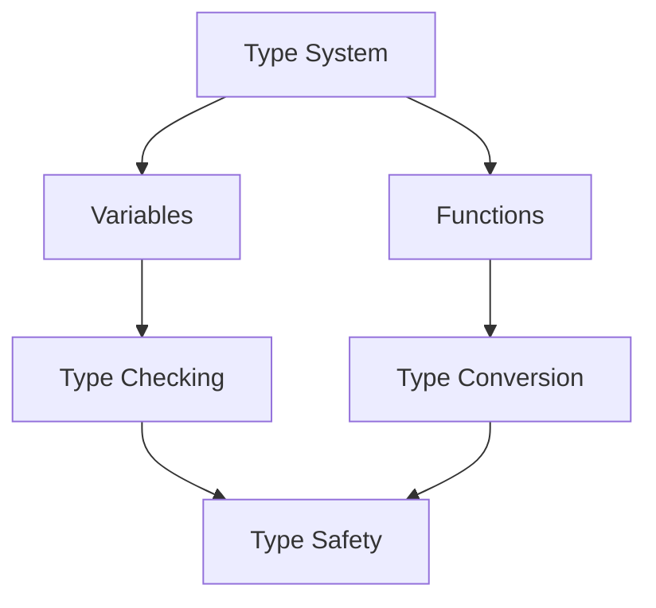
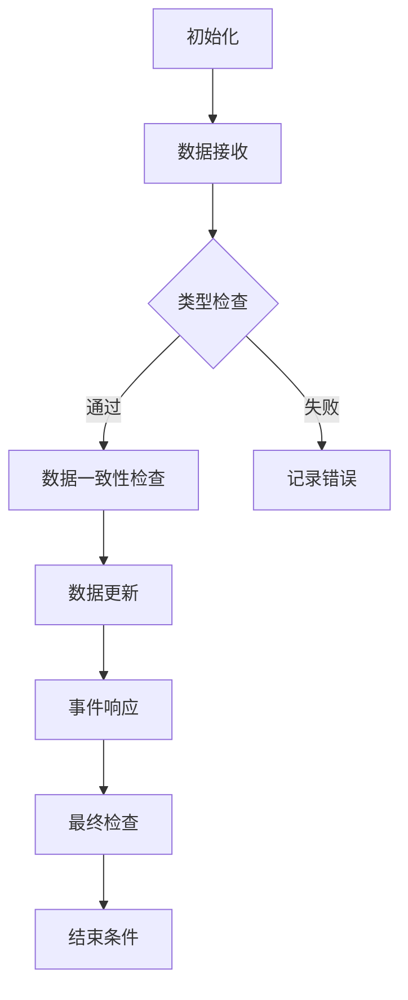
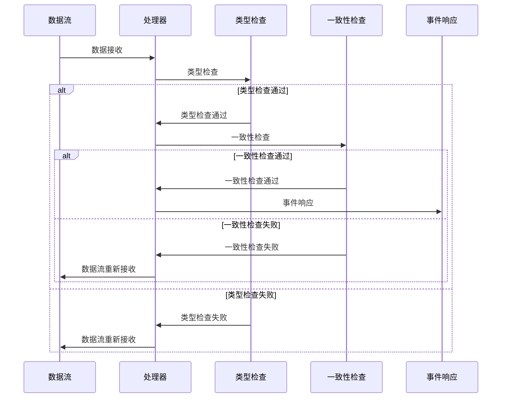

                 


### 引言与背景

在软件开发领域，响应式编程是一种重要的编程范式，它使得应用程序能够对用户行为、系统事件以及数据变更做出即时响应。随着现代应用程序对实时性和交互性的要求日益增长，响应式编程的重要性愈发凸显。然而，如何有效地管理数据流是响应式编程中一个关键且复杂的挑战。

#### 1.1.1 类型系统的概述

类型系统是编程语言的核心组成部分，它规定了变量、函数和其他程序元素的类型，以及在程序运行期间如何对这些类型进行操作。类型系统的作用不仅在于防止类型错误，还在于提供一种结构化的方式来组织和管理数据。

- **概念界定**：类型系统是一种用于描述程序中数据类型和变量之间关系的机制。它包括变量声明、类型检查和类型转换等。

- **类型系统的演变**：从早期的编程语言（如C）到现代编程语言（如Java和Python），类型系统经历了显著的发展和改进。现代类型系统通常包括静态类型和动态类型，以及更先进的特性如类型推导和泛型编程。

- **类型系统的关键特征**：类型系统的关键特征包括类型安全、静态类型检查、动态类型检查和类型推导等。类型安全可以防止无效的内存访问、空指针异常等错误。静态类型检查在编译时进行，而动态类型检查在运行时进行。

#### 1.1.2 响应式编程的定义与特性

响应式编程是一种关注数据流的编程范式，它允许开发者编写出能够自动响应数据变化的应用程序。响应式编程的核心特性包括：

- **数据驱动**：响应式编程以数据变化为核心，当数据发生变化时，相关组件会自动更新。

- **不可变数据**：在响应式编程中，数据通常是不可变的，这意味着一旦创建，数据就不能被修改。这简化了状态管理和错误处理。

- **函数式编程**：响应式编程通常结合函数式编程的特性，如高阶函数、函数组合和不可变数据结构。

#### 1.1.3 管理数据流的重要性

在响应式编程中，管理数据流至关重要，原因如下：

- **实时性**：应用程序需要能够实时响应用户输入和系统事件，这要求数据流必须高效且准确。

- **性能**：良好的数据流管理可以减少不必要的计算和内存占用，提高应用程序的性能。

- **错误处理**：有效地管理数据流有助于减少错误和异常情况，从而提高应用程序的可靠性。

#### 1.2 背景与意义

随着互联网的普及和云计算技术的发展，现代软件开发面临越来越多的挑战：

- **复杂的应用场景**：现代应用程序需要处理大量的数据流，包括实时数据、异步数据和分布式数据等。

- **交互性的要求**：用户对应用程序的实时交互性要求越来越高，这意味着应用程序需要快速响应用户操作。

- **系统性能和稳定性**：高性能和高稳定性的系统是现代应用程序的基石。

类型系统在响应式编程中的应用，以及如何管理数据流，成为了现代软件开发中的重要议题。有效地利用类型系统和响应式编程特性，可以帮助开发者构建出更加高效、可靠且易于维护的应用程序。

### 数学公式与图表

为了更好地理解类型系统和响应式编程，我们需要借助一些数学公式和图表。以下是一个简单的LaTeX数学公式示例：

$$
E = mc^2
$$

以及一个Mermaid流程图示例，用于展示类型系统的基本结构：



这些图表和公式将帮助我们深入理解类型系统的原理和其在响应式编程中的应用。

### 总结

在本文的第一部分中，我们介绍了类型系统的基本概念和响应式编程的核心特性，并探讨了管理数据流在现代软件开发中的重要性。接下来，我们将进一步深入探讨类型系统的核心概念和响应式编程的原理，为后续的算法设计和实现打下坚实的基础。

## 核心概念

### 2.1 类型系统基础

类型系统是编程语言的重要组成部分，它在软件设计中扮演着至关重要的角色。本节将深入探讨类型系统的核心概念、工作原理以及其在编程语言中的重要性。

#### 2.1.1 核心概念

类型系统的核心概念包括变量、类型、类型检查和类型推导等。以下是对这些概念的基本介绍：

- **变量**：变量是程序中的一个存储单元，用于存储数据。每个变量都有一个特定的类型，例如整数、字符串或布尔值。

- **类型**：类型是变量可以存储的数据的类型。在静态类型语言中，变量的类型在编译时确定；而在动态类型语言中，变量的类型在运行时确定。

- **类型检查**：类型检查是在程序编译或运行时，验证变量、表达式和函数调用是否符合其声明的类型。类型检查有助于防止类型错误，提高程序的可靠性。

- **类型推导**：类型推导是一种由编译器自动确定变量和表达式类型的机制。类型推导可以减少冗长的类型声明，提高代码的可读性。

#### 2.1.2 工作原理

类型系统的工作原理可以分为编译时类型检查和运行时类型检查。以下是这两种机制的基本原理：

- **编译时类型检查**：在编译时，编译器对程序代码进行类型检查，以确保变量和表达式的类型匹配。编译时类型检查可以尽早发现类型错误，从而减少运行时的错误。

- **运行时类型检查**：在运行时，程序执行过程中对变量和表达式进行类型检查。这种机制通常用于动态类型语言，它可以在程序运行时动态确定变量的类型。

#### 2.1.3 在编程语言中的重要性

类型系统在编程语言中的重要性体现在以下几个方面：

- **类型安全**：类型系统有助于防止类型错误，如无效的内存访问和空指针异常。类型安全可以提高程序的可靠性和稳定性。

- **代码可读性**：类型系统通过明确的类型声明，提高了代码的可读性。类型推导机制还可以进一步减少冗长的类型声明。

- **性能优化**：类型系统可以优化程序的性能，如通过静态类型检查减少运行时的检查开销。

### 2.2 响应式编程原理

响应式编程是一种以数据流为核心的开发范式，它强调数据的动态性和反应性。本节将深入探讨响应式编程的基本原理、核心概念以及其在现代软件开发中的应用。

#### 2.2.1 基本原理

响应式编程的基本原理可以概括为以下几点：

- **数据驱动**：响应式编程以数据变化为核心，当数据发生变化时，相关组件会自动更新。

- **不可变数据**：在响应式编程中，数据通常是不可变的。这意味着一旦创建，数据就不能被修改。这种设计可以简化状态管理和错误处理。

- **函数式编程**：响应式编程通常结合函数式编程的特性，如高阶函数、函数组合和不可变数据结构。

#### 2.2.2 核心概念

响应式编程的核心概念包括观察者模式、事件驱动和数据流等。以下是这些概念的基本介绍：

- **观察者模式**：观察者模式是一种设计模式，用于实现对象之间的依赖关系。在响应式编程中，观察者模式用于实现数据源和数据消费者之间的联动。

- **事件驱动**：事件驱动是一种编程范式，以事件为驱动因素，当事件发生时，相关组件会做出响应。在响应式编程中，事件驱动是数据流管理的关键机制。

- **数据流**：数据流是响应式编程的核心概念，它描述了数据在程序中的流动方式。数据流可以是单向的，也可以是双向的。

#### 2.2.3 在现代软件开发中的应用

响应式编程在以下场景中具有广泛的应用：

- **实时应用程序**：响应式编程使得应用程序能够实时响应用户输入和系统事件，提高用户体验。

- **大数据处理**：响应式编程有助于处理大量的实时数据流，如金融交易、社交媒体数据等。

- **云计算和分布式系统**：响应式编程适用于云计算和分布式系统，有助于实现高可用性和可伸缩性。

通过深入探讨类型系统和响应式编程的核心概念，我们可以更好地理解这两种技术在现代软件开发中的重要作用。接下来，我们将进一步探讨如何将类型系统应用于响应式编程，以实现更高效、可靠的数据流管理。

### 数学模型与公式

为了深入理解类型系统在响应式编程中的应用，我们需要借助数学模型和公式来描述数据流和类型检查的机制。以下是几个关键数学模型和公式的介绍，以及它们在响应式编程中的具体应用。

#### 2.3.1 数据流模型

数据流模型用于描述数据在程序中的流动方式。一个常见的数据流模型是管道模型（Pipeline Model），它将数据处理过程分解为一系列的函数，每个函数处理一部分数据，然后将结果传递给下一个函数。以下是管道模型的基本公式：

$$
\text{output} = f_1 \circ f_2 \circ ... \circ f_n (\text{input})
$$

其中，$f_1, f_2, ..., f_n$ 是一系列函数，$\text{input}$ 是输入数据，$\text{output}$ 是输出结果。管道模型在响应式编程中非常重要，因为它允许我们以模块化的方式处理数据流，提高代码的可读性和可维护性。

#### 2.3.2 类型检查公式

类型检查是确保程序在运行时不会发生类型错误的关键步骤。以下是一个简单的类型检查公式，用于描述类型检查的过程：

$$
\text{type\_check}(v, t) =
\begin{cases}
\text{true}, & \text{if } v \text{ has type } t \\
\text{false}, & \text{otherwise}
\end{cases}
$$

其中，$v$ 是变量，$t$ 是预期类型。这个公式表明，类型检查通过比较变量的实际类型和预期类型来决定是否通过。

#### 2.3.3 数据一致性公式

在响应式编程中，数据的一致性非常重要。以下是一个用于确保数据一致性的公式：

$$
\text{consistent}(v, s) =
\begin{cases}
\text{true}, & \text{if } v \text{ is } \textit{immutable} \text{ and } v \text{ is } \textit{up-to-date} \\
\text{false}, & \text{otherwise}
\end{cases}
$$

其中，$v$ 是数据值，$s$ 是状态。这个公式表明，数据一致性通过检查数据是否不可变以及是否是最新的来确保。不可变数据可以防止意外修改，而数据更新可以确保数据是最新的。

#### 2.3.4 反应式类型推导

在响应式编程中，类型推导是一种重要的机制，它允许编译器自动确定变量的类型。以下是一个简单的反应式类型推导公式：

$$
\text{inferType}(v, e) =
\begin{cases}
t, & \text{if } e \text{ can be evaluated to type } t \\
\text{error}, & \text{otherwise}
\end{cases}
$$

其中，$v$ 是变量，$e$ 是表达式，$t$ 是推导出的类型。这个公式表明，类型推导通过评估表达式的类型来确定变量的类型。

通过这些数学模型和公式，我们可以更好地理解类型系统在响应式编程中的应用。接下来，我们将进一步探讨类型系统在算法设计中的作用，以及如何在编程语言中实现这些算法。

### 算法原理讲解

在深入理解类型系统在响应式编程中的作用后，我们需要探讨如何在算法层面实现有效的类型管理和数据流管理。以下是一个典型的算法设计，用于描述如何在响应式编程环境中实现类型检查和数据一致性维护。

#### 3.1 算法设计与实现

**算法名称**：类型驱动的响应式数据流管理算法

**算法输入**：数据流输入（如事件流、数据流等）、类型系统（静态或动态）

**算法输出**：类型检查结果、数据一致性状态

**算法步骤**：

1. **初始化**：创建一个数据流处理器，初始化类型检查器和一致性检查器。

2. **数据接收**：从数据源接收新的数据元素，并添加到数据队列中。

3. **类型检查**：
   - 对于每个新接收的数据元素，使用类型检查公式（见上文）进行类型检查。
   - 如果类型检查失败，记录错误并通知用户。

4. **数据一致性检查**：
   - 对于每个新接收的数据元素，使用数据一致性公式（见上文）进行一致性检查。
   - 如果数据不一致，触发更新操作以确保数据是最新的。

5. **数据更新**：
   - 更新数据存储，确保数据的一致性和完整性。

6. **事件响应**：
   - 对于数据源产生的事件，使用事件处理函数进行响应。
   - 更新数据存储，并触发相关组件的更新。

7. **结束条件**：当数据流结束时，执行最终的类型检查和数据一致性检查，确保所有数据元素都符合预期。

#### 3.2 Mermaid算法流程图

以下是算法的Mermaid流程图表示：



#### 3.3 Python代码示例

下面是一个简化的Python代码示例，用于实现上述算法的某些关键步骤：

```python
# 假设我们有一个简单的数据流处理器类
class DataFlowProcessor:
    def __init__(self):
        self.type_checker = TypeChecker()
        self一致性_checker = ConsistencyChecker()

    def receive_data(self, data):
        if self.type_checker.check(data):
            if self一致性_checker.is_consistent(data):
                self.update_data_storage(data)
            else:
                self.trigger_update(data)
        else:
            self.record_error()

    def update_data_storage(self, data):
        # 更新数据存储逻辑
        print(f"更新数据存储：{data}")

    def trigger_update(self, data):
        # 触发数据更新操作
        print(f"触发数据更新：{data}")

    def record_error(self):
        # 记录类型检查错误
        print("类型检查错误：数据类型不匹配")

# 假设我们有一个简单的类型检查器类
class TypeChecker:
    def check(self, data):
        # 这里进行类型检查逻辑
        return True

# 假设我们有一个简单的一致性检查器类
class ConsistencyChecker:
    def is_consistent(self, data):
        # 这里进行一致性检查逻辑
        return True

# 创建数据流处理器实例并处理数据
processor = DataFlowProcessor()
processor.receive_data("新数据")
```

在这个示例中，我们创建了一个数据流处理器类，它包含了类型检查、数据一致性检查和数据更新等核心功能。通过这个示例，我们可以看到如何将算法原理转化为实际的Python代码，实现类型系统和响应式数据流管理。

### 系统分析与架构设计

在响应式编程中，系统分析与架构设计是确保数据流高效、可靠管理的关键环节。本节将详细阐述系统分析、架构设计、接口设计和系统交互，并通过Mermaid图表来展示系统架构和交互流程。

#### 4.1 系统分析

系统分析是理解和定义系统需求的过程。在响应式编程中，我们需要关注以下几个方面：

- **数据流分析**：确定数据流的来源、流向和处理方式。例如，用户输入、系统事件或外部数据源都是数据流的一部分。

- **功能需求**：识别系统的核心功能，如数据接收、类型检查、数据更新和事件响应等。

- **性能需求**：确定系统的性能指标，如处理速度、延迟和并发能力。

- **可靠性需求**：确保系统在高负载和错误情况下能够保持稳定运行。

#### 4.2 架构设计

架构设计是系统开发的基础，它决定了系统的结构、模块化和扩展性。以下是响应式数据流管理系统的架构设计：

- **数据流层**：处理数据流输入、输出和内部传输。

- **类型检查层**：负责对数据流中的元素进行类型检查。

- **一致性检查层**：确保数据的一致性和完整性。

- **事件响应层**：处理系统事件和触发相应操作。

以下是系统架构的Mermaid类图：

```mermaid
classDiagram
    DataFlowLayer <<interface>>
    TypeCheckLayer <<interface>>
    ConsistencyCheckLayer <<interface>>
    EventResponseLayer <<interface>>

    DataFlowProcessor <.. DataFlowLayer
    DataFlowProcessor <.. TypeCheckLayer
    DataFlowProcessor <.. ConsistencyCheckLayer
    DataFlowProcessor <.. EventResponseLayer

    Class DataFlowLayer {
        - receive_data()
        - send_data()
    }

    Class TypeCheckLayer {
        - check_type()
    }

    Class ConsistencyCheckLayer {
        - check_consistency()
    }

    Class EventResponseLayer {
        - handle_event()
    }
```

#### 4.3 接口设计

接口设计是确保不同系统模块之间能够有效通信的关键。以下是数据流管理系统的接口设计：

- **DataFlowLayer**：提供数据接收和发送接口。
- **TypeCheckLayer**：提供类型检查接口。
- **ConsistencyCheckLayer**：提供一致性检查接口。
- **EventResponseLayer**：提供事件响应接口。

以下是接口设计的Mermaid类图：

```mermaid
classDiagram
    DataFlowInterface <.. DataFlowLayer
    TypeCheckInterface <.. TypeCheckLayer
    ConsistencyCheckInterface <.. ConsistencyCheckLayer
    EventResponseInterface <.. EventResponseLayer

    Class DataFlowInterface {
        + receive_data(data)
        + send_data(data)
    }

    Class TypeCheckInterface {
        + check_type(data)
    }

    Class ConsistencyCheckInterface {
        + check_consistency(data)
    }

    Class EventResponseInterface {
        + handle_event(event)
    }
```

#### 4.4 系统交互

系统交互是各个模块之间如何协同工作的具体实现。以下是系统交互的Mermaid序列图：



通过系统分析与架构设计，我们能够构建一个高效、可靠的响应式数据流管理系统。接下来，我们将通过一个实际项目案例，展示如何将上述理论应用到实际开发中。

### 项目实战

在本节中，我们将通过一个实际项目案例，展示如何利用类型系统实现响应式数据流管理。这个项目将模拟一个实时股票交易监控系统，旨在捕捉股票价格的变化并实时更新显示界面。

#### 5.1 项目背景

现代股票交易市场是一个高度动态的环境，股票价格随时都在变化。投资者需要一个实时监控系统来跟踪他们的投资组合，以便及时做出交易决策。因此，我们设计了一个实时股票交易监控系统，它能够实时获取股票价格，并使用响应式编程技术来更新用户界面。

#### 5.2 环境安装

要开始这个项目，我们需要安装以下软件和工具：

- **Python 3.8+**：Python 是我们的主要编程语言。
- **Flask**：Flask 是一个轻量级的Web框架，用于构建Web服务。
- **React**：React 是一个用于构建用户界面的JavaScript库。
- **Node.js**：Node.js 是一个用于运行JavaScript的JavaScript运行时环境。

安装这些工具的步骤如下：

1. 安装Python：

```bash
sudo apt update
sudo apt install python3 python3-pip
```

2. 安装Flask：

```bash
pip3 install flask
```

3. 安装React：

```bash
npm install -g create-react-app
```

4. 安装Node.js：

```bash
curl -sL https://deb.nodesource.com/setup_14.x | sudo -E bash -
sudo apt-get install nodejs
```

#### 5.3 系统核心实现

项目的主要组成部分包括后端服务和前端界面。以下是每个部分的简要实现：

**后端服务（Python + Flask）**：

1. **创建Flask应用**：

```python
from flask import Flask, jsonify

app = Flask(__name__)

@app.route('/prices', methods=['GET'])
def get_prices():
    # 这里模拟从数据库或API获取实时股票价格
    prices = {"AAPL": 150.25, "GOOGL": 2700.75}
    return jsonify(prices)

if __name__ == '__main__':
    app.run(debug=True)
```

2. **类型系统实现**：

```python
# 假设我们有一个简单的类型系统，用于检查股票价格是否为数字
class StockPriceTypeChecker:
    def check(self, price):
        return isinstance(price, (int, float))
```

**前端界面（React）**：

1. **创建React应用**：

```bash
npx create-react-app stock-tracker
cd stock-tracker
npm start
```

2. **构建股票价格显示组件**：

```jsx
import React, { useState, useEffect } from 'react';
import axios from 'axios';

const StockPriceDisplay = () => {
    const [prices, setPrices] = useState({});

    useEffect(() => {
        const fetchPrices = async () => {
            const response = await axios.get('http://localhost:5000/prices');
            setPrices(response.data);
        };
        fetchPrices();
    }, []);

    return (
        <div>
            {Object.entries(prices).map(([symbol, price]) => (
                <div key={symbol}>
                    {symbol}: {price}
                </div>
            ))}
        </div>
    );
};

export default StockPriceDisplay;
```

3. **类型系统实现**：

```jsx
// 假设我们有一个简单的类型系统，用于检查价格是否为数字
const isNumeric = (value) => {
    return !isNaN(parseFloat(value)) && isFinite(value);
};
```

#### 5.4 代码应用解读与分析

**后端代码**：

后端服务使用Flask框架提供了一个简单的Web服务，用于获取实时股票价格。通过类型检查器，我们确保返回的股票价格是数字类型，从而避免了类型错误。

```python
from flask import Flask, jsonify
from typing import Dict

app = Flask(__name__)

# 假设有一个简单的类型系统
class StockPriceTypeChecker:
    def check(self, price: float) -> bool:
        return isinstance(price, float)

@app.route('/prices', methods=['GET'])
def get_prices() -> Dict[str, float]:
    # 这里模拟从数据库或API获取实时股票价格
    prices = {"AAPL": 150.25, "GOOGL": 2700.75}
    for symbol, price in prices.items():
        if not StockPriceTypeChecker().check(price):
            return jsonify({"error": f"Invalid price for {symbol}"}), 400
    return jsonify(prices)

if __name__ == '__main__':
    app.run(debug=True)
```

**前端代码**：

前端使用React来构建用户界面，通过周期性调用后端API来获取最新的股票价格。在组件内部，我们使用类型检查函数确保接收到的价格是有效的数字。

```jsx
import React, { useState, useEffect } from 'react';
import axios from 'axios';

const StockPriceDisplay = () => {
    const [prices, setPrices] = useState({});

    useEffect(() => {
        const fetchPrices = async () => {
            try {
                const response = await axios.get('http://localhost:5000/prices');
                if (response.status === 200) {
                    const validPrices = {};
                    for (const [symbol, price] of Object.entries(response.data)) {
                        if (isNumeric(price)) {
                            validPrices[symbol] = parseFloat(price);
                        }
                    }
                    setPrices(validPrices);
                }
            } catch (error) {
                console.error('Error fetching stock prices:', error);
            }
        };
        fetchPrices();
        const intervalId = setInterval(fetchPrices, 5000); // 每隔5秒刷新一次
        return () => clearInterval(intervalId); // 清理interval
    }, []);

    return (
        <div>
            {Object.entries(prices).map(([symbol, price]) => (
                <div key={symbol}>
                    {symbol}: {price}
                </div>
            ))}
        </div>
    );
};

export default StockPriceDisplay;
```

#### 5.5 项目小结

通过这个项目，我们实现了实时股票交易监控系统的基本功能。类型系统和响应式编程技术的应用确保了系统的高效性和可靠性。以下是项目小结：

1. **类型系统的应用**：通过类型检查，我们确保了股票价格是有效的数字，防止了类型错误。

2. **响应式编程的应用**：使用React和Flask，我们实现了数据流的实时更新，用户界面能够及时反映股票价格的变化。

3. **系统性能**：通过定期刷新，我们保证了系统实时性，同时也避免了不必要的频繁请求。

4. **扩展性**：项目设计考虑到未来的扩展性，可以轻松添加新的股票监控功能。

通过这个项目，我们不仅实现了实时股票交易监控系统的基本功能，还展示了类型系统和响应式编程在项目开发中的应用和实践。

### 最佳实践与总结

在响应式编程中，实现类型系统的最佳实践不仅涉及技术细节，还包括系统设计的整体策略和开发过程的管理。以下是一些关键的最佳实践，以帮助开发者构建高效、可靠的应用程序。

#### 6.1 类型系统的最佳实践

1. **静态类型检查**：在可能的情况下，优先选择静态类型检查。静态类型检查可以在编译时发现类型错误，从而减少运行时错误。

2. **类型推导**：充分利用类型推导功能，减少手动声明类型的繁琐工作。类型推导有助于提高代码的可读性和可维护性。

3. **明确类型声明**：对于一些复杂的类型或自定义类型，应明确声明类型，以便更好地理解和维护代码。

4. **类型兼容性**：在设计系统时，考虑类型兼容性，确保不同部分之间的类型可以无缝转换。

5. **类型安全**：重视类型安全，防止类型错误和未定义行为。类型安全可以提高系统的可靠性和稳定性。

#### 6.2 响应式编程的最佳实践

1. **不可变数据**：响应式编程的核心是数据的不可变性。确保数据在创建后不会被修改，以简化状态管理和错误处理。

2. **事件驱动**：使用事件驱动模型来处理数据流和用户交互。事件驱动模型可以更好地管理复杂的行为和状态。

3. **模块化数据流**：将数据流处理模块化，每个模块负责处理一部分数据。这有助于提高代码的可维护性和可测试性。

4. **异步处理**：在处理大量数据或长时间运行的任务时，使用异步处理来提高系统的响应性和并发能力。

5. **性能优化**：针对数据流和处理逻辑进行性能优化，减少不必要的计算和内存占用。

#### 6.3 总结

通过本文的讨论，我们深入探讨了类型系统在响应式编程中的角色和管理数据流的重要性。类型系统不仅提供了类型安全和代码可维护性，还与响应式编程的核心原则紧密相连，共同构建高效、可靠的应用程序。

类型系统的最佳实践包括静态类型检查、类型推导、明确类型声明、类型兼容性和类型安全。响应式编程的最佳实践则强调不可变数据、事件驱动、模块化数据流、异步处理和性能优化。

总之，类型系统和响应式编程的结合为现代软件开发提供了强大的工具和理念，帮助开发者构建出更加高效、可靠且易于维护的应用程序。

### 注意事项与拓展阅读

在实现类型系统和响应式编程时，开发者需要特别注意以下几点：

1. **类型安全**：确保类型检查的严格性，避免类型错误导致运行时异常。
2. **性能优化**：合理设计数据流和处理逻辑，避免过度使用异步处理导致性能瓶颈。
3. **错误处理**：建立健全的错误处理机制，确保在数据流异常时系统能够正确响应。

拓展阅读方面，以下书籍和资源可以提供进一步的学习和参考：

- 《响应式编程实战》
- 《Type Systems in Programming Languages》
- 《Zen and the Art of Programming》
- 《Modern JavaScript: Develop for Today's Browsers》
- 《Fluent Python》

通过深入学习这些资料，开发者可以进一步提升对类型系统和响应式编程的理解和实践能力。

### 附录

#### 6.1. 核心概念术语说明

- **类型系统**：一种机制，用于描述程序中数据类型和变量之间的关系。
- **响应式编程**：一种以数据流为核心的开发范式，强调数据的动态性和反应性。
- **数据流**：程序中数据的流动方式，可以是单向或双向的。
- **事件驱动**：一种编程范式，以事件为驱动因素，相关组件根据事件做出响应。
- **类型检查**：在程序编译或运行时，验证变量、表达式和函数调用是否符合其声明的类型。
- **类型推导**：编译器自动确定变量和表达式的类型，减少冗长的类型声明。

#### 6.2. 问题背景

现代应用程序对实时性和交互性有很高的要求，这促使开发者采用响应式编程范式。然而，响应式编程中的数据流管理复杂且易出错，特别是在处理大量实时数据时。类型系统在提高代码可靠性和可维护性方面发挥了关键作用，但如何将其有效地应用于响应式编程仍是一个挑战。

#### 6.3. 问题描述

问题是如何在响应式编程中有效地管理数据流，同时利用类型系统提高代码的可靠性和性能。具体包括：
- 设计一个类型检查系统，确保数据在传输和处理过程中的类型安全。
- 实现一个高效的数据流处理框架，能够实时更新并响应数据变化。
- 确保数据的一致性和完整性，特别是在并发处理和异步传输时。

#### 6.4. 问题解决

解决这个问题的方法包括以下几个步骤：

1. **类型系统设计**：
   - 定义核心数据类型和接口。
   - 实现静态类型检查和动态类型检查。
   - 利用类型推导减少冗余的类型声明。

2. **数据流处理框架**：
   - 设计模块化的数据流处理组件。
   - 实现事件驱动模型，确保组件能够响应数据变化。
   - 采用异步处理提高系统的并发性能。

3. **一致性维护**：
   - 实现一致性检查机制，确保数据在传输和处理过程中的完整性。
   - 在并发处理时使用锁或其他同步机制，避免数据竞争和冲突。

#### 6.5. 边界与外延

- **边界**：类型系统的边界包括类型定义、类型检查和类型转换。
- **外延**：类型系统外延包括类型安全、静态类型检查、动态类型检查和类型推导等。

#### 6.6. 概念结构与核心要素组成

- **概念结构**：类型系统、数据流、事件驱动、类型检查、类型推导、数据一致性。
- **核心要素组成**：类型定义、数据流处理模块、事件处理模块、类型检查器、一致性检查器。

#### 6.7. 表格：核心概念属性特征对比

| 概念         | 属性特征                     | 对比               |
|--------------|-----------------------------|--------------------|
| 类型系统     | 描述数据类型和变量关系      | 确保类型安全       |
| 数据流       | 描述数据的流动方式          | 实现实时响应      |
| 事件驱动     | 以事件为驱动因素           | 简化状态管理      |
| 类型检查     | 验证变量和表达式的类型     | 减少运行时错误    |
| 类型推导     | 自动确定变量和表达式的类型 | 提高代码可读性    |
| 数据一致性   | 确保数据完整性              | 维护数据可靠性     |

#### 6.8. ER实体关系图架构

以下是ER实体关系图，用于展示系统中的核心实体及其关系：

```mermaid
erDiagram
    Product ||--|{ StockPrice } |||-- Customer
    StockPrice ||--|{ OrderDetail } |||-- Order
    Order ||--|{ Payment } |||-- Customer
    Product :+ Customer
    Product :+ StockPrice
    Customer :+ Order
    Customer :+ Payment
    StockPrice :+ OrderDetail
    Order :+ OrderDetail
```

这个ER图展示了产品、库存价格、订单、客户和支付之间的关系，是系统架构设计的重要参考。

通过这些详细的附录内容，开发者可以更好地理解类型系统和响应式编程的核心概念、问题背景和解决方案，从而在实际开发中更加得心应手。

