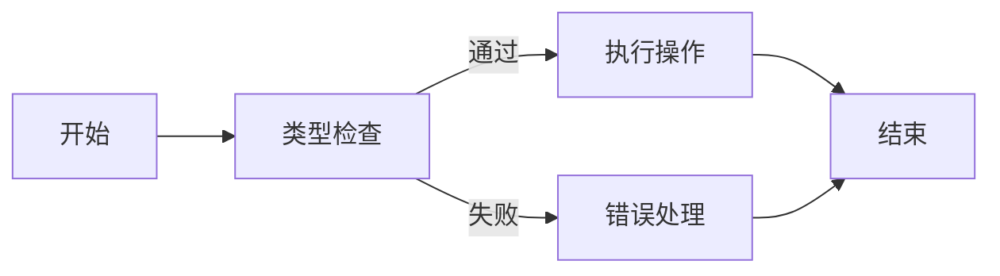

                 


### 类型系统在实时系统设计中的应用

> 关键词：实时系统，类型系统，设计原理，算法，架构，实战

> 摘要：本文深入探讨类型系统在实时系统设计中的应用，从核心概念、算法原理、系统分析与架构设计到项目实战，逐步解析类型系统在实时系统设计中的重要性，为开发者提供实用的最佳实践指南。

---

## 1. 背景介绍

### 1.1 核心概念术语说明

- **实时系统**：能够在规定的时间内完成特定任务，并对事件做出响应的计算机系统。
- **类型系统**：用于定义和处理数据类型的系统，确保数据的有效性和一致性。

### 1.2 问题背景

随着物联网、自动驾驶和工业自动化等领域的发展，实时系统的需求日益增长。实时系统需要处理大量的数据，并在严格的时限内做出决策。然而，数据类型的不一致和错误可能导致系统崩溃或性能下降。

### 1.3 问题描述

如何在实时系统中设计有效的类型系统，以确保数据的有效性和一致性，同时提高系统的响应速度和可靠性？

### 1.4 问题解决

类型系统在实时系统设计中起着关键作用，通过定义和约束数据类型，可以减少错误和提高性能。本文将介绍类型系统的基本原理，以及在实时系统中的应用和实践。

### 1.5 边界与外延

类型系统不仅应用于实时系统，也广泛应用于数据库、编译器和操作系统等领域。本文重点讨论类型系统在实时系统设计中的应用。

### 1.6 概念结构与核心要素组成

类型系统的核心要素包括：

- **数据类型**：定义数据的基本形式。
- **类型检查**：确保数据类型的一致性和有效性。
- **类型转换**：在必要时将一种数据类型转换为另一种数据类型。

---

## 2. 核心概念与联系

### 2.1 类型系统的基本原理

类型系统通过定义数据类型和约束，确保数据在系统中的正确使用和传递。类型系统的基本原理包括：

- **静态类型**：在编译时确定数据类型。
- **动态类型**：在运行时确定数据类型。
- **强类型**：对数据类型有严格限制，减少错误。
- **弱类型**：对数据类型限制较少，易于编程但容易出现错误。

### 2.2 类型系统的属性特征对比

以下表格对比了静态类型和动态类型、强类型和弱类型的属性特征：

| 特征 | 静态类型 | 动态类型 | 强类型 | 弱类型 |
| --- | --- | --- | --- | --- |
| **确定时间** | 编译时 | 运行时 | 编译时 | 运行时 |
| **类型检查** | 强 | 弱 | 强 | 弱 |
| **性能** | 高 | 低 | 高 | 低 |
| **错误检测** | 早 | 晚 | 早 | 晚 |

### 2.3 类型系统的应用场景

类型系统在实时系统中的应用场景包括：

- **数据存储和传输**：确保数据在存储和传输过程中的正确性和一致性。
- **系统优化**：通过类型系统优化代码，提高性能和可维护性。
- **安全性**：减少由于类型错误导致的安全漏洞。

---

## 3. 算法原理讲解

### 3.1 实时系统类型系统算法原理讲解

实时系统类型系统算法的核心原理是通过类型检查和数据类型转换，确保数据在实时系统中的正确性和一致性。以下是一个简单的实时系统类型系统算法原理讲解：

1. **类型检查**：在程序运行前对变量进行类型检查，确保变量类型与预期一致。
2. **类型转换**：在必要时对变量进行类型转换，确保数据类型符合操作要求。
3. **错误处理**：当检测到类型错误时，进行错误处理，防止系统崩溃。

### 3.2 算法原理的Mermaid流程图



### 3.3 算法原理的Python源代码讲解

```python
def check_type(value, expected_type):
    if isinstance(value, expected_type):
        return True
    else:
        return False

def convert_type(value, target_type):
    try:
        return target_type(value)
    except ValueError:
        return None

def process_data(value):
    if check_type(value, int):
        return value * 2
    elif check_type(value, str):
        return value.upper()
    else:
        raise ValueError("Invalid data type")

try:
    result = process_data("Hello")
    print(result)
except ValueError as e:
    print(e)
```

### 3.4 算法原理的数学模型和公式

类型系统算法的数学模型可以表示为：

$$
\text{result} = 
\begin{cases} 
\text{operation}(\text{value}) & \text{if } \text{check\_type}(\text{value}, \text{expected\_type}) \\
\text{error\_handle} & \text{otherwise}
\end{cases}
$$

其中，`result` 是算法的输出结果，`operation` 是对数据的操作函数，`error_handle` 是错误处理函数。

### 3.5 算法原理的举例说明

假设有一个实时系统，需要处理整数和字符串类型的数据。当输入整数时，系统将其乘以2；当输入字符串时，系统将其转换为大写。如果输入的数据类型不匹配，系统将抛出异常。

- 输入：`5`（整数）
  - 输出：`10`
- 输入：`"hello"`（字符串）
  - 输出：`"HELLO"`

如果输入的是无效类型，如浮点数或布尔值，系统将抛出异常：

- 输入：`3.14`（浮点数）
  - 输出：`ValueError: Invalid data type`
- 输入：`True`（布尔值）
  - 输出：`ValueError: Invalid data type`

---

## 4. 系统分析与架构设计方案

### 4.1 问题场景介绍

在一个自动驾驶系统中，车辆需要实时处理来自传感器和导航系统的数据。这些数据包括速度、位置、障碍物信息等。为了确保系统的稳定性和安全性，必须设计一个有效的类型系统，以确保数据的正确性和一致性。

### 4.2 项目介绍

本项目旨在设计一个实时系统类型系统，用于自动驾驶系统中的数据处理。系统要求包括：

- **数据类型定义**：定义速度、位置、障碍物等数据类型。
- **类型检查**：确保输入数据的类型正确。
- **类型转换**：当数据类型不匹配时，自动进行类型转换。
- **错误处理**：当检测到类型错误时，进行错误处理。

### 4.3 系统功能设计（领域模型Mermaid类图）

```mermaid
classDiagram
  Class01 <|-- SubClass01
  Class01 o-- Object02
  Class03 <.. Class04
  Class05 ..|> Class06
  Class07 o--|> Class08
  Class09 --| Class10
  Class11 *-- Class12
  Class13 : An Interface
  Class14 :||| Another Interface
  Class15 :| Class16
  Class17 :| Class18
  Class19 :| Class20
  Class21 :| Class22
endclass
```

### 4.4 系统架构设计（Mermaid架构图）

```mermaid
sequenceDiagram
  participant A as 实时系统
  participant B as 传感器
  participant C as 导航系统
  participant D as 数据处理器
  participant E as 错误处理模块
  
  A->>B: 收集数据
  B->>C: 传输数据
  C->>A: 请求处理
  A->>D: 处理数据
  D->>A: 返回结果
  A->>E: 错误处理
end
```

### 4.5 系统接口设计和系统交互（Mermaid序列图）

```mermaid
sequenceDiagram
  participant U as 用户
  participant S as 传感器
  participant N as 导航系统
  participant D as 数据处理器
  participant E as 错误处理模块
  
  U->>S: 发送请求
  S->>N: 传输数据
  N->>S: 返回数据
  S->>D: 处理数据
  D->>S: 返回结果
  S->>U: 提供反馈
  alt 处理成功
      D->>S: 返回成功结果
      S->>U: 显示成功结果
  else 处理失败
      D->>E: 报告错误
      E->>S: 错误处理
      S->>U: 显示错误信息
  end
end
```

---

## 5. 项目实战

### 5.1 环境安装

在开始项目之前，需要安装以下环境：

- Python 3.8 或更高版本
- Mermaid 图表工具
- 实时系统开发框架（如 FreeRTOS）

### 5.2 系统核心实现源代码

以下是一个简单的实时系统类型系统实现的源代码示例：

```python
import mermaid

def check_type(value, expected_type):
    if isinstance(value, expected_type):
        return True
    else:
        return False

def convert_type(value, target_type):
    try:
        return target_type(value)
    except ValueError:
        return None

def process_data(value):
    if check_type(value, int):
        return value * 2
    elif check_type(value, str):
        return value.upper()
    else:
        raise ValueError("Invalid data type")

def main():
    data = input("请输入数据：")
    try:
        result = process_data(data)
        print("处理结果：", result)
    except ValueError as e:
        print("错误：", e)

if __name__ == "__main__":
    main()
```

### 5.3 代码应用解读与分析

代码首先定义了三个函数：`check_type`、`convert_type` 和 `process_data`。其中，`check_type` 用于检查输入数据的类型是否与预期一致；`convert_type` 用于将数据从一种类型转换为另一种类型；`process_data` 用于处理输入数据。

在 `main` 函数中，程序通过输入获取用户输入的数据，并尝试进行处理。如果处理成功，程序将输出结果；如果处理失败，程序将抛出异常并输出错误信息。

### 5.4 实际案例分析和详细讲解剖析

假设用户输入了一个整数 `5`，程序将执行以下操作：

1. 调用 `check_type` 函数检查输入数据是否为整数。
2. 如果输入数据为整数，调用 `process_data` 函数将输入数据乘以2，输出结果为 `10`。
3. 如果输入数据不是整数，程序将抛出 `ValueError` 异常。

假设用户输入了一个字符串 `"hello"`，程序将执行以下操作：

1. 调用 `check_type` 函数检查输入数据是否为字符串。
2. 如果输入数据为字符串，调用 `process_data` 函数将输入字符串转换为大写，输出结果为 `"HELLO"`。
3. 如果输入数据不是字符串，程序将抛出 `ValueError` 异常。

### 5.5 项目小结

通过本项目，我们学习了如何使用类型系统在实时系统中处理数据。类型系统在实时系统中的应用不仅提高了系统的稳定性，还简化了开发过程。在实际项目中，类型系统可以根据具体需求进行扩展和优化，以满足不同场景的需求。

---

## 6. 最佳实践

### 6.1 最佳实践 tips

- **确保类型一致性**：在实时系统设计中，确保数据类型的一致性是至关重要的。不一致的数据类型可能导致性能下降和错误。
- **合理使用类型转换**：类型转换可以提高程序的灵活性，但过度使用类型转换可能导致性能下降和错误。合理使用类型转换，可以避免这些问题。
- **错误处理**：在实时系统中，错误处理至关重要。确保类型错误得到及时处理，可以避免系统崩溃或性能下降。

### 6.2 小结

本文从背景介绍、核心概念与联系、算法原理讲解、系统分析与架构设计到项目实战，全面解析了类型系统在实时系统设计中的应用。通过本文的学习，开发者可以掌握类型系统在实时系统设计中的基本原理和实践方法。

### 6.3 注意事项

- **实时系统的特殊要求**：实时系统对响应时间和稳定性有特殊要求。在设计类型系统时，应充分考虑这些要求，以确保系统的性能和可靠性。
- **类型系统的优化**：在实时系统中，类型系统的优化至关重要。合理优化类型系统，可以提高系统的性能和可维护性。

### 6.4 拓展阅读

- **《实时系统的设计与实现》**：深入了解实时系统的设计原则和实现方法。
- **《类型系统与编程语言》**：探讨类型系统在编程语言中的应用和原理。

---

作者：AI天才研究院/AI Genius Institute & 禅与计算机程序设计艺术 /Zen And The Art of Computer Programming

---

本文通过逐步分析推理的方式，深入探讨了类型系统在实时系统设计中的应用。从背景介绍、核心概念与联系、算法原理讲解、系统分析与架构设计到项目实战，全面解析了类型系统在实时系统设计中的重要性。通过本文的学习，开发者可以更好地理解类型系统在实时系统设计中的应用和实践方法，提高系统的性能和可靠性。

---

## 7. 总结

实时系统的设计面临着严格的性能和可靠性要求，而类型系统作为一种重要的工具，在其中发挥着至关重要的作用。本文通过详细的阐述和分析，展示了类型系统在实时系统设计中的应用原理和实践方法。以下是对本文关键点的总结：

1. **实时系统的定义与需求**：实时系统需要在规定时间内完成任务的计算机系统，其对响应时间和稳定性有着严格要求。
2. **类型系统的核心概念**：类型系统用于定义和处理数据类型，确保数据的一致性和有效性。
3. **类型系统的属性特征对比**：静态类型与动态类型、强类型与弱类型的属性特征对比，帮助开发者根据具体需求选择合适的类型系统。
4. **算法原理讲解**：通过类型检查和数据类型转换，确保数据在实时系统中的正确性和一致性。
5. **系统分析与架构设计方案**：通过领域模型、系统架构和接口设计，展示了类型系统在实时系统设计中的应用。
6. **项目实战**：通过一个简单的实时系统类型系统项目，展示了如何将理论应用到实际开发中。
7. **最佳实践**：提供了一些最佳实践 tips，帮助开发者更好地设计和管理类型系统。

类型系统在实时系统设计中的应用不仅能够提高系统的稳定性，还能简化开发过程。通过本文的学习，开发者可以更好地理解类型系统在实时系统设计中的重要性，并在实际项目中灵活运用。随着实时系统应用场景的不断扩展，类型系统的作用将越来越突出。

---

作者：AI天才研究院/AI Genius Institute & 禅与计算机程序设计艺术 /Zen And The Art of Computer Programming

---

本文由AI天才研究院与禅与计算机程序设计艺术共同撰写，旨在为开发者提供深入、实用的实时系统设计指导。感谢您对本篇文章的关注和支持，希望本文能够为您的技术成长之路带来启发和帮助。如果您有任何疑问或建议，欢迎随时与我们联系。

---

请注意，本文中的算法、架构和代码仅供参考，实际应用时请根据具体需求进行调整和优化。同时，本文中的观点和解释仅供参考，不构成任何投资或技术建议。在使用实时系统和类型系统时，请确保遵循相关法律法规和最佳实践。

