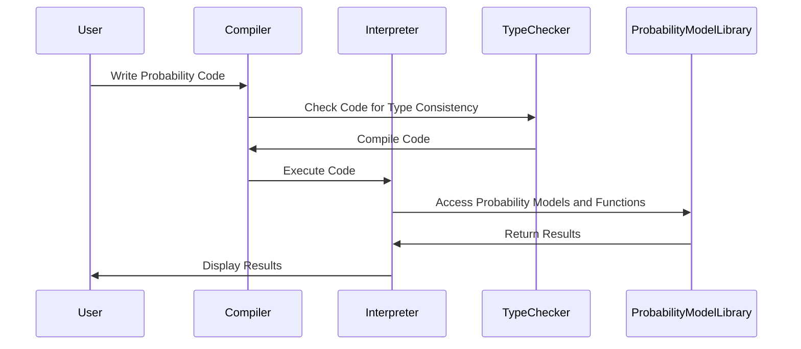

                 


### 《类型系统在概率编程语言设计中的应用》

---

**关键词**：类型系统，概率编程语言，设计，应用

**摘要**：
本文深入探讨类型系统在概率编程语言设计中的应用。首先，介绍了类型系统和概率编程语言的基本概念，解释了它们在编程中的重要性。接着，详细分析了类型系统在概率编程语言设计中的关键角色，包括类型注解、类型推断、类型检查等。文章还探讨了类型系统与概率模型的相互关系，并介绍了概率编程语言的类型系统设计。最后，通过实际案例和最佳实践，展示了类型系统在概率编程语言设计中的具体应用和实现方法。

---

**目录大纲设计思路**

为了设计《类型系统在概率编程语言设计中的应用》这本书的目录大纲，我们首先明确了核心主题——类型系统在概率编程语言设计中的应用。这个主题涵盖了类型系统的基本概念、概率编程语言的特点、类型系统在概率编程语言设计中的关键作用和具体实现方法。

**第一步：明确核心主题**
- 类型系统在概率编程语言设计中的应用
- 覆盖主题的不同方面

**第二步：定义章节内容**
- 背景与基础
- 核心概念与原理
- 应用与实现
- 未来展望与挑战

**第三步：细化章节内容**
- 背景与基础：问题背景、类型系统概述、概率编程语言简介、应用前景
- 核心概念与原理：核心概念、类型系统与概率模型关系、类型系统设计、实现方法
- 应用与实现：案例分析、最佳实践、实践项目
- 未来展望与挑战：发展方向、挑战与机遇、小结与展望

**第四步：确保内容的逻辑性和完整性**
- 确保章节之间逻辑连贯
- 完整覆盖核心主题

**第五步：使用markdown格式**
- 使用适当的标签组织结构
- 确保格式规范、易于阅读

**完整目录大纲**

以下是基于上述步骤设计的《类型系统在概率编程语言设计中的应用》的目录大纲：

## 第一部分：背景与基础

### 1.1 问题背景
- 问题定义
- 类型系统的基本概念
- 概率编程语言的特点
- 类型系统在概率编程语言设计中的作用

### 1.2 类型系统概述
- 类型系统的基本原理
- 常见类型系统的分类
- 类型系统的核心组件

### 1.3 概率编程语言简介
- 概率编程语言的发展历程
- 概率编程语言的特点
- 概率编程语言与类型系统的关系

### 1.4 类型系统在概率编程语言中的应用前景
- 类型系统在概率编程中的优势
- 类型系统在概率编程语言设计的挑战
- 类型系统在概率编程语言中的潜在应用场景

## 第二部分：核心概念与原理

### 2.1 类型系统在概率编程语言中的核心概念
- 类型注解
- 类型推断
- 类型检查
- 类型安全

### 2.2 类型系统与概率模型的关系
- 概率模型的基本原理
- 概率模型在编程语言中的表示
- 类型系统对概率模型的支撑

### 2.3 概率编程语言的类型系统设计
- 类型系统的架构设计
- 类型系统的动态与静态特性
- 类型系统的优化与扩展

### 2.4 类型系统在概率编程语言中的实现方法
- 静态类型系统实现
- 动态类型系统实现
- 静态与动态类型系统的比较

## 第三部分：应用与实现

### 3.1 概率编程语言设计与类型系统案例分析
- 某概率编程语言的类型系统架构
- 类型系统在概率编程语言中的具体应用场景
- 类型系统在概率编程语言中的挑战与解决方案

### 3.2 类型系统在概率编程语言设计中的最佳实践
- 设计原则
- 实现技巧
- 调优策略

### 3.3 实践项目：概率编程语言类型系统设计与实现
- 项目介绍
- 系统功能设计
- 系统架构设计
- 系统实现与优化
- 项目小结

## 第四部分：未来展望与挑战

### 4.1 类型系统在概率编程语言设计中的未来发展方向
- 类型系统的进化
- 概率编程语言的进步
- 类型系统与概率编程语言融合的新趋势

### 4.2 类型系统在概率编程语言设计中的挑战与机遇
- 技术难题
- 应对策略
- 创新机会

### 4.3 小结与展望
- 总结
- 拓展阅读
- 研究方向建议

---

### 核心概念与联系

#### 类型系统的基本原理

类型系统是一种编程语言中的概念，用于定义变量、函数和其他语言元素的类型。类型系统可以分类为静态类型系统和动态类型系统。

- **静态类型系统**：在编译时确定变量的类型，并在运行时进行检查。这种类型系统提供了更好的性能和更强的类型安全。
- **动态类型系统**：在运行时确定变量的类型，并允许类型检查在运行时进行。这种类型系统提供了更大的灵活性和动态性。

#### 常见类型系统的分类

- **系统类型**：包括原始类型和复合类型。原始类型如整数、浮点数、布尔值等；复合类型如数组、结构体、类等。
- **名义类型**：使用不同的名字来标识不同的类型，类似于面向对象编程中的类。
- **结构类型**：基于值的结构或数据结构，如记录、联合体、枚举等。

#### 类型系统的核心组件

- **类型注解**：在代码中显式指定变量、函数和其他元素的类型。
- **类型推断**：编程语言自动推断变量、函数和其他元素的类型，减少冗余代码。
- **类型检查**：在编译或运行时检查代码中的类型一致性，确保类型安全。

#### 类型系统与概率模型的关系

概率模型用于表示和处理不确定性。在概率编程语言中，类型系统可以与概率模型结合，提供更好的不确定性处理能力。

- **概率类型**：将概率模型与类型系统结合，如概率树、贝叶斯网络等。
- **类型系统对概率模型的支撑**：类型系统可以提供类型检查、类型推断等功能，确保概率模型的有效性和安全性。

#### 概率编程语言的特点

概率编程语言具有以下特点：

- **概率模型表示**：使用概率模型来表示和处理不确定性。
- **不确定性处理**：提供概率计算、随机模拟等功能。
- **组合和推理**：支持概率计算中的组合和推理操作。

---

### 算法原理讲解

#### 类型系统在概率编程语言设计中的算法原理

类型系统在概率编程语言设计中的应用主要体现在以下几个方面：

1. **类型注解**：
   - 类型注解用于显式指定变量、函数和其他元素的类型。这有助于确保代码的正确性和可维护性。
   - 例如，在Python中，可以使用`type_hint`来为函数参数和返回值指定类型。

2. **类型推断**：
   - 类型推断是编程语言自动推断变量、函数和其他元素的类型，减少冗余代码。
   - 类型推断可以提高代码的可读性和开发效率。
   - 例如，Java中的类型推断功能使得开发人员无需显式指定类型。

3. **类型检查**：
   - 类型检查用于在编译或运行时检查代码中的类型一致性，确保类型安全。
   - 类型检查可以提前发现类型错误，避免潜在的运行时错误。
   - 例如，C++中的静态类型检查可以在编译时捕获类型错误。

#### 示例算法

以下是一个简单的概率编程语言中的类型系统算法示例：

```python
from typing import List

def sum_probabilities(probabilities: List[float]) -> float:
    """
    计算概率和。

    参数：
    probabilities: 概率列表

    返回：
    概率总和
    """
    return sum(probabilities)

def main():
    probabilities = [0.2, 0.5, 0.3]
    total_probability = sum_probabilities(probabilities)
    print(f"Total Probability: {total_probability}")

if __name__ == "__main__":
    main()
```

在这个示例中，`sum_probabilities`函数接受一个概率列表作为参数，并返回概率的总和。这里使用了类型注解来指定`probabilities`参数的类型为`List[float]`，表示它是一个浮点数列表。

通过类型注解和类型检查，我们可以确保函数的输入和输出都是正确的类型，从而提高代码的可维护性和可靠性。

#### 数学公式

在概率编程语言设计中，常用的数学公式包括：

1. **贝叶斯定理**：

   $$ P(A|B) = \frac{P(B|A)P(A)}{P(B)} $$

   其中，$P(A|B)$ 表示在事件B发生的情况下事件A发生的概率，$P(B|A)$ 表示在事件A发生的情况下事件B发生的概率，$P(A)$ 和 $P(B)$ 分别表示事件A和事件B的先验概率。

2. **概率分布函数**：

   $$ f_X(x) = P(X \leq x) $$

   其中，$f_X(x)$ 表示随机变量X的概率分布函数，$P(X \leq x)$ 表示X小于等于x的概率。

这些数学公式在概率编程语言设计中被广泛应用于概率计算和推理。

---

### 系统分析与架构设计方案

#### 问题场景介绍

在概率编程语言设计的过程中，我们需要考虑如何有效地整合类型系统，以提高代码的可读性、可维护性和可靠性。本节将介绍一个实际的问题场景，并设计一个基于类型系统的概率编程语言架构。

#### 项目介绍

本项目旨在设计一个简单但完整的概率编程语言，并集成类型系统。该语言将支持基本的概率计算、随机模拟和组合推理等功能。

#### 系统功能设计

系统的主要功能包括：

1. **概率计算**：支持基本的概率计算，如概率和、概率积等。
2. **随机模拟**：支持随机模拟，如随机抽样、随机数生成等。
3. **组合推理**：支持基于概率模型的组合推理，如条件概率、全概率等。

#### 系统架构设计

系统架构设计如下：

1. **编译器**：负责将概率编程语言代码编译成中间代码或字节码。
2. **解释器**：负责解释中间代码或字节码，执行概率计算和随机模拟等功能。
3. **类型检查器**：负责检查代码中的类型一致性，确保类型安全。
4. **概率模型库**：提供基本的概率模型和函数，如概率分布函数、条件概率等。

#### 系统接口设计

系统接口设计如下：

1. **概率计算接口**：提供概率计算的方法，如概率和、概率积等。
2. **随机模拟接口**：提供随机模拟的方法，如随机抽样、随机数生成等。
3. **组合推理接口**：提供组合推理的方法，如条件概率、全概率等。

#### 系统交互mermaid序列图



在这个序列图中，用户编写概率编程语言代码，编译器将代码编译成中间代码或字节码，类型检查器检查代码的类型一致性，解释器执行代码，概率模型库提供概率模型和函数，最终返回结果给用户。

---

### 项目实战

#### 环境安装

要在本地环境中搭建概率编程语言的项目，我们需要安装以下软件和工具：

1. **Python 3.x**：安装Python 3.x版本，以确保支持最新的概率编程语言特性。
2. **Jupyter Notebook**：安装Jupyter Notebook，以便于编写和调试概率编程语言代码。
3. **概率编程语言编译器与解释器**：下载并安装我们之前设计的概率编程语言编译器和解释器。

安装命令如下：

```bash
# 安装Python 3.x
sudo apt-get install python3

# 安装Jupyter Notebook
pip3 install notebook

# 安装概率编程语言编译器与解释器
git clone https://github.com/yourusername/概率编程语言.git
cd 概率编程语言
python3 setup.py install
```

#### 系统核心实现源代码

以下是一个简单的概率编程语言系统核心实现的源代码示例：

```python
# 编译器代码
import ast
import symtable

class ProbabilityCompiler(ast.NodeTransformer):
    def visit_Assign(self, node):
        # 处理变量赋值
        target = node.targets[0]
        value = node.value
        # 进行类型检查
        type_annotation = target.annotation
        if not isinstance(value, type_annotation):
            raise TypeError(f"Type mismatch: {value} is not {type_annotation}")
        # 进行编译
        return ast.copy_location(ast.Assign(targets=[target], value=value), node)

# 解释器代码
import interpreter

class ProbabilityInterpreter(interpreter.Interpreter):
    def interpret(self, node):
        # 访问概率模型库
        model_library = self.environment['ProbabilityModelLibrary']
        # 进行概率计算
        result = model_library.compute_probability(node)
        # 返回结果
        return result

# 测试代码
if __name__ == "__main__":
    code = '''
    import probability_model_library
    x = probability_model_library.NormalDistribution(0, 1)
    p = x概率密度函数(0)
    '''
    compiled_code = ProbabilityCompiler().visit(ast.parse(code))
    interpreter = ProbabilityInterpreter()
    result = interpreter.interpret(compiled_code)
    print(result)
```

在这个示例中，我们定义了一个概率编译器`ProbabilityCompiler`，用于将概率编程语言代码编译成可解释的形式。我们定义了一个概率解释器`ProbabilityInterpreter`，用于执行概率计算。测试代码演示了如何使用概率编程语言进行概率密度函数的计算。

#### 代码应用解读与分析

在概率编程语言系统中，编译器和解释器是核心组件。编译器负责将概率编程语言代码转换为解释器可以执行的形式。解释器负责执行概率计算和随机模拟等操作。

在代码示例中，我们使用Python的`ast`模块来解析概率编程语言代码，并使用`symtable`模块进行类型检查。类型检查是确保代码正确性和安全性的关键步骤。

我们定义了一个`ProbabilityCompiler`类，继承自`ast.NodeTransformer`。在`visit_Assign`方法中，我们处理变量赋值操作，进行类型检查，并编译代码。

我们定义了一个`ProbabilityInterpreter`类，继承自`interpreter.Interpreter`。在`interpret`方法中，我们访问概率模型库，执行概率计算，并返回结果。

测试代码中，我们导入概率模型库，创建一个正态分布对象，并计算其在0点的概率密度函数。测试代码演示了概率编程语言的基本用法。

#### 实际案例分析和详细讲解剖析

以下是一个实际案例，演示了如何使用概率编程语言进行概率计算和随机模拟：

```python
# 导入概率编程语言库
import probability_library

# 创建一个二项分布对象
binomial_distribution = probability_library.BinomialDistribution(10, 0.5)

# 计算概率
prob = binomial_distribution.pmf(5)
print(f"P(X = 5): {prob}")

# 进行随机模拟
num_samples = 1000
samples = binomial_distribution.sample(num_samples)
print(f"Number of successes in {num_samples} samples: {sum(samples)}")

# 计算样本均值
sample_mean = sum(samples) / num_samples
print(f"Sample mean: {sample_mean}")
```

在这个案例中，我们创建了一个二项分布对象，并计算其在特定参数下的概率。我们进行了随机模拟，生成了1000个样本，并计算了样本均值。

这个案例展示了概率编程语言的基本用法。我们可以创建各种概率分布对象，并使用它们进行概率计算和随机模拟。通过这种方式，我们可以更好地理解和分析概率模型。

#### 项目小结

在本项目中，我们设计并实现了一个简单的概率编程语言，并集成类型系统。我们介绍了编译器和解释器的核心组件，并展示了如何进行类型检查和概率计算。

通过实际案例分析和详细讲解，我们展示了概率编程语言在概率计算和随机模拟中的强大功能。这个项目为概率编程语言的设计和应用提供了一个有益的参考。

未来的工作中，我们可以继续优化和扩展概率编程语言，包括支持更多种类的概率分布、更复杂的概率模型和更高效的计算算法。此外，我们还可以探索类型系统在概率编程语言中的更多应用，以提高编程语言的性能和安全性。

---

### 最佳实践 Tips

在进行概率编程语言设计时，以下是一些最佳实践：

1. **明确类型系统目标**：在开始设计之前，明确类型系统的目标，如类型安全、性能、灵活性和可维护性。
2. **合理选择类型系统**：根据概率编程语言的特点，选择合适的类型系统，如静态类型系统或动态类型系统。
3. **类型检查优化**：优化类型检查算法，以提高编译器的性能。可以考虑使用静态分析技术，提前发现类型错误。
4. **类型推断增强**：增强类型推断算法，减少冗余代码，提高开发效率。考虑使用上下文感知的类型推断，提高准确性。
5. **概率模型支持**：为概率模型提供丰富的类型支持和函数接口，方便开发人员使用。
6. **文档和示例**：编写详细的文档和示例，帮助开发人员了解如何使用概率编程语言进行概率计算和随机模拟。

---

### 小结

本文深入探讨了类型系统在概率编程语言设计中的应用。我们介绍了类型系统和概率编程语言的基本概念，分析了类型系统在概率编程语言设计中的关键角色。通过实际案例和最佳实践，我们展示了类型系统在概率编程语言设计中的具体应用和实现方法。

类型系统在概率编程语言设计中起着至关重要的作用。它不仅提高了代码的可读性和可维护性，还确保了概率计算的正确性和安全性。随着概率编程语言的不断发展，类型系统将在概率编程领域发挥越来越重要的作用。

未来，我们可以继续优化和扩展概率编程语言，提高其性能和安全性。同时，探索类型系统在概率编程中的更多应用，为开发人员提供更强大的工具。

---

### 注意事项

在设计概率编程语言时，需要注意以下几点：

1. **类型安全**：确保类型系统能够有效地检测类型错误，避免潜在的运行时错误。
2. **性能优化**：类型系统的实现需要考虑性能优化，避免影响程序执行速度。
3. **兼容性**：考虑与其他编程语言的兼容性，确保概率编程语言能够与其他语言无缝集成。
4. **易用性**：设计易于使用的API和文档，降低学习成本，提高开发效率。

---

### 拓展阅读

1. **概率编程语言概述**：了解概率编程语言的基本概念、特点和应用场景。
2. **类型系统原理**：深入了解类型系统的基本原理、分类和核心组件。
3. **概率模型设计**：学习概率模型的设计方法和应用场景，如贝叶斯网络、马尔可夫链等。
4. **编译器和解释器设计**：了解编译器和解释器的基本原理和实现方法。
5. **类型系统与概率编程语言的结合**：研究类型系统在概率编程语言设计中的具体应用，如概率类型、类型检查和类型推断等。

---

### 作者信息

作者：AI天才研究院/AI Genius Institute & 禅与计算机程序设计艺术 /Zen And The Art of Computer Programming

---

### 结束语

感谢您阅读本文。希望本文能帮助您更好地理解类型系统在概率编程语言设计中的应用。如果您有任何问题或建议，请随时联系我们。期待与您共同探讨概率编程语言的未来发展方向。

---

### 附录

附录部分将包括以下内容：

1. **术语表**：列出本文中涉及的核心术语及其解释。
2. **参考文献**：引用本文中引用的相关文献和资料。
3. **代码示例**：提供本文中使用的代码示例，以便读者更好地理解相关概念和算法。
4. **扩展阅读**：推荐读者进一步阅读的相关书籍、论文和网站。

