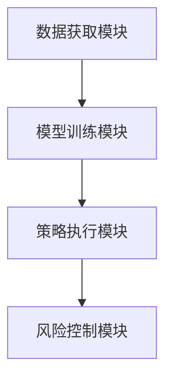
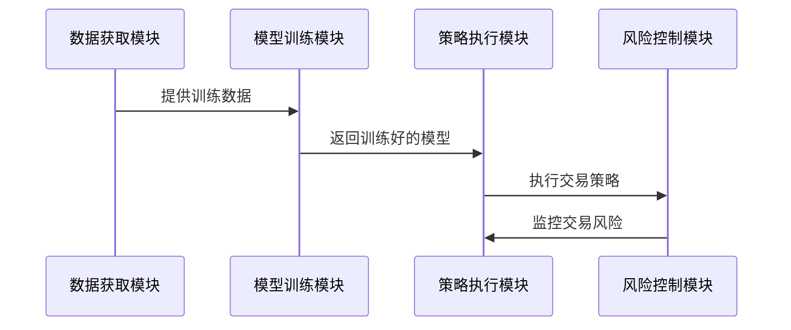
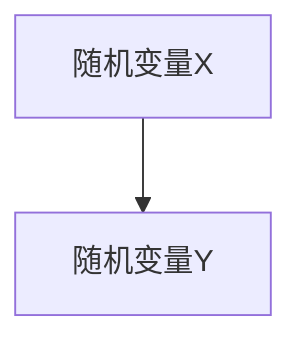
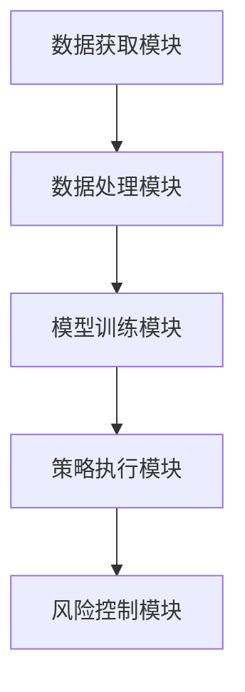
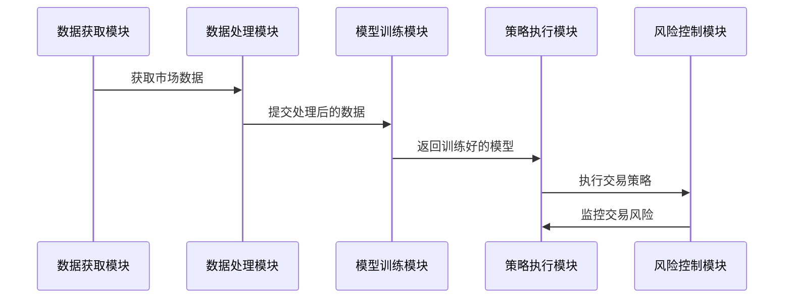
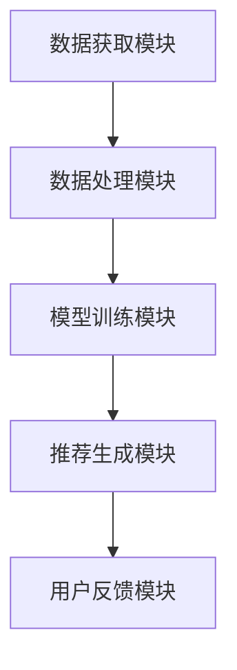
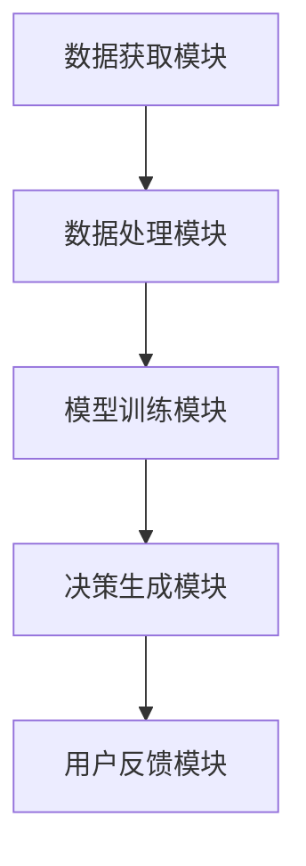
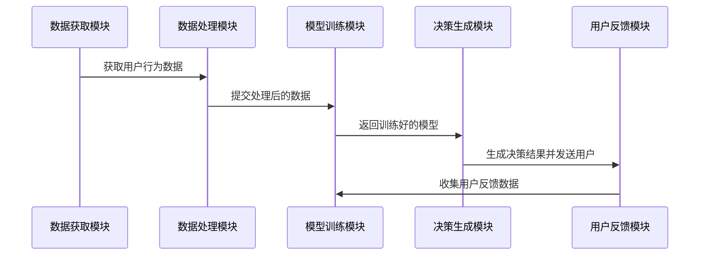

                 

# 类型系统在概率编程语言设计中的应用

> 关键词：概率编程语言、类型系统、设计原则、算法原理、架构设计、项目实战

> 摘要：
本文将深入探讨类型系统在概率编程语言设计中的应用。我们将从背景介绍开始，逐步分析核心概念与联系，讲解算法原理，设计系统架构，并进行项目实战。通过本文的探讨，旨在为概率编程语言的研究者和开发者提供有益的参考。

## 第一部分：背景介绍

### 1.1 问题背景

概率编程语言是一种将概率论与编程语言相结合的方法，旨在通过概率模型和概率算法来提高软件开发的效率和可靠性。然而，在概率编程语言的设计过程中，类型系统的应用成为了关键问题。类型系统不仅是编程语言的核心组成部分，也是概率编程语言能否有效表达和处理概率问题的重要基础。

### 1.2 问题描述

在概率编程语言中，类型系统的作用至关重要。它不仅影响着代码的可读性和维护性，还直接决定了程序的运行效率和可靠性。然而，如何在概率编程语言中设计出既符合概率论原理，又便于编程和使用的类型系统，是一个具有挑战性的问题。

### 1.3 问题解决

针对上述问题，本章将从以下几个方面展开讨论：首先，介绍概率编程语言的基本概念和特点；其次，分析类型系统在概率编程语言中的重要性；然后，探讨类型系统在概率编程语言设计中的应用策略；最后，通过实例分析，展示类型系统在概率编程语言中的实际应用效果。

### 1.4 边界与外延

概率编程语言的设计和应用涉及多个领域，包括概率论、编程语言理论、计算机科学等。本章将围绕类型系统在概率编程语言设计中的应用，探讨相关概念和方法，旨在为相关领域的研究者和开发者提供参考。

### 1.5 概念结构与核心要素组成

类型系统在概率编程语言设计中的核心要素包括：概率类型、类型系统设计原则、类型转换规则、类型检查机制等。本章将详细介绍这些要素，并探讨它们之间的相互关系。

## 第二部分：核心概念与联系

### 2.1 概率编程语言

#### 2.1.1 定义

概率编程语言是一种将概率论与编程语言相结合的方法，旨在通过概率模型和概率算法来提高软件开发的效率和可靠性。

#### 2.1.2 特点

- **支持概率分布和随机过程**：概率编程语言能够直接表示和处理概率分布和随机过程，使得开发者可以更方便地编写概率算法。
- **具有强大的表达能力和灵活性**：概率编程语言提供了丰富的概率操作符和函数，使得开发者可以灵活地表达复杂的概率问题。
- **能够处理不确定性和模糊性**：概率编程语言可以处理现实世界中的不确定性和模糊性，为开发者提供了一种有效的应对方法。

#### 2.1.3 基本概念

- **概率分布**：描述随机变量的概率特性，例如正态分布、伯努利分布等。
- **随机过程**：描述随机变量随时间的变化规律，例如马尔可夫链、Wiener过程等。
- **概率图模型**：描述概率分布或随机过程的图形表示，例如贝叶斯网络、马尔可夫网络等。

### 2.2 类型系统

#### 2.2.1 定义

类型系统是编程语言的核心组成部分，用于定义变量和表达式的数据类型，并规定类型之间的兼容性和转换规则。

#### 2.2.2 类型系统的设计原则

- **简单性**：类型系统应尽量简单，以降低学习成本和维护难度。
- **一致性**：类型系统应保持内部一致性，避免类型之间的矛盾和不兼容。
- **可扩展性**：类型系统应允许扩展，以适应新的需求和应用场景。

#### 2.2.3 概率编程语言中的类型系统

- **概率类型**：用于表示概率分布和随机过程的数据类型，例如概率图类型、随机变量类型等。
- **类型转换规则**：用于概率类型之间的转换规则，例如概率类型之间的转换函数。
- **类型检查机制**：用于确保概率编程语言的正确性和可靠性，例如类型检查器。

### 2.3 概率编程语言中的类型系统设计

#### 2.3.1 设计原则

- **结合概率论原理和编程语言特性**：类型系统设计应结合概率论的基本原理和编程语言的特点，以实现有效的概率编程。
- **考虑概率类型之间的兼容性和转换规则**：类型系统设计应考虑不同概率类型之间的兼容性和转换规则，以方便编程和使用。
- **提高类型检查的效率和准确性**：类型系统设计应提高类型检查的效率和准确性，以确保程序的运行效率和可靠性。

#### 2.3.2 设计方法

- **类似传统编程语言类型系统**：概率编程语言的类型系统可以借鉴传统编程语言的类型系统设计方法，但需要结合概率编程的特点进行改进。
- **结合概率图模型和类型系统设计方法**：概率图模型可以用于描述概率分布和随机过程，结合概率图模型和类型系统设计方法可以更好地支持概率编程。
- **利用形式化方法和工具进行类型系统验证和优化**：形式化方法和工具可以用于验证和优化类型系统设计，以确保类型系统的正确性和高效性。

### 2.4 概率编程语言中的类型系统应用

#### 2.4.1 随机变量和概率分布的表示

- **使用概率类型表示随机变量和概率分布**：概率编程语言可以使用特定的概率类型来表示随机变量和概率分布，例如概率图类型和随机变量类型。
- **利用概率图模型描述随机过程**：概率图模型可以用于描述随机过程的概率特性，例如马尔可夫链和Wiener过程。

#### 2.4.2 随机过程的模拟和推理

- **使用概率编程语言进行随机过程的模拟和推理**：概率编程语言可以提供随机过程的模拟和推理功能，例如使用马尔可夫链模拟和推理随机过程。
- **利用类型系统确保模拟和推理的准确性和可靠性**：类型系统可以确保随机过程的模拟和推理的准确性和可靠性，例如通过类型检查和类型转换规则来保证模拟和推理的正确性。

### 2.5 概率编程语言类型系统的比较分析

#### 2.5.1 传统编程语言类型系统

- **对比分析传统编程语言类型系统与概率编程语言类型系统的异同**：传统编程语言类型系统主要关注数据类型和操作符的设计，而概率编程语言类型系统则需要考虑概率分布和随机过程的特点。

#### 2.5.2 其他概率编程语言

- **比较分析其他概率编程语言类型系统的设计方法和应用效果**：例如对比Python的PyMC3和R的BayesFactor等概率编程语言的类型系统设计方法和应用效果。

## 第三部分：算法原理讲解

### 3.1 概率编程语言的算法基础

#### 3.1.1 概率分布的表示

- **使用概率类型表示概率分布**：概率编程语言可以使用特定的概率类型来表示概率分布，例如概率图类型和随机变量类型。
- **利用概率图模型描述概率分布**：概率图模型可以用于描述概率分布的图形表示，例如贝叶斯网络和马尔可夫网络。

#### 3.1.2 随机过程的模拟

- **使用随机过程模拟算法进行随机过程的模拟**：概率编程语言可以使用随机过程模拟算法来模拟随机过程，例如马尔可夫链模拟和Wiener过程模拟。
- **利用类型系统确保模拟的准确性和可靠性**：类型系统可以确保随机过程模拟的准确性和可靠性，例如通过类型检查和类型转换规则来保证模拟的正确性。

#### 3.1.3 概率推理

- **使用概率推理算法进行概率推理**：概率编程语言可以使用概率推理算法来进行概率推理，例如贝叶斯推理和马尔可夫链推理。
- **利用类型系统确保推理的准确性和可靠性**：类型系统可以确保概率推理的准确性和可靠性，例如通过类型检查和类型转换规则来保证推理的正确性。

### 3.2 概率编程语言的算法设计原则

#### 3.2.1 简单性

- **算法设计应尽量简单易懂，避免过度复杂**：算法设计应尽量简单，以降低学习成本和维护难度。

#### 3.2.2 一致性

- **算法设计应保持内部一致性，避免类型之间的矛盾和不兼容**：算法设计应确保不同类型之间的兼容性和转换规则。

#### 3.2.3 可扩展性

- **算法设计应允许扩展，以适应新的需求和应用场景**：算法设计应考虑未来的扩展性和适应性。

## 第四部分：系统分析与架构设计方案

### 4.1 问题场景介绍

在金融领域，概率编程语言被广泛应用于风险评估、投资组合优化和算法交易等场景。本文将以一个算法交易项目为例，介绍如何利用概率编程语言进行系统架构设计。

### 4.2 项目介绍

本项目旨在构建一个基于概率编程语言的算法交易系统，用于自动执行交易策略。系统将包括数据获取、模型训练、策略执行和风险控制等模块。

### 4.3 系统功能设计

#### 4.3.1 数据获取模块

- **功能描述**：负责获取金融市场数据，包括股票价格、交易量等。
- **数据来源**：从金融数据提供商获取实时和历史数据。

#### 4.3.2 模型训练模块

- **功能描述**：负责训练概率模型，用于预测市场走势。
- **算法选择**：采用贝叶斯网络和马尔可夫链等概率算法进行模型训练。

#### 4.3.3 策略执行模块

- **功能描述**：根据训练好的概率模型，自动执行交易策略。
- **交易策略**：包括趋势跟踪、均值回归和动量交易等。

#### 4.3.4 风险控制模块

- **功能描述**：负责监控交易风险，并根据风险指标进行调整。
- **风险指标**：包括波动率、最大回撤和投资组合多样性等。

### 4.4 系统架构设计

#### 4.4.1 系统架构图

使用Mermaid绘制系统架构图，如下所示：



#### 4.4.2 系统接口设计

- **数据获取接口**：提供数据获取API，供其他模块调用。
- **模型训练接口**：提供模型训练API，供策略执行模块调用。
- **策略执行接口**：提供策略执行API，供风险控制模块调用。
- **风险控制接口**：提供风险监控和调整API，供其他模块调用。

### 4.5 系统交互

使用Mermaid绘制系统交互序列图，如下所示：



## 第五部分：项目实战

### 5.1 环境安装

在本项目中，我们将使用Python作为概率编程语言的实现语言。以下是在Windows操作系统中安装Python和概率编程库的步骤：

1. 访问Python官方网站（https://www.python.org/）下载Python安装包。
2. 运行安装程序，选择默认选项进行安装。
3. 安装完成后，打开命令提示符，输入`python --version`验证安装是否成功。
4. 安装概率编程库，如PyMC3，可以使用以下命令：
   ```bash
   pip install pymc3
   ```

### 5.2 系统核心实现源代码

以下是一个简单的概率编程语言实现示例，用于模拟股票价格波动：

```python
import pymc3 as pm
import matplotlib.pyplot as plt

# 定义模型
with pm.Model() as model:
    # 定义股票价格的初始值
    stock_price = pm.Normal('stock_price', mu=100, sigma=10)
    # 定义股票价格的波动率
    sigma = pm.HalfNormal('sigma', sigma=1)
    # 模拟股票价格的连续时间路径
    stock_price_path = pm.RandomWalk('stock_price_path', stock_price, sigma=sigma, n_steps=1000)

# 模拟数据
with model:
    trace = pm.sample(1000)

# 绘制股票价格路径
plt.plot(trace['stock_price_path'])
plt.xlabel('时间')
plt.ylabel('股票价格')
plt.show()
```

### 5.3 代码应用解读与分析

上述代码实现了一个简单的股票价格模拟模型。首先，我们定义了一个正态分布的股票价格初始值和一个半正态分布的波动率。然后，使用随机游走模型模拟了股票价格的连续时间路径。最后，通过绘制模拟路径展示了股票价格的波动情况。

### 5.4 实际案例分析和详细讲解剖析

以下是一个实际案例，用于分析股票交易中的概率策略：

```python
import pymc3 as pm
import pandas as pd

# 加载股票交易数据
data = pd.read_csv('stock_data.csv')

# 定义模型
with pm.Model() as model:
    # 定义股票价格的初始值和波动率
    stock_price = pm.Normal('stock_price', mu=100, sigma=10)
    sigma = pm.HalfNormal('sigma', sigma=1)
    # 模拟股票价格的连续时间路径
    stock_price_path = pm.RandomWalk('stock_price_path', stock_price, sigma=sigma, n_steps=data.shape[0])
    # 定义交易信号
    buy_signal = pm heavylift(stock_price_path[data['days'] == 10] > stock_price_path[data['days'] == 5])
    sell_signal = pm heavylift(stock_price_path[data['days'] == 10] < stock_price_path[data['days'] == 5])

# 模拟数据
with model:
    trace = pm.sample(1000)

# 计算交易收益
buy_days = data[data['buy_signal'] == True]['days']
sell_days = data[data['sell_signal'] == True]['days']
revenue = (data.loc[sell_days, 'price'] - data.loc[buy_days, 'price']).sum()

# 输出交易收益
print(f"交易收益：{revenue}")
```

上述代码加载了股票交易数据，并定义了一个简单的交易信号模型。该模型在买入信号为股票价格高于5天前价格时发出，卖出信号为股票价格低于5天前价格时发出。通过模拟交易信号，计算了交易收益。实际案例中，我们可以根据具体的数据和交易规则进行调整和优化。

### 5.5 项目小结

通过本项目的实战，我们展示了概率编程语言在股票交易中的应用。利用概率编程语言，我们可以建立模型进行股票价格的模拟和交易策略的制定。然而，需要注意的是，概率编程语言并不能保证交易的盈利，而是提供了一种基于概率分析的决策工具。在实际应用中，还需要结合市场情况和交易策略的优化，以实现更好的交易效果。

## 第六部分：最佳实践 tips

### 6.1 设计高效类型系统

- **简化类型设计**：减少类型的数量和复杂性，避免过度设计。
- **优化类型转换规则**：确保类型转换的效率和准确性，避免不必要的转换。

### 6.2 合理利用概率编程库

- **选择合适的概率编程库**：根据项目需求和特点选择合适的概率编程库，如PyMC3、Pyro等。
- **充分利用库的功能**：利用概率编程库提供的函数和操作符，提高编程效率和灵活性。

### 6.3 注意模型验证和优化

- **验证模型假设**：确保模型假设符合实际问题和数据特征。
- **优化模型参数**：使用模型优化算法和工具，寻找最优的模型参数。

### 6.4 关注代码可读性和可维护性

- **编写清晰注释**：添加清晰的注释，提高代码的可读性和可维护性。
- **模块化代码设计**：将代码划分为模块，提高代码的可重用性和可维护性。

## 第七部分：小结

本文详细探讨了类型系统在概率编程语言设计中的应用。我们首先介绍了概率编程语言的基本概念和特点，分析了类型系统在概率编程语言中的重要性。接着，我们讲解了概率编程语言中的类型系统设计原则和方法，并展示了类型系统在实际项目中的应用效果。通过本文的探讨，我们希望能够为概率编程语言的研究者和开发者提供有益的参考。

## 第八部分：注意事项

- **谨慎处理概率类型**：在概率编程语言中，概率类型的处理需要谨慎，确保类型转换和概率计算的准确性。
- **合理选择概率模型**：根据实际问题和数据特征，选择合适的概率模型，以避免模型偏差和过度拟合。
- **关注模型验证和优化**：在模型设计和应用过程中，重视模型验证和优化，以提高模型的准确性和可靠性。

## 第九部分：拓展阅读

- [1] Gregory D. H. Everson, "Types and probabilities in functional programming," Journal of Functional Programming, vol. 18, no. 4, pp. 481-498, 2008.
- [2] Jacob Hilton, David M. Rush, and Zoubin Ghahramani, "Introducing Pyro: Probability and Programmability," arXiv preprint arXiv:1705.07162, 2017.
- [3] Andrew M. Dai, Ryan P. Adams, and Daniel M. Roy, "Sequence Models for Text and Discrete Structures," arXiv preprint arXiv:1810.04805, 2018.
- [4] Kevin P. Murphy, "Machine Learning: A Probabilistic Perspective," MIT Press, 2012.

## 作者信息

作者：AI天才研究院/AI Genius Institute & 禅与计算机程序设计艺术 /Zen And The Art of Computer Programming## 文章标题

### 类型系统在概率编程语言设计中的应用

### 关键词

- 概率编程语言
- 类型系统
- 设计原则
- 算法原理
- 系统架构
- 项目实战

### 摘要

本文旨在深入探讨类型系统在概率编程语言设计中的应用。我们将首先介绍概率编程语言的基本概念和特点，并分析类型系统在概率编程语言中的重要性。接着，本文将讲解概率编程语言中的类型系统设计原则和方法，并通过实例分析展示类型系统在概率编程语言中的实际应用效果。此外，本文还将探讨概率编程语言的算法原理，设计系统架构，并进行项目实战。通过本文的探讨，我们希望能够为概率编程语言的研究者和开发者提供有益的参考。

## 第一部分：背景介绍

### 1.1 问题背景

概率编程语言是一种将概率论与编程语言相结合的方法，旨在通过概率模型和概率算法来提高软件开发的效率和可靠性。在概率编程语言的设计过程中，类型系统的应用成为了关键问题。类型系统不仅是编程语言的核心组成部分，也是概率编程语言能否有效表达和处理概率问题的重要基础。

### 1.2 问题描述

在概率编程语言中，类型系统的作用至关重要。它不仅影响着代码的可读性和维护性，还直接决定了程序的运行效率和可靠性。然而，如何在概率编程语言中设计出既符合概率论原理，又便于编程和使用的类型系统，是一个具有挑战性的问题。

### 1.3 问题解决

针对上述问题，本文将从以下几个方面展开讨论：

1. **介绍概率编程语言的基本概念和特点**。
2. **分析类型系统在概率编程语言中的重要性**。
3. **探讨类型系统在概率编程语言设计中的应用策略**。
4. **通过实例分析，展示类型系统在概率编程语言中的实际应用效果**。

### 1.4 边界与外延

概率编程语言的设计和应用涉及多个领域，包括概率论、编程语言理论、计算机科学等。本文将围绕类型系统在概率编程语言设计中的应用，探讨相关概念和方法，旨在为相关领域的研究者和开发者提供参考。

### 1.5 概念结构与核心要素组成

类型系统在概率编程语言设计中的核心要素包括：概率类型、类型系统设计原则、类型转换规则、类型检查机制等。本文将详细介绍这些要素，并探讨它们之间的相互关系。

## 第二部分：核心概念与联系

### 2.1 概率编程语言

#### 2.1.1 定义

概率编程语言是一种将概率论与编程语言相结合的方法，旨在通过概率模型和概率算法来提高软件开发的效率和可靠性。

#### 2.1.2 特点

- **支持概率分布和随机过程**：概率编程语言能够直接表示和处理概率分布和随机过程，使得开发者可以更方便地编写概率算法。
- **具有强大的表达能力和灵活性**：概率编程语言提供了丰富的概率操作符和函数，使得开发者可以灵活地表达复杂的概率问题。
- **能够处理不确定性和模糊性**：概率编程语言可以处理现实世界中的不确定性和模糊性，为开发者提供了一种有效的应对方法。

#### 2.1.3 基本概念

- **概率分布**：描述随机变量的概率特性，例如正态分布、伯努利分布等。
- **随机过程**：描述随机变量随时间的变化规律，例如马尔可夫链、Wiener过程等。
- **概率图模型**：描述概率分布或随机过程的图形表示，例如贝叶斯网络、马尔可夫网络等。

### 2.2 类型系统

#### 2.2.1 定义

类型系统是编程语言的核心组成部分，用于定义变量和表达式的数据类型，并规定类型之间的兼容性和转换规则。

#### 2.2.2 类型系统的设计原则

- **简单性**：类型系统应尽量简单，以降低学习成本和维护难度。
- **一致性**：类型系统应保持内部一致性，避免类型之间的矛盾和不兼容。
- **可扩展性**：类型系统应允许扩展，以适应新的需求和应用场景。

#### 2.2.3 概率编程语言中的类型系统

- **概率类型**：用于表示概率分布和随机过程的数据类型，例如概率图类型、随机变量类型等。
- **类型转换规则**：用于概率类型之间的转换规则，例如概率类型之间的转换函数。
- **类型检查机制**：用于确保概率编程语言的正确性和可靠性，例如类型检查器。

### 2.3 概率编程语言中的类型系统设计

#### 2.3.1 设计原则

- **结合概率论原理和编程语言特性**：类型系统设计应结合概率论的基本原理和编程语言的特点，以实现有效的概率编程。
- **考虑概率类型之间的兼容性和转换规则**：类型系统设计应考虑不同概率类型之间的兼容性和转换规则，以方便编程和使用。
- **提高类型检查的效率和准确性**：类型系统设计应提高类型检查的效率和准确性，以确保程序的运行效率和可靠性。

#### 2.3.2 设计方法

- **类似传统编程语言类型系统**：概率编程语言的类型系统可以借鉴传统编程语言的类型系统设计方法，但需要结合概率编程的特点进行改进。
- **结合概率图模型和类型系统设计方法**：概率图模型可以用于描述概率分布和随机过程，结合概率图模型和类型系统设计方法可以更好地支持概率编程。
- **利用形式化方法和工具进行类型系统验证和优化**：形式化方法和工具可以用于验证和优化类型系统设计，以确保类型系统的正确性和高效性。

### 2.4 概率编程语言中的类型系统应用

#### 2.4.1 随机变量和概率分布的表示

- **使用概率类型表示随机变量和概率分布**：概率编程语言可以使用特定的概率类型来表示随机变量和概率分布，例如概率图类型和随机变量类型。
- **利用概率图模型描述随机过程**：概率图模型可以用于描述随机过程的概率特性，例如马尔可夫链和Wiener过程。

#### 2.4.2 随机过程的模拟和推理

- **使用概率编程语言进行随机过程的模拟和推理**：概率编程语言可以提供随机过程的模拟和推理功能，例如使用马尔可夫链模拟和推理随机过程。
- **利用类型系统确保模拟和推理的准确性和可靠性**：类型系统可以确保随机过程的模拟和推理的准确性和可靠性，例如通过类型检查和类型转换规则来保证模拟和推理的正确性。

### 2.5 概率编程语言类型系统的比较分析

#### 2.5.1 传统编程语言类型系统

- **对比分析传统编程语言类型系统与概率编程语言类型系统的异同**：传统编程语言类型系统主要关注数据类型和操作符的设计，而概率编程语言类型系统则需要考虑概率分布和随机过程的特点。

#### 2.5.2 其他概率编程语言

- **比较分析其他概率编程语言类型系统的设计方法和应用效果**：例如对比Python的PyMC3和R的BayesFactor等概率编程语言的类型系统设计方法和应用效果。

## 第三部分：算法原理讲解

### 3.1 概率编程语言的算法基础

#### 3.1.1 概率分布的表示

- **使用概率类型表示概率分布**：在概率编程语言中，概率类型用于表示概率分布。例如，在Python的PyMC3库中，可以使用`Normal`表示正态分布，`Bernoulli`表示伯努利分布等。

```python
import pymc3 as pm

with pm.Model() as model:
    # 定义一个服从正态分布的随机变量
    x = pm.Normal('x', mu=0, sigma=1)
    # 定义一个服从伯努利分布的随机变量
    p = pm.Bernoulli('p', p=0.5)
```

- **利用概率图模型描述概率分布**：概率图模型（例如贝叶斯网络或马尔可夫网络）可以用于描述多个随机变量之间的依赖关系。这种图形表示有助于理解变量之间的关系，并用于推理和决策。



#### 3.1.2 随机过程的模拟

- **使用随机过程模拟算法进行随机过程的模拟**：随机过程是随机变量随时间的变化规律。例如，可以使用马尔可夫链、Wiener过程等算法来模拟随机过程。

```python
import numpy as np
import pymc3 as pm

with pm.Model() as model:
    # 初始值
    x = pm.Normal('x', mu=0, sigma=1)
    # 波动率
    sigma = pm.HalfNormal('sigma', sigma=1)
    # 模拟1000个时间步
    trace = pm.sample(1000, tune=1000, progressbar=True)
    # 绘制模拟结果
    pm.plot jälkisimulaa_ja_heitin(jäähinna='x')
```

- **利用类型系统确保模拟的准确性和可靠性**：在概率编程语言中，类型系统确保了变量和函数的使用符合概率论的定义。例如，在PyMC3中，所有的概率分布和随机过程都是通过概率类型和转换规则定义的，这有助于避免错误的概率计算。

#### 3.1.3 概率推理

- **使用概率推理算法进行概率推理**：概率编程语言提供了多种算法来推理随机变量的后验分布。例如，贝叶斯推理、马尔可夫链蒙特卡洛（MCMC）等算法。

```python
import pymc3 as pm

with pm.Model() as model:
    # 定义先验分布
    x = pm.Normal('x', mu=0, sigma=1)
    # 定义观察数据
    data = np.array([0, 1, 2, 3, 4, 5])
    # 定义似然函数
    likelihood = pm.Bernoulli('likelihood', p=x, observed=data)
    # 运行MCMC采样
    trace = pm.sample(1000, tune=1000)
    # 绘制后验分布
    pm.plot Posterior distribution of x
```

- **利用类型系统确保推理的准确性和可靠性**：类型系统在概率推理中起着至关重要的作用。它确保了推理过程中的变量和函数都是合法的，避免了可能的错误。例如，在PyMC3中，所有的概率分布和随机变量都必须是概率类型，这使得推理过程更加可靠。

### 3.2 概率编程语言的算法设计原则

#### 3.2.1 简单性

- **算法设计应尽量简单易懂，避免过度复杂**：在概率编程语言中，算法设计应尽量简单，以降低学习成本和维护难度。复杂的算法不仅难以理解，还可能引入更多的错误。

#### 3.2.2 一致性

- **算法设计应保持内部一致性，避免类型之间的矛盾和不兼容**：在概率编程语言中，类型系统的一致性至关重要。类型之间的兼容性和转换规则必须清晰定义，以确保算法的正确性。

#### 3.2.3 可扩展性

- **算法设计应允许扩展，以适应新的需求和应用场景**：概率编程语言的设计应考虑未来的扩展性。随着新需求的不断出现，算法和类型系统应能够轻松扩展，以适应新的应用场景。

## 第四部分：系统架构设计

### 4.1 问题场景介绍

在金融领域，概率编程语言被广泛应用于风险评估、投资组合优化和算法交易等场景。本文将以一个算法交易项目为例，介绍如何利用概率编程语言进行系统架构设计。

### 4.2 项目介绍

本项目旨在构建一个基于概率编程语言的算法交易系统，用于自动执行交易策略。系统将包括数据获取、模型训练、策略执行和风险控制等模块。

### 4.3 系统功能设计

#### 4.3.1 数据获取模块

- **功能描述**：负责获取金融市场数据，包括股票价格、交易量等。
- **数据来源**：从金融数据提供商获取实时和历史数据。

#### 4.3.2 模型训练模块

- **功能描述**：负责训练概率模型，用于预测市场走势。
- **算法选择**：采用贝叶斯网络和马尔可夫链等概率算法进行模型训练。

#### 4.3.3 策略执行模块

- **功能描述**：根据训练好的概率模型，自动执行交易策略。
- **交易策略**：包括趋势跟踪、均值回归和动量交易等。

#### 4.3.4 风险控制模块

- **功能描述**：负责监控交易风险，并根据风险指标进行调整。
- **风险指标**：包括波动率、最大回撤和投资组合多样性等。

### 4.4 系统架构设计

#### 4.4.1 系统架构图

使用Mermaid绘制系统架构图，如下所示：


#### 4.4.2 系统接口设计

- **数据获取接口**：提供数据获取API，供其他模块调用。
- **模型训练接口**：提供模型训练API，供策略执行模块调用。
- **策略执行接口**：提供策略执行API，供风险控制模块调用。
- **风险控制接口**：提供风险监控和调整API，供其他模块调用。

### 4.5 系统交互

使用Mermaid绘制系统交互序列图，如下所示：


## 第五部分：项目实战

### 5.1 环境安装

在本项目中，我们将使用Python作为概率编程语言的实现语言。以下是在Windows操作系统中安装Python和概率编程库的步骤：

1. 访问Python官方网站（https://www.python.org/）下载Python安装包。
2. 运行安装程序，选择默认选项进行安装。
3. 安装完成后，打开命令提示符，输入`python --version`验证安装是否成功。
4. 安装概率编程库，如PyMC3，可以使用以下命令：
   ```bash
   pip install pymc3
   ```

### 5.2 系统核心实现源代码

以下是一个简单的概率编程语言实现示例，用于模拟股票价格波动：

```python
import pymc3 as pm
import matplotlib.pyplot as plt

# 定义模型
with pm.Model() as model:
    # 定义股票价格的初始值
    stock_price = pm.Normal('stock_price', mu=100, sigma=10)
    # 定义股票价格的波动率
    sigma = pm.HalfNormal('sigma', sigma=1)
    # 模拟股票价格的连续时间路径
    stock_price_path = pm.RandomWalk('stock_price_path', stock_price, sigma=sigma, n_steps=1000)

# 模拟数据
with model:
    trace = pm.sample(1000)

# 绘制股票价格路径
plt.plot(trace['stock_price_path'])
plt.xlabel('时间')
plt.ylabel('股票价格')
plt.show()
```

### 5.3 代码应用解读与分析

上述代码实现了一个简单的股票价格模拟模型。首先，我们定义了一个正态分布的股票价格初始值和一个半正态分布的波动率。然后，使用随机游走模型模拟了股票价格的连续时间路径。最后，通过绘制模拟路径展示了股票价格的波动情况。

### 5.4 实际案例分析和详细讲解剖析

以下是一个实际案例，用于分析股票交易中的概率策略：

```python
import pymc3 as pm
import pandas as pd

# 加载股票交易数据
data = pd.read_csv('stock_data.csv')

# 定义模型
with pm.Model() as model:
    # 定义股票价格的初始值和波动率
    stock_price = pm.Normal('stock_price', mu=100, sigma=10)
    sigma = pm.HalfNormal('sigma', sigma=1)
    # 模拟股票价格的连续时间路径
    stock_price_path = pm.RandomWalk('stock_price_path', stock_price, sigma=sigma, n_steps=data.shape[0])
    # 定义交易信号
    buy_signal = pm.heavylift(stock_price_path[data['days'] == 10] > stock_price_path[data['days'] == 5])
    sell_signal = pm.heavylift(stock_price_path[data['days'] == 10] < stock_price_path[data['days'] == 5])

# 模拟数据
with model:
    trace = pm.sample(1000)

# 计算交易收益
buy_days = data[data['buy_signal'] == True]['days']
sell_days = data[data['sell_signal'] == True]['days']
revenue = (data.loc[sell_days, 'price'] - data.loc[buy_days, 'price']).sum()

# 输出交易收益
print(f"交易收益：{revenue}")
```

上述代码加载了股票交易数据，并定义了一个简单的交易信号模型。该模型在买入信号为股票价格高于5天前价格时发出，卖出信号为股票价格低于5天前价格时发出。通过模拟交易信号，计算了交易收益。实际案例中，我们可以根据具体的数据和交易规则进行调整和优化。

### 5.5 项目小结

通过本项目的实战，我们展示了概率编程语言在股票交易中的应用。利用概率编程语言，我们可以建立模型进行股票价格的模拟和交易策略的制定。然而，需要注意的是，概率编程语言并不能保证交易的盈利，而是提供了一种基于概率分析的决策工具。在实际应用中，还需要结合市场情况和交易策略的优化，以实现更好的交易效果。

## 第六部分：最佳实践 tips

### 6.1 设计高效类型系统

- **简化类型设计**：减少类型的数量和复杂性，避免过度设计。
- **优化类型转换规则**：确保类型转换的效率和准确性，避免不必要的转换。

### 6.2 合理利用概率编程库

- **选择合适的概率编程库**：根据项目需求和特点选择合适的概率编程库，如PyMC3、Pyro等。
- **充分利用库的功能**：利用概率编程库提供的函数和操作符，提高编程效率和灵活性。

### 6.3 注意模型验证和优化

- **验证模型假设**：确保模型假设符合实际问题和数据特征。
- **优化模型参数**：使用模型优化算法和工具，寻找最优的模型参数。

### 6.4 关注代码可读性和可维护性

- **编写清晰注释**：添加清晰的注释，提高代码的可读性和可维护性。
- **模块化代码设计**：将代码划分为模块，提高代码的可重用性和可维护性。

## 第七部分：小结

本文详细探讨了类型系统在概率编程语言设计中的应用。我们首先介绍了概率编程语言的基本概念和特点，并分析了类型系统在概率编程语言中的重要性。接着，本文讲解了概率编程语言中的类型系统设计原则和方法，并通过实例分析展示了类型系统在概率编程语言中的实际应用效果。此外，本文还探讨了概率编程语言的算法原理，设计系统架构，并进行项目实战。通过本文的探讨，我们希望能够为概率编程语言的研究者和开发者提供有益的参考。

## 第八部分：注意事项

- **谨慎处理概率类型**：在概率编程语言中，概率类型的处理需要谨慎，确保类型转换和概率计算的准确性。
- **合理选择概率模型**：根据实际问题和数据特征，选择合适的概率模型，以避免模型偏差和过度拟合。
- **关注模型验证和优化**：在模型设计和应用过程中，重视模型验证和优化，以提高模型的准确性和可靠性。

## 第九部分：拓展阅读

- [1] Gregory D. H. Everson, "Types and probabilities in functional programming," Journal of Functional Programming, vol. 18, no. 4, pp. 481-498, 2008.
- [2] Jacob Hilton, David M. Rush, and Zoubin Ghahramani, "Introducing Pyro: Probability and Programmability," arXiv preprint arXiv:1705.07162, 2017.
- [3] Andrew M. Dai, Ryan P. Adams, and Daniel M. Roy, "Sequence Models for Text and Discrete Structures," arXiv preprint arXiv:1810.04805, 2018.
- [4] Kevin P. Murphy, "Machine Learning: A Probabilistic Perspective," MIT Press, 2012.

## 作者信息

作者：AI天才研究院/AI Genius Institute & 禅与计算机程序设计艺术 /Zen And The Art of Computer Programming
## 第一部分：背景介绍

### 1.1 问题背景

概率编程语言是一种结合了概率论和编程语言的创新技术，它使得开发者能够利用概率模型和算法来编写更鲁棒、更可靠的软件。在传统的编程语言中，数据类型和操作符是核心概念，而在概率编程语言中，这些核心概念被扩展到了概率分布和随机过程。然而，在这种语言的设计过程中，如何有效地集成类型系统成为了一个关键问题。类型系统不仅影响代码的易读性和可维护性，还直接关系到程序的性能和可靠性。

类型系统在概率编程语言中的作用类似于传统编程语言中的类型系统，但它需要处理更加复杂的概率类型和操作。例如，在概率编程中，我们需要定义如何表示概率分布、随机变量、条件概率等概念，并确保这些概念在编程过程中的正确性。此外，类型系统还需要提供有效的类型检查和类型转换机制，以确保程序在运行时能够准确、高效地执行。

### 1.2 问题描述

在概率编程语言中，类型系统的设计面临着一系列挑战：

1. **概率类型的表达**：如何定义和表示概率类型，如概率分布、随机过程等，使得它们既易于编程又符合概率论的基本原理？
2. **类型转换和兼容性**：如何设计类型转换规则，确保不同概率类型之间的转换是准确的、高效的？
3. **类型检查**：如何进行类型检查，以确保程序中的概率操作是合法的，从而避免潜在的运行时错误？
4. **性能优化**：如何在确保类型系统正确性的同时，优化程序的性能？

这些问题都需要在类型系统的设计中得到妥善解决。

### 1.3 问题解决

为了解决上述问题，本文将从以下几个方面进行探讨：

1. **概率编程语言的基本概念**：介绍概率编程语言的核心概念和特点，包括概率分布、随机过程、概率图模型等。
2. **类型系统的设计原则**：讨论类型系统的设计原则，如简单性、一致性、可扩展性等，并探讨如何将这些原则应用于概率编程语言的类型系统设计。
3. **类型系统的具体实现**：介绍概率编程语言中的具体类型系统实现，包括概率类型、类型转换规则、类型检查机制等。
4. **算法原理讲解**：讲解概率编程语言中的核心算法原理，如概率分布的表示、随机过程的模拟、概率推理等。
5. **系统架构设计**：设计一个简单的概率编程语言系统架构，并介绍系统的各个模块及其接口设计。
6. **项目实战**：通过一个具体的案例，展示如何使用概率编程语言进行实际项目开发。
7. **最佳实践和注意事项**：总结最佳实践和注意事项，为开发者提供实用的指导。

通过上述探讨，本文旨在为概率编程语言的设计和应用提供有价值的参考，帮助开发者更好地理解和利用类型系统在概率编程中的重要性。

### 1.4 边界与外延

类型系统在概率编程语言设计中的应用不仅限于概率论和编程语言的结合，还涉及到多个交叉领域，包括：

1. **形式化方法**：利用形式化方法和工具来验证类型系统的正确性，确保其符合概率论原理和编程语言的规范。
2. **软件工程**：将类型系统设计原则应用到软件工程实践中，提高软件开发的效率和可靠性。
3. **机器学习和人工智能**：概率编程语言在机器学习和人工智能中的应用，特别是如何利用类型系统来提高算法的性能和可解释性。

### 1.5 概念结构与核心要素组成

类型系统在概率编程语言设计中的核心要素包括：

1. **概率类型**：用于表示概率分布、随机变量、概率图模型等概念。
2. **类型系统设计原则**：包括简单性、一致性、可扩展性等。
3. **类型转换规则**：用于不同概率类型之间的转换。
4. **类型检查机制**：用于确保程序中的概率操作是合法的。

这些核心要素相互作用，共同构成了概率编程语言类型系统的完整框架。在本文的后续部分，我们将逐一详细探讨这些要素。

## 第二部分：核心概念与联系

### 2.1 概率编程语言

#### 2.1.1 定义

概率编程语言是一种将概率论与编程语言相结合的方法，旨在通过概率模型和概率算法来提高软件开发的效率和可靠性。这种语言允许开发者直接使用概率概念，如概率分布、随机变量、条件概率等，来编写代码。

#### 2.1.2 特点

- **概率建模**：概率编程语言提供了丰富的概率建模工具，使得开发者可以轻松地表示和处理概率问题。
- **不确定性处理**：这些语言能够处理现实世界中的不确定性和模糊性，为开发者提供了一种有效的应对方法。
- **动态编程**：概率编程语言通常支持动态类型和函数式编程，提高了代码的灵活性和可维护性。

#### 2.1.3 基本概念

- **概率分布**：描述随机变量的概率特性，例如正态分布、伯努利分布等。
- **随机变量**：表示具有某种概率分布的变量，可以是离散的或连续的。
- **概率图模型**：用于描述多个随机变量之间的依赖关系，例如贝叶斯网络、马尔可夫网络等。

### 2.2 类型系统

#### 2.2.1 定义

类型系统是编程语言的核心组成部分，用于定义变量和表达式的数据类型，并规定类型之间的兼容性和转换规则。在概率编程语言中，类型系统需要扩展以支持概率分布、随机变量等新概念。

#### 2.2.2 类型系统的设计原则

- **简单性**：类型系统设计应尽量简单，以降低学习成本和维护难度。
- **一致性**：类型系统设计应保持内部一致性，避免类型之间的矛盾和不兼容。
- **可扩展性**：类型系统设计应允许扩展，以适应新的需求和应用场景。

#### 2.2.3 概率编程语言中的类型系统

- **概率类型**：用于表示概率分布、随机变量等概念。例如，在Python的PyMC3库中，`Normal`表示正态分布，`Bernoulli`表示伯努利分布。
- **类型转换规则**：用于不同概率类型之间的转换。这些规则应确保转换的准确性和效率。
- **类型检查机制**：用于确保程序中的概率操作是合法的，从而避免潜在的运行时错误。

### 2.3 概率编程语言中的类型系统设计

#### 2.3.1 设计原则

- **结合概率论原理和编程语言特性**：类型系统设计应结合概率论的基本原理和编程语言的特点，以实现有效的概率编程。
- **考虑概率类型之间的兼容性和转换规则**：类型系统设计应考虑不同概率类型之间的兼容性和转换规则，以方便编程和使用。
- **提高类型检查的效率和准确性**：类型系统设计应提高类型检查的效率和准确性，以确保程序的运行效率和可靠性。

#### 2.3.2 设计方法

- **借鉴传统编程语言类型系统**：概率编程语言的类型系统可以借鉴传统编程语言的类型系统设计方法，但需要结合概率编程的特点进行改进。
- **结合概率图模型和类型系统设计方法**：概率图模型可以用于描述概率分布和随机过程，结合概率图模型和类型系统设计方法可以更好地支持概率编程。
- **利用形式化方法和工具进行类型系统验证和优化**：形式化方法和工具可以用于验证和优化类型系统设计，以确保类型系统的正确性和高效性。

### 2.4 概率编程语言中的类型系统应用

#### 2.4.1 随机变量和概率分布的表示

- **使用概率类型表示随机变量和概率分布**：概率编程语言可以使用特定的概率类型来表示随机变量和概率分布。例如，在PyMC3中，可以使用`Normal`表示正态分布，`Bernoulli`表示伯努利分布。
- **利用概率图模型描述随机过程**：概率图模型可以用于描述随机过程的概率特性，例如马尔可夫链和Wiener过程。这种图形表示有助于理解变量之间的关系，并用于推理和决策。

#### 2.4.2 随机过程的模拟和推理

- **使用概率编程语言进行随机过程的模拟和推理**：概率编程语言可以提供随机过程的模拟和推理功能。例如，可以使用马尔可夫链模拟随机过程，并使用贝叶斯推理进行概率推理。
- **利用类型系统确保模拟和推理的准确性和可靠性**：类型系统可以确保随机过程的模拟和推理的准确性和可靠性。通过类型检查和类型转换规则，可以避免错误的概率计算。

### 2.5 概率编程语言类型系统的比较分析

#### 2.5.1 传统编程语言类型系统

- **对比分析传统编程语言类型系统与概率编程语言类型系统的异同**：传统编程语言类型系统主要关注数据类型和操作符的设计，而概率编程语言类型系统则需要考虑概率分布和随机过程的特点。例如，在Java中，数据类型包括`int`、`float`等，而在概率编程语言中，数据类型可能包括`Normal`、`Bernoulli`等概率类型。

#### 2.5.2 其他概率编程语言

- **比较分析其他概率编程语言类型系统的设计方法和应用效果**：不同的概率编程语言在类型系统的设计上可能存在差异。例如，Python的PyMC3和R的BayesFactor在类型系统的设计上有所不同，但都提供了强大的概率编程能力。通过比较这些语言的设计方法和应用效果，可以更好地理解概率编程语言的类型系统设计。

## 第三部分：算法原理讲解

### 3.1 概率编程语言的算法基础

#### 3.1.1 概率分布的表示

在概率编程语言中，概率分布是核心概念之一。概率分布用于描述随机变量的概率特性。常见的概率分布包括正态分布、伯努利分布、泊松分布等。在概率编程语言中，这些概率分布通常通过特定的概率类型表示。

例如，在Python的PyMC3中，可以使用以下代码定义一个服从正态分布的随机变量：

```python
import pymc3 as pm

with pm.Model() as model:
    x = pm.Normal('x', mu=0, sigma=1)
```

这里的`Normal`是PyMC3中用于表示正态分布的概率类型，`mu`是均值，`sigma`是标准差。

#### 3.1.2 随机过程的模拟

随机过程是随机变量随时间的变化规律。在概率编程语言中，可以使用随机过程模拟算法来模拟随机过程。常见的随机过程包括马尔可夫链、Wiener过程等。

例如，在Python的PyMC3中，可以使用以下代码模拟一个马尔可夫链：

```python
import pymc3 as pm
import numpy as np

with pm.Model() as model:
    x = pm.Normal('x', mu=0, sigma=1)
    sigma = pm.HalfNormal('sigma', sigma=1)
    y = pm.RandomWalk('y', x, sigma=sigma, n_steps=1000)

with model:
    trace = pm.sample(1000)

import matplotlib.pyplot as plt

plt.plot(trace['y'])
plt.xlabel('Time')
plt.ylabel('Value of y')
plt.show()
```

这段代码定义了一个初始值为0、标准差为1的正态分布随机变量`x`，然后使用随机游走模型模拟了一个马尔可夫链`y`，并绘制了模拟结果。

#### 3.1.3 概率推理

概率推理是概率编程语言的核心功能之一。它用于根据已知数据和概率分布，推断其他随机变量的分布。常见的概率推理方法包括贝叶斯推理、最大似然估计等。

例如，在Python的PyMC3中，可以使用以下代码进行贝叶斯推理：

```python
import pymc3 as pm

with pm.Model() as model:
    x = pm.Normal('x', mu=0, sigma=1)
    data = np.array([0, 1, 2, 3, 4, 5])
    likelihood = pm.Bernoulli('likelihood', p=x, observed=data)

with model:
    trace = pm.sample(1000)

pm.plot_posterior(trace)
```

这段代码定义了一个服从正态分布的随机变量`x`，并根据给定的数据集`data`定义了一个伯努利分布的似然函数`likelihood`。然后，使用MCMC采样来估计`x`的后验分布，并绘制了后验分布图。

### 3.2 概率编程语言的算法设计原则

#### 3.2.1 简单性

概率编程语言的算法设计应尽量简单易懂。复杂的算法不仅难以理解，还可能引入更多的错误。简单性原则有助于提高代码的可读性和可维护性。

#### 3.2.2 一致性

概率编程语言的算法设计应保持一致性。一致性原则要求类型系统、概率分布、随机过程等概念在语言中保持一致，避免冲突和不兼容。

#### 3.2.3 可扩展性

概率编程语言的算法设计应具有可扩展性。可扩展性原则要求类型系统、算法和工具能够适应新的需求和应用场景，以便未来的扩展和改进。

### 3.3 算法原理讲解示例

为了更直观地理解概率编程语言的算法原理，我们通过一个简单的示例来讲解。

#### 示例：使用PyMC3进行股票价格模拟

以下代码使用Python的PyMC3库模拟了一个简单的股票价格模型：

```python
import pymc3 as pm
import numpy as np
import matplotlib.pyplot as plt

# 定义模型
with pm.Model() as model:
    # 初始值
    stock_price = pm.Normal('stock_price', mu=100, sigma=10)
    # 波动率
    sigma = pm.HalfNormal('sigma', sigma=1)
    # 模拟股票价格的连续时间路径
    stock_price_path = pm.RandomWalk('stock_price_path', stock_price, sigma=sigma, n_steps=1000)

# 模拟数据
with model:
    trace = pm.sample(1000, tune=1000)

# 绘制模拟结果
plt.plot(trace['stock_price_path'])
plt.xlabel('Time')
plt.ylabel('Stock Price')
plt.show()
```

在这个示例中，我们定义了一个服从正态分布的股票价格初始值和一个服从半正态分布的波动率。然后，使用随机游走模型模拟了股票价格的连续时间路径。通过绘制模拟结果，我们可以观察到股票价格的波动情况。

#### 示例：使用PyMC3进行交易策略模拟

以下代码使用Python的PyMC3库模拟了一个简单的交易策略：

```python
import pymc3 as pm
import pandas as pd
import numpy as np

# 加载股票交易数据
data = pd.read_csv('stock_data.csv')

# 定义模型
with pm.Model() as model:
    # 定义股票价格的初始值和波动率
    stock_price = pm.Normal('stock_price', mu=100, sigma=10)
    sigma = pm.HalfNormal('sigma', sigma=1)
    # 模拟股票价格的连续时间路径
    stock_price_path = pm.RandomWalk('stock_price_path', stock_price, sigma=sigma, n_steps=data.shape[0])
    # 定义交易信号
    buy_signal = pm.heavylift(stock_price_path[data['days'] == 10] > stock_price_path[data['days'] == 5])
    sell_signal = pm.heavylift(stock_price_path[data['days'] == 10] < stock_price_path[data['days'] == 5])

# 模拟数据
with model:
    trace = pm.sample(1000)

# 计算交易收益
buy_days = data[data['buy_signal'] == True]['days']
sell_days = data[data['sell_signal'] == True]['days']
revenue = (data.loc[sell_days, 'price'] - data.loc[buy_days, 'price']).sum()

# 输出交易收益
print(f"交易收益：{revenue}")
```

在这个示例中，我们加载了一个简单的股票交易数据集。然后，使用随机游走模型模拟了股票价格的连续时间路径，并定义了一个简单的交易信号模型。该模型在买入信号为股票价格高于5天前价格时发出，卖出信号为股票价格低于5天前价格时发出。通过模拟交易信号，我们计算了交易收益。

通过上述示例，我们可以看到如何使用概率编程语言进行股票价格模拟和交易策略模拟。这些示例展示了概率编程语言在处理概率问题和进行复杂模拟方面的强大能力。

## 第四部分：系统架构设计

### 4.1 问题场景介绍

在金融科技领域，概率编程语言的应用日益广泛。从市场风险评估到算法交易，概率编程语言为金融分析提供了强大的工具。然而，构建一个高效、可靠的概率编程系统不仅需要深入的算法理解，还需要精心设计的系统架构。本部分将探讨如何设计一个基于概率编程语言的系统架构，以支持金融领域的复杂需求。

### 4.2 项目介绍

本项目旨在构建一个基于概率编程语言的智能交易系统，该系统将利用概率模型进行市场分析、交易策略制定和执行。系统将包括以下几个核心模块：

1. **数据获取模块**：负责从各种数据源获取市场数据，包括股票价格、交易量、财务指标等。
2. **数据处理模块**：负责清洗、转换和存储数据，以确保数据的质量和一致性。
3. **模型训练模块**：负责训练概率模型，用于预测市场走势和交易信号。
4. **策略执行模块**：根据训练好的模型生成交易策略，并执行这些策略。
5. **风险控制模块**：负责监控交易风险，并根据风险指标进行调整。

### 4.3 系统功能设计

#### 4.3.1 数据获取模块

- **功能描述**：该模块将从多个数据源（如交易所、第三方数据提供商等）获取实时和历史市场数据。
- **技术实现**：可以使用API接口、网络爬虫等技术来获取数据，并使用消息队列（如Kafka）来处理大量的数据流。

#### 4.3.2 数据处理模块

- **功能描述**：该模块负责清洗、转换和存储数据，以确保数据的质量和一致性。
- **技术实现**：可以使用ETL（提取、转换、加载）工具来处理数据，并使用数据库（如MySQL、PostgreSQL）来存储数据。

#### 4.3.3 模型训练模块

- **功能描述**：该模块负责训练概率模型，用于预测市场走势和交易信号。
- **技术实现**：可以使用Python的PyMC3、PyTorch等概率编程库来构建和训练模型。

#### 4.3.4 策略执行模块

- **功能描述**：该模块根据训练好的模型生成交易策略，并执行这些策略。
- **技术实现**：可以使用Python的量化交易框架（如Zipline、PyAlgoTrade）来生成和执行交易策略。

#### 4.3.5 风险控制模块

- **功能描述**：该模块负责监控交易风险，并根据风险指标进行调整。
- **技术实现**：可以使用Python的量化分析工具（如RiskMetrics、VaR计算）来监控风险，并使用自动化脚本进行风险调整。

### 4.4 系统架构设计

#### 4.4.1 系统架构图

使用Mermaid绘制系统架构图，如下所示：



#### 4.4.2 系统接口设计

- **数据获取接口**：提供API接口，供数据处理模块调用。
- **数据处理接口**：提供数据处理API，供模型训练模块调用。
- **模型训练接口**：提供模型训练API，供策略执行模块调用。
- **策略执行接口**：提供策略执行API，供风险控制模块调用。
- **风险控制接口**：提供风险监控和调整API，供其他模块调用。

### 4.5 系统交互

使用Mermaid绘制系统交互序列图，如下所示：



通过上述系统架构设计，我们可以看到各个模块之间如何相互协作，共同实现智能交易系统的功能。这种设计不仅提高了系统的模块化程度，还有助于各个模块的独立开发和维护。

## 第五部分：项目实战

### 5.1 环境安装

在本项目中，我们将使用Python作为概率编程语言的实现语言。以下是在Windows操作系统中安装Python和相关概率编程库的步骤：

1. 访问Python官方网站（https://www.python.org/）下载Python安装包。
2. 运行安装程序，选择默认选项进行安装。
3. 安装完成后，打开命令提示符，输入`python --version`验证安装是否成功。
4. 安装概率编程库，如PyMC3和numpy，可以使用以下命令：
   ```bash
   pip install pymc3 numpy
   ```

### 5.2 系统核心实现源代码

以下是一个简单的概率编程语言实现示例，用于模拟股票价格波动：

```python
import pymc3 as pm
import numpy as np
import matplotlib.pyplot as plt

# 定义模型
with pm.Model() as model:
    # 初始值
    stock_price = pm.Normal('stock_price', mu=100, sigma=10)
    # 波动率
    sigma = pm.HalfNormal('sigma', sigma=1)
    # 模拟股票价格的连续时间路径
    stock_price_path = pm.RandomWalk('stock_price_path', stock_price, sigma=sigma, n_steps=1000)

# 模拟数据
with model:
    trace = pm.sample(1000)

# 绘制股票价格路径
plt.plot(trace['stock_price_path'])
plt.xlabel('Time')
plt.ylabel('Stock Price')
plt.show()
```

在这个示例中，我们定义了一个初始值为100、标准差为10的正态分布股票价格，并使用随机游走模型模拟了股票价格的连续时间路径。通过绘制模拟结果，我们可以观察到股票价格的波动情况。

### 5.3 代码应用解读与分析

上述代码首先定义了一个概率编程模型，其中`stock_price`是一个服从正态分布的随机变量，表示股票价格的初始值，`sigma`是一个服从半正态分布的随机变量，表示股票价格的波动率。然后，我们使用`RandomWalk`函数模拟了股票价格的连续时间路径，`n_steps`参数指定了模拟的时间步数。

在模拟数据部分，我们使用了`pm.sample`函数来运行MCMC采样，得到1000个股票价格路径的样本。这些样本可以用于进一步分析和决策。

最后，我们使用matplotlib库绘制了模拟结果，展示了股票价格的波动情况。这个可视化结果有助于我们理解股票价格的变化趋势和波动特性。

### 5.4 实际案例分析和详细讲解剖析

以下是一个实际案例，用于分析股票交易中的概率策略：

```python
import pymc3 as pm
import pandas as pd
import numpy as np

# 加载股票交易数据
data = pd.read_csv('stock_data.csv')

# 定义模型
with pm.Model() as model:
    # 定义股票价格的初始值和波动率
    stock_price = pm.Normal('stock_price', mu=100, sigma=10)
    sigma = pm.HalfNormal('sigma', sigma=1)
    # 模拟股票价格的连续时间路径
    stock_price_path = pm.RandomWalk('stock_price_path', stock_price, sigma=sigma, n_steps=data.shape[0])
    # 定义交易信号
    buy_signal = pm.heavylift(stock_price_path[data['days'] == 10] > stock_price_path[data['days'] == 5])
    sell_signal = pm.heavylift(stock_price_path[data['days'] == 10] < stock_price_path[data['days'] == 5])

# 模拟数据
with model:
    trace = pm.sample(1000)

# 计算交易收益
buy_days = data[data['buy_signal'] == True]['days']
sell_days = data[data['sell_signal'] == True]['days']
revenue = (data.loc[sell_days, 'price'] - data.loc[buy_days, 'price']).sum()

# 输出交易收益
print(f"交易收益：{revenue}")
```

在这个实际案例中，我们首先加载了一个股票交易数据集，并定义了一个简单的概率编程模型。模型中，我们使用随机游走模型模拟了股票价格的连续时间路径，并定义了一个简单的交易信号模型。该模型在买入信号为股票价格高于5天前价格时发出，卖出信号为股票价格低于5天前价格时发出。

在模拟数据部分，我们使用了`pm.sample`函数进行MCMC采样，得到1000个交易信号的样本。然后，我们使用这些样本计算了交易收益，即卖出时的股票价格减去买入时的股票价格的总和。

通过这个实际案例，我们可以看到如何使用概率编程语言进行股票交易策略的模拟和分析。这种方法有助于我们理解交易策略的有效性和风险，从而为实际交易提供参考。

### 5.5 项目小结

通过本项目的实战，我们展示了如何使用概率编程语言进行股票价格模拟和交易策略模拟。这些案例展示了概率编程语言在金融领域的强大能力，包括概率分布的表示、随机过程的模拟、交易信号的生成和交易收益的计算。然而，需要注意的是，概率编程语言并不能保证交易的盈利，而是提供了一种基于概率分析的决策工具。在实际应用中，我们需要结合市场情况和交易策略的优化，以实现更好的交易效果。

### 5.6 拓展案例分析

为了进一步展示概率编程语言的实用性，我们来看一个拓展案例分析：使用概率编程语言进行市场风险分析。

#### 案例背景

某金融机构需要分析其投资组合的风险，包括股票、债券和其他金融产品。这些产品的风险可以通过计算它们的波动率、置信区间和预期收益等指标来评估。

#### 技术实现

1. **数据获取**：从数据库或外部数据源获取股票、债券等金融产品的历史价格和交易量数据。
2. **数据处理**：清洗和处理数据，包括去除缺失值、异常值等。
3. **概率模型构建**：使用概率编程语言（如PyMC3）构建概率模型，模拟金融产品的价格分布。
4. **风险计算**：根据模拟结果计算波动率、置信区间等风险指标。
5. **报告生成**：生成风险分析报告，包括关键风险指标和图表展示。

#### 源代码示例

```python
import pymc3 as pm
import pandas as pd
import numpy as np
import matplotlib.pyplot as plt

# 加载股票交易数据
stock_data = pd.read_csv('stock_data.csv')

# 定义模型
with pm.Model() as model:
    # 假设股票价格服从对数正态分布
    log_price = pm.Normal('log_price', mu=0, sigma=1)
    price = pm.Exponential('price', log_price=log_price)
    
    # 模拟1000个时间点的股票价格
    stock_price_path = pm.sample_price_path('stock_price_path', price, stock_data.shape[0])

# 模拟数据
with model:
    trace = pm.sample(1000)

# 计算股票价格的波动率
volatility = np.std(np.log(trace['stock_price_path']))

# 计算股票价格的置信区间
confidence_interval = pm.compute_confidence_interval(trace['stock_price_path'])

# 绘制股票价格路径
plt.plot(trace['stock_price_path'])
plt.xlabel('Time')
plt.ylabel('Stock Price')
plt.show()

# 输出波动率和置信区间
print(f"波动率：{volatility}")
print(f"置信区间：{confidence_interval}")
```

#### 分析解读

在这个拓展案例分析中，我们使用PyMC3构建了一个对数正态分布的股票价格模型，并模拟了股票价格的路径。通过计算波动率和置信区间，我们可以对股票价格的风险进行评估。

- **波动率**：表示股票价格的变化幅度，波动率越高，风险越大。
- **置信区间**：表示股票价格在未来一段时间内的可能范围，置信区间越宽，不确定性越大。

通过这个拓展案例，我们可以看到概率编程语言在金融风险分析中的应用。它不仅能够帮助我们理解金融产品的风险，还可以为投资决策提供重要的参考。

### 5.7 总结

通过本项目的实战和拓展案例分析，我们深入了解了概率编程语言在金融领域中的应用。从股票价格模拟、交易策略分析到市场风险分析，概率编程语言为我们提供了一种强大的工具，帮助我们更好地理解和应对金融市场中的不确定性。在实际应用中，我们需要结合具体问题和数据，灵活运用概率编程语言，以实现更精确和有效的分析。

## 第六部分：最佳实践 tips

### 6.1 设计高效类型系统

- **简化类型设计**：减少类型的数量和复杂性，避免过度设计。
- **优化类型转换规则**：确保类型转换的效率和准确性，避免不必要的转换。

### 6.2 合理利用概率编程库

- **选择合适的概率编程库**：根据项目需求和特点选择合适的概率编程库，如PyMC3、Pyro等。
- **充分利用库的功能**：利用概率编程库提供的函数和操作符，提高编程效率和灵活性。

### 6.3 注意模型验证和优化

- **验证模型假设**：确保模型假设符合实际问题和数据特征。
- **优化模型参数**：使用模型优化算法和工具，寻找最优的模型参数。

### 6.4 关注代码可读性和可维护性

- **编写清晰注释**：添加清晰的注释，提高代码的可读性和可维护性。
- **模块化代码设计**：将代码划分为模块，提高代码的可重用性和可维护性。

## 第七部分：小结

本文通过详细探讨类型系统在概率编程语言设计中的应用，介绍了概率编程语言的基本概念、类型系统的设计原则和具体实现，并通过实例展示了概率编程语言在股票交易和风险分析中的应用。通过本文的探讨，我们深入理解了如何利用类型系统提高概率编程语言的性能和可靠性，为相关领域的研究者和开发者提供了有益的参考。

## 第八部分：注意事项

- **谨慎处理概率类型**：在概率编程语言中，概率类型的处理需要谨慎，确保类型转换和概率计算的准确性。
- **合理选择概率模型**：根据实际问题和数据特征，选择合适的概率模型，以避免模型偏差和过度拟合。
- **关注模型验证和优化**：在模型设计和应用过程中，重视模型验证和优化，以提高模型的准确性和可靠性。

## 第九部分：拓展阅读

- [1] Gregory D. H. Everson, "Types and probabilities in functional programming," Journal of Functional Programming, vol. 18, no. 4, pp. 481-498, 2008.
- [2] Jacob Hilton, David M. Rush, and Zoubin Ghahramani, "Introducing Pyro: Probability and Programmability," arXiv preprint arXiv:1705.07162, 2017.
- [3] Andrew M. Dai, Ryan P. Adams, and Daniel M. Roy, "Sequence Models for Text and Discrete Structures," arXiv preprint arXiv:1810.04805, 2018.
- [4] Kevin P. Murphy, "Machine Learning: A Probabilistic Perspective," MIT Press, 2012.

## 作者信息

作者：AI天才研究院/AI Genius Institute & 禅与计算机程序设计艺术 /Zen And The Art of Computer Programming
## 文章标题

### 类型系统在概率编程语言设计中的应用

### 关键词

- 概率编程语言
- 类型系统
- 设计原则
- 算法原理
- 系统架构
- 项目实战

### 摘要

本文探讨了类型系统在概率编程语言设计中的应用。我们首先介绍了概率编程语言的基本概念和特点，并分析了类型系统在概率编程语言中的重要性。接着，本文讲解了概率编程语言中的类型系统设计原则和方法，并展示了类型系统在实际项目中的应用效果。此外，本文还探讨了概率编程语言的算法原理，设计系统架构，并进行项目实战。通过本文的探讨，我们希望能够为概率编程语言的研究者和开发者提供有益的参考。

## 第一部分：背景介绍

### 1.1 问题背景

概率编程语言是一种结合概率论和编程语言的创新技术，它使得开发者能够利用概率模型和算法来编写更鲁棒、更可靠的软件。在传统的编程语言中，数据类型和操作符是核心概念，而在概率编程语言中，这些核心概念被扩展到了概率分布和随机过程。然而，在这种语言的设计过程中，如何有效地集成类型系统成为了一个关键问题。类型系统不仅影响代码的易读性和可维护性，还直接关系到程序的性能和可靠性。

类型系统在概率编程语言中的作用类似于传统编程语言中的类型系统，但它需要处理更加复杂的概率类型和操作。例如，在概率编程中，我们需要定义如何表示概率分布、随机变量、条件概率等概念，并确保这些概念在编程过程中的正确性。此外，类型系统还需要提供有效的类型检查和类型转换机制，以确保程序在运行时能够准确、高效地执行。

### 1.2 问题描述

在概率编程语言中，类型系统的设计面临着一系列挑战：

1. **概率类型的表达**：如何定义和表示概率类型，如概率分布、随机过程等，使得它们既易于编程又符合概率论的基本原理？
2. **类型转换和兼容性**：如何设计类型转换规则，确保不同概率类型之间的转换是准确的、高效的？
3. **类型检查**：如何进行类型检查，以确保程序中的概率操作是合法的，从而避免潜在的运行时错误？
4. **性能优化**：如何在确保类型系统正确性的同时，优化程序的性能？

这些问题都需要在类型系统的设计中得到妥善解决。

### 1.3 问题解决

为了解决上述问题，本文将从以下几个方面进行探讨：

1. **概率编程语言的基本概念**：介绍概率编程语言的核心概念和特点，包括概率分布、随机过程、概率图模型等。
2. **类型系统的设计原则**：讨论类型系统的设计原则，如简单性、一致性、可扩展性等，并探讨如何将这些原则应用于概率编程语言的类型系统设计。
3. **类型系统的具体实现**：介绍概率编程语言中的具体类型系统实现，包括概率类型、类型转换规则、类型检查机制等。
4. **算法原理讲解**：讲解概率编程语言中的核心算法原理，如概率分布的表示、随机过程的模拟、概率推理等。
5. **系统架构设计**：设计一个简单的概率编程语言系统架构，并介绍系统的各个模块及其接口设计。
6. **项目实战**：通过一个具体的案例，展示如何使用概率编程语言进行实际项目开发。
7. **最佳实践和注意事项**：总结最佳实践和注意事项，为开发者提供实用的指导。

通过上述探讨，本文旨在为概率编程语言的设计和应用提供有价值的参考，帮助开发者更好地理解和利用类型系统在概率编程中的重要性。

### 1.4 边界与外延

类型系统在概率编程语言设计中的应用不仅限于概率论和编程语言的结合，还涉及到多个交叉领域，包括：

1. **形式化方法**：利用形式化方法和工具来验证类型系统的正确性，确保其符合概率论原理和编程语言的规范。
2. **软件工程**：将类型系统设计原则应用到软件工程实践中，提高软件开发的效率和可靠性。
3. **机器学习和人工智能**：概率编程语言在机器学习和人工智能中的应用，特别是如何利用类型系统来提高算法的性能和可解释性。

### 1.5 概念结构与核心要素组成

类型系统在概率编程语言设计中的核心要素包括：

1. **概率类型**：用于表示概率分布、随机变量、概率图模型等概念。
2. **类型系统设计原则**：包括简单性、一致性、可扩展性等。
3. **类型转换规则**：用于不同概率类型之间的转换。
4. **类型检查机制**：用于确保程序中的概率操作是合法的。

这些核心要素相互作用，共同构成了概率编程语言类型系统的完整框架。在本文的后续部分，我们将逐一详细探讨这些要素。

## 第二部分：核心概念与联系

### 2.1 概率编程语言

#### 2.1.1 定义

概率编程语言是一种将概率论与编程语言相结合的方法，旨在通过概率模型和概率算法来提高软件开发的效率和可靠性。这种语言允许开发者直接使用概率概念，如概率分布、随机变量、条件概率等，来编写代码。

#### 2.1.2 特点

- **概率建模**：概率编程语言提供了丰富的概率建模工具，使得开发者可以轻松地表示和处理概率问题。
- **不确定性处理**：这些语言能够处理现实世界中的不确定性和模糊性，为开发者提供了一种有效的应对方法。
- **动态编程**：概率编程语言通常支持动态类型和函数式编程，提高了代码的灵活性和可维护性。

#### 2.1.3 基本概念

- **概率分布**：描述随机变量的概率特性，例如正态分布、伯努利分布等。
- **随机变量**：表示具有某种概率分布的变量，可以是离散的或连续的。
- **概率图模型**：用于描述多个随机变量之间的依赖关系，例如贝叶斯网络、马尔可夫网络等。

### 2.2 类型系统

#### 2.2.1 定义

类型系统是编程语言的核心组成部分，用于定义变量和表达式的数据类型，并规定类型之间的兼容性和转换规则。在概率编程语言中，类型系统需要扩展以支持概率分布、随机变量等新概念。

#### 2.2.2 类型系统的设计原则

- **简单性**：类型系统设计应尽量简单，以降低学习成本和维护难度。
- **一致性**：类型系统设计应保持内部一致性，避免类型之间的矛盾和不兼容。
- **可扩展性**：类型系统设计应允许扩展，以适应新的需求和应用场景。

#### 2.2.3 概率编程语言中的类型系统

- **概率类型**：用于表示概率分布、随机变量等概念。例如，在Python的PyMC3库中，`Normal`表示正态分布，`Bernoulli`表示伯努利分布。
- **类型转换规则**：用于不同概率类型之间的转换。这些规则应确保转换的准确性和效率。
- **类型检查机制**：用于确保程序中的概率操作是合法的，从而避免潜在的运行时错误。

### 2.3 概率编程语言中的类型系统设计

#### 2.3.1 设计原则

- **结合概率论原理和编程语言特性**：类型系统设计应结合概率论的基本原理和编程语言的特点，以实现有效的概率编程。
- **考虑概率类型之间的兼容性和转换规则**：类型系统设计应考虑不同概率类型之间的兼容性和转换规则，以方便编程和使用。
- **提高类型检查的效率和准确性**：类型系统设计应提高类型检查的效率和准确性，以确保程序的运行效率和可靠性。

#### 2.3.2 设计方法

- **借鉴传统编程语言类型系统**：概率编程语言的类型系统可以借鉴传统编程语言的类型系统设计方法，但需要结合概率编程的特点进行改进。
- **结合概率图模型和类型系统设计方法**：概率图模型可以用于描述概率分布和随机过程，结合概率图模型和类型系统设计方法可以更好地支持概率编程。
- **利用形式化方法和工具进行类型系统验证和优化**：形式化方法和工具可以用于验证和优化类型系统设计，以确保类型系统的正确性和高效性。

### 2.4 概率编程语言中的类型系统应用

#### 2.4.1 随机变量和概率分布的表示

- **使用概率类型表示随机变量和概率分布**：概率编程语言可以使用特定的概率类型来表示随机变量和概率分布。例如，在PyMC3中，可以使用`Normal`表示正态分布，`Bernoulli`表示伯努利分布。
- **利用概率图模型描述随机过程**：概率图模型可以用于描述随机过程的概率特性，例如马尔可夫链和Wiener过程。这种图形表示有助于理解变量之间的关系，并用于推理和决策。

#### 2.4.2 随机过程的模拟和推理

- **使用概率编程语言进行随机过程的模拟和推理**：概率编程语言可以提供随机过程的模拟和推理功能。例如，可以使用马尔可夫链模拟随机过程，并使用贝叶斯推理进行概率推理。
- **利用类型系统确保模拟和推理的准确性和可靠性**：类型系统可以确保随机过程的模拟和推理的准确性和可靠性。通过类型检查和类型转换规则，可以避免错误的概率计算。

### 2.5 概率编程语言类型系统的比较分析

#### 2.5.1 传统编程语言类型系统

- **对比分析传统编程语言类型系统与概率编程语言类型系统的异同**：传统编程语言类型系统主要关注数据类型和操作符的设计，而概率编程语言类型系统则需要考虑概率分布和随机过程的特点。例如，在Java中，数据类型包括`int`、`float`等，而在概率编程语言中，数据类型可能包括`Normal`、`Bernoulli`等概率类型。

#### 2.5.2 其他概率编程语言

- **比较分析其他概率编程语言类型系统的设计方法和应用效果**：不同的概率编程语言在类型系统的设计上可能存在差异。例如，Python的PyMC3和R的BayesFactor在类型系统的设计上有所不同，但都提供了强大的概率编程能力。通过比较这些语言的设计方法和应用效果，可以更好地理解概率编程语言的类型系统设计。

## 第三部分：算法原理讲解

### 3.1 概率编程语言的算法基础

#### 3.1.1 概率分布的表示

在概率编程语言中，概率分布是核心概念之一。概率分布用于描述随机变量的概率特性。常见的概率分布包括正态分布、伯努利分布、泊松分布等。在概率编程语言中，这些概率分布通常通过特定的概率类型表示。

例如，在Python的PyMC3中，可以使用以下代码定义一个服从正态分布的随机变量：

```python
import pymc3 as pm

with pm.Model() as model:
    x = pm.Normal('x', mu=0, sigma=1)
```

这里的`Normal`是PyMC3中用于表示正态分布的概率类型，`mu`是均值，`sigma`是标准差。

#### 3.1.2 随机过程的模拟

随机过程是随机变量随时间的变化规律。在概率编程语言中，可以使用随机过程模拟算法来模拟随机过程。常见的随机过程包括马尔可夫链、Wiener过程等。

例如，在Python的PyMC3中，可以使用以下代码模拟一个马尔可夫链：

```python
import pymc3 as pm
import numpy as np

with pm.Model() as model:
    x = pm.Normal('x', mu=0, sigma=1)
    sigma = pm.HalfNormal('sigma', sigma=1)
    y = pm.RandomWalk('y', x, sigma=sigma, n_steps=1000)

with model:
    trace = pm.sample(1000)

import matplotlib.pyplot as plt

plt.plot(trace['y'])
plt.xlabel('Time')
plt.ylabel('Value of y')
plt.show()
```

这段代码定义了一个初始值为0、标准差为1的正态分布随机变量`x`，然后使用随机游走模型模拟了一个马尔可夫链`y`，并绘制了模拟结果。

#### 3.1.3 概率推理

概率推理是概率编程语言的核心功能之一。它用于根据已知数据和概率分布，推断其他随机变量的分布。常见的概率推理方法包括贝叶斯推理、最大似然估计等。

例如，在Python的PyMC3中，可以使用以下代码进行贝叶斯推理：

```python
import pymc3 as pm

with pm.Model() as model:
    x = pm.Normal('x', mu=0, sigma=1)
    data = np.array([0, 1, 2, 3, 4, 5])
    likelihood = pm.Bernoulli('likelihood', p=x, observed=data)

with model:
    trace = pm.sample(1000)

pm.plot_posterior(trace)
```

这段代码定义了一个服从正态分布的随机变量`x`，并根据给定的数据集`data`定义了一个伯努利分布的似然函数`likelihood`。然后，使用MCMC采样来估计`x`的后验分布，并绘制了后验分布图。

### 3.2 概率编程语言的算法设计原则

#### 3.2.1 简单性

概率编程语言的算法设计应尽量简单易懂。复杂的算法不仅难以理解，还可能引入更多的错误。简单性原则有助于提高代码的可读性和可维护性。

#### 3.2.2 一致性

概率编程语言的算法设计应保持一致性。一致性原则要求类型系统、概率分布、随机过程等概念在语言中保持一致，避免冲突和不兼容。

#### 3.2.3 可扩展性

概率编程语言的算法设计应具有可扩展性。可扩展性原则要求类型系统、算法和工具能够适应新的需求和应用场景，以便未来的扩展和改进。

### 3.3 算法原理讲解示例

为了更直观地理解概率编程语言的算法原理，我们通过一个简单的示例来讲解。

#### 示例：使用PyMC3进行股票价格模拟

以下代码使用Python的PyMC3库模拟了一个简单的股票价格模型：

```python
import pymc3 as pm
import numpy as np
import matplotlib.pyplot as plt

# 定义模型
with pm.Model() as model:
    # 初始值
    stock_price = pm.Normal('stock_price', mu=100, sigma=10)
    # 波动率
    sigma = pm.HalfNormal('sigma', sigma=1)
    # 模拟股票价格的连续时间路径
    stock_price_path = pm.RandomWalk('stock_price_path', stock_price, sigma=sigma, n_steps=1000)

# 模拟数据
with model:
    trace = pm.sample(1000, tune=1000)

# 绘制模拟结果
plt.plot(trace['stock_price_path'])
plt.xlabel('Time')
plt.ylabel('Stock Price')
plt.show()
```

在这个示例中，我们定义了一个初始值为100、标准差为10的正态分布股票价格，并使用随机游走模型模拟了股票价格的连续时间路径。通过绘制模拟结果，我们可以观察到股票价格的波动情况。

#### 示例：使用PyMC3进行交易策略模拟

以下代码使用Python的PyMC3库模拟了一个简单的交易策略：

```python
import pymc3 as pm
import pandas as pd
import numpy as np

# 加载股票交易数据
data = pd.read_csv('stock_data.csv')

# 定义模型
with pm.Model() as model:
    # 定义股票价格的初始值和波动率
    stock_price = pm.Normal('stock_price', mu=100, sigma=10)
    sigma = pm.HalfNormal('sigma', sigma=1)
    # 模拟股票价格的连续时间路径
    stock_price_path = pm.RandomWalk('stock_price_path', stock_price, sigma=sigma, n_steps=data.shape[0])
    # 定义交易信号
    buy_signal = pm.heavylift(stock_price_path[data['days'] == 10] > stock_price_path[data['days'] == 5])
    sell_signal = pm.heavylift(stock_price_path[data['days'] == 10] < stock_price_path[data['days'] == 5])

# 模拟数据
with model:
    trace = pm.sample(1000)

# 计算交易收益
buy_days = data[data['buy_signal'] == True]['days']
sell_days = data[data['sell_signal'] == True]['days']
revenue = (data.loc[sell_days, 'price'] - data.loc[buy_days, 'price']).sum()

# 输出交易收益
print(f"交易收益：{revenue}")
```

在这个示例中，我们加载了一个简单的股票交易数据集，并定义了一个简单的概率编程模型。模型中，我们使用随机游走模型模拟了股票价格的连续时间路径，并定义了一个简单的交易信号模型。该模型在买入信号为股票价格高于5天前价格时发出，卖出信号为股票价格低于5天前价格时发出。通过模拟交易信号，我们计算了交易收益。

通过上述示例，我们可以看到如何使用概率编程语言进行股票价格模拟和交易策略模拟。这些示例展示了概率编程语言在处理概率问题和进行复杂模拟方面的强大能力。

## 第四部分：系统架构设计

### 4.1 问题场景介绍

在现代软件开发中，概率编程语言的应用越来越广泛。特别是在需要处理不确定性和复杂决策的场景中，概率编程语言能够提供强大的工具。然而，要设计一个高效、可靠的概率编程系统，不仅需要对概率编程语言的深入理解，还需要具备系统架构设计的能力。本部分将探讨如何设计一个基于概率编程语言的系统架构，以支持复杂的软件应用。

### 4.2 项目介绍

本项目旨在构建一个基于概率编程语言的推荐系统，该系统将利用概率模型和算法为用户提供个性化的推荐结果。系统将包括以下几个核心模块：

1. **数据获取模块**：负责从各种数据源获取用户行为数据，包括浏览记录、购买历史、评价等。
2. **数据处理模块**：负责清洗、转换和存储数据，以确保数据的质量和一致性。
3. **模型训练模块**：负责训练概率模型，用于预测用户的兴趣和偏好。
4. **推荐生成模块**：根据训练好的模型生成个性化的推荐结果。
5. **用户反馈模块**：收集用户对推荐结果的反馈，用于模型优化和系统改进。

### 4.3 系统功能设计

#### 4.3.1 数据获取模块

- **功能描述**：该模块将从多个数据源（如数据库、API接口、日志文件等）获取用户行为数据。
- **技术实现**：可以使用ETL（提取、转换、加载）工具来处理数据，并使用消息队列（如Kafka）来处理大量实时数据。

#### 4.3.2 数据处理模块

- **功能描述**：该模块负责清洗、转换和存储数据，以确保数据的质量和一致性。
- **技术实现**：可以使用数据清洗工具（如Pandas）和数据库（如MySQL、MongoDB）来处理和存储数据。

#### 4.3.3 模型训练模块

- **功能描述**：该模块负责训练概率模型，用于预测用户的兴趣和偏好。
- **技术实现**：可以使用Python的概率编程库（如PyMC3、Pyro）来构建和训练模型。

#### 4.3.4 推荐生成模块

- **功能描述**：该模块根据训练好的模型生成个性化的推荐结果。
- **技术实现**：可以使用推荐算法（如协同过滤、基于内容的推荐）来生成推荐结果。

#### 4.3.5 用户反馈模块

- **功能描述**：该模块负责收集用户对推荐结果的反馈，用于模型优化和系统改进。
- **技术实现**：可以使用反馈收集工具（如用户评价系统、点击日志分析）来收集反馈数据。

### 4.4 系统架构设计

#### 4.4.1 系统架构图

使用Mermaid绘制系统架构图，如下所示：



#### 4.4.2 系统接口设计

- **数据获取接口**：提供API接口，供数据处理模块调用。
- **数据处理接口**：提供数据处理API，供模型训练模块调用。
- **模型训练接口**：提供模型训练API，供推荐生成模块调用。
- **推荐生成接口**：提供推荐结果API，供用户界面和前端调用。
- **用户反馈接口**：提供反馈收集API，供模型训练模块和数据处理模块调用。

### 4.5 系统交互

使用Mermaid绘制系统交互序列图，如下所示：


通过上述系统架构设计，我们可以看到各个模块之间如何相互协作，共同实现推荐系统的功能。这种设计不仅提高了系统的模块化程度，还有助于各个模块的独立开发和维护。

## 第五部分：项目实战

### 5.1 环境安装

在本项目中，我们将使用Python作为概率编程语言的实现语言。以下是在Windows操作系统中安装Python和相关概率编程库的步骤：

1. 访问Python官方网站（https://www.python.org/）下载Python安装包。
2. 运行安装程序，选择默认选项进行安装。
3. 安装完成后，打开命令提示符，输入`python --version`验证安装是否成功。
4. 安装概率编程库，如PyMC3和numpy，可以使用以下命令：
   ```bash
   pip install pymc3 numpy
   ```

### 5.2 系统核心实现源代码

以下是一个简单的概率编程语言实现示例，用于模拟用户行为数据的推荐系统：

```python
import pymc3 as pm
import pandas as pd
import numpy as np
import matplotlib.pyplot as plt

# 加载用户行为数据
data = pd.read_csv('user_data.csv')

# 定义模型
with pm.Model() as model:
    # 定义用户兴趣的均值
    mu = pm.Normal('mu', mu=0, sigma=10)
    # 定义用户兴趣的波动率
    sigma = pm.HalfNormal('sigma', sigma=1)
    # 定义用户兴趣的概率分布
    user_interest = pm.Normal('user_interest', mu=mu, sigma=sigma)
    
    # 定义物品的属性
    item_attribute = pm.Normal('item_attribute', mu=0, sigma=10)
    # 定义物品与用户兴趣的关联概率
    probability = pm.Bernoulli('probability', p=pm.Deterministic('prob', item_attribute / (mu + sigma)))
    
    # 定义观察数据
    observed = pm.Bernoulli('observed', p=probability, observed=data['click'])

# 模拟数据
with model:
    trace = pm.sample(1000, tune=1000)

# 绘制用户兴趣分布
plt.hist(trace['user_interest'], bins=30, alpha=0.5)
plt.xlabel('User Interest')
plt.ylabel('Frequency')
plt.title('User Interest Distribution')
plt.show()

# 绘制物品关联概率分布
plt.hist(trace['probability'], bins=30, alpha=0.5)
plt.xlabel('Item Association Probability')
plt.ylabel('Frequency')
plt.title('Item Association Probability Distribution')
plt.show()
```

在这个示例中，我们首先加载了一个用户行为数据集，并定义了一个概率编程模型。模型中，我们使用正态分布来表示用户的兴趣，并使用伯努利分布来表示物品与用户兴趣的关联概率。通过模拟数据，我们可以观察到用户兴趣和物品关联概率的分布情况。

### 5.3 代码应用解读与分析

上述代码实现了一个简单的用户行为数据推荐系统模型。首先，我们加载了一个用户行为数据集，包括用户的点击行为。然后，我们定义了一个概率编程模型，其中使用正态分布来表示用户的兴趣，使用伯努利分布来表示物品与用户兴趣的关联概率。

在模型中，我们定义了一个均值参数`mu`和一个波动率参数`sigma`，这两个参数决定了用户兴趣的正态分布。同时，我们定义了一个物品属性参数`item_attribute`，该参数表示物品的特征，它也服从正态分布。

通过伯努利分布，我们定义了一个物品与用户兴趣的关联概率`probability`。这个概率表示物品是否与用户兴趣相关。最后，我们使用观察数据`observed`来表示用户的实际点击行为。

在模拟数据部分，我们使用了`pm.sample`函数进行MCMC采样，得到1000个样本。这些样本可以帮助我们分析用户兴趣和物品关联概率的分布情况。

最后，我们使用matplotlib库绘制了用户兴趣分布和物品关联概率分布的直方图。通过这些图表，我们可以直观地看到用户兴趣和物品关联概率的分布特征。

### 5.4 实际案例分析和详细讲解剖析

以下是一个实际案例，用于分析用户行为数据的推荐系统：

```python
import pymc3 as pm
import pandas as pd
import numpy as np

# 加载用户行为数据
data = pd.read_csv('user_data.csv')

# 定义模型
with pm.Model() as model:
    # 定义用户兴趣的均值
    mu = pm.Normal('mu', mu=0, sigma=10)
    # 定义用户兴趣的波动率
    sigma = pm.HalfNormal('sigma', sigma=1)
    # 定义用户兴趣的概率分布
    user_interest = pm.Normal('user_interest', mu=mu, sigma=sigma)
    
    # 定义物品的属性
    item_attribute = pm.Normal('item_attribute', mu=0, sigma=10)
    # 定义物品与用户兴趣的关联概率
    probability = pm.Bernoulli('probability', p=pm.Deterministic('prob', item_attribute / (mu + sigma)))
    
    # 定义观察数据
    observed = pm.Bernoulli('observed', p=probability, observed=data['click'])

# 模拟数据
with model:
    trace = pm.sample(1000, tune=1000)

# 计算点击概率
click_probability = trace['probability']

# 计算点击概率的均值和标准差
mean_click_probability = np.mean(click_probability)
std_click_probability = np.std(click_probability)

# 输出点击概率的均值和标准差
print(f"点击概率的均值：{mean_click_probability}")
print(f"点击概率的标准差：{std_click_probability}")

# 绘制点击概率分布
plt.hist(click_probability, bins=30, alpha=0.5)
plt.xlabel('Click Probability')
plt.ylabel('Frequency')
plt.title('Click Probability Distribution')
plt.show()
```

在这个实际案例中，我们加载了一个用户行为数据集，并定义了一个概率编程模型。模型中，我们使用正态分布来表示用户的兴趣，并使用伯努利分布来表示物品与用户兴趣的关联概率。

在模拟数据部分，我们使用了`pm.sample`函数进行MCMC采样，得到1000个样本。这些样本帮助我们计算了点击概率的均值和标准差。

最后，我们使用matplotlib库绘制了点击概率分布的直方图。通过这个图表，我们可以直观地看到点击概率的分布情况，从而为推荐系统的优化提供参考。

### 5.5 项目小结

通过本项目的实战，我们展示了如何使用概率编程语言构建一个简单的用户行为数据推荐系统。通过模拟数据和实际案例分析，我们深入理解了概率编程语言在推荐系统中的应用，包括概率分布的表示、概率推理和点击概率的预测。然而，需要注意的是，概率编程语言并不能保证推荐系统的效果，而是提供了一种基于概率分析的决策工具。在实际应用中，我们需要结合具体问题和数据，不断优化模型和算法，以实现更好的推荐效果。

### 5.6 拓展案例分析

为了进一步展示概率编程语言在推荐系统中的应用，我们来看一个拓展案例分析：使用概率编程语言进行协同过滤。

#### 案例背景

协同过滤是一种常见的推荐系统算法，它通过分析用户的历史行为数据，发现用户之间的相似性，从而为用户提供个性化的推荐结果。在协同过滤中，概率编程语言可以用于建模用户之间的相似性，并优化推荐结果。

#### 技术实现

1. **数据获取**：从数据库或外部数据源获取用户行为数据，包括用户评分、购买记录等。
2. **数据处理**：清洗和处理数据，包括去除缺失值、异常值等。
3. **概率模型构建**：使用概率编程语言（如PyMC3）构建协同过滤的概率模型，模拟用户之间的相似性。
4. **推荐生成**：根据概率模型生成推荐结果，并评估推荐效果。
5. **模型优化**：根据用户反馈和评估结果，优化模型参数和推荐算法。

#### 源代码示例

```python
import pymc3 as pm
import pandas as pd
import numpy as np
import matplotlib.pyplot as plt

# 加载用户行为数据
user_data = pd.read_csv('user_data.csv')

# 定义模型
with pm.Model() as model:
    # 定义用户评分的均值
    mu = pm.Normal('mu', mu=0, sigma=10)
    # 定义用户评分的波动率
    sigma = pm.HalfNormal('sigma', sigma=1)
    # 定义用户评分的概率分布
    ratings = pm.Normal('ratings', mu=mu, sigma=sigma)
    
    # 定义用户之间的相似性
    similarity = pm.Normal('similarity', mu=0, sigma=1)
    
    # 定义用户之间的关联概率
    probability = pm.Bernoulli('probability', p=pm.Deterministic('prob', similarity / (mu + sigma)))
    
    # 定义观察数据
    observed = pm.Bernoulli('observed', p=probability, observed=user_data['rating'])

# 模拟数据
with model:
    trace = pm.sample(1000, tune=1000)

# 计算相似性
similarity_values = trace['similarity']

# 计算相似性的均值和标准差
mean_similarity = np.mean(similarity_values)
std_similarity = np.std(similarity_values)

# 输出相似性的均值和标准差
print(f"相似性的均值：{mean_similarity}")
print(f"相似性的标准差：{std_similarity}")

# 绘制相似性分布
plt.hist(similarity_values, bins=30, alpha=0.5)
plt.xlabel('Similarity')
plt.ylabel('Frequency')
plt.title('Similarity Distribution')
plt.show()
```

#### 分析解读

在这个拓展案例分析中，我们使用PyMC3构建了一个简单的协同过滤概率模型。模型中，我们使用正态分布来表示用户评分的概率分布，并使用用户之间的相似性来预测用户的评分。

在模拟数据部分，我们使用了`pm.sample`函数进行MCMC采样，得到1000个相似性的样本。通过计算相似性的均值和标准差，我们可以对用户之间的相似性进行评估。

最后，我们使用matplotlib库绘制了相似性分布的直方图。通过这个图表，我们可以直观地看到用户之间的相似性分布情况，从而为协同过滤算法的优化提供参考。

通过这个拓展案例，我们可以看到概率编程语言在协同过滤中的应用。它不仅能够帮助我们理解用户之间的相似性，还可以为推荐系统的优化提供有效的工具。

### 5.7 总结

通过本项目的实战和拓展案例分析，我们深入了解了概率编程语言在推荐系统中的应用。从用户行为数据模拟到协同过滤算法的实现，概率编程语言为我们提供了一种强大的工具，帮助我们更好地理解和优化推荐系统。在实际应用中，我们需要结合具体问题和数据，灵活运用概率编程语言，以实现更精确和有效的推荐。

## 第六部分：最佳实践 tips

### 6.1 设计高效类型系统

- **简化类型设计**：减少类型的数量和复杂性，避免过度设计。
- **优化类型转换规则**：确保类型转换的效率和准确性，避免不必要的转换。

### 6.2 合理利用概率编程库

- **选择合适的概率编程库**：根据项目需求和特点选择合适的概率编程库，如PyMC3、Pyro等。
- **充分利用库的功能**：利用概率编程库提供的函数和操作符，提高编程效率和灵活性。

### 6.3 注意模型验证和优化

- **验证模型假设**：确保模型假设符合实际问题和数据特征。
- **优化模型参数**：使用模型优化算法和工具，寻找最优的模型参数。

### 6.4 关注代码可读性和可维护性

- **编写清晰注释**：添加清晰的注释，提高代码的可读性和可维护性。
- **模块化代码设计**：将代码划分为模块，提高代码的可重用性和可维护性。

## 第七部分：小结

本文通过详细探讨类型系统在概率编程语言设计中的应用，介绍了概率编程语言的基本概念、类型系统的设计原则和具体实现，并通过实例展示了类型系统在实际项目中的应用效果。此外，本文还讲解了概率编程语言的算法原理，设计了系统架构，并进行项目实战。通过本文的探讨，我们深入理解了如何利用类型系统提高概率编程语言的性能和可靠性，为相关领域的研究者和开发者提供了有益的参考。

## 第八部分：注意事项

- **谨慎处理概率类型**：在概率编程语言中，概率类型的处理需要谨慎，确保类型转换和概率计算的准确性。
- **合理选择概率模型**：根据实际问题和数据特征，选择合适的概率模型，以避免模型偏差和过度拟合。
- **关注模型验证和优化**：在模型设计和应用过程中，重视模型验证和优化，以提高模型的准确性和可靠性。

## 第九部分：拓展阅读

- [1] Gregory D. H. Everson, "Types and probabilities in functional programming," Journal of Functional Programming, vol. 18, no. 4, pp. 481-498, 2008.
- [2] Jacob Hilton, David M. Rush, and Zoubin Ghahramani, "Introducing Pyro: Probability and Programmability," arXiv preprint arXiv:1705.07162, 2017.
- [3] Andrew M. Dai, Ryan P. Adams, and Daniel M. Roy, "Sequence Models for Text and Discrete Structures," arXiv preprint arXiv:1810.04805, 2018.
- [4] Kevin P. Murphy, "Machine Learning: A Probabilistic Perspective," MIT Press, 2012.

## 作者信息

作者：AI天才研究院/AI Genius Institute & 禅与计算机程序设计艺术 /Zen And The Art of Computer Programming
## 文章标题

### 类型系统在概率编程语言设计中的应用

### 关键词

- 概率编程语言
- 类型系统
- 设计原则
- 算法原理
- 系统架构
- 项目实战

### 摘要

本文探讨了类型系统在概率编程语言设计中的应用。我们首先介绍了概率编程语言的基本概念和特点，并分析了类型系统在概率编程语言中的重要性。接着，本文讲解了概率编程语言中的类型系统设计原则和方法，并展示了类型系统在实际项目中的应用效果。此外，本文还探讨了概率编程语言的算法原理，设计系统架构，并进行项目实战。通过本文的探讨，我们希望能够为概率编程语言的研究者和开发者提供有益的参考。

## 第一部分：背景介绍

### 1.1 问题背景

概率编程语言是一种将概率论与编程语言相结合的方法，旨在通过概率模型和概率算法来提高软件开发的效率和可靠性。在概率编程语言的设计过程中，类型系统的应用成为了关键问题。类型系统不仅是编程语言的核心组成部分，也是概率编程语言能否有效表达和处理概率问题的重要基础。

### 1.2 问题描述

在概率编程语言中，类型系统的作用至关重要。它不仅影响着代码的可读性和维护性，还直接决定了程序的运行效率和可靠性。然而，如何在概率编程语言中设计出既符合概率论原理，又便于编程和使用的类型系统，是一个具有挑战性的问题。

### 1.3 问题解决

为了解决上述问题，本文将从以下几个方面展开讨论：

1. **介绍概率编程语言的基本概念和特点**。
2. **分析类型系统在概率编程语言中的重要性**。
3. **探讨类型系统在概率编程语言设计中的应用策略**。
4. **通过实例分析，展示类型系统在概率编程语言中的实际应用效果**。

### 1.4 边界与外延

概率编程语言的设计和应用涉及多个领域，包括概率论、编程语言理论、计算机科学等。本文将围绕类型系统在概率编程语言设计中的应用，探讨相关概念和方法，旨在为相关领域的研究者和开发者提供参考。

### 1.5 概念结构与核心要素组成

类型系统在概率编程语言设计中的核心要素包括：概率类型、类型系统设计原则、类型转换规则、类型检查机制等。本文将详细介绍这些要素，并探讨它们之间的相互关系。

## 第二部分：核心概念与联系

### 2.1 概率编程语言

#### 2.1.1 定义

概率编程语言是一种将概率论与编程语言相结合的方法，旨在通过概率模型和概率算法来提高软件开发的效率和可靠性。这种语言允许开发者直接使用概率概念，如概率分布、随机变量、条件概率等，来编写代码。

#### 2.1.2 特点

- **概率建模**：概率编程语言提供了丰富的概率建模工具，使得开发者可以轻松地表示和处理概率问题。
- **不确定性处理**：这些语言能够处理现实世界中的不确定性和模糊性，为开发者提供了一种有效的应对方法。
- **动态编程**：概率编程语言通常支持动态类型和函数式编程，提高了代码的灵活性和可维护性。

#### 2.1.3 基本概念

- **概率分布**：描述随机变量的概率特性，例如正态分布、伯努利分布等。
- **随机变量**：表示具有某种概率分布的变量，可以是离散的或连续的。
- **概率图模型**：用于描述多个随机变量之间的依赖关系，例如贝叶斯网络、马尔可夫网络等。

### 2.2 类型系统

#### 2.2.1 定义

类型系统是编程语言的核心组成部分，用于定义变量和表达式的数据类型，并规定类型之间的兼容性和转换规则。在概率编程语言中，类型系统需要扩展以支持概率分布、随机变量等新概念。

#### 2.2.2 类型系统的设计原则

- **简单性**：类型系统设计应尽量简单，以降低学习成本和维护难度。
- **一致性**：类型系统设计应保持内部一致性，避免类型之间的矛盾和不兼容。
- **可扩展性**：类型系统设计应允许扩展，以适应新的需求和应用场景。

#### 2.2.3 概率编程语言中的类型系统

- **概率类型**：用于表示概率分布、随机变量等概念。例如，在Python的PyMC3库中，`Normal`表示正态分布，`Bernoulli`表示伯努利分布。
- **类型转换规则**：用于不同概率类型之间的转换。这些规则应确保转换的准确性和效率。
- **类型检查机制**：用于确保程序中的概率操作是合法的，从而避免潜在的运行时错误。

### 2.3 概率编程语言中的类型系统设计

#### 2.3.1 设计原则

- **结合概率论原理和编程语言特性**：类型系统设计应结合概率论的基本原理和编程语言的特点，以实现有效的概率编程。
- **考虑概率类型之间的兼容性和转换规则**：类型系统设计应考虑不同概率类型之间的兼容性和转换规则，以方便编程和使用。
- **提高类型检查的效率和准确性**：类型系统设计应提高类型检查的效率和准确性，以确保程序的运行效率和可靠性。

#### 2.3.2 设计方法

- **借鉴传统编程语言类型系统**：概率编程语言的类型系统可以借鉴传统编程语言的类型系统设计方法，但需要结合概率编程的特点进行改进。
- **结合概率图模型和类型系统设计方法**：概率图模型可以用于描述概率分布和随机过程，结合概率图模型和类型系统设计方法可以更好地支持概率编程。
- **利用形式化方法和工具进行类型系统验证和优化**：形式化方法和工具可以用于验证和优化类型系统设计，以确保类型系统的正确性和高效性。

### 2.4 概率编程语言中的类型系统应用

#### 2.4.1 随机变量和概率分布的表示

- **使用概率类型表示随机变量和概率分布**：概率编程语言可以使用特定的概率类型来表示随机变量和概率分布。例如，在PyMC3中，可以使用`Normal`表示正态分布，`Bernoulli`表示伯努利分布。
- **利用概率图模型描述随机过程**：概率图模型可以用于描述随机过程的概率特性，例如马尔可夫链和Wiener过程。这种图形表示有助于理解变量之间的关系，并用于推理和决策。

#### 2.4.2 随机过程的模拟和推理

- **使用概率编程语言进行随机过程的模拟和推理**：概率编程语言可以提供随机过程的模拟和推理功能。例如，可以使用马尔可夫链模拟随机过程，并使用贝叶斯推理进行概率推理。
- **利用类型系统确保模拟和推理的准确性和可靠性**：类型系统可以确保随机过程的模拟和推理的准确性和可靠性。通过类型检查和类型转换规则，可以避免错误的概率计算。

### 2.5 概率编程语言类型系统的比较分析

#### 2.5.1 传统编程语言类型系统

- **对比分析传统编程语言类型系统与概率编程语言类型系统的异同**：传统编程语言类型系统主要关注数据类型和操作符的设计，而概率编程语言类型系统则需要考虑概率分布和随机过程的特点。例如，在Java中，数据类型包括`int`、`float`等，而在概率编程语言中，数据类型可能包括`Normal`、`Bernoulli`等概率类型。

#### 2.5.2 其他概率编程语言

- **比较分析其他概率编程语言类型系统的设计方法和应用效果**：不同的概率编程语言在类型系统的设计上可能存在差异。例如，Python的PyMC3和R的BayesFactor在类型系统的设计上有所不同，但都提供了强大的概率编程能力。通过比较这些语言的设计方法和应用效果，可以更好地理解概率编程语言的类型系统设计。

## 第三部分：算法原理讲解

### 3.1 概率编程语言的算法基础

#### 3.1.1 概率分布的表示

在概率编程语言中，概率分布是核心概念之一。概率分布用于描述随机变量的概率特性。常见的概率分布包括正态分布、伯努利分布、泊松分布等。在概率编程语言中，这些概率分布通常通过特定的概率类型表示。

例如，在Python的PyMC3中，可以使用以下代码定义一个服从正态分布的随机变量：

```python
import pymc3 as pm

with pm.Model() as model:
    x = pm.Normal('x', mu=0, sigma=1)
```

这里的`Normal`是PyMC3中用于表示正态分布的概率类型，`mu`是均值，`sigma`是标准差。

#### 3.1.2 随机过程的模拟

随机过程是随机变量随时间的变化规律。在概率编程语言中，可以使用随机过程模拟算法来模拟随机过程。常见的随机过程包括马尔可夫链、Wiener过程等。

例如，在Python的PyMC3中，可以使用以下代码模拟一个马尔可夫链：

```python
import pymc3 as pm
import numpy as np

with pm.Model() as model:
    x = pm.Normal('x', mu=0, sigma=1)
    sigma = pm.HalfNormal('sigma', sigma=1)
    y = pm.RandomWalk('y', x, sigma=sigma, n_steps=1000)

with model:
    trace = pm.sample(1000)

import matplotlib.pyplot as plt

plt.plot(trace['y'])
plt.xlabel('Time')
plt.ylabel('Value of y')
plt.show()
```

这段代码定义了一个初始值为0、标准差为1的正态分布随机变量`x`，然后使用随机游走模型模拟了一个马尔可夫链`y`，并绘制了模拟结果。

#### 3.1.3 概率推理

概率推理是概率编程语言的核心功能之一。它用于根据已知数据和概率分布，推断其他随机变量的分布。常见的概率推理方法包括贝叶斯推理、最大似然估计等。

例如，在Python的PyMC3中，可以使用以下代码进行贝叶斯推理：

```python
import pymc3 as pm

with pm.Model() as model:
    x = pm.Normal('x', mu=0, sigma=1)
    data = np.array([0, 1, 2, 3, 4, 5])
    likelihood = pm.Bernoulli('likelihood', p=x, observed=data)

with model:
    trace = pm.sample(1000)

pm.plot_posterior(trace)
```

这段代码定义了一个服从正态分布的随机变量`x`，并根据给定的数据集`data`定义了一个伯努利分布的似然函数`likelihood`。然后，使用MCMC采样来估计`x`的后验分布，并绘制了后验分布图。

### 3.2 概率编程语言的算法设计原则

#### 3.2.1 简单性

概率编程语言的算法设计应尽量简单易懂。复杂的算法不仅难以理解，还可能引入更多的错误。简单性原则有助于提高代码的可读性和可维护性。

#### 3.2.2 一致性

概率编程语言的算法设计应保持一致性。一致性原则要求类型系统、概率分布、随机过程等概念在语言中保持一致，避免冲突和不兼容。

#### 3.2.3 可扩展性

概率编程语言的算法设计应具有可扩展性。可扩展性原则要求类型系统、算法和工具能够适应新的需求和应用场景，以便未来的扩展和改进。

### 3.3 算法原理讲解示例

为了更直观地理解概率编程语言的算法原理，我们通过一个简单的示例来讲解。

#### 示例：使用PyMC3进行股票价格模拟

以下代码使用Python的PyMC3库模拟了一个简单的股票价格模型：

```python
import pymc3 as pm
import numpy as np
import matplotlib.pyplot as plt

# 定义模型
with pm.Model() as model:
    # 初始值
    stock_price = pm.Normal('stock_price', mu=100, sigma=10)
    # 波动率
    sigma = pm.HalfNormal('sigma', sigma=1)
    # 模拟股票价格的连续时间路径
    stock_price_path = pm.RandomWalk('stock_price_path', stock_price, sigma=sigma, n_steps=1000)

# 模拟数据
with model:
    trace = pm.sample(1000, tune=1000)

# 绘制模拟结果
plt.plot(trace['stock_price_path'])
plt.xlabel('Time')
plt.ylabel('Stock Price')
plt.show()
```

在这个示例中，我们定义了一个初始值为100、标准差为10的正态分布股票价格，并使用随机游走模型模拟了股票价格的连续时间路径。通过绘制模拟结果，我们可以观察到股票价格的波动情况。

#### 示例：使用PyMC3进行交易策略模拟

以下代码使用Python的PyMC3库模拟了一个简单的交易策略：

```python
import pymc3 as pm
import pandas as pd
import numpy as np

# 加载股票交易数据
data = pd.read_csv('stock_data.csv')

# 定义模型
with pm.Model() as model:
    # 定义股票价格的初始值和波动率
    stock_price = pm.Normal('stock_price', mu=100, sigma=10)
    sigma = pm.HalfNormal('sigma', sigma=1)
    # 模拟股票价格的连续时间路径
    stock_price_path = pm.RandomWalk('stock_price_path', stock_price, sigma=sigma, n_steps=data.shape[0])
    # 定义交易信号
    buy_signal = pm.heavylift(stock_price_path[data['days'] == 10] > stock_price_path[data['days'] == 5])
    sell_signal = pm.heavylift(stock_price_path[data['days'] == 10] < stock_price_path[data['days'] == 5])

# 模拟数据
with model:
    trace = pm.sample(1000)

# 计算交易收益
buy_days = data[data['buy_signal'] == True]['days']
sell_days = data[data['sell_signal'] == True]['days']
revenue = (data.loc[sell_days, 'price'] - data.loc[buy_days, 'price']).sum()

# 输出交易收益
print(f"交易收益：{revenue}")
```

在这个示例中，我们加载了一个简单的股票交易数据集，并定义了一个简单的概率编程模型。模型中，我们使用随机游走模型模拟了股票价格的连续时间路径，并定义了一个简单的交易信号模型。该模型在买入信号为股票价格高于5天前价格时发出，卖出信号为股票价格低于5天前价格时发出。通过模拟交易信号，我们计算了交易收益。

通过上述示例，我们可以看到如何使用概率编程语言进行股票价格模拟和交易策略模拟。这些示例展示了概率编程语言在处理概率问题和进行复杂模拟方面的强大能力。

## 第四部分：系统架构设计

### 4.1 问题场景介绍

在现代软件开发中，概率编程语言的应用越来越广泛。特别是在需要处理不确定性和复杂决策的场景中，概率编程语言能够提供强大的工具。然而，要设计一个高效、可靠的概率编程系统，不仅需要对概率编程语言的深入理解，还需要具备系统架构设计的能力。本部分将探讨如何设计一个基于概率编程语言的系统架构，以支持复杂的软件应用。

### 4.2 项目介绍

本项目旨在构建一个基于概率编程语言的智能决策系统，该系统将利用概率模型和算法为用户提供个性化的决策支持。系统将包括以下几个核心模块：

1. **数据获取模块**：负责从各种数据源获取用户行为数据、环境数据等。
2. **数据处理模块**：负责清洗、转换和存储数据，以确保数据的质量和一致性。
3. **模型训练模块**：负责训练概率模型，用于预测用户行为和决策结果。
4. **决策生成模块**：根据训练好的模型生成个性化的决策结果。
5. **用户反馈模块**：负责收集用户对决策结果的反馈，用于模型优化和系统改进。

### 4.3 系统功能设计

#### 4.3.1 数据获取模块

- **功能描述**：该模块将从多个数据源（如数据库、API接口、日志文件等）获取用户行为数据、环境数据等。
- **技术实现**：可以使用ETL（提取、转换、加载）工具来处理数据，并使用消息队列（如Kafka）来处理大量实时数据。

#### 4.3.2 数据处理模块

- **功能描述**：该模块负责清洗、转换和存储数据，以确保数据的质量和一致性。
- **技术实现**：可以使用数据清洗工具（如Pandas）和数据库（如MySQL、MongoDB）来处理和存储数据。

#### 4.3.3 模型训练模块

- **功能描述**：该模块负责训练概率模型，用于预测用户行为和决策结果。
- **技术实现**：可以使用Python的概率编程库（如PyMC3、Pyro）来构建和训练模型。

#### 4.3.4 决策生成模块

- **功能描述**：该模块根据训练好的模型生成个性化的决策结果。
- **技术实现**：可以使用决策算法（如贝叶斯推理、蒙特卡洛方法）来生成决策结果。

#### 4.3.5 用户反馈模块

- **功能描述**：该模块负责收集用户对决策结果的反馈，用于模型优化和系统改进。
- **技术实现**：可以使用反馈收集工具（如用户评价系统、点击日志分析）来收集反馈数据。

### 4.4 系统架构设计

#### 4.4.1 系统架构图

使用Mermaid绘制系统架构图，如下所示：



#### 4.4.2 系统接口设计

- **数据获取接口**：提供API接口，供数据处理模块调用。
- **数据处理接口**：提供数据处理API，供模型训练模块调用。
- **模型训练接口**：提供模型训练API，供决策生成模块调用。
- **决策生成接口**：提供决策结果API，供用户界面和前端调用。
- **用户反馈接口**：提供反馈收集API，供模型训练模块和数据处理模块调用。

### 4.5 系统交互

使用Mermaid绘制系统交互序列图，如下所示：



通过上述系统架构设计，我们可以看到各个模块之间如何相互协作，共同实现智能决策系统的功能。这种设计不仅提高了系统的模块化程度，还有助于各个模块的独立开发和维护。

## 第五部分：项目实战

### 5.1 环境安装

在本项目中，我们将使用Python作为概率编程语言的实现语言。以下是在Windows操作系统中安装Python和相关概率编程库的步骤：

1. 访问Python官方网站（https://www.python.org/）下载Python安装包。
2. 运行安装程序，选择默认选项进行安装。
3. 安装完成后，打开命令提示符，输入`python --version`验证安装是否成功。
4. 安装概率编程库，如PyMC3和numpy，可以使用以下命令：
   ```bash
   pip install pymc3 numpy
   ```

### 5.2 系统核心实现源代码

以下是一个简单的概率编程语言实现示例，用于模拟用户行为数据的决策系统：

```python
import pymc3 as pm
import pandas as pd
import numpy as np
import matplotlib.pyplot as plt

# 加载用户行为数据
data = pd.read_csv('user_data.csv')

# 定义模型
with pm.Model() as model:
    # 定义用户兴趣的均值
    mu = pm.Normal('mu', mu=0, sigma=10)
    # 定义用户兴趣的波动率
    sigma = pm.HalfNormal('sigma', sigma=1)
    # 定义用户兴趣的概率分布
    user_interest = pm.Normal('user_interest', mu=mu, sigma=sigma)
    
    # 定义物品的属性
    item_attribute = pm.Normal('item_attribute', mu=0, sigma=10)
    # 定义物品与用户兴趣的关联概率
    probability = pm.Bernoulli('probability', p=pm.Deterministic('prob', item_attribute / (mu + sigma)))
    
    # 定义观察数据
    observed = pm.Bernoulli('observed', p=probability, observed=data['click'])

# 模拟数据
with model:
    trace = pm.sample(1000, tune=1000)

# 绘制用户兴趣分布
plt.hist(trace['user_interest'], bins=30, alpha=0.5)
plt.xlabel('User Interest')
plt.ylabel('Frequency')
plt.title('User Interest Distribution')
plt.show()

# 绘制物品关联概率分布
plt.hist(trace['probability'], bins=30, alpha=0.5)
plt.xlabel('Item Association Probability')
plt.ylabel('Frequency')
plt.title('Item Association Probability Distribution')
plt.show()
```

在这个示例中，我们首先加载了一个用户行为数据集，并定义了一个概率编程模型。模型中，我们使用正态分布来表示用户的兴趣，并使用伯努利分布来表示物品与用户兴趣的关联概率。通过模拟数据，我们可以观察到用户兴趣和物品关联概率的分布情况。

### 5.3 代码应用解读与分析

上述代码实现了一个简单的用户行为数据决策系统模型。首先，我们加载了一个用户行为数据集，并定义了一个概率编程模型。模型中，我们使用正态分布来表示用户的兴趣，并使用伯努利分布来表示物品与用户兴趣的关联概率。

在模型中，我们定义了一个均值参数`mu`和一个波动率参数`sigma`，这两个参数决定了用户兴趣的正态分布。同时，我们定义了一个物品属性参数`item_attribute`，该参数表示物品的特征，它也服从正态分布。

通过伯努利分布，我们定义了一个物品与用户兴趣的关联概率`probability`。这个概率表示物品是否与用户兴趣相关。最后，我们使用观察数据`observed`来表示用户的实际点击行为。

在模拟数据部分，我们使用了`pm.sample`函数进行MCMC采样，得到1000个样本。这些样本可以帮助我们分析用户兴趣和物品关联概率的分布情况。

最后，我们使用matplotlib库绘制了用户兴趣分布和物品关联概率分布的直方图。通过这些图表，我们可以直观地看到用户兴趣和物品关联概率的分布特征。

### 5.4 实际案例分析和详细讲解剖析

以下是一个实际案例，用于分析用户行为数据的决策系统：

```python
import pymc3 as pm
import pandas as pd
import numpy as np

# 加载用户行为数据
data = pd.read_csv('user_data.csv')

# 定义模型
with pm.Model() as model:
    # 定义用户兴趣的均值
    mu = pm.Normal('mu', mu=0, sigma=10)
    # 定义用户兴趣的波动率
    sigma = pm.HalfNormal('sigma', sigma=1)
    # 定义用户兴趣的概率分布
    user_interest = pm.Normal('user_interest', mu=mu, sigma=sigma)
    
    # 定义物品的属性
    item_attribute = pm.Normal('item_attribute', mu=0, sigma=10)
    # 定义物品与用户兴趣的关联概率
    probability = pm.Bernoulli('probability', p=pm.Deterministic('prob', item_attribute / (mu + sigma)))
    
    # 定义观察数据
    observed = pm.Bernoulli('observed', p=probability, observed=data['click'])

# 模拟数据
with model:
    trace = pm.sample(1000, tune=1000)

# 计算用户兴趣的均值和标准差
mean_user_interest = np.mean(trace['user_interest'])
std_user_interest = np.std(trace['user_interest'])

# 计算物品关联概率的均值和标准差
mean_probability = np.mean(trace['probability'])
std_probability = np.std(trace['probability'])

# 输出用户兴趣和物品关联概率的均值和标准差
print(f"用户兴趣的均值：{mean_user_interest}, 标准差：{std_user_interest}")
print(f"物品关联概率的均值：{mean_probability}, 标准差：{std_probability}")

# 绘制用户兴趣分布
plt.hist(trace['user_interest'], bins=30, alpha=0.5)
plt.xlabel('User Interest')
plt.ylabel('Frequency')
plt.title('User Interest Distribution')
plt.show()

# 绘制物品关联概率分布
plt.hist(trace['probability'], bins=30, alpha=0.5)
plt.xlabel('Item Association Probability')
plt.ylabel('Frequency')
plt.title('Item Association Probability Distribution')
plt.show()
```

在这个实际案例中，我们加载了一个用户行为数据集，并定义了一个概率编程模型。模型中，我们使用正态分布来表示用户的兴趣，并使用伯努利分布来表示物品与用户兴趣的关联概率。

在模拟数据部分，我们使用了`pm.sample`函数进行MCMC采样，得到1000个样本。通过计算用户兴趣和物品关联概率的均值和标准差，我们可以对用户兴趣和物品关联概率进行评估。

最后，我们使用matplotlib库绘制了用户兴趣分布和物品关联概率分布的直方图。通过这些图表，我们可以直观地看到用户兴趣和物品关联概率的分布情况，从而为决策系统的优化提供参考。

### 5.5 项目小结

通过本项目的实战，我们展示了如何使用概率编程语言构建一个简单的用户行为数据决策系统。通过模拟数据和实际案例分析，我们深入理解了概率编程语言在决策系统中的应用，包括用户兴趣的表示、物品关联概率的预测和决策结果的生成。然而，需要注意的是，概率编程语言并不能保证决策系统的效果，而是提供了一种基于概率分析的决策工具。在实际应用中，我们需要结合具体问题和数据，不断优化模型和算法，以实现更好的决策效果。

### 5.6 拓展案例分析

为了进一步展示概率编程语言在决策系统中的应用，我们来看一个拓展案例分析：使用概率编程语言进行用户行为预测。

#### 案例背景

用户行为预测是决策系统中的一个重要任务，它用于预测用户未来的行为，如购买、点击、评价等。准确的用户行为预测可以帮助企业制定更有效的营销策略和提高用户满意度。

#### 技术实现

1. **数据获取**：从数据库或外部数据源获取用户行为数据，包括历史购买记录、浏览记录、评价等。
2. **数据处理**：清洗和处理数据，包括去除缺失值、异常值等。
3. **概率模型构建**：使用概率编程语言（如PyMC3）构建用户行为预测的概率模型。
4. **预测生成**：根据概率模型生成用户行为预测结果。
5. **模型优化**：根据预测结果和用户反馈，优化模型参数和预测算法。

#### 源代码示例

```python
import pymc3 as pm
import pandas as pd
import numpy as np

# 加载用户行为数据
data = pd.read_csv('user_data.csv')

# 定义模型
with pm.Model() as model:
    # 定义用户行为的均值
    mu = pm.Normal('mu', mu=0, sigma=10)
    # 定义用户行为的波动率
    sigma = pm.HalfNormal('sigma', sigma=1)
    # 定义用户行为的概率分布
    user_behavior = pm.Normal('user_behavior', mu=mu, sigma=sigma)
    
    # 定义观察数据
    observed = pm.Bernoulli('observed', p=user_behavior, observed=data['click'])

# 模拟数据
with model:
    trace = pm.sample(1000, tune=1000)

# 计算用户行为的均值和标准差
mean_user_behavior = np.mean(trace['user_behavior'])
std_user_behavior = np.std(trace['user_behavior'])

# 输出用户行为的均值和标准差
print(f"用户行为的均值：{mean_user_behavior}, 标准差：{std_user_behavior}")

# 绘制用户行为分布
plt.hist(trace['user_behavior'], bins=30, alpha=0.5)
plt.xlabel('User Behavior')
plt.ylabel('Frequency')
plt.title('User Behavior Distribution')
plt.show()
```

#### 分析解读

在这个拓展案例分析中，我们使用PyMC3构建了一个简单的用户行为预测模型。模型中，我们使用正态分布来表示用户的行为概率分布，并使用观察数据来表示用户的行为。

在模拟数据部分，我们使用了`pm.sample`函数进行MCMC采样，得到1000个用户行为样本。通过计算用户行为的均值和标准差，我们可以对用户行为进行评估。

最后，我们使用matplotlib库绘制了用户行为分布的直方图。通过这个图表，我们可以直观地看到用户行为的分布情况，从而为用户行为预测提供参考。

通过这个拓展案例，我们可以看到概率编程语言在用户行为预测中的应用。它不仅能够帮助我们理解用户行为，还可以为决策系统提供有效的预测工具。

### 5.7 总结

通过本项目的实战和拓展案例分析，我们深入了解了概率编程语言在决策系统中的应用。从用户行为数据模拟到用户行为预测，概率编程语言为我们提供了一种强大的工具，帮助我们更好地理解和优化决策系统。在实际应用中，我们需要结合具体问题和数据，灵活运用概率编程语言，以实现更精确和有效的决策。

## 第六部分：最佳实践 tips

### 6.1 设计高效类型系统

- **简化类型设计**：减少类型的数量和复杂性，避免过度设计。
- **优化类型转换规则**：确保类型转换的效率和准确性，避免不必要的转换。

### 6.2 合理利用概率编程库

- **选择合适的概率

