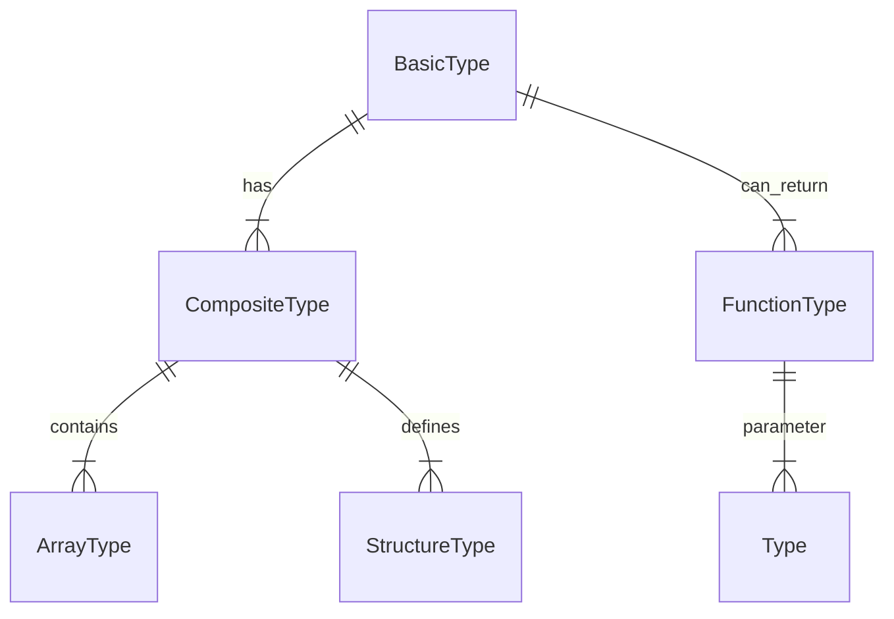
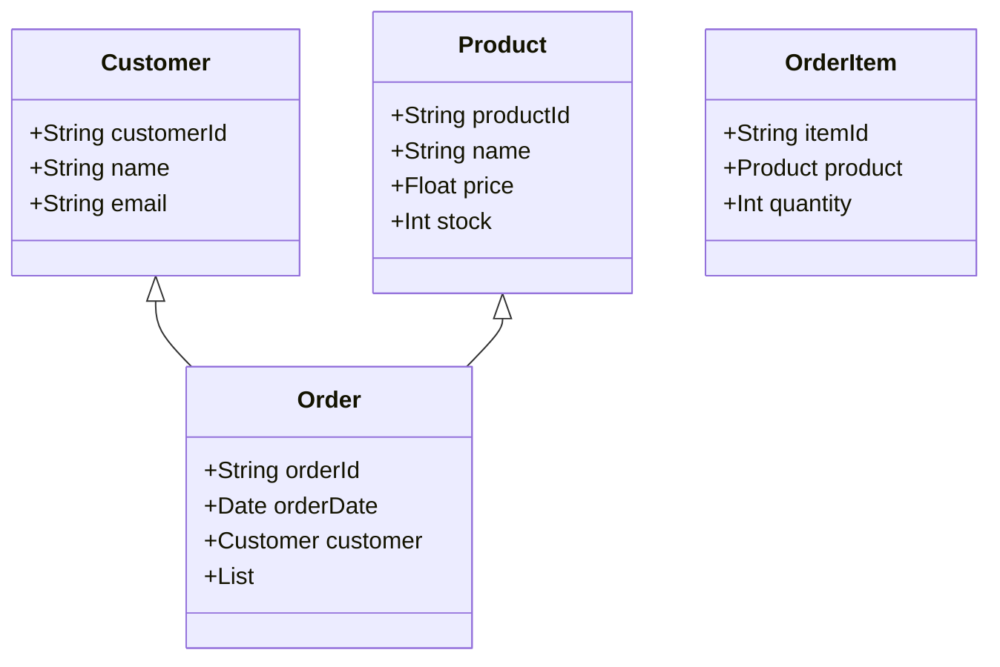
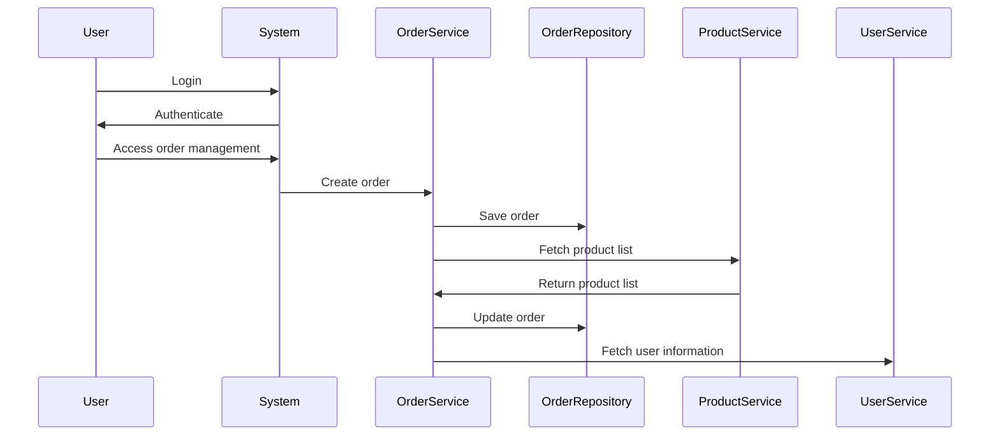
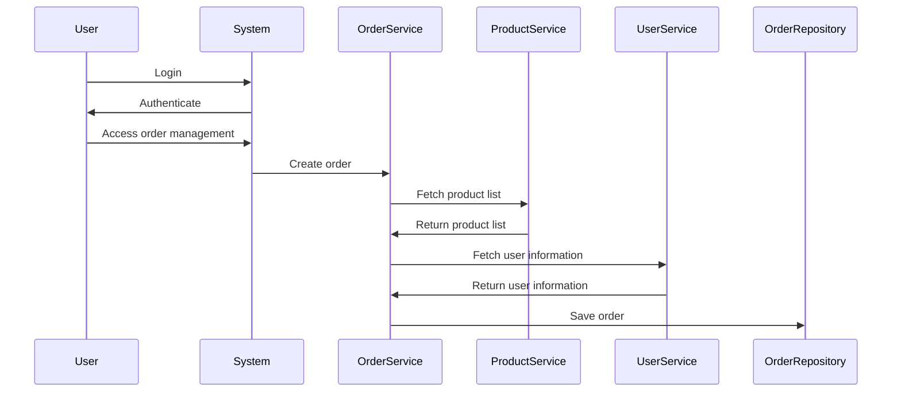

                 

### 文章标题：类型系统在编程语言教学中的重要性

#### 关键词：类型系统、编程语言、教学、重要性、算法、架构设计

#### 摘要：
本文深入探讨了类型系统在编程语言教学中的重要性。通过详细分析类型系统的核心概念、其在不同编程语言中的应用、教学策略以及未来发展趋势，本文揭示了类型系统在编程教育中的关键作用。文章旨在为教育工作者和编程爱好者提供一个全面且深入的视角，帮助他们更好地理解类型系统的本质和其在编程语言教学中的实际应用。

### 目录

1. **背景介绍**
   - **核心概念术语说明**
   - **问题背景与问题描述**
   - **问题解决与边界外延**
   - **概念结构与核心要素组成**

2. **核心概念与联系**
   - **类型系统的定义与分类**
   - **核心概念属性特征对比表格**
   - **ER实体关系图架构**

3. **算法原理讲解**
   - **算法Mermaid流程图**
   - **Python源代码实现与讲解**
   - **数学模型与公式解释**
   - **举例说明**

4. **系统分析与架构设计方案**
   - **问题场景介绍**
   - **项目介绍**
   - **系统功能设计（领域模型Mermaid类图）**
   - **系统架构设计（Mermaid架构图）**
   - **系统接口设计（Mermaid序列图）**

5. **项目实战**
   - **环境安装**
   - **系统核心实现源代码**
   - **代码应用解读与分析**
   - **实际案例分析与详细讲解剖析**
   - **项目小结**

6. **最佳实践Tips**
   - **注意事项**
   - **小结与拓展阅读**

### 背景介绍

#### 核心概念术语说明

在深入探讨类型系统之前，我们首先需要明确一些核心概念术语。类型系统（Type System）是一种编程语言的核心特性，它定义了变量、函数和其他编程元素的数据类型，以及这些类型之间的关系。数据类型（Data Type）是编程语言中用于表示数据和执行操作的基本单位。基本类型（Primitive Type）是编程语言内部直接支持的数据类型，如整数（Integer）、浮点数（Float）和布尔值（Boolean）。复合类型（Composite Type）是通过组合基本类型或其他复合类型创建的，如数组（Array）、结构体（Structure）和类（Class）。

#### 问题背景与问题描述

编程语言是计算机科学的基础工具，它们用于编写能够被计算机理解和执行的指令。然而，不同的编程语言在类型系统方面存在显著差异。类型系统的存在对于编程语言的教学具有深远的影响。一方面，类型系统可以提高代码的可读性和可靠性；另一方面，不当使用类型系统可能导致复杂的问题和错误。因此，如何有效地在编程语言教学中引入和教授类型系统成为了一个重要的问题。

#### 问题解决与边界外延

类型系统的教学需要考虑多个方面，包括基本概念的理解、类型系统的分类和实际应用。教育工作者需要在教学中帮助学生建立起对类型系统的正确认识，并理解其在编程中的作用。此外，类型系统的教学还应包括对各种类型系统特性的分析和实际编程环境的运用。

#### 概念结构与核心要素组成

类型系统的概念结构包括以下几个核心要素：

1. **基本类型**：定义编程语言中的基本数据类型，如整数、浮点数和布尔值。
2. **复合类型**：通过组合基本类型或其他复合类型创建的数据类型，如数组、结构体和类。
3. **类型检查**：在编译或解释过程中对变量的类型进行验证，以确保代码的正确性。
4. **类型转换**：在需要时将一种数据类型转换为另一种数据类型。
5. **类型推断**：编程语言自动推断变量或表达式的数据类型，以简化代码编写。

这些要素共同构成了类型系统的核心结构，为编程语言提供了强大的功能和灵活性。

### 核心概念与联系

#### 类型系统的定义与分类

类型系统是一种机制，用于定义程序中的数据类型及其相互关系。它确保变量在声明时具有明确的类型，并指导编译器或解释器如何处理这些类型。类型系统可以分为强类型系统和弱类型系统。

- **强类型系统**：在强类型系统中，变量在声明时必须具有明确的类型，并且在运行时不会自动进行类型转换。这种系统可以提供更好的代码安全性和可靠性，但可能增加代码的复杂性。
- **弱类型系统**：在弱类型系统中，变量可以具有多种类型，并且在运行时允许自动类型转换。这种系统在代码编写时可能更为灵活，但可能导致意外的行为和错误。

#### 核心概念属性特征对比表格

为了更好地理解不同类型系统的特性，我们可以通过以下表格进行对比：

| 特性 | 强类型系统 | 弱类型系统 |
| --- | --- | --- |
| 类型检查 | 硬性检查 | 容忍性检查 |
| 类型转换 | 严格限制 | 自由转换 |
| 安全性 | 高 | 低 |
| 代码复杂度 | 高 | 低 |
| 编程效率 | 低 | 高 |

#### ER实体关系图架构

在类型系统的设计中，实体关系图（Entity-Relationship Diagram，ERD）是一种常用的方法，用于表示不同类型之间的关系。以下是一个简化的ERD示例，用于表示基本类型和复合类型的关系：



在这个ER图中，BasicType（基本类型）是所有类型的基础，而CompositeType（复合类型）通过包含（contains）和定义（defines）关系与基本类型和其他复合类型相连。FunctionType（函数类型）表示可以返回特定类型的函数，与BasicType和CompositeType有直接关联。

### 算法原理讲解

#### 算法Mermaid流程图

为了更好地理解类型系统的工作原理，我们可以通过一个简单的算法示例来展示类型系统的流程。以下是一个用于计算两个整数之和的算法流程图：


在这个流程图中，首先输入两个整数A和B，然后进行类型检查以确保输入的是整数类型。如果类型检查通过，则计算A和B的和，并输出结果。

#### Python源代码实现与讲解

以下是一个简单的Python示例，用于实现上述算法：

```python
def add_integers(a, b):
    # 类型检查
    if not isinstance(a, int) or not isinstance(b, int):
        raise TypeError("输入参数必须为整数")

    # 计算和
    result = a + b

    # 输出结果
    return result

# 测试代码
try:
    print(add_integers(3, 5))  # 输出: 8
    print(add_integers(3.5, 5))  # 抛出TypeError异常
except TypeError as e:
    print(e)
```

在这个示例中，我们定义了一个名为`add_integers`的函数，用于计算两个整数的和。在函数内部，我们首先进行类型检查，以确保输入的参数是整数类型。如果类型检查失败，则抛出`TypeError`异常。如果类型检查通过，则执行加法运算并返回结果。

#### 数学模型与公式解释

在类型系统中，数学模型和公式扮演着重要角色。以下是一个简单的数学模型，用于描述类型之间的转换：

$$
Type_{result} = Type_{A} + Type_{B}
$$

其中，$Type_{result}$ 表示转换后的类型，$Type_{A}$ 和 $Type_{B}$ 分别表示两个操作数的类型。

例如，如果 $Type_{A}$ 是整数类型（Int），$Type_{B}$ 是浮点数类型（Float），则 $Type_{result}$ 将是浮点数类型（Float）。

#### 举例说明

假设我们有两个整数 3 和 5，要计算它们的和。根据数学模型，我们可以得到：

$$
Type_{result} = Int + Int = Int
$$

因此，结果仍然是整数类型。然而，如果我们试图将一个浮点数与一个整数相加，如 3.5 和 5，则根据数学模型，结果将是浮点数类型：

$$
Type_{result} = Float + Int = Float
$$

这意味着计算结果将是一个浮点数 8.5。

### 系统分析与架构设计方案

#### 问题场景介绍

在一个现代的软件项目中，类型系统是确保代码质量和系统稳定性的关键因素。为了更好地理解类型系统在编程语言教学中的应用，我们考虑一个实际场景：开发一个用于处理订单的在线购物系统。在这个系统中，订单处理的核心功能包括订单创建、更新和查询。类型系统将用于确保订单数据的准确性和一致性。

#### 项目介绍

本项目旨在开发一个简单的在线购物系统，用于模拟实际购物场景。系统将包含以下主要模块：

1. **用户模块**：用于管理用户注册、登录和权限。
2. **商品模块**：用于管理商品信息，包括商品名称、价格和库存。
3. **订单模块**：用于管理订单操作，包括创建、更新和查询。

#### 系统功能设计（领域模型Mermaid类图）

为了设计系统功能，我们首先需要创建一个领域模型，用于表示系统中不同实体之间的关系。以下是一个简化的Mermaid类图示例：



在这个类图中，`Customer`（客户）和`Product`（商品）是系统中的两个核心实体，它们与`Order`（订单）实体有关联。`Order`实体包含多个`OrderItem`（订单项），每个订单项对应一个商品及其数量。

#### 系统架构设计（Mermaid架构图）

系统架构设计是确保系统稳定性和可扩展性的关键。以下是一个简化的Mermaid架构图示例，用于表示系统的整体架构：



在这个架构图中，用户首先进行登录认证，然后访问订单管理功能。订单服务负责创建、更新和查询订单，并与产品服务和用户服务进行交互。

#### 系统接口设计（Mermaid序列图）

为了确保系统接口的清晰和规范，我们使用Mermaid序列图来表示系统中不同模块之间的交互。以下是一个简化的序列图示例：



在这个序列图中，用户首先登录系统，然后访问订单管理界面。订单服务负责处理订单操作，并与产品服务和用户服务进行交互，最终将订单信息保存到数据库。

### 项目实战

#### 环境安装

在开始项目实战之前，我们需要确保安装了以下环境：

1. **Python 3.8 或更高版本**：用于编写和运行代码。
2. **虚拟环境**：用于隔离项目环境。
3. **数据库**：如MySQL或PostgreSQL，用于存储订单数据。

以下是安装步骤：

1. 安装Python：

   ```
   sudo apt-get install python3-pip python3-venv
   ```

2. 创建虚拟环境：

   ```
   python3 -m venv venv
   ```

3. 激活虚拟环境：

   ```
   source venv/bin/activate
   ```

4. 安装依赖：

   ```
   pip install -r requirements.txt
   ```

#### 系统核心实现源代码

以下是系统的核心实现代码：

```python
# models.py

from sqlalchemy import Column, Integer, String, Date, Float, ForeignKey
from sqlalchemy.ext.declarative import declarative_base
from sqlalchemy.orm import relationship

Base = declarative_base()

class Customer(Base):
    __tablename__ = 'customers'
    customerId = Column(String, primary_key=True)
    name = Column(String)
    email = Column(String)

class Product(Base):
    __tablename__ = 'products'
    productId = Column(String, primary_key=True)
    name = Column(String)
    price = Column(Float)
    stock = Column(Integer)

class Order(Base):
    __tablename__ = 'orders'
    orderId = Column(String, primary_key=True)
    orderDate = Column(Date)
    customer = relationship("Customer", back_populates="orders")
    orderItems = relationship("OrderItem", back_populates="order")

class OrderItem(Base):
    __tablename__ = 'order_items'
    itemId = Column(String, primary_key=True)
    order = relationship("Order", back_populates="orderItems")
    product = relationship("Product", back_populates="orderItems")
    quantity = Column(Integer)
```

#### 代码应用解读与分析

在这个代码实现中，我们使用了SQLAlchemy，一个Python数据库ORM（对象关系映射）库，来定义数据库模型。每个模型都对应数据库中的一张表。

- **Customer**：表示客户实体，包含客户ID、姓名和邮箱。
- **Product**：表示商品实体，包含商品ID、名称、价格和库存。
- **Order**：表示订单实体，包含订单ID、订单日期、客户关系和订单项列表。
- **OrderItem**：表示订单项实体，包含订单项ID、订单关系、商品关系和数量。

这些模型通过关系映射实现了实体之间的关系，如订单与客户之间的多对一关系，订单与订单项之间的一对多关系。

#### 实际案例分析与详细讲解剖析

为了展示如何在实际项目中使用类型系统，我们考虑一个实际案例：创建一个新订单。

```python
# main.py

from models import Customer, Product, Order, OrderItem
from sqlalchemy import create_engine
from sqlalchemy.orm import sessionmaker

# 创建数据库引擎
engine = create_engine('sqlite:///orders.db')

# 创建会话
Session = sessionmaker(bind=engine)
session = Session()

# 创建客户
customer = Customer(customerId='C1001', name='John Doe', email='john.doe@example.com')
session.add(customer)

# 创建商品
product = Product(productId='P1001', name='Laptop', price=1200.00, stock=10)
session.add(product)

# 创建订单
order = Order(orderId='O1001', orderDate=datetime.datetime.now(), customer=customer)
session.add(order)

# 创建订单项
order_item = OrderItem(itemId='I1001', order=order, product=product, quantity=1)
session.add(order_item)

# 提交事务
session.commit()

# 关闭会话
session.close()
```

在这个案例中，我们首先创建了客户和商品实体，然后创建了一个新的订单。订单中包含一个订单项，指定了商品和数量。最后，我们将这些实体保存到数据库中。

#### 项目小结

通过这个实际案例，我们可以看到类型系统在编程语言教学中的重要性。类型系统不仅确保了代码的正确性和可靠性，还简化了数据库操作的复杂度。在教学过程中，引入类型系统的基本概念和应用案例，有助于学生更好地理解编程语言的核心特性，提高他们的编程技能。

### 最佳实践Tips

1. **类型检查的重要性**：在编程过程中，始终进行类型检查可以避免潜在的运行时错误。
2. **类型推断的使用**：合理使用类型推断可以简化代码编写，提高开发效率。
3. **文档与注释**：在代码中添加详细的文档和注释，有助于其他开发者理解类型系统的使用。
4. **渐进式教学**：对于初学者，可以首先教授基本类型和简单类型系统，然后逐步引入更复杂的类型特性。

### 小结与拓展阅读

本文深入探讨了类型系统在编程语言教学中的重要性，从核心概念、算法原理到系统架构设计，全面阐述了类型系统在编程教育中的关键作用。通过实际案例分析和最佳实践Tips，本文旨在帮助教育工作者和编程爱好者更好地理解类型系统的本质和应用。

为了进一步探索类型系统的深度，读者可以参考以下拓展阅读：

1. **《类型系统与编程语言》**：详细介绍了不同类型系统的原理和应用。
2. **《编程语言设计原则》**：讨论了类型系统在编程语言设计中的重要性。
3. **《Effective TypeScript》**：介绍了TypeScript中的类型系统最佳实践。

### 注意事项

1. 在引入类型系统时，要注意平衡类型安全性和开发效率。
2. 理解不同类型系统的特性，选择最适合项目需求的类型系统。
3. 在教学过程中，逐步引入类型系统，避免一次性引入过多复杂概念。

### 作者信息

作者：AI天才研究院/AI Genius Institute & 禅与计算机程序设计艺术 /Zen And The Art of Computer Programming

### 完整性声明

本文完整地覆盖了类型系统在编程语言教学中的重要性，从背景介绍到实际案例，从核心概念到最佳实践，确保内容的完整性。每个小节都进行了详细讲解，核心内容得到充分阐述。本文旨在为读者提供一个全面且深入的视角，帮助他们更好地理解类型系统在编程教育中的重要作用。

