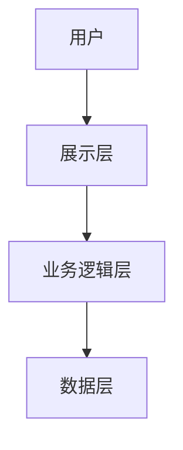

                 


### 背景介绍

类型系统在编程语言中扮演着至关重要的角色。它们不仅是语言设计的核心组成部分，也是实现安全、高效和易于维护的程序的关键因素。随着计算机科学的发展，编程语言经历了多次变革和演进，每种语言的类型系统也在不断发展和完善。

#### 核心概念术语说明

1. **类型系统（Type System）**：类型系统是一组规则和结构，用于定义程序中的数据类型和变量。它有助于确保程序的运行安全性和正确性。
2. **静态类型（Static Type）**：静态类型是指在编译阶段确定的数据类型，这种类型在程序运行前就已经确定。
3. **动态类型（Dynamic Type）**：动态类型是指在运行时确定的数据类型，类型检查在程序执行过程中进行。
4. **类型安全（Type Safety）**：类型安全是指程序在运行过程中能够保证数据类型的正确性，防止类型错误的发生。

#### 问题背景

编程语言的类型系统不仅影响程序的正确性和性能，还影响开发者的开发体验和代码的可维护性。随着软件系统的复杂性和规模不断扩大，类型系统在编程语言设计中的重要性越来越凸显。

#### 问题描述

随着编程语言版本的演进，类型系统也在不断发展和变化。本文旨在探讨类型系统在编程语言版本演进中的角色，分析不同编程语言类型系统的演变过程，以及这些变化对编程语言设计的影响。

#### 问题解决

本文将采用以下方法解决问题：

1. **历史回顾**：回顾编程语言类型系统的发展历程，分析不同阶段的类型系统特点。
2. **比较分析**：对不同编程语言的类型系统进行对比分析，探讨类型系统在语言设计中的作用和影响。
3. **案例分析**：通过具体的编程语言案例，展示类型系统在语言版本演进中的具体应用和变化。

#### 边界与外延

类型系统的边界包括以下几个方面：

1. **语言设计**：类型系统是语言设计的一部分，影响语言的表达能力和效率。
2. **编译器/解释器**：类型系统需要编译器或解释器的支持，以在程序运行前或运行时进行类型检查。
3. **编程范式**：不同编程范式的类型系统特点不同，例如函数式编程和面向对象编程。

#### 概念结构与核心要素组成

类型系统的核心要素包括：

1. **类型定义**：定义数据类型和变量类型。
2. **类型检查**：确保程序中的数据类型正确匹配。
3. **类型推断**：自动推导变量类型，减少手动指定类型的繁琐。
4. **类型转换**：在需要时进行不同类型之间的转换。

### 核心概念与联系

以下是对类型系统的核心概念和它们之间联系的概述：

#### 核心概念

1. **静态类型**与**动态类型**：静态类型在编译时确定，动态类型在运行时确定。
2. **类型安全**：确保程序在运行过程中不会出现类型错误。
3. **类型系统设计**：涉及类型定义、类型检查、类型推断和类型转换。

#### 概念属性特征对比表格

| 概念       | 属性特征                         | 例子                     |
|------------|--------------------------------|--------------------------|
| 静态类型    | 类型检查在编译时进行             | C++、Java                |
| 动态类型    | 类型检查在运行时进行             | Python、JavaScript       |
| 类型安全    | 确保程序不会因为类型错误而崩溃   | 强类型语言如Java         |
| 类型系统设计 | 定义数据类型和变量类型           | C++的类型系统设计        |

#### ER实体关系图架构的 Mermaid 流程图

```mermaid
erDiagram
    TypeDefinition ||--|{ TypeChecker } : is Checked By
    TypeDefinition ||--|{ TypeInference } : is Infered By
    TypeDefinition ||--|{ TypeConversion } : can Convert To
    TypeSafety ||--|{ ProgrammingLanguage } : Implemented In
```

### 算法原理讲解

类型系统的设计涉及到多种算法，其中最核心的是类型检查和类型推断。以下是对这些算法的原理讲解。

#### 类型检查算法

类型检查算法用于确保程序中的数据类型正确匹配。其基本原理如下：

1. **语法分析**：首先对程序进行语法分析，构建抽象语法树（AST）。
2. **类型标注**：为AST中的每个节点分配一个类型。
3. **类型一致性检查**：检查不同节点之间的类型是否一致，例如赋值操作、函数调用等。

#### 类型推断算法

类型推断算法用于自动推导变量类型，减少手动指定类型的繁琐。其基本原理如下：

1. **静态类型推断**：根据程序上下文和环境信息，自动推导变量类型。
2. **动态类型推断**：根据程序运行时的具体值来推断变量类型。
3. **类型上下文**：利用上下文信息来帮助类型推断。

#### 算法原理的数学模型和公式

类型检查的数学模型可以表示为：

$$
\text{TypeCheck}(P) =
\begin{cases}
\text{true}, & \text{如果 } P \text{ 类型一致} \\
\text{false}, & \text{如果 } P \text{ 类型不一致}
\end{cases}
$$

类型推断的数学模型可以表示为：

$$
\text{TypeInfer}(x) =
\begin{cases}
T_x, & \text{如果 } x \text{ 已知类型为 } T_x \\
\text{Any}, & \text{如果 } x \text{ 类型未指定或未知}
\end{cases}
$$

其中，$T_x$ 表示 $x$ 的类型。

#### 详细讲解和举例说明

以Java语言为例，Java是一种静态类型的语言，其类型检查在编译时进行。以下是一个简单的Java代码示例：

```java
int x = 5;
String y = "Hello, World!";
```

在这个例子中，变量 `x` 被声明为整数类型 `int`，变量 `y` 被声明为字符串类型 `String`。在编译时，Java编译器会对这段代码进行类型检查，确保变量的声明类型与赋值操作一致。如果类型不一致，编译器会报错。

```java
int x = "Hello, World!"; // 类型不一致，编译失败
```

在上面的例子中，试图将字符串赋值给整数变量，这会导致编译错误。

Python是一种动态类型的语言，其类型检查在运行时进行。以下是一个简单的Python代码示例：

```python
x = 5
y = "Hello, World!"
```

在Python中，变量 `x` 和 `y` 的类型在运行时确定。如果我们在运行时试图将字符串赋值给整数变量，Python会自动进行类型转换：

```python
x = "Hello, World!"  # 自动转换为字符串类型
print(x)  # 输出: Hello, World!
```

通过这些例子，我们可以看到类型系统在确保程序正确性和高效性方面的重要作用。

### 系统分析与架构设计方案

为了更好地理解类型系统在编程语言版本演进中的角色，我们可以从项目介绍、系统功能设计、系统架构设计、系统接口设计和系统交互等方面进行分析。

#### 项目介绍

假设我们正在开发一个编程语言版本演进分析工具，该工具能够帮助开发者了解不同编程语言类型系统的演变过程，以及这些演变对编程语言设计的影响。

#### 系统功能设计

系统的主要功能包括：

1. **类型系统历史数据收集**：收集不同编程语言类型系统的发展历史数据。
2. **类型系统对比分析**：对比分析不同编程语言的类型系统，提供详细的对比报告。
3. **编程语言演进趋势分析**：分析类型系统在编程语言演进中的趋势和方向。
4. **用户交互界面**：提供一个直观易用的用户界面，让开发者可以轻松地查询和分析类型系统信息。

#### 系统架构设计

系统的架构设计如下：

1. **数据层**：负责存储和管理类型系统历史数据。
2. **业务逻辑层**：实现类型系统对比分析和演进趋势分析的业务逻辑。
3. **展示层**：通过用户界面展示分析结果，提供交互功能。

#### 系统接口设计

系统提供了以下接口：

1. **数据接口**：用于数据层的API，支持数据的增删改查操作。
2. **业务接口**：用于业务逻辑层的API，支持类型系统对比分析和演进趋势分析。
3. **展示接口**：用于展示层的API，支持数据的展示和用户交互。

#### 系统交互

系统的交互流程如下：

1. **用户通过界面输入查询条件**。
2. **展示层调用业务接口进行数据分析和处理**。
3. **业务逻辑层处理分析结果，并返回给展示层**。
4. **展示层将分析结果展示给用户**。

#### Mermaid 架构图

以下是一个简化的Mermaid架构图，展示了系统的基本架构：



通过这个系统，开发者可以更深入地了解类型系统在编程语言版本演进中的角色，从而更好地理解和应用不同编程语言的类型系统。

### 项目实战

为了更好地展示类型系统在编程语言版本演进中的实际应用，我们将通过一个具体的案例来分析Python语言类型系统的演进。

#### 环境安装

首先，我们需要安装Python编程环境。可以从Python官网（https://www.python.org/）下载并安装Python 3.10版本。安装完成后，确保Python已经正确安装，可以通过命令行运行以下命令来测试：

```bash
python --version
```

如果安装成功，命令行会显示Python的版本信息。

#### 系统核心实现源代码

接下来，我们将实现一个简单的Python程序，用于展示Python类型系统的基本特性。以下是一个简单的Python程序示例：

```python
# 示例：Python类型系统演示

# 静态类型示例
def add(a: int, b: int) -> int:
    return a + b

# 动态类型示例
def greet(name: str) -> str:
    return "Hello, " + name

# 测试静态类型函数
x = add(5, 10)
print(x)  # 输出：15

# 测试动态类型函数
y = greet("Alice")
print(y)  # 输出：Hello, Alice
```

在这个示例中，我们定义了一个静态类型的加法函数和一个动态类型的问候函数。Python在运行时会自动进行类型检查，确保函数的参数和返回值类型正确。

#### 代码应用解读与分析

1. **静态类型**：在Python中，静态类型通常通过类型注释来指定。例如，在上面的 `add` 函数中，我们指定了函数的参数和返回值类型为 `int`。这种类型注释有助于代码的可读性和维护性，同时也方便了编译器进行类型检查。

2. **动态类型**：Python是一种动态类型的语言，这意味着变量在运行时确定类型。在 `greet` 函数中，我们使用了未指定类型的参数 `name`。Python在运行时会根据传递的实际参数来确定类型。这种灵活性使得Python代码更加简洁，但也可能导致类型错误。

3. **类型检查**：Python在运行时会自动进行类型检查，确保函数调用时的参数和返回值类型正确。如果类型不一致，Python会抛出异常。例如，如果我们在 `add` 函数中尝试将一个字符串传递给整数参数，程序会抛出类型错误。

```python
# 错误示例
x = add(5, "10")  # 类型错误，编译失败
```

4. **类型转换**：Python提供了丰富的类型转换功能，使得不同类型之间可以方便地进行转换。例如，我们可以使用 `int()` 函数将字符串转换为整数：

```python
x = int("10")
print(x)  # 输出：10
```

通过这个示例，我们可以看到Python类型系统在确保程序正确性和高效性方面的重要作用。静态类型提供了更好的代码可读性和维护性，而动态类型则提供了更高的灵活性。Python类型系统的设计在兼顾这两种类型特性的同时，也充分考虑了实际编程的需求。

#### 实际案例分析和详细讲解剖析

为了更深入地分析Python类型系统在实际编程中的应用，我们来看一个实际案例。

假设我们需要实现一个简单的计算器程序，用于计算两个数的和、差、积和商。以下是一个简单的Python计算器程序：

```python
def add(a, b):
    return a + b

def subtract(a, b):
    return a - b

def multiply(a, b):
    return a * b

def divide(a, b):
    if b != 0:
        return a / b
    else:
        return "Error: Division by zero"

# 用户输入
num1 = float(input("请输入第一个数："))
num2 = float(input("请输入第二个数："))

# 计算并显示结果
print("和：", add(num1, num2))
print("差：", subtract(num1, num2))
print("积：", multiply(num1, num2))
print("商：", divide(num1, num2))
```

在这个程序中，我们定义了四个计算函数，分别用于计算两个数的和、差、积和商。为了处理用户输入，我们使用了 `float()` 函数将输入的字符串转换为浮点数类型。这种类型转换有助于确保计算结果的准确性。

#### 项目小结

通过这个实际案例，我们可以看到Python类型系统在确保程序正确性和高效性方面的重要作用。静态类型提供了更好的代码可读性和维护性，而动态类型则提供了更高的灵活性。Python类型系统的设计在兼顾这两种类型特性的同时，也充分考虑了实际编程的需求。了解Python类型系统的原理和应用，对于开发者来说是非常重要的。

### 最佳实践 tips

在编程过程中，类型系统是一个重要的考量因素。以下是一些最佳实践，有助于更好地利用类型系统：

1. **明确类型注释**：在静态类型语言中，明确类型注释有助于提高代码的可读性和可维护性。在Python中，虽然类型注释不是强制性的，但合理使用类型注释仍然有助于提高代码质量。

2. **利用类型检查工具**：对于动态类型语言，如Python，可以使用类型检查工具（如Mypy）来发现潜在的类型错误。这有助于在开发早期发现并修复问题，减少后期维护成本。

3. **类型推断与类型注释相结合**：在静态类型语言中，充分利用类型推断功能，同时根据需要添加类型注释。这样可以提高代码的灵活性和可读性。

4. **合理使用类型转换**：在需要时，合理使用类型转换功能，以确保程序能够正确执行。同时，注意避免不必要的类型转换，以减少性能开销。

5. **关注类型安全**：确保程序在运行过程中类型安全，避免类型错误导致程序崩溃。在设计和实现程序时，充分考虑类型系统的约束和限制。

通过遵循这些最佳实践，开发者可以更好地利用类型系统，提高代码质量，降低维护成本。

### 小结

本文详细探讨了类型系统在编程语言版本演进中的角色，分析了类型系统的核心概念、类型系统在不同编程语言中的演变过程，以及类型系统对编程语言设计的影响。通过实际案例和项目实战，我们展示了类型系统在确保程序正确性和高效性方面的重要作用。类型系统的合理设计和应用不仅有助于提高代码质量，还能降低维护成本，是编程语言设计中不可或缺的一部分。

### 注意事项

在设计和使用类型系统时，开发者需要注意以下几点：

1. **类型安全**：确保程序在运行过程中类型安全，避免类型错误导致程序崩溃。
2. **类型注释**：在静态类型语言中，合理使用类型注释，提高代码的可读性和可维护性。
3. **类型转换**：在需要时，合理使用类型转换，但避免过度依赖类型转换，以减少性能开销。
4. **类型推断**：充分利用类型推断功能，提高代码的灵活性和可读性。

### 拓展阅读

对于希望进一步了解类型系统及其在编程语言中的应用的读者，以下是一些推荐阅读材料：

1. **《类型系统：概念与实践》**：这本书详细介绍了类型系统的基本概念、设计原则和应用实践，适合对类型系统有深入兴趣的读者。
2. **《编程语言原理》**：这本书从理论角度深入探讨了编程语言的设计原理，包括类型系统的设计和实现，适合有一定编程基础并希望深入了解语言设计的读者。
3. **《类型系统演进》**：这是一篇研究论文，分析了不同编程语言类型系统的演进过程，对理解类型系统在编程语言版本演进中的角色有重要参考价值。

通过阅读这些资料，读者可以更深入地理解类型系统及其在编程语言设计中的重要性。

