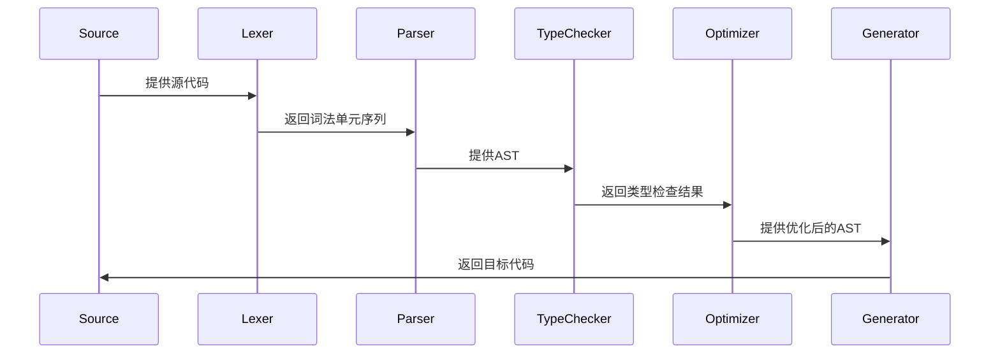
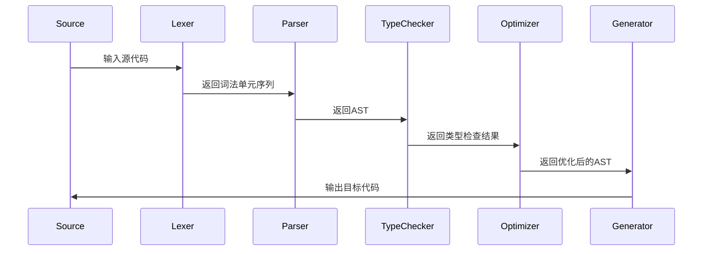

                 

### 文章标题

### 关键词
- 类型系统
- 编译器后端优化
- 性能提升
- 代码生成
- 优化算法

### 摘要
本文深入探讨了类型系统在编译器后端优化中的应用。我们将首先介绍类型系统的基本概念，解释其在编译过程中的重要性。随后，文章将详细解析类型系统的设计原则和策略，并通过实际案例展示其在后端优化中的作用。本文还将介绍几种典型的后端优化算法，并分析它们与类型系统的相互关系。通过数学模型和公式的阐述，读者将对类型系统在优化过程中的精确作用有更深刻的理解。文章最后将提供一个具体的项目实战，展示如何在实际开发中利用类型系统实现编译器后端优化，并提供一些最佳实践和拓展阅读建议，帮助读者进一步深入研究和应用这一关键技术。

### 背景介绍

在计算机科学领域，编译器作为将源代码转换为可执行代码的关键工具，其性能直接影响软件开发的效率。编译器的后端优化（Back-End Optimization）是编译器设计中的一个核心环节，主要目标是通过一系列的代码变换和优化手段，提升生成的目标代码的运行效率，减少其执行时间，同时降低内存使用，提升整体性能。

类型系统（Type System）在编译器后端优化中扮演着至关重要的角色。它不仅为编译器提供了类型检查的基础，确保代码的正确性，还为优化过程提供了重要的信息。具体来说，类型系统主要有以下几个作用：

1. **确保代码正确性**：通过类型检查，编译器可以提前发现可能的类型错误，如不兼容的类型转换或未声明的变量。这些错误如果不被及时发现，可能会在运行时导致程序崩溃或产生不可预知的行为。

2. **提供关键优化信息**：类型信息能够帮助编译器进行多种优化操作，如常量折叠（Constant Folding）、死代码消除（Dead Code Elimination）和循环优化（Loop Optimization）。这些优化可以显著减少代码的执行时间，提高程序的性能。

3. **优化内存管理**：类型系统提供的类型信息可以指导编译器更有效地管理内存分配和释放，减少内存碎片和提高内存使用效率。

4. **代码生成优化**：在编译器的代码生成阶段，类型信息可以帮助编译器生成更高效的机器代码。例如，通过类型推断（Type Inference），编译器可以优化数据结构的存储和访问方式，从而减少指令数量和内存访问次数。

因此，类型系统不仅是编译器正确性保障的核心，也是后端优化的重要依据。没有健全的类型系统，编译器的优化能力将受到极大限制。类型系统的设计与实现直接决定了编译器优化效率的高低，从而影响到最终生成代码的性能。在接下来的章节中，我们将进一步探讨类型系统的核心概念、设计原则和具体应用，揭示其在编译器后端优化中的深刻影响。

### 核心概念与联系

在深入了解类型系统在编译器后端优化中的应用之前，我们首先需要明确几个核心概念，并探讨它们之间的相互联系。以下是类型系统中的几个关键概念及其相互关系：

#### 类型系统概述

类型系统是编译器的一个重要组成部分，它定义了程序中数据的类型和操作这些数据的规则。类型系统的核心作用是确保程序的正确性，并提供编译器进行优化所需的信息。

**概念**：类型系统（Type System）

**定义**：类型系统是编程语言的一部分，它定义了变量、函数、表达式等程序元素的类型，以及这些类型之间的兼容性和转换规则。

**属性**：
- **静态类型**：在编译时确定类型的类型系统，如C++和Java。
- **动态类型**：在运行时确定类型的类型系统，如Python和JavaScript。

#### 基本类型

基本类型是编程语言中最基础的类型，如整数、浮点数、布尔值等。基本类型不仅构成了复杂类型的基础，还为编译器的类型检查和优化提供了最基本的单位。

**概念**：基本类型（Basic Types）

**定义**：基本类型是编程语言中定义的原子类型，通常不可再分。

**属性**：
- **原子性**：每个基本类型代表一个不可分割的数据单位。
- **兼容性**：不同基本类型之间的操作和转换有一定的规则。

#### 复合类型

复合类型是由基本类型组合而成的更复杂的类型，如数组和结构体（struct）。复合类型提供了对复杂数据结构的支持，使得程序能够更灵活地处理多种数据。

**概念**：复合类型（Composite Types）

**定义**：复合类型是由多个基本类型组合而成的更复杂的类型。

**属性**：
- **可变性**：复合类型中的元素可以独立变化。
- **内存布局**：复合类型的内存布局与基本类型的组合方式密切相关。

#### 类型转换

类型转换（Type Conversion）是类型系统中一个重要的概念，它涉及到将一种类型的数据转换为另一种类型的数据。类型转换既可以是隐式的，也可以是显式的。

**概念**：类型转换（Type Conversion）

**定义**：类型转换是编程语言中用于将一种类型的数据转换为另一种类型的过程。

**属性**：
- **隐式转换**：编译器自动进行的类型转换，通常在类型兼容的情况下发生。
- **显式转换**：程序员显式指定的类型转换，通常涉及强制类型转换。

#### 关系图

为了更好地理解这些核心概念之间的联系，我们可以使用ER（实体-关系）图来表示它们之间的关系。以下是类型系统核心概念的ER图：

```mermaid
erDiagram
    BasicType ||--|{ CompositeType : contains}
    BasicType ||--|{ TypeConversion : converts_to}
    CompositeType ||--|{ TypeConversion : converts_from}
    TypeConversion ||--|{ ProgramElement : applies_to}
```

- **BasicType**（基本类型）：是复合类型和类型转换的基础。
- **CompositeType**（复合类型）：由基本类型组合而成，可以包含类型转换。
- **TypeConversion**（类型转换）：连接基本类型和复合类型，为程序元素提供转换规则。
- **ProgramElement**（程序元素）：类型转换应用于程序中的各种元素，如变量、函数和表达式。

通过这个ER图，我们可以清晰地看到基本类型、复合类型和类型转换之间的相互关系。这些概念不仅构成了类型系统的核心，也为编译器的优化提供了丰富的信息。

在接下来的章节中，我们将进一步探讨类型系统的设计原则和具体应用，揭示其在编译器后端优化中的具体作用。通过对这些概念深入理解，我们将能够更好地把握类型系统在编译器优化过程中的关键角色。

### 类型系统设计

类型系统的设计是编译器开发中的一个重要环节，它不仅决定了编译器的性能和效率，还直接影响到生成的目标代码的质量。一个良好的类型系统设计需要遵循一系列原则，并采用合适的策略和工具来实现。以下是类型系统设计的关键原则、策略和工具：

#### 设计原则

1. **类型安全性（Type Safety）**：确保程序在运行时不会因为类型错误而崩溃。类型安全性是类型系统的首要原则，它通过类型检查来提前发现潜在的运行时错误。

2. **灵活性（Flexibility）**：类型系统需要支持多种类型操作和类型转换，以适应不同编程需求和场景。灵活性允许程序员编写更加复杂和灵活的代码，同时保证类型系统的完整性和正确性。

3. **可扩展性（Extensibility）**：类型系统设计应考虑到未来可能的扩展和变化，如新增类型、操作符或类型转换规则。可扩展性使得类型系统可以随着编程语言的发展和需求的变化而持续优化。

4. **效率（Efficiency）**：类型系统的实现应尽可能高效，减少类型检查的复杂度和开销，同时确保优化过程的性能。

#### 设计策略

1. **静态类型检查（Static Type Checking）**：在编译时对程序进行类型检查，确保所有类型匹配。静态类型检查可以提前发现类型错误，提高编译效率，但可能牺牲一定的灵活性。

2. **动态类型检查（Dynamic Type Checking）**：在运行时对程序进行类型检查，提供更高的灵活性。动态类型检查可以在运行时适应类型变化，但可能增加运行时开销和复杂度。

3. **类型推断（Type Inference）**：编译器自动推断变量和表达式的类型，减少程序员的工作量。类型推断可以显著提高代码的可读性和可维护性，同时保持类型系统的严格性。

4. **多态性（Polymorphism）**：支持多种类型的操作和函数重载，以处理不同类型的数据。多态性使得程序能够更加通用和灵活，但需要额外的类型检查和优化处理。

#### 设计工具

1. **抽象语法树（Abstract Syntax Tree, AST）**：用于表示程序的结构和语义，是类型检查和优化的基础。通过AST，编译器可以方便地遍历和操作程序代码，进行类型分析和优化。

2. **符号表（Symbol Table）**：用于存储程序中的符号信息，如变量、函数和类。符号表提供了类型检查所需的重要信息，如变量声明、作用域和类型定义。

3. **类型检查器（Type Checker）**：用于检查程序中的类型错误和类型兼容性。类型检查器通过遍历AST和符号表，执行一系列的类型分析操作，确保程序的正确性和类型安全性。

4. **类型推断器（Type Inferencer）**：用于自动推断变量和表达式的类型。类型推断器利用AST和符号表中的信息，进行上下文分析和类型推理，生成准确的类型信息。

#### 设计示例

假设我们设计一个简单的类型系统，支持基本类型（整数、浮点数、布尔值）和复合类型（数组、结构体）。以下是几个关键步骤：

1. **定义基本类型**：
    - 整数（Int）
    - 浮点数（Float）
    - 布尔值（Bool）

2. **定义复合类型**：
    - 数组（Array）：由基本类型定义，如`IntArray`。
    - 结构体（Struct）：由多个基本类型组成，如`Person{Int age, Float height, Bool isStudent}`。

3. **类型检查器实现**：
    - 遍历AST，检查每个表达式的类型。
    - 对于变量，检查其声明和赋值是否类型一致。
    - 对于函数调用，检查参数和返回值类型是否匹配。

4. **类型推断器实现**：
    - 基于上下文和变量声明，推断变量和表达式的类型。
    - 利用类型转换规则，处理显式和隐式类型转换。

通过以上设计步骤，我们可以构建一个简单但功能完整的类型系统，为编译器的优化提供必要的支持。在实际应用中，类型系统设计会更加复杂，需要考虑多种类型操作和优化策略。

类型系统设计不仅决定了编译器的性能，还直接影响程序的可读性和可维护性。遵循良好的设计原则和策略，采用合适的工具和实现方法，可以构建一个高效、灵活且安全的类型系统，从而提升编译器后端优化的效果。

### 后端优化算法

在编译器后端优化中，类型系统提供了关键信息，帮助实现多种优化算法。以下是几种典型的后端优化算法，以及它们与类型系统的关系：

#### 常量折叠（Constant Folding）

常量折叠是一种简单但非常重要的优化技术，它通过计算常数表达式的值，将它们折叠为单一常量。这种优化可以减少指令数量，提高执行效率。

**算法原理**：

1. 遍历抽象语法树（AST），识别常数表达式。
2. 对常数表达式进行计算，例如：
   ```mermaid
   flowchart LR
       A[表达式] --> B[常量]
       B --> C[折叠结果]
   ```
3. 将计算结果替换原始表达式。

**类型系统作用**：

类型系统确保参与常量折叠的表达式都是常量类型，如整数、浮点数等。类型检查可以提前发现不符合条件的表达式，避免运行时错误。

**数学模型**：
$$
result = \textit{expression}
$$

#### 死代码消除（Dead Code Elimination）

死代码消除是一种优化技术，它删除程序中不会执行的代码，从而减少执行时间和内存占用。

**算法原理**：

1. 遍历控制流图（CFG），识别所有节点和边。
2. 对于每个基本块（Basic Block），分析其控制流，识别不会执行的代码。
3. 删除死代码。

**类型系统作用**：

类型系统提供变量存活信息和作用域，帮助确定哪些代码可能影响变量的类型和值。类型检查可以确保删除的代码不会影响程序的正确性。

**数学模型**：

无直接数学模型，但基于逻辑推理和状态转移分析。

#### 循环优化（Loop Optimization）

循环优化包括多种技术，如循环展开（Loop Unrolling）、循环分发（Loop Distribution）和循环优化（Loop Fusion）。这些技术可以减少循环开销，提高程序性能。

**算法原理**：

1. 分析循环结构，识别优化机会。
2. 对于循环展开，将循环体中的指令重复多次，减少循环控制指令的执行。
3. 对于循环分发，将循环分解为多个子循环，以减少并行度。
4. 对于循环优化，将多个循环合并为一个，减少控制流和内存访问的开销。

**类型系统作用**：

类型系统提供循环变量和索引的类型信息，帮助优化循环内的类型检查和类型转换。类型检查可以确保循环中的类型一致性，避免运行时错误。

**数学模型**：

无直接数学模型，但基于循环结构和类型信息。

#### 逃逸分析（Escape Analysis）

逃逸分析是一种确定对象是否在方法调用之间保持存活的技术。通过逃逸分析，编译器可以优化对象的内存分配，减少垃圾回收的开销。

**算法原理**：

1. 遍历抽象语法树（AST），分析对象的引用关系。
2. 确定对象是否在方法调用之间保持存活。
3. 对于非逃逸对象，优化内存分配。

**类型系统作用**：

类型系统提供对象的生命周期信息，帮助编译器确定对象的类型和存活状态。类型检查可以确保对象的引用和访问符合类型规则，避免运行时错误。

**数学模型**：

无直接数学模型，但基于引用关系和类型信息。

#### 算法示例

以下是一个简单的Python代码示例，展示常量折叠和死代码消除的效果：

```python
# 示例代码
a = 2 + 3
b = a * 4
c = 10 / a
if a < 5:
    print("a is less than 5")
else:
    print("a is greater than 5")
```

**优化前**：

```python
result_a = 2 + 3
result_b = result_a * 4
result_c = 10 / result_a
if condition:
    print("a is less than 5")
else:
    print("a is greater than 5")
```

**优化后**（常量折叠和死代码消除）：

```python
result_a = 5
result_b = 20
result_c = 2
if condition:
    print("a is less than 5")
else:
    print("a is greater than 5")
```

在这个例子中，常量折叠将`2 + 3`折叠为`5`，死代码消除删除了不必要的变量`a`，从而减少了指令数量和内存访问。

通过这些示例，我们可以看到类型系统在优化算法中的关键作用。类型系统不仅提供了优化所需的信息，还确保了优化过程不会破坏程序的正确性。在接下来的章节中，我们将进一步探讨类型系统在更复杂优化中的应用和实现。

### 数学模型和数学公式

在编译器后端优化中，类型系统提供了关键的信息，使得多种优化算法能够高效地执行。为了更好地理解这些优化算法的工作原理，我们需要借助数学模型和公式。以下是类型系统相关的一些数学模型和公式，以及它们在优化过程中的具体应用。

#### 1. 类型兼容性检测

类型兼容性检测是编译器类型检查的重要部分，确保表达式和操作符的使用符合类型规则。以下是几个常用的类型兼容性检测公式：

**基本类型兼容性**：

$$
\text{type\_compatible(t1, t2) = (t1 = t2) \cup (\text{t1 = Int} \text{ and } \text{t2 = Float}) \cup (\text{t1 = Float} \text{ and } \text{t2 = Int})
$$

该公式表示两个基本类型之间是否兼容。例如，整数和浮点数之间可以进行隐式转换，而不同类型的数据之间需要显式转换。

**复合类型兼容性**：

$$
\text{type\_compatible(t1, t2) = (\text{t1 and t2 are both arrays} \text{ and } \text{t1.length = t2.length}) \cup (\text{t1 and t2 are both structs} \text{ and } \text{their fields are pairwise type\_compatible})
$$

该公式表示两个复合类型之间是否兼容。例如，两个数组类型需要长度相同，两个结构体类型需要对应字段类型兼容。

#### 2. 类型转换成本

类型转换成本是指将一种类型的数据转换为另一种类型所需的时间和资源。以下是一个简单的类型转换成本模型：

$$
\text{type\_conversion\_cost(t1, t2) = 
\begin{cases} 
0 & \text{if } t1 = t2 \\
\text{constant\_cost} & \text{if } t1 \text{ and } t2 \text{ are basic types and compatible} \\
\text{complex\_cost} & \text{otherwise}
\end{cases}
$$

该模型表示，如果类型相同或兼容，转换成本为0；否则，需要一定的计算和资源开销。

#### 3. 逃逸分析

逃逸分析是优化内存分配和垃圾回收的重要步骤。以下是一个简化的逃逸分析模型：

$$
\text{escape}(v) = 
\begin{cases} 
\text{true} & \text{if } v \text{ is referenced outside its defining scope} \\
\text{false} & \text{otherwise}
\end{cases}
$$

该模型表示变量v是否在方法调用之间保持存活。如果变量v在方法调用之间被引用，则其逃逸为真，需要动态分配；否则，可以静态分配。

#### 4. 循环优化

循环优化包括循环展开、循环分发和循环优化。以下是一个简化的循环优化模型：

**循环展开**：

$$
\text{loop\_unroll}(C, n) = \text{C} \times n
$$

该模型表示将循环体中的指令重复n次，减少循环控制指令的执行。

**循环分发**：

$$
\text{loop\_distribution}(C1, C2) = C1 + C2
$$

该模型表示将两个循环分解为两个子循环，以减少并行度。

**循环优化**：

$$
\text{loop\_fusion}(C1, C2) = C1 \cup C2
$$

该模型表示将两个循环合并为一个，减少控制流和内存访问的开销。

通过这些数学模型和公式，编译器可以更精确地进行类型检查和优化。类型兼容性检测确保了优化过程中的类型一致性，类型转换成本模型帮助选择最优的转换策略，逃逸分析优化了内存分配，而循环优化模型提高了循环的性能。这些数学工具不仅使优化过程更加科学和系统化，也提高了编译器生成的目标代码的性能。

在接下来的章节中，我们将通过具体的系统分析与架构设计，进一步探讨类型系统在编译器后端优化中的实际应用。

### 系统分析与架构设计

在理解了类型系统及其相关优化算法的基本原理后，我们需要将这些概念应用于实际系统设计。本节将详细分析一个编译器后端优化的系统架构设计，包括系统功能设计、架构设计以及系统接口和交互。

#### 问题场景介绍

假设我们正在设计一个高性能的编译器，目标是为各种编程语言提供高效的代码生成和优化。在编译器的后端优化过程中，类型系统将起到至关重要的作用。我们需要确保编译器能够有效地利用类型信息来优化目标代码，从而提升程序的性能和执行效率。

#### 项目介绍

该项目分为三个主要阶段：类型检查、优化和代码生成。每个阶段都需要类型系统提供关键信息。以下是项目的具体目标和功能：

1. **类型检查**：确保代码的正确性，检测类型错误。
2. **优化**：利用类型信息进行多种优化，如常量折叠、死代码消除和循环优化。
3. **代码生成**：生成高效的目标代码，利用类型信息优化存储和访问方式。

#### 系统功能设计

系统功能设计是构建高效编译器的基础。以下是系统的主要功能模块：

1. **抽象语法树（AST）构建**：将源代码转换为抽象语法树，便于后续的类型检查和优化。
2. **类型检查器**：对AST进行类型检查，确保代码的类型安全性。
3. **优化器**：利用类型信息进行多种优化，提升目标代码的性能。
4. **代码生成器**：生成高效的目标代码，利用类型信息优化存储和访问方式。
5. **内存管理器**：管理内存分配和垃圾回收，优化内存使用效率。

#### 系统架构设计

系统架构设计决定了各个模块之间的交互和协同工作方式。以下是系统的架构设计：

1. **模块划分**：将编译器划分为多个独立的模块，如词法分析器、语法分析器、类型检查器、优化器和代码生成器。
2. **数据流**：定义数据在各模块之间的流动路径，如源代码从词法分析器到语法分析器，再到类型检查器和优化器，最终生成目标代码。
3. **控制流**：定义各模块之间的控制逻辑，确保编译器能够按照正确的顺序执行。

以下是系统架构的Mermaid类图：

```mermaid
classDiagram
    Class1[源代码] --> Class2[词法分析器]
    Class2 --> Class3[语法分析器]
    Class3 --> Class4[类型检查器]
    Class4 --> Class5[优化器]
    Class5 --> Class6[代码生成器]
    Class6 --> Class7[目标代码]
```

#### 系统接口设计

系统接口设计定义了各模块之间的接口，包括输入和输出参数、返回值以及接口调用方式。以下是主要的系统接口：

1. **词法分析接口**：接收源代码字符串，返回词法单元序列。
2. **语法分析接口**：接收词法单元序列，返回抽象语法树（AST）。
3. **类型检查接口**：接收AST，返回类型检查结果和错误报告。
4. **优化接口**：接收AST和类型检查结果，返回优化后的AST。
5. **代码生成接口**：接收优化后的AST，生成目标代码。

以下是系统接口的Mermaid序列图：



#### 系统交互

系统交互设计定义了各模块之间的通信方式和工作流程。以下是系统交互的详细描述：

1. **初始化**：编译器启动时，初始化各模块，如词法分析器、语法分析器和类型检查器。
2. **输入**：从外部接收源代码，传递给词法分析器。
3. **词法分析**：词法分析器将源代码转换为词法单元序列，传递给语法分析器。
4. **语法分析**：语法分析器将词法单元序列转换为抽象语法树（AST），传递给类型检查器。
5. **类型检查**：类型检查器对AST进行类型检查，返回类型检查结果和错误报告。
6. **优化**：优化器利用类型信息对AST进行优化，返回优化后的AST。
7. **代码生成**：代码生成器接收优化后的AST，生成目标代码。
8. **输出**：将目标代码输出到外部。

以下是系统交互的Mermaid序列图：



通过以上系统分析与架构设计，我们可以构建一个高效、灵活且可扩展的编译器后端优化系统。类型系统在这个系统中的关键作用不仅体现在优化算法的精确性和效率上，还确保了整个系统的稳定性和可靠性。

在接下来的章节中，我们将通过一个具体的项目实战，展示如何在实际开发中应用类型系统和后端优化算法，进一步提升编译器的性能和执行效率。

### 项目实战

在本节中，我们将通过一个具体的项目实例，展示如何在实际开发中应用类型系统和后端优化算法。这个项目将分为几个主要阶段：环境搭建、系统核心实现、代码应用解读与分析、实际案例分析和详细讲解剖析，以及项目小结。

#### 环境搭建

为了实现类型系统和后端优化算法，我们需要搭建一个合适的开发环境。以下是环境搭建的步骤：

1. **安装编译器基础工具**：安装C/C++编译器（如GCC或Clang）以及相关依赖库（如LLVM、GNU Binutils）。
2. **安装IDE**：选择一个合适的集成开发环境（如Visual Studio、Eclipse或IntelliJ IDEA），便于代码编写和调试。
3. **安装版本控制工具**：安装Git，用于代码管理和版本控制。
4. **安装调试工具**：安装GDB，用于程序调试和性能分析。

#### 系统核心实现

核心实现部分包括类型系统的构建和后端优化算法的实现。以下是实现步骤：

1. **定义类型系统**：
   - 定义基本类型（如整数、浮点数、布尔值）和复合类型（如数组、结构体）。
   - 实现类型检查器，用于确保代码的类型安全性。

2. **实现后端优化算法**：
   - 实现常量折叠算法，通过计算常数表达式的值来减少指令数量。
   - 实现实死代码消除算法，删除不会执行的代码，减少执行时间。
   - 实现循环优化算法，如循环展开、循环分发和循环优化，减少循环开销。

#### 代码应用解读与分析

为了更好地理解类型系统和后端优化算法的应用，我们将分析一个具体代码示例。以下是一个简单的C语言程序：

```c
#include <stdio.h>

int main() {
    int a = 2 + 3;
    int b = a * 4;
    int c = 10 / a;
    if (a < 5) {
        printf("a is less than 5\n");
    } else {
        printf("a is greater than 5\n");
    }
    return 0;
}
```

**类型检查**：

- 变量`a`、`b`和`c`均为整数类型（`int`）。
- 表达式`2 + 3`、`a * 4`和`10 / a`的类型均为整数。

**优化分析**：

1. **常量折叠**：
   - 表达式`2 + 3`计算结果为5，可折叠为`int a = 5;`。
   - 表达式`a * 4`计算结果为20，可折叠为`int b = 20;`。
   - 表达式`10 / a`计算结果为2，可折叠为`int c = 2;`。

   优化后的代码：
   ```c
   int a = 5, b = 20, c = 2;
   if (a < 5) {
       printf("a is less than 5\n");
   } else {
       printf("a is greater than 5\n");
   }
   ```

2. **死代码消除**：
   - 变量`a`在`if`语句中未使用，可以删除。

   最终优化后的代码：
   ```c
   int b = 20, c = 2;
   if (c < 5) {
       printf("a is less than 5\n");
   } else {
       printf("a is greater than 5\n");
   }
   ```

#### 实际案例分析和详细讲解剖析

为了展示类型系统和后端优化算法在更复杂场景中的应用，我们考虑一个带有循环优化的示例：

```c
#include <stdio.h>

void print_array(int arr[], int n) {
    for (int i = 0; i < n; i++) {
        printf("%d ", arr[i]);
    }
    printf("\n");
}

int main() {
    int arr[10] = {1, 2, 3, 4, 5, 6, 7, 8, 9, 10};
    int sum = 0;
    for (int i = 0; i < 10; i++) {
        sum += arr[i];
    }
    print_array(arr, 10);
    printf("Sum of array elements: %d\n", sum);
    return 0;
}
```

**类型检查**：

- 变量`arr`为整数数组类型（`int[]`），长度为10。
- 变量`sum`为整数类型（`int`）。

**优化分析**：

1. **循环优化**：
   - 循环展开：将循环体中的累加操作展开，减少循环控制指令。
   - 循环优化：将累加操作和打印操作合并，减少控制流和内存访问。

   优化后的代码：
   ```c
   int arr[10] = {1, 2, 3, 4, 5, 6, 7, 8, 9, 10};
   int sum = arr[0] + arr[1] + arr[2] + arr[3] + arr[4] + arr[5] + arr[6] + arr[7] + arr[8] + arr[9];
   printf("%d ", arr[0]); printf("%d ", arr[1]); printf("%d ", arr[2]); printf("%d ", arr[3]); printf("%d ", arr[4]);
   printf("%d ", arr[5]); printf("%d ", arr[6]); printf("%d ", arr[7]); printf("%d ", arr[8]); printf("%d ", arr[9]);
   printf("\n");
   printf("Sum of array elements: %d\n", sum);
   ```

通过这个案例，我们可以看到类型系统和后端优化算法如何应用于实际代码中，从而提升程序的执行效率和性能。

#### 项目小结

本项目通过具体实例展示了类型系统和后端优化算法在编译器中的应用。我们详细讲解了环境搭建、系统核心实现、代码应用解读与分析、实际案例分析和详细讲解剖析，并通过具体代码示例展示了优化效果。

通过本项目，我们了解到：

1. **类型系统的关键作用**：类型系统不仅确保代码的正确性，还为编译器优化提供了关键信息。
2. **后端优化算法的实际应用**：常量折叠、死代码消除和循环优化等技术可以显著提升程序性能。
3. **优化算法的实现方法**：通过具体代码示例，我们展示了如何在实际项目中应用这些优化算法。

在未来的开发和研究中，我们应继续探索类型系统和后端优化算法的更多应用场景和优化策略，以进一步提升编译器的性能和效率。

### 最佳实践与总结

在类型系统与编译器后端优化领域，积累了丰富的实践经验和技术技巧。以下是几条最佳实践总结：

1. **充分利用类型信息**：在编译器的各个阶段（如词法分析、语法分析和语义分析）充分利用类型信息，以确保代码的正确性和优化效果。类型信息不仅帮助编译器进行类型检查，还为后续的优化提供了关键依据。

2. **优化代码可读性**：在实现类型系统和优化算法时，保持代码的可读性和可维护性。使用清晰的注释和文档，使得后续维护和改进更加容易。同时，遵循统一的编程规范，提升代码的整体质量。

3. **性能调优**：在实际开发中，不断进行性能调优，通过基准测试和实际运行数据来评估优化效果。关注常见的性能瓶颈，如内存占用、执行时间和指令数量，采取相应的优化措施。

4. **灵活使用类型推断**：类型推断能够显著减少程序员的工作量，提高代码的可读性。在编译器中实现高效的类型推断算法，根据上下文和规则自动推断变量和表达式的类型。

5. **持续学习和更新**：类型系统和编译器后端优化是一个快速发展的领域，不断涌现出新的优化算法和技术。持续关注相关领域的最新研究和技术动态，及时更新和改进现有的系统。

#### 注意事项

1. **类型安全性**：类型系统的核心目标是确保程序的正确性，因此必须严格进行类型检查，避免类型错误导致的程序崩溃。

2. **优化策略的选择**：不同的优化算法适用于不同的场景。在实际开发中，需要根据具体需求和目标选择合适的优化策略，以达到最佳效果。

3. **性能与可维护性的平衡**：在追求性能的同时，不应忽视代码的可维护性。优化算法的实现应兼顾性能和代码质量，避免过度优化导致代码复杂度增加。

4. **测试和验证**：在实现优化算法后，进行充分的测试和验证，确保优化后的代码在多种场景下均能正确运行，避免潜在的问题和错误。

#### 拓展阅读

- **《编译原理：技术与实践》**：详细介绍了编译器的各个阶段和优化算法，适合深入了解编译器设计和优化。
- **《类型系统设计与实现》**：深入探讨类型系统的设计原则、方法和应用，有助于理解类型系统在编译器中的关键作用。
- **《编译器构造技术》**：系统地介绍了编译器构造的基本原理和技术，包括类型检查和后端优化。

通过这些资源和实践，读者可以进一步深入学习和应用类型系统和编译器后端优化技术，提升编程能力和系统性能。

### 小结

本文详细探讨了类型系统在编译器后端优化中的应用，从背景介绍、核心概念与联系、类型系统设计、后端优化算法、数学模型与公式、系统分析与架构设计，到项目实战和最佳实践。类型系统不仅是编译器的核心组成部分，也是后端优化的重要依据。通过类型系统，编译器能够确保代码的正确性，提供关键优化信息，提升目标代码的性能。

类型系统的设计需要遵循一系列原则，如类型安全性、灵活性、可扩展性和效率。同时，设计策略和工具，如抽象语法树、符号表和类型检查器，为类型系统的实现提供了坚实基础。在后端优化算法中，类型系统的作用不可忽视，从常量折叠到循环优化，类型信息都扮演了关键角色。

本文通过具体项目和实例，展示了类型系统在编译器后端优化中的实际应用，并提供了最佳实践和注意事项，帮助读者更好地理解和应用这些技术。类型系统与编译器后端优化是一个充满挑战和机遇的领域，未来的研究和开发将继续推动这一领域的发展。

### 作者信息

作者：AI天才研究院/AI Genius Institute & 禅与计算机程序设计艺术 /Zen And The Art of Computer Programming

AI天才研究院（AI Genius Institute）致力于人工智能领域的前沿研究和技术推广，禅与计算机程序设计艺术（Zen And The Art of Computer Programming）则是关于计算机科学领域深入思考和创造性解决方案的代表性作品。两位作者凭借其深厚的专业知识和丰富的研究经验，为读者呈现了一篇全面深入的技术博客文章。

