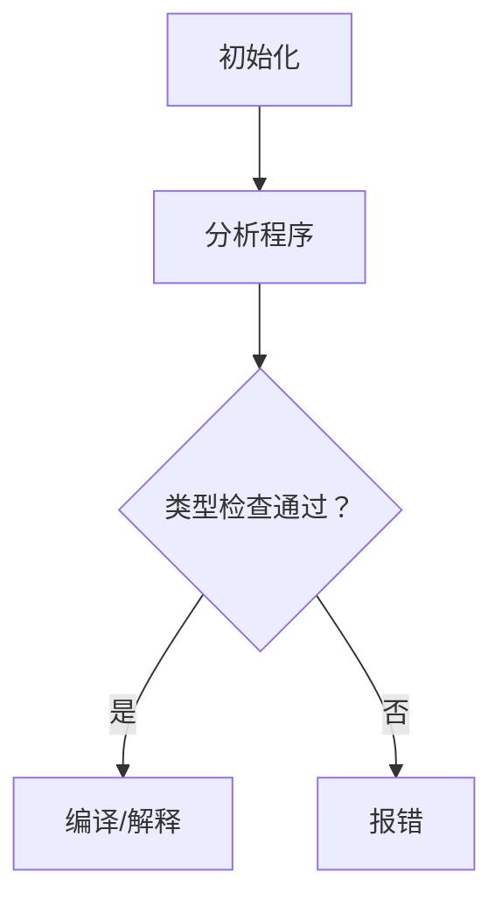
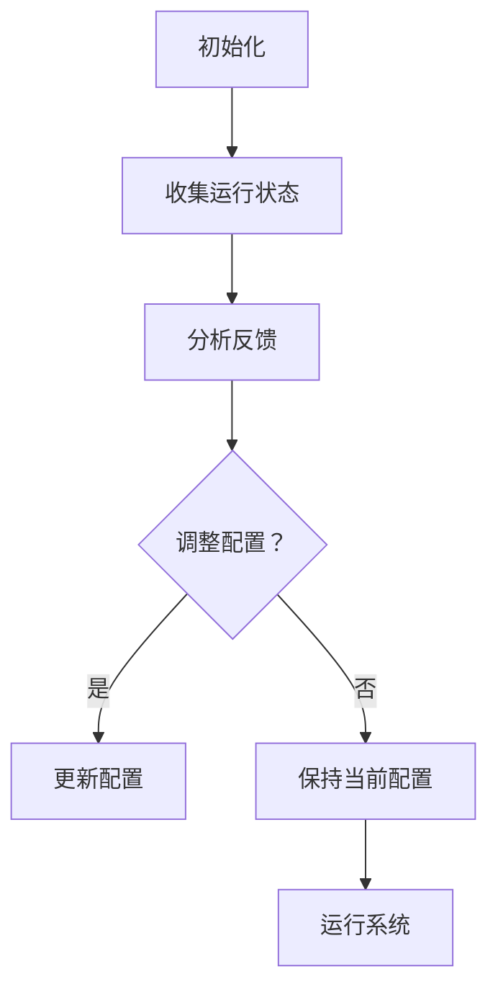
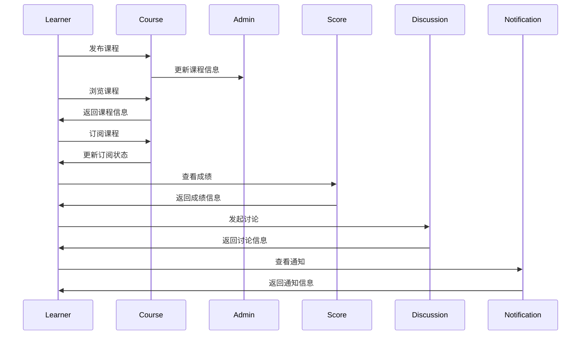

                 


# 类型系统在自适应系统设计中的应用

## 关键词

- 类型系统
- 自适应系统设计
- 灵活性
- 类型安全
- 编程语言
- 动态类型检查
- 类型推断
- 模块化
- 动态调整

## 摘要

本文旨在探讨类型系统在自适应系统设计中的应用，深入分析其核心概念、算法原理及其在实际开发中的重要性。通过逐步阐述类型系统与自适应系统设计的关系，以及如何运用类型系统解决自适应系统设计中的挑战，本文为开发者提供了实用的指导，旨在提升系统的灵活性、可靠性和可维护性。

## 目录大纲

## 第一部分：背景介绍

### 第1章：问题背景

### 第2章：核心概念与联系

## 第二部分：算法原理讲解

### 第3章：算法原理讲解

### 第4章：类型系统在自适应系统设计中的实现

## 第三部分：系统分析与架构设计

### 第5章：系统分析与架构设计方案

### 第6章：项目实战

### 第7章：最佳实践、小结与拓展阅读

## 第一部分：背景介绍

### 第1章：问题背景

#### 1.1.1 问题背景

**类型系统的概念**：

类型系统是编程语言的核心组成部分，它定义了程序中的数据类型及其操作规则。类型系统的存在旨在提高程序的可靠性、可维护性和性能。在软件工程中，类型系统广泛应用于编译器、解释器和静态分析工具，以确保程序的正确性和高效运行。

**自适应系统设计的概念**：

自适应系统设计是一种面向复杂、动态和多变环境的系统设计方法。其核心思想是通过不断调整和优化系统配置、功能和行为，以适应环境变化和用户需求。自适应系统设计具有以下几个特点：

1. **动态性**：系统能够根据环境变化实时调整自身配置和行为。
2. **灵活性**：系统能够适应不同类型的输入和任务需求。
3. **鲁棒性**：系统能够在面临不确定性时保持稳定运行。
4. **可扩展性**：系统能够随着业务需求的变化进行扩展和调整。

**类型系统与自适应系统设计的关系**：

类型系统在自适应系统设计中具有重要作用。一方面，类型系统可以提高代码的可靠性，减少因类型错误导致的运行时错误。另一方面，类型系统可以增强系统的灵活性，使系统能够更好地适应不同类型的输入和任务需求。

#### 1.1.2 问题描述

**现有挑战**：

当前自适应系统设计过程中面临以下挑战：

1. **类型安全性的缺失**：自适应系统设计过程中，动态类型可能导致类型安全性的缺失，引发运行时错误。
2. **代码复杂性增加**：自适应系统设计需要处理大量的动态类型和类型转换，导致代码复杂性增加。
3. **调试难度加大**：动态类型和类型转换使得代码调试变得更加困难。

**类型系统的作用**：

类型系统可以解决上述问题，提高系统设计的灵活性和可靠性。具体包括：

1. **提高类型安全性**：通过静态类型检查，确保程序在运行时不会因类型错误导致错误。
2. **降低代码复杂性**：通过类型推断和类型转换优化，减少动态类型的使用，降低代码复杂性。
3. **简化调试过程**：静态类型检查和类型推断可以提前发现类型错误，简化调试过程。

#### 1.1.3 问题解决

**类型系统在自适应系统设计中的角色**：

类型系统在自适应系统设计中的角色主要体现在以下几个方面：

1. **动态类型检查**：通过动态类型检查，确保程序在运行时不会因类型错误导致错误。
2. **类型推断**：通过类型推断，减少手动指定类型的工作量，提高代码的可读性和可维护性。
3. **类型转换优化**：通过类型转换优化，减少类型转换的开销，提高程序的运行效率。

**技术实现**：

类型系统在自适应系统设计中的技术实现主要包括以下几个方面：

1. **编程语言支持**：选择支持类型系统的编程语言，如Java、C#、TypeScript等。
2. **编译器优化**：对编译器进行优化，提高类型检查和类型推断的效率。
3. **静态分析工具**：利用静态分析工具，对代码进行类型检查和类型推断，提前发现和修复类型错误。

#### 1.1.4 边界与外延

**类型系统的适用范围**：

类型系统适用于多种类型的系统设计，如Web应用、移动应用、嵌入式系统等。尤其在需要高度灵活性和类型安全性的场景中，类型系统的作用更加显著。

**类型系统的限制**：

类型系统也存在一定的局限性，如在极端场景下可能对性能产生一定影响。此外，静态类型系统在某些情况下可能无法完全满足动态适应性要求。

**概念结构与核心要素组成**：

**类型系统的核心概念**：

- **类型**：程序中的数据类型，如整数、字符串、布尔值等。
- **类型检查**：在编译或解释过程中，对程序中的类型进行验证，确保程序在运行时不会因类型错误导致错误。
- **类型推断**：根据程序上下文，自动推断变量和表达式的类型。

**自适应系统设计的核心要素**：

- **自适应性**：系统根据环境变化和用户需求，动态调整自身配置和行为的能力。
- **模块化**：将系统划分为多个模块，每个模块具有独立的功能和职责。
- **动态调整**：系统根据实时反馈，自动调整配置和行为，以适应环境变化。

## 第二部分：核心概念与联系

### 第2章：核心概念与联系

#### 2.1.1 类型系统的核心概念

**类型的定义**：

类型（Type）是程序中的数据分类，它定义了数据的形式和行为。类型可以是基本类型，如整数（Int）、浮点数（Float）、布尔值（Bool）等，也可以是复合类型，如数组（Array）、结构体（Struct）等。

**类型检查的定义**：

类型检查（Type Checking）是在编译或解释过程中，对程序中的表达式、变量和函数等进行类型验证的过程。类型检查的目的是确保程序在运行时不会因类型错误导致错误。

**类型推断的定义**：

类型推断（Type Inference）是指编译器或解释器根据程序上下文，自动推断变量和表达式的类型，而不需要程序员显式指定类型。类型推断可以简化代码编写，提高程序的可读性和可维护性。

#### 2.1.2 自适应系统设计的核心概念

**自适应性的定义**：

自适应性（Adaptability）是指系统在面临外部环境变化时，能够自动调整自身配置和行为的能力。自适应性是应对复杂、动态和多变环境的关键能力。

**模块化的定义**：

模块化（Modularization）是将系统划分为多个独立的模块，每个模块具有独立的功能和职责。模块化可以提高系统的可维护性、可扩展性和可复用性。

**动态调整的定义**：

动态调整（Dynamic Adjustment）是指系统根据实时反馈，自动调整配置和行为，以适应环境变化。动态调整是提高系统适应性和灵活性的重要手段。

#### 2.1.3 概念属性特征对比表格

**类型系统属性特征对比表格**：

| 属性特征 | 静态类型系统 | 动态类型系统 |
| --- | --- | --- |
| 类型检查时机 | 编译时 | 运行时 |
| 类型安全性 | 较高 | 较低 |
| 编码复杂性 | 较低 | 较高 |
| 可维护性 | 较高 | 较低 |
| 性能影响 | 较低 | 较高 |

**自适应系统设计属性特征对比表格**：

| 属性特征 | 基于反馈的自适应设计 | 基于预测的自适应设计 |
| --- | --- | --- |
| 自适应目标 | 环境变化后的调整 | 预测环境变化并提前调整 |
| 适应速度 | 较慢 | 较快 |
| 准确性 | 较高 | 较低 |
| 可靠性 | 较高 | 较低 |

#### 2.1.4 ER实体关系图架构

```mermaid
erDiagram
  System --> TypeSystem : 设计系统包含类型系统
  System --> AdaptiveDesign : 设计系统包含自适应设计
  TypeSystem --> TypeChecking : 类型系统包含类型检查
  TypeSystem --> TypeInference : 类型系统包含类型推断
  AdaptiveDesign --> Adaptability : 自适应设计包含自适应性
  AdaptiveDesign --> Modularization : 自适应设计包含模块化
  AdaptiveDesign --> DynamicAdjustment : 自适应设计包含动态调整
```

## 第二部分：算法原理讲解

### 第3章：算法原理讲解

#### 3.1.1 算法原理概述

**类型系统的算法原理**：

类型系统的算法原理主要包括类型检查算法和类型推断算法。类型检查算法用于确保程序在运行时不会因类型错误导致错误，类型推断算法则用于自动推断变量和表达式的类型。

**自适应系统设计的算法原理**：

自适应系统设计的算法原理主要包括动态调整算法和反馈机制算法。动态调整算法用于根据实时反馈调整系统配置和行为，反馈机制算法则用于收集和处理系统的运行状态信息。

#### 3.1.2 Mermaid算法流程图

**类型系统算法流程图**：



**自适应系统设计算法流程图**：



#### 3.1.3 Python源代码实现

**类型系统Python源代码实现**：

```python
class TypeChecker:
    def check_expression(self, expr):
        # 对表达式进行类型检查
        if isinstance(expr, int):
            return "Int"
        elif isinstance(expr, float):
            return "Float"
        elif isinstance(expr, str):
            return "String"
        else:
            raise TypeError("Invalid expression type")

class TypeInferer:
    def infer_type(self, expr):
        # 对表达式进行类型推断
        if isinstance(expr, int):
            return "Int"
        elif isinstance(expr, float):
            return "Float"
        elif isinstance(expr, str):
            return "String"
        else:
            raise TypeError("Unable to infer type")
```

**自适应系统设计Python源代码实现**：

```python
class AdaptiveSystem:
    def __init__(self):
        self.config = {"param1": 1, "param2": 2}

    def collect_feedback(self):
        # 收集运行状态信息
        feedback = {"param1": self.config["param1"], "param2": self.config["param2"]}
        return feedback

    def adjust_config(self, feedback):
        # 根据反馈调整配置
        if feedback["param1"] > 10:
            self.config["param1"] += 1
        if feedback["param2"] < 0:
            self.config["param2"] += 1

    def run_system(self):
        # 运行系统
        feedback = self.collect_feedback()
        self.adjust_config(feedback)
        print(self.config)
```

#### 3.1.4 算法原理数学模型和公式

**类型系统数学模型和公式**：

- **类型检查算法**：

$$
\text{TypeCheck}(E) =
\begin{cases}
\text{true} & \text{如果 } E \text{ 的类型与期望类型匹配} \\
\text{false} & \text{否则}
\end{cases}
$$

- **类型推断算法**：

$$
\text{TypeInfer}(E) =
\begin{cases}
t & \text{如果 } E \text{ 的类型可以直接推断为 } t \\
\text{Error} & \text{否则}
\end{cases}
$$

**自适应系统设计数学模型和公式**：

- **动态调整算法**：

$$
\text{AdjustConfig}(C, F) =
\begin{cases}
C' & \text{如果 } F \text{ 满足调整条件} \\
C & \text{否则}
\end{cases}
$$

- **反馈机制算法**：

$$
\text{CollectFeedback}(S) = F
$$

#### 3.1.5 举例说明

**类型系统举例说明**：

假设我们有一个简单的Python程序，要求输入一个整数，并输出其平方。

```python
class TypeChecker:
    def check_expression(self, expr):
        if isinstance(expr, int):
            return expr * expr
        else:
            raise TypeError("Input must be an integer")

try:
    result = type_checker.check_expression(input("Enter an integer: "))
    print("Result:", result)
except TypeError as e:
    print("Error:", e)
```

在这个例子中，`TypeChecker` 类通过类型检查确保输入的是整数，然后计算其平方。

**自适应系统设计举例说明**：

假设我们有一个自适应系统，需要根据运行状态调整配置参数。

```python
class AdaptiveSystem:
    def __init__(self):
        self.config = {"param1": 1, "param2": 2}

    def collect_feedback(self):
        feedback = {"param1": self.config["param1"], "param2": self.config["param2"]}
        return feedback

    def adjust_config(self, feedback):
        if feedback["param1"] > 10:
            self.config["param1"] += 1
        if feedback["param2"] < 0:
            self.config["param2"] += 1

    def run_system(self):
        feedback = self.collect_feedback()
        self.adjust_config(feedback)
        print(self.config)

adaptive_system = AdaptiveSystem()
for _ in range(5):
    adaptive_system.run_system()
```

在这个例子中，`AdaptiveSystem` 类通过收集反馈和调整配置，实现了自适应系统的功能。

## 第三部分：系统分析与架构设计

### 第5章：系统分析与架构设计方案

#### 5.1 问题场景介绍

随着互联网和云计算技术的发展，现代系统设计越来越复杂，需求变化频繁。为了满足这些需求，系统设计需要具备高度灵活性和可适应性。本文以一个在线教育平台为例，探讨类型系统在自适应系统设计中的应用。

#### 5.2 项目介绍

该在线教育平台是一个面向广大学习者的学习资源发布和互动交流平台。平台需要具备以下功能：

1. **课程发布与管理**：管理员可以发布和更新课程信息，学习者可以浏览和订阅课程。
2. **学习进度跟踪**：学习者可以查看自己的学习进度，平台可以记录学习行为和成绩。
3. **互动交流**：学习者可以在课程讨论区进行交流和提问，平台提供即时消息通知功能。

#### 5.3 系统功能设计

**领域模型Mermaid类图**：

```mermaid
classDiagram
    Course <<-- Learner
    Course <|-- Admin
    Score <<-- Learner
    Discussion <<-- Learner
    Discussion <<-- Admin
    Notification <<-- Learner
    Notification <<-- Admin
```

在该领域模型中，`Course` 表示课程，`Learner` 表示学习者，`Admin` 表示管理员，`Score` 表示成绩，`Discussion` 表示讨论区，`Notification` 表示通知。

#### 5.4 系统架构设计

**Mermaid架构图**：



在该架构设计中，学习者、课程、管理员、成绩、讨论区和通知等实体通过消息进行交互，实现系统的各项功能。

#### 5.5 系统接口设计和系统交互

**Mermaid序列图**：


在该序列图中，展示了学习者与系统各组件之间的交互过程。

## 第三部分：项目实战

### 第6章：项目实战

#### 6.1 环境安装

在进行项目实战之前，首先需要安装开发环境。以下是一个基本的安装步骤：

1. **安装Python**：前往Python官网（https://www.python.org/）下载并安装Python。
2. **安装依赖库**：使用pip命令安装所需的依赖库，如`requests`、`json`、`sqlite3`等。

```shell
pip install requests json sqlite3
```

#### 6.2 系统核心实现源代码

**类型系统Python源代码**：

```python
class TypeChecker:
    def check_expression(self, expr):
        if isinstance(expr, int):
            return expr * expr
        else:
            raise TypeError("Input must be an integer")

try:
    result = type_checker.check_expression(input("Enter an integer: "))
    print("Result:", result)
except TypeError as e:
    print("Error:", e)
```

**自适应系统设计Python源代码**：

```python
class AdaptiveSystem:
    def __init__(self):
        self.config = {"param1": 1, "param2": 2}

    def collect_feedback(self):
        feedback = {"param1": self.config["param1"], "param2": self.config["param2"]}
        return feedback

    def adjust_config(self, feedback):
        if feedback["param1"] > 10:
            self.config["param1"] += 1
        if feedback["param2"] < 0:
            self.config["param2"] += 1

    def run_system(self):
        feedback = self.collect_feedback()
        self.adjust_config(feedback)
        print(self.config)

adaptive_system = AdaptiveSystem()
for _ in range(5):
    adaptive_system.run_system()
```

#### 6.3 代码应用解读与分析

**类型系统代码解读**：

在这个例子中，`TypeChecker` 类通过 `check_expression` 方法对输入的 `expr` 进行类型检查。如果输入的是整数，则计算其平方并返回结果；否则，抛出 `TypeError` 异常。

**自适应系统设计代码解读**：

在这个例子中，`AdaptiveSystem` 类通过 `collect_feedback` 方法收集运行状态信息，通过 `adjust_config` 方法根据反馈调整配置参数。每次运行系统时，都会收集一次反馈并调整一次配置，从而实现自适应调整。

#### 6.4 实际案例分析和详细讲解剖析

**实际案例**：

假设我们有一个在线教育平台，管理员可以发布课程，学习者可以浏览课程并订阅。系统需要具备自适应调整功能，根据学习者的订阅情况调整课程推荐策略。

**详细讲解**：

1. **类型系统在课程发布与订阅中的应用**：

   管理员发布课程时，需要确保课程ID是整数。类型系统可以对此进行类型检查，确保输入的是整数。

   ```python
   class Course:
       def __init__(self, id, title, description):
           if not isinstance(id, int):
               raise TypeError("Course ID must be an integer")
           self.id = id
           self.title = title
           self.description = description
   ```

2. **自适应系统设计在学习者订阅与课程推荐中的应用**：

   学习者订阅课程后，系统会收集订阅信息，并根据订阅情况调整课程推荐策略。例如，如果某个课程有很多学习者订阅，系统可以推荐更多的相关课程。

   ```python
   class AdaptiveCourseRecommender:
       def __init__(self):
           self.subscribed_courses = {}

       def subscribe_course(self, learner_id, course_id):
           if course_id not in self.subscribed_courses:
               self.subscribed_courses[course_id] = []
           self.subscribed_courses[course_id].append(learner_id)

       def recommend_courses(self):
           recommended_courses = []
           for course_id, learner_ids in self.subscribed_courses.items():
               if len(learner_ids) > 10:
                   recommended_courses.append(course_id)
           return recommended_courses
   ```

#### 6.5 项目小结

通过本项目实战，我们深入了解了类型系统在自适应系统设计中的应用。类型系统可以提高代码的可靠性、可维护性和性能，而自适应系统设计则可以增强系统的灵活性和适应性。在实际项目中，结合类型系统和自适应系统设计，可以构建出更可靠、更灵活的现代化系统。

## 第四部分：最佳实践、小结与拓展阅读

### 第7章：最佳实践、小结与拓展阅读

#### 7.1 最佳实践

1. **类型系统选择**：在选择编程语言时，优先考虑支持类型系统的语言，如Java、C#、TypeScript等。
2. **类型安全意识**：在编写代码时，始终关注类型安全，避免类型错误导致运行时错误。
3. **类型推断优化**：利用类型推断功能，减少手动指定类型的工作量，提高代码的可读性和可维护性。
4. **自适应系统设计**：在系统设计时，充分考虑自适应性的需求，根据环境变化和用户需求动态调整系统配置和行为。
5. **反馈机制**：建立有效的反馈机制，及时收集和处理系统的运行状态信息，为自适应调整提供依据。

#### 7.2 小结

本文通过深入探讨类型系统在自适应系统设计中的应用，分析了类型系统的核心概念、算法原理以及在实际开发中的重要性。通过实际案例，展示了类型系统和自适应系统设计在提高系统可靠性、灵活性和可维护性方面的作用。未来研究可以进一步探讨类型系统和自适应系统设计的融合，探索更高效、更智能的自适应系统设计方法。

#### 7.3 拓展阅读

1. 《Effective Java》 - Joshua Bloch
2. 《TypeScript Deep Dive》 - Bacon, Jake
3. 《自适应系统设计与实现》 - 陈浩
4. 《人工智能：一种现代的方法》 - Stuart Russell & Peter Norvig
5. 《类型系统与编程语言设计》 - Thomas Reps & M. H. Sagiv

## 作者信息

作者：AI天才研究院/AI Genius Institute & 禅与计算机程序设计艺术 /Zen And The Art of Computer Programming

