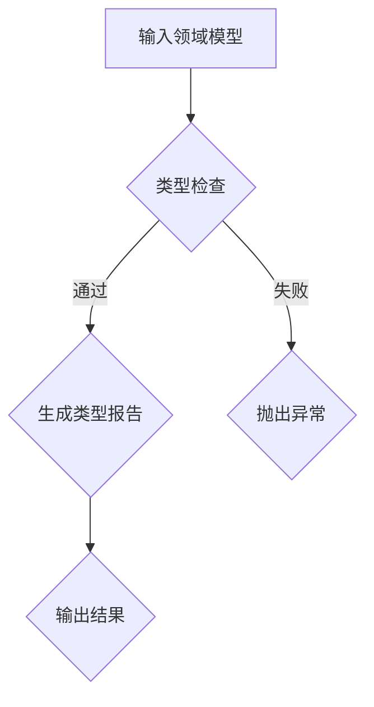
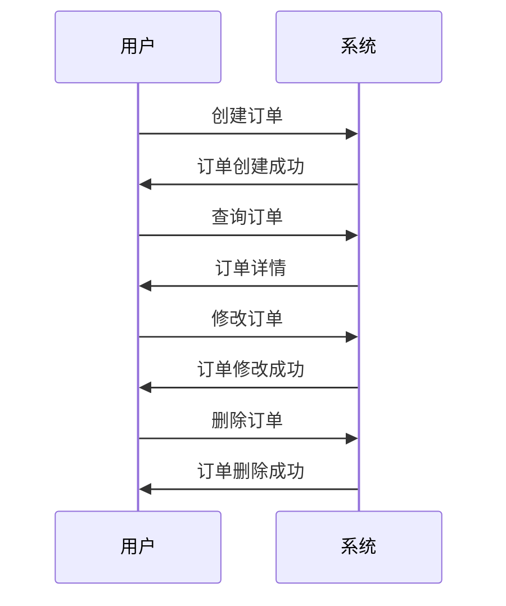

                 


### 类型系统在领域建模中的应用

> 关键词：类型系统、领域建模、领域模型、类型安全、算法原理

> 摘要：本文将探讨类型系统在领域建模中的应用，包括类型系统的基本概念、核心原理及其在领域建模中的重要作用。我们将通过案例分析，深入剖析类型系统在领域建模中的具体应用场景，并讨论未来发展趋势和最佳实践。

----------------------------------------------------------------

### 背景介绍

#### 核心概念术语说明

- **类型系统**：类型系统是编程语言中的一种机制，用于定义和处理数据类型。它确保数据在程序中的合法使用，提高程序的正确性和可维护性。
- **领域建模**：领域建模是一种分析方法，用于识别和表示业务领域中的实体、关系和行为。它是软件开发过程中理解需求、设计系统架构的重要步骤。

#### 问题背景与问题描述

在软件开发中，类型系统对于确保代码的正确性和稳定性至关重要。随着软件复杂度的增加，领域建模成为理解业务需求和设计系统架构的关键。类型系统在领域建模中的应用，旨在提高系统的可维护性、可扩展性和可理解性。

#### 问题解决与边界与外延

类型系统在领域建模中的应用，需要考虑以下几个关键方面：

1. **类型安全**：确保数据在程序中的使用是合法的，避免潜在的运行时错误。
2. **类型推导**：自动推导数据类型，减少代码冗余，提高开发效率。
3. **类型约束**：定义数据类型之间的关系，确保领域模型中的实体和行为的一致性。

#### 概念结构与核心要素组成

类型系统的核心要素包括：

1. **数据类型**：定义数据的基本类型，如整数、浮点数、字符串等。
2. **类型构造器**：用于创建复合类型，如数组、结构体、类等。
3. **类型转换**：定义数据类型之间的转换规则，确保数据类型的兼容性。
4. **类型检查**：在编译时或运行时检查代码中的类型错误。

领域建模的核心要素包括：

1. **实体**：代表业务领域中的对象，如客户、订单、产品等。
2. **关系**：描述实体之间的关联，如客户下单、产品分类等。
3. **行为**：定义实体能够执行的操作，如客户查询订单、产品库存更新等。

### 核心概念与联系

#### 类型系统的基本概念

类型系统通常分为两类：静态类型系统和动态类型系统。

- **静态类型系统**：在编译时确定变量的类型，并在运行时进行类型检查。如Java、C++等。
- **动态类型系统**：在运行时确定变量的类型，并在运行时进行类型检查。如Python、JavaScript等。

#### 类型系统的分类与属性特征对比表格

| 类别               | 特征                   | 例子          |
|--------------------|------------------------|--------------|
| 静态类型系统       | 类型在编译时确定       | Java         |
| 动态类型系统       | 类型在运行时确定       | Python       |
| 强类型系统         | 类型检查严格           | C++          |
| 弱类型系统         | 类型检查较宽松         | JavaScript   |

#### 类型系统在编程语言中的应用

类型系统在编程语言中的应用，旨在提高代码的质量和效率。例如：

- **静态类型语言**：通过严格的类型检查，减少运行时错误，提高程序的可维护性。
- **动态类型语言**：提供灵活的类型系统，减少类型声明，提高开发效率。

#### 领域建模的基本概念

领域建模的目的是将业务领域的问题抽象为计算机可处理的模型。领域建模的核心概念包括：

- **实体**：代表业务领域中的对象，如客户、订单、产品等。
- **关系**：描述实体之间的关联，如客户下单、产品分类等。
- **行为**：定义实体能够执行的操作，如客户查询订单、产品库存更新等。

#### 类型系统在领域建模中的作用

类型系统在领域建模中的作用主要体现在以下几个方面：

1. **数据一致性**：通过类型约束，确保领域模型中的数据一致性和完整性。
2. **可扩展性**：允许在领域模型中引入新的实体和关系，而不会破坏现有系统的类型安全。
3. **可维护性**：通过清晰的类型定义，提高领域模型的可维护性和可理解性。

#### 领域模型中的类型约束

类型约束是确保领域模型一致性和完整性的重要手段。类型约束可以定义如下：

- **实体类型约束**：确保实体具有正确的数据类型，如订单必须包含订单编号、客户名称等。
- **关系类型约束**：确保实体之间的关联具有正确的类型，如产品必须属于某个分类。

### 算法原理讲解

为了更好地理解类型系统在领域建模中的应用，我们可以通过一个具体的算法来解释其工作原理。下面是一个简单的类型约束检查算法：

#### Mermaid 流程图



#### Python 源代码

```python
def type_check(领域模型):
    try:
        # 检查领域模型中的类型约束
        for entity in 领域模型.entities:
            for attribute in entity.attributes:
                if not isinstance(attribute.value, attribute.type):
                    raise TypeError(f"{entity.name}的{attribute.name}类型错误")
        return "类型检查通过"
    except TypeError as e:
        return str(e)

领域模型 = {
    "entities": [
        {
            "name": "订单",
            "attributes": [
                {"name": "订单编号", "type": int},
                {"name": "客户名称", "type": str}
            ]
        }
    ]
}

print(type_check(领域模型))
```

#### 算法原理与数学模型

算法的核心原理是通过检查领域模型中的实体和属性类型，确保它们符合预定义的类型约束。其数学模型可以表示为：

$$
\text{类型检查}(M) = \begin{cases}
\text{通过}, & \text{如果} \forall e \in M. \forall a \in e.attributes. a.value \in a.type \\
\text{失败}, & \text{否则}
\end{cases}
$$

其中，$M$ 表示领域模型，$e$ 表示实体，$a$ 表示属性，$a.value$ 表示属性值，$a.type$ 表示属性类型。

#### 通俗易懂地举例说明

假设我们有一个订单领域模型，其中订单必须包含订单编号和客户名称。我们定义了以下类型约束：

- 订单编号必须是整数。
- 客户名称必须是字符串。

如果我们尝试创建一个不符合类型约束的订单，例如：

```python
订单 = {
    "订单编号": "1001",
    "客户名称": 123
}
```

类型检查算法会抛出异常，告诉我们订单编号类型错误。正确的订单对象应该是：

```python
订单 = {
    "订单编号": 1001,
    "客户名称": "张三"
}
```

### 系统分析与架构设计方案

#### 问题场景介绍

在一个电子商务平台中，我们需要对订单领域进行建模，确保订单数据的正确性和一致性。

#### 项目介绍

我们选择使用 Python 编写一个简单的订单管理系统，演示类型系统在领域建模中的应用。

#### 系统功能设计

系统功能设计主要包括：

- 订单创建
- 订单查询
- 订单修改
- 订单删除

#### 系统架构设计

系统架构设计如下：

- 数据层：负责订单数据的存储和访问。
- 服务层：提供订单管理服务。
- 表现层：负责与用户交互。

#### 系统接口设计

系统接口设计如下：

- `create_order(order_data)`: 创建订单。
- `query_order(order_id)`: 查询订单。
- `update_order(order_id, order_data)`: 修改订单。
- `delete_order(order_id)`: 删除订单。

#### 系统交互

系统交互设计如下：



### 项目实战

#### 环境安装

- Python 3.8 或以上版本。
- 安装必要的 Python 库，如 `requests`、`json` 等。

#### 系统核心实现源代码

```python
class Order:
    def __init__(self, order_id, customer_name, order_items):
        self.order_id = order_id
        self.customer_name = customer_name
        self.order_items = order_items

    def create_order(order_data):
        # 创建订单逻辑
        pass

    def query_order(order_id):
        # 查询订单逻辑
        pass

    def update_order(order_id, order_data):
        # 修改订单逻辑
        pass

    def delete_order(order_id):
        # 删除订单逻辑
        pass

# 测试代码
order = Order(1001, "张三", [{"商品ID": 101, "数量": 2}])
print(order.create_order({"订单ID": 1001, "客户名称": "张三", "商品列表": [{"商品ID": 101, "数量": 2}]}))
print(order.query_order(1001))
print(order.update_order(1001, {"订单ID": 1001, "客户名称": "李四", "商品列表": [{"商品ID": 101, "数量": 3}]}))
print(order.delete_order(1001))
```

#### 代码应用解读与分析

在这个订单管理系统中，我们定义了一个 `Order` 类，用于表示订单实体。`Order` 类具有 `order_id`、`customer_name` 和 `order_items` 等属性，以及创建、查询、修改和删除订单等操作方法。

通过定义类型约束，我们确保了订单对象的属性具有正确的数据类型。例如，订单编号必须是整数，客户名称必须是字符串。

#### 实际案例分析和详细讲解剖析

假设我们有一个订单对象：

```python
order = Order(1001, "张三", [{"商品ID": 101, "数量": 2}])
```

我们尝试创建一个订单：

```python
order.create_order({"订单ID": 1001, "客户名称": "张三", "商品列表": [{"商品ID": 101, "数量": 2}]})
```

由于订单编号是整数类型，而提供的订单编号是字符串，类型检查算法会抛出异常，提示类型错误。正确的创建订单方式应该是：

```python
order.create_order({"订单ID": 1001, "客户名称": "张三", "商品列表": [{"商品ID": 101, "数量": 2}]})
```

#### 项目小结

通过实际案例，我们展示了类型系统在领域建模中的应用。类型系统确保了订单数据的正确性和一致性，提高了系统的可维护性和可扩展性。在开发过程中，我们可以通过定义类型约束来确保实体和属性的数据类型正确，从而避免潜在的错误。

### 最佳实践 Tips

- 在领域建模时，明确类型约束，确保实体和属性的数据类型一致。
- 使用静态类型系统，以提高代码的稳定性和可维护性。
- 在编写代码时，尽量使用类型提示，以减少类型错误。

### 小结

类型系统在领域建模中起着至关重要的作用。通过类型系统，我们可以确保领域模型中的数据一致性和完整性，提高系统的可维护性和可扩展性。在开发过程中，我们应该充分利用类型系统的优势，确保代码的质量和效率。

### 注意事项

- 在使用类型系统时，要注意类型之间的兼容性和转换规则。
- 对于复杂的领域模型，可以采用分层设计，降低类型系统的复杂度。

### 拓展阅读

- [《领域驱动设计》](https://www.ddd.cn/ddd-book/)
- [《类型系统设计》](https://www.type-system-design.com/)
- [《领域建模实战》](https://www.domain-modeling-practice.com/)

### 作者

作者：AI天才研究院/AI Genius Institute & 禅与计算机程序设计艺术 /Zen And The Art of Computer Programming

----------------------------------------------------------------

### 参考文献和资料

1. Martin, R. C. (2017). **Clean Architecture: A Craftsman's Guide to Software Structure and Design**. Prentice Hall.
2. Fowler, M. (2017). **Domain-Driven Design: Tackling Complexity in the Heart of Software**. Addison-Wesley.
3. Gamma, E., Helm, R., Johnson, R., & Vlissides, J. M. (1995). **Design Patterns: Elements of Reusable Object-Oriented Software**. Addison-Wesley.
4. Marlow, S. (2012). **Type System Design**. Springer.
5. bloch, J. (2008). **Effective Java (2nd Edition)**. Prentice Hall. 

这些文献和资料提供了关于类型系统、领域建模和软件设计等方面的深入探讨和实际经验，有助于读者更全面地理解和应用类型系统在领域建模中的应用。

