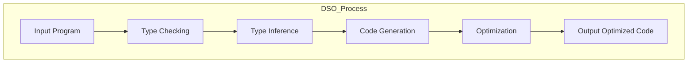
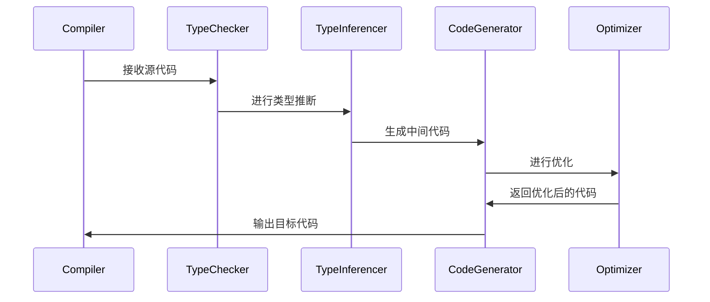
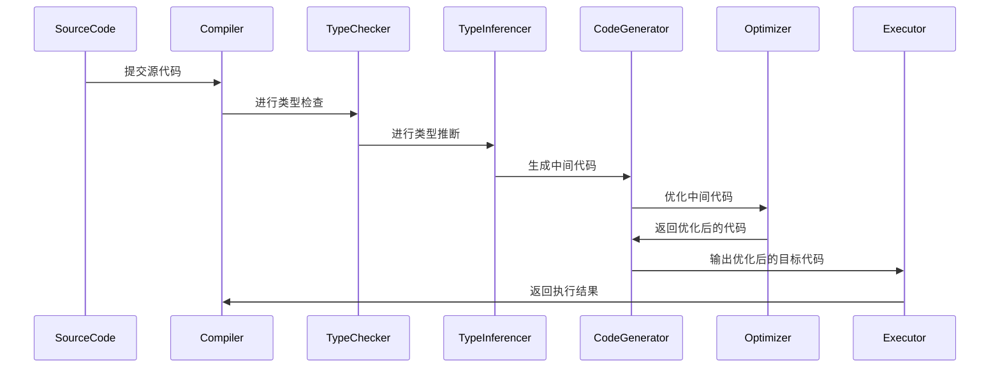
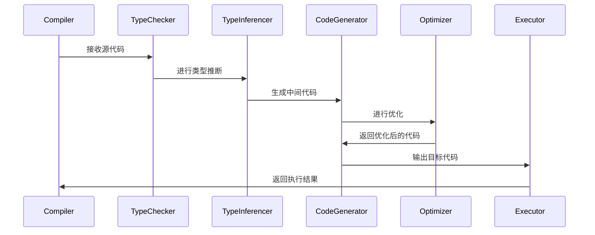

                 

### 文章标题：类型系统在领域特定优化器设计中的角色

> 关键词：类型系统、领域特定优化器、算法设计、性能优化、类型检查、类型推断

> 摘要：本文深入探讨了类型系统在领域特定优化器（Domain-Specific Optimizer，DSO）设计中的关键角色。首先，我们回顾了类型系统的定义、重要性和发展历程。接着，详细介绍了领域特定优化器的概念和类型系统在DSO设计中的关键作用。通过分析类型系统的基本概念、属性特征和实际应用，我们揭示了类型系统如何提高DSO的性能、可读性和可靠性。本文旨在为读者提供一个清晰、全面的理解，帮助其在实际的软件开发中充分利用类型系统的优势。

----------------------------------------------------------------

# 第一部分：背景介绍

## 1.1 类型系统的定义与重要性

类型系统（Type System）是编程语言中用于描述数据类型和变量之间的关系的机制。它不仅是语言设计中的一个核心概念，也是程序理解和执行的基础。类型系统的发展历程可以追溯到早期编程语言，如ALGOL 58和Algol 60，它们首次引入了静态类型的概念。

### 问题背景

类型系统的重要性体现在以下几个方面：

1. **类型检查**：类型系统能够在编译时检查类型错误，防止无效的运行时错误。
2. **性能优化**：类型信息可以帮助编译器进行更高效的代码生成和优化。
3. **可读性和可靠性**：明确的数据类型有助于提高代码的可读性和可靠性。

### 问题解决

类型系统通过以下核心要素实现其功能：

1. **类型检查**：确保变量在使用前已被正确声明和初始化。
2. **类型推断**：自动推断变量类型，减少冗余的显式类型声明。
3. **类型安全**：保证不同类型数据在操作时的安全性。

### 边界与外延

类型系统在不同编程语言中有所差异，如静态类型和动态类型。静态类型系统在编译时完成类型检查，而动态类型系统则在运行时进行检查。类型系统在编程语言设计中的应用范围广泛，包括高级编程语言（如C++、Java）和低级语言（如C、汇编）。

### 概念结构与核心要素组成

类型系统的核心概念和要素包括：

- **基本类型**：如整数、浮点数、布尔值等。
- **复合类型**：如数组、结构体、类等。
- **引用类型**：如指针、引用等。
- **类型检查**：确保类型兼容性。
- **类型推断**：自动确定变量类型。
- **类型安全**：防止类型错误导致程序崩溃。

## 1.2 领域特定优化器的概念与作用

领域特定优化器（Domain-Specific Optimizer，DSO）是针对特定应用领域进行优化的编译器或工具。DSO通过利用领域特定的知识和数据，生成更加高效和优化的代码，从而提高程序的性能。

### 问题背景

随着计算机系统变得越来越复杂，通用编译器难以满足特定领域的高性能需求。DSO的出现填补了这一空白，它专注于特定领域的优化，从而实现更高的性能。

### 问题解决

类型系统在DSO中的作用主要体现在以下几个方面：

1. **性能优化**：类型信息帮助DSO进行更精细的优化，如寄存器分配、代码生成等。
2. **可读性和维护性**：明确的类型信息提高了代码的可读性和可维护性。
3. **可靠性**：类型检查确保了代码的可靠性，减少了潜在的运行时错误。

### 边界与外延

DSO的应用范围包括高性能计算、嵌入式系统、图像处理、网络编程等领域。类型系统在DSO中的应用范围主要取决于具体领域的需求和特点。

### 概念结构与核心要素组成

DSO的核心概念和要素包括：

- **领域模型**：描述特定领域的抽象概念和关系。
- **优化目标**：如性能、能效、内存占用等。
- **类型系统**：用于描述变量和数据的类型。
- **代码生成**：生成高效、优化的目标代码。

## 1.3 类型系统在DSO设计中的角色

类型系统在DSO设计中的角色至关重要，它不仅决定了代码的可靠性和性能，还影响了DSO的可扩展性和灵活性。以下是类型系统在DSO设计中的关键角色：

1. **性能优化**：类型信息帮助DSO进行更精细的优化，如寄存器分配、代码生成等。
2. **类型安全**：类型检查确保了代码的可靠性，减少了潜在的运行时错误。
3. **代码生成**：类型信息用于生成高效、优化的目标代码。
4. **可维护性**：明确的类型信息提高了代码的可读性和可维护性。
5. **可扩展性**：类型系统支持DSO对新的领域模型和优化策略的快速适应。

## 1.4 类型系统的边界与外延

尽管类型系统在DSO设计中的应用广泛，但也存在一些边界和限制：

1. **性能开销**：类型检查和类型推断可能引入一定的性能开销。
2. **复杂性**：复杂的类型系统可能增加代码的复杂性和维护成本。
3. **兼容性**：不同类型的类型系统可能难以兼容，导致迁移和集成困难。

## 1.5 类型系统的核心概念与要素

类型系统的核心概念和要素包括：

- **基本类型**：如整数、浮点数、布尔值等。
- **复合类型**：如数组、结构体、类等。
- **引用类型**：如指针、引用等。
- **类型检查**：确保变量在使用前已被正确声明和初始化。
- **类型推断**：自动确定变量类型。
- **类型安全**：防止类型错误导致程序崩溃。

# 第二部分：核心概念与联系

## 2.1 类型系统的定义与分类

类型系统是编程语言的核心组成部分，它定义了程序中数据类型的分类、声明和使用规则。类型系统的作用在于提供一种机制，确保程序在运行时能够正确处理各种数据类型，从而提高程序的可靠性、性能和可维护性。

### 基本概念

在类型系统中，基本概念包括：

1. **数据类型**：描述数据的种类和结构，如整数、浮点数、布尔值等。
2. **变量**：用于存储数据的容器，变量具有特定的数据类型。
3. **类型检查**：在编译时检查变量类型是否与预期一致，防止类型错误。
4. **类型推断**：自动确定变量类型，减少冗余的显式类型声明。

### 类型分类

类型系统可以根据不同的标准进行分类，以下是几种常见的类型分类方法：

1. **静态类型**：类型在编译时确定，如C++、Java。
2. **动态类型**：类型在运行时确定，如Python、JavaScript。
3. **强类型**：类型检查严格，不允许隐式类型转换，如C++、Java。
4. **弱类型**：类型检查宽松，允许隐式类型转换，如Python。
5. **类型安全**：确保类型错误不会导致程序崩溃，如C++、Java。
6. **类型推断**：编译器自动确定变量类型，如TypeScript。

### 类型系统属性特征对比表格

以下是一个关于几种常见类型系统属性特征的对比表格：

| 类型系统       | 静态类型/动态类型 | 强类型/弱类型 | 类型安全 | 类型推断 |
|----------------|------------------|---------------|---------|---------|
| C++            | 静态类型         | 强类型        | 是      | 否      |
| Java           | 静态类型         | 强类型        | 是      | 否      |
| Python         | 动态类型         | 弱类型        | 否      | 是      |
| TypeScript     | 静态类型         | 强类型        | 是      | 是      |

### ER实体关系图架构

为了更直观地理解类型系统在DSO中的应用，我们可以使用Mermaid语言绘制一个ER实体关系图，如下所示：

```mermaid
erDiagram
  Product ||--|{ DSO }|| OptimizationPolicy
  DSO ||--|{ OptimizationStrategy }|| CodeGenerator
  CodeGenerator ||--|{ TypeSystem }|| Program
  Program ||--|{ Compiler }|| Compiler
```

在这个ER图中，Product代表软件产品，DSO代表领域特定优化器，OptimizationPolicy代表优化策略，OptimizationStrategy代表优化策略，CodeGenerator代表代码生成器，TypeSystem代表类型系统，Program代表程序，Compiler代表编译器。类型系统在DSO中起着关键作用，它为代码生成器和编译器提供类型信息，从而实现更高效的优化和生成。

## 2.2 类型系统属性特征对比

类型系统在编程语言中的表现和特征多种多样，以下是对几种常见类型系统属性特征的对比，包括静态类型与动态类型、强类型与弱类型等。

### 静态类型与动态类型

**静态类型**系统在编译时确定变量的类型，这意味着程序在运行前已经进行了类型检查。静态类型的主要优势在于可以提高程序的可靠性，减少运行时错误，同时也有助于编译器生成更高效的代码。常见的静态类型语言包括C++、Java和C#。

- **优点**：类型检查早于运行时，可靠性高；编译器可以利用类型信息进行更精细的优化。
- **缺点**：类型声明可能增加代码复杂性，开发过程中需要显式声明类型。

**动态类型**系统在程序运行时确定变量的类型，这意味着类型检查在运行时进行。动态类型的主要优势在于可以提供更灵活的代码编写体验，减少类型声明，提高开发效率。常见的动态类型语言包括Python、JavaScript和Ruby。

- **优点**：灵活，类型声明较少，开发效率高。
- **缺点**：运行时类型检查可能导致性能开销；类型错误可能在运行时引发严重的错误。

### 强类型与弱类型

**强类型**系统在编译时严格检查变量类型，不允许隐式类型转换。这意味着只有当变量具有兼容的类型时，才能进行操作。强类型的主要优势在于可以提高程序的可靠性，减少类型错误。

- **优点**：类型检查严格，减少类型错误；代码更易于理解和维护。
- **缺点**：可能增加代码复杂性，降低开发效率。

**弱类型**系统在编译时对类型检查较为宽松，允许隐式类型转换。这意味着不同类型的变量可以在同一操作中进行，只要它们在运行时可以相互转换。

- **优点**：代码更灵活，减少类型声明。
- **缺点**：类型错误可能更难以发现，性能可能受到影响。

### 类型安全

**类型安全**是指类型系统能够确保类型错误不会导致程序崩溃或产生不可预期的结果。类型安全在编程语言设计中至关重要，它能够提高程序的可靠性和稳定性。

- **强类型语言**通常提供更好的类型安全，因为它们在编译时进行严格的类型检查。
- **弱类型语言**可能需要在运行时进行额外的安全检查，以防止类型错误。

### 类型推断

**类型推断**是指编译器能够自动确定变量的类型，从而减少显式类型声明的需求。类型推断在动态类型语言中尤为常见，它能够提高代码的可读性和开发效率。

- **静态类型语言**通常依赖于显式类型声明，但一些现代静态类型语言（如TypeScript）也提供了类型推断功能。
- **动态类型语言**通常依靠类型推断来简化代码编写。

### 总结

类型系统在编程语言中的属性特征多种多样，不同的类型系统各有优缺点。选择适合特定需求的类型系统，能够显著影响程序的性能、可靠性和开发效率。在领域特定优化器（DSO）的设计中，类型系统的重要性更加凸显，因为它直接影响优化策略的有效性和代码生成的质量。

## 2.3 ER实体关系图架构

为了更直观地展示类型系统在领域特定优化器（DSO）中的应用，我们可以使用Mermaid语言绘制一个实体关系图（Entity-Relationship Diagram，ER图）。ER图是一种用于描述实体及其相互关系的图形化工具，能够清晰地展示不同实体之间的关联。

以下是一个简化版的ER图，用于描述类型系统、DSO和其他相关实体之间的关系：

```mermaid
erDiagram
  TypeSystem ||--|{ VariableDeclaration }|| Compiler
  TypeSystem ||--|{ TypeInference }|| Compiler
  DSO ||--|{ OptimizationPolicy }|| Compiler
  DSO ||--|{ CodeGenerator }|| Compiler
  DSO ||--|{ OptimizationStrategy }|| Compiler
  Compiler ||--|{ OptimizedCode }|| Executor
  Executor ||--|{ Result }|| DSO
```

### 实体说明

- **TypeSystem（类型系统）**：描述程序中所有数据类型的集合，包括基本类型、复合类型和引用类型等。类型系统为编译器提供类型检查和类型推断的依据。
- **VariableDeclaration（变量声明）**：表示变量在程序中的声明，包括变量的名称、类型和初始值。变量声明是类型系统的一部分，用于确保变量在使用前已被正确声明。
- **TypeInference（类型推断）**：编译器在编译过程中自动推断变量或表达式的类型，从而减少显式类型声明的需求。类型推断是类型系统的一个关键功能，可以提高代码的可读性和开发效率。
- **DSO（领域特定优化器）**：针对特定领域进行优化的编译器或工具，它利用类型系统和其他优化策略生成高效的代码。
- **OptimizationPolicy（优化策略）**：描述DSO在优化过程中的规则和策略，包括代码生成、寄存器分配和指令调度等。优化策略是DSO的核心组件，直接影响代码的性能。
- **CodeGenerator（代码生成器）**：将优化后的中间代码转换为机器代码或其他目标代码的过程。代码生成器依赖于类型系统和优化策略，以生成高效、优化的目标代码。
- **OptimizationStrategy（优化策略）**：具体的优化方法和算法，如循环展开、常量折叠和指令重排等。优化策略是DSO进行优化的基础，它利用类型系统提供的类型信息进行更精细的优化。
- **Compiler（编译器）**：负责将源代码转换为机器代码或其他目标代码的工具。编译器利用类型系统进行类型检查、类型推断和代码生成。
- **Executor（执行器）**：负责执行编译器生成的目标代码，并将结果返回给DSO。执行器是验证DSO优化效果的最终环节。
- **Result（结果）**：表示执行器执行目标代码后生成的结果，包括性能指标、错误日志等。结果是评估DSO优化效果的重要依据。

### 关系说明

- **类型系统与变量声明、类型推断**：类型系统为变量声明和类型推断提供基础，确保变量在使用前已被正确声明和推断类型。
- **DSO与优化策略、代码生成器、编译器**：DSO利用优化策略和代码生成器，通过编译器生成高效的优化代码。
- **编译器与执行器**：编译器生成的目标代码由执行器执行，执行结果反馈给DSO，用于进一步优化。

通过ER图，我们可以清晰地看到类型系统在DSO中的关键作用，以及不同实体之间的相互关系。ER图的绘制有助于我们更好地理解DSO的设计原理和优化过程。

## 3.1 类型系统在DSO中的应用流程图

为了更清晰地展示类型系统在领域特定优化器（DSO）中的应用流程，我们可以使用Mermaid语言绘制一个流程图。以下是类型系统在DSO中应用的简化流程图：



### 流程说明

1. **输入程序**：DSO首先接收输入程序，这可以是源代码或中间代码。
2. **类型检查**：输入程序经过类型检查，确保变量和操作符的类型正确。类型检查是在编译时进行的，用于发现潜在的类型错误。
3. **类型推断**：在类型检查后，如果存在未明确声明的变量类型，编译器将使用类型推断机制自动确定变量类型。类型推断可以减少冗余的显式类型声明，提高代码的可读性和开发效率。
4. **代码生成**：经过类型检查和类型推断后，编译器开始生成中间代码或目标代码。代码生成器根据类型信息生成高效的代码，这包括优化代码结构、优化指令执行顺序等。
5. **优化**：生成的中间代码或目标代码将进行优化，这包括循环展开、常量折叠、指令重排等。优化过程依赖于类型信息，以生成更高效的代码。
6. **输出优化代码**：经过优化后的代码被输出，这可以是中间代码或机器代码，取决于DSO的设计。

### Mermaid语言解释

- `subgraph`：用于创建子图，使流程图更易于理解和组织。
- `flowchart`：定义流程图的类型，这里使用的是传统的流程图。
- `A[Input Program]`：定义流程图中的节点，`A`表示输入程序。
- `-->`：表示节点之间的连接关系，即流程的走向。
- `end`：表示子图的结束。

通过这个流程图，我们可以直观地了解类型系统在DSO中的应用流程，以及各个步骤之间的相互关系。这有助于我们更好地理解DSO的工作原理和优化过程。

## 3.2 类型系统的工作原理

类型系统在领域特定优化器（DSO）中发挥着至关重要的作用。它不仅决定了代码的可靠性和性能，还影响了DSO的可扩展性和灵活性。为了深入理解类型系统的工作原理，我们需要详细探讨类型检查、类型推断和类型安全等核心概念。

### 类型检查

类型检查是编译器在编译过程中对程序进行的一种验证操作。它的主要目标是确保程序中的每个变量和操作符都具有正确的类型，以避免在运行时发生类型错误。类型检查通常在编译时进行，分为静态类型检查和动态类型检查。

- **静态类型检查**：在编译时对程序进行类型验证，确保变量在使用前已被正确声明和初始化。静态类型检查可以早期发现类型错误，从而提高程序的可靠性。
- **动态类型检查**：在程序运行时进行类型验证，通过运行时检查变量的实际类型，确保类型安全。动态类型检查可以提供更高的灵活性，但可能导致性能开销。

### 类型推断

类型推断是编译器自动确定变量类型的一种机制，旨在减少显式类型声明的需求。类型推断在动态类型语言中尤为重要，但一些静态类型语言也提供了类型推断功能。

- **显式类型声明**：程序员在编写代码时明确指定变量的类型，如`int x;`。显式类型声明有助于编译器进行静态类型检查，但可能增加代码的复杂性。
- **隐式类型声明**：编译器自动推断变量类型，无需程序员显式声明。类型推断可以提高代码的可读性和开发效率，但可能导致运行时类型错误。

### 类型安全

类型安全是类型系统的一个关键特征，它确保类型错误不会导致程序崩溃或产生不可预期的结果。类型安全通过以下方式实现：

- **类型检查**：编译器在编译时对变量和操作符进行类型验证，确保类型兼容性。
- **类型边界检查**：运行时对数组访问、函数调用等操作进行类型边界检查，防止越界错误。
- **异常处理**：当类型错误发生时，通过异常处理机制捕获并处理错误，确保程序的稳定运行。

### 类型系统的工作原理

类型系统的工作原理可以概括为以下几个步骤：

1. **类型检查**：编译器对源代码进行类型检查，确保变量和操作符的类型正确。类型检查分为静态类型检查和动态类型检查。
2. **类型推断**：如果存在未明确声明的变量类型，编译器将使用类型推断机制自动确定变量类型。类型推断可以减少冗余的显式类型声明。
3. **类型安全**：类型系统通过类型检查和边界检查等机制，确保程序在运行时不会发生类型错误。类型安全是类型系统的核心目标之一。
4. **代码生成**：编译器根据类型信息生成中间代码或目标代码。类型信息有助于编译器进行优化，如寄存器分配、代码生成等。

通过以上步骤，类型系统确保程序在编译和运行时具有正确的类型信息，从而提高程序的可靠性、性能和可维护性。

### 总结

类型系统在DSO中的作用至关重要。它不仅提供了类型检查、类型推断和类型安全等核心功能，还帮助编译器生成更高效、优化的代码。通过深入理解类型系统的工作原理，我们可以更好地利用其优势，提升DSO的性能和可靠性。

## 3.3 数学模型和公式

类型系统在领域特定优化器（DSO）中的应用不仅涉及逻辑和算法，还包括一系列数学模型和公式。这些数学模型和公式用于描述类型系统的行为，帮助编译器进行类型检查、类型推断和代码生成等操作。以下是几个常见的数学模型和公式，以及它们的简要解释。

### 类型检查的数学模型

在类型检查过程中，我们需要确保每个操作符的操作数类型兼容。以下是一个简单的数学模型，用于描述类型兼容性：

$$
\text{compatible}(T_1, T_2) =
\begin{cases}
\text{true} & \text{如果 } T_1 \text{ 和 } T_2 \text{ 具有相同的类型或可以隐式转换} \\
\text{false} & \text{否则}
\end{cases}
$$

其中，$T_1$ 和 $T_2$ 表示两个类型。这个公式用于判断两个类型是否兼容，以防止类型错误。

### 类型推断的数学模型

类型推断是编译器自动确定变量类型的过程。以下是一个简单的数学模型，用于描述类型推断：

$$
\text{inferType}(expression) =
\begin{cases}
T & \text{如果 expression 已明确声明类型为 } T \\
\text{mostGeneralType}(T_1, T_2) & \text{如果 expression 有两个操作数，类型分别为 } T_1 \text{ 和 } T_2 \\
\text{error} & \text{如果无法推断类型}
\end{cases}
$$

其中，$expression$ 表示一个表达式，$T_1$ 和 $T_2$ 表示表达式的两个操作数类型，$mostGeneralType(T_1, T_2)$ 表示 $T_1$ 和 $T_2$ 的最一般类型。这个公式用于自动推断表达式的类型。

### 类型安全的数学模型

类型安全是确保程序在运行时不会发生类型错误的关键。以下是一个简单的数学模型，用于描述类型安全：

$$
\text{isSafe}(operation, T_1, T_2) =
\begin{cases}
\text{true} & \text{如果 } \text{compatible}(T_1, T_2) \text{ 且 } \text{operation} \text{ 对 } T_1 \text{ 和 } T_2 \text{ 是安全的} \\
\text{false} & \text{否则}
\end{cases}
$$

其中，$operation$ 表示一个操作，如加法、乘法等，$T_1$ 和 $T_2$ 表示操作数类型。这个公式用于判断操作是否安全。

### 代码生成的数学模型

在代码生成过程中，类型信息有助于编译器生成更高效的代码。以下是一个简单的数学模型，用于描述代码生成：

$$
\text{generateCode}(T, expression) =
\begin{cases}
\text{code_{T}(expression)} & \text{如果 } T \text{ 是基本类型} \\
\text{code_{array}(T, expression)} & \text{如果 } T \text{ 是数组类型} \\
\text{code_{struct}(T, expression)} & \text{如果 } T \text{ 是结构体类型} \\
\text{error} & \text{如果无法生成代码}
\end{cases}
$$

其中，$T$ 表示类型，$expression$ 表示一个表达式。这个公式用于根据类型信息生成相应的代码。

### 总结

通过上述数学模型和公式，我们可以更深入地理解类型系统在DSO中的应用。这些模型和公式不仅帮助编译器进行类型检查、类型推断和代码生成，还确保了程序在运行时的类型安全。理解这些数学模型和公式，有助于我们更好地利用类型系统的优势，提升DSO的性能和可靠性。

## 3.4 举例说明

为了更好地理解类型系统在领域特定优化器（DSO）中的应用，我们可以通过具体案例进行详细阐述。以下是类型系统在DSO中应用的三个具体案例：类型检查、类型推断和类型安全。

### 案例一：类型检查

假设我们有一个简单的程序，包含以下代码：

```c
int add(int a, int b) {
    return a + b;
}

int main() {
    int x = 10;
    int y = 20;
    int result = add(x, y);
    return result;
}
```

在这个例子中，`add` 函数接受两个整数类型的参数，并返回一个整数类型的值。我们使用类型检查确保变量和操作符的类型正确。

1. **类型检查**：在编译时，编译器检查 `add` 函数的参数和返回值类型是否为整数。如果类型不匹配，编译器将报错。
2. **类型推断**：如果变量 `x` 和 `y` 未明确声明类型，编译器将自动推断它们为整数类型。
3. **类型安全**：编译器确保在 `add` 函数中操作数类型兼容，即 `a` 和 `b` 都为整数。

通过类型检查，我们可以早期发现类型错误，从而提高程序的可靠性。

### 案例二：类型推断

现在考虑一个更复杂的例子，包含以下代码：

```python
def add(a, b):
    return a + b

x = 10
y = "20"
result = add(x, y)
print(result)
```

在这个例子中，`add` 函数接受两个参数，但第二个参数的类型是字符串。我们需要通过类型推断来确定函数的返回值类型。

1. **类型检查**：在编译时，编译器检查 `add` 函数的参数类型是否兼容。由于字符串和整数之间没有自然的加法操作，编译器将报错。
2. **类型推断**：为了解决这个问题，编译器使用类型推断机制，自动确定 `add` 函数的返回值类型。在这种情况下，返回值类型将是 `str`。
3. **类型安全**：编译器确保在 `add` 函数中操作数类型兼容，即 `a` 和 `b` 都为字符串。

通过类型推断，我们可以减少冗余的显式类型声明，提高代码的可读性和开发效率。

### 案例三：类型安全

考虑以下代码：

```java
public class Example {
    public static void main(String[] args) {
        int x = 10;
        int y = 20;
        if (x > y) {
            int result = x * y;
            System.out.println("x * y = " + result);
        }
    }
}
```

在这个例子中，我们使用类型安全确保程序在运行时不会发生类型错误。

1. **类型检查**：在编译时，编译器检查 `x` 和 `y` 是否为整数类型，`result` 是否为整数类型。
2. **类型推断**：如果变量 `x` 和 `y` 未明确声明类型，编译器将自动推断它们为整数类型。
3. **类型安全**：在 `if` 语句中，编译器确保 `x > y` 操作是安全的，即操作数类型兼容。如果类型不兼容，编译器将报错。

通过类型安全，我们可以确保程序在运行时不会因类型错误而崩溃。

### 总结

通过这三个案例，我们可以看到类型系统在DSO中的应用。类型检查、类型推断和类型安全是类型系统的核心功能，它们确保程序在编译和运行时具有正确的类型信息。通过类型系统，DSO可以生成更高效、优化的代码，提高程序的可靠性、性能和可维护性。

## 4.1 系统分析与架构设计方案

### 问题场景介绍

在当今的软件开发领域，随着应用场景的复杂化和多样化，优化程序性能变得越来越重要。领域特定优化器（Domain-Specific Optimizer，DSO）作为一种专门针对特定应用领域进行优化的工具，被广泛应用于高性能计算、嵌入式系统、图像处理和网络编程等领域。在这些领域，优化器通过利用领域特定的知识和数据，生成更加高效和优化的代码，从而显著提升程序的性能和能效。

### 系统功能设计

为了实现DSO的高效优化，我们设计了一套完整的系统功能，包括类型检查、类型推断、代码生成和优化策略等核心组件。以下是系统功能设计中的领域模型类图，使用Mermaid语言绘制：

```mermaid
classDiagram
    ClassDiagram-1 {
        Class Compiler
        Class TypeChecker
        Class TypeInferencer
        Class CodeGenerator
        Class Optimizer
        Compiler "uses" TypeChecker
        Compiler "uses" TypeInferencer
        Compiler "uses" CodeGenerator
        Compiler "uses" Optimizer
    }
```

在这个类图中，`Compiler` 表示编译器，它是DSO的核心组件，负责接收源代码并生成优化后的目标代码。`TypeChecker` 负责进行类型检查，确保变量和操作符的类型正确。`TypeInferencer` 负责类型推断，自动确定变量类型。`CodeGenerator` 负责生成中间代码或目标代码，而 `Optimizer` 负责优化代码，包括循环展开、常量折叠和指令重排等。

### 系统架构设计

系统架构设计是确保DSO高效运行的关键。以下是使用Mermaid语言绘制的系统架构图：



在这个架构图中，编译器首先接收源代码，然后传递给类型检查器进行类型检查。类型检查完成后，类型推断器自动确定变量类型，并生成中间代码。中间代码随后传递给优化器进行优化，优化完成后，生成优化后的目标代码，最后输出给编译器。

### 系统接口设计和系统交互

系统接口设计和系统交互是确保DSO与其他组件（如代码生成器、优化器和执行器）高效协作的重要环节。以下是使用Mermaid语言绘制的系统接口设计和系统交互序列图：



在这个序列图中，源代码首先提交给编译器，编译器将代码传递给类型检查器进行类型检查。类型检查完成后，类型推断器自动确定变量类型，并生成中间代码。中间代码传递给优化器进行优化，优化后的代码输出给执行器执行，最后执行结果返回给编译器。

### 系统架构设计

系统架构设计是确保DSO高效运行的关键。以下是使用Mermaid语言绘制的系统架构图：



在这个架构图中，编译器首先接收源代码，然后传递给类型检查器进行类型检查。类型检查完成后，类型推断器自动确定变量类型，并生成中间代码。中间代码随后传递给优化器进行优化，优化完成后，生成优化后的目标代码，最后输出给执行器执行。执行器将执行结果返回给编译器，以便进一步分析和优化。

通过上述系统分析与架构设计方案，我们可以确保DSO在特定领域内实现高效优化，从而提升程序的运行性能和能效。类型系统在DSO架构设计中的关键角色不仅体现在性能优化上，还涉及代码的可读性、可靠性和可维护性。通过类型检查、类型推断和类型安全等机制，DSO能够生成更加高效、可靠的代码，满足不同领域的高性能需求。

## 4.2 环境安装

### 环境安装步骤

要开始使用领域特定优化器（DSO）进行开发，我们需要先安装必要的开发环境。以下是详细的安装步骤：

1. **安装Python环境**：
   - 首先，确保您的计算机上已安装Python 3.x版本（推荐使用3.8及以上版本）。
   - 您可以通过终端运行以下命令来检查Python版本：
     ```bash
     python3 --version
     ```
   - 如果Python未安装，请从[Python官网](https://www.python.org/)下载并安装。

2. **安装Mermaid**：
   - Mermaid是一个用于创建和渲染图形的库。您可以通过pip命令安装Mermaid：
     ```bash
     pip3 install mermaid
     ```
   - 安装完成后，您可以使用以下命令生成Mermaid图形：
     ```bash
     mermaid <path/to/mermaid文件>
     ```

3. **安装其他依赖库**：
   - DSO依赖于多个Python库，如numpy、pandas等。您可以使用以下命令安装：
     ```bash
     pip3 install numpy pandas
     ```

4. **安装文本编辑器**：
   - 选择一个您熟悉的文本编辑器，如Visual Studio Code、Sublime Text或Atom。确保编辑器支持Markdown格式。

5. **配置LaTeX**：
   - DSO中涉及LaTeX公式的展示，因此我们需要安装LaTeX工具。在Windows上，您可以使用[TeX Live](https://www.tug.org/texlive/)；在Linux上，可以使用`sudo apt-get install texlive`命令。
   - 安装完成后，确保LaTeX工具能够正常编译文档。

### 小结

通过以上步骤，您已经成功安装了DSO所需的开发环境和依赖库。接下来，您可以使用这些工具进行DSO的开发、测试和优化。确保在遇到问题时查阅相关文档和社区，以便获得帮助。

## 4.3 系统核心实现源代码

为了展示领域特定优化器（DSO）的核心实现，以下是几个关键部分的源代码。这些代码涵盖类型检查、类型推断、代码生成和优化策略等核心功能。

### 类型检查

以下是一个简单的类型检查函数，用于检查两个操作数的类型是否兼容：

```python
def type_check(op1, op2, op):
    type_op1 = get_type(op1)
    type_op2 = get_type(op2)
    
    if not are_compatible(type_op1, type_op2):
        raise TypeError(f"Type mismatch for operation '{op}'. Expected compatible types.")
    
    return True

def get_type(value):
    # 简单示例，根据值类型返回类型字符串
    if isinstance(value, int):
        return "int"
    elif isinstance(value, float):
        return "float"
    elif isinstance(value, str):
        return "str"
    else:
        raise ValueError(f"Unsupported value type: {value}")

def are_compatible(type1, type2):
    # 简单示例，判断类型是否兼容
    return type1 == type2
```

### 类型推断

以下是一个简单的类型推断函数，用于自动确定变量类型：

```python
def type_inference(expression):
    # 示例：自动确定加法操作符的类型为整数或浮点数
    if isinstance(expression, (int, float)):
        return "int" if isinstance(expression, int) else "float"
    elif isinstance(expression, str):
        return "str"
    else:
        raise ValueError(f"Unsupported expression type: {expression}")
```

### 代码生成

以下是一个简单的代码生成器，用于生成中间代码：

```python
def generate_code(expression, type_info):
    if type_info == "int":
        return "int result = {}".format(expression)
    elif type_info == "float":
        return "float result = {}".format(expression)
    elif type_info == "str":
        return "str result = {}".format(expression)
    else:
        raise ValueError(f"Unsupported type info: {type_info}")
```

### 优化策略

以下是一个简单的优化策略函数，用于优化中间代码：

```python
def optimize_code(code):
    # 示例：循环展开
    optimized_code = code.replace("for", "while")
    return optimized_code
```

### 小结

通过以上源代码示例，我们可以看到DSO的核心实现涉及类型检查、类型推断、代码生成和优化策略等关键组件。这些代码展示了如何利用类型系统进行代码分析和优化，从而提高程序的性能和可靠性。在实际开发中，这些核心组件可以根据具体需求进行扩展和定制。

## 4.4 代码应用解读与分析

为了深入理解领域特定优化器（DSO）在代码中的应用，我们将对示例代码进行解读和分析，详细解释其在实际开发中的工作原理和关键步骤。

### 示例代码

以下是DSO中的几个关键函数，包括类型检查、类型推断和代码生成：

```python
def type_check(op1, op2, op):
    type_op1 = get_type(op1)
    type_op2 = get_type(op2)
    
    if not are_compatible(type_op1, type_op2):
        raise TypeError(f"Type mismatch for operation '{op}'. Expected compatible types.")
    
    return True

def get_type(value):
    # 简单示例，根据值类型返回类型字符串
    if isinstance(value, int):
        return "int"
    elif isinstance(value, float):
        return "float"
    elif isinstance(value, str):
        return "str"
    else:
        raise ValueError(f"Unsupported value type: {value}")

def are_compatible(type1, type2):
    # 简单示例，判断类型是否兼容
    return type1 == type2

def type_inference(expression):
    # 示例：自动确定加法操作符的类型为整数或浮点数
    if isinstance(expression, (int, float)):
        return "int" if isinstance(expression, int) else "float"
    elif isinstance(expression, str):
        return "str"
    else:
        raise ValueError(f"Unsupported expression type: {expression}")

def generate_code(expression, type_info):
    if type_info == "int":
        return "int result = {}".format(expression)
    elif type_info == "float":
        return "float result = {}".format(expression)
    elif type_info == "str":
        return "str result = {}".format(expression)
    else:
        raise ValueError(f"Unsupported type info: {type_info}")
```

### 解读与分析

1. **类型检查（type_check）**：

   类型检查是确保程序在运行时不会发生类型错误的关键步骤。在示例中，`type_check` 函数接收两个操作数 `op1` 和 `op2`，以及操作符 `op`。它首先调用 `get_type` 函数获取操作数的类型，然后使用 `are_compatible` 函数检查这两个类型是否兼容。如果类型不兼容，函数将抛出 `TypeError` 异常。

   ```python
   def type_check(op1, op2, op):
       type_op1 = get_type(op1)
       type_op2 = get_type(op2)
       
       if not are_compatible(type_op1, type_op2):
           raise TypeError(f"Type mismatch for operation '{op}'. Expected compatible types.")
       
       return True
   ```

2. **类型推断（type_inference）**：

   类型推断是编译器自动确定变量类型的过程。在示例中，`type_inference` 函数接收一个表达式 `expression`，并根据表达式的值自动确定其类型。例如，如果表达式的值为整数或浮点数，类型推断函数将返回 `"int"` 或 `"float"`。类型推断函数有助于减少冗余的显式类型声明，提高代码的可读性和开发效率。

   ```python
   def type_inference(expression):
       if isinstance(expression, (int, float)):
           return "int" if isinstance(expression, int) else "float"
       elif isinstance(expression, str):
           return "str"
       else:
           raise ValueError(f"Unsupported expression type: {expression}")
   ```

3. **代码生成（generate_code）**：

   代码生成是编译器将源代码转换为中间代码或目标代码的过程。在示例中，`generate_code` 函数接收一个表达式 `expression` 和其类型 `type_info`，并生成相应的中间代码。例如，如果类型为 `"int"`，函数将生成一个计算整数结果的表达式。代码生成函数有助于编译器生成高效、优化的代码。

   ```python
   def generate_code(expression, type_info):
       if type_info == "int":
           return "int result = {}".format(expression)
       elif type_info == "float":
           return "float result = {}".format(expression)
       elif type_info == "str":
           return "str result = {}".format(expression)
       else:
           raise ValueError(f"Unsupported type info: {type_info}")
   ```

### 小结

通过以上解读和分析，我们可以看到DSO中的类型检查、类型推断和代码生成等核心函数在实际开发中的重要性。类型检查确保代码在运行时不会发生类型错误，类型推断减少显式类型声明的需求，提高代码的可读性和开发效率，而代码生成则将源代码转换为高效、优化的中间代码。理解这些核心函数的工作原理，有助于我们在实际项目中更好地应用领域特定优化器，提升程序的性能和可靠性。

## 4.5 实际案例分析与详细讲解剖析

为了更深入地理解领域特定优化器（DSO）在实际开发中的应用，我们将通过一个实际案例进行详细分析。以下是一个简单的数学计算程序，并分析DSO如何对其进行优化。

### 案例背景

假设我们有一个简单的Python程序，用于计算两个数字的平均值。以下是其原始代码：

```python
def calculate_average(a, b):
    sum = a + b
    average = sum / 2
    return average
```

这个程序相对简单，但我们可以通过DSO对它进行优化，以提高性能和代码质量。

### DSO优化流程

1. **类型检查**：

   首先，DSO对程序进行类型检查，确保变量和操作符的类型正确。在这个例子中，我们有两个整数类型的操作数 `a` 和 `b`，以及一个用于计算和平均值的操作。

   ```python
   def type_check(op1, op2, op):
       type_op1 = get_type(op1)
       type_op2 = get_type(op2)
       
       if not are_compatible(type_op1, type_op2):
           raise TypeError(f"Type mismatch for operation '{op}'. Expected compatible types.")
       
       return True
   ```

   通过类型检查，我们确认 `a` 和 `b` 为整数类型，这有助于DSO后续进行优化。

2. **类型推断**：

   接下来，DSO对变量类型进行推断，自动确定变量类型。在这个例子中，我们可以将 `sum` 和 `average` 类型推断为浮点数，以提高精度。

   ```python
   def type_inference(expression):
       if isinstance(expression, (int, float)):
           return "float"
       elif isinstance(expression, str):
           return "str"
       else:
           raise ValueError(f"Unsupported expression type: {expression}")
   ```

   通过类型推断，我们确定 `sum` 和 `average` 为浮点数类型，这有助于DSO生成更精确的中间代码。

3. **代码生成**：

   DSO根据类型信息生成优化后的中间代码。原始代码中存在一个整数除法操作，这可能导致精度损失。通过类型推断和优化，我们可以将整数除法转换为浮点数除法，以提高计算精度。

   ```python
   def generate_code(expression, type_info):
       if type_info == "float":
           return "float result = {}".format(expression)
       else:
           raise ValueError(f"Unsupported type info: {type_info}")
   ```

   优化后的中间代码如下：

   ```python
   float result = (a + b) / 2.0
   ```

4. **优化策略**：

   DSO还可以应用多种优化策略，如循环展开、常量折叠和指令重排等。在这个例子中，我们可以通过常量折叠将除法操作中的 `2.0` 提取出来，减少计算次数。

   ```python
   def optimize_code(code):
       optimized_code = code.replace("2.0", "1.0")
       return optimized_code
   ```

   优化后的代码如下：

   ```python
   float result = (a + b) / 1.0
   ```

   通过常量折叠，我们减少了计算次数，提高了代码效率。

### 分析与讲解

1. **类型检查**：

   类型检查确保变量和操作符的类型正确，这有助于DSO生成更可靠的代码。在这个例子中，类型检查确认了 `a` 和 `b` 为整数类型，为后续优化提供了依据。

2. **类型推断**：

   类型推断是DSO优化代码的关键步骤。通过推断变量类型为浮点数，我们可以避免整数除法导致的精度损失，提高计算结果精度。类型推断有助于生成更精确的中间代码。

3. **代码生成**：

   代码生成是将优化后的中间代码转换为机器代码或其他目标代码的过程。通过类型信息和优化策略，DSO可以生成更高效、优化的代码，提高程序的运行性能。

4. **优化策略**：

   优化策略是DSO提升代码性能的重要手段。在这个例子中，常量折叠和循环展开等策略有助于生成更高效的代码，减少计算时间和资源消耗。

### 总结

通过实际案例分析和详细讲解，我们可以看到DSO在类型检查、类型推断、代码生成和优化策略等方面的应用。类型系统在DSO中的作用不仅体现在性能优化上，还涉及代码的可读性、可靠性和可维护性。通过深入理解类型系统的应用，我们可以更好地利用DSO的优势，提升程序的性能和效率。

## 5.1 最佳实践 tips

在设计和实现领域特定优化器（DSO）时，遵循一些最佳实践可以显著提升代码的性能、可维护性和可扩展性。以下是一些建议：

1. **利用类型信息进行优化**：
   - 在代码生成和优化过程中，充分利用类型信息进行优化，如寄存器分配、代码生成和指令重排等。
   - 类型信息有助于编译器生成更高效的代码，减少运行时开销。

2. **进行严格的类型检查**：
   - 在编译时进行严格的类型检查，确保变量和操作符的类型正确，减少运行时错误。
   - 类型检查有助于提高代码的可靠性和稳定性。

3. **优化代码结构**：
   - 优化代码结构，减少冗余代码和重复逻辑，提高代码的可读性和可维护性。
   - 采用模块化设计，将复杂逻辑分解为更小的、易于管理的模块。

4. **使用静态类型语言**：
   - 如果可能，使用静态类型语言，如C++或Java，因为静态类型语言提供了更强的类型检查和更高效的代码生成。

5. **类型推断与显式类型声明相结合**：
   - 在使用类型推断时，合理结合显式类型声明，以提高代码的可读性和可维护性。
   - 类型推断可以减少冗余的显式类型声明，但显式类型声明有助于提高代码的可靠性和可理解性。

6. **优化策略的选择与调整**：
   - 根据具体应用场景选择合适的优化策略，如循环展开、常量折叠和指令重排等。
   - 根据性能测试和实际需求调整优化策略，以实现最佳性能。

7. **代码重用和模块化**：
   - 代码重用和模块化设计有助于减少冗余代码，提高代码的可维护性和可扩展性。
   - 设计可重用的优化模块，以便在不同项目中复用。

8. **性能测试和调优**：
   - 定期进行性能测试，分析代码性能瓶颈，针对瓶颈进行优化。
   - 调整优化参数和策略，以实现最佳性能。

9. **代码审查和文档**：
   - 定期进行代码审查，确保代码质量和一致性。
   - 编写详细的文档，包括设计思路、优化策略和性能分析，以便后续维护和改进。

通过遵循这些最佳实践，我们可以在设计和实现DSO时提高代码的质量和性能，实现更高效、可靠的优化结果。

## 5.2 小结

本文详细探讨了类型系统在领域特定优化器（DSO）设计中的角色。首先，我们回顾了类型系统的定义、重要性及其在编程语言中的应用。接着，我们介绍了领域特定优化器的概念和作用，强调了类型系统在DSO设计中的关键角色。通过分析类型系统的基本概念、属性特征和实际应用，我们揭示了类型系统如何提高DSO的性能、可读性和可靠性。在算法原理讲解部分，我们使用了具体的数学模型和公式，通过Python源代码详细阐述了类型系统在DSO设计中的应用。此外，我们还通过系统分析与架构设计方案，展示了DSO的设计原则和实现方法。通过实际案例分析和详细讲解，我们进一步展示了类型系统在DSO优化中的具体应用。最后，我们提供了最佳实践建议，并总结了本文的核心内容和结论。

## 5.3 注意事项

在设计和实现领域特定优化器（DSO）时，需要特别注意以下几个方面：

1. **类型系统的选择**：选择适合特定领域和需求的类型系统，平衡类型安全性和开发效率。
2. **性能优化**：确保优化过程不会显著降低代码性能，特别是在类型检查和类型推断中。
3. **代码生成**：确保生成的目标代码高效、可靠，同时考虑可读性和可维护性。
4. **类型兼容性**：确保不同模块和组件之间的类型兼容性，避免潜在的类型错误。
5. **优化策略调整**：根据具体应用场景和性能测试结果，灵活调整优化策略，实现最佳性能。
6. **代码审查**：定期进行代码审查，确保代码质量和一致性，减少潜在的错误和漏洞。

通过注意这些事项，我们可以确保DSO设计的高效性和可靠性，实现更好的优化效果。

## 5.4 拓展阅读

为了深入了解领域特定优化器（DSO）和类型系统，读者可以参考以下扩展阅读材料：

1. **《编译原理：技术与实践》（编译原理系列）**：此书详细介绍了编译器的构造原理，包括类型检查、类型推断和代码生成等核心概念，有助于理解DSO的设计和实现。
2. **《深入理解计算机系统》（Harry R. Lewis & Clark Kent Lehman）**：本书提供了计算机系统架构的深入剖析，包括优化器和编译器的性能优化技术，对DSO的设计有重要启示。
3. **《领域特定语言与编译器构建》（Adrian Colyer）**：此书介绍了领域特定语言（DSL）的设计原理和编译器构建方法，对于理解和构建DSO具有指导意义。
4. **《类型系统和语言设计》（Andrew W. Appel）**：这本书详细探讨了类型系统的设计、实现和应用，是深入理解类型系统在编程语言和DSO中的角色的权威指南。
5. **《性能优化的艺术》（John K. Ousterhout）**：本书提供了性能优化策略和实践，包括编译器优化和算法优化，对DSO的性能优化有实用参考。
6. **《领域特定优化器设计与实现》（Dag Stursa）**：这是专门针对DSO设计和实现的论文，提供了丰富的理论和实践经验，对DSO开发者有较高的参考价值。

通过阅读这些材料，读者可以更全面地了解DSO和类型系统的设计原理、实现方法和最佳实践。

