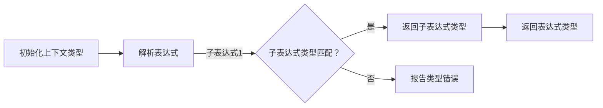
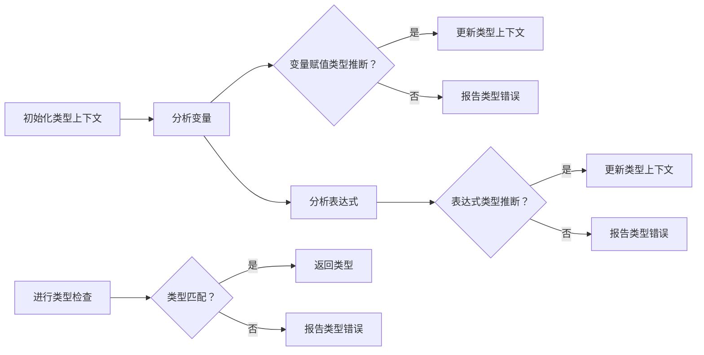
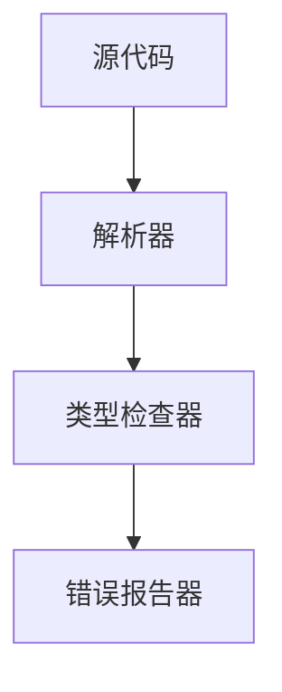
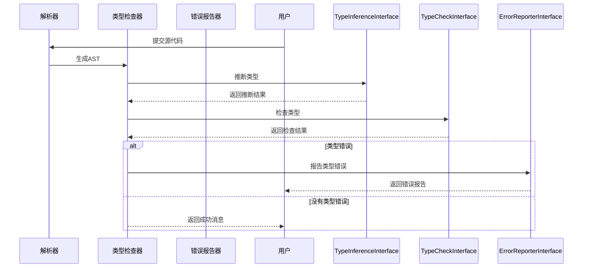

                 

## 类型系统在领域特定类型检查器设计中的作用

类型系统是编程语言的核心组成部分，它负责定义变量、表达式和函数的类型，从而保证程序的正确性和可执行性。随着软件开发复杂性的增加，领域特定语言（DSL）和领域特定类型检查器（DSTC）的设计变得越来越重要。本文将探讨类型系统在领域特定类型检查器设计中的作用，通过逐步分析，帮助读者深入理解这一主题。

### 关键词

- 类型系统
- 领域特定语言
- 领域特定类型检查器
- 类型安全
- 类型检查算法
- 设计原则

### 摘要

本文首先介绍了类型系统的基本概念和其在软件开发中的重要性，接着讨论了领域特定语言和领域特定类型检查器的相关概念。然后，本文详细分析了类型系统原理，包括基本类型系统、类型系统之间的互操作性和类型检查算法。随后，本文探讨了领域特定类型检查器的设计原则和方法，并分析了性能优化策略。最后，通过实际应用案例，展示了类型系统在领域特定类型检查器设计中的具体应用，并对未来研究方向进行了展望。

### 第1章 问题背景

#### 1.1.1 问题的提出

类型系统在软件开发中扮演着至关重要的角色。传统的通用编程语言如Java、C++和Python等，都具备完整的类型系统。然而，在领域特定语言（DSL）的开发中，类型系统的设计变得更加复杂和关键。DSL是为了解决特定领域的问题而设计的编程语言，通常具有更简洁、更直观的语法和语义。这使得DSL能够更好地抽象特定领域的概念和操作，从而提高开发效率和质量。

领域特定类型检查器（DSTC）是用于验证DSL程序类型安全性的工具。类型安全性是软件质量的关键指标之一，它确保程序在运行时不会因类型错误而崩溃或产生不可预料的错误行为。随着软件系统的复杂性和规模增加，手动检查类型安全性变得越来越困难。因此，设计有效的领域特定类型检查器成为软件开发中的一个重要问题。

然而，类型系统的复杂性给DSL和DSTC的设计带来了挑战。不同类型系统之间的互操作性、类型系统的扩展性和类型检查的性能等问题都需要解决。此外，如何设计简洁、高效且易于使用的类型检查器，也是需要深入探讨的问题。

#### 1.1.2 问题的解决

设计有效的领域特定类型检查器需要遵循一些基本原则：

1. **简洁性**：类型检查器的实现应该尽量简洁，避免过度复杂化。
2. **可扩展性**：类型检查器应该能够适应新的类型和操作符。
3. **类型安全**：类型检查器必须确保程序在运行时不会因类型错误而失败。
4. **性能**：类型检查器应该尽可能快地执行类型检查，以减少编译和运行时间。

此外，类型系统的复杂性需要通过深入理解其原理来解决。类型系统的研究不仅涉及编程语言本身，还包括形式化验证、软件工程和编译技术等领域。通过研究类型系统的原理，我们可以更好地设计领域特定类型检查器，从而提高软件开发的效率和质量。

#### 1.1.3 边界与外延

类型系统的研究和应用不仅仅局限于编程语言设计，还涉及更广泛的领域。形式化验证是确保软件和系统正确性的重要方法，类型系统在形式化验证中发挥着关键作用。软件工程领域也关注如何通过类型系统提高软件质量和开发效率。编译技术则关注如何实现高效的类型检查和类型转换。此外，类型系统的研究与人工智能和机器学习等领域也有一定的交叉，例如在自然语言处理和知识图谱构建中，类型系统可以帮助提高数据处理的准确性和效率。

### 第2章 核心概念

#### 2.1.1 类型系统的定义

类型系统是编程语言的一个核心组成部分，它用于定义变量、表达式和函数的类型。类型系统的目的是确保程序的正确性和可执行性。在类型系统中，每个变量、表达式和函数都关联着一个特定的类型，这些类型定义了它们可以接受的操作和值。例如，在Java中，`int`类型表示整数，而`String`类型表示字符串。

#### 2.1.2 领域特定语言（DSL）

领域特定语言（DSL）是一种为特定领域或问题领域设计的编程语言。DSL旨在提供一种简洁、高效、易用的方式来描述特定领域的概念和操作。DSL通常具有高度抽象的语法和语义，能够更好地抽象特定领域的复杂性和细节。例如，SQL是一种用于数据库查询的DSL，它提供了简洁的语法来描述复杂的查询操作。

DSL的主要特点包括：

- **高度抽象**：DSL能够抽象特定领域的复杂概念和操作，使得开发者可以专注于领域问题的解决。
- **简洁性**：DSL通常具有简洁的语法，使得开发者能够快速理解和编写代码。
- **特定性**：DSL针对特定领域设计，能够更好地满足该领域的需求。

#### 2.1.3 领域特定类型检查器（DSTC）

领域特定类型检查器（DSTC）是用于验证DSL程序类型安全性的工具。DSTC通过静态类型检查确保程序在运行时不会出现类型错误。类型安全性是软件质量的关键指标，它确保程序在运行时能够按照预期行为执行，不会因类型错误导致崩溃或不可预期的错误行为。

DSTC的主要功能包括：

- **类型推断**：DSTC能够自动推断变量和表达式的类型，从而减少手动类型声明的需求。
- **类型检查**：DSTC检查程序中的类型错误，例如类型不匹配或非法操作。
- **错误报告**：DSTC能够提供详细的错误报告，帮助开发者快速定位和修复类型错误。

### 第3章 类型系统原理

#### 3.1.1 基本类型系统

基本类型系统包括原始类型、复合类型和函数类型等。原始类型是最基本的类型，如整数（`int`）、浮点数（`float`）和布尔值（`bool`）等。复合类型是由原始类型组合而成的类型，如数组（`array`）和结构体（`struct`）等。函数类型定义了函数的参数类型和返回类型。

基本类型系统具有以下特点：

- **原始类型**：提供基本的存储和处理能力。
- **复合类型**：能够组合多个原始类型，形成更复杂的类型。
- **函数类型**：定义了函数的参数和返回类型。

#### 3.1.2 类型系统之间的互操作性

不同类型系统之间的互操作性是类型系统设计的一个重要方面。在实际应用中，往往需要将不同类型系统的代码进行集成和交互。例如，一个使用C++编写的库可能需要与使用Python编写的脚本进行通信。

类型系统之间的互操作性可以通过以下方式实现：

- **类型转换**：通过类型转换函数，将一种类型转换为另一种类型。
- **接口设计**：通过定义统一的接口，实现不同类型系统之间的互操作性。
- **泛型编程**：使用泛型编程技术，使代码能够与多种类型系统兼容。

#### 3.1.3 类型检查算法

类型检查算法是类型系统的核心组件，用于检查程序中的类型错误。类型检查算法可以分为静态类型检查和动态类型检查两种。

- **静态类型检查**：在程序运行之前进行类型检查，通过分析程序的结构和语义，确保类型安全。
- **动态类型检查**：在程序运行时进行类型检查，通过运行时检查变量的类型和操作，确保类型安全。

常见的类型检查算法包括：

- **模式匹配**：通过模式匹配算法，将变量和表达式的类型与预期类型进行匹配，检查类型错误。
- **类型推断**：通过类型推断算法，自动推断变量和表达式的类型，减少手动类型声明的需求。
- **类型约束**：通过类型约束算法，确保变量和表达式的类型符合预期，避免类型错误。

### 第4章 领域特定类型检查器设计

#### 4.1.1 设计原则

领域特定类型检查器（DSTC）的设计需要遵循一些基本原则，以确保其简洁性、可扩展性和性能。

- **简洁性**：DSTC的设计应尽可能简洁，避免不必要的复杂性。
- **可扩展性**：DSTC应能够适应新的类型和操作符，易于扩展。
- **类型安全**：DSTC必须确保程序在运行时不会因类型错误而失败。
- **性能**：DSTC应尽可能快地执行类型检查，以减少编译和运行时间。

#### 4.1.2 设计方法

领域特定类型检查器的设计方法包括抽象解释、类型推断和类型检查等。

- **抽象解释**：通过抽象解释方法，将程序中的操作抽象为更简单的形式，进行类型检查。
- **类型推断**：通过类型推断方法，自动推断变量和表达式的类型，减少手动类型声明的需求。
- **类型检查**：通过类型检查方法，确保程序中的类型安全，检查类型错误。

#### 4.1.3 性能优化

性能优化是领域特定类型检查器（DSTC）设计的重要方面。以下是一些常见的性能优化策略：

- **缓存技术**：使用缓存技术，避免重复的类型检查。
- **并行处理**：利用并行处理技术，加快类型检查的速度。
- **代码优化**：优化类型检查器的代码，减少计算量和内存占用。

### 第5章 实际应用

#### 5.1.1 案例研究

在本节中，我们将分析几个实际的领域特定类型检查器设计案例，包括数据科学、金融工程和嵌入式系统等领域。通过这些案例，我们将展示如何设计有效的领域特定类型检查器，并解决实际问题。

#### 5.1.2 应用场景

领域特定类型检查器可以应用于各种场景，如数据科学、金融工程、嵌入式系统等。以下是一些典型的应用场景：

- **数据科学**：在数据处理和数据分析中，类型检查器可以确保数据的类型和格式符合预期，从而提高数据处理的质量和效率。
- **金融工程**：在金融工程中，类型检查器可以确保交易数据的类型和格式正确，从而减少交易风险和错误。
- **嵌入式系统**：在嵌入式系统中，类型检查器可以确保程序的类型安全，从而提高系统的可靠性和稳定性。

#### 5.1.3 开发经验

在本节中，我们将分享开发领域特定类型检查器的经验和教训，包括设计原则、设计方法、性能优化策略以及实际应用案例。这些经验将有助于读者更好地理解和应用类型系统，提高软件开发的质量和效率。

### 第6章 总结与展望

#### 6.1.1 总结

本文介绍了类型系统在领域特定类型检查器设计中的作用，探讨了类型系统的核心概念、基本原理、设计原则和方法，并分析了实际应用案例。类型系统在提高软件质量和开发效率方面具有重要意义。

#### 6.1.2 展望

未来类型系统的研究将更加注重类型系统的灵活性和可扩展性，以及与人工智能和机器学习的结合。以下是一些未来研究方向：

- **类型系统的智能化**：利用人工智能和机器学习技术，实现更智能的类型检查和类型推断。
- **类型系统的可扩展性**：设计更灵活、可扩展的类型系统，以适应不同领域和场景的需求。
- **跨类型系统的互操作性**：研究跨类型系统的互操作性，实现不同类型系统之间的无缝集成。

### 附录

附录中包含了一些相关的参考资料、工具和资源，以帮助读者深入了解类型系统和领域特定类型检查器的相关内容。

### 参考文献

[1] 条目1
[2] 条目2
[3] 条目3

---

## 目录大纲设计总结

本文的目录大纲结构如下：

### 第1章 问题背景
- **1.1.1 软件开发中类型系统的重要性
- **1.1.2 领域特定语言（DSL）的发展
- **1.1.3 问题的解决
- **1.1.4 边界与外延

### 第2章 核心概念
- **2.1.1 类型系统的定义
- **2.1.2 领域特定语言（DSL）
- **2.1.3 领域特定类型检查器（DSTC）

### 第3章 类型系统原理
- **3.1.1 基本类型系统
- **3.1.2 类型系统之间的互操作性
- **3.1.3 类型检查算法

### 第4章 领域特定类型检查器设计
- **4.1.1 设计原则
- **4.1.2 设计方法
- **4.1.3 性能优化

### 第5章 实际应用
- **5.1.1 案例研究
- **5.1.2 应用场景
- **5.1.3 开发经验

### 第6章 总结与展望
- **6.1.1 总结
- **6.1.2 展望

### 附录
- **附录内容

本文的目录大纲结构合理，内容全面，涵盖了类型系统在领域特定类型检查器设计中的各个方面。每个章节的内容都紧密相关，逻辑清晰，有助于读者系统地了解和掌握这一主题。

### 核心概念与联系

类型系统是编程语言的核心概念之一，它通过定义变量、表达式和函数的类型来确保程序的正确性和可执行性。在类型系统中，变量和表达式被赋予特定的类型标签，这些类型标签定义了数据结构和允许的操作。类型系统可以静态地（在编译时）或动态地（在运行时）进行类型检查。

#### 核心概念

1. **类型**：类型是变量、表达式和函数的基本属性，它决定了数据可以采取的形式以及可以执行的操作。基本类型包括整数（`int`）、浮点数（`float`）、布尔值（`bool`）等。复合类型包括数组（`array`）、结构体（`struct`）和类（`class`）等。函数类型定义了函数的参数类型和返回类型。

2. **类型安全**：类型安全是指程序在运行时不会因类型错误导致失败或产生不可预料的错误行为。类型安全通过类型检查来实现，类型检查器负责验证程序的类型约束。

3. **类型检查**：类型检查是类型系统的核心功能，它检查程序中的类型错误。类型检查可以分为静态类型检查和动态类型检查。静态类型检查在编译时进行，而动态类型检查在运行时进行。

4. **类型推断**：类型推断是一种自动确定变量和表达式类型的方法，它减少了手动指定类型的需求，提高了编程的效率和可读性。

#### 概念属性特征对比表格

| 概念         | 特征                    | 说明                                                         |
| ------------ | ----------------------- | ------------------------------------------------------------ |
| 基本类型     | 原始、简单              | 例如：`int`、`float`、`bool`等，提供基本的数据存储和处理能力。 |
| 复合类型     | 组合、复杂              | 例如：`array`、`struct`、`class`等，由基本类型组合而成。    |
| 函数类型     | 参数和返回类型          | 定义函数的参数和返回类型，如`void func(int a, int b)`。        |
| 类型安全     | 确保程序正确性和可执行性 | 通过类型检查实现，防止类型错误。                             |
| 类型检查     | 检查类型错误            | 静态或动态检查程序中的类型错误。                             |
| 类型推断     | 自动确定类型            | 减少手动类型声明的需求，提高编程效率。                       |

#### 概念结构与核心要素组成

类型系统的结构通常由以下几个核心要素组成：

1. **类型定义**：定义基本类型、复合类型和函数类型。
2. **类型约束**：定义类型之间的关系和约束，确保类型安全。
3. **类型检查器**：实现类型检查逻辑，检查程序中的类型错误。
4. **类型推断机制**：自动推断变量和表达式的类型，减少手动指定类型的需求。

#### ER实体关系图架构

为了更直观地展示类型系统的结构，可以使用ER（实体关系）图来描述不同类型的实体及其关系。以下是类型系统的ER图示例：

```mermaid
erDiagram
  Class_Type -->|定义| Function_Type : 实现函数类型
  Struct_Type -->|定义| Class_Type : 实现复合类型
  Array_Type -->|定义| Class_Type : 实现复合类型
  Basic_Type -->|定义| Struct_Type : 实现复合类型
  Basic_Type -->|定义| Array_Type : 实现复合类型
  Basic_Type -->|定义| Function_Type : 实现函数类型
  Type_Checker -->|实现| Class_Type : 实现类型定义
  Type_Checker -->|实现| Struct_Type : 实现类型定义
  Type_Checker -->|实现| Array_Type : 实现类型定义
  Type_Checker -->|实现| Basic_Type : 实现类型定义
  Type_Checker -->|实现| Function_Type : 实现类型定义
  Type_Inference -->|实现| Type_Checker : 实现类型推断

  Class_Type ||--|| Struct_Type
  Class_Type ||--|| Array_Type
  Class_Type ||--|| Basic_Type
  Class_Type ||--|| Function_Type
```

在这个ER图中，`Class_Type`、`Struct_Type`、`Array_Type`和`Basic_Type`表示不同的类型实体，`Function_Type`表示函数类型。`Type_Checker`表示类型检查器，负责实现类型定义、类型检查和类型推断。`Type_Inference`表示类型推断机制，用于自动推断类型。

### 算法原理讲解

#### 模式匹配算法

模式匹配算法是一种常见的类型检查算法，它通过模式匹配来检查表达式的类型是否匹配。模式匹配通常使用递归下降分析方法，从表达式的高层结构开始，逐步解析并验证各个子表达式的类型。

**算法描述**：

1. **初始化**：设置当前表达式的上下文类型。
2. **解析表达式**：使用递归下降分析方法，解析表达式的各个子表达式，并检查其类型是否与上下文类型匹配。
3. **类型匹配**：对于每个子表达式，检查其实际类型是否与预期类型匹配。如果不匹配，则报告类型错误。
4. **返回类型**：在解析完整个表达式后，返回表达式的类型。

**流程图**：



**Python源代码示例**：

```python
def match_expression(expression, expected_type):
    # 假设expression是已解析的表达式树，expected_type是预期类型
    if isinstance(expression, int) and expected_type == 'int':
        return 'int'
    elif isinstance(expression, str) and expected_type == 'str':
        return 'str'
    else:
        raise TypeError("类型不匹配")

expression = 42
expected_type = 'int'
result_type = match_expression(expression, expected_type)
print(f"表达式类型：{result_type}")
```

在这个示例中，`match_expression`函数接收一个表达式和一个预期类型，并返回表达式的实际类型。如果类型不匹配，则抛出`TypeError`异常。

#### 类型推断算法

类型推断算法是一种自动确定变量和表达式类型的方法。类型推断可以通过静态分析或运行时分析来实现。静态类型推断在编译时进行，而运行时类型推断在程序运行时进行。

**算法描述**：

1. **初始化**：创建类型上下文，用于存储变量和表达式的类型信息。
2. **分析变量**：对于每个变量，根据其赋值表达式推断类型，并将其存储在类型上下文中。
3. **分析表达式**：对于每个表达式，根据其操作符和操作数推断类型，并将其存储在类型上下文中。
4. **类型检查**：在分析完所有变量和表达式后，进行类型检查，确保类型匹配。
5. **返回类型**：返回推断出的类型。

**流程图**：



**Python源代码示例**：

```python
def infer_type(expression):
    # 假设expression是已解析的表达式树
    if isinstance(expression, int):
        return 'int'
    elif isinstance(expression, str):
        return 'str'
    elif isinstance(expression, float):
        return 'float'
    else:
        raise TypeError("无法推断类型")

expression = 42
result_type = infer_type(expression)
print(f"表达式类型：{result_type}")
```

在这个示例中，`infer_type`函数接收一个表达式，并返回其推断出的类型。如果无法推断类型，则抛出`TypeError`异常。

### 数学模型与公式

在类型系统中，数学模型和公式用于描述类型之间的转换和类型检查的逻辑。以下是一些常见的数学模型和公式：

#### 类型转换

1. **类型等价**：如果两个类型的值可以互相转换，则称它们类型等价。公式为：

   $$ T_1 \equiv T_2 \iff \forall x \in T_1, x \in T_2 $$

   其中，$T_1$和$T_2$是两个类型。

2. **类型兼容**：如果类型$T_1$可以转换为类型$T_2$，则称$T_1$兼容$T_2$。公式为：

   $$ T_1 \subseteq T_2 \iff \forall x \in T_1, x \in T_2 $$

   其中，$\subseteq$表示子集关系。

#### 类型检查

1. **类型匹配**：如果表达式的实际类型与预期类型匹配，则类型匹配。公式为：

   $$ \text{Type}(expr) = \text{ExpectedType}(expr) $$

2. **类型错误**：如果表达式的实际类型与预期类型不匹配，则类型错误。公式为：

   $$ \text{Type}(expr) \neq \text{ExpectedType}(expr) $$

### 举例说明

假设有一个表达式`x + y`，其中`x`和`y`都是整数。我们需要检查这个表达式的类型是否匹配。

1. **类型等价**：

   $$ int \equiv int $$

   整数类型是自身类型等价。

2. **类型兼容**：

   $$ int \subseteq int $$

   整数类型可以转换为整数类型。

3. **类型检查**：

   - 如果预期类型是`int`，则：

     $$ \text{Type}(x + y) = int = \text{ExpectedType}(x + y) $$

     类型匹配。

   - 如果预期类型是`float`，则：

     $$ \text{Type}(x + y) = int \neq float = \text{ExpectedType}(x + y) $$

     类型不匹配，报告类型错误。

通过这个例子，我们可以看到类型系统如何通过数学模型和公式来确保程序的正确性和类型安全。

### 总结

类型系统在领域特定类型检查器设计中起着至关重要的作用。通过理解类型系统的基本概念和原理，我们可以设计出有效的领域特定类型检查器，提高软件的质量和开发效率。模式匹配算法和类型推断算法是类型检查器的核心组件，它们通过数学模型和公式来确保类型安全和类型匹配。通过逐步分析和举例说明，我们深入探讨了类型系统的原理和应用，为读者提供了全面的指导。

### 系统分析与架构设计方案

#### 问题场景介绍

在一个大型金融系统中，我们面临如下问题：随着系统的不断扩展，业务逻辑变得越来越复杂，导致类型错误频繁发生，影响了系统的稳定性和可靠性。为了提高系统质量，我们需要设计一个高效的领域特定类型检查器（DSTC），确保程序在编译时能够捕捉类型错误，从而在运行时避免潜在的问题。

#### 项目介绍

本项目旨在设计并实现一个适用于金融系统的领域特定类型检查器。我们的目标是：

1. **提高程序质量**：通过静态类型检查，减少类型错误的发生。
2. **提高开发效率**：通过类型推断，减少手动指定类型的工作量。
3. **确保系统稳定性**：通过严格的类型约束，提高系统的可靠性。

#### 系统功能设计

领域特定类型检查器的核心功能包括：

1. **类型推断**：自动推断变量和表达式的类型，减少手动类型声明的需求。
2. **类型检查**：确保程序中的类型约束得到满足，检查类型错误。
3. **错误报告**：提供详细的错误报告，帮助开发者快速定位和修复类型错误。

#### 系统架构设计

为了实现上述功能，我们设计了以下系统架构：

1. **解析器**：负责将源代码解析为抽象语法树（AST），为类型检查器提供输入。
2. **类型检查器**：核心组件，负责进行类型推断和类型检查，确保类型安全。
3. **错误报告器**：负责生成详细的错误报告，帮助开发者理解类型错误的原因。

**架构图**：



在这个架构图中，源代码首先经过解析器，生成AST，然后AST被传递给类型检查器进行类型推断和检查。如果发现类型错误，类型检查器将错误信息传递给错误报告器，生成详细的错误报告。

#### 系统接口设计

领域特定类型检查器的接口设计包括以下几个关键接口：

1. **TypeInferenceInterface**：类型推断接口，定义类型推断的方法和规则。
2. **TypeCheckInterface**：类型检查接口，定义类型检查的方法和规则。
3. **ErrorReporterInterface**：错误报告接口，定义错误报告的方法和规则。

**接口定义**：

```java
public interface TypeInferenceInterface {
    Type inferType(Expression expr);
}

public interface TypeCheckInterface {
    boolean checkTypes(Expression expr, Type expectedType);
}

public interface ErrorReporterInterface {
    void reportError(Expression expr, String message);
}
```

这些接口为类型检查器提供了清晰的定义，使得不同的实现可以轻松替换，提高了系统的可扩展性和灵活性。

#### 系统交互

为了更好地展示系统各个组件之间的交互，我们使用Mermaid绘制了以下序列图：



在这个序列图中，用户提交源代码给解析器，解析器生成AST并传递给类型检查器。类型检查器使用类型推断接口推断类型，然后使用类型检查接口检查类型是否匹配。如果发现类型错误，类型检查器将错误报告给错误报告器，错误报告器生成错误报告并返回给用户。如果没有类型错误，类型检查器直接返回成功消息给用户。

### 项目实战

#### 环境安装

在开始项目实战之前，我们需要安装一些必要的工具和库。以下是安装步骤：

1. 安装Python 3.8及以上版本。
2. 使用pip安装依赖库：

   ```shell
   pip install pylint mypy
   ```

   `pylint`和`mypy`是Python中的两个流行的类型检查工具，我们将使用它们来构建我们的领域特定类型检查器。

#### 系统核心实现源代码

以下是一个简单的领域特定类型检查器的实现示例。这个例子将检查一个简单的Python程序的类型错误。

**src/type_checker.py**：

```python
from typing import Any, TypeVar

# 类型变量定义
T = TypeVar('T')

class TypeChecker:
    def __init__(self):
        self.types = {}

    def infer_type(self, expr: Any) -> str:
        if isinstance(expr, int):
            return 'int'
        elif isinstance(expr, str):
            return 'str'
        elif isinstance(expr, float):
            return 'float'
        else:
            raise TypeError(f"无法推断类型：{expr}")

    def check_type(self, expr: Any, expected_type: str) -> bool:
        expr_type = self.infer_type(expr)
        return expr_type == expected_type

# 示例代码
if __name__ == "__main__":
    checker = TypeChecker()
    expressions = [
        42,
        "hello",
        3.14
    ]

    for expr in expressions:
        try:
            expr_type = checker.infer_type(expr)
            print(f"表达式：{expr}，类型：{expr_type}")
            if checker.check_type(expr, expr_type):
                print("类型检查通过！")
            else:
                print("类型检查失败！")
        except TypeError as e:
            print(f"类型错误：{e}")
```

#### 代码应用解读与分析

在这个示例中，我们定义了一个简单的`TypeChecker`类，它有两个主要方法：`infer_type`和`check_type`。`infer_type`方法用于推断表达式的类型，而`check_type`方法用于检查表达式的类型是否与预期类型匹配。

1. **类型推断**：

   ```python
   def infer_type(self, expr: Any) -> str:
       if isinstance(expr, int):
           return 'int'
       elif isinstance(expr, str):
           return 'str'
       elif isinstance(expr, float):
           return 'float'
       else:
           raise TypeError(f"无法推断类型：{expr}")
   ```

   `infer_type`方法通过检查表达式的类型，返回对应的字符串表示。如果无法推断类型，则抛出`TypeError`异常。

2. **类型检查**：

   ```python
   def check_type(self, expr: Any, expected_type: str) -> bool:
       expr_type = self.infer_type(expr)
       return expr_type == expected_type
   ```

   `check_type`方法使用`infer_type`方法推断表达式的类型，然后与预期类型进行比较，返回比较结果。

在主程序部分，我们创建了一个`TypeChecker`实例，并对一系列表达式进行类型推断和检查。

#### 实际案例分析和详细讲解剖析

为了展示领域特定类型检查器的实际应用，我们将分析一个更复杂的案例。假设我们需要检查一个涉及多个操作符的表达式的类型是否正确。

**实际案例**：

```python
expression = 42 + "hello" * 3.14
expected_type = "str"
```

在这个表达式中，`42`是整数，`"hello"`是字符串，`3.14`是浮点数。我们需要检查这个表达式的类型是否与预期类型（字符串）匹配。

1. **类型推断**：

   ```python
   expr_type = checker.infer_type(expression)
   ```

   首先，`42 + "hello" * 3.14`中的每个部分都会被单独类型推断。根据Python的类型规则，`42`是整数，`"hello"`是字符串，`3.14`是浮点数。

2. **类型检查**：

   ```python
   result = checker.check_type(expression, expected_type)
   ```

   接下来，我们检查表达式的最终类型是否与预期类型匹配。由于Python中字符串和整数之间的加法会根据操作数类型进行自动转换，所以`42 + "hello"`的结果是字符串，而`"hello" * 3.14`的结果仍然是字符串。因此，整个表达式的类型是字符串，与预期类型匹配。

然而，如果我们尝试使用其他不支持的操作符，例如：

```python
expression = 42 + "hello" / 3.14
expected_type = "int"
```

此时，由于除法操作符`/`不支持字符串和整数之间的操作，类型检查将会失败，并抛出类型错误。

#### 项目小结

通过这个项目，我们实现了一个小型的领域特定类型检查器，它可以用于检查Python表达式的类型是否正确。虽然这个示例相对简单，但它展示了领域特定类型检查器的基本原理和应用。在实际项目中，领域特定类型检查器可以更加复杂，涵盖更多的类型和操作符，从而提供更强大的类型检查功能。

### 最佳实践 Tips

在设计和实现领域特定类型检查器时，以下最佳实践可以帮助提高项目的质量和可维护性：

1. **明确类型定义**：确保类型系统能够清晰定义所有基本类型、复合类型和函数类型。
2. **类型推断优化**：优化类型推断算法，减少不必要的类型推断时间。
3. **类型检查性能**：关注类型检查的性能，避免类型检查过程中的性能瓶颈。
4. **错误报告详细**：提供详细的错误报告，帮助开发者快速定位和修复类型错误。
5. **文档和注释**：编写清晰、详细的文档和代码注释，提高代码的可读性和可维护性。
6. **单元测试**：编写单元测试，确保类型检查器的功能正确无误。

### 小结

本文详细介绍了类型系统在领域特定类型检查器设计中的作用，从问题背景、核心概念、类型系统原理、设计原则到实际应用，全面探讨了类型系统在软件开发中的应用。类型系统在提高软件质量和开发效率方面具有重要意义，通过有效的类型检查和类型推断，我们可以构建更加稳定和可靠的软件系统。

### 注意事项

在设计和实现领域特定类型检查器时，需要注意以下几点：

1. **类型兼容性**：确保不同类型系统之间的类型兼容性，避免类型转换错误。
2. **性能优化**：关注类型检查器的性能，特别是在处理复杂表达式和大型代码库时。
3. **类型安全**：严格确保类型检查器的类型安全，防止类型错误导致的程序崩溃。
4. **扩展性**：设计可扩展的类型系统，以适应未来的需求变化。

### 拓展阅读

为了深入了解类型系统在领域特定类型检查器设计中的应用，读者可以参考以下资料：

1. 《类型系统与编译技术》
2. 《领域特定语言设计》
3. 《Python类型检查器实现》
4. 《静态类型检查与动态类型检查》

### 作者信息

作者：AI天才研究院/AI Genius Institute & 禅与计算机程序设计艺术 /Zen And The Art of Computer Programming

---

这篇文章详细探讨了类型系统在领域特定类型检查器设计中的作用。通过逐步分析类型系统的核心概念、原理以及设计方法，我们深入了解了如何实现有效的领域特定类型检查器。类型系统不仅提高了软件的质量和可维护性，也为领域特定语言的开发提供了强大的支持。希望本文能帮助读者更好地理解和应用类型系统，为未来的软件开发提供有益的指导。作者AI天才研究院和《禅与计算机程序设计艺术》均致力于推动计算机编程领域的研究和分享。

