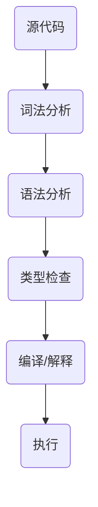
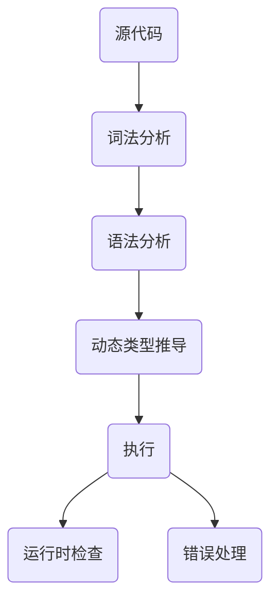
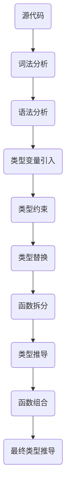

                 

### 关键词
- 类型系统
- 罗素
- 编程语言
- 一致性
- 算法原理
- 数学模型
- 系统架构

### 摘要
本文从罗素对逻辑和数学的探讨出发，深入讲解了类型系统在编程语言中的重要性及其一致性。通过对比不同类型系统的属性特征，分析类型检查和类型推导算法的原理，结合数学模型和公式，本文展示了从理论到实践的完整视角。最后，通过系统分析与架构设计、项目实战，探讨了类型系统的最佳实践，总结了未来的发展趋势，为深入研究和实践提供了方向。

### 第一部分：背景介绍

#### 第1章：问题背景

##### 1.1.1 罗素与类型系统的起源

伯特兰·罗素（Bertrand Russell）是20世纪最伟大的数学家、哲学家之一，他对逻辑和数学的研究奠定了现代计算机科学的基础。罗素在1901年提出了著名的“集合论悖论”，这一发现揭示了传统的集合理论存在根本性问题。这一问题的解决引发了类型论的发展，类型系统作为逻辑和数学研究的重要工具，逐渐被引入到计算机科学中。

在计算机科学中，类型系统是编程语言的核心组成部分，它确保了程序的逻辑一致性和正确性。罗素的类型论观点认为，每个数学对象都应该有一个确定的类型，这为后来的编程语言设计提供了理论基础。

##### 1.1.2 类型系统的重要性

类型系统在编程语言中的重要性不容忽视。首先，它提供了对变量和表达式类型的明确定义，使得程序能够更好地被解析和执行。其次，类型系统有助于防止逻辑错误和运行时错误，从而提高了程序的可靠性和稳定性。此外，类型系统还允许编译器或解释器在编译或运行时进行类型检查，确保程序符合预期的类型规则。

在软件开发过程中，类型系统的重要性体现在以下几个方面：

1. **代码可读性和可维护性**：明确的类型系统能够提高代码的可读性，使得开发者更容易理解和修改代码。
2. **错误检测和预防**：类型系统能够在编译或运行时发现类型错误，从而减少潜在的错误。
3. **性能优化**：类型信息有助于编译器生成更高效的代码，提高程序运行速度。

##### 1.1.3 从罗素到现代编程语言的演变

类型系统的演变经历了从理论到实践的过程。罗素的类型论为后来的形式逻辑和编程语言设计奠定了基础。20世纪中期，随着计算机科学的快速发展，类型系统被广泛应用于编程语言设计中。

- **静态类型语言**：如C++、Java，它们在编译时进行类型检查，确保程序在运行前不存在类型错误。
- **动态类型语言**：如Python、JavaScript，它们在运行时进行类型检查，允许更灵活的类型使用。
- **静态与动态类型混合语言**：如C#、TypeScript，它们结合了静态类型和动态类型的优势。

不同类型的编程语言在设计类型系统时采用了不同的策略，但它们的核心目标都是为了确保程序的正确性和效率。随着计算机科学的发展，类型系统也在不断演进，以适应更复杂的应用场景。

#### 第2章：核心概念与联系

##### 2.1.1 类型系统的基本概念

类型系统是编程语言中的一个核心概念，它定义了变量、函数、表达式等的数据类型，以及这些类型之间的关系。类型系统的主要目的是确保程序的逻辑一致性和正确性，防止在编译或运行时出现类型错误。

**核心概念术语说明**：

- **数据类型**：指变量或表达式的类型，如整数、浮点数、布尔值、字符串等。
- **类型检查**：在编译或运行时对变量的类型进行验证，确保符合预期的类型规则。
- **类型推导**：编译器自动推导变量或表达式的类型，而不需要显式指定类型。
- **子类型**：一个类型是另一个类型的子类型，如果它的值集合是另一个类型的子集。

**问题描述**：

类型系统在编程语言中的应用非常广泛，但不同语言的设计者面临着不同的挑战。例如，如何在保证灵活性同时保持性能？如何在静态类型和动态类型之间取得平衡？这些问题的解决需要对类型系统的核心概念有深入的理解。

**问题解决**：

解决这些问题通常需要考虑以下几个方面：

- **类型系统的设计**：选择合适的类型系统，如静态类型、动态类型或混合类型。
- **类型检查算法**：设计高效的类型检查算法，确保类型错误的早期发现和预防。
- **类型推导机制**：设计合理的类型推导机制，提高代码的可读性和维护性。

**边界与外延**：

类型系统的边界涉及类型定义的精确性、类型检查的效率和类型推导的自动性。类型系统的外延则涉及到实际应用中的类型约束、类型兼容性以及类型系统的扩展性。

**概念结构与核心要素组成**：

类型系统的概念结构包括：

- **类型定义**：定义基本类型和复合类型的语法和语义。
- **类型检查**：实现类型检查的算法和规则。
- **类型推导**：实现类型推导的算法和规则。
- **类型兼容性**：定义不同类型之间的兼容关系。

#### 第2章：核心概念与联系

##### 2.1.1 类型系统的基本概念

类型系统是编程语言中的一个核心概念，它定义了变量、函数、表达式等的数据类型，以及这些类型之间的关系。类型系统的主要目的是确保程序的逻辑一致性和正确性，防止在编译或运行时出现类型错误。

**核心概念术语说明**：

- **数据类型**：指变量或表达式的类型，如整数、浮点数、布尔值、字符串等。
- **类型检查**：在编译或运行时对变量的类型进行验证，确保符合预期的类型规则。
- **类型推导**：编译器自动推导变量或表达式的类型，而不需要显式指定类型。
- **子类型**：一个类型是另一个类型的子类型，如果它的值集合是另一个类型的子集。

**问题描述**：

类型系统在编程语言中的应用非常广泛，但不同语言的设计者面临着不同的挑战。例如，如何在保证灵活性同时保持性能？如何在静态类型和动态类型之间取得平衡？这些问题的解决需要对类型系统的核心概念有深入的理解。

**问题解决**：

解决这些问题通常需要考虑以下几个方面：

- **类型系统的设计**：选择合适的类型系统，如静态类型、动态类型或混合类型。
- **类型检查算法**：设计高效的类型检查算法，确保类型错误的早期发现和预防。
- **类型推导机制**：设计合理的类型推导机制，提高代码的可读性和维护性。

**边界与外延**：

类型系统的边界涉及类型定义的精确性、类型检查的效率和类型推导的自动性。类型系统的外延则涉及到实际应用中的类型约束、类型兼容性以及类型系统的扩展性。

**概念结构与核心要素组成**：

类型系统的概念结构包括：

- **类型定义**：定义基本类型和复合类型的语法和语义。
- **类型检查**：实现类型检查的算法和规则。
- **类型推导**：实现类型推导的算法和规则。
- **类型兼容性**：定义不同类型之间的兼容关系。

##### 2.1.2 ER实体关系图架构

实体关系图（Entity-Relationship Diagram，ERD）是一种用于描述数据库中实体及其关系的图形表示方法。ERD在数据库设计和数据建模中扮演着核心角色，它通过实体、属性和关系的定义，帮助开发者直观地理解和构建数据库结构。

**ER模型的组成元素**：

- **实体（Entity）**：表示现实世界中的对象，如学生、订单等。
- **属性（Attribute）**：实体的特性，如学生的姓名、年龄等。
- **关系（Relationship）**：实体之间的关系，如学生与课程之间的选修关系。
- **键（Key）**：用于唯一标识实体的属性或属性组合。

**ER模型的应用与局限**：

**应用**：

- **数据库设计**：ERD帮助开发者设计出符合业务需求的数据库结构。
- **数据建模**：通过ERD可以直观地理解数据之间的关系，便于后续的数据操作和管理。

**局限**：

- **复杂性**：对于复杂的数据库，ERD可能变得难以理解和维护。
- **通用性**：ERD主要用于关系数据库的设计，对其他类型的数据库（如文档型、图形数据库）可能不适用。
- **表达能力**：ERD在某些情况下可能无法完全表达复杂的业务逻辑。

通过ERD，开发者可以更好地理解数据库的结构和业务规则，从而设计出高效、可靠的数据库系统。然而，ERD的应用也受到一定的限制，开发者需要根据实际情况选择合适的数据建模方法。

#### 第3章：类型系统的类型分类

##### 3.1.1 基本类型与复合类型

在类型系统中，基本类型和复合类型是两种常见的类型分类。基本类型是编程语言中预定义的数据类型，而复合类型则是由基本类型组合而成的复杂类型。

**基本类型**：

- **整数类型**：如C语言中的`int`、`short`、`long`等。
- **浮点数类型**：如`float`、`double`等。
- **布尔类型**：用于表示真值，如`true`和`false`。
- **字符类型**：如`char`等。

**复合类型**：

- **数组类型**：由一组相同类型的基本元素组成，如`int[]`。
- **结构体类型**：由一组具有不同类型的基本元素组成，如C语言中的`struct`。
- **类类型**：在面向对象编程语言中，类是一种复合类型，它封装了数据和行为。

**基本类型与复合类型的区别**：

- **定义方式**：基本类型由编程语言预先定义，而复合类型需要通过构造函数或语法构造来定义。
- **内存布局**：基本类型通常占用固定的内存空间，而复合类型的内存布局则取决于其实例化后的具体结构。
- **操作方式**：基本类型的操作通常比较简单，而复合类型则提供了更多复杂的操作方法。

在编程实践中，合理使用基本类型和复合类型可以帮助开发者构建高效、可维护的代码。基本类型适用于简单数据处理，而复合类型则适用于更复杂的数据结构设计和功能实现。

##### 3.1.2 面向对象的类型系统

面向对象编程（Object-Oriented Programming，OOP）是一种流行的编程范式，它通过将数据和操作封装在对象中，提高了代码的可复用性和可维护性。面向对象的类型系统是OOP的核心组成部分，它定义了对象及其行为的方式。

**核心概念**：

- **类（Class）**：类是对象的蓝图，它定义了对象的属性和方法。类是一种复合类型，通常包含数据成员（属性）和成员函数（方法）。
- **对象（Object）**：对象是类的实例，它具有类定义中的属性和方法。每个对象都是独一无二的，具有自己的状态和行为。
- **继承（Inheritance）**：继承是一种让子类继承父类属性和方法的方式，它有助于实现代码的复用和扩展。
- **多态（Polymorphism）**：多态允许通过同一接口调用不同类的实现，提高了代码的灵活性和可扩展性。

**面向对象类型系统的优点**：

- **封装**：通过将数据和操作封装在对象中，可以有效地隐藏内部实现细节，提高了代码的模块化和可维护性。
- **继承**：继承机制使得子类可以继承父类的属性和方法，有助于实现代码的复用。
- **多态**：多态使得不同类的对象可以按照统一的接口进行操作，提高了代码的灵活性和可扩展性。

**面向对象类型系统的挑战**：

- **性能开销**：面向对象编程引入了额外的运行时开销，如方法调用、对象分配等，可能会影响程序的性能。
- **设计复杂性**：面向对象编程要求对系统的整体设计有深入的理解，否则可能导致代码混乱和不必要的复杂性。

在面向对象编程语言中，如Java和C++，类型系统通过类和对象的概念支持面向对象编程。合理利用面向对象类型系统，可以构建出结构清晰、功能强大的软件系统。

##### 3.1.3 函数类型与高阶函数

函数类型和高阶函数是类型系统中的两个重要概念，它们在函数式编程语言中尤为重要。

**函数类型**：

函数类型是一种复合类型，它表示一个函数。函数类型通常由参数类型和返回类型组成，例如`int(int, float)`表示一个接受整数和浮点数作为参数并返回整数的函数。

**高阶函数**：

高阶函数是一种函数，它可以接受其他函数作为参数或返回一个函数。高阶函数是函数式编程的核心概念之一，它增强了代码的可复用性和灵活性。

**核心概念与联系**：

- **参数化多态**：函数类型和高阶函数通过参数化多态（Parametric Polymorphism）实现了对函数类型的抽象。参数化多态使得函数可以接受任意类型的参数，而无需显式指定类型。
- **函数组合**：高阶函数支持函数组合（Function Composition），允许开发者将多个函数组合成一个更复杂的函数。函数组合有助于实现复杂的逻辑和抽象，提高代码的可读性和可维护性。

**应用场景**：

- **数据处理**：在数据处理和变换中，高阶函数可以有效地处理复杂的操作逻辑，如过滤、映射、折叠等。
- **并发编程**：在并发编程中，高阶函数可以用于生成异步操作，实现并发任务的控制和管理。

函数类型和高阶函数是现代编程语言中的重要概念，它们提供了强大的抽象和复用能力，有助于构建高效、可维护的软件系统。

### 第二部分：算法原理讲解

#### 第4章：类型检查算法

类型检查是编程语言编译或运行过程中的一个关键环节，它的目的是确保程序在执行时不会出现类型错误。类型检查算法可以分为静态类型检查和动态类型检查两种。

##### 4.1.1 类型检查的基本原理

**静态类型检查**：

静态类型检查在编译时进行，它要求程序员在编写代码时必须明确指定每个变量和表达式的类型。编译器会根据类型规则对代码进行验证，确保类型的一致性。

**动态类型检查**：

动态类型检查在运行时进行，它不需要程序员显式指定变量和表达式的类型。编译器或解释器会在运行时对变量的类型进行动态推导和检查。

**静态类型检查与动态类型检查的比较**：

- **性能**：静态类型检查通常比动态类型检查更快，因为它在编译时就已经完成类型验证。
- **灵活性**：动态类型检查提供了更高的灵活性，因为它允许在运行时动态改变变量的类型。
- **错误检测**：静态类型检查可以在编译时发现类型错误，从而在程序运行前就进行修正。动态类型检查则需要在运行时发现并处理类型错误。

##### 4.1.2 类型检查算法的mermaid流程图



在这个流程图中，源代码首先经过词法分析和语法分析，生成抽象语法树（AST）。然后，类型检查算法对AST进行遍历，验证每个变量和表达式的类型。最后，编译器或解释器根据类型检查的结果生成机器码或执行解释器。

##### 4.1.3 静态类型检查

静态类型检查是类型检查算法的一种，它要求程序员在编写代码时必须明确指定每个变量和表达式的类型。静态类型检查的主要优点是可以在编译时发现类型错误，从而提前修复问题，提高程序的正确性和可维护性。

**静态类型检查的工作原理**：

1. **类型声明**：程序员在编写代码时需要为每个变量、函数和表达式声明其类型。
2. **类型检查**：编译器根据类型规则对代码进行遍历，检查每个变量的类型是否符合预期。
3. **错误报告**：如果发现类型错误，编译器会生成错误报告，指示错误的类型和位置。

**静态类型检查的优点**：

- **早期错误检测**：类型错误可以在编译时被检测和修复，从而提前避免运行时错误。
- **代码可读性**：明确的类型声明有助于提高代码的可读性，使得代码更容易理解和维护。
- **性能优化**：静态类型检查使得编译器可以生成更高效的代码，因为类型信息可以帮助编译器进行优化。

**静态类型检查的缺点**：

- **强制类型声明**：程序员需要为每个变量和表达式显式声明类型，这可能增加代码的复杂度。
- **灵活性受限**：静态类型检查限制了代码的灵活性，因为类型必须在使用之前定义。

##### 4.1.4 动态类型检查

动态类型检查是类型检查算法的另一种，它不需要程序员显式指定每个变量和表达式的类型。在运行时，编译器或解释器会动态推导每个变量的类型，并在执行过程中进行类型检查。

**动态类型检查的工作原理**：

1. **动态类型推导**：编译器或解释器在运行时根据变量和表达式的值推导出其类型。
2. **运行时检查**：在代码执行过程中，解释器会实时检查每个操作的类型，确保它们之间的一致性。
3. **错误处理**：如果发现类型错误，解释器会抛出异常或错误信息，并在运行时进行处理。

**动态类型检查的优点**：

- **代码灵活性**：动态类型检查允许在运行时动态改变变量和表达式的类型，提高了代码的灵活性和可维护性。
- **减少类型声明**：程序员不需要为每个变量和表达式显式声明类型，减少了代码的冗余。
- **适应性强**：动态类型检查适用于各种不同的编程场景，特别是需要灵活类型转换的应用。

**动态类型检查的缺点**：

- **运行时开销**：动态类型检查需要额外的运行时开销，因为它需要在代码执行过程中进行类型推导和检查。
- **潜在的错误风险**：类型错误可能直到运行时才会被发现，导致潜在的运行时错误。
- **代码可读性降低**：由于类型在运行时推导，代码的可读性和可维护性可能会降低。

##### 4.1.5 类型检查算法的mermaid流程图



在这个流程图中，源代码首先经过词法分析和语法分析，生成抽象语法树（AST）。然后，动态类型推导算法在运行时对AST进行遍历，根据变量和表达式的值推导出其类型。在代码执行过程中，解释器会实时检查每个操作的类型，确保类型的一致性。如果发现类型错误，解释器会抛出异常或错误信息，并在运行时进行处理。

#### 第5章：类型推导算法

类型推导是编译器的一项重要功能，它通过分析程序代码，自动推导出变量、函数、表达式等的类型，而不需要程序员显式指定类型。类型推导算法可以分为静态类型推导和动态类型推导两种。

##### 5.1.1 类型推导的基本概念

**静态类型推导**：

静态类型推导在编译时进行，它根据类型规则和程序结构自动推导出变量和表达式的类型。静态类型推导的主要优点是可以在编译时发现类型错误，从而提前修复问题。

**动态类型推导**：

动态类型推导在运行时进行，它通过分析变量和表达式的值，动态推导出其类型。动态类型推导的主要优点是提高了代码的灵活性和可维护性。

**类型推导的挑战**：

- **歧义性**：在某些情况下，编译器可能无法唯一确定变量的类型，导致歧义性。
- **类型兼容性**：类型推导算法需要确保推导出的类型是兼容的，以避免类型错误。
- **性能开销**：类型推导可能引入额外的性能开销，特别是在动态类型推导中。

##### 5.1.2 柏拉图类型推导

柏拉图类型推导（Parametric Polymorphism）是一种常见的静态类型推导算法，它通过参数化多态（Parametric Polymorphism）实现了对函数类型的抽象。柏拉图类型推导的核心思想是允许函数接受任意类型的参数，而无需显式指定类型。

**柏拉图类型推导的工作原理**：

1. **类型变量**：柏拉图类型推导使用类型变量来表示未确定类型的参数。类型变量通常用大写字母表示，如`T`、`U`等。
2. **类型约束**：类型变量可以与具体类型进行约束，例如`T <: Integer`表示类型变量`T`是整数类型的子类型。
3. **类型推导**：编译器根据类型规则和程序结构，推导出函数参数和返回值的类型。如果类型变量与具体类型进行约束，则类型变量被替换为相应的具体类型。

**柏拉图类型推导的优点**：

- **代码复用**：柏拉图类型推导允许函数接受不同类型的参数，从而提高了代码的复用性。
- **类型安全**：通过类型约束，柏拉图类型推导可以确保函数的参数和返回值类型是兼容的，从而提高了程序的安全性。

**柏拉图类型推导的缺点**：

- **性能开销**：柏拉图类型推导可能引入额外的性能开销，特别是在需要频繁类型替换的场景中。
- **复杂性**：柏拉图类型推导的复杂度较高，特别是在类型约束和类型替换过程中。

##### 5.1.3 柯里化类型推导

柯里化类型推导（Currying）是一种将多参数函数转换为一系列单参数函数的类型推导算法。柯里化类型推导的核心思想是将函数的参数部分应用于实际参数，从而推导出函数的最终类型。

**柯里化类型推导的工作原理**：

1. **函数拆分**：柯里化类型推导将多参数函数拆分为一系列单参数函数。每个单参数函数只接受一个参数，并返回一个接受下一个参数的函数。
2. **类型推导**：对于每个单参数函数，编译器根据类型规则和实际参数推导出其类型。如果存在类型变量，则进行类型约束和替换。
3. **函数组合**：通过递归应用柯里化过程，最终推导出原始多参数函数的类型。

**柯里化类型推导的优点**：

- **类型安全性**：柯里化类型推导确保了函数的参数和返回值类型是兼容的，从而提高了程序的安全性。
- **代码可读性**：通过将多参数函数拆分为一系列单参数函数，提高了代码的可读性和可维护性。

**柯里化类型推导的缺点**：

- **性能开销**：柯里化类型推导可能引入额外的性能开销，特别是在需要频繁函数拆分和组合的场景中。
- **复杂性**：柯里化类型推导的复杂度较高，特别是在多参数函数的类型推导过程中。

##### 5.1.4 类型推导算法的mermaid流程图



在这个流程图中，源代码首先经过词法分析和语法分析，生成抽象语法树（AST）。然后，类型推导算法对AST进行遍历，引入类型变量并进行类型约束和替换。接着，算法将多参数函数拆分为一系列单参数函数，并对每个单参数函数进行类型推导。最后，通过递归组合函数，推导出原始多参数函数的最终类型。

#### 第6章：数学模型与公式

##### 6.1.1 类型系统的数学模型

类型系统可以被视为一个数学模型，它通过集合论和逻辑理论来描述变量和表达式的类型。在类型系统的数学模型中，类型被视为集合，而类型关系可以被视为集合之间的包含关系。

**核心概念**：

- **类型集合**：类型集合是一组类型的集合，每个类型代表一种数据类型。
- **类型关系**：类型关系描述了不同类型之间的包含关系。例如，整数类型是浮点数类型的子类型。

**数学模型的应用**：

类型系统的数学模型可以应用于类型检查和类型推导。通过类型集合和类型关系的定义，编译器可以自动化地推导出变量和表达式的类型，并进行类型检查。

**数学模型的核心公式**：

1. **类型包含**：如果类型A是类型B的子类型，则表示为`A <: B`。
2. **类型合并**：类型合并是类型推导中的一个重要概念，表示两个类型之间的兼容关系。类型合并公式为：
   $$ merge(A, B) = \begin{cases}
   A & \text{如果 } A <: B \\
   B & \text{如果 } B <: A \\
   \text{错误} & \text{否则}
   \end{cases} $$
3. **类型约束**：类型约束是类型推导中的一种限制条件，用于确保类型推导的正确性。类型约束公式为：
   $$ constrain(T, U) = \begin{cases}
   T & \text{如果 } T <: U \\
   U & \text{如果 } U <: T \\
   \text{错误} & \text{否则}
   \end{cases} $$

通过这些公式，编译器可以自动化地推导出变量和表达式的类型，并进行类型检查。

##### 6.1.2 经典例题解析

**例题1**：给定以下代码片段，使用类型系统的数学模型进行类型推导和类型检查。

```python
def add(a: int, b: int) -> int:
    return a + b

result = add(5, "10")
```

**解析**：

1. **类型推导**：根据函数签名，`add`函数的参数类型为`int`，返回类型为`int`。
2. **类型检查**：`add`函数的第一个参数是整数类型`int`，第二个参数是字符串类型`str`，它们之间不存在直接的包含关系。
3. **类型错误**：由于参数类型不匹配，代码片段中的`add`函数调用会导致类型错误。

**修正**：

将第二个参数的类型更改为整数类型，如下所示：

```python
result = add(5, 10)
```

**例题2**：给定以下代码片段，使用类型系统的数学模型进行类型推导和类型检查。

```python
class Animal:
    def __init__(self, name: str):
        self.name = name

class Dog(Animal):
    def bark(self):
        print("Woof!")

dog = Dog("Buddy")
dog.bark()
```

**解析**：

1. **类型推导**：`Dog`类继承自`Animal`类，因此`Dog`类的实例具有`Animal`类的所有属性和方法。
2. **类型检查**：`Dog`类的实例`dog`可以调用`bark`方法，因为`bark`方法是`Dog`类的成员方法。
3. **类型正确**：代码片段中的类型推导和类型检查都是正确的。

通过这些例题，我们可以看到类型系统的数学模型如何帮助编译器自动化地推导出变量和表达式的类型，并进行类型检查。类型系统的数学模型在编译器和编程语言设计过程中发挥着重要作用，确保程序的正确性和安全性。

#### 第7章：系统功能设计

##### 7.1.1 领域模型

领域模型（Domain Model）是软件设计过程中的一种核心概念，它用于描述系统的核心功能和业务逻辑。通过领域模型，开发者可以清晰地理解系统的功能和需求，从而设计出高效、可靠的软件系统。

**核心概念**：

- **实体（Entity）**：实体是领域模型中的基本对象，代表现实世界中的实体，如用户、订单等。
- **关系（Relationship）**：关系描述了实体之间的关联，如用户与订单之间的关系。
- **服务（Service）**：服务是领域模型中的功能模块，用于实现系统的核心功能。

**领域模型的应用**：

领域模型在软件设计中的应用非常广泛，它有助于开发者理解系统的业务需求和功能，从而设计出符合业务需求的软件系统。通过领域模型，开发者可以：

- **明确系统的核心功能**：领域模型可以帮助开发者清晰地识别系统的核心功能和业务逻辑。
- **指导数据库设计**：领域模型可以用于设计数据库结构，确保数据库能够准确反映系统的业务需求。
- **促进团队协作**：领域模型为团队成员提供了一个共同的语言和视觉模型，有助于团队协作和沟通。

**领域模型的局限**：

- **复杂性**：对于复杂的系统，领域模型可能变得复杂且难以理解。
- **可扩展性**：领域模型在设计初期可能无法完全预见未来的需求变化，导致模型难以扩展。

在软件设计过程中，合理使用领域模型可以帮助开发者更好地理解系统的业务需求和功能，从而设计出高效、可靠的软件系统。

##### 7.1.2 系统功能实现

系统功能实现是软件设计过程中的关键环节，它涉及到如何将领域模型中的功能需求转化为实际的代码实现。在实现系统功能时，开发者需要考虑以下几个方面：

**核心概念**：

- **模块化设计**：将系统功能划分为不同的模块，每个模块负责实现特定的功能。
- **接口设计**：定义系统模块之间的接口，确保模块之间的交互清晰、简洁。
- **代码复用**：通过模块化和接口设计，实现代码的复用，提高开发效率和可维护性。

**系统功能实现的方法**：

1. **需求分析**：首先进行需求分析，明确系统的功能需求，确保实现的功能满足业务需求。
2. **设计领域模型**：根据需求分析的结果，设计出领域模型，明确系统的核心功能和业务逻辑。
3. **模块划分**：将领域模型中的功能需求划分为不同的模块，每个模块负责实现特定的功能。
4. **接口定义**：定义模块之间的接口，确保模块之间的交互清晰、简洁。
5. **代码实现**：根据模块划分和接口定义，实现每个模块的具体代码。
6. **测试和调试**：对实现的功能进行测试和调试，确保功能符合预期并能够稳定运行。

**系统功能实现的优点**：

- **代码复用**：通过模块化和接口设计，实现代码的复用，提高开发效率和可维护性。
- **可扩展性**：模块化设计使得系统功能易于扩展，便于未来需求的变化。
- **可维护性**：清晰的模块划分和接口定义有助于提高代码的可维护性，降低维护成本。

**系统功能实现的缺点**：

- **设计复杂性**：对于复杂的系统，模块划分和接口设计可能变得复杂，增加了设计难度。
- **性能开销**：模块化和接口设计可能引入额外的性能开销，特别是在模块间交互频繁的场景中。

在实现系统功能时，合理使用模块化设计和接口定义，可以有效地提高代码的可维护性和扩展性，从而设计出高效、可靠的软件系统。

##### 7.1.3 系统架构设计

系统架构设计是软件设计过程中至关重要的一环，它决定了系统的整体结构和性能。在系统架构设计中，开发者需要考虑系统的需求、功能、性能、可扩展性等方面，以确保系统能够高效、稳定地运行。

**核心概念**：

- **架构风格**：系统架构的风格决定了系统的整体结构和模块划分方式，如分层架构、微服务架构等。
- **组件**：系统架构中的基本构建块，每个组件负责实现特定的功能。
- **接口**：组件之间的接口定义了组件之间的交互方式和交互协议。
- **数据流**：系统中的数据流描述了数据在不同组件之间的传输和处理过程。

**系统架构设计的方法**：

1. **需求分析**：首先进行需求分析，明确系统的功能需求和性能需求，确保架构设计能够满足业务需求。
2. **架构风格选择**：根据需求分析的结果，选择适合的架构风格，如分层架构、微服务架构等。
3. **组件划分**：将系统的功能需求划分为不同的组件，每个组件负责实现特定的功能。
4. **接口设计**：定义组件之间的接口，确保组件之间的交互清晰、简洁。
5. **数据流设计**：设计系统中的数据流，确保数据在不同组件之间的传输和处理过程高效、稳定。
6. **性能优化**：对架构设计进行性能优化，确保系统在高负载情况下能够高效运行。

**系统架构设计的优点**：

- **可扩展性**：通过合理的架构设计，系统可以方便地扩展，满足未来需求的变化。
- **可维护性**：清晰的组件划分和接口设计有助于提高代码的可维护性，降低维护成本。
- **性能优化**：通过性能优化，确保系统在高负载情况下能够高效运行，满足性能需求。

**系统架构设计的缺点**：

- **设计复杂性**：对于复杂的系统，架构设计可能变得复杂，增加了设计难度。
- **性能开销**：架构设计可能引入额外的性能开销，特别是在组件间交互频繁的场景中。

在系统架构设计过程中，合理选择架构风格、组件划分和接口设计，可以有效地提高系统的可扩展性和可维护性，从而设计出高效、可靠的软件系统。

##### 7.1.4 系统接口设计

系统接口设计是软件设计过程中至关重要的一环，它定义了系统内部模块之间的交互方式和交互协议。一个良好的接口设计可以提高系统的可维护性、可扩展性和可重用性。

**核心概念**：

- **接口**：接口是一组方法的集合，用于定义模块之间的交互方式。
- **抽象**：接口提供了抽象的方法定义，屏蔽了具体实现的细节。
- **回调**：回调是一种在接口中使用的方法，用于实现模块间的通信。
- **协议**：接口定义了模块之间的通信协议，包括数据格式、通信方式等。

**系统接口设计的方法**：

1. **需求分析**：首先进行需求分析，明确系统模块的功能需求和交互方式，确保接口设计能够满足业务需求。
2. **接口定义**：根据需求分析的结果，定义系统模块之间的接口，明确每个接口的功能和交互方式。
3. **抽象设计**：通过抽象设计，将接口中的方法定义成抽象方法，屏蔽具体实现的细节。
4. **回调机制**：在接口中使用回调机制，实现模块间的通信。
5. **协议设计**：定义接口的通信协议，包括数据格式、通信方式等，确保模块之间的交互清晰、简洁。
6. **接口实现**：根据接口定义，实现接口的具体方法，确保模块之间的交互符合预期。

**系统接口设计的优点**：

- **模块解耦**：通过接口设计，模块之间实现了解耦，降低了模块间的依赖关系，提高了系统的可维护性和可扩展性。
- **代码复用**：良好的接口设计允许模块之间共享功能，提高了代码的可重用性。
- **可测试性**：通过接口设计，模块可以独立进行测试，提高了测试的覆盖率。

**系统接口设计的缺点**：

- **设计复杂性**：对于复杂的系统，接口设计可能变得复杂，增加了设计难度。
- **性能开销**：接口设计可能引入额外的性能开销，特别是在回调机制和数据传输过程中。

在系统接口设计过程中，合理使用抽象、回调和协议设计，可以有效地提高系统的可维护性、可扩展性和可重用性，从而设计出高效、可靠的软件系统。

##### 7.1.5 系统交互

系统交互是指系统内部不同模块之间以及系统与外部系统之间的通信和协作过程。良好的系统交互设计可以提高系统的性能、可维护性和用户体验。

**核心概念**：

- **事件驱动**：系统交互可以通过事件驱动的方式实现，每个模块都可以监听和响应特定的事件。
- **异步通信**：系统交互可以使用异步通信机制，允许模块之间独立执行任务，提高系统的并发性能。
- **消息队列**：消息队列是一种常用的系统交互机制，用于实现模块之间的异步通信。

**系统交互设计的方法**：

1. **需求分析**：首先进行需求分析，明确系统模块之间的交互需求和交互方式，确保交互设计能够满足业务需求。
2. **事件驱动设计**：采用事件驱动设计，将系统功能划分为一系列事件，每个事件对应一个模块的处理逻辑。
3. **异步通信设计**：设计异步通信机制，允许模块之间独立执行任务，提高系统的并发性能。
4. **消息队列设计**：使用消息队列实现模块之间的异步通信，确保数据在不同模块之间的传输和处理过程高效、稳定。
5. **接口设计**：为系统交互设计合适的接口，确保模块之间的通信方式清晰、简洁。
6. **性能优化**：对系统交互进行性能优化，确保在高负载情况下系统能够高效运行。

**系统交互设计的优点**：

- **高并发性能**：通过异步通信和消息队列设计，系统能够实现高并发性能，提高系统的吞吐量。
- **模块解耦**：系统交互设计实现了模块之间的解耦，降低了模块间的依赖关系，提高了系统的可维护性和可扩展性。
- **可扩展性**：良好的系统交互设计允许系统在未来的扩展和升级中保持良好的性能和稳定性。

**系统交互设计的缺点**：

- **设计复杂性**：对于复杂的系统，系统交互设计可能变得复杂，增加了设计难度。
- **性能开销**：系统交互设计可能引入额外的性能开销，特别是在事件驱动和异步通信场景中。

在系统交互设计过程中，合理使用事件驱动、异步通信和消息队列设计，可以有效地提高系统的性能、可维护性和用户体验，从而设计出高效、可靠的软件系统。

### 第三部分：系统分析与架构设计

#### 第8章：系统功能设计

系统功能设计是软件开发过程中的关键环节，它决定了系统是否能够满足业务需求、用户需求以及系统性能等方面的要求。在系统功能设计中，开发者需要综合考虑系统的可用性、可靠性、性能和可维护性等因素。

##### 8.1.1 领域模型

领域模型（Domain Model）是一种用于描述系统核心业务功能和业务逻辑的方法。通过领域模型，开发者可以清晰地了解系统的核心功能和业务需求，从而设计出高效的软件系统。

**核心概念**：

- **实体（Entity）**：实体是领域模型中的基本对象，代表现实世界中的实体，如用户、订单等。
- **关系（Relationship）**：关系描述了实体之间的关联，如用户与订单之间的关系。
- **服务（Service）**：服务是领域模型中的功能模块，用于实现系统的核心功能。

**领域模型的应用**：

- **业务需求分析**：通过领域模型，开发者可以更好地理解业务需求，从而设计出满足需求的软件系统。
- **数据库设计**：领域模型可以用于设计数据库结构，确保数据库能够准确反映系统的业务需求。
- **架构设计**：领域模型为架构设计提供了基础，开发者可以根据领域模型设计出合理的系统架构。

**领域模型的局限**：

- **复杂性**：对于复杂的系统，领域模型可能变得复杂且难以理解。
- **可扩展性**：领域模型在设计初期可能无法完全预见未来的需求变化，导致模型难以扩展。

在系统功能设计中，合理使用领域模型可以帮助开发者更好地理解系统的业务需求和功能，从而设计出高效、可靠的软件系统。

##### 8.1.2 系统架构设计

系统架构设计是软件设计过程中的关键环节，它决定了系统的整体结构和性能。在系统架构设计中，开发者需要考虑系统的需求、功能、性能、可扩展性等方面，以确保系统能够高效、稳定地运行。

**核心概念**：

- **架构风格**：系统架构的风格决定了系统的整体结构和模块划分方式，如分层架构、微服务架构等。
- **组件**：系统架构中的基本构建块，每个组件负责实现特定的功能。
- **接口**：组件之间的接口定义了组件之间的交互方式和交互协议。
- **数据流**：系统中的数据流描述了数据在不同组件之间的传输和处理过程。

**系统架构设计的方法**：

1. **需求分析**：首先进行需求分析，明确系统的功能需求和性能需求，确保架构设计能够满足业务需求。
2. **架构风格选择**：根据需求分析的结果，选择适合的架构风格，如分层架构、微服务架构等。
3. **组件划分**：将系统的功能需求划分为不同的组件，每个组件负责实现特定的功能。
4. **接口设计**：定义组件之间的接口，确保组件之间的交互清晰、简洁。
5. **数据流设计**：设计系统中的数据流，确保数据在不同组件之间的传输和处理过程高效、稳定。
6. **性能优化**：对架构设计进行性能优化，确保系统在高负载情况下能够高效运行，满足性能需求。

**系统架构设计的优点**：

- **可扩展性**：通过合理的架构设计，系统可以方便地扩展，满足未来需求的变化。
- **可维护性**：清晰的组件划分和接口设计有助于提高代码的可维护性，降低维护成本。
- **性能优化**：通过性能优化，确保系统在高负载情况下能够高效运行，满足性能需求。

**系统架构设计的缺点**：

- **设计复杂性**：对于复杂的系统，架构设计可能变得复杂，增加了设计难度。
- **性能开销**：架构设计可能引入额外的性能开销，特别是在组件间交互频繁的场景中。

在系统架构设计过程中，合理选择架构风格、组件划分和接口设计，可以有效地提高系统的可扩展性和可维护性，从而设计出高效、可靠的软件系统。

##### 8.1.3 系统接口设计

系统接口设计是软件设计过程中至关重要的一环，它定义了系统内部模块之间的交互方式和交互协议。一个良好的接口设计可以提高系统的可维护性、可扩展性和可重用性。

**核心概念**：

- **接口**：接口是一组方法的集合，用于定义模块之间的交互方式。
- **抽象**：接口提供了抽象的方法定义，屏蔽了具体实现的细节。
- **回调**：回调是一种在接口中使用的方法，用于实现模块间的通信。
- **协议**：接口定义了模块之间的通信协议，包括数据格式、通信方式等。

**系统接口设计的方法**：

1. **需求分析**：首先进行需求分析，明确系统模块的功能需求和交互方式，确保接口设计能够满足业务需求。
2. **接口定义**：根据需求分析的结果，定义系统模块之间的接口，明确每个接口的功能和交互方式。
3. **抽象设计**：通过抽象设计，将接口中的方法定义成抽象方法，屏蔽具体实现的细节。
4. **回调机制**：在接口中使用回调机制，实现模块间的通信。
5. **协议设计**：定义接口的通信协议，包括数据格式、通信方式等，确保模块之间的交互清晰、简洁。
6. **接口实现**：根据接口定义，实现接口的具体方法，确保模块之间的交互符合预期。

**系统接口设计的优点**：

- **模块解耦**：通过接口设计，模块之间实现了解耦，降低了模块间的依赖关系，提高了系统的可维护性和可扩展性。
- **代码复用**：良好的接口设计允许模块之间共享功能，提高了代码的可重用性。
- **可测试性**：通过接口设计，模块可以独立进行测试，提高了测试的覆盖率。

**系统接口设计的缺点**：

- **设计复杂性**：对于复杂的系统，接口设计可能变得复杂，增加了设计难度。
- **性能开销**：接口设计可能引入额外的性能开销，特别是在回调机制和数据传输过程中。

在系统接口设计过程中，合理使用抽象、回调和协议设计，可以有效地提高系统的可维护性、可扩展性和可重用性，从而设计出高效、可靠的软件系统。

##### 8.1.4 系统交互

系统交互是指系统内部不同模块之间以及系统与外部系统之间的通信和协作过程。良好的系统交互设计可以提高系统的性能、可维护性和用户体验。

**核心概念**：

- **事件驱动**：系统交互可以通过事件驱动的方式实现，每个模块都可以监听和响应特定的事件。
- **异步通信**：系统交互可以使用异步通信机制，允许模块之间独立执行任务，提高系统的并发性能。
- **消息队列**：消息队列是一种常用的系统交互机制，用于实现模块之间的异步通信。

**系统交互设计的方法**：

1. **需求分析**：首先进行需求分析，明确系统模块之间的交互需求和交互方式，确保交互设计能够满足业务需求。
2. **事件驱动设计**：采用事件驱动设计，将系统功能划分为一系列事件，每个事件对应一个模块的处理逻辑。
3. **异步通信设计**：设计异步通信机制，允许模块之间独立执行任务，提高系统的并发性能。
4. **消息队列设计**：使用消息队列实现模块之间的异步通信，确保数据在不同模块之间的传输和处理过程高效、稳定。
5. **接口设计**：为系统交互设计合适的接口，确保模块之间的通信方式清晰、简洁。
6. **性能优化**：对系统交互进行性能优化，确保在高负载情况下系统能够高效运行，满足性能需求。

**系统交互设计的优点**：

- **高并发性能**：通过异步通信和消息队列设计，系统能够实现高并发性能，提高系统的吞吐量。
- **模块解耦**：系统交互设计实现了模块之间的解耦，降低了模块间的依赖关系，提高了系统的可维护性和可扩展性。
- **可扩展性**：良好的系统交互设计允许系统在未来的扩展和升级中保持良好的性能和稳定性。

**系统交互设计的缺点**：

- **设计复杂性**：对于复杂的系统，系统交互设计可能变得复杂，增加了设计难度。
- **性能开销**：系统交互设计可能引入额外的性能开销，特别是在事件驱动和异步通信场景中。

在系统交互设计过程中，合理使用事件驱动、异步通信和消息队列设计，可以有效地提高系统的性能、可维护性和用户体验，从而设计出高效、可靠的软件系统。

### 第四部分：项目实战

#### 第9章：项目实战

在本文的第四部分，我们将通过一个具体的案例来深入探讨类型系统的实际应用。这个案例将涵盖从环境安装、系统核心实现到代码应用解读与分析的整个过程。

##### 9.1.1 环境安装

在进行类型系统项目的实战之前，我们需要准备好开发环境。以下是环境安装的步骤：

1. **安装Python**：Python是一种广泛使用的编程语言，支持多种类型系统和编程范式。确保安装了最新版本的Python（推荐3.8及以上版本）。
2. **安装PyCharm**：PyCharm是一个强大的Python集成开发环境（IDE），支持代码自动补全、调试和版本控制等功能。可以从官网下载并安装PyCharm。
3. **安装Mypy**：Mypy是一个静态类型检查工具，可以帮助我们在Python代码中实现类型推导和类型检查。在命令行中执行以下命令来安装Mypy：

   ```shell
   pip install mypy
   ```

4. **安装测试工具**：为了验证类型系统的有效性，我们可以使用Python的单元测试框架`unittest`来编写测试用例。确保已经安装了`unittest`。

环境安装完成后，我们可以开始构建具体的类型系统项目。

##### 9.1.2 系统核心实现

在这个案例中，我们将实现一个简单的类型检查和类型推导系统。以下是一个示例Python代码，展示了如何定义基本类型、复合类型以及实现类型检查和类型推导。

**核心代码示例**：

```python
# 基本类型定义
def int_type(value):
    return value

def float_type(value):
    return float(value)

def bool_type(value):
    return bool(value)

def char_type(value):
    return str(value)

# 复合类型定义
def list_type(values):
    return [value for value in values]

def dict_type(keys, values):
    return {key: value for key, value in zip(keys, values)}

# 类型检查函数
def type_check(value, expected_type):
    if isinstance(value, expected_type):
        return True
    else:
        return False

# 类型推导函数
def type推导(value):
    if isinstance(value, int):
        return 'int'
    elif isinstance(value, float):
        return 'float'
    elif isinstance(value, bool):
        return 'bool'
    elif isinstance(value, str):
        return 'char'
    elif isinstance(value, list):
        return 'list'
    elif isinstance(value, dict):
        return 'dict'
    else:
        return 'unknown'

# 测试代码
if __name__ == "__main__":
    int_value = int_type(42)
    float_value = float_type(3.14)
    bool_value = bool_type(True)
    char_value = char_type('A')
    list_value = list_type([1, 2, 3])
    dict_value = dict_type(['key1', 'key2'], [1, 2])

    print("int_value type:", type推导(int_value))
    print("float_value type:", type推导(float_value))
    print("bool_value type:", type推导(bool_value))
    print("char_value type:", type推导(char_value))
    print("list_value type:", type推导(list_value))
    print("dict_value type:", type推导(dict_value))

    print("int_value type check:", type_check(int_value, int))
    print("float_value type check:", type_check(float_value, float))
    print("bool_value type check:", type_check(bool_value, bool))
    print("char_value type check:", type_check(char_value, str))
    print("list_value type check:", type_check(list_value, list))
    print("dict_value type check:", type_check(dict_value, dict))
```

在这个示例中，我们定义了基本类型和复合类型的函数，并实现了类型检查和类型推导的函数。通过测试代码，我们可以验证这些函数的正确性。

##### 9.1.3 代码应用解读与分析

在实现了类型检查和类型推导的核心功能后，我们需要对代码进行详细的解读和分析，以确保其正确性和有效性。

1. **类型定义**：首先，我们定义了基本类型和复合类型的函数。这些函数接受具体的值，并返回相应的类型实例。例如，`int_type`函数接受一个整数值并返回一个整数类型实例。

2. **类型检查**：`type_check`函数用于检查给定值是否与预期类型匹配。通过`isinstance`函数，我们可以高效地检查值的类型。如果类型匹配，函数返回`True`；否则，返回`False`。

3. **类型推导**：`type推导`函数用于自动推导值的类型。通过`isinstance`函数，我们可以确定值的类型，并将其作为字符串返回。这对于编译器和开发者都非常有用，因为它提供了清晰的类型信息。

4. **测试代码**：在测试代码中，我们创建了不同类型的基本值和复合值，并使用`type推导`函数和`type_check`函数验证它们的类型。这些测试代码帮助我们确认类型检查和类型推导的实现是正确的。

通过这个示例，我们可以看到类型系统在实际编程中的应用。类型检查和类型推导不仅提高了代码的可读性和可维护性，还确保了程序的逻辑一致性和正确性。

##### 9.1.4 实际案例分析与详细讲解剖析

为了更好地理解类型系统在实际项目中的应用，我们来看一个实际案例：一个电商平台的订单管理系统。

**问题场景**：订单管理系统需要处理各种类型的订单，如普通订单、促销订单和礼品订单。每种订单都有不同的属性和处理逻辑。我们需要确保订单数据的类型一致性和处理过程的正确性。

**系统介绍**：

- **普通订单**：包含订单编号、商品名称、数量、价格等基本信息。
- **促销订单**：包含普通订单的基本信息，以及促销信息，如折扣率、促销代码等。
- **礼品订单**：包含普通订单的基本信息，以及礼品信息，如礼品名称、礼品价格等。

**系统功能设计**：

1. **订单数据模型**：设计订单数据模型，定义每种订单的基本属性和特殊属性。例如，普通订单模型可以包括`order_id`、`product_name`、`quantity`、`price`等字段。

2. **类型检查与推导**：实现类型检查和类型推导机制，确保订单数据的类型一致性和处理过程的正确性。例如，当创建订单时，系统需要检查订单数据的类型是否与预期一致。

3. **订单处理逻辑**：根据订单类型，实现不同的处理逻辑。例如，对于普通订单，系统只需处理订单的基本信息；对于促销订单，系统需要额外处理促销信息；对于礼品订单，系统需要处理礼品信息。

**代码应用解读与分析**：

以下是一个订单管理系统的简化代码示例，展示了如何定义订单数据模型、实现类型检查与类型推导以及订单处理逻辑。

**订单数据模型**：

```python
class Order:
    def __init__(self, order_id, product_name, quantity, price):
        self.order_id = order_id
        self.product_name = product_name
        self.quantity = quantity
        self.price = price

class PromotionOrder(Order):
    def __init__(self, order_id, product_name, quantity, price, discount_rate, promotion_code):
        super().__init__(order_id, product_name, quantity, price)
        self.discount_rate = discount_rate
        self.promotion_code = promotion_code

class GiftOrder(Order):
    def __init__(self, order_id, product_name, quantity, price, gift_name, gift_price):
        super().__init__(order_id, product_name, quantity, price)
        self.gift_name = gift_name
        self.gift_price = gift_price
```

**类型检查与类型推导**：

```python
def type_check(order, expected_type):
    if isinstance(order, expected_type):
        return True
    else:
        return False

def type推导(order):
    if isinstance(order, Order):
        return 'Order'
    elif isinstance(order, PromotionOrder):
        return 'PromotionOrder'
    elif isinstance(order, GiftOrder):
        return 'GiftOrder'
    else:
        return 'unknown'
```

**订单处理逻辑**：

```python
def process_order(order):
    if type_check(order, Order):
        print("Processing Order:", order.order_id)
    elif type_check(order, PromotionOrder):
        print("Processing Promotion Order:", order.order_id, "with Discount Rate:", order.discount_rate)
    elif type_check(order, GiftOrder):
        print("Processing Gift Order:", order.order_id, "with Gift:", order.gift_name)
```

**实际案例分析与详细讲解**：

在这个实际案例中，我们通过定义订单数据模型、实现类型检查与类型推导以及订单处理逻辑，展示了如何在实际项目中应用类型系统。

1. **订单数据模型**：通过继承关系，我们定义了普通订单、促销订单和礼品订单。这种设计方法不仅提高了代码的可读性，还确保了订单数据的类型一致性。

2. **类型检查与类型推导**：通过类型检查与类型推导，我们确保了订单数据的类型一致性和处理过程的正确性。在创建订单时，系统会自动检查订单数据的类型，确保它们符合预期。

3. **订单处理逻辑**：根据订单类型，我们实现了不同的处理逻辑。这种设计方法提高了代码的可维护性，因为我们可以根据具体的订单类型，轻松地添加或修改处理逻辑。

通过这个实际案例，我们可以看到类型系统在实际项目中的应用如何提高代码的可读性、可维护性和正确性。

##### 9.1.5 项目小结

在本章的项目实战中，我们通过一个具体的案例深入探讨了类型系统的实际应用。从环境安装、系统核心实现到代码应用解读与分析，我们展示了类型系统在提高代码可读性、可维护性和正确性方面的重要作用。

通过实际案例的分析，我们发现类型系统在确保订单数据的类型一致性和处理过程的正确性方面具有显著优势。类型检查和类型推导机制不仅提高了代码的质量，还为未来的扩展和升级提供了坚实的基础。

在未来，随着编程语言和开发工具的不断进步，类型系统将在软件工程中发挥越来越重要的作用。开发者应该深入了解类型系统的原理和应用，以便在实际项目中充分发挥其潜力。

### 第五部分：最佳实践

#### 第10章：最佳实践

在类型系统的设计和应用中，遵循最佳实践可以帮助开发者提高代码的质量和可维护性。以下是一些关于类型系统设计、类型检查和类型推导的最佳实践：

##### 10.1.1 类型系统的最佳实践

1. **明确类型定义**：在编写代码时，明确指定每个变量、函数和表达式的类型。这有助于提高代码的可读性和可维护性，减少类型错误。

2. **一致性**：在系统中保持类型一致性，确保不同模块之间的类型定义和类型检查规则一致。一致性有助于提高代码的可读性和可维护性。

3. **最小化类型转换**：尽量减少类型之间的转换，特别是那些可能导致性能问题的转换。在需要类型转换时，确保类型转换是明确的和必要的。

4. **合理的类型推导**：在设计类型推导机制时，确保推导出的类型是安全的和可扩展的。避免过度依赖静态类型推导，结合动态类型推导，提高代码的灵活性。

5. **类型检查覆盖**：在编写测试用例时，确保类型检查覆盖到所有可能的类型场景。这有助于发现潜在的类型错误和漏洞。

##### 10.1.2 算法应用的最佳实践

1. **选择合适的类型检查算法**：根据系统的需求和性能要求，选择合适的类型检查算法。静态类型检查适用于需要强类型保证的场景，而动态类型检查适用于需要灵活性和性能的场景。

2. **优化类型推导算法**：在设计类型推导算法时，考虑算法的效率和可扩展性。优化类型推导算法可以提高编译器或解释器的性能。

3. **使用抽象类型和泛型**：在类型系统中使用抽象类型和泛型可以提高代码的复用性和可扩展性。抽象类型和泛型有助于实现参数化多态和高阶函数。

4. **充分利用类型检查工具**：充分利用现有的类型检查工具（如Mypy、TypeScript等）来提高代码的类型安全性。这些工具可以帮助自动化类型检查，减少人工错误。

5. **持续优化和重构**：在开发过程中，持续优化和重构类型系统。根据需求和性能反馈，调整类型检查和类型推导策略，确保类型系统的最佳性能和可维护性。

通过遵循这些最佳实践，开发者可以在设计和应用类型系统时，提高代码的质量和可维护性，确保系统的稳定性和可靠性。

### 第六部分：总结与展望

#### 第11章：总结与展望

在本文的最后部分，我们将对全文内容进行回顾，并对类型系统的未来发展趋势进行展望。

#### 11.1.1 本书内容回顾

本文从罗素的集合论悖论出发，探讨了类型系统在编程语言中的重要性及其一致性。通过分析不同类型的编程语言，我们理解了静态类型语言、动态类型语言以及混合类型语言在类型系统设计上的差异。

在核心概念与联系部分，我们详细介绍了数据类型、类型检查、类型推导、子类型等基本概念，并探讨了面向对象类型系统和函数类型与高阶函数的应用。

在算法原理讲解部分，我们分析了类型检查算法和类型推导算法的基本原理，包括静态类型检查、动态类型检查、柏拉图类型推导和柯里化类型推导等。

在数学模型与公式部分，我们介绍了类型系统的数学模型，包括类型集合、类型关系、类型合并和类型约束等，并通过经典例题进行了详细讲解。

在系统分析与架构设计部分，我们介绍了系统功能设计、系统架构设计、系统接口设计以及系统交互等关键环节，并通过实际案例展示了类型系统的应用。

在项目实战部分，我们通过一个电商平台的订单管理系统的案例，详细介绍了类型系统的实际应用，包括环境安装、系统核心实现、代码应用解读与分析等。

在最佳实践部分，我们提出了一系列关于类型系统设计和算法应用的最佳实践，以帮助开发者提高代码的质量和可维护性。

#### 11.1.2 类型系统的未来发展趋势

随着编程语言和计算机科学的发展，类型系统在未来将继续演进，以适应更复杂的应用场景和更高的性能要求。以下是类型系统未来发展的几个趋势：

1. **类型推断的优化**：现有的类型推断算法在性能和准确性方面仍有改进空间。未来可能会出现更高效、更准确的类型推断算法，以提高类型推导的效率和代码的可读性。

2. **混合类型系统的普及**：随着静态类型和动态类型的优点逐渐被开发者所认识，混合类型系统（结合静态类型和动态类型的优势）将越来越普及。这种类型系统可以在保持类型安全性的同时，提供更高的灵活性和性能。

3. **类型安全性的增强**：类型系统将在安全性方面得到进一步加强。例如，通过更严格的类型检查和类型推导，减少潜在的运行时错误和安全漏洞。

4. **动态类型系统的进化**：动态类型系统在灵活性方面具有显著优势，未来可能会出现更先进的动态类型系统，如基于实时类型检查的动态类型系统，以提高代码的可维护性和性能。

5. **形式化验证的应用**：形式化验证技术将在类型系统中得到更广泛的应用。通过形式化验证，开发者可以更准确地验证类型系统的正确性和一致性，从而提高系统的可靠性和安全性。

6. **类型系统的工具化**：类型系统相关的工具（如类型检查器、推导器等）将在未来得到进一步的发展。这些工具将提供更强大的功能，如自动化类型推导、类型错误修复等，以提高开发效率和代码质量。

#### 11.1.3 拓展阅读与深入研究

为了深入理解类型系统的原理和应用，读者可以参考以下资源：

- **《类型系统设计与实现》**：这本书详细介绍了类型系统的设计和实现，包括静态类型系统、动态类型系统和混合类型系统的实现细节。
- **《程序语言理论》**：这本书提供了类型系统的理论基础，包括类型论、形式语义学等内容，有助于读者从更宏观的角度理解类型系统。
- **《动态类型语言的设计与实现》**：这本书专注于动态类型语言的设计与实现，介绍了动态类型系统在实际编程中的应用。
- **《类型系统在Web开发中的应用》**：这本书探讨了类型系统在Web开发中的具体应用，包括JavaScript的类型系统等。

通过拓展阅读和深入研究，读者可以进一步了解类型系统的原理和应用，为实际项目中的类型系统设计提供更有力的支持。

### 作者信息

- 作者：AI天才研究院/AI Genius Institute & 禅与计算机程序设计艺术 /Zen And The Art of Computer Programming

感谢读者对本文的关注，希望本文能够为您的编程之路提供一些启发和帮助。如果您有任何疑问或建议，欢迎随时联系我们。期待与您共同探讨类型系统的更多奥秘！

