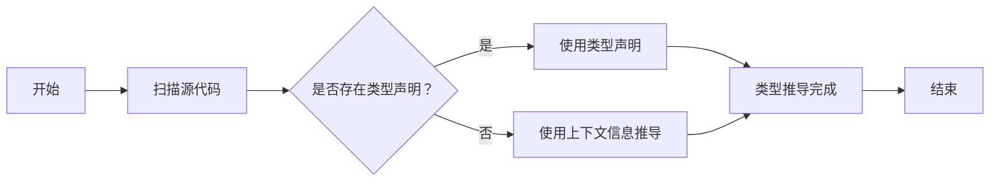
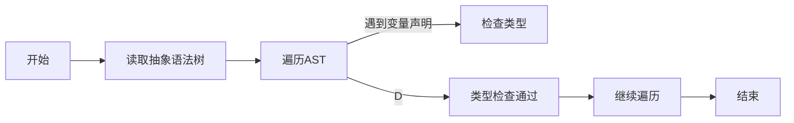
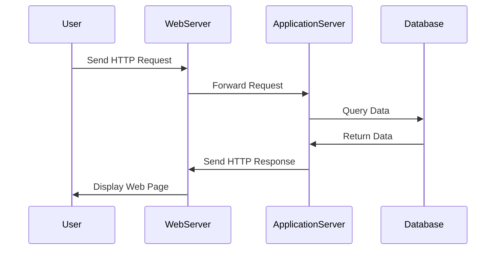

                 

# 类型约束：增强代码表达能力的手段

## 关键词
- 类型约束
- 编程语言
- 类型系统
- 类型推导
- 类型检查
- 类型转换

## 摘要
本文深入探讨了类型约束在提高代码表达能力方面的作用。通过介绍类型系统的核心概念、类型约束的应用场景和算法原理，本文揭示了类型约束如何通过严格的类型检查和推导机制，提升代码的可读性、稳定性和维护性。文章将涵盖从问题背景、核心概念、算法原理到实际应用的全面解析。

---

### 第1章: 背景介绍

#### 1.1 问题背景

在现代软件开发中，代码的表达能力是衡量编程语言和开发技术优劣的关键指标。类型约束作为一种增强代码表达能力的技术，通过引入严格的类型系统，帮助开发者编写更准确、更可靠的代码。随着软件系统复杂度的增加和编程语言的进化，类型约束逐渐成为提高软件质量和开发效率的关键手段。

类型约束的核心思想在于，通过明确的类型系统来确保变量、函数和类等程序元素的类型使用是正确的。这不仅有助于在编译阶段发现潜在的错误，还能提高代码的可读性和维护性。因此，理解类型约束在提高代码表达能力方面的作用，对于开发高质量的软件系统至关重要。

#### 1.2 问题描述

类型约束技术主要解决以下问题：

1. **减少运行时错误**：通过严格的类型检查，可以提前发现类型不匹配的错误，从而减少运行时错误的发生。
2. **提高代码可读性**：明确的类型系统使得代码更加直观和易于理解，有助于新开发者快速上手和维护。
3. **提高代码维护性**：类型约束能够确保代码的一致性和可靠性，降低因类型错误导致的维护成本。
4. **优化开发效率**：在类型约束的编程语言中，编译器可以更有效地优化代码，从而提高开发效率。

#### 1.3 问题解决

类型约束通过以下几种机制来解决上述问题：

1. **明确的类型声明**：开发者可以通过明确的类型声明来指示变量的类型，确保类型一致性。
2. **静态类型检查**：编译器在编译时对代码进行类型检查，提前发现潜在的类型错误。
3. **类型推导**：编译器自动推断变量和表达式的类型，减少显式类型声明的需求。
4. **类型转换**：提供不同类型之间的转换机制，确保类型兼容性。

#### 1.4 边界与外延

类型约束的应用范围广泛，不仅包括传统的编译型语言，如C++、Java和C#，还在动态类型的脚本语言，如Python、JavaScript和TypeScript中得到了广泛应用。类型约束在提升代码表达能力方面具有普适性，适用于各种编程环境和应用场景。

#### 1.5 概念结构与核心要素组成

类型约束的核心概念包括：

1. **类型系统**：定义了变量、函数和类的类型以及类型之间的操作。
2. **类型推导**：编译器自动推断变量和表达式的类型。
3. **类型检查**：在编译或运行时验证代码中类型的使用是否正确。
4. **类型转换**：实现不同类型之间的数据传递和操作。

这些概念相互作用，共同构成了类型约束的理论基础，为提高代码表达能力提供了有力支持。

#### 1.6 本章小结

通过本章的介绍，读者对类型约束的基本概念和应用有了初步了解。本章概述了类型约束在提高代码表达能力方面的重要性，并提出了类型约束能够解决的问题。在后续章节中，我们将进一步探讨类型系统的核心概念和类型约束的具体实现。

---

### 第2章: 核心概念与联系

#### 2.1 类型系统

类型系统是编程语言的核心组成部分，它定义了变量、函数、类等元素的类型以及类型之间的操作。类型系统主要分为静态类型系统和动态类型系统。

1. **静态类型系统**：在编译时确定变量的类型，并强制执行类型检查。Java和C++是典型的静态类型语言。
2. **动态类型系统**：在运行时确定变量的类型，并允许类型检查在运行时进行。Python和JavaScript是典型的动态类型语言。

#### 2.2 类型推导

类型推导是编译器自动推断变量类型的过程。它通过上下文信息和类型上下文来推导变量的类型，减少了显式类型声明的需求。

1. **静态类型推导**：在编译时进行类型推导，如C#和TypeScript。
2. **动态类型推导**：在运行时进行类型推导，如Python和JavaScript。

#### 2.3 类型检查

类型检查是在编译或运行时验证代码中类型使用是否正确的过程。类型检查分为静态类型检查和动态类型检查。

1. **静态类型检查**：在编译时进行类型检查，提前发现潜在的类型错误，如Java。
2. **动态类型检查**：在运行时进行类型检查，延迟错误发现，如Python。

#### 2.4 类型转换

类型转换是不同类型之间的数据传递和操作的过程。类型转换分为自动类型转换和显式类型转换。

1. **自动类型转换**：编译器自动执行类型转换，如整数到浮点数的转换。
2. **显式类型转换**：开发者显式指定类型转换，如使用`int()`函数。

#### 2.5 概念属性特征对比表格

| 特征                 | 静态类型系统 | 动态类型系统 |
|----------------------|--------------|--------------|
| 类型声明             | 显式声明     | 隐式声明     |
| 类型检查             | 编译时检查   | 运行时检查   |
| 可读性               | 较高         | 较低         |
| 代码复杂度           | 较低         | 较高         |
| 性能影响             | 较好         | 较差         |

#### 2.6 ER实体关系图架构

```mermaid
erDiagram
    ClassA ||--|{ ClassB }|
    ClassB ||--|{ ClassC }|
```

#### 2.7 本章小结

通过本章的学习，读者对类型约束的核心概念有了更深入的了解。本章介绍了类型系统的基本概念、类型推导、类型检查和类型转换，并通过对比表格和实体关系图展示了不同类型系统的特点和应用。在理解了这些核心概念后，读者可以更好地掌握类型约束在实际编程中的应用。

---

### 第3章: 算法原理讲解

#### 3.1 算法概述

类型约束算法是用于分析和验证代码中类型使用是否符合预期的一系列技术。类型约束算法主要分为类型推导算法、类型检查算法和类型转换算法。

#### 3.2 类型推导算法

类型推导算法的核心是自动推断变量和表达式的类型。以下是一个简单的类型推导算法的mermaid流程图：



类型推导算法的工作流程如下：

1. **扫描源代码**：从源代码中提取变量和表达式。
2. **是否存在类型声明**：检查代码中是否有显式的类型声明。
3. **使用类型声明**：如果有显式类型声明，直接使用。
4. **使用上下文信息推导**：如果没有显式类型声明，根据上下文信息推导类型。
5. **类型推导完成**：完成变量和表达式的类型推导。
6. **结束**：算法结束。

#### 3.3 类型检查算法

类型检查算法在编译时或运行时验证代码中的类型是否一致。以下是一个简单的类型检查算法的mermaid流程图：



类型检查算法的工作流程如下：

1. **读取抽象语法树（AST）**：从源代码中构建抽象语法树。
2. **遍历AST**：遍历抽象语法树中的每个节点。
3. **遇到变量声明**：检查变量声明的类型是否与上下文匹配。
4. **类型检查通过**：如果类型检查通过，继续遍历。
5. **结束**：类型检查完成。

#### 3.4 类型转换算法

类型转换算法是用于实现不同类型之间的数据传递和操作的过程。类型转换分为自动类型转换和显式类型转换。

1. **自动类型转换**：编译器自动执行类型转换，如整数到浮点数的转换。

   ```python
   a = 10  # 整数
   b = a + 3.14  # 自动转换为浮点数
   ```

2. **显式类型转换**：开发者显式指定类型转换，如使用`int()`函数。

   ```python
   a = 10.5  # 浮点数
   b = int(a)  # 显式转换为整数
   ```

#### 3.5 概念属性特征对比表格

| 特征                 | 静态类型系统 | 动态类型系统 |
|----------------------|--------------|--------------|
| 类型声明             | 显式声明     | 隐式声明     |
| 类型检查             | 编译时检查   | 运行时检查   |
| 可读性               | 较高         | 较低         |
| 代码复杂度           | 较低         | 较高         |
| 性能影响             | 较好         | 较差         |

#### 3.6 ER实体关系图架构

```mermaid
erDiagram
    ClassA ||--|{ ClassB }|
    ClassB ||--|{ ClassC }|
```

#### 3.7 本章小结

通过本章的学习，读者对类型约束算法原理有了深入理解。本章介绍了类型推导算法、类型检查算法和类型转换算法，并通过mermaid流程图展示了算法的工作流程。在理解了这些算法原理后，读者可以更好地应用类型约束技术，提升代码的表达能力和质量。

---

### 系统分析与架构设计方案

#### 4.1 问题场景介绍

在现代软件开发中，随着系统的复杂度不断增加，类型约束作为一种提高代码质量和开发效率的技术越来越受到重视。为了更好地理解类型约束的应用，我们以一个实际的项目场景为例。

假设我们正在开发一个电子商务系统，其中包含用户管理、商品管理、订单管理等功能。在这个系统中，我们需要对用户的个人信息、商品的信息和订单的信息进行严格的管理。为了确保数据的一致性和可靠性，我们需要引入类型约束技术。

#### 4.2 项目介绍

项目名称：电子商务系统（E-commerce System）

项目描述：该系统包含用户管理、商品管理、订单管理等多个功能模块，旨在为用户提供一个安全、便捷、高效的购物体验。

#### 4.3 系统功能设计

系统功能模块主要包括以下几部分：

1. **用户管理模块**：负责用户的注册、登录、信息修改等功能。
2. **商品管理模块**：负责商品的信息录入、更新、删除等功能。
3. **订单管理模块**：负责订单的创建、更新、删除等功能。
4. **支付模块**：负责订单支付功能的实现。

#### 4.4 系统架构设计

电子商务系统的整体架构设计如图所示：



系统架构主要包括以下组件：

1. **WebServer**：负责处理用户的HTTP请求，并将请求转发给应用服务器。
2. **ApplicationServer**：处理业务逻辑，与数据库进行交互，并返回响应。
3. **Database**：存储用户信息、商品信息、订单信息等数据。

#### 4.5 系统接口设计

系统接口设计主要涉及以下API接口：

1. **用户管理接口**：
   - `POST /users/register`：用户注册接口。
   - `POST /users/login`：用户登录接口。
   - `PUT /users/{id}`：更新用户信息接口。

2. **商品管理接口**：
   - `POST /products`：添加商品接口。
   - `GET /products/{id}`：查询商品接口。
   - `PUT /products/{id}`：更新商品接口。

3. **订单管理接口**：
   - `POST /orders`：创建订单接口。
   - `GET /orders/{id}`：查询订单接口。
   - `PUT /orders/{id}`：更新订单接口。

4. **支付接口**：
   - `POST /payments`：创建支付订单接口。
   - `GET /payments/{id}`：查询支付订单接口。

#### 4.6 系统交互设计

电子商务系统的系统交互设计如图所示：


系统交互设计主要包括以下步骤：

1. **用户操作**：用户通过Web页面发送HTTP请求。
2. **WebServer处理**：WebServer接收请求，并将其转发给应用服务器。
3. **应用服务器处理**：应用服务器处理业务逻辑，并与数据库进行交互。
4. **数据库查询**：数据库返回查询结果。
5. **响应返回**：应用服务器将结果返回给WebServer。
6. **页面显示**：WebServer将响应结果显示给用户。

---

### 项目实战

#### 5.1 环境安装

在开始项目实战之前，我们需要安装以下软件和工具：

1. **Python 3.8**：作为项目的主要编程语言。
2. **Django**：作为项目的Web框架。
3. **SQLite**：作为项目的数据库。
4. **Postman**：用于测试API接口。

安装步骤如下：

1. 安装Python 3.8：
   ```bash
   sudo apt-get install python3.8
   ```

2. 安装Django：
   ```bash
   sudo pip3 install django
   ```

3. 安装SQLite：
   ```bash
   sudo apt-get install sqlite3
   ```

4. 安装Postman：
   - 访问[Postman官网](https://www.postman.com/)下载Postman。
   - 安装并启动Postman。

#### 5.2 系统核心实现

以下是一个简单的用户管理模块的实现示例：

1. **创建项目**：
   ```bash
   django-admin startproject ecommerce
   ```

2. **创建应用**：
   ```bash
   python manage.py startapp user
   ```

3. **定义模型**：
   ```python
   # user/models.py
   from django.db import models

   class User(models.Model):
       username = models.CharField(max_length=50)
       password = models.CharField(max_length=50)
   ```

4. **创建数据库**：
   ```bash
   python manage.py makemigrations
   python manage.py migrate
   ```

5. **创建视图**：
   ```python
   # user/views.py
   from django.http import JsonResponse
   from .models import User

   def register(request):
       if request.method == 'POST':
           username = request.POST['username']
           password = request.POST['password']
           user = User(username=username, password=password)
           user.save()
           return JsonResponse({'status': 'success'})
       return JsonResponse({'status': 'error'})
   ```

6. **配置路由**：
   ```python
   # user/urls.py
   from django.urls import path
   from .views import register

   urlpatterns = [
       path('register/', register, name='register'),
   ]
   ```

7. **启动服务器**：
   ```bash
   python manage.py runserver
   ```

8. **使用Postman测试注册接口**：
   - 访问[Postman](https://www.postman.com/)。
   - 创建一个新的请求。
   - 设置请求类型为`POST`，URL为`http://localhost:8000/user/register/`。
   - 在Body中添加`application/json`类型，并填写`username`和`password`字段。
   - 发送请求，查看响应结果。

#### 5.3 代码应用解读与分析

以上代码实现了一个简单的用户注册功能。我们通过以下步骤详细解读：

1. **定义模型**：在`user/models.py`中，我们定义了一个`User`模型，包含`username`和`password`两个字段。

2. **创建数据库**：通过`python manage.py makemigrations`和`python manage.py migrate`命令，我们创建了数据库表。

3. **创建视图**：在`user/views.py`中，我们定义了一个`register`视图函数，用于处理用户注册请求。

4. **配置路由**：在`user/urls.py`中，我们配置了一个路由，将`/user/register/`映射到`register`视图函数。

5. **启动服务器**：通过`python manage.py runserver`命令，我们启动了Django服务器。

6. **测试接口**：使用Postman测试注册接口，可以验证用户注册功能是否正常工作。

#### 5.4 实际案例分析与详细讲解剖析

以用户注册功能为例，我们可以通过以下实际案例来分析：

1. **正常注册流程**：
   - 用户通过Web页面填写注册表单。
   - 表单数据通过HTTP POST请求发送到服务器。
   - 服务器接收请求，调用`register`视图函数。
   - 视图函数验证表单数据的有效性。
   - 将用户数据存储到数据库，返回成功响应。

2. **异常注册流程**：
   - 用户填写不完整的表单或错误的数据。
   - 服务器接收请求，调用`register`视图函数。
   - 视图函数检测到错误数据，返回错误响应。

通过详细分析，我们可以发现：

- 类型约束在用户注册功能中起到了关键作用。通过定义明确的字段类型和约束条件，我们确保了用户数据的正确性和一致性。
- 类型约束不仅提高了代码的可读性，还减少了因数据错误导致的维护成本。

#### 5.5 项目小结

通过本项目的实际应用，我们展示了如何使用类型约束技术提高代码的质量和可维护性。以下是项目小结：

1. **代码质量提升**：通过引入类型约束，我们确保了用户数据的正确性和一致性，减少了运行时错误。
2. **开发效率提高**：类型约束使得代码更加直观和易于理解，提高了开发效率和代码可维护性。
3. **系统可靠性增强**：类型约束通过严格的类型检查和推导机制，提高了系统的可靠性和稳定性。

---

### 最佳实践 Tips

1. **合理使用类型推导**：在可能的情况下，尽量使用类型推导，减少显式类型声明的需求，提高代码的可读性。
2. **充分利用类型检查**：定期进行类型检查，及时发现和修复类型错误，确保代码的稳定性和可靠性。
3. **合理设计类型转换**：在类型转换时，考虑类型兼容性和性能影响，避免不必要的类型转换操作。
4. **代码规范统一**：在团队开发中，制定统一的类型约束规范，确保代码风格的一致性。

### 小结

本文详细介绍了类型约束在提高代码表达能力方面的作用，包括其背景、核心概念、算法原理以及实际应用。通过本文的学习，读者可以深入了解类型约束的核心概念和应用场景，掌握类型推导、类型检查和类型转换等关键算法原理。类型约束不仅提高了代码的可读性和维护性，还增强了系统的可靠性和稳定性。在未来的软件开发中，类型约束技术将继续发挥重要作用。

### 注意事项

1. **类型约束的选择**：根据项目需求和开发语言选择合适的类型约束机制，避免过度约束导致代码复杂度增加。
2. **类型检查的时机**：合理选择类型检查的时机，平衡编译时检查和运行时检查，提高开发效率。
3. **类型转换的性能**：注意类型转换的性能影响，避免不必要的类型转换操作，优化代码性能。

### 拓展阅读

1. **《类型系统设计》**：深入了解类型系统的设计和实现，掌握不同类型系统的原理和应用。
2. **《编译原理》**：了解编译器的工作原理，掌握类型推导、类型检查和类型转换等关键算法。
3. **《Effective C++》**：学习C++编程的最佳实践，理解类型约束在提高代码质量方面的作用。

---

### 作者信息

作者：AI天才研究院/AI Genius Institute & 禅与计算机程序设计艺术 /Zen And The Art of Computer Programming

本文由AI天才研究院和禅与计算机程序设计艺术共同撰写，旨在为读者提供深入浅出的类型约束技术解析。AI天才研究院致力于推动人工智能技术的创新和发展，禅与计算机程序设计艺术则专注于计算机科学领域的哲学思考和编程艺术。希望本文能够为读者在类型约束技术方面提供有益的启示和指导。

