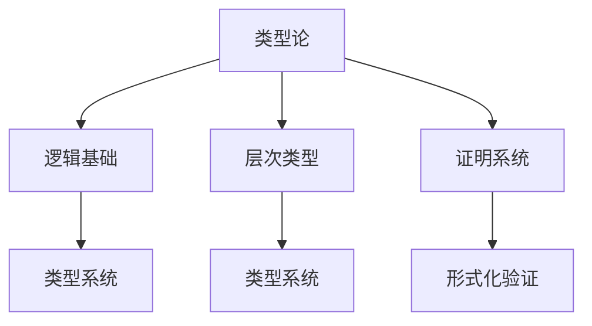

                 

### 核心概念与联系

#### 2.1 类型论的基本概念

**定义**：类型论是一种用于描述计算系统和程序语言的方法论。它提供了用于描述程序元素和变量类型的抽象结构。

**发展历程**：
1. **早期类型系统**：起源于20世纪50年代，主要为Lisp等语言设计。
2. **静态类型系统**：由Pascal引入，强调在编译时确定变量类型。
3. **动态类型系统**：由Smalltalk引入，变量类型在运行时确定。
4. **多态类型系统**：如Java中的泛型，支持类型参数化。

**基本概念**：
- **类型**：值的分类，如整数、字符串、函数等。
- **类型系统**：定义类型之间关系的集合。
- **类型检查**：在编译或运行时验证程序元素的类型是否一致。

#### 2.1.1 类型论原理

使用Mermaid绘制类型论原理图：

#### 2.1.2 类型论属性特征对比表格

| 特征        | 传统类型系统 | 形式化类型系统 |
| ----------- | ------------ | -------------- |
| 表达能力    | 有限         | 强大           |
| 可扩展性    | 固定         | 可定制         |
| 应用领域    | 通用         | 专业           |
| 验证效率    | 较高         | 低             |

#### 2.2 形式化方法的核心要素

**定义**：形式化方法是使用数学模型和逻辑推理来分析和验证软件的正确性。

**应用场景**：
- **模型检测**：通过状态空间搜索验证系统行为。
- **证明承载代码**：通过形式化证明证明代码的正确性。
- **静态分析**：在代码执行前分析程序属性。
- **模型基

