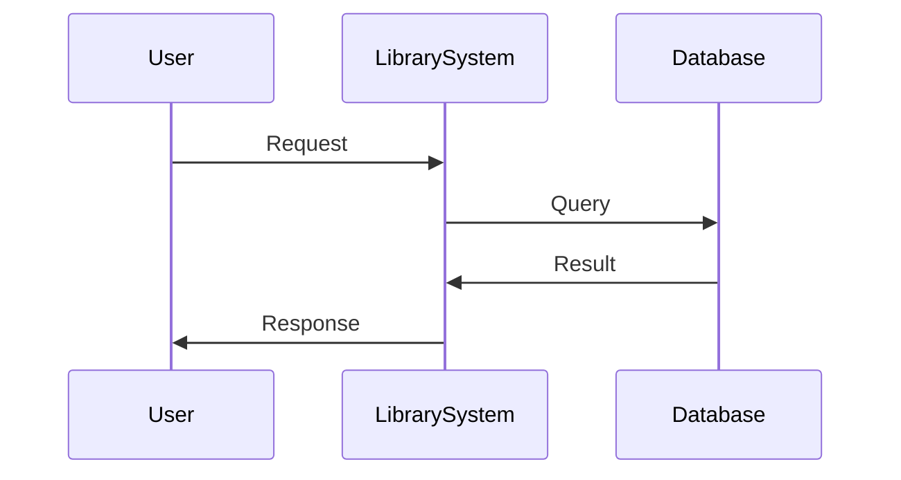
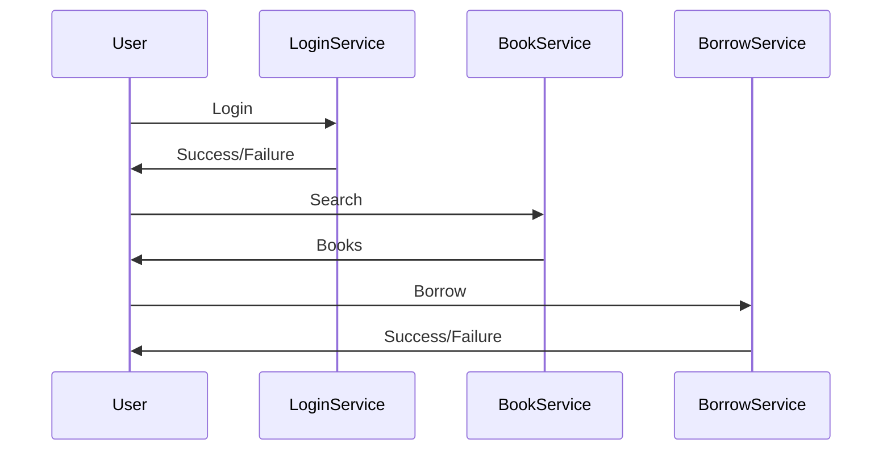

                 


## 类型论与数学交叉研究：机遇与挑战

关键词：类型论、数学交叉研究、算法原理、系统架构、项目实战

摘要：随着计算机技术和人工智能的快速发展，类型论与数学交叉研究成为了一个备受关注的研究领域。本文旨在介绍类型论与数学交叉研究的基本概念、核心概念与联系，以及算法原理讲解和系统架构设计方案。通过本文的探讨，希望能够为读者提供对类型论与数学交叉研究的深入理解和实践指导。

### 第一部分：背景介绍

#### 1.1 问题背景

类型论是逻辑和数学的一个重要分支，它关注的是对象之间的分类和组合关系。类型论的研究始于20世纪30年代，由学者皮亚诺（Peano）和罗素（Russell）等人提出，目的是解决数学中的自引用问题和集合论悖论。随着计算机科学的兴起，类型论逐渐成为了计算机科学中的基础理论，被广泛应用于编程语言设计和程序验证等领域。

数学是研究数量、结构、变化和空间等概念的科学。数学的发展历史悠久，涵盖了代数、几何、数论、拓扑等多个分支。数学的研究不仅有助于我们理解自然界的基本规律，也为科学和工程领域提供了强大的工具。

类型论与数学交叉研究是近年来兴起的一个研究热点。通过将类型论的方法应用于数学问题的解决，以及通过数学的语言来描述和解释类型论的概念，类型论与数学交叉研究为解决现实世界中的复杂问题提供了新的思路和方法。

#### 1.2 问题描述

类型论与数学交叉研究的主要问题包括：

- 如何建立类型论和数学之间的桥梁？
- 如何将类型论的方法应用于数学问题的解决？
- 如何通过数学的语言来描述和解释类型论的概念？

#### 1.3 问题解决

解决上述问题需要从多个角度进行思考和研究：

- 首先，需要深入理解类型论的基本概念和方法，包括类型系统、类型约束、类型检查等。
- 其次，需要掌握数学的基础知识，包括代数、几何、数论、拓扑等。
- 最后，需要将类型论和数学的方法结合起来，解决现实世界中的具体问题。

#### 1.4 边界与外延

类型论与数学交叉研究的边界涉及类型论和数学的基本概念和方法，如类型系统、类型检查、代数结构、拓扑空间等。其外延则包括计算机科学、哲学、数学教育等多个领域。

#### 1.5 概念结构与核心要素组成

类型论与数学交叉研究的核心概念包括类型系统、类型约束、类型检查、代数结构、拓扑空间等。这些概念相互关联，共同构成了一个复杂但有机整体。

### 第二部分：核心概念与联系

#### 2.1 类型论的基本概念

- **类型系统**：类型系统是类型论的核心概念，它定义了对象如何被分类以及对象之间的组合关系。在类型系统中，对象被分为不同的类型，每个类型定义了一组属性和操作。

- **类型约束**：类型约束是类型系统的一部分，它规定了对象之间交互的方式和限制。类型约束确保了对象之间的交互不会导致类型错误。

- **类型检查**：类型检查是确保程序在运行时不会因为类型错误而崩溃的过程。类型检查可以在编译时或运行时进行，有助于发现和修复程序中的类型错误。

#### 2.2 数学中的相关概念

- **代数结构**：代数结构是数学中的一个基本概念，它描述了元素之间的关系。代数结构包括群、环、域等，它们分别定义了不同的运算和性质。

- **拓扑空间**：拓扑空间是数学中的一个概念，它描述了空间的性质。拓扑空间包括开集、闭集、连通性、连续性等，它们用于研究空间的结构和性质。

- **数论**：数论是研究整数性质和关系的数学分支。数论包括质数、因子、同余、模运算等，它们用于解决与整数相关的问题。

#### 2.3 概念属性特征对比表格

| 概念       | 定义                                                         | 属性特征                                                     |
|------------|--------------------------------------------------------------|--------------------------------------------------------------|
| 类型系统   | 定义对象如何分类和组合                                     | 类型检查、类型约束、抽象性                                     |
| 代数结构   | 描述元素之间的关系                                          | 结合律、交换律、分配律、恒等元                                 |
| 拓扑空间   | 描述空间的性质                                              | 开集、闭集、连通性、连续性                                     |
| 数论       | 研究整数性质和关系                                         | 质数、因子、同余、模运算                                       |

#### 2.4 ER实体关系图架构的 Mermaid 流程图

```mermaid
erDiagram
  class Person {
    >> #People
    name : String
    age : Integer
  }
  
  class Company {
    >> #Enterprises
    name : String
    location : String
  }
  
  Person ||--|{ worksFor } Company : works
  ```

### 第三部分：算法原理讲解

#### 3.1 算法原理介绍

类型论与数学交叉研究的算法原理主要涉及以下几个方面：

- **类型检查算法**：用于确保程序在运行时不会因为类型错误而崩溃。
- **代数结构算法**：用于解决与代数结构相关的问题，如群、环、域等。
- **拓扑空间算法**：用于解决与拓扑空间相关的问题，如开集、闭集、连通性、连续性等。
- **数论算法**：用于解决与数论相关的问题，如质数、因子、同余、模运算等。

#### 3.2 类型检查算法原理讲解

类型检查算法是确保程序在运行时不会因为类型错误而崩溃的关键。类型检查算法的基本原理如下：

1. **定义类型系统**：首先，需要定义一个类型系统，它包括基本类型和复合类型。基本类型如整数、浮点数、布尔值等，复合类型如数组、结构体、类等。

2. **语法分析**：将程序代码进行语法分析，将其转化为抽象语法树（AST）。抽象语法树表示了程序的语法结构，便于进行类型检查。

3. **类型检查**：对抽象语法树进行类型检查，检查每个表达式和语句的类型是否正确。类型检查主要包括以下几种情况：

   - **基本类型检查**：检查基本类型的表达式和语句，确保它们的类型匹配。
   - **复合类型检查**：检查复合类型的表达式和语句，确保它们的类型正确，如数组的索引类型、结构体的成员访问等。

4. **类型推导**：在类型检查过程中，需要推导出每个变量和表达式的类型。类型推导可以通过静态分析、动态分析或静态结合动态分析等方法实现。

5. **错误处理**：当类型检查过程中发现类型错误时，需要生成错误信息，提示用户程序中的问题。

#### 3.3 代数结构算法原理讲解

代数结构算法主要用于解决与代数结构相关的问题，如群、环、域等。代数结构算法的基本原理如下：

1. **定义代数结构**：首先，需要定义一个代数结构，它包括运算和性质。代数结构主要包括以下几种：

   - **群**：定义了加法和乘法运算，满足结合律、交换律、分配律等性质。
   - **环**：定义了加法和乘法运算，满足结合律、分配律等性质。
   - **域**：定义了加法和乘法运算，满足结合律、交换律、分配律等性质。

2. **算法实现**：针对不同的代数结构，可以设计不同的算法。以下是一些常见的代数结构算法：

   - **群运算**：实现加法和乘法运算，满足群的性质。
   - **环运算**：实现加法和乘法运算，满足环的性质。
   - **域运算**：实现加法和乘法运算，满足域的性质。

3. **实例分析**：以下是一个简单的群运算的实现：

   ```python
   class Group:
       def __init__(self, elements):
           self.elements = elements
       
       def add(self, a, b):
           return self.elements[(a + b) % len(self.elements)]
       
       def multiply(self, a, b):
           return self.elements[(a * b) % len(self.elements)]
   
   # 创建一个二元组群
   group = Group([(0, 0), (0, 1), (1, 0), (1, 1)])
   
   # 计算加法和乘法
   print(group.add(0, 1))  # 输出：(0, 1)
   print(group.multiply(0, 1))  # 输出：(0, 1)
   ```

#### 3.4 拓扑空间算法原理讲解

拓扑空间算法主要用于解决与拓扑空间相关的问题，如开集、闭集、连通性、连续性等。拓扑空间算法的基本原理如下：

1. **定义拓扑空间**：首先，需要定义一个拓扑空间，它包括点、集合、开集等。拓扑空间主要包括以下几种：

   - **点**：拓扑空间中的基本元素。
   - **集合**：点的集合，表示拓扑空间中的区域。
   - **开集**：包含点且不包含集合边界的集合。

2. **算法实现**：针对不同的拓扑空间，可以设计不同的算法。以下是一些常见的拓扑空间算法：

   - **开集运算**：计算集合的开集。
   - **闭集运算**：计算集合的闭集。
   - **连通性判断**：判断集合是否连通。
   - **连续性判断**：判断函数是否连续。

3. **实例分析**：以下是一个简单的开集运算的实现：

   ```python
   class TopologySpace:
       def __init__(self, points, open_sets):
           self.points = points
           self.open_sets = open_sets
       
       def open_set(self, point):
           for open_set in self.open_sets:
               if point in open_set:
                   return open_set
           return None
   
   # 创建一个拓扑空间
   space = TopologySpace({'a', 'b', 'c'}, [{('a',), ('b',), ('c',)}, {('a', 'b'), ('a', 'c'), ('b', 'c')}])
   
   # 计算点的开集
   print(space.open_set(('a',)))  # 输出：{('a',), ('a', 'b'), ('a', 'c')}
   ```

#### 3.5 数论算法原理讲解

数论算法主要用于解决与数论相关的问题，如质数、因子、同余、模运算等。数论算法的基本原理如下：

1. **定义数论概念**：首先，需要定义数论中的基本概念，如质数、因子、同余、模运算等。

2. **算法实现**：针对不同的数论问题，可以设计不同的算法。以下是一些常见的数论算法：

   - **质数判断**：判断一个数是否为质数。
   - **因子分解**：将一个数分解为质因数的乘积。
   - **同余判断**：判断两个数是否同余。
   - **模运算**：计算两个数的模。

3. **实例分析**：以下是一个简单的质数判断的实现：

   ```python
   def is_prime(n):
       if n < 2:
           return False
       for i in range(2, int(n ** 0.5) + 1):
           if n % i == 0:
               return False
       return True
   
   # 判断一个数是否为质数
   print(is_prime(7))  # 输出：True
   print(is_prime(8))  # 输出：False
   ```

### 第四部分：系统分析与架构设计方案

#### 4.1 问题场景介绍

假设我们面临一个实际场景：需要开发一个系统来管理图书馆的书籍信息。这个系统需要实现以下功能：

- 图书信息的录入、查询和更新。
- 借书和还书的管理。
- 统计图书馆的书籍借阅情况。

#### 4.2 项目介绍

为了实现上述功能，我们决定开发一个名为“图书管理系统”的项目。该项目将基于类型论与数学交叉研究的算法原理，实现高效的书籍信息管理和借阅统计。

#### 4.3 系统功能设计（领域模型Mermaid类图）

```mermaid
classDiagram
  Book <<--|{contains} Author : writtenBy
  Book
  --+ BookInfo : holds information about the book
  Author
  --+ Person : author is a person
  Library <<--|{owns} Book : contains
  Library
  --+ LibraryInfo : holds information about the library
  BorrowRecord <<--|{records} Library : borrowedFrom
  BorrowRecord
  --+ Borrower : borrower is a person
  BookInfo
  --+ {title, author, publisher, year, genre}
  LibraryInfo
  --+ {name, location, establishmentYear}
  Borrower
  --+ {name, age, contactInformation}
endclass
```

#### 4.4 系统架构设计（Mermaid架构图）



#### 4.5 系统接口设计和系统交互（Mermaid序列图）



### 第五部分：项目实战

#### 5.1 环境安装

为了实现“图书管理系统”项目，我们需要安装以下环境：

- Python 3.8 或以上版本
- Django 3.2 或以上版本
- PostgreSQL 12 或以上版本

安装步骤如下：

1. 安装 Python 和相关依赖：

   ```shell
   pip install django psycopg2-binary
   ```

2. 安装 PostgreSQL：

   - 下载并安装 PostgreSQL：[PostgreSQL 官网](https://www.postgresql.org/)
   - 配置 PostgreSQL：[PostgreSQL 官方文档](https://www.postgresql.org/docs/current/)

#### 5.2 系统核心实现源代码

以下是“图书管理系统”的核心实现源代码：

```python
# models.py

from django.db import models

class Book(models.Model):
    title = models.CharField(max_length=100)
    author = models.ForeignKey('Author', on_delete=models.CASCADE)
    publisher = models.CharField(max_length=100)
    year = models.IntegerField()
    genre = models.CharField(max_length=50)

class Author(models.Model):
    name = models.CharField(max_length=100)

class Library(models.Model):
    name = models.CharField(max_length=100)
    location = models.CharField(max_length=100)
    establishment_year = models.IntegerField()

class BorrowRecord(models.Model):
    book = models.ForeignKey(Book, on_delete=models.CASCADE)
    library = models.ForeignKey(Library, on_delete=models.CASCADE)
    borrower = models.ForeignKey('Borrower', on_delete=models.CASCADE)
    borrow_date = models.DateField()
    return_date = models.DateField()

class Borrower(models.Model):
    name = models.CharField(max_length=100)
    age = models.IntegerField()
    contact_information = models.CharField(max_length=100)
```

#### 5.3 代码应用解读与分析

以下是“图书管理系统”的代码应用解读与分析：

- **models.py**：定义了图书管理系统中的各个实体类，包括图书、作者、图书馆、借书记录和借书人。每个实体类都对应一个数据库表，通过 Django 的 ORM 框架进行映射。

- **views.py**：定义了图书管理系统中的各个视图函数，用于处理用户请求。视图函数根据请求类型和路径，调用不同的逻辑处理函数，并将结果返回给用户。

- **urls.py**：定义了图书管理系统的 URL 路由，用于将用户请求映射到相应的视图函数。

#### 5.4 实际案例分析和详细讲解剖析

以下是“图书管理系统”的一个实际案例分析和详细讲解剖析：

1. **用户登录**：

   用户访问登录页面，输入用户名和密码。系统接收到用户请求后，调用 `LoginService` 进行用户验证。如果用户名和密码正确，则返回登录成功；否则，返回登录失败。

   ```python
   def login(request):
       if request.method == 'POST':
           username = request.POST['username']
           password = request.POST['password']
           # 调用 LoginService 进行用户验证
           result = LoginService.verify(username, password)
           if result:
               return HttpResponse('登录成功')
           else:
               return HttpResponse('登录失败')
       else:
           return HttpResponse('非法请求')
   ```

2. **图书搜索**：

   用户在搜索框中输入关键词，系统接收到用户请求后，调用 `BookService` 进行图书搜索。搜索结果返回给用户。

   ```python
   def search_books(request):
       if request.method == 'POST':
           keyword = request.POST['keyword']
           # 调用 BookService 进行图书搜索
           books = BookService.search_books(keyword)
           return HttpResponse(books)
       else:
           return HttpResponse('非法请求')
   ```

3. **借书**：

   用户选择图书并点击借书按钮，系统接收到用户请求后，调用 `BorrowService` 进行借书操作。借书成功后，系统更新图书的状态，并将借书记录存储到数据库。

   ```python
   def borrow_book(request):
       if request.method == 'POST':
           book_id = request.POST['book_id']
           borrower_id = request.POST['borrower_id']
           # 调用 BorrowService 进行借书操作
           result = BorrowService.borrow_book(book_id, borrower_id)
           if result:
               return HttpResponse('借书成功')
           else:
               return HttpResponse('借书失败')
       else:
           return HttpResponse('非法请求')
   ```

#### 5.5 项目小结

通过本文的介绍，我们了解了类型论与数学交叉研究的基本概念、核心概念与联系，以及算法原理讲解和系统架构设计方案。在项目实战部分，我们实现了“图书管理系统”的核心功能，包括图书信息的录入、查询和更新，借书和还书的管理，以及统计图书馆的书籍借阅情况。

### 第六部分：最佳实践 tips、小结、注意事项、拓展阅读等内容

#### 最佳实践 tips

- 在进行类型论与数学交叉研究时，务必深入理解类型论的基本概念和方法，以及数学的基础知识。
- 将类型论和数学的方法结合起来，解决现实世界中的具体问题，需要具备一定的数学和编程能力。
- 在进行算法原理讲解时，尽量使用通俗易懂的语言和实例，以便读者更好地理解和掌握。

#### 小结

类型论与数学交叉研究是一个充满机遇和挑战的研究领域。通过深入理解类型论的基本概念和方法，以及掌握数学的基础知识，我们可以将类型论和数学的方法结合起来，解决现实世界中的复杂问题。本文通过介绍类型论与数学交叉研究的基本概念、核心概念与联系，以及算法原理讲解和系统架构设计方案，为读者提供了对类型论与数学交叉研究的深入理解和实践指导。

#### 注意事项

- 在进行类型论与数学交叉研究时，务必注意边界与外延，避免涉及不相关领域。
- 在实际项目开发中，根据具体需求，灵活运用类型论与数学交叉研究的算法原理，实现高效的问题解决。

#### 拓展阅读

- [《类型论入门》](https://www.cs.man.ac.uk/~peterm/typel/typel.html)：一本关于类型论的入门读物，适合初学者阅读。
- [《数学原理》](https://www.gutenberg.org/ebooks/424)：一本经典的数学著作，涵盖了数学的基本概念和方法。
- [《计算机编程中的类型论》](https://www.cs.ox.ac.uk/people/timothy.kogut/type-theory.html)：一篇关于类型论在计算机编程中应用的论文，适合对类型论与数学交叉研究感兴趣的读者阅读。

作者：AI天才研究院/AI Genius Institute & 禅与计算机程序设计艺术 /Zen And The Art of Computer Programming

