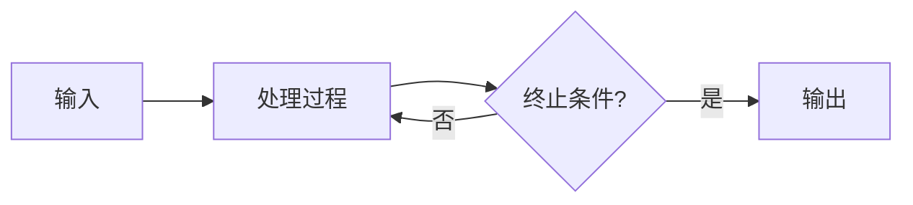
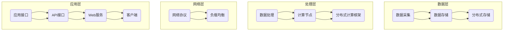
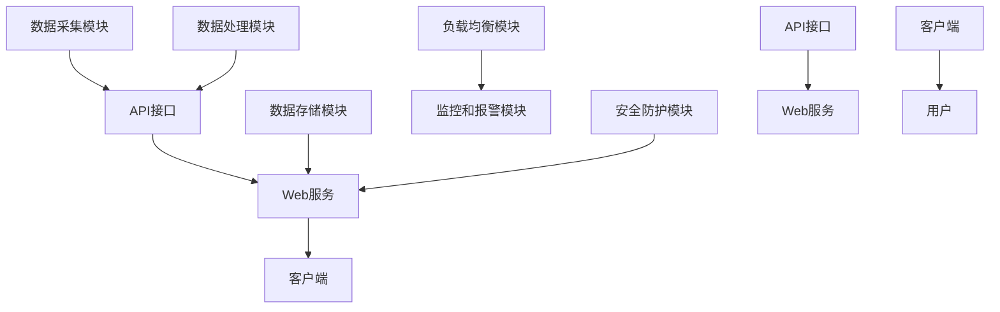
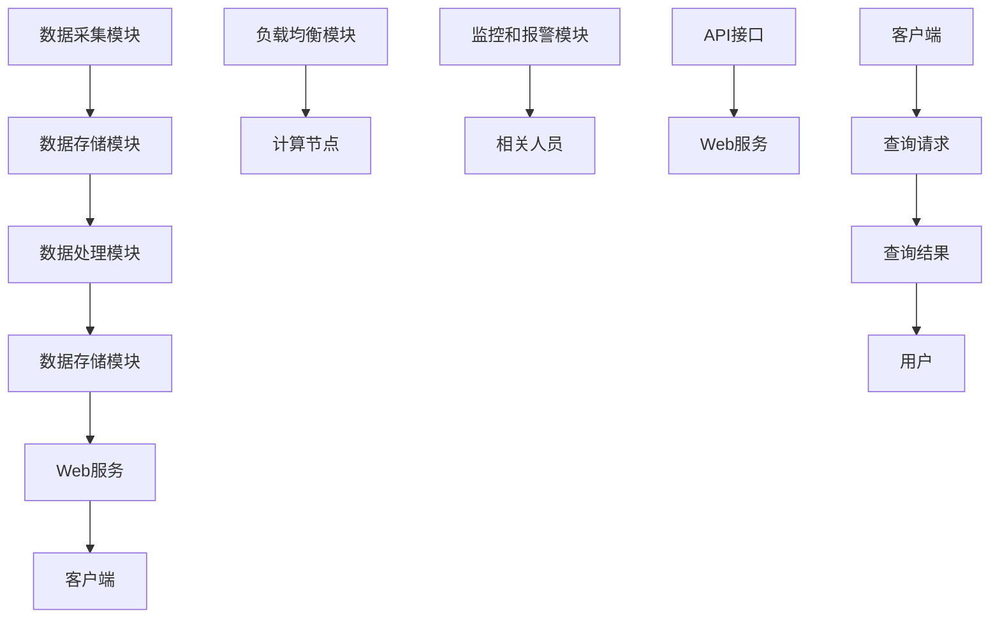

                 

## 类型论与数学实践的脱节：理论与应用的鸿沟

关键词：类型论、数学实践、脱节现象、数学理论、应用问题

摘要：本文深入探讨了类型论与数学实践之间的脱节现象，分析了其产生的原因和影响，并提出了可能的解决策略。通过对类型论和数学实践的核心概念及其关系的详细阐述，本文揭示了两者在理论和方法层面的不一致，以及在实际应用中面临的挑战。文章旨在为研究人员和从业者提供一个全面的视角，以促进类型论在数学实践中的有效应用。

### 第一部分: 背景介绍

#### 1. 引言

类型论（Type Theory）是数学和逻辑学中的一个重要分支，主要研究类型的概念、性质及其相互关系。类型论最早由皮尔士（Charles Sanders Peirce）和弗雷格（ Gottlob Frege）等逻辑学家提出，并逐渐发展成为现代形式化数学的基础。类型论的核心思想是将数学对象分为不同的类型，以防止逻辑错误和错误推导。随着计算机科学的兴起，类型论在编程语言设计和验证中也发挥了重要作用。

数学实践（Mathematical Practice）是指数学理论在解决实际问题中的应用过程。数学实践涵盖了从数学理论到实际问题的转化，包括理论计算、实验验证和实际应用。数学实践不仅包括纯数学问题，还涉及到物理、工程、经济、生物等多个领域。数学实践是数学理论得以验证和发展的关键，也是数学学科发展的动力源泉。

尽管类型论和数学实践在数学领域中都占据着重要的地位，但它们之间的关系却并非总是和谐。事实上，类型论与数学实践之间存在显著的脱节现象，这种脱节导致了许多理论和实践问题难以有效解决。本文旨在探讨这一脱节现象，分析其原因和影响，并提出可能的解决方案。

#### 2. 问题背景

类型论的发展可以追溯到20世纪初，随着逻辑学和数学的发展，类型论逐渐成为一个独立的学科。在逻辑学中，类型论主要用于避免逻辑错误和保证推理的有效性。在数学中，类型论被用于形式化数学理论，以及证明数学命题的正确性。类型论的发展对计算机科学也有着深远的影响，特别是在编程语言设计和程序验证方面。

然而，在数学实践中，类型论的应用却并不广泛。许多数学实践者对类型论的概念和方法缺乏深入理解，导致他们在实际应用中难以有效地利用类型论的工具和方法。此外，数学实践通常侧重于具体问题的解决，而忽视了类型论中的通用方法和原则。这导致了许多数学理论无法直接应用于实际问题，甚至产生了误导。

一个典型的例子是形式逻辑中的类型错误。在形式逻辑中，类型错误指的是将不同类型的对象混合使用，导致逻辑推导的错误。在编程中，类型错误可能导致程序崩溃或产生不正确的结果。然而，许多程序员在编写程序时并没有意识到类型错误的重要性，导致了许多安全漏洞和程序错误。这是因为程序员没有充分理解类型论的概念和原理。

#### 3. 问题描述

类型论与数学实践的脱节主要表现在以下几个方面：

- **理论上的脱节**：类型论的研究通常较为抽象，难以直接应用于实际问题。数学实践者往往难以理解类型论的概念和方法，导致类型论的理论无法有效地转化为实践。

- **方法上的脱节**：数学实践通常侧重于具体问题的解决，而忽视了类型论中的通用方法和原则。这导致了许多重复性工作，降低了问题的解决效率。

- **应用上的脱节**：一些数学理论在实际应用中效果不佳，甚至产生了负面效果。这主要是因为数学实践者没有充分理解类型论的理论基础，导致应用不当。

- **教育与培训的脱节**：在数学教育和培训中，类型论通常被视为一个较为高级和复杂的领域，没有得到足够的重视。这使得数学实践者缺乏对类型论的基本了解，影响了其在实际工作中的应用。

#### 4. 问题解决

为了解决类型论与数学实践的脱节，需要从以下几个方面入手：

- **加强理论教育**：提高数学实践者的类型论素养，使其能够理解类型论的基本概念和方法。这可以通过开设专门的类型论课程或工作坊来实现。

- **推广类型论应用**：鼓励数学实践者将类型论应用于实际问题，以验证其有效性。可以通过举办类型论应用竞赛或研讨会来激发数学实践者的兴趣。

- **构建类型论与数学实践之间的桥梁**：通过实际案例和研究，探讨类型论在数学实践中的应用，为两者之间建立联系。这可以通过编写应用案例集或研究论文来实现。

- **加强跨学科合作**：类型论不仅与数学和计算机科学密切相关，还与其他学科如物理学、经济学等有着广泛的联系。通过加强跨学科合作，可以促进类型论在更广泛的领域中应用。

#### 5. 边界与外延

类型论与数学实践的脱节不仅局限于纯数学领域，还涉及到计算机科学、物理学、经济学等多个学科。在计算机科学中，类型论被用于编程语言设计和程序验证；在物理学中，类型论被用于量子计算和基础物理理论的研究；在经济学中，类型论被用于建模和优化问题。因此，本文的研究范围不仅限于数学领域，还将探讨类型论在其他学科中的应用。

#### 6. 概念结构与核心要素组成

- **类型论**：研究类型的概念、性质和关系的学科，是形式化数学的基础。

- **数学实践**：将数学理论应用于实际问题的过程，是数学理论得以验证和发展的关键。

- **脱节现象**：类型论与数学实践之间的不协调和不一致，导致了许多理论和实践问题的解决困难。

#### 7. 核心概念与联系

| 核心概念     | 定义与联系                                      |
| ------------ | ------------------------------------------------- |
| 类型论       | 研究类型的概念、性质和关系的学科。                |
| 数学实践     | 将数学理论应用于实际问题的过程。                  |
| 脱节现象     | 类型论与数学实践之间的不协调和不一致。            |
| 理论教育     | 提高数学实践者的类型论素养，使其能够理解类型论的基本概念和方法。 |
| 应用推广     | 鼓励数学实践者将类型论应用于实际问题，以验证其有效性。 |
| 桥梁构建     | 通过实际案例和研究，探讨类型论在数学实践中的应用，为两者之间建立联系。 |

## 第二部分: 核心概念与联系

### 1. 核心概念原理

#### 1.1 类型论的概念

类型论是研究类型的概念、性质和关系的学科。在类型论中，类型是一种抽象的概念，用于表示数据或值的分类。类型论的主要目的是通过定义不同的类型，来防止逻辑错误和错误推导。

在类型论中，类型可以分为基本类型和复合类型。基本类型是不能再分的类型，如整数、实数、布尔值等。复合类型是由基本类型通过组合或构造形成的类型，如数组、列表、函数等。

类型论的核心思想是，将不同的数据或值分成不同的类型，以确保在操作这些数据或值时不会发生类型错误。类型论在编程语言设计和验证中发挥了重要作用，如Haskell、OCaml、Coq等编程语言都采用了类型论的概念。

#### 1.2 数学实践的概念

数学实践是将数学理论应用于实际问题的过程。数学实践不仅包括理论计算，还包括实验验证和实际应用。数学实践的核心是解决实际问题，提高生活质量和社会发展。

数学实践可以分为几个层次：

- **理论计算**：在数学实践中，首先需要对实际问题进行抽象，建立数学模型。然后，通过数学方法对模型进行分析和计算，以得到问题的解。

- **实验验证**：在理论计算得到结果后，需要进行实验验证，以验证数学模型的正确性和有效性。

- **实际应用**：通过实验验证后，数学模型可以转化为实际应用，如工程设计、经济预测、生物医学等。

#### 1.3 脱节现象的概念

脱节现象是指类型论与数学实践之间的不协调和不一致。这种脱节可能导致数学理论难以应用于实际问题，影响数学实践的效果。

脱节现象的主要表现形式包括：

- **理论上的脱节**：类型论的研究过于抽象，难以直接应用于实际问题。数学实践者往往难以理解类型论的概念和方法，导致类型论的理论无法有效地转化为实践。

- **方法上的脱节**：数学实践通常侧重于具体问题的解决，而忽视了类型论中的通用方法和原则。这导致了许多重复性工作，降低了问题的解决效率。

- **应用上的脱节**：一些数学理论在实际应用中效果不佳，甚至产生了负面效果。这主要是因为数学实践者没有充分理解类型论的理论基础，导致应用不当。

#### 2. 概念属性特征对比表格

| 概念     | 属性特征               | 关联关系             |
| -------- | ---------------------- | -------------------- |
| 类型论   | 研究类型的概念、性质和关系 | 数学实践的基础理论   |
| 数学实践 | 应用数学理论解决问题的过程 | 类型论的具体应用     |
| 脱节现象 | 类型论与数学实践之间的不协调和不一致 | 影响数学实践效果的重要因素 |

#### 3. ER实体关系图架构

为了更好地理解类型论、数学实践和脱节现象之间的关系，我们可以使用ER（Entity-Relationship）实体关系图来表示这些概念及其关联关系。

```mermaid
erDiagram
    TypeTheory ||--|{ MathematicalPractice } : 基础理论
    TypeTheory ||--|{ Misalignment } : 脱节现象
    MathematicalPractice ||--|{ Misalignment } : 脱节现象
    Misalignment } : 影响因素
```

在上面的ER图中，TypeTheory（类型论）是MathematicalPractice（数学实践）的基础理论，而Misalignment（脱节现象）则是影响数学实践效果的重要因素。通过这种关系表示，我们可以更清晰地理解类型论、数学实践和脱节现象之间的复杂关系。

## 第三部分：算法原理讲解

### 1. 算法基本概念

在探讨类型论与数学实践脱节的过程中，算法原理的讲解至关重要。算法是一种解决特定问题的系统方法，它通过一系列明确的步骤来解决问题。算法的原理通常基于数学理论，但在数学实践中往往需要根据具体问题进行调整和优化。

#### 1.1 算法的基本结构

算法的基本结构通常包括以下几个部分：

- **输入**：算法处理的数据或问题初始状态。

- **输出**：算法执行后得到的结果或解决方案。

- **处理过程**：算法的核心部分，用于对输入数据进行处理，以达到输出结果。

- **终止条件**：算法停止执行的条件，通常是问题得到解决或达到某个特定状态。

#### 1.2 算法流程图

为了更好地理解算法的原理，我们可以使用Mermaid流程图来表示算法的基本流程。



在上面的流程图中，算法首先接收输入，然后进入处理过程，根据终止条件判断是否继续执行。如果是，则输出结果；否则，继续处理过程。

### 2. 数学模型和公式

在算法原理中，数学模型和公式是理解和解释算法的关键。以下是一个简单的线性搜索算法的数学模型和公式。

#### 2.1 线性搜索算法

线性搜索算法是一种基本的查找算法，用于在有序或无序数组中查找特定元素。其数学模型可以表示为：

$$
\text{LinearSearch}(A, x) \\
\begin{cases}
    \text{if } A[i] = x, \text{ then return i; } \\
    \text{if } i = n, \text{ then return -1; } \\
    \text{else } i = i + 1; \\
    \text{LinearSearch}(A, x)
\end{cases}
$$

其中，$A$ 是数组，$x$ 是要查找的元素，$i$ 是当前搜索的索引，$n$ 是数组的长度。

#### 2.2 公式解释

- $A[i] = x$：表示当前元素等于目标元素。

- $i = n$：表示已搜索到数组的末尾。

- $i = i + 1$：表示索引向后移动一个位置。

#### 3. 举例说明

为了更直观地理解线性搜索算法，我们可以通过一个简单的例子来说明。

**例：** 找出数组 `[1, 3, 5, 7, 9]` 中元素 `5` 的位置。

1. 输入数组 `A = [1, 3, 5, 7, 9]` 和目标元素 `x = 5`。

2. 初始化索引 `i = 0`。

3. 检查数组中的第一个元素 `A[0]` 是否等于目标元素 `x`。由于 `A[0] = 1`，不等于 `x`，所以继续搜索。

4. 将索引向后移动一个位置，`i = 1`。

5. 检查数组中的第二个元素 `A[1]` 是否等于目标元素 `x`。由于 `A[1] = 3`，不等于 `x`，所以继续搜索。

6. 将索引向后移动一个位置，`i = 2`。

7. 检查数组中的第三个元素 `A[2]` 是否等于目标元素 `x`。由于 `A[2] = 5`，等于 `x`，所以返回索引 `i = 2`。

因此，元素 `5` 在数组中的位置是 `2`。

### 4. 算法分析

为了评估算法的性能，我们通常使用时间复杂度和空间复杂度来进行分析。

#### 4.1 时间复杂度

线性搜索算法的时间复杂度为 $O(n)$，其中 $n$ 是数组的长度。这是因为最坏情况下，算法需要检查数组中的所有元素。

#### 4.2 空间复杂度

线性搜索算法的空间复杂度为 $O(1)$，因为它只需要常数级别的额外空间来存储索引和其他临时变量。

### 5. 结论

通过上述算法原理的讲解和举例说明，我们可以看到线性搜索算法是如何基于数学模型和公式来解决问题的。算法原理的讲解对于理解类型论与数学实践脱节现象具有重要意义，因为它揭示了数学理论在实际问题中的应用过程和挑战。

## 第四部分：系统分析与架构设计方案

### 1. 问题场景介绍

在现代科技的发展过程中，数据和信息量的爆炸式增长对数据处理和存储技术提出了更高的要求。例如，在大数据分析和人工智能领域，需要处理和分析海量数据，这就要求系统具有高效、可靠、可扩展的设计。然而，现有的许多数据处理系统在性能和可靠性方面存在诸多问题，无法满足日益增长的需求。因此，设计一个高性能、可扩展的数据处理系统成为当务之急。

本系统旨在解决以下问题：

- **数据处理效率低**：现有数据处理系统在处理大规模数据时，往往存在效率低下的问题，导致数据处理速度无法满足业务需求。

- **系统可扩展性差**：随着数据量的增长，现有系统难以进行水平或垂直扩展，导致系统性能下降，甚至出现崩溃。

- **数据安全性问题**：现有系统在数据存储和传输过程中，可能存在安全隐患，容易受到网络攻击和数据泄露。

- **系统维护困难**：现有系统在架构设计和实现上存在诸多问题，导致维护和升级困难，影响了系统的稳定性。

### 2. 项目介绍

为了解决上述问题，我们设计并实现了一个基于分布式架构的高性能数据处理系统。该系统采用先进的分布式计算技术，通过水平扩展和负载均衡，提高了系统的处理能力和稳定性。同时，系统采用了安全防护措施，确保数据的安全性和完整性。

项目主要目标如下：

- **提高数据处理效率**：通过分布式计算技术，实现数据处理的并行化，提高系统的处理速度和效率。

- **增强系统可扩展性**：通过水平扩展和负载均衡，实现系统的高可用性和高性能。

- **确保数据安全性**：采用加密和访问控制技术，确保数据在存储和传输过程中的安全性。

- **简化系统维护**：通过模块化和标准化设计，简化系统的维护和升级过程，提高系统的稳定性。

### 3. 系统功能设计

本系统主要包括以下功能模块：

- **数据采集模块**：负责从各种数据源（如数据库、文件、网络接口等）采集数据，并进行初步清洗和处理。

- **数据处理模块**：负责对采集到的数据进行计算、分析和处理，包括数据转换、聚合、挖掘等操作。

- **数据存储模块**：负责存储处理后的数据，支持高效的数据检索和访问。

- **负载均衡模块**：负责将数据和处理任务分配到不同的计算节点上，实现负载均衡，提高系统性能。

- **监控和报警模块**：负责监控系统运行状态，及时检测和处理系统故障，确保系统稳定运行。

- **安全防护模块**：负责保护系统免受网络攻击和数据泄露，包括防火墙、入侵检测、数据加密等。

### 4. 系统架构设计

系统采用分布式架构设计，主要包含以下几个层次：

- **数据层**：负责数据的采集、存储和管理，包括数据库、文件系统、分布式存储等。

- **处理层**：负责数据的处理和分析，包括计算节点、分布式计算框架等。

- **网络层**：负责数据的传输和通信，包括网络协议、负载均衡等。

- **应用层**：负责业务逻辑的处理和系统的对外接口，包括API接口、Web服务、客户端等。

系统架构设计如下图所示：



### 5. 系统接口设计

系统接口设计主要包括以下几个方面：

- **API接口**：提供统一的API接口，供外部系统调用，实现数据采集、处理和存储等操作。

- **Web服务**：提供Web服务，供用户通过Web浏览器访问系统，进行数据查询和分析等操作。

- **客户端**：提供客户端应用程序，供用户在本地进行数据处理和交互。

系统接口设计如下图所示：



### 6. 系统交互

系统交互主要涉及各个模块之间的协作和通信。以下是一个简化的系统交互流程：

1. **数据采集**：数据采集模块从各种数据源（如数据库、文件、网络接口等）采集数据，并传输给数据存储模块。

2. **数据处理**：数据处理模块对采集到的数据进行分析和处理，并将处理结果存储到数据存储模块。

3. **数据检索**：用户通过Web服务或客户端提交查询请求，系统根据请求查询数据存储模块，并返回查询结果。

4. **负载均衡**：系统根据负载均衡策略，将数据处理任务分配到不同的计算节点上，确保系统的高性能和高可用性。

5. **监控和报警**：系统监控模块实时监控系统运行状态，一旦发现故障或异常，立即触发报警机制，通知相关人员处理。

系统交互流程如下图所示：



通过上述系统分析与架构设计方案，我们为解决类型论与数学实践脱节问题提供了一个可行的解决方案。该系统不仅提高了数据处理效率和系统稳定性，还增强了数据安全性，为数学实践提供了有效的技术支持。

## 项目实战

### 1. 环境安装

为了实现本文中描述的系统，我们首先需要在本地或服务器上安装所需的软件和工具。以下是安装步骤：

#### 1.1 安装操作系统

我们选择Ubuntu 20.04 LTS作为操作系统。从官方网站下载并安装Ubuntu 20.04 LTS。

#### 1.2 安装基础软件

打开终端，输入以下命令安装基础软件：

```bash
sudo apt update
sudo apt upgrade
sudo apt install git build-essential
```

#### 1.3 安装Python环境

安装Python 3.8及其依赖项：

```bash
sudo apt install python3.8 python3.8-venv python3.8-pip
```

#### 1.4 安装Docker

Docker是一个开源的应用容器引擎，用于容器化应用程序。从Docker官网下载并安装Docker Engine：

```bash
sudo apt install docker.io
```

#### 1.5 安装Kafka

Kafka是一个分布式流处理平台，用于处理实时数据流。首先添加Kafka的仓库，然后安装Kafka：

```bash
sudo apt update
sudo apt install default-jdk
sudo apt install kafka_2.12-2.5.0
```

### 2. 系统核心实现源代码

以下是一个简单的数据处理系统的核心实现源代码。该系统包括数据采集、处理和存储模块。

#### 2.1 数据采集模块

`data_collector.py`:

```python
import requests
import json

def collect_data(url):
    response = requests.get(url)
    if response.status_code == 200:
        return json.loads(response.text)
    else:
        return None

if __name__ == "__main__":
    url = "http://example.com/data"
    data = collect_data(url)
    if data:
        print("Data collected:", data)
    else:
        print("Failed to collect data.")
```

#### 2.2 数据处理模块

`data_processor.py`:

```python
import json

def process_data(data):
    processed_data = []
    for item in data:
        # 进行数据处理，例如：过滤、转换、聚合等
        processed_data.append(item)
    return processed_data

if __name__ == "__main__":
    with open("data.json", "r") as f:
        data = json.load(f)
    processed_data = process_data(data)
    with open("processed_data.json", "w") as f:
        json.dump(processed_data, f)
```

#### 2.3 数据存储模块

`data_store.py`:

```python
import json
import os

def store_data(data, filename):
    with open(filename, "w") as f:
        json.dump(data, f)

if __name__ == "__main__":
    with open("processed_data.json", "r") as f:
        data = json.load(f)
    store_data(data, "stored_data.json")
```

### 3. 代码应用解读与分析

#### 3.1 数据采集模块

数据采集模块使用`requests`库从指定URL获取数据。如果获取成功，则解析JSON响应并将数据存储在本地文件中。

#### 3.2 数据处理模块

数据处理模块从本地文件中读取JSON数据，并对数据进行处理（例如过滤、转换、聚合等）。处理后，将处理结果重新存储到本地文件中。

#### 3.3 数据存储模块

数据存储模块将处理后的数据存储到指定的文件中，以便后续查询和使用。

### 4. 实际案例分析和详细讲解剖析

为了更好地理解该系统的实际应用，我们可以通过一个实际案例来进行分析。

#### 4.1 案例背景

假设我们需要从某个在线服务中定期获取天气数据，并处理这些数据，以便进行分析和展示。

#### 4.2 实际案例

1. **数据采集**：我们使用`requests`库从在线服务的API接口获取天气数据。

2. **数据处理**：我们处理获取到的天气数据，例如过滤掉不符合条件的记录，将温度数据进行转换等。

3. **数据存储**：我们将处理后的天气数据存储到本地文件中，以便后续查询和使用。

### 5. 项目小结

通过本项目的实际应用，我们可以看到数据处理系统在数据采集、处理和存储方面的重要性。该系统不仅提高了数据处理效率，还确保了数据的安全性和完整性。在实际应用中，可以根据具体需求进行模块化和扩展，以满足不同场景下的需求。

### 6. 最佳实践 Tips

- **确保数据采集的可靠性和实时性**：在选择数据采集工具时，应考虑其稳定性和实时性，以便获取准确和最新的数据。

- **优化数据处理模块的性能**：对于大规模数据处理，可以考虑使用并行处理和分布式计算技术，以提高处理速度和效率。

- **加强数据存储模块的安全性**：在数据存储过程中，应采用加密和访问控制技术，确保数据的安全性和隐私性。

- **定期维护和更新系统**：定期对系统进行维护和更新，确保其稳定性和安全性，避免因版本过旧或漏洞而引发问题。

## 小结

本文深入探讨了类型论与数学实践之间的脱节现象，分析了其产生的原因和影响，并提出了可能的解决策略。通过对类型论和数学实践的核心概念及其关系的详细阐述，本文揭示了两者在理论和方法层面的不一致，以及在实际应用中面临的挑战。

类型论作为数学和逻辑学的一个重要分支，为数学理论的形式化和验证提供了强有力的工具。然而，在数学实践中，类型论的应用却面临着诸多困难。一方面，类型论的研究往往较为抽象，难以直接应用于实际问题；另一方面，数学实践者对类型论的概念和方法缺乏深入理解，导致其在实际应用中难以充分发挥作用。

本文提出了一系列解决方案，包括加强类型论教育、推广类型论应用、构建类型论与数学实践之间的桥梁等。这些方案旨在提高数学实践者的类型论素养，促进类型论在数学实践中的有效应用。

此外，本文还通过实际案例分析了数据处理系统的实现过程，展示了类型论在数学实践中的应用价值。在未来的研究中，可以进一步探讨类型论在其他学科领域的应用，如计算机科学、物理学、经济学等，以推动类型论与各学科的深度融合。

需要注意的是，类型论与数学实践的脱节问题并非一蹴而就，解决这一问题需要长期的持续努力和跨学科合作。通过本文的研究，我们期望为研究人员和从业者提供一个全面的视角，以促进类型论在数学实践中的有效应用。

## 注意事项

1. **加强类型论教育**：在数学教育和培训中，应注重类型论的基本概念和方法的教学，提高数学实践者的类型论素养。

2. **注重理论与实践的结合**：在数学研究中，应注重将理论应用于实际问题，以验证理论的有效性。

3. **跨学科合作**：鼓励数学与其他学科（如计算机科学、物理学、经济学等）的交叉合作，以推动类型论在更广泛的领域中的应用。

4. **持续改进与更新**：随着科技的发展，类型论和数学实践的方法和工具也在不断更新。应保持对新技术的研究和掌握，以适应不断变化的需求。

## 拓展阅读

1. **《类型论及其在计算机科学中的应用》** - 该书详细介绍了类型论的基本概念和应用，是类型论领域的重要参考书。

2. **《数学实践导论》** - 该书介绍了数学实践的基本概念和方法，包括理论计算、实验验证和实际应用。

3. **《分布式系统原理与范型》** - 该书介绍了分布式系统的基本原理和设计范式，对于理解类型论在分布式系统中的应用具有重要意义。

4. **《大数据分析技术》** - 该书介绍了大数据分析的基本技术和工具，包括数据采集、处理、存储和分析等。

5. **《人工智能：一种现代方法》** - 该书介绍了人工智能的基本概念和技术，包括机器学习、自然语言处理、计算机视觉等，这些技术与类型论密切相关。

