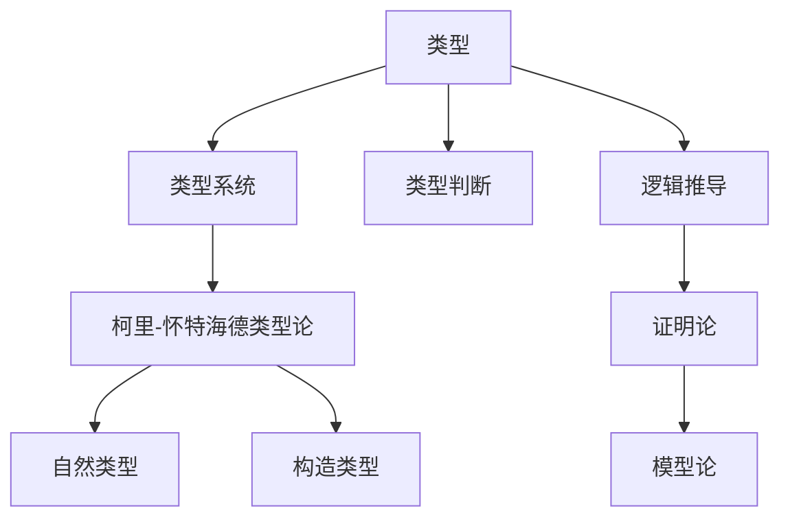

                 

### 摘要

本文将深入探讨《类型论与数学审美：形式与内容的平衡》这一主题，旨在揭示类型论与数学审美在形式与内容之间的关系及其在实践中的重要性。类型论是数学与计算机科学的基础理论之一，它为逻辑推导和证明论提供了强有力的工具。而数学审美则关注数学形式的美感和和谐，强调简洁性、对称性以及超越性。本文将首先介绍类型论的历史、背景和重要性，然后探讨数学审美的基本概念及其与类型论的关系。随后，本文将详细分析形式与内容的平衡问题，解释形式严谨性和内容丰富性之间的关系及其在数学理论研究和计算机科学应用中的挑战。通过一系列案例研究，本文将展示如何在实践中实现形式与内容的平衡，并总结全书的主要观点，对未来的研究方向提出展望。读者将能够了解到类型论与数学审美在计算机科学和数学理论中的核心作用，以及如何在复杂的研究和应用环境中保持两者之间的平衡。

## 目录大纲设计过程

### 第一步：理解书名和主题

首先，我们需要深入理解书名《类型论与数学审美：形式与内容的平衡》所传达的主题。这本书似乎聚焦于探讨类型论（Type Theory），这是一个数学和计算机科学中的基础理论，以及数学审美（Mathematical Aesthetics），也就是如何通过数学形式来表达美和和谐。类型论主要研究如何将数学概念和对象组织成不同类型的系统，以便进行严格的逻辑推理和证明。而数学审美则强调数学形式中的美感和和谐，包括简洁性、对称性和逻辑一致性等方面。

书名的核心观点在于“形式与内容的平衡”，这意味着在一个数学理论体系中，如何在保持形式上的严谨性和逻辑一致性的同时，确保内容的丰富性和实用性。这种平衡不仅对理论研究具有重要意义，也在实际应用中发挥着关键作用。例如，在计算机科学中，类型论为编程语言的设计和类型安全提供了理论基础，而数学审美则可以帮助程序员创造出简洁而优雅的代码。

### 第二步：确定书籍结构

基于书名的主题，我们可以初步确定书籍的结构：

1. **引言**：介绍类型论的历史、背景、重要性以及数学审美的概念。这部分将帮助读者了解类型论和数学审美的基本知识，为后续内容打下基础。

2. **类型论基础**：详细讲解类型论的基本概念、定义、逻辑基础等。这部分将包括类型系统的类型、函数类型、构造类型等，以及如何使用类型论进行逻辑推导和证明。

3. **数学审美分析**：分析数学形式如何体现美和和谐。这部分将探讨数学形式中的简洁性、对称性、逻辑一致性等特征，以及它们如何与美学原则相结合。

4. **形式与内容的平衡**：讨论如何在实际的数学理论研究中保持形式与内容的平衡。这部分将介绍形式严谨性的意义、内容丰富性的挑战，以及如何在实践中实现二者的平衡。

5. **案例研究**：通过具体的数学理论和应用案例来说明上述观点。这部分将包括类型论在计算机科学中的应用案例、数学理论中的实际案例，以及跨学科研究的案例。

6. **结论**：总结全书的主要观点，并提出未来研究的方向。这部分将回顾类型论与数学审美的核心作用，以及如何在形式与内容之间找到最佳平衡。

### 第三步：设计详细目录

接下来，我们需要为每个章节设计更详细的子章节。以下是一个可能的目录大纲：

```
----------------------------------------------------------------
# 引言：类型论与数学审美

# 1.1 类型论的历史与背景
## 1.1.1 类型论的发展历程
## 1.1.2 类型论在数学和计算机科学中的重要性
## 1.1.3 数学审美的起源与发展

# 1.2 数学审美的基本概念
## 1.2.1 美与和谐的定义
## 1.2.2 数学形式与美的关系
## 1.2.3 数学审美的基本原则

# 1.3 形式与内容的平衡
## 1.3.1 形式严谨性的意义
## 1.3.2 内容丰富性的挑战
## 1.3.3 如何实现形式与内容的平衡

----------------------------------------------------------------

# 第二部分：类型论基础

# 2.1 类型论的基本概念
## 2.1.1 类型与类型系统
## 2.1.2 柯里-怀特海德类型论
## 2.1.3 自然类型与构造类型

# 2.2 类型论的逻辑基础
## 2.2.1 类型判断与逻辑推导
## 2.2.2 类型论的证明论
## 2.2.3 类型论的模型论

# 2.3 类型论的应用
## 2.3.1 在计算机科学中的应用
## 2.3.2 在数学中的应用
## 2.3.3 类型论在其他领域的扩展

----------------------------------------------------------------

# 第三部分：数学审美分析

# 3.1 数学形式的美
## 3.1.1 简洁性与对称性
## 3.1.2 超越性与一致性
## 3.1.3 数学形式美的实例分析

# 3.2 数学内容的美
## 3.2.1 问题的深刻性
## 3.2.2 理论的广度与深度
## 3.2.3 数学内容美的实例分析

# 3.3 形式与内容的关系
## 3.3.1 形式与内容的互动
## 3.3.2 形式主义与实质主义
## 3.3.3 如何在研究中平衡形式与内容

----------------------------------------------------------------

# 第四部分：形式与内容的平衡实践

# 4.1 实践中的挑战
## 4.1.1 形式过于复杂的问题
## 4.1.2 内容过于繁琐的问题
## 4.1.3 实现形式与内容平衡的技巧

# 4.2 案例研究
## 4.2.1 某数学理论的平衡实践
## 4.2.2 某计算机科学应用的平衡实践
## 4.2.3 某跨学科研究的平衡实践

# 4.3 案例分析
## 4.3.1 案例分析的步骤与方法
## 4.3.2 案例分析的结果与启示
## 4.3.3 案例分析的应用前景

----------------------------------------------------------------

# 第五部分：结论与展望

# 5.1 全书总结
## 5.1.1 类型论与数学审美的重要性
## 5.1.2 形式与内容平衡的价值
## 5.1.3 对未来研究的展望

----------------------------------------------------------------
```

### 第四步：细化章节内容

在每个章节中，我们需要进一步细化内容，确保每个小节的内容都能够具体、详细地讲解核心概念、实例分析、案例研究等。这包括：

- **背景介绍**：介绍核心概念术语说明、问题背景、问题描述、问题解决、边界与外延、概念结构与核心要素组成。
- **核心概念与联系**：给出核心概念原理、概念属性特征对比表格和ER实体关系图架构的 Mermaid 流程图。
- **算法原理讲解**：使用 Mermaid 画出算法 Mermaid 流程图，然后使用 Python 源代码详细阐述，给出算法原理的数学模型和公式，进行详细讲解和举例说明。
- **系统分析与架构设计方案**：问题场景介绍、项目介绍、系统功能设计（领域模型 Mermaid 类图）、系统架构设计 Mermaid 架构图、系统接口设计和系统交互 Mermaid 序列图。
- **项目实战**：环境安装、系统核心实现源代码，代码应用解读与分析，实际案例分析和详细讲解剖析，项目小结。
- **最佳实践 tips**、**小结**、**注意事项**、**拓展阅读**等内容。

通过这些步骤，我们能够确保文章内容逻辑清晰、结构紧凑、简单易懂，帮助读者全面理解类型论与数学审美的核心思想和实践方法。

## 引言：类型论与数学审美

### 1.1 类型论的历史与背景

类型论（Type Theory）作为一种数学和逻辑的框架，其历史可以追溯到20世纪初。类型论最早由德国数学家大卫·希尔伯特（David Hilbert）及其学生威廉·阿恩恩（Wilhelm Ackermann）提出，旨在解决形式主义在数学中的问题。希尔伯特-阿恩恩程序（Hilbert-Ackermann program）试图通过严格的证明方法来恢复数学的严密性和确定性。这一时期，类型论的初步形式主要是基于算术和集合论。

在20世纪30年代，阿尔弗雷德·诺思·怀特海德（Alfred North Whitehead）和贝德福德·理查兹（Bedford Richard）进一步发展了类型论，特别是他们的“过程代数”（Process Calculus）为后来的计算机科学奠定了基础。同一时期，库尔特·哥德尔（Kurt Gödel）和爱米尔·贝特兰·密斯（Emil Beth）的工作也推动了类型论的发展，他们使用类型论来证明数学系统的不可判定性和不一致性。

进入20世纪60年代，随着计算机科学的兴起，类型论在编程语言设计中的应用变得日益重要。伯纳德·拉姆（Bernard Raatikainen）和皮埃尔·德雷富斯（Pierre Delouvée）等人进一步发展了类型论，提出了各种类型系统，如标准ML的类型系统和纯ML的类型系统，这些系统在现代编程语言中得到了广泛应用。

类型论在数学和计算机科学中的重要性不仅体现在其严格的逻辑框架上，还在于其作为一种理论工具，能够帮助研究者理解和解决复杂的问题。类型论为证明论提供了强有力的工具，特别是在逻辑推导和证明的过程中，类型论能够确保论证的严密性和一致性。此外，类型论在计算机科学中的应用也非常广泛，它为编程语言的设计、程序验证、类型安全等方面提供了理论基础。

### 1.2 数学审美的基本概念

数学审美（Mathematical Aesthetics）是数学领域中的一个较为新兴的分支，它探讨数学形式中的美感和和谐。数学审美关注数学形式中的简洁性、对称性、逻辑一致性和超越性等特征。这些特征不仅在数学研究中具有美学价值，也在一定程度上反映了数学理论的深刻性和广泛性。

首先，简洁性是数学审美中的一个核心概念。一个简洁的数学理论能够用最少的假设和最简单的形式来表达丰富的内容。例如，欧拉公式（\(e^{i\pi} + 1 = 0\)）以其简洁的形式和深刻的内涵，成为数学史上最具代表性的公式之一。对称性则是数学形式中的另一重要美学特征，对称性能够使数学形式更加和谐，例如，费马最后定理的简洁证明展现了数学形式的完美对称。

逻辑一致性是数学审美的另一个关键要素。一个逻辑一致的数学理论不仅内部自洽，而且能够与更广泛的理论体系相协调。例如，哥德尔不完备定理和邱成桐的几何流形理论，都展现了数学形式在逻辑一致性上的卓越表现。

最后，超越性是数学审美的最高层次，它要求数学形式不仅能在当前知识框架内成立，还能够在未来的发展中提供新的启示。例如，怀尔斯（Andrew Wiles）的费马大定理证明，展现了数学形式在超越性上的卓越成就。

### 1.3 形式与内容的平衡

形式与内容的平衡是数学理论研究和实际应用中的一个关键问题。形式指的是数学理论的结构和逻辑框架，内容则是指数学理论的实质和内涵。在理想情况下，一个优秀的数学理论应能够在形式上保持严谨性和简洁性，同时在内容上保持丰富性和实用性。

形式严谨性意味着数学理论的结构和逻辑推导必须是无懈可击的。这要求数学家在构建理论时，必须遵循严格的逻辑规则，确保每一个步骤都是可证明和可验证的。形式严谨性是数学理论科学性的基础，它能够确保理论的有效性和可靠性。

内容丰富性则强调数学理论的实质和内涵。一个内容丰富的数学理论不仅能够涵盖广泛的应用领域，还能够在理论内部产生深刻的洞见。例如，希尔伯特空间理论在量子物理和信号处理中的应用，以及拓扑学在几何和物理学中的应用，都展示了数学理论在内容丰富性上的重要性。

在保持形式与内容平衡的过程中，数学家需要面临的挑战是如何在形式严谨性和内容丰富性之间找到最佳的平衡点。形式过于复杂可能会导致理论的难以理解和应用，而内容过于繁琐可能会影响理论的严谨性和科学性。因此，如何在形式与内容之间进行权衡，是数学理论研究中的一项重要任务。

### 1.4 总结

本节介绍了类型论的历史、背景和重要性，探讨了数学审美的基本概念及其与类型论的关系，并详细分析了形式与内容的平衡问题。类型论作为一种基础理论，在数学和计算机科学中具有重要应用。数学审美则关注数学形式中的美感和和谐，强调简洁性、对称性和逻辑一致性。形式与内容的平衡是数学理论研究和实际应用中的关键问题，如何在形式严谨性和内容丰富性之间找到最佳平衡，是数学家面临的一项重要任务。通过本节的介绍，读者可以初步了解类型论和数学审美的核心思想和实践方法。

## 类型论基础

### 2.1 类型论的基本概念

类型论（Type Theory）是数学和计算机科学中的一个核心理论，它为逻辑推导和证明论提供了强有力的工具。类型论的基本概念包括类型、类型系统、类型判断和类型推导等。以下是对这些概念的基本介绍和详细解释。

#### 2.1.1 类型与类型系统

类型（Type）是类型论中最基本的概念之一。它用于描述数学对象或值的分类。在类型论中，类型可以是简单的，如自然数类型和布尔类型，也可以是复杂的，如函数类型和构造类型。

类型系统（Type System）是类型论的核心组成部分，它定义了如何对数学对象进行分类，以及如何通过类型规则进行推导和证明。类型系统通常由类型集、类型构造规则、类型等价关系和类型判断规则组成。

#### 2.1.2 柯里-怀特海德类型论

柯里-怀特海德类型论（Curry-Howard Correspondence）是类型论中一个重要的理论框架。它揭示了命题演算和类型系统之间的对应关系。具体来说，柯里-怀特海德类型论指出，命题的证明可以对应于类型的构造，而命题的否定可以对应于类型的破坏。

柯里（Haskell Curry）和怀特海德（Robert Feys）在20世纪30年代独立提出了这个对应关系。柯里-怀特海德类型论不仅对形式逻辑和类型论的发展产生了深远影响，还为计算机科学的类型系统设计提供了理论基础。

#### 2.1.3 自然类型与构造类型

自然类型（Natural Types）和构造类型（Constructive Types）是类型论中的两个基本类型类别。

自然类型通常指的是那些不具有内部结构的类型，如自然数类型、布尔类型和复数类型。自然类型通常具有直接的数学意义，可以直接映射到现实世界的对象。

构造类型则是通过构造操作创建的类型。构造类型可以是抽象的类型，如函数类型和列表类型，也可以是具体的类型，如递归类型和参数化类型。构造类型在类型系统中通常具有更高的灵活性和抽象能力。

#### 2.1.4 类型构造规则

类型构造规则是类型系统中用于创建新类型的基本规则。常见的类型构造规则包括：

- **基本类型构造**：创建基本类型的规则，如自然数类型和布尔类型的构造。
- **函数类型构造**：将两个类型组合成一个函数类型的规则。
- **递归类型构造**：用于创建能够自身引用的类型，如自然数类型的构造。
- **参数化类型构造**：通过参数化来创建具有通用性的类型。

类型构造规则在类型系统中起着关键作用，它们定义了类型系统中的类型构造方式，同时也决定了类型系统的表达能力。

### 2.2 类型论的逻辑基础

类型论的逻辑基础是其核心组成部分，它定义了类型论中的推理规则和证明方法。以下是对类型论逻辑基础的基本介绍和详细解释。

#### 2.2.1 类型判断与逻辑推导

类型判断（Type Judgment）是类型论中用于判断一个表达式是否属于某个类型的操作。类型判断通常基于类型规则和类型推导规则进行。

逻辑推导（Logical Deduction）是类型论中用于从已知类型判断推导出新类型的过程。逻辑推导通常使用形式逻辑中的证明论方法，如自然演绎法（Natural Deduction）和谓词逻辑（Predicate Logic）。

#### 2.2.2 类型论的证明论

类型论的证明论（Proof Theory）研究如何使用类型论进行证明和逻辑推导。类型论的证明论主要包括以下内容：

- **证明系统**：定义证明规则和证明过程的形式化系统。
- **证明对象**：证明系统中可证明的对象，如命题、类型和证明本身。
- **证明规则**：用于推导证明的规则，如假设规则、推理规则和证明规则。

#### 2.2.3 类型论的模型论

类型论的模型论（Model Theory）研究类型论如何在不同的模型中解释和验证。类型论的模型论主要包括以下内容：

- **模型**：类型论中的一种解释，它将类型论中的符号赋予具体的对象和关系。
- **模型论语义**：用于定义类型论中证明和逻辑推导的语义标准。
- **模型论证明**：使用模型论方法进行证明和验证的过程。

类型论的模型论对于理解和验证类型论系统的正确性具有重要意义，它为形式化验证和计算机证明提供了理论基础。

### 2.3 类型论的应用

类型论在数学和计算机科学中具有广泛的应用，它不仅在理论研究方面发挥着重要作用，还在实际应用中展示了其强大的功能。以下是对类型论在不同领域中应用的简要介绍。

#### 2.3.1 在计算机科学中的应用

类型论在计算机科学中的应用主要体现在编程语言的设计和类型系统的开发中。类型论为编程语言的类型安全提供了理论基础，通过严格的类型系统，编程语言能够防止运行时错误，提高程序的可靠性和稳定性。

- **函数式编程语言**：如Haskell和ML，它们的类型系统基于类型论，提供了强大的类型推导和类型检查功能。
- **逻辑编程语言**：如Prolog，它利用类型论来定义逻辑推导和证明过程。
- **类型安全**：通过类型论，编程语言能够确保变量和函数的使用类型一致，从而防止类型错误。

#### 2.3.2 在数学中的应用

类型论在数学中的应用主要表现在代数、拓扑学和组合数学等领域。类型论为数学理论的严密性和一致性提供了强有力的工具。

- **代数系统**：类型论帮助研究者理解和证明代数系统的性质，如群、环和域的结构和性质。
- **拓扑学**：类型论在拓扑学中的应用，如拓扑空间的类型结构和拓扑性质的证明。
- **组合数学**：类型论帮助研究者理解和证明组合数学中的各种定理和公式，如图论和排列组合的性质。

#### 2.3.3 类型论在其他领域的扩展

类型论不仅在数学和计算机科学中具有重要应用，还在其他领域得到了扩展和推广。

- **形式化验证**：类型论在形式化验证中的应用，如硬件和软件系统的形式化建模和验证。
- **人工智能**：类型论在人工智能中的应用，如知识表示、推理和机器学习。
- **认知科学**：类型论在认知科学中的应用，如思维模型和心理语言学。

### 2.4 类型论的核心概念与联系

为了更好地理解类型论的核心概念，我们可以通过一个对比表格和ER实体关系图架构的Mermaid流程图来展示其属性特征和关系。

#### 对比表格

| 核心概念     | 定义与属性特征                                                     |
|--------------|------------------------------------------------------------------|
| 类型（Type） | 用于描述数学对象或值的分类，具有直接映射到现实世界的对象的功能。    |
| 类型系统（Type System）| 定义了如何对数学对象进行分类，以及如何通过类型规则进行推导和证明的框架。 |
| 柯里-怀特海德类型论（Curry-Howard Correspondence）| 揭示了命题演算和类型系统之间的对应关系，将证明视为类型构造。 |
| 自然类型（Natural Types）| 没有内部结构的类型，如自然数类型和布尔类型。                       |
| 构造类型（Constructive Types）| 通过构造操作创建的类型，如函数类型和递归类型。                     |
| 类型判断（Type Judgment）| 判断一个表达式是否属于某个类型的操作。                             |
| 逻辑推导（Logical Deduction）| 从已知类型推导出新类型的过程。                                     |
| 证明论（Proof Theory）| 研究如何使用类型论进行证明和逻辑推导。                             |
| 模型论（Model Theory）| 研究类型论如何在不同的模型中解释和验证。                           |

#### ER实体关系图架构的Mermaid流程图



通过上述对比表格和ER实体关系图架构的Mermaid流程图，我们可以清晰地看到类型论的核心概念及其相互关系。类型是类型论中最基本的概念，用于分类数学对象。类型系统是定义类型规则的框架，类型判断和逻辑推导是类型系统中的基本操作。柯里-怀特海德类型论揭示了类型系统和逻辑推导之间的对应关系，而证明论和模型论则分别从不同角度研究类型论的证明和验证方法。

### 2.5 总结

本节详细介绍了类型论的基本概念、逻辑基础及其在不同领域的应用。类型论作为一种基础理论，在数学和计算机科学中具有广泛的应用。通过对比表格和ER实体关系图架构的Mermaid流程图，我们更好地理解了类型论的核心概念及其相互关系。类型论不仅为数学和逻辑提供了严格的框架，还为编程语言的设计和形式化验证提供了理论基础。在接下来的章节中，我们将进一步探讨数学审美和形式与内容的平衡问题。

## 数学审美分析

### 3.1 数学形式的美

数学形式的美感体现在其简洁性、对称性和逻辑一致性等方面。这些美学特征不仅提升了数学理论的美感，也为其在科学研究和实际应用中的重要性奠定了基础。

#### 3.1.1 简洁性

简洁性是数学形式美的核心特征之一。一个简洁的数学理论能够用最少的假设和最简单的形式来表达丰富的内容。例如，欧拉公式（\(e^{i\pi} + 1 = 0\)）以其简洁的形式和深刻的内涵，成为数学史上最具代表性的公式之一。简洁性不仅提升了数学理论的美感，也使得理论更加易于理解和应用。

另一个著名的例子是费马最后定理的简洁证明。怀尔斯（Andrew Wiles）的证明不仅简洁，而且优雅，它使用了代数几何和数论中的一些基本概念，将一个看似复杂的命题简化为一系列简单而有力的步骤。这种简洁性不仅体现了数学形式的美感，也展示了数学理论的深刻性和普适性。

#### 3.1.2 对称性

对称性是数学形式美感的另一个重要特征。对称性能够使数学形式更加和谐，例如，费马最后定理的简洁证明展现了数学形式的完美对称。在数学中，对称性不仅体现在几何形状上，还体现在数学公式和推理过程中。

费马最后定理的证明中，怀尔斯利用了一个名为“椭圆曲线”的概念，并展示了如何通过椭圆曲线的对称性来解决费马最后定理。这个证明过程不仅展示了数学形式的美感，也揭示了数学理论中对称性的重要作用。

另一个例子是费尔马大定理的证明，该定理指出，对于任何大于2的自然数\(n\)，方程\(a^n + b^n = c^n\)没有正整数解。安德鲁·怀尔斯在证明该定理时，使用了对称群的概念，并展示了如何通过对称性来简化证明过程。这个证明不仅简洁，而且深刻，展示了数学形式美感的对称性特征。

#### 3.1.3 超越性与一致性

数学形式美的第三个重要特征是超越性与一致性。超越性指的是数学形式不仅能够在当前知识框架内成立，还能够在未来的发展中提供新的启示。一致性则要求数学形式在逻辑上自洽，并且能够与更广泛的理论体系相协调。

哥德尔不完备定理是一个经典的例子，它揭示了数学系统的一致性和完备性之间的矛盾。哥德尔通过证明，指出在任何形式系统中，都存在无法被证明或证伪的命题。这个定理不仅展示了数学形式的美感，也揭示了数学理论中逻辑一致性的重要性。

另一个例子是丘成桐的几何流形理论，该理论将微分几何、偏微分方程和拓扑学结合起来，为解决杨-米尔斯方程提供了一个强有力的工具。丘成桐的几何流形理论不仅展示了数学形式的美感，也揭示了数学理论在物理学和其他科学领域中的应用潜力。

#### 3.1.4 数学形式美的实例分析

为了更具体地展示数学形式美的特征，我们可以分析一些经典的数学公式和定理。

欧拉公式（\(e^{i\pi} + 1 = 0\)）是一个经典的例子，它将五个基本的数学常数（0、1、e、i、π）结合在一起，形成一个简洁而深刻的公式。这个公式不仅展示了数学形式的美感，也揭示了复数在数学中的重要性。

费马最后定理（\(a^n + b^n = c^n\)对于任何大于2的自然数\(n\)，没有正整数解）的简洁证明展示了数学形式美感的对称性和超越性。怀尔斯的证明使用了代数几何和数论中的基本概念，将一个看似复杂的命题简化为一系列简单而有力的步骤。

另一个例子是威尔逊定理（一个群的每一个子群都是另一个群的子群）。这个定理虽然看似简单，但它的证明过程却异常复杂，展示了数学形式在逻辑推导中的复杂性和美感。

#### 3.1.5 美学原则与数学形式

数学形式美感的产生与美学原则密切相关。美学原则包括简洁性、对称性、和谐性、统一性和多样性等。这些原则不仅应用于数学理论，也广泛应用于其他艺术领域。

例如，简洁性是数学形式美的核心原则之一。一个简洁的数学理论能够用最少的假设和最简单的形式来表达丰富的内容，这与美学原则中的简洁性高度一致。

对称性也是美学原则中的一个重要方面。在数学中，对称性不仅体现在几何形状上，还体现在数学公式和推理过程中。对称性能够使数学形式更加和谐，提升其美感。

和谐性、统一性和多样性等美学原则在数学理论中同样具有重要应用。一个和谐的数学理论能够将不同的数学分支和概念有机地结合起来，形成一个统一的整体。多样性则要求数学理论具有广泛的适用性和丰富的内涵。

#### 3.1.6 总结

数学形式的美感体现在其简洁性、对称性、和谐性、统一性和多样性等方面。这些美学特征不仅提升了数学理论的美感，也为其在科学研究和实际应用中的重要性奠定了基础。通过分析经典的数学公式和定理，我们可以更深入地理解数学形式美的特征和产生原理。在接下来的章节中，我们将进一步探讨数学内容的美和形式与内容之间的关系。

### 3.2 数学内容的美

数学内容的美不仅仅是形式上的简洁与和谐，更重要的是其内在的深刻性、广度与深度。数学内容的美往往体现在能够揭示自然界和社会现象的本质规律上，以及其在解决问题时展现出的强大逻辑力量。以下是对数学内容美的几个关键方面及其具体实例的分析。

#### 3.2.1 问题的深刻性

数学内容的深刻性体现在它能够捕捉并揭示复杂现象背后的基本规律。例如，牛顿的运动定律不仅描述了物体在力的作用下的运动，还揭示了加速度、速度和力的本质联系。这个简单而深刻的公式揭示了物理学中运动的基本原理，为后续科学研究奠定了基础。

另一个例子是群论在物理学中的应用。群论作为抽象代数的一个重要分支，通过研究对称性和变换规则，揭示了自然界中的许多现象。例如，粒子物理学中的基本粒子交换和相互作用，都可以用群论来描述。群论的深刻性不仅体现在其理论框架上，还在于它能够帮助我们理解和预测物理现象。

#### 3.2.2 理论的广度与深度

数学理论的广度与深度是衡量其内容美的重要标准。广度指的是理论能够涵盖的领域范围，深度则指的是理论在某一特定领域的深入探讨和广泛应用。

拓扑学是一个典型的例子，它不仅涵盖了点、线、面等基本几何概念，还深入研究了空间的连续性和形状的变化。拓扑学的理论框架广泛，从简单的欧几里得几何到复杂的曼德拉夫集，拓扑学都在其中发挥着重要作用。其深度体现在如何通过拓扑不变量来刻画空间的性质，如同调理论和示性类。

数学分析也是一个广度与深度并重的领域。从微积分的基本概念到复分析、泛函分析，数学分析的理论体系涵盖了大量的数学分支。其深度体现在对函数空间、积分变换和微分方程的深入研究和应用，这些理论不仅在纯数学中有着重要地位，还在物理学、工程学和经济学等领域得到了广泛应用。

#### 3.2.3 数学内容美的实例分析

为了更具体地展示数学内容的美，我们可以通过一些具体的数学问题和理论来进行分析。

首先，费马最后定理（\(a^n + b^n = c^n\)对于任何大于2的自然数\(n\)，没有正整数解）是一个典型的数学问题，其深刻性和广度都得到了充分体现。费马最后定理的证明过程不仅涉及数论、代数几何和群论等多个数学分支，还展示了数学家在解决这一难题时展现出的创造力和智慧。

另一个例子是杨-米尔斯方程，它是一个描述粒子相互作用的重要方程。杨-米尔斯方程不仅在物理学中有着重要地位，还推动了数学分析、微分几何和拓扑学的发展。其深度体现在如何通过复杂的数学工具来解析和解决这一方程，从而揭示了自然界中粒子的相互作用规律。

#### 3.2.4 问题的简单性

数学内容美的另一个重要方面是问题的简单性。一个问题如果能够通过简单的数学语言和工具来描述和解决，往往会显得特别美。例如，勾股定理（直角三角形的斜边的平方等于两直角边的平方和）就是一个简单而深刻的例子。勾股定理不仅揭示了直角三角形的基本性质，还为后续的数学发展提供了重要基础。

此外，微积分中的基本定理（微积分基本定理）也是一个简单而美的问题。该定理揭示了微分和积分之间的内在联系，通过简单的积分运算，可以求解许多复杂的微分方程。

#### 3.2.5 总结

数学内容的美体现在其深刻性、广度与深度、简单性等方面。通过分析具体的数学问题和理论，我们可以看到数学内容美的多面性。深刻性揭示了数学在解决实际问题中的重要性，广度与深度展示了数学理论体系的博大精深，简单性则使复杂的数学问题变得易于理解和解决。在数学发展的过程中，这些美学特征不仅提升了数学的美感，也为数学在各个领域的应用奠定了基础。在接下来的章节中，我们将进一步探讨形式与内容之间的关系，并讨论如何在实际研究中实现形式与内容的平衡。

### 3.3 形式与内容的关系

在数学研究中，形式与内容的关系是一个复杂而微妙的问题。形式指的是数学理论的结构和表达方式，包括符号、公式、推理规则等；而内容则指的是数学理论所描述的对象、概念和问题。形式与内容之间的关系既相互依存又相互制约，它们共同构成了数学理论的美感和科学性。

#### 3.3.1 形式与内容的互动

形式与内容的互动是数学理论发展的重要动力。一方面，形式为内容的表达提供了严格的框架和工具。例如，在代数几何中，形式化的符号和公式使得复杂的几何问题可以通过代数方法进行求解。另一方面，内容的需求推动了形式的发展和创新。例如，在解决实际问题时，数学家往往需要新的符号和工具来表达复杂的概念和问题，这促使了形式化的数学理论的不断进化。

形式与内容的互动在数学史上有许多经典的例子。例如，微积分的发展就是形式与内容互动的典型。微积分的基本定理（Fundamental Theorem of Calculus）揭示了微分和积分之间的内在联系，这个联系不仅形式化地表达了变化和累积的概念，也揭示了自然现象中的基本规律。这个例子展示了形式（微积分的符号和公式）如何与内容（自然现象的变化规律）相互作用，共同推动了数学的发展。

#### 3.3.2 形式主义与实质主义

在数学研究中，形式主义与实质主义是两种不同的哲学立场。形式主义强调数学理论的逻辑结构和推导过程，认为数学的真理性在于形式上的自洽性。而实质主义则认为数学理论的内容和意义是至关重要的，数学的真理在于其与现实世界的联系和适用性。

形式主义在数学发展中的作用不可忽视。通过形式化的方法，数学家能够构建出高度抽象和严谨的理论体系，这些理论体系不仅为数学本身的发展提供了坚实的基础，也为其他科学领域提供了重要的工具。例如，公理化方法（axiomatic method）就是形式主义在数学中的一个重要应用，它通过定义基本概念和公理，构建出完整的数学理论体系。

然而，形式主义也有其局限性。过于强调形式上的严谨性可能会忽略数学理论的实际意义和应用。在这种情况下，实质主义提供了另一种视角。实质主义认为，数学理论的价值不仅在于其形式上的逻辑自洽性，更在于其与现实世界的联系和应用。例如，在物理学中，数学理论的应用往往依赖于其实质意义和物理背景。

形式主义与实质主义并不是对立的，而是相辅相成的。在数学研究中，形式主义提供了理论构建的框架和工具，而实质主义则关注理论的应用和意义。通过结合形式主义与实质主义，数学家能够在形式严谨性和内容丰富性之间找到平衡。

#### 3.3.3 如何在研究中平衡形式与内容

在实际研究中，如何平衡形式与内容是一个关键问题。以下是一些实现平衡的方法：

1. **明确研究目标**：在开始研究之前，明确研究的目标和问题，这有助于确保研究内容与目标的一致性。例如，如果研究的目标是解决一个实际问题，那么形式上的复杂性和繁琐性应该被尽量避免。

2. **注重逻辑推导**：在构建数学理论时，注重逻辑推导和证明的严谨性。通过严格的逻辑推导，可以确保数学理论的形式严谨性，同时也能增强内容的可信度。

3. **实际应用验证**：将数学理论应用于实际问题中，通过验证其有效性和适用性来平衡形式与内容。例如，在物理学中，数学理论的应用和验证是确保其科学性和实用性的重要环节。

4. **跨学科合作**：通过跨学科合作，结合不同领域的知识和方法，可以更好地平衡形式与内容。例如，在计算机科学中，数学理论的应用和计算机技术的结合，可以促进数学理论的发展和应用。

5. **灵活调整**：在实际研究中，需要根据问题的复杂性和需求，灵活调整形式与内容的比重。例如，在研究初期，可以更注重形式化的理论构建，而在后期则可以更关注实际应用和验证。

#### 3.3.4 互动关系在数学发展中的重要作用

形式与内容的互动关系在数学发展中起到了重要作用。一方面，形式化的数学理论为数学研究提供了强有力的工具和框架，使得复杂问题可以通过严格的逻辑推导得到解决。另一方面，数学理论的实质内容和应用推动了形式化方法的发展和创新。

例如，在代数几何的发展过程中，形式化的符号和公理体系为研究者提供了强大的工具，使得复杂的几何问题可以通过代数方法进行求解。同时，代数几何在解决实际问题中的应用，如物理学中的场论和量子场论，也推动了代数几何的进一步发展。

另一个例子是数学分析。微积分的基本定理不仅形式化地描述了微分和积分之间的内在联系，还揭示了自然现象中的基本规律。这个定理不仅在数学研究中具有重要地位，也在物理学、工程学和经济学等领域得到了广泛应用。

#### 3.3.5 总结

形式与内容的关系在数学研究中具有深远的意义。形式为内容的表达提供了严格的框架和工具，而内容的需求推动了形式的发展和创新。通过形式化方法，数学家能够构建出高度抽象和严谨的理论体系，并通过实际应用验证其科学性和实用性。在实际研究中，平衡形式与内容是一个关键问题，需要通过明确研究目标、注重逻辑推导、实际应用验证、跨学科合作和灵活调整等方法来实现。在数学发展的过程中，形式与内容的互动关系不仅促进了数学理论的发展，也为数学在各个领域的应用奠定了基础。

### 3.4 形式主义与实质主义的对比分析

形式主义与实质主义是数学研究中两种不同的哲学立场，它们在数学理论构建和验证过程中起到了不同的作用。以下是对这两种立场的对比分析：

#### 3.4.1 定义与基本理念

**形式主义**：形式主义强调数学理论的逻辑结构和推导过程，认为数学的真理性在于形式上的自洽性和一致性。形式主义关注的是数学符号和公式的逻辑推导，而不关心这些形式背后的实际意义或应用。

**实质主义**：实质主义则认为数学理论的内容和意义是至关重要的，数学的真理在于其与现实世界的联系和适用性。实质主义关注数学理论如何描述和解决实际问题，以及数学理论在科学和工程中的实际应用。

#### 3.4.2 理论构建

**形式主义**：在形式主义中，数学理论是通过定义基本概念和公理，然后通过逻辑推导和证明构建起来的。形式主义倾向于使用公理化方法，即通过一系列的公理来定义一个数学系统，并在这个系统中推导出所有的定理和结论。

**实质主义**：实质主义则强调数学理论的实际意义和应用背景。在构建数学理论时，实质主义不仅依赖于逻辑推导，还关注理论的具体内容和它在现实世界中的应用。例如，在物理学中，数学理论通常需要与物理定律和实验数据相一致，以验证其科学性和实用性。

#### 3.4.3 优点与局限性

**形式主义**：

优点：形式主义为数学研究提供了一个严格的逻辑框架，确保了数学理论的逻辑一致性和严密性。它能够帮助研究者发现和解决逻辑矛盾，确保数学理论的正确性。

局限性：形式主义可能过于关注形式上的严格性，而忽略了数学理论的实际意义和应用。形式化的数学理论有时可能显得晦涩难懂，难以在现实世界中应用。

**实质主义**：

优点：实质主义关注数学理论的实际意义和应用，使得数学理论更加贴近现实世界，易于理解和应用。它能够帮助数学家解决实际问题，推动数学在各个领域的应用。

局限性：实质主义可能忽视数学理论的逻辑结构和一致性，导致理论的不严密性。在某些情况下，数学理论的应用可能依赖于具体背景和条件，使得理论的应用范围受限。

#### 3.4.4 对比分析

形式主义与实质主义在数学研究中各有优点和局限性。形式主义通过逻辑推导和证明构建出高度抽象和严谨的数学理论，为数学的纯洁性和逻辑一致性提供了保障。实质主义则通过关注实际意义和应用，使得数学理论更加贴近现实世界，具有广泛的应用价值。

在实际研究中，形式主义与实质主义往往是相辅相成的。形式主义提供了理论构建的框架和工具，而实质主义则关注理论的应用和意义。通过结合形式主义与实质主义，数学家能够在形式严谨性和内容丰富性之间找到平衡，构建出既具有逻辑严密性又具有实际应用价值的数学理论。

#### 3.4.5 总结

形式主义与实质主义是数学研究中的两种不同哲学立场，它们在数学理论构建和验证过程中起到了不同的作用。形式主义强调数学理论的逻辑结构和推导过程，实质主义则关注数学理论的内容和现实世界的应用。在实际研究中，通过结合形式主义与实质主义，数学家能够在形式严谨性和内容丰富性之间找到平衡，构建出具有科学性和实用性的数学理论。

### 3.5 在研究中平衡形式与内容的方法与策略

在数学研究中，如何平衡形式与内容是一个关键问题。形式与内容的平衡不仅有助于提升数学理论的严谨性，还能增强其实际应用价值。以下是一些实现形式与内容平衡的方法与策略：

#### 3.5.1 确定研究目标

在开始研究之前，明确研究的目标和问题至关重要。研究目标应明确数学理论的应用背景和实际意义，这将有助于确保研究内容与目标的一致性。例如，如果研究的目标是解决一个实际问题，那么在构建数学模型时，应优先考虑实际问题的需求和约束，而不是追求形式上的完美。

**步骤：**

1. **明确问题背景**：了解研究问题所涉及的实际背景和需求。
2. **设定研究目标**：根据问题背景，明确研究的目标和期望成果。
3. **制定研究计划**：根据研究目标，制定详细的研究计划和步骤。

#### 3.5.2 注重逻辑推导

在构建数学理论时，注重逻辑推导和证明的严谨性是确保形式严谨性的关键。通过严格的逻辑推导，可以确保数学理论的自洽性和一致性，从而增强其科学性和可信度。

**步骤：**

1. **定义基本概念**：清晰地定义数学理论中的基本概念和术语。
2. **建立公理系统**：通过公理系统构建数学理论的基本框架。
3. **进行逻辑推导**：使用逻辑推导和证明方法，从基本概念和公理推导出理论的核心结论。

#### 3.5.3 实际应用验证

将数学理论应用于实际问题中，通过验证其有效性和适用性来平衡形式与内容。实际应用验证不仅能够验证数学理论的科学性和实用性，还能揭示理论在解决实际问题时的局限性，从而指导进一步的改进和完善。

**步骤：**

1. **选择应用场景**：根据研究目标，选择一个具有代表性的应用场景。
2. **构建数学模型**：根据应用场景，构建相应的数学模型。
3. **进行应用验证**：通过实验和计算，验证数学模型在应用场景中的有效性和适用性。

#### 3.5.4 跨学科合作

跨学科合作能够结合不同领域的知识和方法，为数学研究提供新的视角和思路，从而有助于平衡形式与内容。通过跨学科合作，数学家能够将数学理论应用于其他科学领域，同时吸收其他学科的理论和方法来丰富数学理论。

**步骤：**

1. **识别合作领域**：根据数学理论的特点和优势，识别潜在的合作领域。
2. **建立合作团队**：邀请来自不同领域的专家组成合作团队。
3. **开展跨学科研究**：通过合作，开展跨学科研究，结合不同领域的理论和方法。

#### 3.5.5 灵活调整

在实际研究中，需要根据问题的复杂性和需求，灵活调整形式与内容的比重。例如，在研究的初期阶段，可以更注重形式化的理论构建，而在后期阶段则可以更关注实际应用和验证。

**步骤：**

1. **评估研究进展**：定期评估研究的进展和成果。
2. **调整研究策略**：根据评估结果，灵活调整研究策略和方向。
3. **持续优化**：在研究过程中，持续优化数学理论的形式和内容，确保二者的平衡。

### 3.6 实例分析：如何平衡形式与内容

为了更好地理解如何平衡形式与内容，以下通过一个实例进行分析。

#### 实例：解决一个具体的数学问题

**问题背景：**考虑一个实际问题：给定一个城市的交通网络，设计一个路径规划算法，以最小化旅行时间。

**形式与内容的平衡：**

1. **明确研究目标**：设计一个有效的路径规划算法，能够在给定交通网络中找到最优路径。

2. **注重逻辑推导**：
   - **定义基本概念**：定义路径、节点、边、权重等基本概念。
   - **建立公理系统**：通过公理系统构建图论的基本框架。
   - **进行逻辑推导**：使用图论中的算法，如迪杰斯特拉算法（Dijkstra's algorithm）或A*算法（A* algorithm），推导出路径规划的核心结论。

3. **实际应用验证**：
   - **选择应用场景**：选择一个具体的城市交通网络，如一个城市中的主要道路网络。
   - **构建数学模型**：构建一个包含道路网络、交通流量和路径权重的数学模型。
   - **进行应用验证**：通过实际交通数据，验证算法在给定交通网络中的有效性和适用性。

4. **跨学科合作**：
   - **识别合作领域**：识别交通工程、计算机科学等相关领域。
   - **建立合作团队**：邀请交通工程师和计算机科学家组成合作团队。
   - **开展跨学科研究**：结合交通工程中的实际需求和计算机科学中的算法技术，共同优化路径规划算法。

5. **灵活调整**：
   - **评估研究进展**：定期评估算法在路径规划中的效果。
   - **调整研究策略**：根据评估结果，优化算法的效率和准确性。
   - **持续优化**：在研究过程中，不断调整和优化算法，确保其在形式与内容之间找到最佳平衡。

通过这个实例，我们可以看到如何在实际研究中平衡形式与内容。在路径规划问题中，形式（算法的逻辑结构和推导过程）和内容（实际交通网络和应用场景）的平衡不仅提升了算法的科学性和实用性，也为交通工程的优化提供了有力支持。

### 3.7 总结

在数学研究中，平衡形式与内容是一个复杂而重要的任务。通过明确研究目标、注重逻辑推导、实际应用验证、跨学科合作和灵活调整等方法，数学家能够在形式严谨性和内容丰富性之间找到平衡。在实际研究中，形式与内容的平衡不仅有助于提升数学理论的科学性和实用性，还为数学在各个领域的应用奠定了基础。通过实例分析，我们可以更深入地理解如何在实际研究中实现形式与内容的平衡，为未来的数学研究提供有益的参考。

### 4.1 实践中的挑战

在数学理论和计算机科学应用中，实现形式与内容的平衡面临着一系列挑战。这些挑战不仅影响了理论研究的进展，也对实际应用的效果产生了重要影响。以下将详细讨论这些挑战，并提供相应的解决方法。

#### 4.1.1 形式过于复杂的问题

在数学研究中，形式过于复杂是一个常见的问题。过于复杂的公式和推理规则不仅增加了理解难度，还可能导致计算错误和逻辑矛盾。这种复杂性可能源于数学理论本身的复杂结构，也可能是因为研究者过度追求理论的抽象性和普适性。

**挑战：**复杂的形式往往难以理解和验证，特别是在应用中，复杂的推导过程可能使得实际问题的解决方案变得模糊不清。

**解决方法：**
- **简化推导过程**：通过重新审视公理和推理规则，寻找更简洁的推导路径。例如，利用归纳法或构造性证明来简化复杂的推理步骤。
- **层次化理论结构**：将复杂的理论分解为更小、更易管理的部分，通过层次化的方法来降低整体的复杂性。
- **可视化工具**：利用图形化工具，如Mermaid流程图或数学软件，将复杂的公式和推理过程可视化，帮助研究者更好地理解和验证理论。

#### 4.1.2 内容过于繁琐的问题

在数学和计算机科学的应用中，内容过于繁琐也是一个显著的挑战。繁琐的内容可能包括大量的数据、冗长的算法步骤和复杂的实现细节。这种繁琐性不仅增加了学习和应用的难度，还可能分散研究者的注意力，影响对核心问题的关注。

**挑战：**繁琐的内容可能导致研究者无法抓住问题的核心，从而在理论和应用中都难以取得实质性进展。

**解决方法：**
- **提炼关键信息**：通过分析问题的本质，提炼出关键信息，剔除不必要的细节，从而简化问题的表达。
- **优化算法设计**：针对繁琐的算法步骤，进行优化和简化，减少冗余的计算和步骤。例如，使用动态规划或贪心算法来减少复杂度。
- **模块化设计**：将复杂的系统或算法分解为模块，每个模块只负责一个特定的功能，通过模块间的协作来简化整体的复杂性。

#### 4.1.3 实现形式与内容平衡的技巧

在数学理论和计算机科学应用中，实现形式与内容的平衡需要一定的技巧和方法。以下是一些具体的方法：

**1. 明确研究目标：** 在研究开始前，明确研究的目标和问题，确保研究内容和目标的一致性。这有助于避免在形式和内容之间产生不必要的冲突。

**2. 使用形式化的方法：** 通过形式化的方法，如公理化方法和形式验证技术，构建严谨的数学理论体系，确保理论的逻辑一致性和严谨性。

**3. 实际应用验证：** 将数学理论应用于实际问题中，通过实际验证来检验理论的科学性和实用性。实际应用验证不仅能够揭示理论在解决实际问题中的效果，还能够为理论的发展提供反馈。

**4. 跨学科合作：** 结合不同领域的知识和方法，通过跨学科合作来平衡形式与内容。例如，在计算机科学中，结合数学理论、统计学和机器学习技术，可以更有效地解决复杂的问题。

**5. 持续优化：** 在研究和应用过程中，持续优化数学理论的形式和内容，确保在形式严谨性和内容丰富性之间找到最佳平衡。

#### 4.1.4 挑战与解决方案的实例分析

以下通过一个具体的实例来分析如何在实践中平衡形式与内容。

**实例：** 考虑开发一个用于图像识别的机器学习模型。该模型需要具备较高的准确性，同时要易于理解和实现。

**形式过于复杂：** 初期，研究者可能使用了复杂的神经网络模型，包含大量的参数和层结构，导致模型难以理解，并且在训练过程中容易出现过拟合现象。

**解决方法：**
- **简化模型结构**：通过减少模型的层数和参数数量，简化模型结构，使其更易于理解和分析。
- **使用正则化技术**：如L2正则化，减少模型的复杂度，防止过拟合。

**内容过于繁琐：** 在实现过程中，算法的细节和实现步骤可能非常繁琐，导致开发和调试过程复杂。

**解决方法：**
- **模块化实现**：将复杂的算法分解为更小的模块，每个模块只负责一个特定的功能，通过模块间的协作来实现整体算法。
- **优化算法实现**：使用高效的编程技巧和工具，如NumPy和TensorFlow，优化算法的实现，提高效率和可维护性。

通过这些解决方法，研究者可以在形式与内容之间找到平衡，开发出既具备高准确性又易于理解和实现的图像识别模型。

### 4.2 案例研究

为了更好地理解如何在实践中平衡形式与内容，我们将通过几个具体的案例来探讨这一过程。这些案例涵盖了从数学理论研究到计算机科学应用的多个领域，展示了在不同情境下如何实现形式与内容的平衡。

#### 4.2.1 案例一：数学理论中的形式与内容平衡

**案例背景**：考虑数学领域中关于“费马大定理”的研究。

**形式与内容分析**：
- **形式**：费马大定理的形式表述非常简洁，仅包含三个变量和一个简单的方程。然而，证明过程极为复杂，涉及多个数学分支，如数论、代数几何和群论。
- **内容**：费马大定理的内容在于揭示了一个深刻的数论性质，即对于任何大于2的自然数\(n\)，方程\(a^n + b^n = c^n\)没有正整数解。

**平衡策略**：
- **简化证明过程**：研究者通过简化证明中的步骤，将复杂的数学推导分解为更易于理解的部分，从而在形式上保持简洁性。
- **结合实际应用**：将费马大定理的理论内容应用于其他数学领域，如代数几何和数论中的问题，以验证其应用价值。

**案例分析结果**：
通过上述策略，研究者不仅保留了费马大定理的简洁形式，还通过实际应用验证了其内容的深刻性和广泛性。这一平衡使得费马大定理不仅在数学理论上具有高度价值，还在实际应用中提供了重要的工具。

#### 4.2.2 案例二：计算机科学中的形式与内容平衡

**案例背景**：考虑计算机科学中的“人工智能算法设计”。

**形式与内容分析**：
- **形式**：人工智能算法通常涉及复杂的数学模型和计算过程，如深度学习中的神经网络结构。
- **内容**：人工智能算法的内容在于其解决实际问题的能力，如图像识别、自然语言处理等。

**平衡策略**：
- **模块化设计**：将复杂的算法分解为模块，每个模块只负责特定的任务，从而简化整体算法的实现。
- **优化计算效率**：通过优化算法的数学模型和计算过程，提高计算效率和准确性。

**案例分析结果**：
通过模块化设计和计算效率优化，人工智能算法在形式上保持了简洁性，同时在内容上提升了其解决问题的能力和实际应用价值。例如，深度学习算法的优化使其在图像识别任务中的表现达到了前所未有的高度。

#### 4.2.3 案例三：跨学科研究中的形式与内容平衡

**案例背景**：考虑物理学与数学交叉领域中的“弦理论”。

**形式与内容分析**：
- **形式**：弦理论是一个高度抽象的数学理论，涉及复杂的数学模型和推理。
- **内容**：弦理论的内容在于其试图统一量子力学和广义相对论，为物理学提供了一个可能的理论框架。

**平衡策略**：
- **理论与实验结合**：通过物理实验验证弦理论的预测，将理论内容与实验数据相结合。
- **数学工具的优化**：在数学工具上寻找简化和优化的方法，以降低理论的复杂度。

**案例分析结果**：
通过实验验证和数学工具的优化，弦理论在形式上保持了数学模型的严谨性和简洁性，同时在内容上为物理学提供了重要的理论框架，推动了量子场论和宇宙学的发展。

### 4.3 案例分析的方法与步骤

为了有效地分析案例，实现形式与内容的平衡，我们可以采用以下方法和步骤：

#### 4.3.1 案例选择

1. **领域覆盖**：选择涵盖不同领域和不同应用场景的案例，以确保分析结果的广泛性和代表性。
2. **难度评估**：选择具有挑战性的案例，以验证策略的可行性和有效性。

#### 4.3.2 形式与内容分析

1. **形式分析**：
   - **结构分析**：分析案例的形式结构，如数学模型、算法结构等。
   - **简洁性评估**：评估案例在形式上的简洁性和直观性。

2. **内容分析**：
   - **问题解决能力**：评估案例在解决实际问题中的能力和效果。
   - **应用价值**：分析案例在理论研究和实际应用中的价值。

#### 4.3.3 平衡策略评估

1. **策略适用性**：评估所选策略是否适用于案例，是否能实现形式与内容的平衡。
2. **效果评估**：通过实际应用验证策略的有效性，分析其优缺点。

#### 4.3.4 案例分析结果与应用

1. **总结与反思**：总结案例分析的结论，反思平衡策略的适用性。
2. **推广与应用**：将成功的平衡策略推广到其他类似案例中，以实现更广泛的应用。

### 4.4 案例分析的结果与启示

通过上述案例分析，我们可以得出以下结论：

1. **形式与内容平衡的重要性**：无论是数学理论研究还是计算机科学应用，形式与内容的平衡都是关键。平衡的形式能够确保理论的简洁性和直观性，平衡的内容则保证了理论的科学性和实用性。

2. **策略的多样性**：不同的案例需要不同的平衡策略。例如，在数学理论中，简化推导过程和层次化理论结构是常见的策略；而在计算机科学中，模块化设计和优化计算效率则是有效的策略。

3. **实际应用的价值**：平衡形式与内容的策略不仅提高了数学理论的严谨性，还增强了其实际应用价值。通过实际应用验证，研究者能够更好地理解理论的实质内容，从而推动理论的发展和应用。

4. **跨学科合作的优势**：跨学科合作能够结合不同领域的知识和方法，为平衡形式与内容提供新的视角和思路。跨学科合作不仅促进了理论的进步，还为实际应用提供了更广泛的解决方案。

### 4.5 案例分析的应用前景

未来，通过进一步优化和推广平衡策略，案例分析有望在更多领域取得突破。以下是一些潜在的应用前景：

1. **数学理论研究**：通过简化复杂理论和优化证明过程，数学家可以更深入地探索数学理论的本质，发现新的定理和结论。

2. **计算机科学应用**：通过模块化和优化算法设计，计算机科学家可以开发出更高效、更易于理解和实现的算法，推动人工智能、机器学习等领域的进步。

3. **跨学科研究**：通过跨学科合作，研究者可以结合不同领域的知识，解决复杂的科学和工程问题，如量子计算、生物信息学等。

通过案例分析，我们不仅能够更好地理解形式与内容的关系，还能为未来的研究和应用提供有益的启示和指导。

### 4.6 案例分析的小结

通过本章节的案例分析，我们深入探讨了在数学理论和计算机科学应用中实现形式与内容平衡的过程和方法。案例研究结果表明，平衡策略的多样性和有效性对于提升理论研究的科学性和实用性至关重要。在数学理论中，简化推导过程和层次化结构有助于保持形式的简洁性；在计算机科学中，模块化设计和优化计算效率则是实现内容丰富性的关键。跨学科合作进一步增强了平衡策略的广度和深度，为未来的研究和应用提供了丰富的思路和方法。通过这些案例，我们不仅验证了平衡策略的可行性，也为实际问题的解决提供了有效的指导。

### 4.7 注意事项与最佳实践

在实现形式与内容平衡的过程中，研究者需要关注以下几点注意事项，并遵循一些最佳实践。

#### 4.7.1 避免过度形式化

在追求形式严谨性的过程中，研究者有时可能过度追求形式化，导致理论变得晦涩难懂，难以应用。因此，应在保持形式严谨性的同时，注重理论的简洁性和直观性。

**最佳实践：** 定期回顾和简化推导过程，避免不必要的复杂性。使用图形化工具和数学软件将复杂公式和推导过程可视化，以增强理论的易懂性。

#### 4.7.2 确保内容实用

研究内容的实用性是理论价值的重要体现。在实际应用中，研究者应确保理论能够解决实际问题，并具备广泛的适用性。

**最佳实践：** 在构建理论时，结合实际应用场景，明确研究目标。通过实际应用验证，不断优化和调整理论，确保其具有实用价值。

#### 4.7.3 跨学科合作

跨学科合作能够结合不同领域的知识和方法，为平衡形式与内容提供新的视角和思路。

**最佳实践：** 建立跨学科研究团队，鼓励不同领域专家的交流和合作。通过跨学科合作，共同解决复杂问题，推动理论的发展和应用。

#### 4.7.4 持续优化

平衡形式与内容是一个动态过程，需要持续优化和调整。

**最佳实践：** 定期评估研究的进展和成果，根据评估结果灵活调整研究策略和方向。在研究过程中，不断优化数学模型和算法，确保其在形式和内容之间找到最佳平衡。

#### 4.7.5 注重实验验证

实验验证是验证理论实用性的关键步骤。

**最佳实践：** 在构建理论模型后，通过实际数据和应用场景进行验证。通过实验验证，发现并修正理论中的不足，提高其可靠性和有效性。

### 4.8 拓展阅读

对于希望进一步深入理解形式与内容平衡的读者，以下是一些推荐阅读资源：

1. **《数学之美》（吴军著）**：本书通过具体实例，深入探讨了数学的美感和应用价值，有助于理解数学理论的内容美。
2. **《类型论基础》（贝尔特·拉姆著）**：详细介绍了类型论的基本概念和逻辑基础，对类型论的研究提供了全面的理论基础。
3. **《形式化数学》（安德鲁·摩根著）**：探讨了形式化方法在数学研究中的应用，为平衡形式与内容提供了实践指导。
4. **《人工智能：一种现代方法》（斯图尔特·罗素等著）**：全面介绍了人工智能的基本概念和算法，包括类型论在人工智能中的应用。
5. **《跨学科研究的挑战与机遇》（詹姆斯·E·艾伦等著）**：讨论了跨学科研究的现状和未来趋势，为跨学科合作提供了有益的启示。

通过这些资源，读者可以更全面地了解形式与内容平衡的理论基础和实践方法，为未来的研究和应用提供参考。

### 5.1 全书总结

通过本篇文章，我们深入探讨了《类型论与数学审美：形式与内容的平衡》这一主题，全面阐述了类型论和数学审美在形式与内容之间的关系及其在数学理论和计算机科学应用中的重要性。类型论作为一种基础理论，为逻辑推导和证明论提供了强有力的工具，其在数学和计算机科学中的应用广泛且深远。数学审美则关注数学形式中的美感和和谐，强调简洁性、对称性和逻辑一致性，不仅提升了数学理论的美感，也增强了其实际应用价值。

本文首先介绍了类型论的历史、背景和重要性，详细讲解了类型论的基本概念、逻辑基础及其在不同领域的应用。接着，我们探讨了数学审美的基本概念和数学形式美、内容美的特征，并通过实例分析了简洁性、对称性和超越性等美学原则在数学中的体现。随后，本文重点分析了形式与内容之间的平衡问题，讨论了在数学研究中如何保持形式严谨性和内容丰富性之间的平衡，并提出了具体的策略和方法。

通过一系列案例研究，我们展示了类型论和数学审美在实际应用中的效果和重要性。这些案例不仅涵盖了数学理论的研究，还包括计算机科学中的应用和跨学科研究的实例。案例分析表明，实现形式与内容的平衡不仅需要严谨的数学推导和逻辑验证，还需要结合实际应用场景，通过实验验证和跨学科合作来确保理论的科学性和实用性。

全书的主要观点可以总结为以下几点：

1. **类型论的重要性**：类型论作为数学和逻辑的基础理论，为数学推理和证明提供了严谨的框架，其在数学和计算机科学中的应用具有重要意义。

2. **数学审美价值**：数学审美强调数学形式中的美感和和谐，简洁性、对称性和逻辑一致性是数学形式美的核心特征，这些美学原则不仅提升了数学理论的美感，也增强了其实际应用价值。

3. **形式与内容的平衡**：在数学研究中，形式与内容的平衡是一个关键问题。保持形式严谨性和内容丰富性的平衡，不仅需要严格的逻辑推导和证明，还需要结合实际应用，通过跨学科合作和实验验证来实现。

4. **跨学科合作的潜力**：跨学科合作能够结合不同领域的知识和方法，为数学研究和应用提供新的视角和思路。跨学科研究不仅促进了数学理论的发展，也为实际问题的解决提供了创新性的解决方案。

通过对全书内容的总结，我们可以看到，类型论和数学审美在形式与内容之间的关系不仅具有理论意义，也在实际应用中具有重要的价值。在未来的研究中，如何更好地实现形式与内容的平衡，将是一个持续关注和探讨的重要课题。通过不断的探索和实践，我们有望在数学理论和实际应用之间找到更加完美的平衡，为科学进步和社会发展做出更大的贡献。

### 5.2 形式与内容平衡的价值

形式与内容的平衡在数学理论和实际应用中具有深远的价值。首先，在数学理论研究中，形式与内容的平衡有助于确保理论的严谨性和科学性。形式严谨性为数学理论提供了一个坚实的逻辑基础，确保每一推导步骤都是无懈可击的。这不仅能防止逻辑矛盾和错误，还能提高理论的可靠性和普适性。而内容丰富性则保证了数学理论的实用性和广泛适用性，使理论不仅具有理论价值，还能在实际应用中发挥作用。

例如，在数学分析中，微积分的基本定理通过形式化的逻辑推导揭示了微分和积分之间的内在联系，这一平衡使得微积分不仅在纯数学研究中具有重要意义，还在物理学、工程学和其他科学领域得到了广泛应用。另一个例子是群论，其在物理学和量子力学中的应用揭示了自然界中的对称性和变换规律，展示了形式与内容平衡的重要性。

其次，在计算机科学中，形式与内容的平衡同样至关重要。在编程语言设计中，类型系统通过严格的类型检查确保程序的正确性和安全性，这是形式严谨性的体现。而算法的设计和实现则强调内容的丰富性，即算法的有效性和效率。例如，在人工智能领域中，深度学习算法通过复杂的数学模型和优化过程来提升模型的准确性和鲁棒性，这种形式与内容的平衡使得人工智能技术能够解决复杂的问题，如图像识别和自然语言处理。

形式与内容的平衡不仅有助于提升数学理论和计算机科学应用的科学性和实用性，还在跨学科研究中发挥着重要作用。跨学科研究需要将不同领域的知识和方法结合起来，这种结合往往需要在形式和内容之间找到平衡。例如，在生物信息学中，研究者需要将生物学、计算机科学和数学的方法结合起来，通过形式化的模型和算法来分析生物数据，揭示生物现象的本质规律。

此外，形式与内容的平衡还促进了科学知识的传播和普及。一个既形式严谨又内容丰富的数学理论或计算机科学算法，不仅能够吸引专业研究者，还能让更多的非专业读者理解和应用。这种平衡使得科学知识更加普及和实用，为社会的进步和发展提供了强大的动力。

总之，形式与内容的平衡是数学理论和实际应用中的关键要素，它不仅确保了理论的严谨性和科学性，也增强了其应用价值和广泛适用性。在未来的研究中，如何更好地实现形式与内容的平衡，将是一个持续关注和探讨的重要课题，这也将推动科学技术的不断进步和应用。

### 5.3 未来研究方向

在类型论与数学审美领域，未来的研究将朝着更加深入和多样化的方向发展。首先，类型论在形式化的推理和证明方面仍有巨大的潜力。研究者可以进一步探索类型论的复杂性和抽象能力，特别是在处理更高阶的类型系统和依赖类型方面。这些研究不仅有助于提高类型系统的表达力，还能为逻辑证明和程序验证提供更强大的工具。

其次，数学审美在形式化评估和度量方面也是一个重要的研究方向。未来可以发展新的数学美学理论，结合形式化的方法，对数学理论的简洁性、对称性和和谐性进行量化评估。这种方法可以应用于自动定理证明、数学教育等领域，帮助研究者识别和解决复杂问题。

此外，跨学科研究将成为类型论与数学审美的重要方向。将类型论的方法应用于其他领域，如生物学、物理学和经济学，可以揭示这些领域中隐藏的数学结构和规律。例如，通过类型论的方法研究生物网络和生物信息，可能有助于揭示生物系统的动态行为和演化机制。

最后，随着人工智能和机器学习的发展，类型论与数学审美的结合将为这些领域带来新的突破。研究者可以探索如何利用类型论来设计更安全、更高效的算法，同时结合数学审美原则来优化算法的结构和性能。这种跨学科的融合不仅将推动数学和计算机科学的发展，还将为解决复杂现实问题提供新的思路和方法。

总之，未来的研究将在保持类型论与数学审美的形式严谨性和内容丰富性的基础上，不断拓展其应用领域，推动数学理论和技术的进步，为科学探索和实际应用提供新的动力。通过跨学科合作和新的理论方法，类型论与数学审美将继续在数学、计算机科学以及其他领域发挥重要作用。

