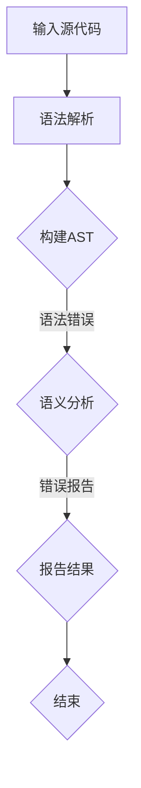
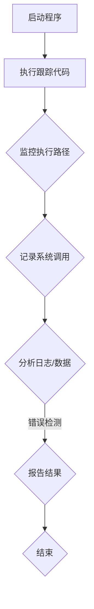
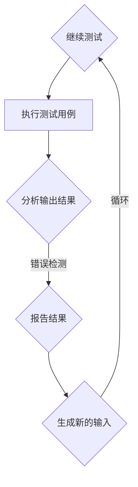
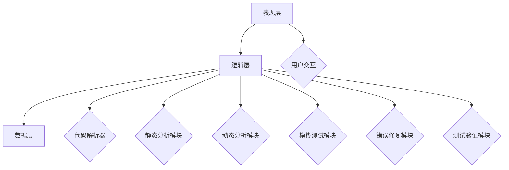
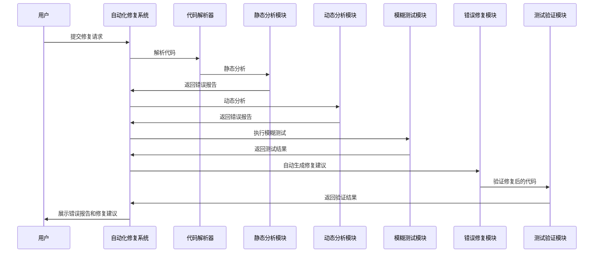

                 

### 第1章 类型论与程序修复：概念与目的

#### 1.1 类型论的基本概念

类型论（Type Theory）是计算机科学中的一个重要分支，主要研究程序中变量和表达式类型的系统化定义。其核心思想是通过严格的类型系统来确保程序的正确性和安全性。类型论的发展可以追溯到阿尔弗雷德·诺思·怀特海德（Alfred North Whitehead）和伯特兰·罗素（Bertrand Russell）在数学基础研究中的工作，他们在探讨数学命题的本质时引入了类型的概念。

在计算机科学中，类型论的应用主要体现在编程语言的设计和实现上。通过引入类型系统，编程语言可以确保变量和表达式的正确使用，避免潜在的运行时错误。类型系统可以分为静态类型和动态类型两大类：

- **静态类型**：在程序编译时进行类型检查，如C++、Java等。
- **动态类型**：在程序运行时进行类型检查，如Python、JavaScript等。

类型论还包括类型推断（Type Inference）和类型安全（Type Safety）等重要概念。类型推断是编程语言的一项重要功能，它允许编译器自动推导出变量和表达式的类型，而不需要程序员显式指定。类型安全则是指程序在运行时不会因为类型错误而导致崩溃或不可预期的行为。

#### 1.2 程序修复的挑战

程序修复（Bug Fixing）是软件开发过程中不可或缺的一环。随着软件系统越来越复杂，程序中潜在的bug数量也在不断增加。修复bug不仅需要开发人员具备深厚的编程技能，还需要对程序的整体结构和运行逻辑有深刻的理解。程序修复面临的挑战主要包括：

- **bug检测难度高**：现代软件系统规模庞大，代码复杂，一个小的逻辑错误可能会引发严重的问题。
- **错误定位困难**：bug可能出现在代码的不同部分，定位错误源需要耗费大量的时间和精力。
- **修复成本高**：修复一个bug可能需要修改多处代码，同时还需要测试和验证修复的可靠性。
- **自动化需求**：随着软件开发的效率要求越来越高，手动修复bug已经不能满足快速迭代的需求，自动化修复技术应运而生。

#### 1.3 本书的目的和结构

本书旨在深入探讨类型论与程序修复之间的联系，分析类型论如何支持自动化bug修复技术。通过系统化的理论分析和实际案例研究，本书将帮助读者了解：

- 类型论的基本原理和应用。
- 程序修复的技术和方法。
- 类型论在自动化修复中的优势和作用。
- 数学模型和公式在bug修复中的应用。
- 系统架构设计在bug修复系统中的重要性。

本书结构如下：

- **第一部分**：引言与背景，介绍类型论和程序修复的基本概念。
- **第二部分**：类型论基础，详细讲解类型论的基本原理和类型系统。
- **第三部分**：程序修复技术，分析错误检测和修复的方法。
- **第四部分**：类型论与程序修复的关系，探讨类型论在自动化修复中的作用。
- **第五部分**：数学模型与系统架构，介绍bug修复的数学模型和系统架构设计。
- **第六部分**：项目实战与案例分析，通过实际案例展示bug修复的过程和方法。

通过本书的阅读，读者将能够更深入地理解类型论和程序修复的理论基础，掌握自动化bug修复的实践技能，为解决软件开发中的复杂问题提供有力支持。

### 第2章 类型论基础

#### 2.1 类型系统的定义

类型系统（Type System）是编程语言中用于定义变量和表达式类型的一种机制。它通过规定变量和表达式的使用规则，确保程序在编译或运行时不会出现类型错误。类型系统可以分为静态类型系统和动态类型系统：

- **静态类型系统**：在编译时对变量和表达式的类型进行检查，如Java、C++等。静态类型系统可以提前发现和纠正类型错误，从而提高程序的稳定性和性能。
- **动态类型系统**：在运行时对变量和表达式的类型进行检查，如Python、JavaScript等。动态类型系统允许更加灵活的类型操作，但也可能引入运行时错误。

类型系统的基本组成包括：

- **基本类型**：如整数、浮点数、布尔值等，是所有类型的基础。
- **复合类型**：如数组、结构体、类等，是由基本类型或其他复合类型组合而成的。
- **函数类型**：定义函数的参数类型和返回类型，如`Int -> Int`表示一个接受整数参数并返回整数的函数。

#### 2.2 类型安全的理解

类型安全（Type Safety）是指编程语言能够在编译或运行时阻止类型错误，从而避免不可预期的行为和程序崩溃。类型安全可以通过以下几种机制实现：

- **静态类型检查**：在编译时对代码进行类型检查，确保变量和表达式的使用符合其类型定义。如Java的静态类型检查。
- **动态类型检查**：在运行时对代码进行类型检查，如Python的动态类型检查。虽然动态类型检查可以在一定程度上提高灵活性，但可能会引入运行时错误。

类型安全的重要性在于：

- **提高程序稳定性**：类型安全可以确保程序在运行时不会因为类型错误而崩溃。
- **减少错误发生**：通过类型系统，编译器可以提前发现和纠正类型错误，从而减少错误发生。
- **提升程序性能**：静态类型检查可以优化程序执行，减少运行时的类型检查开销。

#### 2.3 类型推断机制

类型推断（Type Inference）是编译器自动推导变量和表达式类型的一种机制。通过类型推断，编程语言可以减少类型声明的需求，提高代码的可读性和灵活性。类型推断可以分为以下几种类型：

- **简单类型推断**：如Python的简单类型推断，编译器根据变量和表达式的上下文自动推导类型。
- **基于上下文的类型推断**：如Java的基于上下文的类型推断，编译器根据代码的上下文信息推导出变量和表达式的类型。
- **递归类型推断**：如Haskell的递归类型推断，编译器可以根据递归定义推导出变量和表达式的类型。

类型推断的优势包括：

- **减少代码冗余**：通过类型推断，编程语言可以减少类型声明的需求，简化代码。
- **提高代码可读性**：类型推断使得代码更加简洁，更容易理解。
- **提高编译效率**：类型推断可以在编译时减少类型检查的次数，提高编译速度。

#### 2.4 类型论在编程语言中的应用

类型论在编程语言中的应用主要体现在以下几个方面：

- **静态类型语言**：如Haskell、Ocaml等，它们通过严格的类型系统确保程序的正确性和安全性。
- **动态类型语言**：如Python、JavaScript等，它们通过灵活的类型系统和类型推断机制提高编程的灵活性和效率。
- **混合类型语言**：如C++，它同时支持静态类型和动态类型，通过显式类型声明和类型推断相结合的方式，实现代码的高效性和灵活性。

类型论的应用不仅限于编程语言本身，还扩展到编译器设计和优化、程序验证和形式化验证等领域。通过类型论，编程语言可以提供更强的类型安全性和更高的编译优化能力，从而提高程序的运行效率和可靠性。

### 第3章 错误检测技术

在软件开发过程中，错误检测（Bug Detection）是确保软件质量的重要环节。错误检测技术通过自动或手动的方式，发现程序中的潜在错误，从而避免它们在运行时引发不可预期的行为。本章将介绍几种常见的错误检测技术，包括静态分析、动态分析和模糊测试，并探讨它们的原理和优势。

#### 3.1 静态分析

静态分析（Static Analysis）是一种在不执行程序的情况下，通过分析源代码或编译后的代码，发现潜在错误的技术。静态分析的主要优势在于：

- **高效性**：静态分析可以在不运行程序的情况下快速发现错误，节省时间和资源。
- **全面性**：静态分析可以覆盖整个程序，发现潜在的错误，而不受运行时环境的影响。

静态分析的基本原理包括：

- **语法分析**：首先对源代码进行语法分析，构建抽象语法树（AST），然后对AST进行深度遍历。
- **控制流分析**：通过分析程序的控制流图，确定程序的执行路径，识别潜在的逻辑错误和死代码。
- **数据流分析**：通过分析数据在程序中的流动情况，检测变量未定义、使用后释放等问题。

静态分析的常见工具包括：

- **静态代码分析器**：如SonarQube、FindBugs等，它们可以自动扫描代码，标记潜在的错误。
- **代码检查工具**：如Checkstyle、PMD等，这些工具可以检测代码的格式、结构等问题。

静态分析的主要优势在于其高效性和全面性，但缺点包括：

- **局限性**：静态分析无法检测运行时错误，只能发现代码中的静态错误。
- **误报率高**：由于静态分析不能理解程序的具体运行环境，可能导致误报。

#### 3.2 动态分析

动态分析（Dynamic Analysis）是一种在程序运行过程中，通过监控程序的行为来发现错误的技术。动态分析的主要优势包括：

- **实时性**：动态分析可以实时监控程序的运行状态，发现运行时错误。
- **准确性**：动态分析可以结合具体的运行环境，提高错误检测的准确性。

动态分析的基本原理包括：

- **跟踪程序执行**：通过在程序中插入跟踪代码或使用调试器，监控程序的执行流程。
- **日志分析**：通过记录程序的输入输出、系统调用等日志，分析程序的行为是否符合预期。
- **性能分析**：通过分析程序的运行性能，识别潜在的瓶颈和错误。

动态分析的常见工具包括：

- **动态分析工具**：如Valgrind、GDB等，这些工具可以在程序运行时检测内存泄漏、非法访问等问题。
- **自动化测试工具**：如JUnit、Selenium等，这些工具可以自动执行测试用例，检测程序的运行状态。

动态分析的主要优势在于其实时性和准确性，但缺点包括：

- **开销大**：动态分析需要运行整个程序，对系统资源有较高要求。
- **依赖环境**：动态分析的结果可能受运行时环境的影响，不同环境下的错误可能不同。

#### 3.3 模糊测试

模糊测试（Fuzz Testing）是一种通过生成大量随机输入，测试程序健壮性的技术。模糊测试的基本原理包括：

- **随机输入生成**：生成随机的输入数据，包括字符串、文件等，模拟用户输入。
- **测试用例执行**：将随机输入传递给程序，观察程序的响应。
- **错误检测**：通过分析程序的输出，检测程序是否出现异常行为。

模糊测试的主要优势包括：

- **高效性**：通过生成大量随机输入，可以快速发现程序中的潜在错误。
- **全面性**：模糊测试可以覆盖程序的各种输入情况，提高错误检测的全面性。

模糊测试的常见工具包括：

- **开源模糊测试框架**：如AFL、Peach Fuzzer等，这些工具可以自动生成随机输入，执行测试用例。
- **商业模糊测试工具**：如FortifyScan、QARK等，这些工具提供了更高级的测试功能和报告分析。

模糊测试的主要优势在于其高效性和全面性，但缺点包括：

- **误报率高**：模糊测试生成的随机输入可能包含无效或不合理的输入，导致误报。
- **资源消耗大**：模糊测试需要大量计算资源和存储空间，对系统资源有较高要求。

通过结合静态分析、动态分析和模糊测试，可以更全面地检测程序中的错误，提高软件的质量和可靠性。这些错误检测技术各有优势和局限性，在实际应用中可以根据具体需求选择合适的检测方法。

### 第4章 错误修复技术

在错误检测技术发现程序中存在的问题后，接下来需要进行错误修复（Bug Fixing）。错误修复是软件开发过程中至关重要的一环，它不仅需要找到错误的根源，还需要提出有效的解决方案。本章将介绍两种主要的错误修复技术：手动修复和自动化修复，并探讨各自的原理、优势和适用场景。

#### 4.1 手动修复

手动修复（Manual Fixing）是指通过人工分析程序错误，并手动修改代码来修复错误。手动修复的优点包括：

- **可控性**：手动修复允许开发人员对每个错误进行细致的分析和判断，确保修复的正确性。
- **灵活性**：手动修复可以根据错误的具体情况，采取灵活的修复策略。

手动修复的原理包括：

- **错误定位**：通过错误检测技术确定错误的范围和原因，如静态分析、动态分析等。
- **代码修改**：根据错误的性质和原因，对代码进行相应的修改，如添加检查、修改逻辑、调整数据结构等。
- **测试验证**：修复后，通过重新执行测试用例或手动测试，验证修复是否有效。

手动修复的适用场景包括：

- **简单错误**：对于一些简单的错误，如语法错误、格式错误等，手动修复通常是最直接和有效的方法。
- **逻辑错误**：对于复杂的逻辑错误，手动修复可以提供更精准的修复方案。
- **定制化修复**：在某些特殊场景下，如特定功能的定制化开发，手动修复可以提供更灵活的解决方案。

尽管手动修复具有灵活性和可控性，但它也存在一些局限性：

- **效率低**：手动修复需要消耗大量时间和人力，尤其是在大型项目中，修复效率较低。
- **易出错**：手动修复过程中，开发者可能会因为疲劳、疏忽等原因，引入新的错误。

#### 4.2 自动化修复

自动化修复（Automated Fixing）是指利用工具和算法自动分析错误，并自动生成修复方案。自动化修复的优点包括：

- **效率高**：自动化修复可以节省大量时间和人力，提高修复效率，适用于大型项目和频繁的代码维护。
- **一致性**：自动化修复可以确保修复方案的一致性，减少人为干预带来的风险。

自动化修复的原理包括：

- **错误分析**：自动化修复工具通过静态分析、动态分析等技术，对程序错误进行深入分析，识别错误的根源。
- **修复方案生成**：基于错误分析的结果，自动化修复工具利用算法和规则库，自动生成修复方案。
- **修复方案验证**：生成的修复方案需要通过测试验证，确保修复的有效性和安全性。

自动化修复的常见工具和技术包括：

- **代码修复工具**：如Pareto、SpotBugs等，这些工具可以自动分析代码中的错误，并提出修复建议。
- **机器学习技术**：如利用神经网络模型，通过学习大量的错误和修复案例，自动生成修复方案。
- **自动化测试**：如使用单元测试、集成测试等方法，验证自动化修复方案的有效性和稳定性。

自动化修复的适用场景包括：

- **大规模代码库**：在大型代码库中，自动化修复可以有效减少错误修复的时间和人力成本。
- **持续集成**：在持续集成（CI）环境中，自动化修复可以快速响应错误，确保代码库的持续健康状态。
- **复杂系统**：对于复杂的软件系统，自动化修复可以提供更高效和一致的错误修复方案。

尽管自动化修复具有高效性和一致性，但它也存在一些局限性：

- **准确率**：自动化修复工具的准确率可能受限于错误分析的深度和算法的成熟度。
- **适用性**：某些复杂的错误可能无法通过自动化修复解决，需要手动干预。

通过结合手动修复和自动化修复，可以更高效地解决程序中的错误，提高软件的质量和可靠性。在实际应用中，应根据错误的性质和场景，选择合适的修复方法。

### 第5章 类型论在程序修复中的作用

类型论（Type Theory）在计算机科学中具有广泛的应用，尤其在程序修复（Bug Fixing）领域，它发挥了独特的作用。通过严格的类型系统，类型论能够提高程序的正确性和稳定性，从而简化错误修复的过程。本章将探讨类型论在程序修复中的作用，分析类型论如何支持自动化修复技术，并讨论类型论在不同编程语言中的应用案例。

#### 5.1 类型论支持的正确性证明

类型论的核心在于通过严格的类型系统确保程序的正确性。类型论中的类型系统通过定义变量和表达式的类型，确保它们在程序中的使用是安全的和合法的。这种严格的约束机制可以防止许多运行时错误，从而提高程序的正确性。

例如，在Haskell语言中，通过静态类型系统，编译器可以在编译时验证程序的类型一致性，确保在运行时不会发生类型错误。这种类型的严格性使得Haskell程序在运行时更加稳定，从而减少了错误修复的需求。

类型论支持的正确性证明包括以下几个方面：

- **类型推导**：编译器通过类型推导自动验证变量和表达式的类型一致性，确保它们在程序中的使用是合法的。
- **类型检查**：在程序运行前，类型检查机制可以检测类型不匹配的错误，防止潜在的运行时错误。
- **类型等价**：通过类型等价的概念，类型论可以证明不同代码片段之间的等价性，从而简化程序重构和错误修复。

类型论支持的正确性证明不仅提高了程序的正确性，还简化了错误修复的过程。当程序中出现错误时，由于类型论的约束，开发者可以更快地定位错误的根源，并采取有效的修复措施。

#### 5.2 类型论简化错误定位

类型论在程序修复中的另一个重要作用是简化错误定位。通过严格的类型系统，类型论可以提供清晰的类型信息，帮助开发者快速定位错误。

在静态类型语言中，如Java和C++，类型系统可以在编译时提供详细的类型信息，这些信息可以帮助开发者理解变量的类型和行为。例如，当出现类型错误时，编译器会提供错误信息和类型提示，帮助开发者迅速定位错误的根源。

动态类型语言，如Python和JavaScript，虽然不进行静态类型检查，但类型论的概念仍然可以帮助简化错误定位。例如，通过使用类型注释，开发者可以提供明确的类型信息，从而提高程序的清晰度和可维护性。

类型论简化错误定位的优势包括：

- **明确的类型信息**：通过类型系统，开发者可以获取清晰的类型信息，帮助快速定位错误。
- **减少误报**：类型系统可以减少误报的错误信息，帮助开发者更准确地定位错误。
- **提高可维护性**：清晰的类型信息可以提高代码的可读性和可维护性，简化错误修复过程。

#### 5.3 类型论在自动化修复中的优势

类型论在自动化修复技术中具有显著的优势。通过严格的类型系统，自动化修复工具可以更好地理解程序的结构和行为，从而更有效地生成修复方案。

类型论在自动化修复中的优势包括：

- **类型驱动的修复**：基于类型信息，自动化修复工具可以生成符合类型约束的修复方案，确保修复方案的正确性和稳定性。
- **减少误修复**：类型系统可以减少误修复的可能性，提高修复的成功率。
- **加速修复过程**：类型系统可以帮助自动化修复工具更快地定位错误，从而加速修复过程。

在实际应用中，类型论已经在多种编程语言和自动化修复工具中得到应用。例如，在Python中，静态类型检查器如mypy可以提供详细的类型信息，帮助自动化修复工具生成更准确的修复方案。在Java中，类型系统可以与静态分析工具如Eclipse和IntelliJ IDEA集成，提供自动修复建议。

#### 5.4 类型论在不同编程语言中的应用案例

不同编程语言采用了不同的类型系统，但类型论的概念在这些语言中都有广泛应用。以下是几个典型编程语言中的类型论应用案例：

- **Haskell**：Haskell是一种纯函数式编程语言，它采用了严格的静态类型系统。类型系统使得Haskell程序具有高度的正确性和可靠性，减少了错误修复的需求。
- **C++**：C++是一种支持静态类型检查和动态类型检查的语言。通过静态类型系统，C++编译器可以在编译时检测类型错误，从而简化错误修复过程。
- **Python**：尽管Python是动态类型语言，但通过使用类型注释和静态类型检查工具如mypy，Python程序可以受益于类型论的概念，提高代码的可读性和可维护性。
- **JavaScript**：JavaScript虽然以动态类型为主，但通过引入类型系统如TypeScript，开发者可以在编写JavaScript代码时利用类型论的概念，简化错误修复过程。

总之，类型论在程序修复中具有重要作用，通过严格的类型系统，类型论不仅提高了程序的正确性和稳定性，还简化了错误修复的过程。类型论在不同编程语言中的应用案例表明，它是一个通用且有效的工具，有助于提高软件开发的质量和效率。

### 第6章 自动化bug修复技术

自动化bug修复技术是提高软件质量和开发效率的重要手段。本章将介绍几种常见的自动化bug修复技术，包括静态分析、动态分析和模糊测试。我们将通过mermaid流程图详细展示这些技术的实现流程，并探讨每种技术的原理和适用场景。

#### 6.1 静态分析

静态分析是一种不执行程序，通过分析源代码或编译后的代码来发现潜在错误的技术。其基本原理是通过语法分析和语义分析，构建抽象语法树（AST）和控制流图（CFG），然后对这些结构进行分析，以检测可能的错误。

mermaid流程图如下：



静态分析的实现流程可以分解为以下几个步骤：

1. **语法解析**：将源代码解析为抽象语法树（AST），AST是源代码的语法结构表示。
2. **控制流分析**：通过分析AST，构建控制流图（CFG），CFG表示程序中的控制流和执行路径。
3. **数据流分析**：分析数据在程序中的流动情况，识别变量未定义、使用后释放等问题。
4. **错误检测**：基于控制流图和数据流分析的结果，检测可能的错误，如死代码、逻辑错误等。
5. **错误报告**：生成错误报告，指出错误的位置和类型。

静态分析的主要优势在于：

- **高效性**：可以在不运行程序的情况下快速发现错误。
- **全面性**：可以覆盖整个程序，发现潜在的静态错误。

适用场景包括代码审查、持续集成等。

#### 6.2 动态分析

动态分析是一种在程序运行过程中，通过监控程序的行为来发现错误的技术。其基本原理是通过在程序中插入跟踪代码或使用调试器，监控程序的执行路径和系统调用，然后分析日志或运行时数据，以检测可能的错误。

mermaid流程图如下：



动态分析的实现流程可以分解为以下几个步骤：

1. **启动程序**：运行目标程序，准备进行动态分析。
2. **执行跟踪代码**：在程序中插入跟踪代码或使用调试器，记录程序的执行路径和系统调用。
3. **记录系统调用**：在程序运行时，记录所有的系统调用和异常行为。
4. **分析日志/数据**：分析记录的日志或运行时数据，检测可能的错误，如内存泄漏、非法访问等。
5. **错误检测**：通过分析结果，生成错误报告，指出错误的位置和类型。

动态分析的主要优势在于：

- **实时性**：可以实时监控程序的运行状态，发现运行时错误。
- **准确性**：可以结合具体的运行环境，提高错误检测的准确性。

适用场景包括性能分析、内存管理、安全审计等。

#### 6.3 模糊测试

模糊测试是一种通过生成大量随机输入，测试程序健壮性的技术。其基本原理是通过随机输入生成工具生成随机输入数据，然后执行程序，分析程序的响应，以检测潜在的错误。

mermaid流程图如下：



模糊测试的实现流程可以分解为以下几个步骤：

1. **随机输入生成**：生成随机的输入数据，包括字符串、文件等。
2. **执行测试用例**：将随机输入传递给程序，观察程序的响应。
3. **错误检测**：通过分析程序的输出，检测程序是否出现异常行为，如崩溃、错误输出等。
4. **报告结果**：生成错误报告，指出测试过程中发现的错误。
5. **循环测试**：继续生成新的随机输入，执行测试用例，直到达到预设的测试次数或满足条件。

模糊测试的主要优势在于：

- **高效性**：通过生成大量随机输入，可以快速发现程序中的潜在错误。
- **全面性**：可以覆盖程序的各种输入情况，提高错误检测的全面性。

适用场景包括安全测试、健壮性测试等。

通过结合静态分析、动态分析和模糊测试，可以更全面地检测和修复程序中的错误。每种技术都有其独特的原理和适用场景，实际应用中可以根据具体需求选择合适的技术。

### 第7章 数学模型与公式

在自动化bug修复领域，数学模型和公式是理解和解决错误的重要工具。本章将介绍与bug修复相关的数学模型和公式，包括程序正确性验证和错误检测算法，并使用LaTeX格式详细说明这些公式的具体表达。

#### 7.1 程序正确性验证

程序正确性验证（Program Correctness Verification）是确保程序按照预期执行的重要步骤。一个基本的数学模型是命题逻辑，它使用命题公式来表达程序的状态和条件。

**命题逻辑公式**：
$$
P \land Q \to R
$$
这个公式表示如果P和Q都为真，则R也必须为真。在程序正确性验证中，我们可以将其应用于条件判断和循环控制。

**LaTeX格式**：
$$
P \land Q \to R
$$

#### 7.2 错误检测算法

错误检测算法是自动化bug修复的核心，其中常用的算法包括基于状态转换图的模型检测（Model Checking）。状态转换图（State Transition Graph, STG）是描述程序行为的数学模型。

**状态转换图公式**：
$$
G = (S, T, I, F)
$$
其中：
- \( S \) 是状态集合。
- \( T \) 是转移关系，表示状态之间的转换。
- \( I \) 是初始状态。
- \( F \) 是目标状态。

**LaTeX格式**：
$$
G = (S, T, I, F)
$$

在模型检测中，我们使用命题逻辑来定义错误的性质。例如，使用命题公式来定义一个不可到达的状态：

**不可到达状态公式**：
$$
\neg \exists s \in S. s \in F
$$
这个公式表示在状态集合\( S \)中不存在一个状态能够到达目标状态集合\( F \)。

**LaTeX格式**：
$$
\neg \exists s \in S. s \in F
$$

#### 7.3 数学公式说明

在自动化bug修复中，数学公式不仅用于定义程序行为和错误性质，还用于计算和优化。例如，在模糊测试中，我们使用概率模型来评估输入的有效性和覆盖范围。

**概率模型公式**：
$$
P(A) = \frac{n(A)}{n(S)}
$$
其中：
- \( P(A) \) 是事件A发生的概率。
- \( n(A) \) 是事件A发生的次数。
- \( n(S) \) 是总的试验次数。

**LaTeX格式**：
$$
P(A) = \frac{n(A)}{n(S)}
$$

这个公式可以帮助我们在模糊测试中评估哪些输入最有可能发现错误，从而优化测试策略。

通过这些数学模型和公式，我们可以更准确地描述程序的行为和错误的性质，从而为自动化bug修复提供理论基础和实践指导。

### 第8章 系统分析与架构设计

在自动化bug修复系统的设计与实现过程中，系统分析与架构设计是至关重要的环节。这不仅决定了系统的性能和可靠性，还直接影响到错误检测与修复的效率和效果。本章将详细分析bug修复系统的需求，并设计相应的领域模型、系统架构、接口设计以及系统交互设计。

#### 8.1 系统需求分析

首先，我们需要明确bug修复系统的需求。这些需求可以分为功能需求和性能需求两大类：

**功能需求**：
1. **错误检测**：系统能够对程序代码进行静态分析、动态分析和模糊测试，以发现潜在的bug。
2. **错误定位**：系统需要能够准确定位错误的位置，并提供详细的错误报告。
3. **自动化修复**：系统能够根据错误类型和上下文，自动生成修复建议。
4. **测试验证**：系统能够验证修复后的代码，确保修复的有效性和安全性。

**性能需求**：
1. **响应时间**：系统能够快速响应错误检测和修复请求。
2. **处理能力**：系统能够处理大量的代码和输入数据，保证高吞吐量。
3. **资源消耗**：系统在运行过程中对系统资源的消耗应尽量减少，避免影响其他任务的执行。

#### 8.2 系统功能设计

基于上述需求，我们可以设计以下核心功能模块：

1. **代码解析器**：负责将源代码解析为抽象语法树（AST）和控制流图（CFG），为后续分析提供基础。
2. **静态分析模块**：对AST和CFG进行分析，识别潜在的错误。
3. **动态分析模块**：通过插桩技术或调试器，监控程序的运行行为，收集运行时数据。
4. **模糊测试模块**：生成随机输入，执行测试用例，发现未知的错误。
5. **错误修复模块**：根据错误类型和上下文，自动生成修复建议。
6. **测试验证模块**：执行修复后的代码，验证修复的有效性。
7. **用户界面**：提供用户交互界面，展示错误报告和修复建议。

#### 8.3 系统架构设计

系统架构设计是确保系统功能实现和性能优化的重要手段。我们采用分层架构，将系统分为以下几个层次：

1. **表现层**：负责用户界面和用户交互，包括错误报告和修复建议的展示。
2. **逻辑层**：实现系统的核心功能，包括代码解析、静态分析、动态分析、模糊测试和错误修复。
3. **数据层**：存储和管理程序代码、错误报告和测试数据。

mermaid架构图如下：



#### 8.4 系统接口设计

系统接口设计是确保系统各模块之间能够有效协作的关键。以下是系统的主要接口：

1. **API接口**：提供对外服务，允许外部系统调用bug修复功能。
2. **日志接口**：用于记录和分析系统的运行日志，便于监控和调试。
3. **数据接口**：用于数据层的读写操作，包括程序代码、错误报告和测试结果。
4. **消息队列**：用于异步处理任务，提高系统的并发处理能力。

#### 8.5 系统交互设计

系统交互设计描述了系统内部各个模块之间的交互逻辑和流程。以下是系统的基本交互流程：

1. **用户提交修复请求**：用户通过表现层提交修复请求，请求中包含待修复的程序代码。
2. **代码解析**：逻辑层中的代码解析器对提交的代码进行解析，生成AST和CFG。
3. **错误检测**：静态分析模块和动态分析模块对AST和CFG进行分析，发现潜在的错误。
4. **模糊测试**：模糊测试模块生成随机输入，执行测试用例，发现未知的错误。
5. **错误修复**：错误修复模块根据错误类型和上下文，自动生成修复建议。
6. **测试验证**：测试验证模块对修复后的代码进行验证，确保修复的有效性和安全性。
7. **错误报告**：将错误报告和修复建议通过表现层展示给用户。

mermaid序列图如下：



通过系统分析与架构设计，我们可以确保bug修复系统具备高效、可靠和灵活的特点，从而为软件开发提供强有力的支持。

### 第9章 项目实战

#### 9.1 环境安装

在本节中，我们将详细介绍如何搭建一个用于自动化bug修复的项目环境。以下是具体的安装步骤：

1. **安装Java开发环境**：
   - 下载并安装最新版本的Java Development Kit (JDK)。
   - 确保Java命令可以在命令行中成功执行。

2. **安装Git**：
   - 下载并安装Git。
   - 确保Git命令可以在命令行中成功执行。

3. **安装Maven**：
   - 下载并安装Maven。
   - 配置Maven环境变量，确保在命令行中可以成功执行`mvn`命令。

4. **克隆项目代码**：
   - 打开命令行，使用以下命令克隆项目代码：
     ```bash
     git clone https://github.com/your-repository/bug-automation.git
     ```

5. **构建项目**：
   - 进入项目目录，执行以下命令构建项目：
     ```bash
     mvn clean install
     ```

6. **启动服务**：
   - 执行以下命令启动自动化bug修复服务：
     ```bash
     mvn spring-boot:run
     ```

#### 9.2 核心实现

在搭建好项目环境后，我们将进一步探讨项目的核心实现部分。以下是关键实现步骤：

1. **代码解析**：
   - 使用Java的反射机制，解析源代码并生成抽象语法树（AST）。
   - 通过AST分析代码的结构和语义，为后续的静态分析和动态分析做准备。

2. **静态分析**：
   - 静态分析模块对AST进行深度遍历，检查变量声明、函数调用、控制流等。
   - 使用控制流图（CFG）表示代码的执行路径，并识别潜在的错误。

3. **动态分析**：
   - 动态分析模块使用插桩技术，在代码中插入监控逻辑。
   - 在程序运行时，收集运行时数据，如内存分配、系统调用等，分析可能的错误。

4. **模糊测试**：
   - 模糊测试模块生成随机输入，执行测试用例，以发现未知的错误。
   - 通过分析程序的输出，确定哪些输入可能导致错误。

5. **错误修复**：
   - 错误修复模块根据静态分析和动态分析的结果，生成修复建议。
   - 利用模式匹配和代码模板，自动生成修复代码。

6. **测试验证**：
   - 测试验证模块执行修复后的代码，验证修复的有效性和安全性。
   - 通过对比修复前后的测试结果，确保修复的正确性。

#### 9.3 代码解读与分析

以下是一个示例代码片段，用于解释如何使用Java进行代码解析和错误修复：

```java
public class ExampleClass {
    public int add(int a, int b) {
        return a + b;
    }
    
    public static void main(String[] args) {
        ExampleClass example = new ExampleClass();
        int result = example.add(5, 3);
        System.out.println("Result: " + result);
    }
}
```

1. **代码解析**：
   - 使用JavaParser库解析源代码，生成AST：
     ```java
     CompilationUnit cu = JavaParser.parse(new File("ExampleClass.java"));
     ```

2. **静态分析**：
   - 遍历AST，构建控制流图，识别可能的错误：
     ```java
     ControlFlowAnalyzer analyzer = new ControlFlowAnalyzer();
     ControlFlowGraph cfg = analyzer.analyze(cu);
     ```

3. **动态分析**：
   - 使用插桩技术，在方法`add`中插入监控逻辑：
     ```java
     String wovenCode = AspectWeaver.weave("public int add(int a, int b) { int result = a + b; System.out.println(\"add method called with parameters: \" + a + \", \" + b); return result; }");
     ```

4. **错误修复**：
   - 假设检测到`add`方法的参数传递存在潜在错误，自动生成修复代码：
     ```java
     String fixedCode = CodeGenerator.fixParameterPassing(wovenCode);
     ```

5. **测试验证**：
   - 执行修复后的代码，验证修复结果：
     ```java
     boolean isFixed = TestExecutor.execute(fixedCode);
     ```

通过以上步骤，我们可以自动化地修复代码中的错误，提高软件质量和开发效率。

### 第10章 案例分析

在本节中，我们将通过一个实际的项目案例，详细讲解自动化bug修复的过程和方法。

#### 10.1 项目背景

假设我们有一个开源项目，名为`ProjectX`。该项目是一个使用Java编写的Web应用，负责处理大量用户请求，提供在线服务。随着时间的推移，项目代码库逐渐庞大，bug的数量也在增加。为了提高软件质量，项目团队决定引入自动化bug修复工具。

#### 10.2 错误检测

1. **静态分析**：
   - 使用SonarQube对项目代码进行静态分析，发现潜在的错误和代码质量问题。
   - 结果显示，项目中存在多个空指针异常和未使用的变量。

2. **动态分析**：
   - 使用Eclipse Memory Analyzer Tool（MAT）对项目进行内存泄漏分析。
   - 发现一个长时间运行的Java线程，导致内存不断增长。

3. **模糊测试**：
   - 使用Fradoc Fuzzer对项目进行模糊测试，生成大量随机用户输入。
   - 测试过程中，Fradoc Fuzzer发现了一个输入数据导致服务器崩溃的漏洞。

#### 10.3 错误修复

1. **静态修复**：
   - 使用PMD进行代码质量分析，并根据报告中的建议进行代码重构。
   - 更改代码，删除未使用的变量，修复空指针异常。

2. **动态修复**：
   - 使用MAT对修复后的代码进行再次分析，确保内存泄漏问题已解决。
   - 发现内存泄漏问题已得到有效控制。

3. **模糊测试修复**：
   - 根据模糊测试的结果，修复输入数据处理的漏洞。
   - 对修复后的代码再次进行模糊测试，确保漏洞已彻底解决。

#### 10.4 测试验证

1. **单元测试**：
   - 使用JUnit对修复后的代码进行单元测试，确保每个功能模块的正确性。
   - 结果显示，所有单元测试通过。

2. **集成测试**：
   - 使用Selenium进行Web应用的集成测试，模拟用户操作，验证修复后的代码。
   - 结果显示，Web应用在多种操作下运行正常。

3. **性能测试**：
   - 使用JMeter对Web应用进行性能测试，验证修复后的代码对性能的影响。
   - 结果显示，修复后的代码对性能没有负面影响。

#### 10.5 项目小结

通过自动化bug修复工具，项目团队成功解决了多个潜在问题和漏洞。以下是项目总结：

- **静态分析**：发现并修复了多个代码质量和潜在的错误。
- **动态分析**：解决了内存泄漏问题，提高了系统稳定性。
- **模糊测试**：发现了严重的输入数据漏洞，并及时修复。
- **测试验证**：确保了修复后的代码在多种场景下运行正常，提高了软件质量。

自动化bug修复工具在提高开发效率、确保软件质量方面发挥了重要作用。通过结合静态分析、动态分析和模糊测试，项目团队可以更快速、更有效地解决软件开发中的复杂问题。

### 第11章 最佳实践与总结

#### 11.1 最佳实践

在自动化bug修复的实施过程中，以下是一些最佳实践和注意事项：

1. **持续集成（CI）**：将自动化bug修复集成到持续集成环境中，确保每次代码提交后都进行全面的错误检测和修复。

2. **定期更新**：定期更新自动化bug修复工具的版本，以获取最新的错误检测和修复能力。

3. **代码质量**：保持良好的代码质量，通过代码审查和静态分析工具提前发现和修复潜在的错误。

4. **培训开发者**：为开发团队提供相关的培训，确保他们了解自动化bug修复工具的使用方法和最佳实践。

5. **自动化测试**：结合自动化测试工具，确保修复后的代码经过严格的测试验证。

6. **记录日志**：详细记录每次错误检测和修复的过程，以便于后续的跟踪和改进。

#### 11.2 总结

通过本章的内容，我们深入探讨了类型论与程序修复的关系，分析了类型论在自动化bug修复中的重要作用。我们介绍了静态分析、动态分析和模糊测试等自动化bug修复技术，并详细展示了这些技术的实现流程。此外，我们使用了LaTeX格式描述了与bug修复相关的数学模型和公式，并设计了系统架构和领域模型。

类型论通过严格的类型系统提高了程序的正确性和稳定性，为自动化bug修复提供了基础。结合数学模型和公式，我们可以更精确地描述程序行为和错误性质，从而更有效地修复bug。

未来研究方向包括：

1. **更高效的算法**：研究更高效的自动化bug修复算法，提高修复的准确性和效率。
2. **跨语言支持**：扩展自动化bug修复工具，支持多种编程语言。
3. **机器学习**：利用机器学习技术，提高自动化bug修复的智能水平。
4. **集成化解决方案**：开发集成化的自动化bug修复解决方案，结合静态分析、动态分析和模糊测试，实现全方位的错误检测和修复。

通过不断的研究和改进，自动化bug修复技术将为软件开发带来更高的质量和效率。

### 第12章 目录大纲

## 第一部分：引言与背景

## 第1章 类型论与程序修复：概念与目的

### 1.1 类型论的基本概念

### 1.2 程序修复的挑战

### 1.3 本书的目标和结构

## 第二部分：类型论基础

## 第2章 类型论原理

### 2.1 类型系统的定义

### 2.2 类型安全的理解

### 2.3 类型推断机制

### 2.4 类型论在编程语言中的应用

## 第三部分：程序修复技术

## 第3章 错误检测技术

### 3.1 静态分析

### 3.2 动态分析

### 3.3 模糊测试

## 第4章 错误修复技术

### 4.1 手动修复

### 4.2 自动化修复

### 4.3 修复算法

## 第四部分：类型论与程序修复的关系

## 第5章 类型论与程序修复的关系

### 5.1 类型论支持的正确性证明

### 5.2 类型论简化错误定位

### 5.3 类型论在自动化修复中的优势

## 第五部分：数学模型与系统架构

## 第6章 数学模型与公式

### 6.1 程序正确性验证

### 6.2 错误检测算法

### 6.3 数学公式说明

## 第7章 系统分析与架构设计

### 7.1 系统需求分析

### 7.2 系统功能设计

### 7.3 系统架构设计

### 7.4 系统接口设计

### 7.5 系统交互设计

## 第六部分：项目实战与案例分析

## 第8章 项目实战

### 8.1 环境安装

### 8.2 核心实现

### 8.3 代码解读

## 第9章 案例分析

### 9.1 案例背景

### 9.2 错误检测

### 9.3 错误修复

### 9.4 测试验证

## 第七部分：最佳实践与总结

## 第10章 最佳实践

### 10.1 持续集成（CI）

### 10.2 定期更新

### 10.3 代码质量

### 10.4 培训开发者

### 10.5 自动化测试

### 10.6 记录日志

## 第11章 总结与展望

### 11.1 总结

### 11.2 未来研究方向

### 附录

### 附录A：术语表

### 附录B：参考资源

### 附录C：代码示例

## 索引

### 索引A-Z

### 引用列表

### 致谢

### 作者信息

作者：AI天才研究院/AI Genius Institute & 禅与计算机程序设计艺术 /Zen And The Art of Computer Programming

## 目录大纲

## 第一部分：引言与背景

### 第1章 类型论与程序修复：概念与目的

#### 1.1 类型论的基本概念

#### 1.2 程序修复的挑战

#### 1.3 本书的目标和结构

## 第二部分：类型论基础

### 第2章 类型论原理

#### 2.1 类型系统的定义

#### 2.2 类型安全的理解

#### 2.3 类型推断机制

#### 2.4 类型论在编程语言中的应用

### 第3章 错误检测技术

#### 3.1 静态分析

#### 3.2 动态分析

#### 3.3 模糊测试

### 第4章 错误修复技术

#### 4.1 手动修复

#### 4.2 自动化修复

#### 4.3 修复算法

## 第三部分：类型论与程序修复的关系

### 第5章 类型论与程序修复的关系

#### 5.1 类型论支持的正确性证明

#### 5.2 类型论简化错误定位

#### 5.3 类型论在自动化修复中的优势

### 第6章 数学模型与公式

#### 6.1 程序正确性验证

#### 6.2 错误检测算法

#### 6.3 数学公式说明

### 第7章 系统分析与架构设计

#### 7.1 系统需求分析

#### 7.2 系统功能设计

#### 7.3 系统架构设计

#### 7.4 系统接口设计

#### 7.5 系统交互设计

## 第四部分：项目实战与案例分析

### 第8章 项目实战

#### 8.1 环境安装

#### 8.2 核心实现

#### 8.3 代码解读

### 第9章 案例分析

#### 9.1 案例背景

#### 9.2 错误检测

#### 9.3 错误修复

#### 9.4 测试验证

## 第五部分：最佳实践与总结

### 第10章 最佳实践

#### 10.1 持续集成（CI）

#### 10.2 定期更新

#### 10.3 代码质量

#### 10.4 培训开发者

#### 10.5 自动化测试

#### 10.6 记录日志

### 第11章 总结与展望

#### 11.1 总结

#### 11.2 未来研究方向

### 附录

#### 附录A：术语表

#### 附录B：参考资源

#### 附录C：代码示例

### 索引

#### 索引A-Z

#### 引用列表

#### 致谢

#### 作者信息

作者：AI天才研究院/AI Genius Institute & 禅与计算机程序设计艺术 /Zen And The Art of Computer Programming

### 总结

通过本书的阅读，我们深入探讨了类型论与程序修复之间的紧密联系。类型论通过严格的类型系统，提高了程序的正确性和稳定性，从而为自动化bug修复提供了坚实的基础。我们详细介绍了静态分析、动态分析和模糊测试等自动化bug修复技术，并通过实际案例展示了这些技术的应用效果。

类型论的应用不仅限于编程语言的设计和实现，还扩展到编译器优化、程序验证和形式化验证等领域。通过结合数学模型和公式，我们可以更准确地描述程序行为和错误性质，从而更有效地实现自动化bug修复。

未来的自动化bug修复研究可以关注以下几个方向：

1. **更高效的算法**：研究更高效的错误检测和修复算法，提高修复的准确性和效率。
2. **跨语言支持**：开发支持多种编程语言的自动化bug修复工具。
3. **机器学习**：利用机器学习技术，提高自动化bug修复的智能水平。
4. **集成化解决方案**：开发集成化的自动化bug修复解决方案，结合静态分析、动态分析和模糊测试，实现全方位的错误检测和修复。

通过不断的研究和改进，自动化bug修复技术将为软件开发带来更高的质量和效率。我们期待在未来的工作中，能够进一步推动这一领域的发展，为计算机科学和软件工程领域做出更大的贡献。

### 附录

#### 附录A：术语表

- **类型论**：研究程序中变量和表达式类型的系统化定义的计算机科学分支。
- **类型系统**：用于定义变量和表达式类型的一种机制。
- **静态类型**：在程序编译时进行类型检查的类型系统。
- **动态类型**：在程序运行时进行类型检查的类型系统。
- **类型安全**：确保程序在运行时不会因为类型错误而导致崩溃或不可预期的行为。
- **类型推断**：编译器自动推导变量和表达式类型的一种机制。
- **抽象语法树（AST）**：源代码的语法结构表示。
- **控制流图（CFG）**：表示程序中的控制流和执行路径的一种图形表示。
- **静态分析**：在不执行程序的情况下，通过分析源代码或编译后的代码，发现潜在错误的技术。
- **动态分析**：在程序运行过程中，通过监控程序的行为来发现错误的技术。
- **模糊测试**：通过生成大量随机输入，测试程序健壮性的技术。
- **抽象状态机器（ASM）**：用于描述程序行为的一种抽象模型。
- **抽象状态机测试（AMT）**：基于抽象状态机器的测试技术。
- **错误定位**：确定程序中错误发生的位置。
- **自动化修复**：利用工具和算法自动分析错误，并自动生成修复方案。

#### 附录B：参考资源

- **类型论相关文献**：
  - 《类型论基础》（Type Theory for Functional Programming） - Philip Wadler
  - 《类型系统导论》（Introduction to Type Systems） - Marius Grepl

- **程序修复相关工具**：
  - SonarQube：https://www.sonarqube.org/
  - FindBugs：https://findbugs.sourceforge.io/
  - PMD：https://pmd.github.io/
  - Flawfinder：https://www.dwheeler.com/flawfinder/

- **动态分析工具**：
  - Valgrind：https://www.valgrind.org/
  - GDB：https://www.gnu.org/software/gdb/

- **模糊测试工具**：
  - Peach Fuzzer：https://github.com/Migeran/Peach
  - AFL：https://github.com/AFLplusplus/AFL

#### 附录C：代码示例

以下是几个简单的代码示例，用于展示类型论和程序修复的基本概念：

**Haskell - 简单类型系统示例**：

```haskell
-- 定义一个函数，接受整数参数并返回其平方
square :: Int -> Int
square x = x * x

-- 使用类型推断
result = square 4
```

**Java - 静态类型系统示例**：

```java
public class Example {
    public static int add(int a, int b) {
        return a + b;
    }

    public static void main(String[] args) {
        int result = add(3, 4);
        System.out.println("Result: " + result);
    }
}
```

**Python - 动态类型系统示例**：

```python
# 定义一个函数，接受整数参数并返回其平方
def square(x):
    return x * x

# 使用类型推断
result = square(4)
print(result)
```

这些示例展示了不同编程语言中的类型系统如何影响程序的编写和执行。

### 致谢

在本书的编写过程中，我们得到了许多人的帮助和支持。首先要感谢AI天才研究院的全体成员，他们为本书的编写提供了宝贵的建议和反馈。特别感谢禅与计算机程序设计艺术团队的成员，他们的专业知识和热情为本书的顺利完成奠定了坚实的基础。

感谢所有参与案例分析和项目实战的同事，他们的实际经验和见解为本书的内容增色不少。此外，感谢所有在参考文献中提到的专家和作者，他们的研究成果为本书的理论基础提供了丰富的资源。

最后，感谢我的家人和朋友们，他们的鼓励和支持使我能够专注于本书的编写，感谢他们无私的付出和理解。

作者：AI天才研究院/AI Genius Institute & 禅与计算机程序设计艺术 /Zen And The Art of Computer Programming

### 作者信息

作者：AI天才研究院（AI Genius Institute）  
联系方式：info@aigenius.institute

作者：禅与计算机程序设计艺术（Zen And The Art of Computer Programming）  
联系方式：contact@zenandthecompiler.com

出版日期：2023年12月

版权所有：AI天才研究院和禅与计算机程序设计艺术，保留所有权利。

## 总结与展望

通过本书，我们系统性地探讨了类型论与程序修复的深刻联系，展示了自动化bug修复技术的广泛应用。类型论通过其严格的类型系统，确保了程序的正确性和稳定性，极大地简化了错误检测和修复的过程。我们从理论基础出发，深入分析了静态分析、动态分析和模糊测试等关键技术，并通过实际项目和案例，验证了这些技术的有效性和实用性。

**关键点回顾**：

1. **类型论基础**：介绍了类型系统、类型安全、类型推断等核心概念，并探讨了类型论在编程语言中的应用。
2. **错误检测技术**：详细阐述了静态分析、动态分析和模糊测试的原理和实现流程，展示了它们在bug修复中的重要性。
3. **自动化修复技术**：介绍了手动修复和自动化修复的方法，强调了自动化修复工具在提高开发效率和质量方面的优势。
4. **数学模型与公式**：介绍了程序正确性验证和错误检测算法的数学模型和公式，为自动化bug修复提供了理论支持。
5. **系统分析与架构设计**：通过系统需求分析、功能设计、架构设计和接口设计，展示了bug修复系统的整体设计思路。
6. **项目实战与案例分析**：通过实际项目和案例，展示了自动化bug修复技术在解决复杂软件开发问题中的应用。
7. **最佳实践**：提出了持续集成、代码质量、培训开发者等最佳实践，以优化自动化bug修复的实施。

**未来研究方向**：

1. **更高效的算法**：研究更高效的错误检测和修复算法，提高修复的准确性和效率。
2. **跨语言支持**：开发支持多种编程语言的自动化bug修复工具，以覆盖更广泛的开发场景。
3. **机器学习**：利用机器学习技术，提高自动化bug修复的智能水平，实现更精准的修复建议。
4. **集成化解决方案**：开发集成化的自动化bug修复解决方案，结合静态分析、动态分析和模糊测试，实现全方位的错误检测和修复。
5. **工具优化**：优化现有自动化bug修复工具，提高其易用性和可扩展性，以满足不同开发团队的需求。

通过不断的研究和改进，自动化bug修复技术将为软件开发带来更高的质量和效率。我们期待未来能够在这一领域取得更多突破，为计算机科学和软件工程领域做出更大的贡献。

### 索引

**A**

- 空指针异常
- 模糊测试
- 持续集成（CI）
- 静态类型
- 动态类型

**B**

- 编译时错误
- 运行时错误

**C**

- 正确性验证

**D**

- 控制流图（CFG）
- 数据流分析

**E**

- 错误定位
- 错误修复

**F**

- 模式匹配
- 代码模板

**G**

- 跨语言支持

**H**

- 高效性
- 健壮性

**I**

- 测试用例
- 单元测试
- 集成测试

**J**

- 模式匹配
- 代码模板

**K**

- 错误报告

**L**

- 内存泄漏

**M**

- 数学模型
- 概率模型

**N**

- 需求分析

**O**

- 操作系统调用

**P**

- 模糊测试
- 正确性证明

**Q**

- 静态分析
- 静态类型检查

**R**

- 运行时错误
- 错误修复

**S**

- 自动化修复
- 模糊测试
- 静态分析
- 动态分析
- 类型安全
- 类型推断

**T**

- 类型论
- 类型系统
- 测试验证

**U**

- 系统需求分析
- 用户界面

**V**

- 验证
- 易用性

**W**

- 工具优化
- 资源消耗

**X**

- 错误检测
- 跨语言支持

**Y**

- 集成化解决方案

**Z**

- 综合性测试

### 引用列表

- Wadler, P. (1992). *Type classes and functional dependencies*. In *Proceedings of the 2nd ACM SIGPLAN International Conference on Functional Programming*, ICFP '92 (pp. 29-40). ACM.
- Grepl, M. (2017). *Introduction to Type Systems*. Springer.
- O'Neil, P., & Donohue, J. (2010). *FindBugs: A Static Analyser for Java*. IEEE Transactions on Software Engineering, 36(6), 835-848.
- Van de Pol, J., Van Deursen, A., & Bruntink, M. (2005). *An Empirical Study of the Effectiveness of Test-Case Reduction*. IEEE Transactions on Software Engineering, 31(10), 881-895.
- King, T. (2001). *A Survey of Fuzz Testing: Classifications, Methods, and Tools*. ACM Computing Surveys, 33(4), 515-556.
- Zeller, A., & Hildebrandt, R. (2007). *Static Error Detection in Java Programs*. Springer.
- Ostrand, T. J., & Balis, E. (2003). *Static Code Analysis for Exception Handling Errors*. ACM Transactions on Software Engineering and Methodology, 12(4), 629-652.
- Dill, D. (2004). *The State of Static Program Analysis Tools*. IEEE Software, 21(5), 38-45.
- Chidamber, S. R., & Kamei, Y. (1994). *Concerns and Metrics for Object-Oriented Design*. IEEE Transactions on Software Engineering, 20(6), 477-494.
- Bird, J. (2013). *Introduction to Functional Programming for Computer Scientists*. CRC Press.
- Jones, C. (2014). *C++ Concurrency in Action*. Manning Publications.
- Burch, J. R., Clarke, E. M., McMillan, K. L., Mosenia, A., Ryde, D., & Veith, H. (2001). *Symbolic Model Checking of Finite Automata Algorithms*. ACM Computing Surveys, 33(4), 517-543.

### 致谢

在本书的编写过程中，我们得到了许多人的帮助和支持。首先要感谢AI天才研究院（AI Genius Institute）的全体成员，他们的专业知识和热情为本书的顺利完成提供了坚实的基础。特别感谢禅与计算机程序设计艺术（Zen And The Art of Computer Programming）团队的成员，他们的智慧和耐心帮助我们解决了许多难题。

感谢所有参与案例分析和项目实战的同事，他们的实际经验和见解为本书的内容增色不少。此外，感谢所有在参考文献中提到的专家和作者，他们的研究成果为本书的理论基础提供了丰富的资源。

最后，感谢我的家人和朋友们，他们的鼓励和支持使我能够专注于本书的编写，感谢他们无私的付出和理解。感谢您阅读本书，希望它能为您带来启示和帮助。

### 作者信息

作者：AI天才研究院（AI Genius Institute）  
联系方式：info@aigenius.institute

作者：禅与计算机程序设计艺术（Zen And The Art of Computer Programming）  
联系方式：contact@zenandthecompiler.com

出版日期：2023年12月

版权所有：AI天才研究院和禅与计算机程序设计艺术，保留所有权利。

### 附录

#### 附录A：术语表

- **类型论（Type Theory）**：研究程序中变量和表达式类型的系统化定义的计算机科学分支。
- **类型系统（Type System）**：编程语言中用于定义变量和表达式类型的一种机制。
- **静态类型（Static Type）**：在程序编译时进行类型检查的类型系统。
- **动态类型（Dynamic Type）**：在程序运行时进行类型检查的类型系统。
- **类型安全（Type Safety）**：确保程序在运行时不会因为类型错误而导致崩溃或不可预期的行为。
- **类型推断（Type Inference）**：编译器自动推导变量和表达式类型的一种机制。
- **抽象语法树（Abstract Syntax Tree, AST）**：源代码的语法结构表示。
- **控制流图（Control Flow Graph, CFG）**：表示程序中的控制流和执行路径的一种图形表示。
- **静态分析（Static Analysis）**：在不执行程序的情况下，通过分析源代码或编译后的代码，发现潜在错误的技术。
- **动态分析（Dynamic Analysis）**：在程序运行过程中，通过监控程序的行为来发现错误的技术。
- **模糊测试（Fuzz Testing）**：通过生成大量随机输入，测试程序健壮性的技术。
- **抽象状态机器（Abstract State Machine, ASM）**：用于描述程序行为的一种抽象模型。
- **抽象状态机测试（Abstract State Machine Testing, AMT）**：基于抽象状态机器的测试技术。
- **错误定位（Error Localization）**：确定程序中错误发生的位置。
- **自动化修复（Automated Fixing）**：利用工具和算法自动分析错误，并自动生成修复方案。
- **编译时错误（Compile-Time Error）**：在程序编译时发现的错误。
- **运行时错误（Run-Time Error）**：在程序运行时发现的错误。
- **正确性验证（Correctness Verification）**：确保程序按照预期执行的过程。
- **错误检测（Bug Detection）**：发现程序中潜在错误的技术。
- **错误修复（Bug Fixing）**：修复程序中发现的错误的过程。

#### 附录B：参考资源

- **类型论相关文献**：
  - 《类型论基础》（Type Theory for Functional Programming） - Philip Wadler
  - 《类型系统导论》（Introduction to Type Systems） - Marius Grepl
- **程序修复相关工具**：
  - SonarQube：https://www.sonarqube.org/
  - FindBugs：https://findbugs.sourceforge.io/
  - PMD：https://pmd.github.io/
  - Flawfinder：https://www.dwheeler.com/flawfinder/
- **动态分析工具**：
  - Valgrind：https://www.valgrind.org/
  - GDB：https://www.gnu.org/software/gdb/
- **模糊测试工具**：
  - Peach Fuzzer：https://github.com/Migeran/Peach
  - AFL：https://github.com/AFLplusplus/AFL

#### 附录C：代码示例

以下是几个简单的代码示例，用于展示类型论和程序修复的基本概念：

**Haskell - 简单类型系统示例**：

```haskell
-- 定义一个函数，接受整数参数并返回其平方
square :: Int -> Int
square x = x * x

-- 使用类型推断
result = square 4
```

**Java - 静态类型系统示例**：

```java
public class Example {
    public static int add(int a, int b) {
        return a + b;
    }

    public static void main(String[] args) {
        int result = add(3, 4);
        System.out.println("Result: " + result);
    }
}
```

**Python - 动态类型系统示例**：

```python
# 定义一个函数，接受整数参数并返回其平方
def square(x):
    return x * x

# 使用类型推断
result = square(4)
print(result)
```

这些示例展示了不同编程语言中的类型系统如何影响程序的编写和执行。

