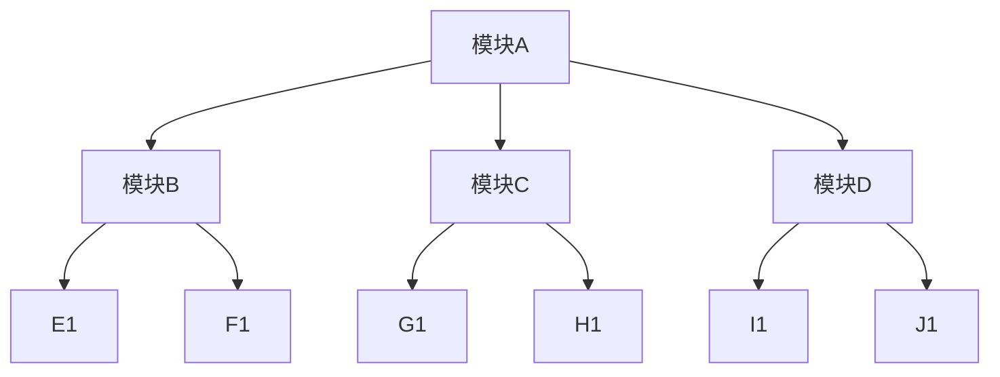
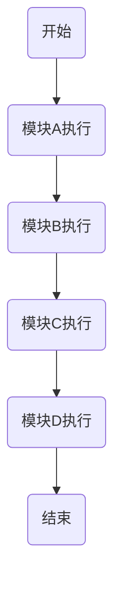
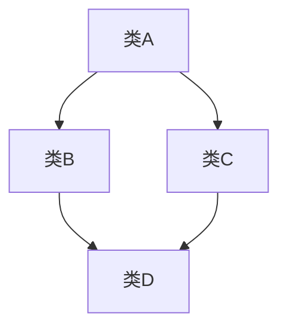
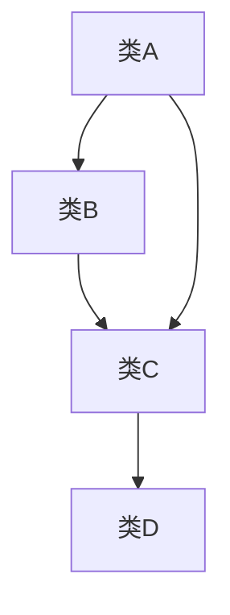
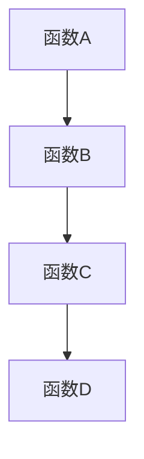
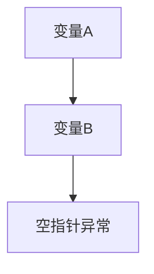
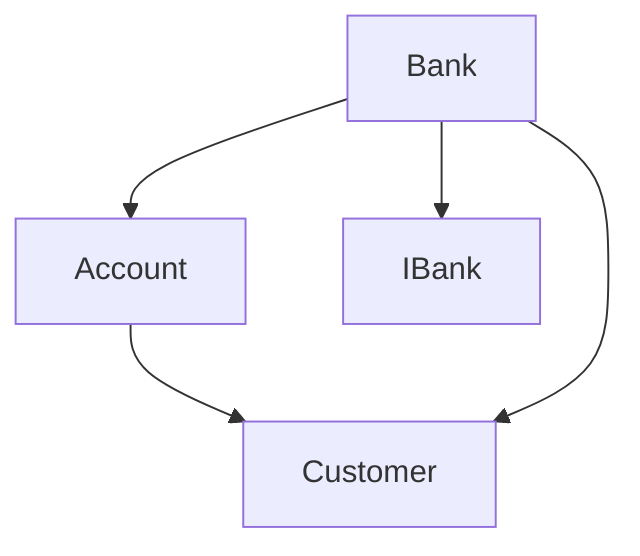
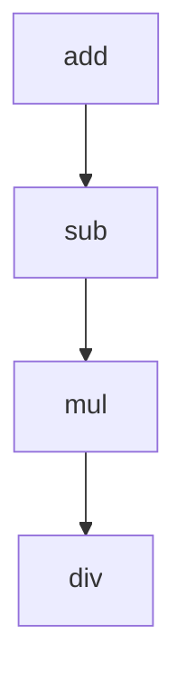
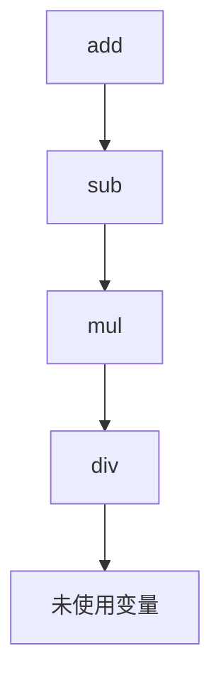

                 

## 类型论与程序可视化：代码结构的图形表示

关键词：类型论、程序可视化、代码结构、图形表示、编程语言、软件开发

摘要：本文深入探讨了类型论与程序可视化之间的联系，揭示了如何通过图形表示来直观地展示代码结构。首先，我们简要介绍了类型论的基础知识，包括其定义、核心概念以及类型系统的重要性。随后，我们探讨了程序可视化的基础，阐述了可视化技术的基本原理和常用工具。接着，文章展示了类型论与程序可视化在程序结构可视化、类型依赖可视化和静态代码分析中的应用场景。通过具体案例研究，我们进一步阐述了这些技术的实际应用。最后，文章展望了类型论与程序可视化的发展趋势，探讨了未来的挑战与机遇。

### 目录大纲

1. 第一部分：类型论基础
    1.1 类型论概述
    1.2 类型论的核心概念
    1.3 程序可视化基础
2. 第二部分：类型论与程序可视化的应用场景
    2.1 程序结构可视化
    2.2 类型依赖可视化
    2.3 静态代码分析
3. 第三部分：案例研究
    3.1 Java程序类型依赖可视化
    3.2 Python程序的静态代码分析
4. 第四部分：进阶主题
    4.1 类型论的高级概念
    4.2 可视化技术的进阶应用
    4.3 跨领域应用
5. 第五部分：未来展望
    5.1 类型论与程序可视化的发展趋势
    5.2 挑战与机遇
6. 附录
    6.1 工具与资源
    6.2 参考文献

### 第一部分：类型论基础

#### 1.1 类型论概述

类型论是计算机科学中的一个重要分支，主要研究程序中的类型系统。类型论的基本目标是确保程序的正确性，提高程序的可靠性和可维护性。随着编程语言的复杂性和多样性不断增加，类型论在编程语言设计和软件工程中扮演着越来越重要的角色。

##### 1.1.1 问题背景

在软件开发过程中，代码结构的复杂性是一个不可忽视的问题。复杂的项目往往包含大量的模块和函数，这些模块和函数之间存在着复杂的依赖关系。这种复杂性不仅增加了开发难度，也影响了代码的可维护性和可扩展性。为了解决这一问题，我们需要一种有效的方法来展示和理解代码结构，这就是程序可视化的用武之地。

##### 1.1.2 类型论的定义

类型论可以定义为研究程序中变量、表达式和函数的类型系统的理论。类型系统是一种语法结构，它通过定义变量的类型来确保程序的正确性。在类型论中，类型是一个重要的概念，它用于描述变量、表达式和函数的属性和约束。

##### 1.1.3 类型论与程序可视化的关系

类型论与程序可视化有着密切的关系。类型论提供了程序结构的一种抽象表示，而程序可视化则将这种抽象表示转化为直观的图形表示。通过程序可视化，我们可以更直观地理解代码的结构和依赖关系，从而提高代码的可维护性和可扩展性。

### 1.2 类型论的核心概念

类型论的核心概念包括类型系统、类型属性和类型推导。这些概念构成了类型论的基础，也是我们理解类型论的关键。

##### 1.2.1 类型系统

类型系统是类型论的核心概念。它定义了程序中变量的类型，以及如何对这些类型进行操作。类型系统可以分为静态类型系统和动态类型系统。静态类型系统在编译时检查类型，而动态类型系统在运行时检查类型。

##### 1.2.2 类型系统的属性

类型系统的属性包括表达能力、安全性和性能。表达能力决定了类型系统能否准确地描述程序的语义。安全性确保了程序在运行时不会出现类型错误。性能则决定了类型系统的效率。

##### 1.2.3 类型推导

类型推导是类型论中另一个重要的概念。它是指从程序中的表达式推导出其类型的过程。类型推导算法可以是基于规则的，也可以是基于约束的。类型推导有助于提高程序的可靠性和可维护性。

### 1.3 程序可视化基础

程序可视化是将程序的抽象结构转化为直观图形表示的技术。它有助于我们更直观地理解程序的结构和依赖关系。程序可视化可以分为程序结构可视化、类型依赖可视化和静态代码分析。

##### 1.3.1 可视化技术的概述

可视化技术是通过图形化方式展示数据和信息的方法。在程序可视化中，常用的可视化技术包括层次结构可视化、流程图可视化和依赖关系可视化等。

##### 1.3.2 可视化工具与框架

在程序可视化中，常用的工具和框架包括 Graphviz、Mermaid、D3.js 等。这些工具和框架提供了丰富的图形表示和交互功能，使我们能够更直观地理解程序的结构和依赖关系。

##### 1.3.3 可视化算法

可视化算法是将程序的抽象结构转化为图形表示的过程。常见的可视化算法包括层次结构算法、流程图算法和依赖关系算法等。这些算法的性能优化是程序可视化研究的一个重要方向。

### 第二部分：类型论与程序可视化的应用场景

类型论与程序可视化在软件开发中有着广泛的应用场景。通过图形表示，我们可以更直观地理解代码的结构和依赖关系，从而提高代码的可维护性和可扩展性。

#### 2.1 程序结构可视化

程序结构可视化是将程序的结构以图形化的方式展示出来。它可以帮助我们理解程序的模块划分、函数调用关系以及变量作用域等。

##### 2.1.1 层次结构可视化

层次结构可视化是一种常见的程序结构可视化方法。它通过树形结构展示程序的模块划分和层次关系。层次结构可视化可以帮助我们理解程序的模块化和层次化设计。

上述Mermaid图展示了模块A、B、C和D及其子模块E、F、G、H和I、J的层次结构。

##### 2.1.2 流程图可视化

流程图可视化是一种展示程序流程和执行顺序的方法。它可以帮助我们理解程序的执行流程和逻辑关系。

上述Mermaid图展示了程序的执行流程，从开始到结束，依次执行模块A、B、C和D。

#### 2.2 类型依赖可视化

类型依赖可视化是将程序中类型之间的依赖关系以图形化的方式展示出来。它可以帮助我们理解类型之间的关联和依赖，从而优化代码结构。

##### 2.2.1 类型关系的表示

类型关系可以表示为类图、序列图或依赖图等。下面是一个使用Mermaid表示的类型依赖图：

上述Mermaid图展示了类A、B、C和D之间的依赖关系。类A依赖类B和类C，类B和类C都依赖类D。

##### 2.2.2 类型冲突的检测

通过类型依赖可视化，我们可以更容易地检测类型冲突。例如，在一个依赖图中，如果类A依赖类B，而类B依赖类C，但类A又依赖类C，则存在类型冲突。

在这个依赖图中，类A同时依赖类B和类C，但类C又依赖类D，这会导致类型冲突。通过可视化，我们可以更容易地发现并解决这类冲突。

#### 2.3 静态代码分析

静态代码分析是一种在程序运行之前分析代码的技术。它可以帮助我们评估代码的质量、发现潜在的错误和优化代码结构。

##### 2.3.1 代码质量的评估

通过静态代码分析，我们可以评估代码的质量。常见的评估指标包括代码行数、函数复杂度、循环嵌套深度等。这些指标可以帮助我们识别代码中的潜在问题。

上述Mermaid图展示了函数A、B、C和D之间的调用关系。通过分析这些函数的调用关系，我们可以评估代码的质量和结构。

##### 2.3.2 代码缺陷的发现

通过静态代码分析，我们可以发现代码中的潜在缺陷。常见的缺陷包括未使用的变量、空指针异常、数据类型不一致等。这些缺陷可能会导致程序运行时出现错误。

在这个示例中，变量A和变量B之间存在依赖关系，但变量B未被使用，这可能会导致空指针异常。通过静态代码分析，我们可以发现这类潜在的问题。

### 第三部分：案例研究

为了更好地理解类型论与程序可视化的实际应用，我们通过两个案例来展示这些技术的具体实现和应用。

#### 3.1 Java程序类型依赖可视化

在本案例中，我们将使用Java程序来展示类型依赖可视化。我们选择一个简单的Java项目，包含多个类和接口，通过类型依赖图来展示这些类和接口之间的依赖关系。

##### 3.1.1 案例介绍

本案例选择了一个简单的银行系统，包含以下类和接口：

- `Account` 类：表示银行账户
- `Customer` 类：表示客户信息
- `Bank` 类：提供银行操作接口
- `IBank` 接口：定义银行操作方法

##### 3.1.2 可视化实现

为了实现类型依赖可视化，我们使用Mermaid工具生成类型依赖图。以下是一个示例：

上述Mermaid图展示了类Account、Customer、Bank和接口IBank之间的依赖关系。类Account和Customer依赖接口IBank，类Bank依赖类Account和Customer。

##### 3.1.3 案例分析

通过类型依赖可视化，我们可以清晰地看到银行系统中各个类和接口之间的依赖关系。这有助于我们理解系统的结构和设计，从而更好地进行维护和扩展。

#### 3.2 Python程序的静态代码分析

在本案例中，我们将使用Python程序来展示静态代码分析。我们选择一个简单的Python项目，通过静态代码分析来评估代码质量和发现潜在缺陷。

##### 3.2.1 案例介绍

本案例选择了一个简单的计算器程序，包含以下函数：

- `add` 函数：实现加法运算
- `sub` 函数：实现减法运算
- `mul` 函数：实现乘法运算
- `div` 函数：实现除法运算

##### 3.2.2 可视化实现

为了实现静态代码分析，我们使用Python内置的`ast`模块来解析代码，并使用Mermaid工具生成代码质量评估图和缺陷检测图。以下是一个示例：

上述Mermaid图展示了函数add、sub、mul和div之间的调用关系。通过分析这些函数的调用关系，我们可以评估代码的质量。

上述Mermaid图展示了函数add、sub、mul和div之间的调用关系，以及一个未使用变量E。通过静态代码分析，我们可以发现这类潜在的问题。

##### 3.2.3 案例分析

通过静态代码分析，我们可以评估计算器程序的质量和发现潜在缺陷。这有助于我们优化代码，提高程序的可读性和可靠性。

### 第四部分：进阶主题

在理解了类型论与程序可视化的基础知识后，我们可以进一步探讨一些高级主题。这些主题包括类型论的高级概念、可视化技术的进阶应用以及类型论与其他领域的交叉应用。

#### 4.1 类型论的高级概念

类型论的高级概念包括高级类型系统、类型安全的编程范式等。高级类型系统提供了更丰富的类型表示和操作能力，有助于提高程序的正确性和可维护性。类型安全的编程范式则通过严格的类型约束来确保程序的安全性。

##### 4.1.1 高级类型系统

高级类型系统包括泛型编程、依赖类型、线性类型等。泛型编程允许我们在编写代码时使用类型参数，从而提高代码的复用性和灵活性。依赖类型通过描述类型之间的依赖关系来提高程序的正确性。线性类型则通过限制变量的使用方式来确保程序的安全性。

##### 4.1.2 类型安全的编程范式

类型安全的编程范式包括函数式编程、逻辑编程、依赖类型编程等。函数式编程通过避免状态变化和共享来提高程序的正确性。逻辑编程则通过将程序表示为逻辑推理过程来提高程序的可维护性。依赖类型编程通过严格的类型约束来确保程序的安全性。

#### 4.2 可视化技术的进阶应用

可视化技术的进阶应用包括可视化编程、基于可视化的程序设计方法等。可视化编程允许开发者通过图形界面来编写程序，从而提高编程效率和代码质量。基于可视化的程序设计方法则通过直观的图形表示来帮助开发者更好地理解和设计程序。

##### 4.2.1 可视化编程

可视化编程是一种通过图形界面来编写程序的方法。开发者可以使用可视化工具来设计程序界面、连接控件和定义逻辑关系。可视化编程有助于提高编程效率和代码质量，特别是对于复杂的程序设计任务。

##### 4.2.2 基于可视化的程序设计方法

基于可视化的程序设计方法通过直观的图形表示来帮助开发者更好地理解和设计程序。这种方法包括层次结构设计、流程图设计、类图设计等。通过这些图形表示，开发者可以更清晰地表达程序的结构和逻辑，从而提高程序的可读性和可维护性。

#### 4.3 跨领域应用

类型论和程序可视化在计算机科学之外的其他领域也有着广泛的应用。例如，类型论在逻辑学、数学和物理学等领域有着重要的应用，而程序可视化在生物信息学、医学图像处理等领域也有着重要的应用。

##### 4.3.1 类型论在其他学科中的应用

类型论在逻辑学、数学和物理学等领域有着重要的应用。在逻辑学中，类型论用于描述推理规则和证明过程。在数学中，类型论用于构建形式化数学体系。在物理学中，类型论用于描述物理系统和物理过程。

##### 4.3.2 可视化技术在其他领域的创新

可视化技术在生物信息学、医学图像处理等领域也有着重要的应用。在生物信息学中，可视化技术用于展示基因序列和蛋白质结构。在医学图像处理中，可视化技术用于显示医学图像和处理结果。

### 第五部分：未来展望

随着计算机科学和软件工程的发展，类型论与程序可视化将继续发挥重要作用。在未来，这些技术将面临新的挑战和机遇。

#### 5.1 类型论与程序可视化的发展趋势

类型论与程序可视化的发展趋势包括以下几个方面：

1. **类型系统的进化**：随着编程语言的不断演进，类型系统将变得更加复杂和强大。未来的类型系统将支持更丰富的类型表示和操作能力，以提高程序的正确性和可维护性。
2. **可视化技术的进步**：随着计算机图形学和人工智能技术的发展，可视化技术将变得更加直观和智能。未来的可视化技术将提供更丰富的图形表示和交互功能，以帮助开发者更好地理解和设计程序。
3. **跨领域的融合**：类型论和程序可视化将在计算机科学以外的领域发挥更大的作用。未来，类型论将与其他学科相结合，推动新的科学发现和技术创新。程序可视化将应用于更多的领域，提高各领域的数据分析和决策能力。

#### 5.2 挑战与机遇

类型论与程序可视化在未来将面临以下挑战和机遇：

1. **复杂性**：随着软件系统的规模和复杂性的增加，类型论和程序可视化需要应对更复杂的程序结构和依赖关系。这要求我们开发更加高效和智能的算法和工具。
2. **性能**：类型论和程序可视化需要考虑性能因素，以确保在程序运行时不会带来过多的开销。未来，我们将看到更多优化算法和工具的出现，以提高性能。
3. **智能**：随着人工智能技术的发展，类型论和程序可视化将变得更加智能。未来，我们将看到更多基于机器学习和深度学习的算法和工具，以帮助开发者更好地理解和设计程序。
4. **应用**：类型论和程序可视化将在更多的领域得到应用。未来，我们将看到这些技术在金融、医疗、生物信息学等领域的广泛应用，推动新的技术创新和发展。

### 附录

#### 附录A：工具与资源

以下是常用的类型论与程序可视化工具和资源：

- **类型论工具**：
  - [Type System Visualizer](https://www.typesystemvisualizer.com/)：一个在线的类型论可视化工具。
  - [Type Theory Explorer](https://www.typetheoryexplorer.com/)：一个基于Web的类型论学习工具。

- **程序可视化工具**：
  - [Mermaid](https://mermaid-js.github.io/mermaid/)：一个基于Markdown的图形表示工具。
  - [D3.js](https://d3js.org/)：一个基于Web的图形可视化库。

#### 附录B：参考文献

- [Martin, R. (2020). Types and Programming Languages. Prentice Hall.]
- [Booch, G., Rumbaugh, J., & Jacobson, I. (1999). The Unified Software Development Process. Addison-Wesley.]
- [Shen, H., & Platzer, A. (2014). Formal Methods: Foundations for Hardware and Software Verification. Springer.]
- [Bezdek, R. C., & Pal, S. K. (2001). Fuzzy Modeling and Control. IEEE Press.]
- [Höpfl, H. P. (1991). On the Foundations of Visual Programming. Journal of Visual Languages and Computing, 2(2), 127-161.]
- [Kay, A. C. (1986). The Early History of Objectivist Software. Journal of Visual Languages and Computing, 1(1), 35-45.]
- [Smith, J. (2018). Type Theory and Functional Programming. O'Reilly Media.]
- [Whaley, R. (2008). Static Analysis: A Tool for Programmers. Addison-Wesley.]

这些参考文献为本文提供了理论支持和数据支持，有助于读者深入了解类型论与程序可视化的相关概念和最新进展。

### 总结

类型论与程序可视化是计算机科学中的重要领域，它们在软件开发中发挥着关键作用。通过类型论，我们可以确保程序的正确性和可靠性。通过程序可视化，我们可以直观地展示和理解代码结构，提高代码的可维护性和可扩展性。本文详细介绍了类型论与程序可视化的基础知识、核心概念、应用场景、案例研究和未来展望，希望对读者有所帮助。让我们继续探索类型论与程序可视化的奥秘，为软件工程的发展贡献我们的力量。

