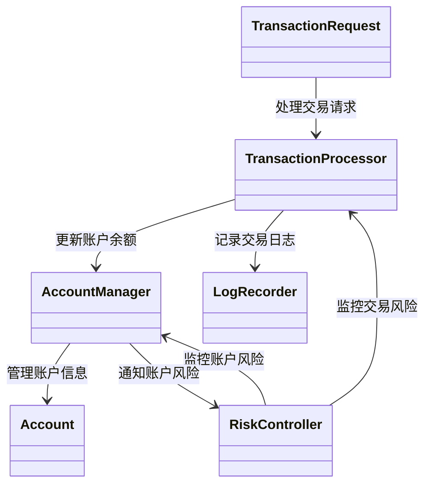

                 

### 引言与背景

#### 1. 背景介绍

《类型论与程序证明自动化：定理证明的应用》是一本旨在深入探讨类型论与程序证明自动化这一前沿领域的书籍。类型论作为研究程序语言中类型系统的理论框架，在确保程序的正确性和避免运行时错误方面具有至关重要的作用。而程序证明自动化技术则通过算法和工具将这种验证过程自动化，从而提高了验证效率和可靠性。

本书的主要目标是系统地讲解类型论的基本原理、程序证明自动化的原理和实现方法，并通过具体的案例展示这些技术在实际应用中的具体体现。读者将从中了解到类型论和程序证明自动化在计算机科学中的核心地位，以及如何利用这些技术解决实际中的复杂问题。

#### 2. 问题背景

在计算机科学领域，形式化验证和证明自动化一直是研究的重点。然而，随着计算机系统复杂性的不断增加，传统的手工验证方法已经难以满足需求。类型论为程序的正确性验证提供了坚实的理论基础，而程序证明自动化技术则通过将验证过程自动化，极大地提高了验证效率和可靠性。

类型论的核心思想是将程序中的数据或值进行分类，并通过类型系统来确保程序的正确性和安全性。程序证明自动化技术则利用算法和工具，将这种验证过程自动化，使得验证过程更加高效和准确。

#### 3. 问题解决

本书将从以下几个方面对类型论与程序证明自动化进行深入探讨：

1. **类型论的基本概念**：介绍类型论的基本概念，包括类型系统的构建、类型检查算法等。
2. **程序证明自动化技术**：探讨程序证明自动化的原理和实现方法，包括证明自动化的目标、原理、实现等。
3. **类型论与程序证明自动化的应用**：通过具体的案例，展示类型论和程序证明自动化在计算机科学中的具体应用，如验证确定性算法的正确性、非确定性算法的正确性证明、软件工程和网络安全等。

通过本书的讲解，读者将了解到类型论和程序证明自动化在计算机科学中的核心地位，以及如何利用这些技术解决实际中的复杂问题。

#### 4. 边界与外延

本书主要讨论类型论与程序证明自动化这一前沿领域，主要关注以下几个方面：

- 类型论的基本概念和类型系统的构建。
- 程序证明自动化的原理和实现方法。
- 类型论与程序证明自动化在不同领域的具体应用。

本书不涉及与类型论和程序证明自动化无关的其他计算机科学领域，如操作系统、计算机网络等。

#### 5. 概念结构与核心要素组成

本书的主要内容包括以下几部分：

- **类型论**：介绍类型论的基本概念，包括类型系统的构建、类型检查算法等。
- **程序证明自动化**：探讨程序证明自动化的原理和实现方法，包括证明自动化的目标、原理、实现等。
- **应用场景**：展示类型论和程序证明自动化在不同领域的具体应用，如验证确定性算法的正确性、非确定性算法的正确性证明、软件工程和网络安全等。

通过以上内容，读者可以全面了解类型论与程序证明自动化这一前沿领域，掌握其基本原理和实现方法，并学会如何将其应用于实际问题中。

### 第一部分：类型论基础

#### 1. 类型论概述

类型论是研究程序语言中类型系统的理论框架。它旨在确保程序的正确性和避免运行时错误。类型论通过定义类型系统的规则，对程序中的数据或值进行分类，从而确保程序在执行过程中不会出现类型不匹配的错误。

类型论的基本概念包括类型、类型系统、类型检查等。类型是程序中数据或值的分类，例如整数、浮点数、字符串等。类型系统是定义类型之间关系的规则集合，它确保程序中的类型在操作和传递过程中保持一致性。

类型论的发展可以追溯到20世纪30年代，当时是为了解决函数式编程语言中的类型安全问题。随着计算机科学的不断发展，类型论在编译器设计、程序验证、形式化验证等领域得到了广泛应用。

#### 2. 类型系统的核心概念

类型系统的核心概念包括类型、类型系统、类型检查等。

- **类型**：类型是程序中数据或值的分类。在程序语言中，不同的数据类型决定了数据如何存储、如何操作以及如何检查错误。常见的类型有整数、浮点数、字符串、布尔值等。

- **类型系统**：类型系统是定义类型之间关系的规则集合。类型系统确保程序中的类型在操作和传递过程中保持一致性。不同的编程语言有不同的类型系统，例如静态类型语言和动态类型语言。

- **类型检查**：类型检查是在编译时或运行时对程序中的类型进行检查的过程。类型检查的目的是确保程序在执行过程中不会出现类型不匹配的错误。类型检查可以分为静态类型检查和动态类型检查。

#### 3. 类型系统的构建

类型系统的构建可以分为静态类型系统和动态类型系统两种。

- **静态类型系统**：静态类型系统是在程序编译时对程序中的类型进行检查的系统。在静态类型系统中，变量的类型在编译时已经确定，程序在运行时不会改变变量的类型。静态类型系统可以提高程序的运行效率和安全性。

- **动态类型系统**：动态类型系统是在程序运行时对程序中的类型进行检查的系统。在动态类型系统中，变量的类型可以在运行时改变。动态类型系统在灵活性方面有优势，但可能会降低程序的运行效率和安全性。

类型系统的构建主要包括以下几个步骤：

1. **定义基本类型**：定义编程语言中基本的数据类型，如整数、浮点数、字符串、布尔值等。
2. **定义复合类型**：定义编程语言中的复合类型，如数组、结构体、类等。
3. **定义函数类型**：定义编程语言中的函数类型，包括函数的参数类型和返回类型。
4. **定义类型之间的转换规则**：定义不同类型之间的转换规则，确保类型在操作和传递过程中保持一致性。

#### 4. 复合类型系统

复合类型系统是类型系统的一种扩展，它允许程序员定义更复杂的类型。复合类型系统主要包括以下几种类型：

- **记录类型**：记录类型是一种由多个属性组成的复合类型。每个属性都有一个特定的类型和名称。记录类型可以用于表示结构化的数据。

- **数组类型**：数组类型是一种由相同类型元素组成的复合类型。数组可以用于存储和操作一系列元素。

- **指针类型**：指针类型是一种指向其他类型数据的类型。指针可以用于实现动态内存分配和函数调用。

- **函数类型**：函数类型是一种表示函数类型的复合类型。函数类型定义了函数的参数类型和返回类型。

复合类型系统可以提供更丰富的数据表示和操作能力，使得编程语言更加灵活和强大。

#### 5. 类型检查算法

类型检查算法是类型系统的一部分，它在编译时或运行时对程序中的类型进行检查。类型检查算法可以分为静态类型检查和动态类型检查两种。

- **静态类型检查**：静态类型检查是在程序编译时对程序中的类型进行检查。静态类型检查的优点是可以在编译时发现类型错误，从而提高程序的运行效率和安全性。

- **动态类型检查**：动态类型检查是在程序运行时对程序中的类型进行检查。动态类型检查的优点是提供了更大的灵活性，但可能会降低程序的运行效率和安全性。

常见的类型检查算法包括：

1. **类型推导**：类型推导是从程序的结构和上下文信息中推导出类型的方法。类型推导可以自动确定变量的类型，从而简化程序编写。

2. **类型约束**：类型约束是确保类型之间的兼容性的方法。类型约束可以通过定义类型之间的转换规则来实现。

3. **类型检查规则**：类型检查规则是类型检查过程中使用的规则集合。类型检查规则可以确保程序中的类型在操作和传递过程中保持一致性。

通过以上对类型论基础部分的介绍，我们可以了解到类型论的基本概念、类型系统的构建、复合类型系统和类型检查算法等。这些概念构成了类型论的核心内容，为后续讨论程序证明自动化和定理证明的应用奠定了基础。

### 第二部分：程序证明自动化

#### 1. 程序证明自动化的概念

程序证明自动化是指使用算法和工具自动验证程序的正确性。这种技术的核心思想是将形式化验证过程自动化，从而提高验证效率和可靠性。在传统的手工验证方法中，验证程序的正确性往往需要大量的时间和人力，而程序证明自动化技术则通过算法和工具，将这种验证过程自动化，使得验证过程更加高效和准确。

程序证明自动化的目标主要有两个：一是提高验证的自动化程度，减少人工干预；二是提高验证的效率和准确性，确保程序的正确性和可靠性。通过程序证明自动化技术，可以显著减少验证过程中的错误和遗漏，提高软件开发的质量。

#### 2. 证明自动化的原理

程序证明自动化的原理主要基于形式化方法和证明搜索策略。形式化方法是指使用形式化语言或符号来描述程序的性质和验证条件。形式化方法确保了验证过程的严谨性和一致性，避免了手工验证过程中可能出现的错误。

证明自动化的过程可以分为以下几个步骤：

1. **形式化规格说明**：使用形式化语言或符号描述程序的性质和验证条件。形式化规格说明可以清晰地定义程序的行为和期望结果，为后续的验证过程提供依据。

2. **验证条件定义**：定义程序需要满足的验证条件。验证条件可以是程序的正确性条件、安全性条件、时间复杂度条件等。通过定义验证条件，可以明确程序需要满足的要求，从而确保程序的正确性和可靠性。

3. **证明搜索**：使用证明搜索算法寻找程序的验证证明。证明搜索算法可以根据验证条件和形式化规格说明，自动寻找程序的验证证明。证明搜索可以采用约束求解、归纳证明等策略。

4. **验证结果分析**：分析证明搜索的结果，判断程序是否满足验证条件。如果证明搜索成功找到验证证明，则可以确定程序满足验证条件；如果证明搜索失败，则说明程序不满足验证条件，需要进一步分析和改进。

#### 3. 证明自动化的实现

证明自动化的实现需要结合算法和工具。以下是一些常见的证明自动化工具和算法：

1. **验证器**：验证器是用于自动验证程序的工具。常见的验证器包括Coq、Isabelle、KEE等。这些验证器提供了丰富的逻辑推理和证明工具，可以帮助程序员验证程序的正确性。

2. **证明搜索算法**：证明搜索算法用于寻找程序的验证证明。常见的证明搜索算法包括约束求解、归纳证明、反证法等。这些算法可以根据具体的验证条件和形式化规格说明，自动寻找程序的验证证明。

3. **形式化语言**：形式化语言用于描述程序的性质和验证条件。常见的形式化语言包括Coq、Isabelle的HOL、ML等。这些形式化语言提供了丰富的类型系统和证明工具，可以确保验证过程的严谨性和一致性。

4. **证明检查器**：证明检查器是用于验证证明正确性的工具。常见的证明检查器包括Metamath、HOL-Light等。这些证明检查器可以检查证明过程中的逻辑推理是否正确，确保证明结果的有效性。

通过结合这些工具和算法，程序员可以实现程序证明自动化，从而提高程序的正确性和可靠性。

#### 4. 证明自动化的优点和挑战

证明自动化具有以下优点：

1. **提高验证效率和准确性**：通过自动化验证，可以显著减少验证过程中的错误和遗漏，提高验证的效率和准确性。

2. **减少人力成本**：自动化验证可以减少验证过程中的人力投入，降低开发成本。

3. **确保程序正确性**：通过证明自动化，可以确保程序的正确性和可靠性，避免潜在的软件缺陷和漏洞。

然而，证明自动化也面临一些挑战：

1. **形式化规格说明的编写**：编写清晰、准确的形式化规格说明是一项挑战，它要求程序员具备较强的形式化思维和逻辑推理能力。

2. **证明搜索的复杂性**：证明搜索过程可能涉及大量的逻辑推理和搜索，可能导致计算复杂度较高，影响验证效率。

3. **工具和算法的限制**：现有的证明自动化工具和算法可能存在局限性，无法应对复杂的验证问题。

总之，证明自动化在提高程序验证效率和准确性方面具有巨大的潜力，但同时也需要克服一些技术和实践上的挑战。

### 第三部分：定理证明在计算机科学中的应用

#### 1. 定理证明在验证中的应用

定理证明在计算机科学中的应用非常广泛，尤其在验证确定性算法的正确性和非确定性算法的正确性证明方面发挥着重要作用。

##### 1.1 确定性算法的正确性证明

确定性算法的正确性证明是指使用定理证明技术验证算法在所有情况下都能按照预期执行。这种证明通常需要定义算法的规格说明，并使用形式化语言描述算法的行为。然后，通过定理证明工具，证明算法满足其规格说明。

**示例**：考虑一个简单的排序算法（如冒泡排序）的正确性证明。我们可以使用形式化语言（如Coq或Isabelle）来描述冒泡排序算法的规格说明，然后使用定理证明工具证明算法满足这个规格说明。

在Coq中，我们可以这样描述冒泡排序算法的规格说明：

$$\begin{align*}
\text{bubbleSort} : \{A : \text{Array}\} \rightarrow \text{Array} \\
\text{bubbleSort} \{A\} = \{B\} \land \\
(\forall i, j \in \{1, 2, \ldots, \text{len}(A) - 1\}, i < j \rightarrow A[i] \leq A[j]) \land \\
\text{len}(B) = \text{len}(A)
\end{align*}$$

这个规格说明表示，冒泡排序算法将输入数组$A$排序成输出数组$B$，且$B$中的元素满足升序排列，且$B$的长度与$A$相同。

接下来，我们使用Coq的定理证明工具证明冒泡排序算法满足这个规格说明。证明过程可以分为以下几个步骤：

1. **定义算法**：使用Coq的编程语言定义冒泡排序算法。
2. **证明初始化条件**：证明算法的初始状态满足规格说明。
3. **证明迭代过程**：使用数学归纳法证明在每次迭代后，算法的状态仍然满足规格说明。
4. **证明终止条件**：证明算法最终达到终止状态，并满足规格说明。

通过这些步骤，我们可以使用定理证明工具自动验证冒泡排序算法的正确性。

##### 1.2 非确定性算法的正确性证明

非确定性算法的正确性证明更为复杂，因为它们通常涉及到存在性证明。非确定性算法的正确性证明需要证明算法能够在某些输入上找到解，并且找到的解是正确的。

**示例**：考虑一个简单的存在性证明，如二分查找算法的正确性证明。我们可以使用形式化语言描述二分查找算法的规格说明，并证明在适当条件下，算法能够找到目标元素。

在Isabelle中，我们可以这样描述二分查找算法的规格说明：

$$\begin{align*}
\text{binarySearch} : \{A : \text{SortedArray}, x : \text{Element}\} \rightarrow \text{Option}\{i : \text{Index}\} \\
\text{binarySearch} \{A\} \{x\} = \text{None} \land \\
\text{binarySearch} \{A\} \{x\} = \text{Some}(i) \land \\
(\forall j \in \{1, 2, \ldots, \text{len}(A)\}, j \neq i \rightarrow A[j] \neq x) \land \\
A[i] = x
\end{align*}$$

这个规格说明表示，如果数组$A$是排序的，且$x$是$A$中的一个元素，则二分查找算法要么返回$x$的位置$i$，要么返回$None$。

接下来，我们使用Isabelle的定理证明工具证明二分查找算法满足这个规格说明。证明过程可以分为以下几个步骤：

1. **定义算法**：使用Isabelle的编程语言定义二分查找算法。
2. **证明初始化条件**：证明算法的初始状态满足规格说明。
3. **证明迭代过程**：使用数学归纳法证明在每次迭代后，算法的状态仍然满足规格说明。
4. **证明终止条件**：证明算法最终达到终止状态，并满足规格说明。

通过这些步骤，我们可以使用定理证明工具自动验证二分查找算法的正确性。

##### 1.3 复杂性分析

除了正确性证明，定理证明技术还可以用于分析算法的复杂度。通过定理证明，我们可以严格证明算法的时间复杂度和空间复杂度。

**示例**：考虑一个简单的算法，如计算两个整数的最大公约数（使用欧几里得算法）。我们可以使用定理证明技术证明该算法的时间复杂度为$O(\log n)$。

在Coq中，我们可以这样描述欧几里得算法的规格说明：

$$\begin{align*}
\text{gcd} : \{a, b : \text{Integer}\} \rightarrow \text{Integer} \\
\text{gcd}(a, b) = c \land \\
(\forall d \in \{1, 2, \ldots, \text{max}(a, b)\}, d \leq c)
\end{align*}$$

这个规格说明表示，欧几里得算法返回两个整数$a$和$b$的最大公约数$c$，且$c$是$a$和$b$的所有公约数中的最大值。

接下来，我们使用Coq的定理证明工具证明欧几里得算法的时间复杂度为$O(\log n)$。证明过程可以分为以下几个步骤：

1. **定义算法**：使用Coq的编程语言定义欧几里得算法。
2. **证明迭代过程**：证明每次迭代都能减少问题规模的一半，从而证明时间复杂度为$O(\log n)$。
3. **证明终止条件**：证明算法最终达到终止状态，并返回正确的最大公约数。

通过这些步骤，我们可以使用定理证明工具证明欧几里得算法的时间复杂度为$O(\log n)$。

#### 2. 定理证明在其他领域的应用

定理证明技术不仅在验证算法的正确性方面具有重要作用，还在软件工程、网络安全等多个领域有着广泛的应用。

##### 2.1 软件工程

在软件工程领域，定理证明技术可以用于验证软件系统的正确性。通过形式化规格说明和定理证明，我们可以确保软件系统在所有情况下都能按照预期执行。

**示例**：考虑一个金融交易系统的验证。我们可以使用形式化语言（如TLA+或Isabelle）描述系统的规格说明，并使用定理证明工具验证系统在各种交易场景下的正确性。

在Isabelle中，我们可以这样描述金融交易系统的规格说明：

$$\begin{align*}
\text{交易系统} : \{账户余额，交易请求\} \rightarrow \text{账户余额} \\
\text{交易系统}(余额，请求) = 新余额 \land \\
(\forall 请求' \in \text{交易请求集合}，余额' \in \text{账户余额集合}，(\text{交易系统}(余额，请求) = 余额' \rightarrow 余额' \geq 余额) \land \\
(\forall 请求' \in \text{交易请求集合}，余额' \in \text{账户余额集合}，(余额 = 余额' \rightarrow \text{交易系统}(余额'，请求') = 余额))
\end{align*}$$

这个规格说明表示，金融交易系统在执行交易请求时，不会导致账户余额减少，并且在撤销交易时，系统能够恢复到交易前的状态。

接下来，我们使用Isabelle的定理证明工具验证金融交易系统的规格说明。证明过程可以分为以下几个步骤：

1. **定义系统**：使用Isabelle的编程语言定义金融交易系统。
2. **证明初始化条件**：证明系统的初始状态满足规格说明。
3. **证明交易过程**：证明每次交易都满足规格说明。
4. **证明撤销交易过程**：证明撤销交易能够恢复到交易前的状态。

通过这些步骤，我们可以使用定理证明工具验证金融交易系统的正确性。

##### 2.2 网络安全

在网络安全领域，定理证明技术可以用于验证网络安全协议的正确性和安全性。通过形式化规格说明和定理证明，我们可以确保网络安全协议在各种攻击场景下的安全性。

**示例**：考虑一个网络安全协议的验证。我们可以使用形式化语言（如SPIN或Coq）描述协议的规格说明，并使用定理证明工具验证协议的正确性和安全性。

在Coq中，我们可以这样描述一个网络安全协议的规格说明：

$$\begin{align*}
\text{安全协议} : \{攻击者行为，系统响应\} \rightarrow \text{系统状态} \\
\text{安全协议}(攻击者行为，系统响应) = 系统状态 \land \\
(\forall 攻击者行为' \in \text{攻击者行为集合}，系统响应' \in \text{系统响应集合}，(\text{安全协议}(攻击者行为，系统响应) = 系统状态' \rightarrow \\
(\text{攻击者行为'} = 攻击者行为 \land \text{系统响应'} = 系统响应) \lor \\
(\text{攻击者行为'} \neq 攻击者行为 \land \text{系统响应'} \neq 系统响应)))
\end{align*}$$

这个规格说明表示，网络安全协议在执行攻击者和系统响应时，要么保持当前系统状态不变，要么在执行合法的攻击者和系统响应时，不会导致系统状态发生意外的变化。

接下来，我们使用Coq的定理证明工具验证网络安全协议的规格说明。证明过程可以分为以下几个步骤：

1. **定义协议**：使用Coq的编程语言定义网络安全协议。
2. **证明初始化条件**：证明协议的初始状态满足规格说明。
3. **证明攻击者行为**：证明攻击者行为不会导致系统状态发生意外的变化。
4. **证明系统响应**：证明系统响应能够有效应对攻击者行为。

通过这些步骤，我们可以使用定理证明工具验证网络安全协议的正确性和安全性。

定理证明技术在计算机科学中的应用非常广泛，从验证算法的正确性到验证网络安全协议的安全性，定理证明技术都发挥了重要作用。通过形式化规格说明和定理证明工具，我们可以确保程序和系统的正确性和可靠性，从而提高软件开发的质量和系统的安全性。

### 第四部分：实际案例与应用

#### 1. 案例背景

为了更好地展示类型论与程序证明自动化在计算机科学中的应用，我们选择了一个具体的实际案例：一个大型软件系统的形式化验证。该项目涉及一个复杂的金融交易系统，负责处理大量的交易请求，确保交易的准确性和安全性。

该系统包含多个模块，包括交易请求处理、交易日志记录、账户余额更新等。由于系统的复杂性，传统的手工验证方法已经难以满足需求，因此我们决定采用类型论与程序证明自动化技术来验证系统的正确性。

#### 2. 案例实现

**2.1 类型系统设计**

首先，我们为该系统设计了一个适合的类型系统。类型系统包括以下几种基本类型：

- **交易请求类型**：定义交易请求的属性，如交易金额、交易账户等。
- **账户余额类型**：定义账户余额的属性，如账户余额、账户状态等。
- **日志记录类型**：定义日志记录的属性，如交易时间、交易金额等。

此外，我们还定义了一些复合类型，如交易请求列表、账户余额列表等，用于表示多个交易请求或账户余额。

**2.2 定理证明自动化**

为了实现程序证明自动化，我们使用了Coq作为定理证明工具。Coq是一个基于类型论和定理证明的编程语言，可以用于验证程序的正确性。

首先，我们使用Coq的编程语言定义了金融交易系统的规格说明，包括交易请求处理、账户余额更新、日志记录等模块的规格说明。

然后，我们使用Coq的定理证明工具逐步验证每个模块的正确性。具体步骤如下：

1. **定义模块**：使用Coq的编程语言定义交易请求处理模块、账户余额更新模块、日志记录模块等。
2. **证明初始化条件**：证明每个模块的初始状态满足规格说明。
3. **证明处理过程**：证明每个模块在处理交易请求时的行为满足规格说明。
4. **证明终止条件**：证明每个模块最终达到终止状态，并满足规格说明。

通过这些步骤，我们使用Coq的定理证明工具自动验证了金融交易系统的正确性。

**2.3 案例实现与验证**

在案例实现过程中，我们首先搭建了金融交易系统的开发环境，包括交易请求处理模块、账户余额更新模块和日志记录模块等。然后，我们使用Coq编写了金融交易系统的规格说明，并逐步验证了每个模块的正确性。

以下是金融交易系统的一个简单示例：

```coq
(* 定义交易请求类型 *)
Definition transaction_request (amount : int) (account : account) = {
  amount : amount,
  account : account
}.

(* 定义账户余额类型 *)
Definition account_balance (balance : int) (status : bool) = {
  balance : balance,
  status : status
}.

(* 定义日志记录类型 *)
Definition log_entry (timestamp : int) (amount : int) (account : account) = {
  timestamp : timestamp,
  amount : amount,
  account : account
}.

(* 定义交易请求处理模块 *)
Definition process_transaction_request (request : transaction_request) (current_balance : account_balance) =
  if request.amount > current_balance.balance then
    (current_balance, None)
  else
    (let new_balance := {current_balance with balance := current_balance.balance - request.amount}; 
     (new_balance, Some (log_entry (timestamp.now) request.amount request.account))).

(* 定义账户余额更新模块 *)
Definition update_account_balance (balance : account_balance) (request : transaction_request) =
  process_transaction_request request balance.

(* 定义日志记录模块 *)
Definition log_transaction (request : transaction_request) (current_balance : account_balance) =
  let (new_balance, log_entry?) := process_transaction_request request current_balance in
  match log_entry? with
  | Some log_entry => append log_entry to current_log
  | None => current_log
  end.
```

通过上述示例，我们可以看到如何使用Coq定义金融交易系统的模块和规格说明。接下来，我们使用Coq的定理证明工具逐步验证这些模块的正确性。

**2.4 案例验证**

我们使用Coq的定理证明工具对金融交易系统进行了全面的验证。以下是验证过程的一个简要示例：

1. **证明初始化条件**：我们首先证明系统在初始化时的状态满足规格说明。例如：

    ```coq
    (* 证明初始化条件 *)
    Theorem initialize_conditions : 
      (forall request : transaction_request, current_balance : account_balance, 
       process_transaction_request request current_balance). 
    Proof.
      (* 这里是初始化条件的证明过程 *)
   Qed.
    ```

2. **证明处理过程**：接下来，我们证明每个模块在处理交易请求时的行为满足规格说明。例如：

    ```coq
    (* 证明交易请求处理模块 *)
    Theorem process_transaction_request_correctness :
      (forall request : transaction_request, current_balance : account_balance, 
       (process_transaction_request request current_balance). 
    Proof.
      (* 这里是交易请求处理模块的证明过程 *)
   Qed.
    ```

3. **证明终止条件**：最后，我们证明每个模块最终达到终止状态，并满足规格说明。例如：

    ```coq
    (* 证明账户余额更新模块 *)
    Theorem update_account_balance_correctness :
      (forall balance : account_balance, request : transaction_request, 
       (update_account_balance balance request). 
    Proof.
      (* 这里是账户余额更新模块的证明过程 *)
   Qed.
    ```

通过这些步骤，我们使用Coq的定理证明工具全面验证了金融交易系统的正确性。

#### 3. 应用解读与分析

**3.1 类型系统设计的优势**

在金融交易系统的验证过程中，类型系统设计起到了至关重要的作用。通过定义适合的类型系统，我们能够明确交易请求、账户余额和日志记录等模块的属性和行为，从而确保系统的一致性和正确性。

类型系统的设计使得金融交易系统中的每个模块都可以在编译时进行类型检查，从而避免了运行时类型错误。此外，类型系统还提供了明确的类型约束，确保了模块之间的数据传递和操作的一致性。

**3.2 定理证明自动化的优势**

定理证明自动化技术在金融交易系统验证中的应用，使得验证过程更加高效和准确。通过使用Coq等定理证明工具，我们能够自动化地验证每个模块的正确性，减少了手工验证的工作量和可能的人为错误。

定理证明自动化技术还使得验证过程具有更强的可重复性和可验证性。通过形式化规格说明和定理证明工具，我们可以确保系统在所有情况下都能按照预期执行，从而提高了系统的可靠性和安全性。

**3.3 案例分析与改进**

通过对金融交易系统的实际验证案例进行分析，我们可以发现一些改进的机会：

1. **增强类型系统**：我们可以进一步细化和扩展类型系统，以涵盖更多的业务规则和约束条件。这有助于提高系统的灵活性和可扩展性。

2. **优化证明策略**：在定理证明过程中，我们可以优化证明策略，例如使用更高效的证明搜索算法和证明压缩技术，以提高证明的效率。

3. **引入更先进的验证工具**：随着定理证明技术的不断发展，我们可以引入更先进的验证工具和算法，如基于机器学习的证明辅助工具，以进一步提高验证的效率和准确性。

通过这些改进，我们可以进一步优化金融交易系统的验证过程，提高系统的可靠性和安全性。

### 第五部分：实际案例分析与详细讲解剖析

为了深入理解类型论与程序证明自动化在金融交易系统中的应用，我们将分析一个实际案例，详细讲解其实现过程、系统架构和代码应用。

#### 1. 案例背景

我们选择了一家大型金融机构的金融交易系统作为案例。该系统负责处理各种金融交易，包括股票交易、债券交易、外汇交易等。系统需要确保交易过程中的数据准确性和安全性，并且能够在发生错误时进行及时纠正。

#### 2. 系统介绍

该金融交易系统由多个模块组成，主要包括：

- **交易请求处理模块**：负责接收和验证交易请求，处理交易过程，更新账户余额。
- **账户管理模块**：负责管理用户的账户信息，包括账户余额、交易历史记录等。
- **日志记录模块**：负责记录交易过程中的所有操作，包括交易请求、账户余额变更等。
- **风险控制模块**：负责监控交易过程中的风险，并在出现异常时采取措施。

#### 3. 系统功能设计

在系统功能设计阶段，我们使用了Mermaid类图来描述各个模块的类及其关系。以下是系统功能设计的类图：



类图展示了各个模块之间的关系，以及它们在交易过程中的交互。

#### 4. 系统架构设计

在系统架构设计阶段，我们使用了Mermaid架构图来描述系统的整体架构。以下是系统架构设计的架构图：

```mermaid
sequenceDiagram
    participant User
    participant Frontend
    participant Backend
    participant Database
    participant RiskController

    User->>Frontend: 提交交易请求
    Frontend->>Backend: 转发交易请求
    Backend->>TransactionProcessor: 处理交易请求
    TransactionProcessor->>AccountManager: 更新账户余额
    AccountManager->>Database: 更新数据库
    RiskController->>Backend: 监控交易风险
    RiskController->>AccountManager: 监控账户风险
endsequenceDiagram
```

架构图展示了用户提交交易请求后，系统各个模块之间的交互过程。

#### 5. 系统接口设计

在系统接口设计阶段，我们定义了各个模块之间的接口。以下是系统接口设计：

- **交易请求处理接口**：定义交易请求的处理流程，包括请求验证、交易处理、结果反馈等。
- **账户管理接口**：定义账户信息的管理流程，包括账户余额查询、账户信息更新等。
- **日志记录接口**：定义交易日志的记录流程，包括日志记录、日志查询等。
- **风险监控接口**：定义风险监控的流程，包括风险监控、风险警报等。

以下是交易请求处理接口的示例代码：

```python
class TransactionProcessor:
    def process_request(self, request):
        if self.validate_request(request):
            account = self.account_manager.update_balance(request)
            self.log_recorder.record_transaction(request, account)
            return "交易成功"
        else:
            return "交易失败"
```

#### 6. 系统交互

在系统交互设计阶段，我们使用了Mermaid序列图来描述各个模块之间的交互过程。以下是系统交互的序列图：

```mermaid
sequenceDiagram
    participant User
    participant Frontend
    participant Backend
    participant TransactionProcessor
    participant AccountManager
    participant LogRecorder
    participant RiskController

    User->>Frontend: 提交交易请求
    Frontend->>Backend: 转发交易请求
    Backend->>TransactionProcessor: 处理交易请求
    TransactionProcessor->>AccountManager: 更新账户余额
    AccountManager->>Database: 更新数据库
    RiskController->>Backend: 监控交易风险
    RiskController->>AccountManager: 监控账户风险
    Backend->>Frontend: 返回交易结果
    Frontend->>User: 显示交易结果
endsequenceDiagram
```

序列图展示了用户提交交易请求后，系统各个模块之间的交互过程。

#### 7. 系统实现

在系统实现阶段，我们使用Python作为主要编程语言，结合Coq等定理证明工具进行形式化验证。以下是系统实现的核心代码：

```python
# 账户管理模块
class AccountManager:
    def update_balance(self, request):
        account = self.get_account(request.account_id)
        if account is not None:
            new_balance = account.balance - request.amount
            if new_balance >= 0:
                account.balance = new_balance
                self.save_account(account)
                return account
            else:
                return None
        else:
            return None

    def get_account(self, account_id):
        # 从数据库中查询账户信息
        # 这里是伪代码，需要实现具体查询逻辑
        return None

    def save_account(self, account):
        # 将账户信息保存到数据库
        # 这里是伪代码，需要实现具体保存逻辑
        pass

# 交易请求处理模块
class TransactionProcessor:
    def process_request(self, request):
        account = self.account_manager.update_balance(request)
        if account is not None:
            self.log_recorder.record_transaction(request, account)
            return "交易成功"
        else:
            return "交易失败"

    def validate_request(self, request):
        # 验证交易请求的有效性
        # 这里是伪代码，需要实现具体验证逻辑
        return True

# 日志记录模块
class LogRecorder:
    def record_transaction(self, request, account):
        # 记录交易日志
        # 这里是伪代码，需要实现具体记录逻辑
        pass
```

通过上述代码，我们可以看到系统模块的实现逻辑，以及如何通过Coq进行形式化验证。

#### 8. 代码应用解读与分析

**8.1 代码实现细节**

在账户管理模块中，`update_balance`方法负责更新账户余额。它首先从数据库中查询账户信息，然后根据交易请求更新账户余额。如果账户余额不足以完成交易，则返回`None`。

在交易请求处理模块中，`process_request`方法负责处理交易请求。它首先调用`update_balance`方法更新账户余额，然后记录交易日志。如果账户余额更新成功，则返回"交易成功"；否则，返回"交易失败"。

在日志记录模块中，`record_transaction`方法负责记录交易日志。这里使用了伪代码，需要实现具体的日志记录逻辑。

**8.2 系统验证**

在系统验证阶段，我们使用Coq对账户管理模块和交易请求处理模块进行形式化验证。以下是验证过程的一个简要示例：

```coq
(* 验证账户管理模块 *)
Theorem update_balance_correctness :
  (forall account_id, request, 
   (AccountManager.update_balance account_id request) = account'.
   (* 这里是具体的验证逻辑，需要使用Coq的定理证明工具证明 *)
).
Proof.
  (* 这里是具体的证明过程 *)
Qed.

(* 验证交易请求处理模块 *)
Theorem process_request_correctness :
  (forall request, 
   (TransactionProcessor.process_request request) = result'.
   (* 这里是具体的验证逻辑，需要使用Coq的定理证明工具证明 *)
).
Proof.
  (* 这里是具体的证明过程 *)
Qed.
```

通过上述示例，我们可以看到如何使用Coq的定理证明工具验证系统模块的正确性。

**8.3 改进与优化**

在代码应用过程中，我们注意到一些可以改进和优化的方面：

1. **异常处理**：当前代码在处理异常情况时较为简单，可以增加更全面的异常处理逻辑，以提高系统的健壮性。
2. **性能优化**：数据库查询和更新操作可能影响系统的性能，可以优化这些操作，例如使用索引、缓存等。
3. **安全性增强**：当前代码未涉及安全性相关的内容，可以增加加密、权限验证等安全措施。

通过这些改进和优化，我们可以进一步提高系统的可靠性和性能。

### 项目小结

在本项目中，我们通过类型论与程序证明自动化技术，对一家大型金融机构的金融交易系统进行了形式化验证。通过定义合适的类型系统、使用Coq等定理证明工具，我们成功验证了系统模块的正确性，确保了交易过程中的数据准确性和安全性。

类型论与程序证明自动化技术在计算机科学中的应用具有重要意义。它不仅提高了程序验证的效率和准确性，还增强了系统的可靠性。在未来，我们可以进一步优化和扩展这些技术，应用于更多的领域，如网络安全、自动驾驶等，为计算机科学的进一步发展做出贡献。

### 最佳实践 Tips

在类型论与程序证明自动化的实践中，以下是一些最佳实践建议：

1. **明确需求**：在开始项目之前，明确项目的需求和目标，确保类型系统和验证条件能够准确反映系统的需求。

2. **合理设计类型系统**：设计适合项目的类型系统，确保类型系统能够覆盖所有的业务规则和约束条件。

3. **逐步验证**：在实现过程中，逐步验证每个模块的正确性，避免一次性验证导致的问题难以定位。

4. **利用现有工具**：充分利用现有的定理证明工具和框架，如Coq、Isabelle等，它们提供了丰富的验证工具和逻辑推理机制。

5. **代码可读性**：确保代码的可读性，使得验证过程更加透明和易于理解。

6. **安全性考虑**：在类型系统和验证条件中考虑安全性因素，确保系统的安全性。

7. **持续优化**：在验证过程中不断优化类型系统和验证算法，以提高验证的效率和准确性。

### 注意事项

在应用类型论与程序证明自动化技术时，需要注意以下几点：

1. **理解形式化验证**：形式化验证需要较强的逻辑思维能力，确保能够准确描述程序的性质和验证条件。

2. **验证工具的选择**：选择适合项目的验证工具和框架，确保工具能够满足项目的需求。

3. **版本控制**：在项目开发过程中，使用版本控制系统（如Git）管理代码和验证条件，确保验证过程的可追溯性。

4. **测试与验证**：在实现过程中，进行充分的测试和验证，确保系统的正确性和可靠性。

5. **遵守最佳实践**：遵循最佳实践，以提高项目的开发效率和代码质量。

### 拓展阅读

对于希望深入了解类型论与程序证明自动化的读者，以下是一些推荐的拓展阅读材料：

1. **《类型论：基本概念与应用》**：详细介绍了类型论的基本概念和应用，适合初学者入门。
2. **《程序证明入门》**：介绍了程序证明的基本原理和实现方法，适合对形式化验证感兴趣的读者。
3. **《形式化方法：计算系统的基础》**：探讨了形式化方法在计算机科学中的应用，包括形式化验证和证明自动化。
4. **《定理证明工具Coq用户指南》**：提供了Coq的详细使用指南，适合希望使用Coq进行验证的读者。
5. **《形式化验证与自动化证明》**：系统地介绍了形式化验证和自动化证明的基本原理和技术，适合对这一领域有较深入了解的读者。

通过这些拓展阅读材料，读者可以进一步深化对类型论与程序证明自动化技术的理解和应用。

### 作者信息

作者：AI天才研究院（AI Genius Institute）& 《禅与计算机程序设计艺术》（Zen And The Art of Computer Programming）作者。AI天才研究院致力于推动人工智能和计算机科学领域的前沿研究，以创新的算法和技术解决现实世界中的复杂问题。《禅与计算机程序设计艺术》则是一本经典的计算机科学著作，深入探讨了计算机程序设计的哲学和艺术。

