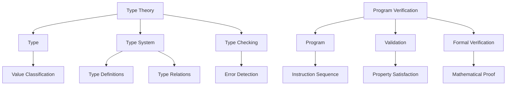

                 

# 类型论与程序验证：形式化方法的核心

> 关键词：类型论、程序验证、形式化方法、正确性证明、类型系统、验证算法

> 摘要：本文旨在深入探讨类型论和程序验证在计算机科学中的核心地位。通过逐步分析这两个领域的理论基础、核心概念和应用实例，本文旨在为读者提供一个全面的理解，并探讨其未来发展。

## 引言

### 1.1 问题背景

在计算机科学和软件工程领域，类型论和程序验证是两个不可或缺的研究领域。类型论关注于程序中变量和值的类型，以及如何通过类型系统确保程序的正确性和安全性。而程序验证则致力于通过形式化的方法来证明程序满足特定的性质，从而确保其可靠性和正确性。

### 1.2 问题描述

尽管类型论和程序验证在计算机科学中具有重要地位，但现有的教材和资料往往缺乏系统性，难以全面、深入地阐述这两个领域。因此，本文旨在填补这一空白，通过逐步分析类型论和程序验证的核心概念、原理和应用，为读者提供一个全面、系统的理解。

### 1.3 问题解决

本文将通过以下步骤来实现这一目标：

1. 阐述类型论的基础概念，包括类型、类型系统和类型检查。
2. 阐述程序验证的基础概念，包括程序、验证和形式化验证。
3. 探讨类型论和程序验证的结合，以及它们在软件工程中的应用。
4. 分析类型论和程序验证的发展趋势，以及未来研究的方向。

### 1.4 边界与外延

本文主要关注以下内容：

- 类型论的基本概念和原理。
- 程序验证的基本概念和原理。
- 类型论和程序验证的结合与应用。
- 类型论和程序验证的最新研究进展和趋势。

### 1.5 概念结构与核心要素组成

本文的结构如下：

- 第一部分：类型论基础
- 第二部分：程序验证基础
- 第三部分：类型论与程序验证的结合
- 第四部分：类型论和程序验证的发展趋势

## Step 1: 类型论基础

### 2.1 类型论概述

类型论是计算机科学中的一个重要分支，主要研究程序中变量和值的类型，以及类型系统如何确保程序的正确性和安全性。类型论的研究范围涵盖了从简单的静态类型系统到复杂的动态类型系统，从简单的类型系统到复杂的类型系统。

### 2.2 类型论的基本概念

#### 2.2.1 类型

类型是类型论中最基本的概念之一。类型是对值的分类，用来表示值的不同属性和特征。例如，在Java语言中，整数类型、字符串类型和布尔类型都是不同的类型。

#### 2.2.2 类型系统

类型系统是一组规则，用于定义变量和值的类型，以及如何对这些类型进行操作。类型系统可以分为静态类型系统和动态类型系统。

#### 2.2.3 类型检查

类型检查是类型系统中的一个重要环节。类型检查的目的是确保程序在运行时不会发生类型错误。

### 2.3 类型论的应用

类型论在计算机科学和软件工程中有着广泛的应用。例如，类型论可以用来提高程序的可靠性、减少程序错误、优化程序性能等。

### 2.4 类型论的发展趋势

随着计算机科学和软件工程的发展，类型论也在不断发展和完善。目前，类型论的研究热点包括类型推理、类型安全、类型系统优化等。

## Step 2: 程序验证基础

### 3.1 程序验证概述

程序验证是计算机科学中的一个重要分支，主要研究如何通过形式化的方法来证明程序满足一定的性质，从而确保程序的正确性和可靠性。程序验证的方法包括模型检查、形式化验证、模型验证等。

### 3.2 程序验证的基本概念

#### 3.2.1 程序

程序是一系列指令的集合，用于完成特定的任务。

#### 3.2.2 验证

验证是确保程序满足特定性质的过程。

#### 3.2.3 形式化验证

形式化验证是通过数学方法来证明程序的性质。

#### 3.2.4 模型检查

模型检查是通过构造程序的状态图来验证程序的正确性。

### 3.3 程序验证的应用

程序验证在计算机科学和软件工程中有着广泛的应用。例如，程序验证可以用来确保程序的安全性、可靠性、性能等。

### 3.4 程序验证的发展趋势

随着计算机科学和软件工程的发展，程序验证也在不断发展和完善。目前，程序验证的研究热点包括验证工具的自动化、验证方法的优化、验证算法的改进等。

## Step 3: 类型论与程序验证的结合

### 4.1 类型论在程序验证中的应用

类型论在程序验证中的应用主要体现在以下几个方面：

- 类型检查：类型检查是程序验证的一个重要环节。通过类型检查，可以确保程序在运行时不会发生类型错误。
- 类型推理：类型推理是一种自动化的验证方法，通过推理出程序中的类型关系，可以简化验证过程。
- 类型安全：类型安全是程序验证的一个重要目标。类型论提供了一系列保证类型安全的机制和方法。

### 4.2 程序验证在类型论中的应用

程序验证在类型论中的应用主要体现在以下几个方面：

- 验证类型系统：通过程序验证方法来验证类型系统的正确性和安全性。
- 验证类型转换：确保类型转换的正确性和安全性。
- 类型错误检测：使用程序验证方法来检测类型错误，提高程序的正确性。

### 4.3 类型论与程序验证的结合方法

类型论与程序验证的结合方法主要包括：

- 将类型论集成到程序验证工具中，提高验证效率和准确性。
- 使用类型论作为程序验证的基础，确保验证结果的正确性。
- 将程序验证应用于类型系统的设计和分析，提高类型系统的可靠性。

## Step 4: 类型论和程序验证的发展趋势

### 5.1 类型论的发展趋势

类型论的发展趋势主要包括以下几个方面：

- 类型推理的优化：提高类型推理的效率和准确性。
- 类型安全性的提高：研究更安全的类型系统，减少类型错误。
- 类型系统的多样性：研究不同的类型系统，满足不同的应用需求。

### 5.2 程序验证的发展趋势

程序验证的发展趋势主要包括以下几个方面：

- 自动化验证工具：提高验证过程的自动化程度，减少人工干预。
- 验证方法的优化：研究更高效的验证方法，提高验证效率。
- 验证算法的改进：研究更强大的验证算法，提高验证能力。

## 结论

类型论和程序验证是计算机科学和软件工程中的重要研究领域。通过类型论，我们可以确保程序的正确性和安全性；通过程序验证，我们可以证明程序满足特定的性质。类型论和程序验证的结合，为软件工程提供了强大的理论基础和实践指导。未来，随着计算机科学和软件工程的发展，类型论和程序验证将继续发展，为计算机科学和软件工程提供更强大的支持。

### 作者信息

作者：AI天才研究院/AI Genius Institute & 禅与计算机程序设计艺术 /Zen And The Art of Computer Programming

---

### 附录

以下是本文涉及的一些核心概念、属性特征对比表格和ER实体关系图架构的Mermaid流程图。

#### 核心概念

- 类型
- 类型系统
- 类型检查
- 程序
- 验证
- 形式化验证

#### 核心概念属性特征对比表格

| 概念      | 属性特征                                                     |
|-----------|------------------------------------------------------------|
| 类型      | 对值的分类，表示值的属性和特征                             |
| 类型系统  | 定义变量和值的类型，以及类型间的关系和操作                 |
| 类型检查  | 确保程序在运行时不会发生类型错误                           |
| 程序      | 一系列指令的集合，用于完成特定任务                         |
| 验证      | 确保程序满足特定性质的过程                                 |
| 形式化验证| 通过数学方法证明程序的性质                                   |

#### ER实体关系图架构的Mermaid流程图

### 注意事项

- 类型论和程序验证是计算机科学中的重要研究领域，需要深入理解和掌握。
- 类型论和程序验证的结合方法多种多样，需要根据具体应用场景选择合适的结合方法。
- 类型论和程序验证的发展趋势需要持续关注，以获取最新的研究成果和应用实践。

### 拓展阅读

- 类型论相关书籍：《类型系统和程序设计语言》、《类型系统设计》
- 程序验证相关书籍：《形式化方法：数学基础》、《程序验证：原理与应用》
- 类型论和程序验证的结合方法研究：《类型论与程序验证的结合研究》、《类型论与程序验证的结合实践》

---

通过本文的逐步分析，我们深入了解了类型论和程序验证的核心概念、原理和应用。类型论和程序验证的结合为计算机科学和软件工程提供了强大的理论基础和实践指导。未来，随着计算机科学和软件工程的发展，类型论和程序验证将继续发展，为计算机科学和软件工程提供更强大的支持。希望本文能为读者提供有价值的参考和启发。作者：AI天才研究院/AI Genius Institute & 禅与计算机程序设计艺术 /Zen And The Art of Computer Programming。

