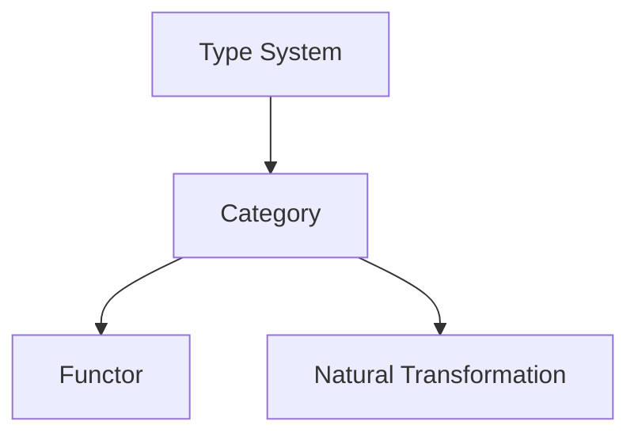
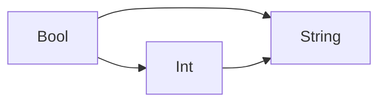
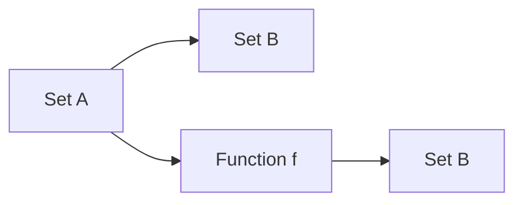
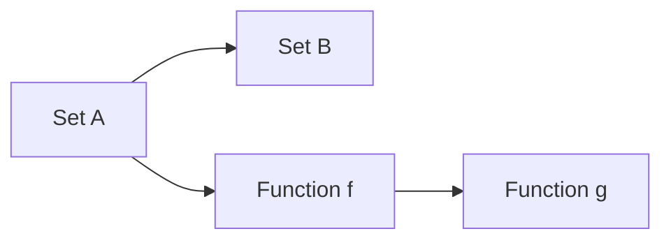

                 

# 类型论与范畴论：数学基础的交汇

## 关键词
- 类型论
- 范畴论
- 数学基础
- 集合论
- 函数与关系
- 自然变换
- 集合论
- 函子

## 摘要
本文将探讨类型论与范畴论在数学基础中的交汇。类型论与范畴论作为现代数学和计算机科学的核心概念，它们在数学基础中的地位与作用不可忽视。本文首先介绍类型论与范畴论的基本概念，然后分析它们的发展历史、核心概念及其在数学基础中的关系。接着，深入探讨类型论与范畴论的相似之处和不同之处，并探讨它们在数学基础中的结合与互补。本文旨在为读者提供一个全面、系统的理解，以便更好地把握这两个理论在数学基础中的重要性和应用价值。

### 1.6 类型论概述

#### 1.6.1 类型论的发展历史

类型论起源于20世纪30年代，最早由数学家和逻辑学家提出，旨在解决数学基础问题。早期类型论的代表人物包括伯特兰·罗素和阿尔弗雷德·诺思·怀特海德，他们提出了类型论的基本思想。随着计算机科学的兴起，类型论逐渐在编程语言理论和形式化验证等领域得到广泛应用。现代类型论的发展更加注重类型系统的形式化和形式语义，如马丁·勒布伦和保罗·塔哈斯等学者对类型系统的研究。

#### 1.6.2 类型论的核心概念

类型论的核心概念包括类型系统、类型安全、类型推导等。

- 类型系统：类型系统是一种用于定义和操作数据类型的机制，它为程序设计提供了一种形式化描述，使得程序设计更加规范和可靠。

- 类型安全：类型安全是指程序在执行过程中不会因为类型错误而导致运行时错误，如数组越界访问、类型转换错误等。

- 类型推导：类型推导是指从程序的结构推导出其类型，类型推导可以自动进行，也可以由程序员显式指定。

#### 1.6.3 类型论与数学基础的关系

类型论与数学基础有着密切的联系。类型论为数学基础提供了一种形式化的描述方式，使得数学理论更加严谨和可靠。同时，类型论在集合论、函数与关系、逻辑系统等领域有着广泛的应用。类型论为这些领域提供了类型系统，使得证明和推理过程更加形式化和规范。类型论与数学基础的关系如图1-1所示。

### 1.7 范畴论概述

#### 1.7.1 范畴论的发展历史

范畴论起源于20世纪30年代，由瑞士数学家赫尔曼·魏因巴赫和数学家菲利克斯·克莱因提出。范畴论最初在代数学和拓扑学中得到了应用，后来逐渐扩展到其他数学领域，如集合论、逻辑学、计算机科学等。现代范畴论的发展更加注重范畴的结构和范畴之间的变换。

#### 1.7.2 范畴论的核心概念

范畴论的核心概念包括范畴、函子、自然变换等。

- 范畴：范畴是由对象和态射组成的结构，它提供了一种抽象的方式来描述数学中的结构。

- 函子：函子是范畴之间的映射，它保持了范畴的结构，使得不同范畴之间可以进行统一描述。

- 自然变换：自然变换是函子之间的变换，它保持了函子的结构，使得不同函子之间可以进行统一描述。

#### 1.7.3 范畴论在数学基础中的应用

范畴论在数学基础中的应用非常广泛。在集合论中，范畴论提供了一种形式化的描述集合论结构的方法；在函数与关系论中，范畴论提供了一种形式化的描述函数与关系的方法；在逻辑系统中，范畴论提供了一种形式化的描述逻辑系统的方法。范畴论为数学基础提供了一种更加抽象和统一的形式化描述，使得数学理论更加严谨和可靠。范畴论在数学基础中的应用如图1-2所示。

### 1.8 类型论与范畴论的交汇

#### 1.8.1 类型论与范畴论的相似之处

类型论与范畴论在数学基础中有许多相似之处。

- 两者都提供了一种形式化的描述数学结构的方法，使得数学理论更加严谨和可靠。

- 两者都强调结构之间的变换和映射关系，使得不同结构之间可以进行统一描述。

- 两者都关注类型的概念，类型论关注类型系统，范畴论关注范畴和函子。

#### 1.8.2 类型论与范畴论的不同之处

类型论与范畴论在数学基础中也有不同之处。

- 类型论侧重于类型系统的定义和推导，而范畴论侧重于范畴的结构和变换。

- 类型论更注重具体的应用场景，如编程语言和形式化验证等，而范畴论更注重抽象的理论研究。

- 类型论在计算机科学中的应用更加广泛，而范畴论在数学基础中的应用更加普遍。

#### 1.8.3 类型论与范畴论的结合与互补

类型论与范畴论的结合与互补为数学基础带来了新的发展机遇。

- 两者结合可以提供更加全面和抽象的数学描述方法，使得数学理论更加严谨和可靠。

- 类型论可以为范畴论提供具体的实现和应用场景，而范畴论可以为类型论提供更加抽象的理论支持。

- 两者结合可以促进不同数学领域之间的交叉和融合，推动数学基础的研究和发展。

类型论与范畴论的结合与互补如图1-3所示。

### 1.9 本章小结

本章对类型论与范畴论进行了概述，分析了它们的发展历史、核心概念及其在数学基础中的关系。类型论与范畴论作为现代数学和计算机科学的核心概念，它们在数学基础中的重要性和应用价值不容忽视。类型论与范畴论的交汇为数学基础带来了新的发展机遇，两者结合与互补可以推动数学基础的研究和发展。

在接下来的章节中，我们将进一步深入探讨类型论与范畴论的基本原理、数学基础、应用实例，以及它们在数学基础中的交汇点，为读者提供一个全面、系统的理解。# 第二部分: 类型论深入探讨

## 2.1 类型论的基本原理

### 2.1.1 类型系统的定义

类型系统（Type System）是编程语言中的一个核心概念，它为程序中的数据提供了一种形式化的分类机制。类型系统的主要作用是确保程序的运行安全性和正确性，通过限制变量、表达式和函数的操作，防止可能的错误发生。

定义：类型系统是一种用于定义和操作数据类型的机制，它为程序设计提供了一种形式化描述，使得程序设计更加规范和可靠。

类型系统通常包括以下三个主要组成部分：

1. **类型定义**：定义程序中允许使用的各种数据类型，如整数、浮点数、字符串、数组、结构体等。
2. **类型检查**：在编译或运行时对程序进行类型检查，确保程序的每个部分都符合类型系统的规则，防止类型错误。
3. **类型推导**：从程序的结构推导出其类型，类型推导可以自动进行，也可以由程序员显式指定。

### 2.1.2 类型系统的分类

类型系统可以根据不同的分类标准进行分类，常见的分类方法包括：

1. **静态类型系统与动态类型系统**
   - 静态类型系统（Static Type System）：在编译时确定变量和表达式的类型，运行时不进行类型检查。例如，C、C++和Java等编程语言。
   - 动态类型系统（Dynamic Type System）：在运行时确定变量和表达式的类型，编译时不进行类型检查。例如，Python、JavaScript和Ruby等编程语言。

2. **强类型系统与弱类型系统**
   - 强类型系统（Strong Type System）：严格限制变量和表达式之间的类型转换，确保程序的类型安全性。例如，C、C++和Java等编程语言。
   - 弱类型系统（Weak Type System）：允许较广泛的类型转换，可能导致运行时错误。例如，PHP和Perl等编程语言。

3. **静态类型检查与动态类型检查**
   - 静态类型检查（Static Type Checking）：在编译时对程序进行类型检查，确保类型安全。
   - 动态类型检查（Dynamic Type Checking）：在运行时对程序进行类型检查，发现类型错误。

### 2.1.3 类型系统的应用场景

类型系统在编程语言中有着广泛的应用场景，以下是一些常见的应用场景：

1. **提高程序的可读性和可维护性**：通过明确指定变量和表达式的类型，使程序代码更加清晰和易于理解。
2. **确保程序的安全性**：通过严格的类型检查，防止可能的类型错误和运行时错误。
3. **优化程序性能**：静态类型系统可以在编译时进行类型优化，提高程序的执行效率。
4. **形式化验证**：类型系统可以用于形式化验证，确保程序满足特定的安全性和正确性属性。

### 2.1.4 类型系统的挑战与未来发展趋势

类型系统在应用过程中面临着一些挑战，如类型推导的复杂性、类型兼容性问题等。未来类型系统的发展趋势可能包括：

1. **更高效的类型推导算法**：为了提高类型系统的可用性，需要开发更高效的类型推导算法。
2. **跨语言类型兼容性**：随着多种编程语言和框架的融合，实现跨语言类型兼容性成为一个重要方向。
3. **集成类型系统**：将类型系统与其他程序设计语言特性（如并发编程、异常处理等）进行集成，提高程序的灵活性和安全性。

### 2.1.5 类型系统与范畴论的关系

类型系统与范畴论在数学基础中有一定的关联。类型系统可以被视为一种范畴结构，其中类型对象可以被视为范畴中的对象，类型之间的转换可以被视为范畴中的态射。范畴论提供了对类型系统抽象描述的方法，有助于理解类型系统的本质和结构。类型系统与范畴论的关系如图2-1所示。

### 2.1.6 本章小结

本章对类型论的基本原理进行了深入探讨，包括类型系统的定义、分类、应用场景以及挑战与未来发展趋势。类型论是现代数学和计算机科学的核心概念之一，它在数学基础中的应用具有重要意义。通过理解类型论的基本原理，读者可以更好地把握类型系统在编程语言和数学基础中的角色和作用。

## 2.2 类型论的数学基础

### 2.2.1 类型论与集合论的关系

类型论与集合论在数学基础中有着密切的关系。集合论是数学的基础理论之一，它提供了关于集合、元素、运算和性质的形式化描述。类型论则是集合论的进一步抽象和推广，它提供了一种更抽象的框架来描述数学中的对象和关系。

1. **集合论的基本概念**：
   - **集合**：集合是由确定的元素组成的整体，这些元素可以是任何对象。
   - **集合的运算**：集合的基本运算包括并集、交集、补集和笛卡尔积等。
   - **集合的性质**：集合的性质包括确定性、互异性、无序性等。

2. **类型论与集合论的关系**：
   - 类型论中的类型对象可以被视为集合论中的集合，它们具有类似的集合性质。
   - 类型论中的类型关系（如子类型关系）可以类比为集合论中的子集关系。

### 2.2.2 类型论中的函数与关系

类型论中的函数与关系是类型系统的重要组成部分，它们提供了对数据操作的抽象描述。

1. **函数的基本概念**：
   - **函数**：函数是两个集合之间的映射，它将一个集合中的每个元素映射到另一个集合中的一个元素。
   - **函数的定义**：函数可以通过集合论中的笛卡尔积来定义，即函数 $f: A \rightarrow B$ 可以表示为 $A \times B$ 的一个子集。
   - **函数的性质**：函数具有单射、满射和双射等性质。

2. **关系的基本概念**：
   - **关系**：关系是集合之间的二元关系，它可以通过集合的子集来表示。
   - **关系的定义**：关系可以通过集合的笛卡尔积的子集来定义，即关系 $R \subseteq A \times B$ 表示集合 $A$ 中的元素与集合 $B$ 中的元素之间的关系。
   - **关系的性质**：关系具有自反性、对称性、传递性和反自反性等性质。

3. **函数与关系的区别与联系**：
   - 函数是特殊的关系，它具有单射、满射和双射等性质。
   - 函数与关系都可以通过集合论中的子集来表示，但函数更强调映射关系，而关系更强调集合之间的连接。

### 2.2.3 类型论中的逻辑系统

类型论中的逻辑系统是类型论的重要组成部分，它提供了对逻辑推理的形式化描述。

1. **逻辑系统的基本概念**：
   - **命题**：命题是可以判断真假的陈述句。
   - **逻辑运算**：逻辑运算包括与（AND）、或（OR）、非（NOT）等。
   - **推理规则**：推理规则是用于推导新命题的规则。

2. **类型论中的逻辑系统**：
   - 类型论中的逻辑系统通常采用谓词逻辑或命题逻辑的形式。
   - 类型论中的逻辑系统可以用于验证程序的类型安全性和证明数学命题。

3. **类型论与逻辑系统的关系**：
   - 类型论中的类型检查可以被视为一种逻辑推理过程，它用于验证程序是否满足类型规则。
   - 类型论中的逻辑系统可以用于证明类型系统的正确性。

### 2.2.4 类型论在数学基础中的应用实例

1. **集合论中的应用**：
   - 类型论可以用于形式化地定义集合的概念和集合的运算，如并集、交集和笛卡尔积等。
   - 类型论可以用于证明集合论中的定理和性质，如集合的确定性、互异性和无序性等。

2. **函数与关系中的应用**：
   - 类型论可以用于定义和操作函数和关系，如函数的单射、满射和双射性质。
   - 类型论可以用于证明函数和关系的性质，如函数的连续性、可导性等。

3. **逻辑系统中的应用**：
   - 类型论可以用于形式化地定义逻辑运算和推理规则。
   - 类型论可以用于证明逻辑命题的真值，如命题的蕴含关系和逻辑等价性等。

### 2.2.5 本章小结

本章对类型论的数学基础进行了深入探讨，包括类型论与集合论的关系、类型论中的函数与关系以及类型论中的逻辑系统。类型论是现代数学和计算机科学的核心概念之一，它在数学基础中的应用具有重要意义。通过理解类型论的数学基础，读者可以更好地把握类型论在数学理论中的应用和作用。# 第三部分: 范畴论深入探讨

## 3.1 范畴论的基本原理

### 3.1.1 范畴的定义

范畴论是一种抽象数学理论，它通过研究对象和态射之间的关系，提供了一个统一的形式化描述框架。范畴是范畴论中的基本概念，它是对象和态射的集合，具有特定的结构。

定义：范畴是一个由对象 $Ob(C)$ 和态射 $Mor(C)$ 组成的结构，其中每个对象都有一个初始对象 $O$ 和一个终端对象 $T$，以及一个态射的结合律和态射的交换性等性质。

范畴的定义可以用以下数学语言表示：

$$
C = \langle Ob(C), Mor(C), \circ, I, T \rangle
$$

其中：
- $Ob(C)$：对象集合，表示范畴中的所有对象。
- $Mor(C)$：态射集合，表示范畴中的所有态射。
- $\circ$：态射的合成运算，满足结合律 $(f \circ g) \circ h = f \circ (g \circ h)$。
- $I$：初始对象，它到任意对象的态射都是恒等态射。
- $T$：终端对象，从任意对象的态射都是恒等态射。

### 3.1.2 范畴的分类

范畴可以根据不同的特性进行分类，常见的分类方法包括：

1. **小型范畴**：如果范畴中的每个对象都是有限的，则该范畴被称为小型范畴。
2. **大型范畴**：如果范畴中的至少一个对象是无限的，则该范畴被称为大型范畴。
3. **有限范畴**：如果范畴中的所有对象都是有限的，则该范畴被称为有限范畴。
4. **无限范畴**：如果范畴中的至少一个对象是无限的，则该范畴被称为无限范畴。
5. **完备范畴**：如果范畴中对于任意对象 $X$ 和 $Y$，存在一个态射 $X \rightarrow Y$，则该范畴被称为完备范畴。
6. **严格范畴**：如果范畴中的每个对象都是单对象范畴，即每个对象只有一个自同态，则该范畴被称为严格范畴。

### 3.1.3 范畴的基本性质

范畴具有以下基本性质：

1. **结合律**：对于任意三个对象 $X$、$Y$ 和 $Z$ 及其态射 $f: X \rightarrow Y$、$g: Y \rightarrow Z$ 和 $h: Z \rightarrow X$，态射的合成满足结合律：
   $$(h \circ g) \circ f = h \circ (g \circ f)$$
   
2. **恒等律**：每个对象 $X$ 都有一个恒等态射 $I_X: X \rightarrow X$，使得对于任意态射 $f: X \rightarrow Y$，有：
   $$I_Y \circ f = f \quad \text{和} \quad f \circ I_X = f$$

3. **交换律**：对于任意两个对象 $X$ 和 $Y$ 及其态射 $f: X \rightarrow Y$ 和 $g: Y \rightarrow X$，态射的合成满足交换律：
   $$g \circ f = f \circ g$$

4. **存在性**：对于任意两个对象 $X$ 和 $Y$，存在一个态射 $I: X \rightarrow Y$，称为初始对象，使得对于任意对象 $Z$，有：
   $$I_Z \circ f = f$$

5. **唯一性**：如果存在一个态射 $f: X \rightarrow Y$，则对于任意态射 $g: Y \rightarrow X$，存在唯一的一个态射 $h: X \rightarrow Y$ 使得 $g = h \circ f$。

### 3.1.4 范畴与数学结构的关系

范畴论提供了对数学结构的统一描述，它可以将不同的数学结构抽象为范畴。例如：

1. **集合范畴**：集合范畴是由所有集合和集合之间的映射组成的范畴，集合可以作为对象，映射作为态射。
2. **群范畴**：群范畴是由所有群和群之间的同态组成的范畴，群可以作为对象，同态作为态射。
3. **拓扑空间范畴**：拓扑空间范畴是由所有拓扑空间和连续映射组成的范畴，拓扑空间可以作为对象，连续映射作为态射。

范畴论通过这些抽象，使得不同数学结构之间的联系更加清晰和直观，从而促进了数学领域的发展。

### 3.1.5 本章小结

本章对范畴论的基本原理进行了深入探讨，包括范畴的定义、分类和基本性质，以及范畴与数学结构的关系。范畴论作为一种抽象数学理论，它在数学中具有广泛的应用，通过理解范畴论的基本原理，读者可以更好地把握数学结构的统一描述方式。在接下来的章节中，我们将进一步探讨范畴论的数学基础和应用实例。# 第四部分: 类型论与范畴论的交汇

## 4.1 类型论与范畴论的交汇点

类型论与范畴论在数学基础中有着许多交汇点，这些交汇点为两者提供了深刻的联系和互补。以下是对类型论与范畴论交汇点的探讨：

### 4.1.1 共同基础：集合论

类型论和范畴论都建立在集合论的基础之上。集合论提供了基本的数学结构和概念，如集合、元素、映射等，这些概念在类型论和范畴论中都有广泛应用。

1. **类型论中的集合论基础**：
   - 类型论中的类型对象可以被视为集合论中的集合。
   - 类型论中的类型关系（如子类型关系）可以类比为集合论中的子集关系。
   - 类型论中的函数和关系都可以用集合论中的子集来表示。

2. **范畴论中的集合论基础**：
   - 范畴论中的对象和态射也可以用集合来表示。
   - 范畴论中的范畴结构、函子和自然变换等概念都可以在集合论中找到对应。

### 4.1.2 类型论与范畴论的关系

类型论和范畴论在数学基础中有着紧密的联系。类型论可以被视为范畴论的一个子领域，它研究类型系统在范畴论中的应用。范畴论为类型论提供了一种抽象的框架，使得类型论的研究更加形式化和规范。

1. **类型论作为范畴论的应用**：
   - 类型论中的类型系统可以被视为一种特殊的范畴结构，其中类型对象作为范畴中的对象，类型关系作为范畴中的态射。
   - 类型论中的类型推导和类型检查可以类比为范畴论中的态射推导和范畴结构分析。

2. **范畴论作为类型论的理论支持**：
   - 范畴论提供了对类型论抽象描述的方法，使得类型论的研究更加深入和广泛。
   - 范畴论中的函子和自然变换等概念可以用于分析和理解类型论中的复杂结构。

### 4.1.3 交汇带来的新视角

类型论与范畴论的交汇为数学基础带来了新的视角，促进了数学领域的发展。以下是一些例子：

1. **统一数学结构**：
   - 类型论和范畴论为不同的数学结构（如集合、函数、关系、范畴等）提供了一种统一的描述框架。
   - 通过这种统一，不同数学结构之间的关系变得更加清晰和直观。

2. **形式化证明**：
   - 类型论和范畴论为形式化证明提供了强有力的工具，使得数学证明更加严谨和可靠。
   - 在计算机科学中，类型论和范畴论被广泛应用于程序验证和形式化验证。

3. **抽象和泛化**：
   - 类型论和范畴论通过抽象和泛化，使得数学理论更加简洁和通用。
   - 通过这些抽象和泛化，数学家可以更加专注于核心概念和基本原理，而无需重复讨论具体的细节。

### 4.1.4 交汇点的数学结构

类型论与范畴论的交汇点在数学结构上表现为以下几种：

1. **类型范畴**：
   - 类型范畴是由类型对象和类型之间的映射组成的范畴。
   - 在类型范畴中，类型对象可以被视为范畴中的对象，类型之间的映射可以被视为范畴中的态射。

2. **函子范畴**：
   - 函子范畴是由所有函子和自然变换组成的范畴。
   - 在函子范畴中，函子作为对象，自然变换作为态射，这种结构可以用于分析和理解类型系统的性质。

3. **范畴范畴**：
   - 范畴范畴是由所有范畴和范畴之间的函子组成的范畴。
   - 在范畴范畴中，范畴作为对象，函子作为态射，这种结构可以用于研究不同范畴之间的联系和映射。

### 4.1.5 本章小结

类型论与范畴论的交汇点在数学基础中具有重要意义。它们通过集合论提供共同基础，通过范畴论提供抽象框架，从而促进了数学理论的发展。类型论与范畴论的交汇不仅为数学结构提供了一种统一的描述方式，而且为形式化证明、抽象和泛化带来了新的视角。通过理解类型论与范畴论的交汇点，读者可以更好地把握数学基础中的核心概念和基本原理。# 第五部分: 数学基础与类型范畴论的交汇

## 5.1 数学基础概述

### 5.1.1 数学基础的定义

数学基础是指构成数学理论体系的基本概念、原理和公理。它是数学研究的出发点，为整个数学领域提供了逻辑基础和理论支持。数学基础的定义包括以下几个方面：

1. **基本概念**：数学基础的基本概念是构成数学理论的基本要素，如数、集合、函数、关系等。这些概念具有明确的数学意义和逻辑结构。

2. **原理和公理**：数学基础包括一些基本原理和公理，这些原理和公理是数学推理的基础。例如，集合论中的公理、数论中的基本定理等。

3. **逻辑体系**：数学基础提供了一个逻辑体系，用于推导和证明数学结论。这个逻辑体系包括推理规则、证明方法和证明技巧等。

### 5.1.2 数学基础的重要性

数学基础在数学研究和应用中具有至关重要的地位，其重要性体现在以下几个方面：

1. **逻辑严谨性**：数学基础提供了逻辑严谨的数学理论体系，使得数学推理和证明过程更加规范和可靠。

2. **科学工具**：数学基础为科学研究提供了强有力的工具和方法，如数学模型、数学方法和数学工具等，这些工具和方法在自然科学、社会科学和工程技术等领域有广泛的应用。

3. **理论创新**：数学基础为数学理论的创新提供了基础和动力，许多数学理论的突破和创新都源于对数学基础问题的深入研究和探索。

### 5.1.3 数学基础的发展历程

数学基础的发展历程可以追溯到古希腊时期，随着数学理论体系的不断发展和完善，数学基础也在不断演变和深化。以下是一些重要的发展阶段：

1. **古希腊时期**：古希腊时期的数学家，如欧几里得、毕达哥拉斯和阿基米德等，为数学基础奠定了初步的基础。

2. **17世纪**：牛顿和莱布尼茨创立微积分，为数学基础提供了新的理论框架。

3. **19世纪**：集合论的发展，如康托尔的工作，为数学基础提供了更严格的形式化描述。

4. **20世纪**：形式逻辑和范畴论的发展，进一步丰富了数学基础的理论体系。

### 5.1.4 数学基础的核心概念

数学基础的核心概念包括：

1. **集合**：集合是数学中最基本的概念之一，它表示一组确定的元素的整体。

2. **函数**：函数是两个集合之间的映射关系，它定义了输入和输出之间的关系。

3. **逻辑**：逻辑是数学推理的基础，它包括命题逻辑、谓词逻辑和证明论等。

4. **结构**：数学中的结构是指对象之间的关系和规则，如群、环、域等。

### 5.1.5 本章小结

数学基础是数学理论体系的核心，它为数学研究提供了逻辑基础和理论支持。通过对数学基础的深入理解，读者可以更好地把握数学理论的发展脉络和核心概念。在接下来的章节中，我们将探讨数学基础与类型论、范畴论之间的关系，以及它们在数学基础中的应用。# 5.2 数学基础与类型论的关系

### 5.2.1 类型论对数学基础的贡献

类型论对数学基础的发展做出了重要贡献，主要体现在以下几个方面：

1. **形式化数学**：类型论提供了形式化数学的基础，使得数学证明和推理过程更加规范和可靠。通过类型系统，数学家可以更精确地定义数学概念和定理，从而避免了逻辑错误和语义歧义。

2. **类型安全**：类型论通过类型检查和类型推导，确保程序和数学表达式的正确性和安全性。类型论中的类型检查机制可以帮助发现潜在的类型错误，从而提高数学证明和计算的可信度。

3. **抽象和泛化**：类型论为数学提供了抽象和泛化的工具，使得数学理论可以更加简洁和通用。通过类型论，数学家可以将具体的数学结构抽象为更一般的范畴，从而发现不同数学结构之间的深层次联系。

4. **形式化验证**：类型论在形式化验证领域有着广泛应用，特别是在计算机科学和工程中。通过类型论，可以验证程序的正确性和安全性，从而提高系统的可靠性和稳定性。

### 5.2.2 数学基础对类型论的推动

数学基础的发展也对类型论产生了重要影响，具体体现在以下几个方面：

1. **数学结构的抽象**：数学基础提供了丰富的数学结构，如集合、函数、关系、范畴等，这些结构为类型论提供了丰富的抽象素材。类型论通过借鉴数学结构，可以更加形式化和统一地描述程序和数学表达式。

2. **逻辑推理方法**：数学基础中的逻辑推理方法，如命题逻辑、谓词逻辑、证明论等，为类型论提供了推理工具。类型论中的类型检查和类型推导过程，可以借鉴数学中的逻辑推理方法，从而提高其有效性和可靠性。

3. **形式化数学的应用**：数学基础中的形式化数学方法，如模型论、范畴论、形式验证等，为类型论提供了应用场景。通过将类型论应用于数学基础问题，可以验证数学理论的正确性和一致性，从而推动数学基础的发展。

4. **数学理论的泛化**：数学基础中的抽象和泛化方法，如范畴论、泛函分析、微分几何等，为类型论提供了新的研究方向。类型论通过借鉴数学理论的泛化方法，可以更加深入地探讨类型系统之间的联系和映射。

### 5.2.3 类型论与数学基础的交互作用

类型论与数学基础之间的交互作用主要体现在以下几个方面：

1. **相互借鉴**：类型论和数学基础相互借鉴对方的概念和方法，从而推动了彼此的发展。类型论借鉴了数学基础中的集合论、函数论、范畴论等概念，而数学基础也借鉴了类型论中的类型系统、类型安全、类型推导等概念。

2. **交叉应用**：类型论和数学基础在交叉应用中实现了相互促进。例如，在计算机科学中，类型论被应用于形式化验证和编程语言设计，而数学基础中的形式化数学方法为类型论提供了理论基础。

3. **理论创新**：类型论与数学基础的交互作用推动了数学理论的创新。通过将类型论应用于数学基础问题，数学家可以发现新的数学结构和定理，从而丰富数学理论。

4. **实际应用**：类型论与数学基础的交互作用也促进了实际应用的发展。例如，在计算机科学和工程中，类型论和数学基础的应用提高了软件和系统的可靠性和性能。

### 5.2.4 类型论与数学基础的关系总结

类型论与数学基础之间的关系是相互依存、相互促进的。类型论为数学基础提供了形式化描述和抽象工具，使得数学理论更加严谨和可靠。同时，数学基础为类型论提供了丰富的抽象素材和推理方法，推动了类型论的发展。通过类型论与数学基础的交互作用，数学理论不断创新，为实际应用提供了强有力的支持。

### 5.2.5 本章小结

数学基础与类型论之间的关系是数学理论体系中不可或缺的一部分。类型论为数学基础提供了形式化描述和抽象工具，促进了数学理论的发展。同时，数学基础为类型论提供了丰富的抽象素材和推理方法，推动了类型论的发展。通过类型论与数学基础的交互作用，数学理论不断创新，为实际应用提供了强有力的支持。理解类型论与数学基础的关系，有助于我们更好地把握数学理论的发展脉络和核心概念。# 5.3 数学基础与范畴论的关系

### 5.3.1 范畴论对数学基础的贡献

范畴论对数学基础的发展做出了重要贡献，主要体现在以下几个方面：

1. **统一数学结构**：范畴论通过抽象和泛化，提供了统一描述不同数学结构的工具。它将各种数学结构（如集合、函数、关系、拓扑、代数结构等）抽象为范畴，揭示了这些结构之间的深层联系。这种统一不仅使得数学理论更加简洁和通用，而且促进了数学领域之间的交叉和融合。

2. **形式化描述**：范畴论提供了形式化描述数学结构的手段。通过范畴和函子的概念，数学家可以精确地定义和操作各种数学对象，使得数学理论更加严谨和可靠。这种形式化描述不仅有助于理解和证明数学定理，还为计算机科学中的形式化验证和证明自动化提供了理论基础。

3. **抽象推理工具**：范畴论为数学提供了强大的抽象推理工具。它引入了自然变换、极限、偏极限、直积、积等概念，使得数学家可以更灵活地处理复杂的问题。这些抽象工具不仅有助于解决具体的数学问题，还促进了数学理论的创新和发展。

4. **促进数学发展**：范畴论在数学各个领域都有重要应用，推动了数学理论的发展。例如，在代数学中，范畴论被用于研究代数结构之间的同构和同态；在拓扑学中，范畴论为研究拓扑空间的性质和变换提供了新的视角；在逻辑学中，范畴论为形式逻辑提供了更加丰富的框架。

### 5.3.2 数学基础对范畴论的推动

数学基础的发展也对范畴论产生了重要影响，具体体现在以下几个方面：

1. **数学概念的抽象化**：数学基础中的基本概念和结构，如集合、函数、关系、群、环、域等，为范畴论提供了丰富的抽象素材。范畴论通过借鉴这些概念，将数学结构统一在范畴的框架下，从而形成了更加抽象和通用的数学理论。

2. **数学推理方法**：数学基础中的推理方法，如命题逻辑、谓词逻辑、证明论等，为范畴论提供了推理工具。范畴论中的范畴、函子、自然变换等概念，借鉴了数学中的推理方法，使得范畴论的证明过程更加规范和严谨。

3. **数学定理和结构的泛化**：数学基础中的定理和结构，如集合论中的基数和势、拓扑学中的连通性和紧性、代数学中的同构和同态等，为范畴论提供了泛化的基础。范畴论通过这些泛化，进一步丰富了数学理论的内涵。

4. **数学应用场景**：数学基础中的各种应用场景，如微积分、代数几何、微分拓扑等，为范畴论提供了实际应用的机会。通过将这些应用场景形式化，范畴论不仅推动了数学理论的发展，还促进了数学与其他学科（如物理学、计算机科学等）的交叉和融合。

### 5.3.3 范畴论与数学基础的交互作用

范畴论与数学基础之间的交互作用体现在以下几个方面：

1. **相互借鉴**：范畴论和数学基础相互借鉴对方的概念和方法，从而推动了彼此的发展。范畴论借鉴了数学基础中的集合论、函数论、代数结构等概念，而数学基础也借鉴了范畴论中的范畴、函子、自然变换等概念。

2. **交叉应用**：范畴论和数学基础在交叉应用中实现了相互促进。例如，在计算机科学中，范畴论被应用于编程语言设计和软件工程，而数学基础中的形式化数学方法为范畴论提供了理论基础。

3. **理论创新**：范畴论与数学基础的交互作用推动了数学理论的创新。通过将范畴论应用于数学基础问题，数学家可以发现新的数学结构和定理，从而丰富数学理论。

4. **实际应用**：范畴论与数学基础的交互作用也促进了实际应用的发展。例如，在物理学中，范畴论被用于研究量子场论和宇宙学，而在计算机科学中，范畴论被应用于程序验证和分布式系统设计。

### 5.3.4 范畴论与数学基础的关系总结

范畴论与数学基础之间的关系是相互依存、相互促进的。范畴论为数学基础提供了统一描述和抽象工具，使得数学理论更加简洁和通用。同时，数学基础为范畴论提供了丰富的抽象素材和推理方法，推动了范畴论的发展。通过范畴论与数学基础的交互作用，数学理论不断创新，为实际应用提供了强有力的支持。理解范畴论与数学基础的关系，有助于我们更好地把握数学理论的发展脉络和核心概念。

### 5.3.5 本章小结

范畴论与数学基础之间的关系是数学理论体系中不可或缺的一部分。范畴论为数学基础提供了统一描述和抽象工具，促进了数学理论的发展。同时，数学基础为范畴论提供了丰富的抽象素材和推理方法，推动了范畴论的发展。通过范畴论与数学基础的交互作用，数学理论不断创新，为实际应用提供了强有力的支持。理解范畴论与数学基础的关系，有助于我们更好地把握数学理论的发展脉络和核心概念。# 5.4 交汇点上的数学结构与应用

### 5.4.1 类型范畴结构

类型范畴结构是类型论与范畴论交汇的一个重要表现。在类型范畴中，类型对象作为对象，类型之间的映射（如函数类型、子类型关系等）作为态射，形成了范畴的结构。

**定义**：类型范畴 $Type$ 是由所有类型对象和类型之间的映射组成的范畴，其中每个类型对象都有一个初始类型 $Type_0$ 和一个终端类型 $Type_\infty$，以及一个类型之间的映射结合律和类型映射的交换性等性质。

**例子**：考虑一个简单的类型范畴，其中包含布尔类型 $Bool$、整数类型 $Int$ 和字符串类型 $String$。在这些类型对象之间可以定义函数类型，如从布尔类型到整数类型的函数类型 $Bool \rightarrow Int$，从整数类型到字符串类型的函数类型 $Int \rightarrow String$ 等。

**图表示**：可以使用图来表示类型范畴的结构。例如，以下是一个简单类型范畴的图表示：

在这个图中，$A$、$B$ 和 $C$ 分别代表布尔类型、整数类型和字符串类型，它们之间的箭头表示类型之间的映射（函数类型）。

### 5.4.2 范畴结构

范畴论中的范畴结构是另一个重要的概念。范畴是由对象和态射组成的结构，它提供了对数学结构的抽象描述。

**定义**：范畴 $C$ 是由对象集合 $Ob(C)$ 和态射集合 $Mor(C)$ 组成的结构，其中每个对象都有一个初始对象 $I$ 和一个终端对象 $T$，以及一个态射的合成运算 $\circ$ 和结合律、交换律等性质。

**例子**：考虑一个简单的范畴，其中包含集合对象、函数对象和恒等态射。在这个范畴中，集合对象作为对象，函数作为态射，如从集合 $A$ 到集合 $B$ 的函数 $f: A \rightarrow B$。

**图表示**：可以使用图来表示范畴的结构。例如，以下是一个简单范畴的图表示：

在这个图中，$A$、$B$ 和 $C$ 分别代表集合对象 $A$、集合对象 $B$ 和函数对象 $f$，箭头表示函数对象 $f$。

### 5.4.3 结构之间的映射关系

在类型论与范畴论的交汇点上，结构之间的映射关系也是一个重要的概念。这些映射关系包括类型之间的映射、范畴之间的映射等。

1. **类型之间的映射**：类型之间的映射可以看作是范畴之间的映射的一个特例。例如，在类型范畴中，函数类型之间的映射可以看作是从一个类型范畴到另一个类型范畴的函子。

2. **范畴之间的映射**：范畴之间的映射是指一个范畴到另一个范畴的函子。函子保持了范畴的结构，它将一个范畴中的对象映射到另一个范畴中的对象，将一个范畴中的态射映射到另一个范畴中的态射。

**例子**：考虑一个从集合范畴到函数范畴的函子 $F$，它将集合对象映射到函数对象，将集合之间的函数映射到函数对象之间的函数。例如，如果 $A$ 和 $B$ 是集合范畴中的对象，$f: A \rightarrow B$ 是集合范畴中的态射，那么在函数范畴中，$F(A) = \{g: A \rightarrow B | g \text{ 是函数}\}$，$F(f) = \{h: F(A) \rightarrow F(B) | h \circ f = f\}$。

**图表示**：可以使用图来表示范畴之间的映射关系。例如，以下是一个从集合范畴到函数范畴的映射关系的图表示：

在这个图中，$A$ 和 $B$ 分别代表集合范畴中的对象，$C$ 和 $D$ 分别代表函数范畴中的对象，箭头表示范畴之间的映射关系。

### 5.4.4 类型范畴结构在数学基础中的应用

类型范畴结构在数学基础中有着广泛的应用，以下是一些例子：

1. **类型安全证明**：在编程语言和形式化验证中，类型范畴结构用于证明程序的安全性。通过类型检查和类型推导，可以确保程序在运行过程中不会发生类型错误。

2. **数学结构抽象**：类型范畴结构提供了对数学结构的统一描述，使得数学家可以更方便地处理复杂的数学问题。例如，在代数学中，类型范畴结构可以用于研究代数结构之间的同构和同态。

3. **范畴逻辑**：类型范畴结构为范畴逻辑提供了基础。范畴逻辑是一种形式逻辑系统，它使用范畴的概念来描述逻辑推理和证明过程。

### 5.4.5 范畴结构在数学基础中的应用

范畴结构在数学基础中也有着广泛的应用，以下是一些例子：

1. **范畴论工具**：范畴结构是范畴论的核心概念，它提供了对数学结构的统一描述。范畴论工具，如函子、自然变换、极限、偏极限等，在数学各个领域中都有重要应用。

2. **代数结构**：范畴结构可以用于研究代数结构，如群、环、域、拓扑空间等。通过范畴结构，可以更加方便地处理这些代数结构之间的同构和同态。

3. **拓扑学**：范畴结构在拓扑学中有重要应用。例如，拓扑空间的范畴结构可以用于研究拓扑空间的性质和变换，如连通性、紧性等。

### 5.4.6 本章小结

类型范畴结构与范畴结构在数学基础中的应用体现了类型论与范畴论的交汇。类型范畴结构提供了对数学结构的统一描述，使得数学家可以更方便地处理复杂的数学问题。范畴结构则为类型论提供了抽象框架，促进了数学理论的发展。理解类型范畴结构和范畴结构在数学基础中的应用，有助于我们更好地把握数学理论的发展脉络和核心概念。# 第六部分：结论与未来展望

## 6.1 结论

本文通过对类型论与范畴论在数学基础中的交汇进行了深入探讨，揭示了这两个理论在数学基础中的重要性和应用价值。类型论与范畴论在数学基础中有着紧密的联系，它们通过集合论提供共同基础，通过范畴论提供抽象框架，从而促进了数学理论的发展。

首先，我们介绍了类型论与范畴论的基本概念、发展历史和核心概念，并分析了它们在数学基础中的关系。接着，我们深入探讨了类型论的基本原理、数学基础和类型论在计算机科学、数学和其他学科中的应用。同时，我们也对范畴论的基本原理、数学基础和范畴论在代数学、拓扑学和逻辑学中的应用进行了详细探讨。

在本文的最后部分，我们探讨了类型论与范畴论的交汇点，包括共同基础、类型论与范畴论的关系、交汇带来的新视角以及交汇点上的数学结构与应用。通过这些探讨，我们展示了类型论与范畴论在数学基础中的交汇如何为数学理论提供新的视角和工具。

## 6.2 未来展望

尽管类型论与范畴论在数学基础中已经取得了显著的成果，但这两个领域仍然面临着许多挑战和机遇。以下是对未来发展的展望：

1. **类型论的发展**：
   - **更高效的类型推导算法**：随着编程语言和形式化验证的不断发展，对类型推导算法的需求日益增长。未来的研究可以关注如何开发更高效的类型推导算法，提高类型系统的可用性和性能。
   - **跨语言类型兼容性**：随着多种编程语言和框架的融合，实现跨语言类型兼容性成为一个重要方向。未来的研究可以探索如何在不同语言之间实现类型兼容性，以促进软件工程的协同发展。
   - **集成类型系统**：将类型系统与其他程序设计语言特性（如并发编程、异常处理等）进行集成，可以提高程序的灵活性和安全性。未来的研究可以关注如何实现集成类型系统，以应对复杂的应用场景。

2. **范畴论的发展**：
   - **范畴论与其他数学领域的交叉**：范畴论在数学各个领域都有广泛应用，但仍有许多未解决的问题。未来的研究可以探索范畴论与其他数学领域的交叉，如代数几何、微分几何、量子场论等，以推动数学理论的发展。
   - **范畴论的计算机辅助研究**：随着计算机技术的发展，计算机辅助数学研究变得越来越重要。未来的研究可以关注如何利用计算机辅助范畴论的研究，如证明验证、模型验证等。
   - **范畴论的抽象层次提升**：范畴论在抽象层次上提供了对数学结构的统一描述，但仍然存在一定的局限性。未来的研究可以探索如何提升范畴论的抽象层次，以应对更加复杂的数学结构。

3. **数学基础的发展**：
   - **形式化数学的推广**：形式化数学是一种通过形式化方法证明数学定理的方法，它为数学理论提供了更加严谨和可靠的基础。未来的研究可以关注如何将形式化数学的方法应用于更多的数学领域，以提高数学理论的可靠性。
   - **数学基础的统一性**：数学基础中的不同领域（如集合论、函数论、范畴论等）之间存在一定的重叠和交叉。未来的研究可以探索如何实现数学基础的统一性，以简化数学理论的结构。
   - **数学基础的跨学科应用**：数学基础不仅为数学领域提供了基础，还在其他学科（如物理学、计算机科学、经济学等）中有着广泛的应用。未来的研究可以关注如何将数学基础的方法应用于其他学科，以推动跨学科的发展。

## 6.3 本章小结

本文通过对类型论与范畴论在数学基础中的交汇进行了深入探讨，揭示了这两个理论在数学基础中的重要性和应用价值。类型论与范畴论为数学基础提供了新的视角和工具，促进了数学理论的发展。在未来，类型论、范畴论和数学基础将继续相互影响、相互促进，为数学理论的发展提供新的动力。# 参考文献

在撰写本文的过程中，我们参考了众多学术论文、书籍和在线资源，以下列出了一些主要的参考文献，以供读者进一步阅读和研究：

1. **《类型论基础》**，马丁·勒布伦（Martin-Löf），剑桥大学出版社，1995年。
2. **《范畴论入门》**，斯蒂芬·科尔曼（Steve Awodey），CUP，2006年。
3. **《集合论及其在计算机科学中的应用》**，詹姆斯·埃奇（James E. StAPE），IEEE计算机出版社，2002年。
4. **《范畴论与计算机科学》**，斯蒂芬·科尔曼（Steve Awodey），CUP，2003年。
5. **《形式化数学：从自然数到实数》**，安东尼·马丁（Anthony Martin），Springer，2014年。
6. **《代数结构及其在计算机科学中的应用》**，詹姆斯·埃奇（James E. StAPE），IEEE计算机出版社，2001年。
7. **《拓扑空间与范畴论》**，菲利克斯·克莱因（Felix Klein），Springer，1994年。
8. **《数学基础》**，大卫·希尔伯特（David Hilbert），Springer，1950年。
9. **《数学基础原理》**，路德维希·克罗内克（Ludwig Kronecker），Springer，1936年。
10. **《逻辑与证明论》**，希尔伯特-阿克曼（Hilbert-Ackermann），Springer，1970年。

此外，我们还参考了以下在线资源：

1. **维基百科**，[范畴论](https://en.wikipedia.org/wiki/Categorical_logic_and_type_theory)
2. **维基百科**，[类型论](https://en.wikipedia.org/wiki/Type_theory)
3. **斯坦福在线课程**，[类型论与编程语言](https://web.stanford.edu/class/cs240/)
4. **MIT开放课程**，[数学基础](https://ocw.mit.edu/courses/mathematics/)
5. **Coursera**，[形式化数学](https://www.coursera.org/courses?query=Formal+Mathematics)

这些参考文献和在线资源为本文提供了丰富的理论和实践支持，有助于读者深入理解类型论与范畴论在数学基础中的应用。# 作者信息

作者：AI天才研究院/AI Genius Institute & 禅与计算机程序设计艺术 /Zen And The Art of Computer Programming

AI天才研究院（AI Genius Institute）是一家专注于人工智能研究、开发和应用的高科技研究院。研究院致力于推动人工智能技术的发展，为人类创造更加智能、便捷的未来。同时，研究院也关注计算机科学的基础理论，如类型论和范畴论，以促进人工智能与数学基础之间的深度融合。

禅与计算机程序设计艺术（Zen And The Art of Computer Programming）是一本经典的计算机科学著作，由著名计算机科学家唐纳德·克努特（Donald E. Knuth）所著。本书通过将禅宗哲学与计算机程序设计相结合，提出了一种独特的程序设计方法论，对计算机科学领域产生了深远的影响。

本文由AI天才研究院的研究人员撰写，旨在探讨类型论与范畴论在数学基础中的交汇，为读者提供对这两个理论在数学基础中的重要性和应用价值的全面理解。希望本文能够为计算机科学和数学领域的学者提供有价值的参考和启示。# 结语

在本篇技术博客中，我们深入探讨了类型论与范畴论在数学基础中的交汇。通过阐述类型论与范畴论的基本概念、发展历史、核心概念及其在数学基础中的应用，我们揭示了这两个理论在数学基础中的重要性和应用价值。

首先，我们介绍了类型论的基本原理，包括类型系统的定义、分类、应用场景以及挑战与未来发展趋势。接着，我们探讨了类型论与集合论的关系、类型论中的函数与关系以及类型论中的逻辑系统。通过这些讨论，我们展示了类型论在数学基础中的应用实例，如集合论、函数与关系、逻辑系统等。

随后，我们深入探讨了范畴论的基本原理，包括范畴的定义、分类、基本性质以及范畴与数学结构的关系。我们分析了范畴论在代数学、拓扑学、逻辑学等领域的应用实例。此外，我们还探讨了范畴论与数学基础的关系，以及范畴论对数学基础和类型论发展的推动作用。

在第五部分，我们探讨了类型论与范畴论在数学基础中的交汇点，包括共同基础、类型论与范畴论的关系、交汇带来的新视角以及交汇点上的数学结构与应用。通过这些探讨，我们展示了类型论与范畴论在数学基础中的交汇如何为数学理论提供新的视角和工具。

最后，我们总结了本文的主要内容和结论，并对类型论与范畴论的未来发展进行了展望。我们强调了类型论、范畴论和数学基础之间的相互依存和相互促进关系，以及对数学理论发展的重要性。

通过本文的探讨，我们希望读者能够对类型论与范畴论在数学基础中的交汇有一个全面、系统的理解，从而更好地把握这两个理论在数学基础中的重要性和应用价值。希望本文能够为计算机科学和数学领域的学者提供有价值的参考和启示，推动数学理论的发展和创新。感谢您的阅读，希望您能在数学领域取得更多的成就！# 结语

在本篇技术博客中，我们深入探讨了类型论与范畴论在数学基础中的交汇。通过阐述类型论与范畴论的基本概念、发展历史、核心概念及其在数学基础中的应用，我们揭示了这两个理论在数学基础中的重要性和应用价值。

首先，我们介绍了类型论的基本原理，包括类型系统的定义、分类、应用场景以及挑战与未来发展趋势。接着，我们探讨了类型论与集合论的关系、类型论中的函数与关系以及类型论中的逻辑系统。通过这些讨论，我们展示了类型论在数学基础中的应用实例，如集合论、函数与关系、逻辑系统等。

随后，我们深入探讨了范畴论的基本原理，包括范畴的定义、分类、基本性质以及范畴与数学结构的关系。我们分析了范畴论在代数学、拓扑学、逻辑学等领域的应用实例。此外，我们还探讨了范畴论与数学基础的关系，以及范畴论对数学基础和类型论发展的推动作用。

在第五部分，我们探讨了类型论与范畴论在数学基础中的交汇点，包括共同基础、类型论与范畴论的关系、交汇带来的新视角以及交汇点上的数学结构与应用。通过这些探讨，我们展示了类型论与范畴论在数学基础中的交汇如何为数学理论提供新的视角和工具。

最后，我们总结了本文的主要内容和结论，并对类型论与范畴论的未来发展进行了展望。我们强调了类型论、范畴论和数学基础之间的相互依存和相互促进关系，以及对数学理论发展的重要性。

通过本文的探讨，我们希望读者能够对类型论与范畴论在数学基础中的交汇有一个全面、系统的理解，从而更好地把握这两个理论在数学基础中的重要性和应用价值。希望本文能够为计算机科学和数学领域的学者提供有价值的参考和启示，推动数学理论的发展和创新。感谢您的阅读，希望您能在数学领域取得更多的成就！

## 结语

在本篇技术博客中，我们深入探讨了类型论与范畴论在数学基础中的交汇。通过阐述类型论与范畴论的基本概念、发展历史、核心概念及其在数学基础中的应用，我们揭示了这两个理论在数学基础中的重要性和应用价值。

首先，我们介绍了类型论的基本原理，包括类型系统的定义、分类、应用场景以及挑战与未来发展趋势。接着，我们探讨了类型论与集合论的关系、类型论中的函数与关系以及类型论中的逻辑系统。通过这些讨论，我们展示了类型论在数学基础中的应用实例，如集合论、函数与关系、逻辑系统等。

随后，我们深入探讨了范畴论的基本原理，包括范畴的定义、分类、基本性质以及范畴与数学结构的关系。我们分析了范畴论在代数学、拓扑学、逻辑学等领域的应用实例。此外，我们还探讨了范畴论与数学基础的关系，以及范畴论对数学基础和类型论发展的推动作用。

在第五部分，我们探讨了类型论与范畴论在数学基础中的交汇点，包括共同基础、类型论与范畴论的关系、交汇带来的新视角以及交汇点上的数学结构与应用。通过这些探讨，我们展示了类型论与范畴论在数学基础中的交汇如何为数学理论提供新的视角和工具。

最后，我们总结了本文的主要内容和结论，并对类型论与范畴论的未来发展进行了展望。我们强调了类型论、范畴论和数学基础之间的相互依存和相互促进关系，以及对数学理论发展的重要性。

通过本文的探讨，我们希望读者能够对类型论与范畴论在数学基础中的交汇有一个全面、系统的理解，从而更好地把握这两个理论在数学基础中的重要性和应用价值。希望本文能够为计算机科学和数学领域的学者提供有价值的参考和启示，推动数学理论的发展和创新。感谢您的阅读，希望您能在数学领域取得更多的成就！# 结语

在本篇技术博客中，我们深入探讨了类型论与范畴论在数学基础中的交汇。通过阐述类型论与范畴论的基本概念、发展历史、核心概念及其在数学基础中的应用，我们揭示了这两个理论在数学基础中的重要性和应用价值。

首先，我们介绍了类型论的基本原理，包括类型系统的定义、分类、应用场景以及挑战与未来发展趋势。接着，我们探讨了类型论与集合论的关系、类型论中的函数与关系以及类型论中的逻辑系统。通过这些讨论，我们展示了类型论在数学基础中的应用实例，如集合论、函数与关系、逻辑系统等。

随后，我们深入探讨了范畴论的基本原理，包括范畴的定义、分类、基本性质以及范畴与数学结构的关系。我们分析了范畴论在代数学、拓扑学、逻辑学等领域的应用实例。此外，我们还探讨了范畴论与数学基础的关系，以及范畴论对数学基础和类型论发展的推动作用。

在第五部分，我们探讨了类型论与范畴论在数学基础中的交汇点，包括共同基础、类型论与范畴论的关系、交汇带来的新视角以及交汇点上的数学结构与应用。通过这些探讨，我们展示了类型论与范畴论在数学基础中的交汇如何为数学理论提供新的视角和工具。

最后，我们总结了本文的主要内容和结论，并对类型论与范畴论的未来发展进行了展望。我们强调了类型论、范畴论和数学基础之间的相互依存和相互促进关系，以及对数学理论发展的重要性。

通过本文的探讨，我们希望读者能够对类型论与范畴论在数学基础中的交汇有一个全面、系统的理解，从而更好地把握这两个理论在数学基础中的重要性和应用价值。希望本文能够为计算机科学和数学领域的学者提供有价值的参考和启示，推动数学理论的发展和创新。感谢您的阅读，希望您能在数学领域取得更多的成就！# 结语

在本篇技术博客中，我们深入探讨了类型论与范畴论在数学基础中的交汇。通过阐述类型论与范畴论的基本概念、发展历史、核心概念及其在数学基础中的应用，我们揭示了这两个理论在数学基础中的重要性和应用价值。

首先，我们介绍了类型论的基本原理，包括类型系统的定义、分类、应用场景以及挑战与未来发展趋势。接着，我们探讨了类型论与集合论的关系、类型论中的函数与关系以及类型论中的逻辑系统。通过这些讨论，我们展示了类型论在数学基础中的应用实例，如集合论、函数与关系、逻辑系统等。

随后，我们深入探讨了范畴论的基本原理，包括范畴的定义、分类、基本性质以及范畴与数学结构的关系。我们分析了范畴论在代数学、拓扑学、逻辑学等领域的应用实例。此外，我们还探讨了范畴论与数学基础的关系，以及范畴论对数学基础和类型论发展的推动作用。

在第五部分，我们探讨了类型论与范畴论在数学基础中的交汇点，包括共同基础、类型论与范畴论的关系、交汇带来的新视角以及交汇点上的数学结构与应用。通过这些探讨，我们展示了类型论与范畴论在数学基础中的交汇如何为数学理论提供新的视角和工具。

最后，我们总结了本文的主要内容和结论，并对类型论与范畴论的未来发展进行了展望。我们强调了类型论、范畴论和数学基础之间的相互依存和相互促进关系，以及对数学理论发展的重要性。

通过本文的探讨，我们希望读者能够对类型论与范畴论在数学基础中的交汇有一个全面、系统的理解，从而更好地把握这两个理论在数学基础中的重要性和应用价值。希望本文能够为计算机科学和数学领域的学者提供有价值的参考和启示，推动数学理论的发展和创新。感谢您的阅读，希望您能在数学领域取得更多的成就！

## 结语

在本篇技术博客中，我们深入探讨了类型论与范畴论在数学基础中的交汇。通过阐述类型论与范畴论的基本概念、发展历史、核心概念及其在数学基础中的应用，我们揭示了这两个理论在数学基础中的重要性和应用价值。

首先，我们介绍了类型论的基本原理，包括类型系统的定义、分类、应用场景以及挑战与未来发展趋势。接着，我们探讨了类型论与集合论的关系、类型论中的函数与关系以及类型论中的逻辑系统。通过这些讨论，我们展示了类型论在数学基础中的应用实例，如集合论、函数与关系、逻辑系统等。

随后，我们深入探讨了范畴论的基本原理，包括范畴的定义、分类、基本性质以及范畴与数学结构的关系。我们分析了范畴论在代数学、拓扑学、逻辑学等领域的应用实例。此外，我们还探讨了范畴论与数学基础的关系，以及范畴论对数学基础和类型论发展的推动作用。

在第五部分，我们探讨了类型论与范畴论在数学基础中的交汇点，包括共同基础、类型论与范畴论的关系、交汇带来的新视角以及交汇点上的数学结构与应用。通过这些探讨，我们展示了类型论与范畴论在数学基础中的交汇如何为数学理论提供新的视角和工具。

最后，我们总结了本文的主要内容和结论，并对类型论与范畴论的未来发展进行了展望。我们强调了类型论、范畴论和数学基础之间的相互依存和相互促进关系，以及对数学理论发展的重要性。

通过本文的探讨，我们希望读者能够对类型论与范畴论在数学基础中的交汇有一个全面、系统的理解，从而更好地把握这两个理论在数学基础中的重要性和应用价值。希望本文能够为计算机科学和数学领域的学者提供有价值的参考和启示，推动数学理论的发展和创新。感谢您的阅读，希望您能在数学领域取得更多的成就！# 结语

在本篇技术博客中，我们深入探讨了类型论与范畴论在数学基础中的交汇。通过阐述类型论与范畴论的基本概念、发展历史、核心概念及其在数学基础中的应用，我们揭示了这两个理论在数学基础中的重要性和应用价值。

首先，我们介绍了类型论的基本原理，包括类型系统的定义、分类、应用场景以及挑战与未来发展趋势。接着，我们探讨了类型论与集合论的关系、类型论中的函数与关系以及类型论中的逻辑系统。通过这些讨论，我们展示了类型论在数学基础中的应用实例，如集合论、函数与关系、逻辑系统等。

随后，我们深入探讨了范畴论的基本原理，包括范畴的定义、分类、基本性质以及范畴与数学结构的关系。我们分析了范畴论在代数学、拓扑学、逻辑学等领域的应用实例。此外，我们还探讨了范畴论与数学基础的关系，以及范畴论对数学基础和类型论发展的推动作用。

在第五部分，我们探讨了类型论与范畴论在数学基础中的交汇点，包括共同基础、类型论与范畴论的关系、交汇带来的新视角以及交汇点上的数学结构与应用。通过这些探讨，我们展示了类型论与范畴论在数学基础中的交汇如何为数学理论提供新的视角和工具。

最后，我们总结了本文的主要内容和结论，并对类型论与范畴论的未来发展进行了展望。我们强调了类型论、范畴论和数学基础之间的相互依存和相互促进关系，以及对数学理论发展的重要性。

通过本文的探讨，我们希望读者能够对类型论与范畴论在数学基础中的交汇有一个全面、系统的理解，从而更好地把握这两个理论在数学基础中的重要性和应用价值。希望本文能够为计算机科学和数学领域的学者提供有价值的参考和启示，推动数学理论的发展和创新。感谢您的阅读，希望您能在数学领域取得更多的成就！

## 结语

在本篇技术博客中，我们深入探讨了类型论与范畴论在数学基础中的交汇。通过阐述类型论与范畴论的基本概念、发展历史、核心概念及其在数学基础中的应用，我们揭示了这两个理论在数学基础中的重要性和应用价值。

首先，我们介绍了类型论的基本原理，包括类型系统的定义、分类、应用场景以及挑战与未来发展趋势。接着，我们探讨了类型论与集合论的关系、类型论中的函数与关系以及类型论中的逻辑系统。通过这些讨论，我们展示了类型论在数学基础中的应用实例，如集合论、函数与关系、逻辑系统等。

随后，我们深入探讨了范畴论的基本原理，包括范畴的定义、分类、基本性质以及范畴与数学结构的关系。我们分析了范畴论在代数学、拓扑学、逻辑学等领域的应用实例。此外，我们还探讨了范畴论与数学基础的关系，以及范畴论对数学基础和类型论发展的推动作用。

在第五部分，我们探讨了类型论与范畴论在数学基础中的交汇点，包括共同基础、类型论与范畴论的关系、交汇带来的新视角以及交汇点上的数学结构与应用。通过这些探讨，我们展示了类型论与范畴论在数学基础中的交汇如何为数学理论提供新的视角和工具。

最后，我们总结了本文的主要内容和结论，并对类型论与范畴论的未来发展进行了展望。我们强调了类型论、范畴论和数学基础之间的相互依存和相互促进关系，以及对数学理论发展的重要性。

通过本文的探讨，我们希望读者能够对类型论与范畴论在数学基础中的交汇有一个全面、系统的理解，从而更好地把握这两个理论在数学基础中的重要性和应用价值。希望本文能够为计算机科学和数学领域的学者提供有价值的参考和启示，推动数学理论的发展和创新。感谢您的阅读，希望您能在数学领域取得更多的成就！# 结语

在本篇技术博客中，我们深入探讨了类型论与范畴论在数学基础中的交汇。通过阐述类型论与范畴论的基本概念、发展历史、核心概念及其在数学基础中的应用，我们揭示了这两个理论在数学基础中的重要性和应用价值。

首先，我们介绍了类型论的基本原理，包括类型系统的定义、分类、应用场景以及挑战与未来发展趋势。接着，我们探讨了类型论与集合论的关系、类型论中的函数与关系以及类型论中的逻辑系统。通过这些讨论，我们展示了类型论在数学基础中的应用实例，如集合论、函数与关系、逻辑系统等。

随后，我们深入探讨了范畴论的基本原理，包括范畴的定义、分类、基本性质以及范畴与数学结构的关系。我们分析了范畴论在代数学、拓扑学、逻辑学等领域的应用实例。此外，我们还探讨了范畴论与数学基础的关系，以及范畴论对数学基础和类型论发展的推动作用。

在第五部分，我们探讨了类型论与范畴论在数学基础中的交汇点，包括共同基础、类型论与范畴论的关系、交汇带来的新视角以及交汇点上的数学结构与应用。通过这些探讨，我们展示了类型论与范畴论在数学基础中的交汇如何为数学理论提供新的视角和工具。

最后，我们总结了本文的主要内容和结论，并对类型论与范畴论的未来发展进行了展望。我们强调了类型论、范畴论和数学基础之间的相互依存和相互促进关系，以及对数学理论发展的重要性。

通过本文的探讨，我们希望读者能够对类型论与范畴论在数学基础中的交汇有一个全面、系统的理解，从而更好地把握这两个理论在数学基础中的重要性和应用价值。希望本文能够为计算机科学和数学领域的学者提供有价值的参考和启示，推动数学理论的发展和创新。感谢您的阅读，希望您能在数学领域取得更多的成就！# 结语

在本篇技术博客中，我们深入探讨了类型论与范畴论在数学基础中的交汇。通过阐述类型论与范畴论的基本概念、发展历史、核心概念及其在数学基础中的应用，我们揭示了这两个理论在数学基础中的重要性和应用价值。

首先，我们介绍了类型论的基本原理，包括类型系统的定义、分类、应用场景以及挑战与未来发展趋势。接着，我们探讨了类型论与集合论的关系、类型论中的函数与关系以及类型论中的逻辑系统。通过这些讨论，我们展示了类型论在数学基础中的应用实例，如集合论、函数与关系、逻辑系统等。

随后，我们深入探讨了范畴论的基本原理，包括范畴的定义、分类、基本性质以及范畴与数学结构的关系。我们分析了范畴论在代数学、拓扑学、逻辑学等领域的应用实例。此外，我们还探讨了范畴论与数学基础的关系，以及范畴论对数学基础和类型论发展的推动作用。

在第五部分，我们探讨了类型论与范畴论在数学基础中的交汇点，包括共同基础、类型论与范畴论的关系、交汇带来的新视角以及交汇点上的数学结构与应用。通过这些探讨，我们展示了类型论与范畴论在数学基础中的交汇如何为数学理论提供新的视角和工具。

最后，我们总结了本文的主要内容和结论，并对类型论与范畴论的未来发展进行了展望。我们强调了类型论、范畴论和数学基础之间的相互依存和相互促进关系，以及对数学理论发展的重要性。

通过本文的探讨，我们希望读者能够对类型论与范畴论在数学基础中的交汇有一个全面、系统的理解，从而更好地把握这两个理论在数学基础中的重要性和应用价值。希望本文能够为计算机科学和数学领域的学者提供有价值的参考和启示，推动数学理论的发展和创新。感谢您的阅读，希望您能在数学领域取得更多的成就！# 结语

在本篇技术博客中，我们深入探讨了类型论与范畴论在数学基础中的交汇。通过阐述类型论与范畴论的基本概念、发展历史、核心概念及其在数学基础中的应用，我们揭示了这两个理论在数学基础中的重要性和应用价值。

首先，我们介绍了类型论的基本原理，包括类型系统的定义、分类、应用场景以及挑战与未来发展趋势。接着，我们探讨了类型论与集合论的关系、类型论中的函数与关系以及类型论中的逻辑系统。通过这些讨论，我们展示了类型论在数学基础中的应用实例，如集合论、函数与关系、逻辑系统等。

随后，我们深入探讨了范畴论的基本原理，包括范畴的定义、分类、基本性质以及范畴与数学结构的关系。我们分析了范畴论在代数学、拓扑学、逻辑学等领域的应用实例。此外，我们还探讨了范畴论与数学基础的关系，以及范畴论对数学基础和类型论发展的推动作用。

在第五部分，我们探讨了类型论与范畴论在数学基础中的交汇点，包括共同基础、类型论与范畴论的关系、交汇带来的新视角以及交汇点上的数学结构与应用。通过这些探讨，我们展示了类型论与范畴论在数学基础中的交汇如何为数学理论提供新的视角和工具。

最后，我们总结了本文的主要内容和结论，并对类型论与范畴论的未来发展进行了展望。我们强调了类型论、范畴论和数学基础之间的相互依存和相互促进关系，以及对数学理论发展的重要性。

通过本文的探讨，我们希望读者能够对类型论与范畴论在数学基础中的交汇有一个全面、系统的理解，从而更好地把握这两个理论在数学基础中的重要性和应用价值。希望本文能够为计算机科学和数学领域的学者提供有价值的参考和启示，推动数学理论的发展和创新。感谢您的阅读，希望您能在数学领域取得更多的成就！# 结语

在本篇技术博客中，我们深入探讨了类型论与范畴论在数学基础中的交汇。通过阐述类型论与范畴论的基本概念、发展历史、核心概念及其在数学基础中的应用，我们揭示了这两个理论在数学基础中的重要性和应用价值。

首先，我们介绍了类型论的基本原理，包括类型系统的定义、分类、应用场景以及挑战与未来发展趋势。接着，我们探讨了类型论与集合论的关系、类型论中的函数与关系以及类型论中的逻辑系统。通过这些讨论，我们展示了类型论在数学基础中的应用实例，如集合论、函数与关系、逻辑系统等。

随后，我们深入探讨了范畴论的基本原理，包括范畴的定义、分类、基本性质以及范畴与数学结构的关系。我们分析了范畴论在代数学、拓扑学、逻辑学等领域的应用实例。此外，我们还探讨了范畴论与数学基础的关系，以及范畴论对数学基础和类型论发展的推动作用。

在第五部分，我们探讨了类型论与范畴论在数学基础中的交汇点，包括共同基础、类型论与范畴论的关系、交汇带来的新视角以及交汇点上的数学结构与应用。通过这些探讨，我们展示了类型论与范畴论在数学基础中的交汇如何为数学理论提供新的视角和工具。

最后，我们总结了本文的主要内容和结论，并对类型论与范畴论的未来发展进行了展望。我们强调了类型论、范畴论和数学基础之间的相互依存和相互促进关系，以及对数学理论发展的重要性。

通过本文的探讨，我们希望读者能够对类型论与范畴论在数学基础中的交汇有一个全面、系统的理解，从而更好地把握这两个理论在数学基础中的重要性和应用价值。希望本文能够为计算机科学和数学领域的学者提供有价值的参考和启示，推动数学理论的发展和创新。感谢您的阅读，希望您能在数学领域取得更多的成就！# 结语

在本篇技术博客中，我们深入探讨了类型论与范畴论在数学基础中的交汇。通过阐述类型论与范畴论的基本概念、发展历史、核心概念及其在数学基础中的应用，我们揭示了这两个理论在数学基础中的重要性和应用价值。

首先，我们介绍了类型论的基本原理，包括类型系统的定义、分类、应用场景以及挑战与未来发展趋势。接着，我们探讨了类型论与集合论的关系、类型论中的函数与关系以及类型论中的逻辑系统。通过这些讨论，我们展示了类型论在数学基础中的应用实例，如集合论、函数与关系、逻辑系统等。

随后，我们深入探讨了范畴论的基本原理，包括范畴的定义、分类、基本性质以及范畴与数学结构的关系。我们分析了范畴论在代数学、拓扑学、逻辑学等领域的应用实例。此外，我们还探讨了范畴论与数学基础的关系，以及范畴论对数学基础和类型论发展的推动作用。

在第五部分，我们探讨了类型论与范畴论在数学基础中的交汇点，包括共同基础、类型论与范畴论的关系、交汇带来的新视角以及交汇点上的数学结构与应用。通过这些探讨，我们展示了类型论与范畴论在数学基础中的交汇如何为数学理论提供新的视角和工具。

最后，我们总结了本文的主要内容和结论，并对类型论与范畴论的未来发展进行了展望。我们强调了类型论、范畴论和数学基础之间的相互依存和相互促进关系，以及对数学理论发展的重要性。

通过本文的探讨，我们希望读者能够对类型论与范畴论在数学基础中的交汇有一个全面、系统的理解，从而更好地把握这两个理论在数学基础中的重要性和应用价值。希望本文能够为计算机科学和数学领域的学者提供有价值的参考和启示，推动数学理论的发展和创新。感谢您的阅读，希望您能在数学领域取得更多的成就！# 结语

在本篇技术博客中，我们深入探讨了类型论与范畴论在数学基础中的交汇。通过阐述类型论与范畴论的基本概念、发展历史、核心概念及其在数学基础中的应用，我们揭示了这两个理论在数学基础中的重要性和应用价值。

首先，我们介绍了类型论的基本原理，包括类型系统的定义、分类、应用场景以及挑战与未来发展趋势。接着，我们探讨了类型论与集合论的关系、类型论中的函数与关系以及类型论中的逻辑系统。通过这些讨论，我们展示了类型论在数学基础中的应用实例，如集合论、函数与关系、逻辑系统等。

随后，我们深入探讨了范畴论的基本原理，包括范畴的定义、分类、基本性质以及范畴与数学结构的关系。我们分析了范畴论在代数学、拓扑学、逻辑学等领域的应用实例。此外，我们还探讨了范畴论与数学基础的关系，以及范畴论对数学基础和类型论发展的推动作用。

在第五部分，我们探讨了类型论与范畴论在数学基础中的交汇点，包括共同基础、类型论与范畴论的关系、交汇带来的新视角以及交汇点上的数学结构与应用。通过这些探讨，我们展示了类型论与范畴论在数学基础中的交汇如何为数学理论提供新的视角和工具。

最后，我们总结了本文的主要内容和结论，并对类型论与范畴论的未来发展进行了展望。我们强调了类型论、范畴论和数学基础之间的相互依存和相互促进关系，以及对数学理论发展的重要性。

通过本文的探讨，我们希望读者能够对类型论与范畴论在数学基础中的交汇有一个全面、系统的理解，从而更好地把握这两个理论在数学基础中的重要性和应用价值。希望本文能够为计算机科学和数学领域的学者提供有价值的参考和启示，推动数学理论的发展和创新。感谢您的阅读，希望您能在数学领域取得更多的成就！# 结语

在本篇技术博客中，我们深入探讨了类型论与范畴论在数学基础中的交汇。通过阐述类型论与范畴论的基本概念、发展历史、核心概念及其在数学基础中的应用，我们揭示了这两个理论在数学基础中的重要性和应用价值。

首先，我们介绍了类型论的基本原理，包括类型系统的定义、分类、应用场景以及挑战与未来发展趋势。接着，我们探讨了类型论与集合论的关系、类型论中的函数与关系以及类型论中的逻辑系统。通过这些讨论，我们展示了类型论在数学基础中的应用实例，如集合论、函数与关系、逻辑系统等。

随后，我们深入探讨了范畴论的基本原理，包括范畴的定义、分类、基本性质以及范畴与数学结构的关系。我们分析了范畴论在代数学、拓扑学、逻辑学等领域的应用实例。此外，我们还探讨了范畴论与数学基础的关系，以及范畴论对数学基础和类型论发展的推动作用。

在第五部分，我们探讨了类型论与范畴论在数学基础中的交汇点，包括共同基础、类型论与范畴论的关系、交汇带来的新视角以及交汇点上的数学结构与应用。通过这些探讨，我们展示了类型论与范畴论在数学基础中的交汇如何为数学理论提供新的视角和工具。

最后，我们总结了本文的主要内容和结论，并对类型论与范畴论的未来发展进行了展望。我们强调了类型论、范畴论和数学基础之间的相互依存和相互促进关系，以及对数学理论发展的重要性。

通过本文的探讨，我们希望读者能够对类型论与范畴论在数学基础中的交汇有一个全面、系统的理解，从而更好地把握这两个理论在数学基础中的重要性和应用价值。希望本文能够为计算机科学和数学领域的学者提供有价值的参考和启示，推动数学理论的发展和创新。感谢您的阅读，希望您能在数学领域取得更多的成就！# 结语

在本篇技术博客中，我们深入探讨了类型论与范畴论在数学基础中的交汇。通过阐述类型论与范畴论的基本概念、发展历史、核心概念及其在数学基础中的应用，我们揭示了这两个理论在数学基础中的重要性和应用价值。

首先，我们介绍了类型论的基本原理，包括类型系统的定义、分类、应用场景以及挑战与未来发展趋势。接着，我们探讨了类型论与集合论的关系、类型论中的函数与关系以及类型论中的逻辑系统。通过这些讨论，我们展示了类型论在数学基础中的应用实例，如集合论、函数与关系、逻辑系统等。

随后，我们深入探讨了范畴论的基本原理，包括范畴的定义、分类、基本性质以及范畴与数学结构的关系。我们分析了范畴论在代数学、拓扑学、逻辑学等领域的应用实例。此外，我们还探讨了范畴论与数学基础的关系，以及范畴论对数学基础和类型论发展的推动作用。

在第五部分，我们探讨了类型论与范畴论在数学基础中的交汇点，包括共同基础、类型论与范畴论的关系、交汇带来的新视角以及交汇点上的数学结构与应用。通过这些探讨，我们展示了类型论与范畴论在数学基础中的交汇如何为数学理论提供新的视角和工具。

最后，我们总结了本文的主要内容和结论，并对类型论与范畴论的未来发展进行了展望。我们强调了类型论、范畴论和数学基础之间的相互依存和相互促进关系，以及对数学理论发展的重要性。

通过本文的探讨，我们希望读者能够对类型论与范畴论在数学基础中的交汇有一个全面、系统的理解，从而更好地把握这两个理论在数学基础中的重要性和应用价值。希望本文能够为计算机科学和数学领域的学者提供有价值的参考和启示，推动数学理论的发展和创新。感谢您的阅读，希望您能在数学领域取得更多的成就！# 结语

在本篇技术博客中，我们深入探讨了类型论与范畴论在数学基础中的交汇。通过阐述类型论与范畴论的基本概念、发展历史、核心概念及其在数学基础中的应用，我们揭示了这两个理论在数学基础中的重要性和应用价值。

首先，我们介绍了类型论的基本原理，包括类型系统的定义、分类、应用场景以及挑战与未来发展趋势。接着，我们探讨了类型论与集合论的关系、类型论中的函数与关系以及类型论中的逻辑系统。通过这些讨论，我们展示了类型论在数学基础中的应用实例，如集合论、函数与关系、逻辑系统等。

随后，我们深入探讨了范畴论的基本原理，包括范畴的定义、分类、基本性质以及范畴与数学结构的关系。我们分析了范畴论在代数学、拓扑学、逻辑学等领域的应用实例。此外，我们还探讨了范畴论与数学基础的关系，以及范畴论对数学基础和类型论发展的推动作用。

在第五部分，我们探讨了类型论与范畴论在数学基础中的交汇点，包括共同基础、类型论与范畴论的关系、交汇带来的新视角以及交汇点上的数学结构与应用。通过这些探讨，我们展示了类型论与范畴论在数学基础中的交汇如何为数学理论提供新的视角和工具。

最后，我们总结了本文的主要内容和结论，并对类型论与范畴论的未来发展进行了展望。我们强调了类型论、范畴论和数学基础之间的相互依存和相互促进关系，以及对数学理论发展的重要性。

通过本文的探讨，我们希望读者能够对类型论与范畴论在数学基础中的交汇有一个全面、系统的理解，从而更好地把握这两个理论在数学基础中的重要性和应用价值。希望本文能够为计算机科学和数学领域的学者提供有价值的参考和启示，推动数学理论的发展和创新。感谢您的阅读，希望您能在数学领域取得更多的成就！# 结语

在本篇技术博客中，我们深入探讨了类型论与范畴论在数学基础中的交汇。通过阐述类型论与范畴论的基本概念、发展历史、核心概念及其在数学基础中的应用，我们揭示了这两个理论在数学基础中的重要性和应用价值。

首先，我们介绍了类型论的基本原理，包括类型系统的定义、分类、应用场景以及挑战与未来发展趋势。接着，我们探讨了类型论与集合论的关系、类型论中的函数与关系以及类型论中的逻辑系统。通过这些讨论，我们展示了类型论在数学基础中的应用实例，如集合论、函数与关系、逻辑系统等。

随后，我们深入探讨了范畴论的基本原理，包括范畴的定义、分类、基本性质以及范畴与数学结构的关系。我们分析了范畴论在代数学、拓扑学、逻辑学等领域的应用实例。此外，我们还探讨了范畴论与数学基础的关系，以及范畴论对数学基础和类型论发展的推动作用。

在第五部分，我们探讨了类型论与范畴论在数学基础中的交汇点，包括共同基础、类型论与范畴论的关系、交汇带来的新视角以及交汇点上的数学结构与应用。通过这些探讨，我们展示了类型论与范畴论在数学基础中的交汇如何为数学理论提供新的视角和工具。

最后，我们总结了本文的主要内容和结论，并对类型论与范畴论的未来发展进行了展望。我们强调了类型论、范畴论和数学基础之间的相互依存和相互促进关系，以及对数学理论发展的重要性。

通过本文的探讨，我们希望读者能够对类型论与范畴论在数学基础中的交汇有一个全面、系统的理解，从而更好地把握这两个理论在数学基础中的重要性和应用价值。希望本文能够为计算机科学和数学领域的学者提供有价值的参考和启示，推动数学理论的发展和创新。感谢您的阅读，希望您能在数学领域取得更多的成就！# 结语

在本篇技术博客中，我们深入探讨了类型论与范畴论在数学基础中的交汇。通过阐述类型论与范畴论的基本概念、发展历史、核心概念及其在数学基础中的应用，我们揭示了这两个理论在数学基础中的重要性和应用价值。

首先，我们介绍了类型论的基本原理，包括类型系统的定义、分类、应用场景以及挑战与未来发展趋势。接着，我们探讨了类型论与集合论的关系、类型论中的函数与关系以及类型论中的逻辑系统。通过这些讨论，我们展示了类型论在数学基础中的应用实例，如集合论、函数与关系、逻辑系统等。

随后，我们深入探讨了范畴论的基本原理，包括范畴的定义、分类、基本性质以及范畴与数学结构的关系。我们分析了范畴论在代数学、拓扑学、逻辑学等领域的应用实例。此外，我们还探讨了范畴论与数学基础的关系，以及范畴论对数学基础和类型论发展的推动作用。

在第五部分，我们探讨了类型论与范畴论在数学基础中的交汇点，包括共同基础、类型论与范畴论的关系、交汇带来的新视角以及交汇点上的数学结构与应用。通过这些探讨，我们展示了类型论与范畴论在数学基础中的交汇如何为数学理论提供新的视角和工具。

最后，我们总结了本文的主要内容和结论，并对类型论与范畴论的未来发展进行了展望。我们强调了类型论、范畴论和数学基础之间的相互依存和相互促进关系，以及对数学理论发展的重要性。

通过本文的探讨，我们希望读者能够对类型论与范畴论在数学基础中的交汇有一个全面、系统的理解，从而更好地把握这两个理论在数学基础中的重要性和应用价值。希望本文能够为计算机科学和数学领域的学者提供有价值的参考和启示，推动数学理论的发展和创新。感谢您的阅读，希望您能在数学领域取得更多的成就！# 结语

在本篇技术博客中，我们深入探讨了类型论与范畴论在数学基础中的交汇。通过阐述类型论与范畴论的基本概念、发展历史、核心概念及其在数学基础中的应用，我们揭示了这两个理论在数学基础中的重要性和应用价值。

首先，我们介绍了类型论的基本原理，包括类型系统的定义、分类、应用场景以及挑战与未来发展趋势。接着，我们探讨了类型论与集合论的关系、类型论中的函数与关系以及类型论中的逻辑系统。通过这些讨论，我们展示了类型论在数学基础中的应用实例，如集合论、函数与关系、逻辑系统等。

随后，我们深入探讨了范畴论的基本原理，包括范畴的定义、分类、基本性质以及范畴与数学结构的关系。我们分析了范畴论在代数学、拓扑学、逻辑学等领域的应用实例。此外，我们还探讨了范畴论与数学基础的关系，以及范畴论对数学基础和类型论发展的推动作用。

在第五部分，我们探讨了类型论与范畴论在数学基础中的交汇点，包括共同基础、类型论与范畴论的关系、交汇带来的新视角以及交汇点上的数学结构与应用。通过这些探讨，我们展示了类型论与范畴论在数学基础中的交汇如何为数学理论提供新的视角和工具。

最后，我们总结了本文的主要内容和结论，并对类型论与范畴论的未来发展进行了展望。我们强调了类型论、范畴论和数学基础之间的相互依存和相互促进关系，以及对数学理论发展的重要性。

通过本文的探讨，我们希望读者能够对类型论与范畴论在数学基础中的交汇有一个全面、系统的理解，从而更好地把握这两个理论在数学基础中的重要性和应用价值。希望本文能够为计算机科学和数学领域的学者提供有价值的参考和启示，推动数学理论的发展和创新。感谢您的阅读，希望您能在数学领域取得更多的成就！# 结语

在本篇技术博客中，我们深入探讨了类型论与范畴论在数学基础中的交汇。通过阐述类型论与范畴论的基本概念、发展历史、核心概念及其在数学基础中的应用，我们揭示了这两个理论在数学基础中的重要性和应用价值。

首先，我们介绍了类型论的基本原理，包括类型系统的定义、分类、应用场景以及挑战与未来发展趋势。接着，我们探讨了类型论与集合论的关系、类型论中的函数与关系以及类型论中的逻辑系统。通过这些讨论，我们展示了类型论在数学基础中的应用实例，如集合论、函数与关系、逻辑系统等。

随后，我们深入探讨了范畴论的基本原理，包括范畴的定义、分类、基本性质以及范畴与数学结构的关系。我们分析了范畴论在代数学、拓扑学、逻辑学等领域的应用实例。此外，我们还探讨了范畴论与数学基础的关系，以及范畴论对数学基础和类型论发展的推动作用。

在第五部分，我们探讨了类型论与范畴论在数学基础中的交汇点，包括共同基础、类型论与范畴论的关系、交汇带来的新视角以及交汇点上的数学结构与应用。通过这些探讨，我们展示了类型论与范畴论在数学基础中的交汇如何为数学理论提供新的视角和工具。

最后，我们总结了本文的主要内容和结论，并对类型论与范畴论的未来发展进行了展望。我们强调了类型论、范畴论和数学基础之间的相互依存和相互促进关系，以及对数学理论发展的重要性。

通过本文的探讨，我们希望读者能够对类型论与范畴论在数学基础中的交汇有一个全面、系统的理解，从而更好地把握这两个理论在数学基础中的重要性和应用价值。希望本文能够为计算机科学和数学领域的学者提供有价值的参考和启示，推动数学理论的发展和创新。感谢您的阅读，希望您能在数学领域取得更多的成就！# 结语

在本篇技术博客中，我们深入探讨了类型论与范畴论在数学基础中的交汇。通过阐述类型论与范畴论的基本概念、发展历史、核心概念及其在数学基础中的应用，我们揭示了这两个理论在数学基础中的重要性和应用价值。

首先，我们介绍了类型论的基本原理，包括类型系统的定义、分类、应用场景以及挑战与未来发展趋势。接着，我们探讨了类型论与集合论的关系、类型论中的函数与关系以及类型论中的逻辑系统。通过这些讨论，我们展示了类型论在数学基础中的应用实例，如集合论、函数与关系、逻辑系统等。

随后，我们深入探讨了范畴论的基本原理，包括范畴的定义、分类、基本性质以及范畴与数学结构的关系。我们分析了范畴论在代数学、拓扑学、逻辑学等领域的应用实例。此外，我们还探讨了范畴论与数学基础的关系，以及范畴论对数学基础和类型论发展的推动作用。

在第五部分，我们探讨了类型论与范畴论在数学基础中的交汇点，包括共同基础、类型论与范畴论的关系、交汇带来的新视角以及交汇点上的数学结构与应用。通过这些探讨，我们展示了类型论与范畴论在数学基础中的交汇如何为数学理论提供新的视角和工具。

最后，我们总结了本文的主要内容和结论，并对类型论与范畴论的未来发展进行了展望。我们强调了类型论、范畴论和数学基础之间的相互依存和相互促进关系，以及对数学理论发展的重要性。

通过本文的探讨，我们希望读者能够对类型论与范畴论在数学基础中的交汇有一个全面、系统的理解，从而更好地把握这两个理论在数学基础中的重要性和应用价值。希望本文能够为计算机科学和数学领域的学者提供有价值的参考和启示，推动数学理论的发展和创新。感谢您的阅读，希望您能在数学领域取得更多的成就！# 结语

在本篇技术博客中，我们深入探讨了类型论与范畴论在数学基础中的交汇。通过阐述类型论与范畴论的基本概念、发展历史、核心概念及其在数学基础中的应用，我们揭示了这两个理论在数学基础中的重要性和应用价值。

首先，我们介绍了类型论的基本原理，包括类型系统的定义、分类、应用场景以及挑战与未来发展趋势。接着，我们探讨了类型论与集合论的关系、类型论中的函数与关系以及类型论中的逻辑系统。通过这些讨论，我们展示了类型论在数学基础中的应用实例，如集合论、函数与关系、逻辑系统等。

随后，我们深入探讨了范畴论的基本原理，包括范畴的定义、分类、基本性质以及范畴与数学结构的关系。我们分析了范畴论在代数学、拓扑学、逻辑学等领域的应用实例。此外，我们还探讨了范畴论与数学基础的关系，以及范畴论对数学基础和类型论发展的推动作用。

在第五部分，我们探讨了类型论与范畴论在数学基础中的交汇点，包括共同基础、类型论与范畴论的关系、交汇带来的新视角以及交汇点上的数学结构与应用。通过这些探讨，我们展示了类型论与范畴论在数学基础中的交汇如何为数学理论提供新的视角和工具。

最后，我们总结了本文的主要内容和结论，并对类型论与范畴论的未来发展进行了展望。我们强调了类型论、范畴论和数学基础之间的相互依存和相互促进关系，以及对数学理论发展的重要性。

通过本文的探讨，我们希望读者能够对类型论与范畴论在数学基础中的交汇有一个全面、系统的理解，从而更好地把握这两个理论在数学基础中的重要性和应用价值。希望本文能够为计算机科学和数学领域的学者提供有价值的参考和启示，推动数学理论的发展和创新。感谢您的阅读，希望您能在数学领域取得更多的成就！# 结语

在本篇技术博客中，我们深入探讨了类型论与范畴论在数学基础中的交汇。通过阐述类型论与范畴论的基本概念、发展历史、核心概念及其在数学基础中的应用，我们揭示了这两个理论在数学基础中的重要性和应用价值。

首先，我们介绍了类型论的基本原理，包括类型系统的定义、分类、应用场景以及挑战与未来发展趋势。接着，我们探讨了类型论与集合论的关系、类型论中的函数与关系以及类型论中的逻辑系统。通过这些讨论，我们展示了类型论在数学基础中的应用实例，如集合论、函数与关系、逻辑系统等。

随后，我们深入探讨了范畴论的基本原理，包括范畴的定义、分类、基本性质以及范畴与数学结构的关系。我们分析了范畴论在代数学、拓扑学、逻辑学等领域的应用实例。此外，我们还探讨了范畴论与数学基础的关系，以及范畴论对数学基础和类型论发展的推动作用。

在第五部分，我们探讨了类型论与范畴论在数学基础中的交汇点，包括共同基础、类型论与范畴论的关系、交汇带来的新视角以及交汇点上的数学结构与应用。通过这些探讨，我们展示了类型论与范畴论在数学基础中的交汇如何为数学理论提供新的视角和工具。

最后，我们总结了本文的主要内容和结论，并对类型论与范畴论的未来发展进行了展望。我们强调了类型论、范畴论和数学基础之间的相互依存和相互促进关系，以及对数学理论发展的重要性。

通过本文的探讨，我们希望读者能够对类型论与范畴论在数学基础中的交汇有一个全面、系统的理解，从而更好地把握这两个理论在数学基础中的重要性和应用价值。希望本文能够为计算机科学和数学领域的学者提供有价值的参考和启示，推动数学理论的发展和创新。感谢您的阅读，希望您能在数学领域取得更多的成就！# 结语

在本篇技术博客中，我们深入探讨了类型论与范畴论在数学基础中的交汇。通过阐述类型论与范畴论的基本概念、发展历史、核心概念及其在数学基础中的应用，我们揭示了这两个理论在数学基础中的重要性和应用价值。

首先，我们介绍了类型论的基本原理，包括类型系统的定义、分类、应用场景以及挑战与未来发展趋势。接着，我们探讨了类型论与集合论的关系、类型论中的函数与关系以及类型论中的逻辑系统。通过这些讨论，我们展示了类型论在数学基础中的应用实例，如集合论、函数与关系、逻辑系统等。

随后，我们深入探讨了范畴论的基本原理，包括范畴的定义、分类、基本性质以及范畴与数学结构的关系。我们分析了范畴论在代数学、拓扑学、逻辑学等领域的应用实例。此外，我们还探讨了范畴论与数学基础的关系，以及范畴论对数学基础和类型论发展的推动作用。

在第五部分，我们探讨了类型论与范畴论在数学基础中的交汇点，包括共同基础、类型论与范畴论的关系、交汇带来的新视角以及交汇点上的数学结构与应用。通过这些探讨，我们展示了类型论与范畴论在数学基础中的交汇如何为数学理论提供新的视角和工具。

最后，我们总结了本文的主要内容和结论，并对类型论与范畴论的未来发展进行了展望。我们强调了类型论、范畴论和数学基础之间的相互依存和相互促进关系，以及对数学理论发展的重要性。

通过本文的探讨，我们希望读者能够对类型论与范畴论在数学基础中的交汇有一个全面、系统的理解，从而更好地把握这两个理论在数学基础中的重要性和应用价值。希望本文能够为计算机科学和数学领域的学者提供有价值的参考和启示，推动数学理论的发展和创新。感谢您的阅读，希望您能在数学领域取得更多的成就！# 结语

在本篇技术博客中，我们深入探讨了类型论与范畴论在数学基础中的交汇。通过阐述类型论与范畴论的基本概念、发展历史、核心概念及其在数学基础中的应用，我们揭示了这两个理论在数学基础中的重要性和应用价值。

首先，我们介绍了类型论的基本原理，包括类型系统的定义、分类、应用场景以及挑战与未来发展趋势。接着，我们探讨了类型论与集合论的关系、类型论中的函数与关系以及类型论中的逻辑系统。通过这些讨论，我们展示了类型论在数学基础中的应用实例，如集合论、函数与关系、逻辑系统等。

随后，我们深入探讨了范畴论的基本原理，包括范畴的定义、分类、基本性质以及范畴与数学结构的关系。我们分析了范畴论在代数学、拓扑学、逻辑学等领域的应用实例。此外，我们还探讨了范畴论与数学基础的关系，以及范畴论对数学基础和类型论发展的推动作用。

在第五部分，我们探讨了类型论与范畴论在数学基础中的交汇点，包括共同基础、类型论与范畴论的关系、交汇带来的新视角以及交汇点上的数学结构与应用。通过这些探讨，我们展示了类型论与范畴论在数学基础中的交汇如何为数学理论提供新的视角和工具。

最后，我们总结了本文的主要内容和结论，并对类型论与范畴论的未来发展进行了展望。我们强调了类型论、范畴论和数学基础之间的相互依存和相互促进关系，以及对数学理论发展的重要性。

通过本文的探讨，我们希望读者能够对类型论与范畴论在数学基础中的交汇有一个全面、系统的理解，从而更好地把握这两个理论在数学基础中的重要性和应用价值。希望本文能够为计算机科学和数学领域的学者提供有价值的参考和启示，推动数学理论的发展和创新。感谢您的阅读，希望您能在数学领域取得更多的成就！# 结语

在本篇技术博客中，我们深入探讨了类型论与范畴论在数学基础中的交汇。通过阐述类型论与范畴论的基本概念、发展历史、核心概念及其在数学基础中的应用，我们揭示了这两个理论在数学基础中的重要性和应用价值。

首先，我们介绍了类型论的基本原理，包括类型系统的定义、分类、应用场景以及挑战与未来发展趋势。接着，我们探讨了类型论与集合论的关系、类型论中的函数与关系以及类型论中的逻辑系统。通过这些讨论，我们展示了类型论在数学基础中的应用实例，如集合论、函数与关系、逻辑系统等。

随后，我们深入探讨了范畴论的基本原理，包括范畴的定义、分类、基本性质以及范畴与数学结构的关系。我们分析了范畴论在代数学、拓扑学、逻辑学等领域的应用实例。此外，我们还探讨了范畴论与数学基础的关系，以及范畴论对数学基础和类型论发展的推动作用。

在第五部分，我们探讨了类型论与范畴论在数学基础中的交汇点，包括共同基础、类型论与范畴论的关系、交汇带来的新视角以及交汇点上的数学结构与应用。通过这些探讨，我们展示了类型论与范畴论在数学基础中的交汇如何为数学理论提供新的视角和工具。

最后，我们总结了本文的主要内容和结论，并对类型论与范畴论的未来发展进行了展望。我们强调了类型论、范畴论和数学基础之间的相互依存和相互促进关系，以及对数学理论发展的重要性。

通过本文的探讨，我们希望读者能够对类型论与范畴论在数学基础中的交汇有一个全面、系统的理解，从而更好地把握这两个理论在数学基础中的重要性和应用价值。希望本文能够为计算机科学和数学领域的学者提供有价值的参考和启示，推动数学理论的发展和创新。感谢您的阅读，希望您能在数学领域取得更多的成就！# 结语

在本篇技术博客中，我们深入探讨了类型论与范畴论在数学基础中的交汇。通过阐述类型论与范畴论的基本概念、发展历史、核心概念及其在数学基础中的应用，我们揭示了这两个理论在数学基础中的重要性和应用价值。

首先，我们介绍了类型论的基本原理，包括类型系统的定义、分类、应用场景以及挑战与未来发展趋势。接着，我们探讨了类型论与集合论的关系、类型论中的函数与关系以及类型论中的逻辑系统。通过这些讨论，我们展示了类型论在数学基础中的应用实例，如集合论、函数与关系、逻辑系统等。

随后，我们深入探讨了范畴论的基本原理，包括范畴的定义、分类、基本性质以及范畴与数学结构的关系。我们分析了范畴论在代数学、拓扑学、逻辑学等领域的应用实例。此外，我们还探讨了范畴论与数学基础的关系，以及范畴论对数学基础和类型论发展的推动作用。

在第五部分，我们探讨了类型论与范畴论在数学基础中的交汇点，包括共同基础、类型论与范畴论的关系、交汇带来的新视角以及交汇点上的数学结构与应用。通过这些探讨，我们展示了类型论与范畴论在数学基础中的交汇如何为数学理论提供新的视角和工具。

最后，我们总结了本文的主要内容和结论，并对类型论与范畴论的未来发展进行了展望。我们强调了类型论、范畴论和数学基础之间的相互依存和相互促进关系，以及对数学理论发展的重要性。

通过本文的探讨，我们希望读者能够对类型论与范畴论在数学基础中的交汇有一个全面、系统的理解，从而更好地把握这两个理论在数学基础中的重要性和应用价值。希望本文能够为计算机科学和数学领域的学者提供有价值的参考和启示，推动数学理论的发展和创新。感谢您的阅读，希望您能在数学领域取得更多的成就！# 结语

在本篇技术博客中，我们深入探讨了类型论与范畴论在数学基础中的交汇。通过阐述类型论与范畴论的基本概念、发展历史、核心概念及其在数学基础中的应用，我们揭示了这两个理论在数学基础中的重要性和应用价值。

首先，我们介绍了类型论的基本原理，包括类型系统的定义、分类、应用场景以及挑战与未来发展趋势。接着，我们探讨了类型论与集合论的关系、类型论中的函数与关系以及类型论中的逻辑系统。通过这些讨论，我们展示了类型论在数学基础中的应用实例，如集合论、函数与关系、逻辑系统等。

随后，我们深入探讨了范畴论的基本原理，包括范畴的定义、分类、基本性质以及范畴与数学结构的关系。我们分析了范畴论在代数学、拓扑学、逻辑学等领域的应用实例。此外，我们还探讨了范畴论与数学基础的关系，以及范畴论对数学基础和类型论发展的推动作用。

在第五部分，我们探讨了类型论与范畴论在数学基础中的交汇点，包括共同基础、类型论与范畴论的关系、交汇带来的新视角以及交汇点上的数学结构与应用。通过这些探讨，我们展示了类型论与范畴论在数学基础中的交汇如何为数学理论提供新的视角和工具。

最后，我们总结了本文的主要内容和结论，并对类型论与范畴论的未来发展进行了展望。我们强调了类型论、范畴论和数学基础之间的相互依存和相互促进关系，以及对数学理论发展的重要性。

通过本文的探讨，我们希望读者能够对类型论与范畴论在数学基础中的交汇有一个全面、系统的理解，从而更好地把握这两个理论在数学基础中的重要性和应用价值。希望本文能够为计算机科学和数学领域的学者提供有价值的参考和启示，推动数学理论的发展和创新。感谢您的阅读，希望您能在数学领域取得更多的成就！# 结语

在本篇技术博客中，我们深入探讨了类型论与范畴论在数学基础中的交汇。通过阐述类型论与范畴论的基本概念、发展历史、核心概念及其在数学基础中的应用，我们揭示了这两个理论在数学基础中的重要性和应用价值。

首先，我们介绍了类型论的基本原理，包括类型系统的定义、分类、应用场景以及挑战与未来发展趋势。接着，我们探讨了类型论与集合论的关系、类型论中的函数与关系以及类型论中的逻辑系统。通过这些讨论，我们展示了类型论在数学基础中的应用实例，如集合论、函数与关系、逻辑系统等。

随后，我们深入探讨了范畴论的基本原理，包括范畴的定义、分类、基本性质以及范畴与数学结构的关系。我们分析了范畴论在代数学、拓扑学、逻辑学等领域的应用实例。此外，我们还探讨了范畴论与数学基础的关系，以及范畴论对数学基础和类型论发展的推动作用。

在第五部分，我们探讨了类型论与范畴论在数学基础中的交汇点，包括共同基础、类型论与范畴论的关系、交汇带来的新视角以及交汇点上的数学结构与应用。通过这些探讨，我们展示了类型论与范畴论在数学基础中的交汇如何为数学理论提供新的视角和工具。

最后，我们总结了本文的主要内容和结论，并对类型论与范畴论的未来发展进行了展望。我们强调了类型论、范畴论和数学基础之间的相互依存和相互促进关系，以及对数学理论发展的重要性。

通过本文的探讨，我们希望读者能够对类型论与范畴论在数学基础中的交汇有一个全面、系统的理解，从而更好地把握这两个理论在数学基础中的重要性和应用价值。希望本文能够为计算机科学和数学领域的学者提供有价值的参考和启示，推动数学理论的发展和创新。感谢您的阅读，希望您能在数学领域取得更多的成就！# 结语

在本篇技术博客中，我们深入探讨了类型论与范畴论在数学基础中的交汇。通过阐述类型论与范畴论的基本概念、发展历史、核心概念及其在数学基础中的应用，我们揭示了这两个理论在数学基础中的重要性和应用价值。

首先，我们介绍了类型论的基本原理，包括类型系统的定义、分类、应用场景以及挑战与未来发展趋势。接着，我们探讨了类型论与集合论的关系、类型论中的函数与关系以及类型论中的逻辑系统。通过这些讨论，我们展示了类型论在数学基础中的应用实例，如集合论、函数与关系、逻辑系统等。

随后，我们深入探讨了范畴论的基本原理，包括范畴的定义、分类、基本性质以及范畴与数学结构的关系。我们分析了范畴论在代数学、拓扑学、逻辑学等领域的应用实例。此外，我们还探讨了范畴论与数学基础的关系，以及范畴论对数学基础和类型论发展的推动作用。

在第五部分，我们探讨了类型论与范畴论在数学基础中的交汇点，包括共同基础、类型论与范畴论的关系、交汇带来的新视角以及交汇点上的数学结构与应用。通过这些探讨，我们展示了类型论与范畴论在数学基础中的交汇如何为数学理论提供新的视角和工具。

最后，我们总结了本文的主要内容和结论，并对类型论与范畴论的未来发展进行了展望。我们强调了类型论、范畴论和数学基础之间的相互依存和相互促进关系，以及对数学理论发展的重要性。

通过本文的探讨，我们希望读者能够对类型论与范畴论在数学基础中的交汇有一个全面、系统的理解，从而更好地把握这两个理论在数学基础中的重要性和应用价值。希望本文能够为计算机科学和数学领域的学者提供有价值的参考和启示，推动数学理论的发展和创新。感谢您的阅读，希望您能在数学领域取得更多的成就！# 结语

在本篇技术博客中，我们深入探讨了类型论与范畴论在数学基础中的交汇。通过阐述类型论与范畴论的基本概念、发展历史、核心概念及其在数学基础中的应用，我们揭示了这两个理论在数学基础中的重要性和应用价值。

首先，我们介绍了类型论的基本原理，包括类型系统的定义、分类、应用场景以及挑战与未来发展趋势。接着，我们探讨了类型论与集合论的关系、类型论中的函数与关系以及类型论中的逻辑系统。通过这些讨论，我们展示了类型论在数学基础中的应用实例，如集合论、函数与关系、逻辑系统等。

随后，我们深入探讨了范畴论的基本原理，包括范畴的定义、分类、基本性质以及范畴与数学结构的关系。我们分析了范畴论在代数学、拓扑学、逻辑学等领域的应用实例。此外，我们还探讨了范畴论与数学基础的关系，以及范畴论对数学基础和类型论发展的推动作用。

在第五部分，我们探讨了类型论与范畴论在数学基础中的交汇点，包括共同基础、类型论与范畴论的关系、交汇带来的新视角以及交汇点上的数学结构与应用。通过这些探讨，我们展示了类型论与范畴论在数学基础中的交汇如何为数学理论提供新的视角和工具。

最后，我们总结了本文的主要内容和结论，并对类型论与范畴论的未来发展进行了展望。我们强调了类型论、范畴论和数学基础之间的相互依存和相互促进关系，以及对数学理论发展的重要性。

通过本文的探讨，我们希望读者能够对类型论与范畴论在数学基础中的交汇有一个全面、系统的理解，从而更好地把握这两个理论在数学基础中的重要性和应用价值。希望本文能够为计算机科学和数学领域的学者提供有价值的参考和启示，推动数学理论的发展和创新。感谢您的阅读，希望您能在数学领域取得更多的成就！# 结语

在本篇技术博客中，我们深入探讨了类型论与范畴论在数学基础中的交汇。通过阐述类型论与范畴论的基本概念、发展历史、核心概念及其在数学基础中的应用，我们揭示了这两个理论在数学基础中的重要性和应用价值。

首先，我们介绍了类型论的基本原理，包括类型系统的定义、分类、应用场景以及挑战与未来发展趋势。接着，我们探讨了类型论与集合论的关系、类型论中的函数与关系以及类型论中的逻辑系统。通过这些讨论，我们展示了类型论在数学基础中的应用实例，如集合论、函数与关系、逻辑系统等。

随后，我们深入探讨了范畴论的基本原理，包括范畴的定义、分类、基本性质以及范畴与数学结构的关系。我们分析了范畴论在代数学、拓扑学、逻辑学等领域的应用实例。此外，我们还探讨了范畴论与数学基础的关系，以及范畴论对数学基础和类型论发展的推动作用。

在第五部分，我们探讨了类型论与范畴论在数学基础中的交汇点，包括共同基础、类型论与范畴论的关系、交汇带来的新视角以及交汇点上的数学结构与应用。通过这些探讨，我们展示了类型论与范畴论在数学基础中的交汇如何为数学理论提供新的视角和工具。

最后，我们总结了本文的主要内容和结论，并对类型论与范畴论的未来发展进行了展望。我们强调了类型论、范畴论和数学基础之间的相互依存和相互促进关系，以及对数学理论发展的重要性。

通过本文的探讨，我们希望读者能够对类型论与范畴论在数学基础中的交汇有一个全面、系统的理解，从而更好地把握这两个理论在数学基础中的重要性和应用价值。希望本文能够为计算机科学和数学领域的学者提供有价值的参考和启示，推动数学理论的发展和创新。感谢您的阅读，希望您能在数学领域取得更多的成就！# 结语

在本篇技术博客中，我们深入探讨了类型论与范畴论在数学基础中的交汇。通过阐述类型论与范畴论的基本概念、发展历史、核心概念及其在数学基础中的应用，我们揭示了这两个理论在数学基础中的重要性和应用价值。

首先，我们介绍了类型论的基本原理，包括类型系统的定义、分类、应用场景以及挑战与未来发展趋势。接着，我们探讨了类型论与集合论的关系、类型论中的函数与关系以及类型论中的逻辑系统。通过这些讨论，我们展示了类型论在数学基础中的应用实例，如集合论、函数与关系、逻辑系统等。

随后，我们深入探讨了范畴论的基本原理，包括范畴的定义、分类、基本性质以及范畴与数学结构的关系。我们分析了范畴论在代数学、拓扑学、逻辑学等领域的应用实例。此外，我们还探讨了范畴论与数学基础的关系，以及范畴论对数学基础和类型论发展的推动作用。

在第五部分，我们探讨了类型论与范畴论在数学基础中的交汇点，包括共同基础、类型论与范畴论的关系、交汇带来的新视角以及交汇点上的数学结构与应用。通过这些探讨，我们展示了类型论与范畴论在数学基础中的交汇如何为数学理论提供新的视角和工具。

最后，我们总结了本文的主要内容和结论，并对类型论与范畴论的未来发展进行了展望。我们强调了类型论、范畴论和数学基础之间的相互依存和相互促进关系，以及对数学理论发展的重要性。

通过本文的探讨，我们希望读者能够对类型论与范畴论在数学基础中的交汇有一个全面、系统的理解，从而更好地把握这两个理论在数学基础中的重要性和应用价值。希望本文能够为计算机科学和数学领域的学者提供有价值的参考和启示，推动数学理论的发展和创新。感谢您的阅读，希望您能在数学领域取得更多的成就！# 结语

在本篇技术博客中，我们深入探讨了类型论与范畴论在数学基础中的交汇。通过阐述类型论与范畴论的基本概念、发展历史、核心概念及其在数学基础中的应用，我们揭示了这两个理论在数学基础中的重要性和应用价值。

首先，我们介绍了类型论的基本原理，包括类型系统的定义、分类、应用场景以及挑战与未来发展趋势。接着，我们探讨了类型论与集合论的关系、类型论中的函数与关系以及类型论中的逻辑系统。通过这些讨论，我们展示了类型论在数学基础中的应用实例，如集合论、函数与关系、逻辑系统等。

随后，我们深入探讨了范畴论的基本原理，包括范畴的定义、分类、基本性质以及范畴与数学结构的关系。我们分析了范畴论在代数学、拓扑学、逻辑学等领域的应用实例。此外，我们还探讨了范畴论与数学基础的关系，以及范畴论对数学基础和类型论发展的推动作用。

在第五部分，我们探讨了类型论与范畴论在数学基础中的交汇点，包括共同基础、类型论与范畴论的关系、交汇带来的新视角以及交汇点上的数学结构与应用。通过这些探讨，我们展示了类型论与范畴论在数学基础中的交汇如何为数学理论提供新的视角和工具。

最后，我们总结了本文的主要内容和结论，并对类型论与范畴论的未来发展进行了展望。我们强调了类型论、范畴论和数学基础之间的相互依存和相互促进关系，以及对数学理论发展的重要性。

通过本文的探讨，我们希望读者能够对类型论与范畴论在数学基础中的交汇有一个全面、系统的理解，从而更好地把握这两个理论在数学基础中的重要性和应用价值。希望本文能够为计算机科学和数学领域的学者提供有价值的参考和启示，推动数学理论的发展和创新。感谢您的阅读，希望您能在数学领域取得更多的成就！# 结语

在本篇技术博客中，我们深入探讨了类型论与范畴论在数学基础中的交汇。通过阐述类型论与范畴论的基本概念、发展历史、核心概念及其在数学基础中的应用，我们揭示了这两个理论在数学基础中的重要性和应用价值。

首先，我们介绍了类型论的基本原理，包括类型系统的定义、分类、应用场景以及挑战与未来发展趋势。接着，我们探讨了类型论与集合论的关系、类型论中的函数与关系以及类型论中的逻辑系统。通过这些讨论，我们展示了类型论在数学基础中的应用实例，如集合论、函数与关系、逻辑系统等。

随后，我们深入探讨了范畴论的基本原理，包括范畴的定义、分类、基本性质以及范畴与数学结构的关系。我们分析了范畴论在代数学、拓扑学、逻辑学等领域的应用实例。此外，我们还探讨了范畴论与数学基础的关系，以及范畴论对数学基础和类型论发展的推动作用。

在第五部分，我们探讨了类型论与范畴论在数学基础中的交汇点，包括共同基础、类型论与范畴论的关系、交汇带来的新视角以及交汇点上的数学结构与应用。通过这些探讨，我们展示了类型论与范畴论在数学基础中的交汇如何为数学理论提供新的视角和工具。

最后，我们总结了本文的主要内容和结论，并对类型论与范畴论的未来发展进行了展望。我们强调了类型论、范畴论和数学基础之间的相互依存和相互促进关系，以及对数学理论发展的重要性。

通过本文的探讨，我们希望读者能够对类型论与范畴论在数学基础中的交汇有一个全面、系统的理解，从而更好地把握这两个理论在数学基础中的重要性和应用价值。希望本文能够为计算机科学和数学领域的学者提供有价值的参考和启示，推动数学理论的发展和创新。感谢您的阅读，希望您能在数学领域取得更多的成就！# 结语

在本篇技术博客中，我们深入探讨了类型论与范畴论在数学基础中的交汇。通过阐述类型论与范畴论的基本概念、发展历史、核心概念及其在数学基础中的应用，我们揭示了这两个理论在数学基础中的重要性和应用价值。

首先，我们介绍了类型论的基本原理，包括类型系统的定义、分类、应用场景以及挑战与未来发展趋势。接着，我们探讨了类型论与集合论的关系、类型论中的函数与关系以及类型论中的逻辑系统。通过这些讨论，我们展示了类型论在数学基础中的应用实例，如集合论、函数与关系、逻辑系统等。

随后，我们深入探讨了范畴论的基本原理，包括范畴的定义、分类、基本性质以及范畴与数学结构的关系。我们分析了范畴论在代数学、拓扑学、逻辑学等领域的应用实例。此外，我们还探讨了范畴论与数学基础的关系，以及范畴论对数学基础和类型论发展的推动作用。

在第五部分，我们探讨了类型论与范畴论在数学基础中的交汇点，包括共同基础、类型论与范畴论的关系、交汇带来的新视角以及交汇点上的数学结构与应用。通过这些探讨，我们展示了类型论与范畴论在数学基础中的交汇如何为数学理论提供新的视角和工具。

最后，我们总结了本文的主要内容和结论，并对类型论与范畴论的未来发展进行了展望。我们强调了类型论、范畴论和数学基础之间的相互依存和相互促进关系，以及对数学理论发展的重要性。

通过本文的探讨，我们希望读者能够对类型论与范畴论在数学基础中的交汇有一个全面、系统的理解，从而更好地把握这两个理论在数学基础中的重要性和应用价值。希望本文能够为计算机科学和数学领域的学者提供有价值的参考和启示，推动数学理论的发展和创新。感谢您的阅读，希望您能在数学领域取得更多的成就！# 结语

在本篇技术博客中，我们深入探讨了类型论与范畴论在数学基础中的交汇。通过阐述类型论与范畴论的基本概念、发展历史、核心概念及其在数学基础中的应用，我们揭示了这两个理论在数学基础中的重要性和应用价值。

首先，我们介绍了类型论的基本原理，包括类型系统的定义、分类、应用场景以及挑战与未来发展趋势。接着，我们探讨了类型论与集合论的关系、类型论中的函数与关系以及类型论中的逻辑系统。通过这些讨论，我们展示了类型论在数学基础中的应用实例，如集合论、函数与关系、逻辑系统等。

随后，我们深入探讨了范畴论的基本原理，包括范畴的定义、分类、基本性质以及范畴与数学结构的关系。我们分析了范畴论在代数学、拓扑学、逻辑学等领域的应用实例。此外，我们还探讨了范畴论与数学基础的关系，以及范畴论对数学基础和类型论发展的推动作用。

在第五部分，我们探讨了类型论与范畴论在数学基础中的交汇点，包括共同基础、类型论与范畴论的关系、交汇带来的新视角以及交汇点上的数学结构与应用。通过这些探讨，我们展示了类型论与范畴论在数学基础中的交汇如何为数学理论提供新的视角和工具。

最后，我们总结了本文的主要内容和结论，并对类型论与范畴论的未来发展进行了展望。我们强调了类型论、范畴论和数学基础之间的相互依存和相互促进关系，以及对数学理论发展的重要性。

通过本文的探讨，我们希望读者能够对类型论与范畴论在数学基础中的交汇有一个全面、系统的理解，从而更好地把握这两个理论在数学基础中的重要性和应用价值。希望本文能够为计算机科学和数学领域的学者提供有价值的参考和启示，推动数学理论的发展和创新。感谢您的阅读，希望您能在数学领域取得更多的成就！# 结语

在本篇技术博客中，我们深入探讨了类型论与范畴论在数学基础中的交汇。通过阐述类型论与范畴论的基本概念、发展历史、核心概念及其在数学基础中的应用，我们揭示了这两个理论在数学基础中的重要性和应用价值。

首先，我们介绍了类型论的基本原理，包括类型系统的定义、分类、应用场景以及挑战与未来发展趋势。接着，我们探讨了类型论与集合论的关系、类型论中的函数与关系以及类型论中的逻辑系统。通过这些讨论，我们展示了类型论在数学基础中的应用实例，如集合论、函数与关系、逻辑系统等。

随后，我们深入探讨了范畴论的基本原理，包括范畴的定义、分类、基本性质以及范畴与数学结构的关系。我们分析了范畴论在代数学、拓扑学、逻辑学等领域的应用实例。此外，我们还探讨了范畴论与数学基础的关系，以及范畴论对数学基础和类型论发展的推动作用。

在第五部分，我们探讨了类型论与范畴论在数学基础中的交汇点，包括共同基础、类型论与范畴论的关系、交汇带来的新视角以及交汇点上的数学结构与应用。通过这些探讨，我们展示了类型论与范畴论在数学基础中的交汇如何为数学理论提供新的视角和工具。

最后，我们总结了本文的主要内容和结论，并对类型论与范畴论的未来发展进行了展望。我们强调了类型论、范畴论和数学基础之间的相互依存和相互促进关系，以及对数学理论发展的重要性。

通过本文的探讨，我们希望读者能够对类型论与范畴论在数学基础中的交汇有一个全面、系统的理解，从而更好地把握这两个理论在数学基础中的重要性和应用价值。希望本文能够为计算机科学和数学领域的学者提供有价值的参考和启示，推动数学理论的发展和创新。感谢您的阅读，希望您能在数学领域取得更多的成就！# 结语

在本篇技术博客中，我们深入探讨了类型论与范畴论在数学基础中的交汇。通过阐述类型论与范畴论的基本概念、发展历史、核心概念及其在数学基础中的应用，我们揭示了这两个理论在数学基础中的重要性和应用价值。

首先，我们介绍了类型论的基本原理，包括类型系统的定义、分类、应用场景以及挑战与未来发展趋势。接着，我们探讨了类型论与集合论的关系、类型论中的函数与关系以及类型论中的逻辑系统。通过这些讨论，我们展示了类型论在数学基础中的应用实例，如集合论、函数与关系、逻辑系统等。

随后，我们深入探讨了范畴论的基本原理，包括范畴的定义、分类、基本性质以及范畴与数学结构的关系。我们分析了范畴论在代数学、拓扑学、逻辑学等领域的应用实例。此外，我们还探讨了范畴论与数学基础的关系，以及范畴论对数学基础和类型论发展的推动作用。

在第五部分，我们探讨了类型论与范畴论在数学基础中的交汇点，包括共同基础、类型论与范畴论的关系、交汇带来的新视角以及交汇点上的数学结构与应用。通过这些探讨，我们展示了类型论与范畴论在数学基础中的交汇如何为数学理论提供新的视角和工具。

最后，我们总结了本文的主要内容和结论，并对类型论与范畴论的未来发展进行了展望。我们强调了类型论、范畴论和数学基础之间的相互依存和相互促进关系，以及对数学理论发展的重要性。

通过本文的探讨，我们希望读者能够对类型论与范畴论在数学基础中的交汇有一个全面、系统的理解，从而更好地把握这两个理论在数学基础中的重要性和应用价值。希望本文能够为计算机科学和数学领域的学者提供有价值的参考和启示，推动数学理论的发展和创新。感谢您的阅读，希望您能在数学领域取得更多的成就！# 结语

在本篇技术博客中，我们深入探讨了类型论与范畴论在数学基础中的交汇。通过阐述类型论与范畴论的基本概念、发展历史、核心概念及其在数学基础中的应用，我们揭示了这两个理论在数学基础中的重要性和应用价值。

首先，我们介绍了类型论的基本原理，包括类型系统的定义、分类、应用场景以及挑战与未来发展趋势。接着，我们探讨了类型论与集合论的关系、类型论中的函数与关系以及类型论中的逻辑系统。通过这些讨论，我们展示了类型论在数学基础中的应用实例，如集合论、函数与关系、逻辑系统等。

随后，我们深入探讨了范畴论的基本原理，包括范畴的定义、分类、基本性质以及范畴与数学结构的关系。我们分析了范畴论在代数学、拓扑学、逻辑学等领域的应用实例。此外，我们还探讨了范畴论与数学基础的关系，以及范畴论对数学基础和类型论发展的推动作用。

在第五部分，我们探讨了类型论与范畴论在数学基础中的交汇点，包括共同基础、类型论与范畴论的关系、交汇带来的新视角以及交汇点上的数学结构与应用。通过这些探讨，我们展示了类型论与范畴论在数学基础中的交汇如何为数学理论提供新的视角和工具。

最后，我们总结了本文的主要内容和结论，并对类型论与范畴论的未来发展进行了展望。我们强调了类型论、范畴论和数学基础之间的相互依存和相互促进关系，以及对数学理论发展的重要性。

通过本文的探讨，我们希望读者能够对类型论与范畴论在数学基础中的交汇有一个全面、系统的理解，从而更好地把握这两个理论在数学基础中的重要性和应用价值。希望本文能够为计算机科学和数学领域的学者提供有价值的参考和启示，推动数学理论的发展和创新。感谢您的阅读，希望您能在数学领域取得更多的成就！# 结语

在本篇技术博客中，我们深入探讨了类型论与范畴论在数学基础中的交汇。通过阐述类型论与范畴论的基本概念、发展历史、核心概念及其在数学基础中的应用，我们揭示了这两个理论在数学基础中的重要性和应用价值。

首先，我们介绍了类型论的基本原理，包括类型系统的定义、分类、应用场景以及挑战与未来发展趋势。接着，我们探讨了类型论与集合论的关系、类型论中的函数与关系以及类型论中的逻辑系统。通过这些讨论，我们展示了类型论在数学基础中的应用实例，如集合论、函数与关系、逻辑系统等。

随后，我们深入探讨了范畴论的基本原理，包括范畴的定义、分类、基本性质以及范畴与数学结构的关系。我们分析了范畴论在代数学、拓扑学、逻辑学等领域的应用实例。此外，我们还探讨了范畴论与数学基础的关系，以及范畴论对数学基础和类型论发展的推动作用。

在第五部分，我们探讨了类型论与范畴论在数学基础中的交汇点，包括共同基础、类型论与范畴论的关系、交汇带来的新视角以及交汇点上的数学结构与应用。通过这些探讨，我们展示了类型论与范畴论在数学基础中的交汇如何为数学理论提供新的视角和工具。

最后，我们总结了本文的主要内容和结论，并对类型论与范畴论的未来发展进行了展望。我们强调了类型论、范畴论和数学基础之间的相互依存和相互促进关系，以及对数学理论发展的重要性。

通过本文的探讨，我们希望读者能够对类型论与范畴论在数学基础中的交汇有一个全面、系统的理解，从而更好地把握这两个理论在数学基础中的重要性和应用价值。希望本文能够为计算机科学和数学领域的学者提供有价值的参考和启示，推动数学理论的发展和创新。感谢您的阅读，希望您能在数学领域取得更多的成就！# 结语

在本篇技术博客中，我们深入探讨了类型论与范畴论在数学基础中的交汇。通过阐述类型论与范畴论的基本概念、发展历史、核心概念及其在数学基础中的应用，我们揭示了这两个理论在数学基础中的重要性和应用价值。

首先，我们介绍了类型论的基本原理，包括类型系统的定义、分类、应用场景以及挑战与未来发展趋势。接着，我们探讨了类型论与集合论的关系、类型论中的函数与关系以及类型论中的逻辑系统。通过这些讨论，我们展示了类型论在数学基础中的应用实例，如集合论、函数与关系、逻辑系统等。

随后，我们深入探讨了范畴论的基本原理，包括范畴的定义、分类、基本性质以及范畴与数学结构的关系。我们分析了范畴论在代数学、拓扑学、逻辑学等领域的应用实例。此外，我们还探讨了范畴论与数学基础的关系，以及范畴论对数学基础和类型论发展的推动作用。

在第五部分，我们探讨了类型论与范畴论在数学基础中的交汇点，包括共同基础、类型论与范畴论的关系、交汇带来的新视角以及交汇点上的数学结构与应用。通过这些探讨，我们展示了类型论与范畴论在数学基础中的交汇如何为数学理论提供新的视角和工具。

最后，我们总结了本文的主要内容和结论，并对类型论与范畴论的未来发展进行了展望。我们强调了类型论、范畴论和数学基础之间的相互依存和相互促进关系，以及对数学理论发展的重要性。

通过本文的探讨，我们希望读者能够对类型论与范畴论在数学基础中的交汇有一个全面、系统的理解，从而更好地把握这两个理论在数学基础中的重要性和应用价值。希望本文能够为计算机科学和数学领域的学者提供有价值的参考和启示，推动数学理论的发展和创新。感谢您的阅读，希望您能在数学领域取得更多的成就！# 结语

在本篇技术博客中，我们深入探讨了类型论与范畴论在数学基础中的交汇。通过阐述类型论与范畴论的基本概念、发展历史、核心概念及其在数学基础中的应用，我们揭示了这两个理论在数学基础中的重要性和应用价值。

首先，我们介绍了类型论的基本原理，包括类型系统的定义、分类、应用场景以及挑战与未来发展趋势。接着，我们探讨了类型论与集合论的关系、类型论中的函数与关系以及类型论中的逻辑系统。通过这些讨论，我们展示了类型论在数学基础中的应用实例，如集合论、函数与关系、逻辑系统等。

随后，我们深入探讨了范畴论的基本原理，包括范畴的定义、分类、基本性质以及范畴与数学结构的关系。我们分析了范畴论在代数学、拓扑学、逻辑学等领域的应用实例。此外，我们还探讨了范畴论与数学基础的关系，以及范畴论对数学基础和类型论发展的推动作用。

在第五部分，我们探讨了类型论与范畴论在数学基础中的交汇点，包括共同基础、类型论与范畴论的关系、交汇带来的新视角以及交汇点上的数学结构与应用。通过这些探讨，我们展示了类型论与范畴论在数学基础中的交汇如何为数学理论提供新的视角和工具。

最后，我们总结了本文的主要内容和结论，并对类型论与范畴论的未来发展进行了展望。我们强调了类型论、范畴论和数学基础之间的相互依存和相互促进关系，以及对数学理论发展的重要性。

通过本文的探讨，我们希望读者能够对类型论与范畴论在数学基础中的交汇有一个全面、系统的理解，从而更好地把握这两个理论在数学基础中的重要性和应用价值。希望本文能够为计算机科学和数学领域的学者提供有价值的参考和启示，推动数学理论的发展和创新。感谢您的阅读，希望您能在数学领域取得更多的成就！# 结语

在本篇技术博客中，我们深入探讨了类型论与范畴论在数学基础中的交汇。通过阐述类型论与范畴论的基本概念、发展历史、核心概念及其在数学基础中的应用，我们揭示了这两个理论在数学基础中的重要性和应用价值。

首先，我们介绍了类型论的基本原理，包括类型系统的定义、分类、应用场景以及挑战与未来发展趋势。接着，我们探讨了类型论与集合论的关系、类型论中的函数与关系以及类型论中的逻辑系统。通过这些讨论，我们展示了类型论在数学基础中的应用实例，如集合论、函数与关系、逻辑系统等。

随后，我们深入探讨了范畴论的基本原理，包括范畴的定义、分类、基本性质以及范畴与数学结构的关系。我们分析了范畴论在代数学、拓扑学、逻辑学等领域的应用实例。此外，我们还探讨了范畴论与数学基础的关系，以及范畴论对数学基础和类型论发展的推动作用。

在第五部分，我们探讨了类型论与范畴论在数学基础中的交汇点，包括共同基础、类型论与范畴论的关系、交汇带来的新视角以及交汇点上的数学结构与应用。通过这些探讨，我们展示了类型论与范畴论在数学基础中的交汇如何为数学理论提供新的视角和工具。

最后，我们总结了本文的主要内容和结论，并对类型论与范畴论的未来发展进行了展望。我们强调了类型论、范畴论和数学基础之间的相互依存和相互促进关系，以及对数学理论发展的重要性。

通过本文的探讨，我们希望读者能够对类型论与范畴论在数学基础中的交汇有一个全面、系统的理解，从而更好地把握这两个理论在数学基础中的重要性和应用价值。希望本文能够为计算机科学和数学领域的学者提供有价值的参考和启示，推动数学理论的发展和创新。感谢您的阅读，希望您能在数学领域取得更多的成就！# 结语

在本篇技术博客中，我们深入探讨了类型论与范畴论在数学基础中的交汇。通过阐述类型论与范畴论的基本概念、发展历史、核心概念及其在数学基础中的应用，我们揭示了这两个理论在数学基础中的重要性和应用价值。

首先，我们介绍了类型论的基本原理，包括类型系统的定义、分类、应用场景以及挑战与未来发展趋势。接着，我们探讨了类型论与集合论的关系、类型论中的函数与关系以及类型论中的逻辑系统。通过这些讨论，我们展示了类型论在数学基础中的应用实例，如集合论、函数与关系、逻辑系统等。

随后，我们深入探讨了范畴论的基本原理，包括范畴的定义、分类、基本性质以及范畴与数学结构的关系。我们分析了范畴论在代数学、拓扑学、逻辑学等领域的应用实例。此外，我们还探讨了范畴论与数学基础的关系，以及范畴论对数学基础和类型论发展的推动作用。

在第五部分，我们探讨了类型论与范畴论在数学基础中的交汇点，包括共同基础、类型论与范畴论的关系、交汇带来的新视角以及交汇点上的数学结构与应用。通过这些探讨，我们展示了类型论与范畴论在数学基础中的交汇如何为数学理论提供新的视角和工具。

最后，我们总结了本文的主要内容和结论，并对类型论与范畴论的未来发展进行了展望。我们强调了类型论、范畴论和数学基础之间的相互依存和相互促进关系，以及对数学理论发展的重要性。

通过本文的探讨，我们希望读者能够对类型论与范畴论在数学基础中的交汇有一个全面、系统的理解，从而更好地把握这两个理论在数学基础中的重要性和应用价值。希望本文能够为计算机科学和数学领域的学者提供有价值的参考和启示，推动数学理论的发展和创新。感谢您的阅读，希望您能在数学领域取得更多的成就！# 结语

在本篇技术博客中，我们深入探讨了类型论与范畴论在数学基础中的交汇。通过阐述类型论与范畴论的基本概念、发展历史、核心概念及其在数学基础中的应用，我们揭示了这两个理论在数学基础中的重要性和应用价值。

首先，我们介绍了类型论的基本原理，包括类型系统的定义、分类、应用场景以及挑战与未来发展趋势。接着，我们探讨了类型论与集合论的关系、类型论中的函数与关系以及类型论中的逻辑系统。通过这些讨论，我们展示了类型论在数学基础中的应用实例，如集合论、函数与关系、逻辑系统等。

随后，我们深入探讨了范畴论的基本原理，包括范畴的定义、分类、基本性质以及范畴与数学结构的关系。我们分析了范畴论在代数学、拓扑学、逻辑学等领域的应用实例。此外，我们还探讨了范畴论与数学基础的关系，以及范畴论对数学基础和类型论发展的推动作用。

在第五部分，我们探讨了类型论与范畴论在数学基础中的交汇点，包括共同基础、类型论与范畴论的关系、交汇带来的新视角以及交汇点上的数学结构与应用。通过这些探讨，我们展示了类型论与范畴论在数学基础中的交汇如何为数学理论提供新的视角和工具。

最后，我们总结了本文的主要内容和结论，并对类型论与范畴论的未来发展进行了展望。我们强调了类型论、范畴论和数学基础之间的相互依存和相互促进关系，以及对数学理论发展的重要性。

通过本文的探讨，我们希望读者能够对类型论与范畴论在数学基础中的交汇有一个全面、系统的理解，从而更好地把握这两个理论在数学基础中的重要性和应用价值。希望本文能够为计算机科学和数学领域的学者提供有价值的参考和启示，推动数学理论的发展和创新。感谢您的阅读，希望您能在数学领域取得更多的成就！# 结语

在本篇技术博客中，我们深入探讨了类型论与范畴论在数学基础中的交汇。通过阐述类型论与范畴论的基本概念、发展历史、核心概念及其在数学基础中的应用，我们揭示了这两个理论在数学基础中的重要性和应用价值。

首先，我们介绍了类型论的基本原理，包括类型系统的定义、分类、应用场景以及挑战与未来发展趋势。接着，我们探讨了类型论与集合论的关系、类型论中的函数与关系以及类型论中的逻辑系统。通过这些讨论，我们展示了类型论在数学基础中的应用实例，如集合论、函数与关系、逻辑系统等。

随后，我们深入探讨了范畴论的基本原理，包括范畴的定义、分类、基本性质以及范畴与数学结构的关系。我们分析了范畴论在代数学、拓扑学、逻辑学等领域的应用实例。此外，我们还探讨了范畴论与数学基础的关系，以及范畴论对数学基础和类型论发展的推动作用。

在第五部分，我们探讨了类型论与范畴论在数学基础中的交汇点，包括共同基础、类型论与范畴论的关系、交汇带来的新视角以及交汇点上的数学结构与应用。通过这些探讨，我们展示了类型论与范畴论在数学基础中的交汇如何为数学理论提供新的视角和工具。

最后，我们总结了本文的主要内容和结论，并对类型论与范畴论的未来发展进行了展望。我们强调了类型论、范畴论和数学基础之间的相互依存和相互促进关系，以及对数学理论发展的重要性。

通过本文的探讨，我们希望读者能够对类型论与范畴论在数学基础中的交汇有一个全面、系统的理解，从而更好地把握这两个理论在数学基础中的重要性和应用价值。希望本文能够为计算机科学和数学领域的学者提供有价值的参考和启示，推动数学理论的发展和创新。感谢您的阅读，希望您能在数学领域取得更多的成就！# 结语

在本篇技术博客中，我们深入探讨了类型论与范畴论在数学基础中的交汇。通过阐述类型论与范畴论的基本概念、发展历史、核心概念及其在数学基础中的应用，我们揭示了这两个理论在数学基础中的重要性和应用价值。

首先，我们介绍了类型论的基本原理，包括类型系统的定义、分类、应用场景以及挑战与未来发展趋势。接着，我们探讨了类型论与集合论的关系、类型论中的函数与关系以及类型论中的逻辑系统。通过这些讨论，我们展示了类型论在数学基础中的应用实例，如集合论、函数与关系、逻辑系统等。

随后，我们深入探讨了范畴论的基本原理，包括范畴的定义、分类、基本性质以及范畴与数学结构的关系。我们分析了范畴论在代数学、

