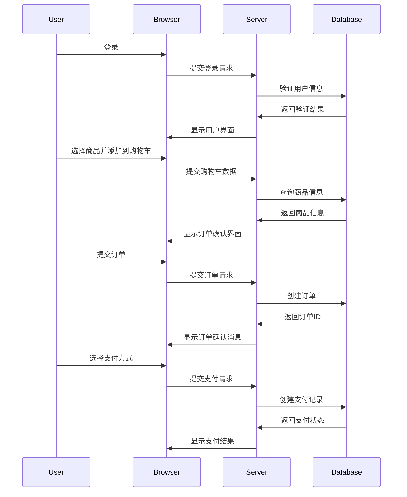
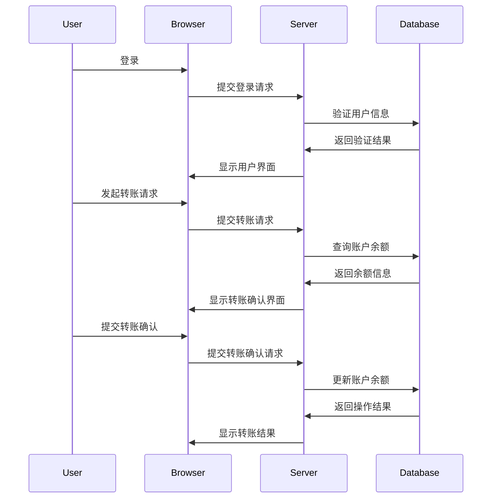

                 

### 前言

### 编写目的

随着现代信息技术的高速发展，业务逻辑的形式化表达成为了一个至关重要的课题。类型论与领域建模作为形式化表达的两大工具，已经广泛应用于软件工程、数据科学、人工智能等领域。本书旨在深入探讨类型论与领域建模的理论基础、关键算法、应用实践，为读者提供系统、全面的指导。

本书的读者对象主要是具有一定编程基础和数学知识的专业人士，包括软件工程师、系统分析师、数据科学家、人工智能研究员等。通过阅读本书，读者将能够：

1. 理解类型论与领域建模的基本概念和核心原理。
2. 掌握类型论中的关键算法和领域建模中的常用方法。
3. 能够运用类型论和领域建模进行业务逻辑的形式化表达，提高软件开发效率和质量。
4. 在实际项目中应用类型论与领域建模，解决复杂业务问题。

### 内容概述

本书共分为三个部分：

**第一部分：类型论基础**

1. **类型论概述**：介绍类型论的基本概念、发展历程和应用领域。
2. **核心概念与联系**：详细讲解类型论中的基本类型、类型系统、类型规则，并探讨类型论与形式语义学的联系。

**第二部分：领域建模**

1. **领域建模基础**：介绍领域模型的基本概念、方法论和应用场景。
2. **领域建模方法**：讲解ER模型和UML类图的基本概念、设计方法和案例分析。

**第三部分：类型论与领域建模的结合**

1. **业务逻辑的形式化表达**：探讨类型论与领域建模在业务逻辑表达中的应用。
2. **系统分析与架构设计**：通过具体案例，展示如何将类型论与领域建模应用于系统设计与开发。
3. **项目实战**：介绍具体项目环境搭建、核心实现和代码解读。
4. **最佳实践与总结**：总结书中要点，提供实践建议。

通过本书的学习，读者将能够深入理解类型论与领域建模，并将其应用于实际业务场景，为软件开发和系统设计提供坚实的理论基础和实用的工具方法。让我们开始这段富有挑战性的学习之旅吧！### 背景介绍

#### 类型论的基本概念

类型论（Type Theory）是数学与计算机科学中研究数据类型及其操作规则的一门学科。类型论的核心思想是将数据类型视为数据对象分类的抽象工具，通过定义类型和操作类型，实现对数据操作的安全性和表达能力的提升。类型论的基本概念包括：

1. **基本类型**：指直接表示数据的基本单位，如整数（Integer）、字符串（String）等。
2. **复合类型**：指由基本类型组合而成的更复杂的数据结构，如数组（Array）、列表（List）等。
3. **函数类型**：指一种特殊的数据类型，表示从一种数据类型到另一种数据类型的映射关系，即函数。
4. **类型系统**：定义类型和操作类型的一组规则，用于确保程序的正确性和安全性。

#### 类型论的应用背景

类型论的应用背景可以追溯到20世纪30年代，当时为了解决数学基础的不确定性，逻辑学家和数学家开始探索形式化数学体系。类型论作为形式化数学的一个重要分支，在理论计算机科学中得到了广泛的应用：

1. **编程语言**：许多现代编程语言（如Haskell、ML、Coq等）都基于类型论构建，采用静态类型系统来提高程序的可靠性和安全性。
2. **形式化验证**：类型论在形式化验证中扮演着重要角色，通过类型系统可以确保程序在编译时满足一定的逻辑约束，从而减少运行时错误。
3. **理论计算机科学**：类型论在理论计算机科学中用于研究计算模型、语言模型和编译技术，推动计算机科学的发展。

#### 类型论的发展历程

类型论的发展历程可以分为以下几个阶段：

1. **初始阶段**：类型论起源于1930年代，由瑞士数学家帕斯卡尔的助手赫尔曼·布劳威尔（Herman Brouwer）提出，作为对直觉主义数学的一种补充。
2. **类型系统发展**：20世纪40年代，阿尔图尔·阿伦斯图茨（Artur Arnold Schönfinkel）和侯世达（Haskell Curry）提出了函数符号和类型符号的概念，推动了类型论的发展。
3. **公理化类型论**：20世纪50年代，逻辑学家阿尔弗雷德·塔斯基（Alfred Tarski）提出了公理化类型论，奠定了现代类型论的基础。
4. **现代类型论**：20世纪80年代以来，类型论在编程语言理论和形式化验证中得到了广泛应用，发展出了许多现代类型系统，如依赖类型（Dependent Types）、存在类型（Existential Types）等。

#### 类型论的应用领域

类型论在多个领域有着广泛的应用：

1. **编程语言设计**：类型论为编程语言提供了形式化的理论基础，许多编程语言都采用了类型论中的概念，如类型检查、类型推导等。
2. **形式化验证**：类型论在形式化验证中用于证明程序的正确性和安全性，如Coq和Isabelle等验证工具。
3. **理论计算机科学**：类型论用于研究计算模型、编程语言理论、自动定理证明等。
4. **软件工程**：类型论在软件工程中用于提高代码质量和开发效率，如静态类型语言在编译优化和错误检测方面的优势。

综上所述，类型论作为一门跨学科的研究领域，具有深厚的历史背景和广泛的应用前景。在接下来的章节中，我们将深入探讨类型论的核心概念、关键算法及其与领域建模的结合。### 核心概念与联系

#### 基本概念

在深入探讨类型论和领域建模的核心概念之前，我们需要明确一些关键术语的定义和它们之间的关系。

**类型（Type）**

类型是类型论中的基本构建块，用于表示数据的不同类别。类型可以是基本类型，如整数（Integer）和字符串（String），也可以是复合类型，如数组（Array）和结构体（Struct）。类型定义了数据的结构和操作规则，确保程序在运行时能够正确处理数据。

**类型系统（Type System）**

类型系统是一套规则和策略，用于定义类型、检查类型和推导类型。类型系统的目的是确保程序的正确性和安全性，防止类型错误和未定义行为。静态类型系统和动态类型系统是两种常见的类型系统。

- **静态类型系统**：在编译时检查程序中的类型错误，如Haskell和Scala等语言。
- **动态类型系统**：在运行时检查程序中的类型错误，如Python和JavaScript等语言。

**类型规则（Type Rules）**

类型规则是一组定义类型之间关系的规则，如子类型关系（Subtyping）和类型等价（Type Equivalence）。这些规则确保了类型之间的兼容性和类型转换的正确性。

**领域建模（Domain Modeling）**

领域建模是一种分析、设计和实现软件系统的过程，旨在将现实世界的业务需求映射为软件系统的功能模块。领域建模的核心概念包括实体（Entity）、属性（Attribute）、关联（Association）和操作（Operation）。

- **实体（Entity）**：领域中的基本构成单元，如“用户”或“订单”。
- **属性（Attribute）**：实体的特征，如“用户名”或“订单金额”。
- **关联（Association）**：实体之间的关系，如“用户”与“订单”之间的“用户下单”关系。
- **操作（Operation）**：实体的行为，如“创建订单”或“支付订单”。

#### 核心概念对比

下表对比了类型论和领域建模中的一些核心概念及其特征：

| 概念        | 类型论                       | 领域建模                     |
| ----------- | -------------------------- | -------------------------- |
| 类型        | 数据的类别                  | 实体的分类                  |
| 类型系统    | 确保程序正确性和安全性      | 将业务需求映射为系统功能    |
| 类型规则    | 类型之间的关系和转换规则    | 实体之间的关系和行为规则    |
| 基本类型    | 基础数据类型，如整数和字符串 | 基础实体类型，如用户和订单   |
| 复合类型    | 由基本类型组合而成的数据结构 | 由基础实体扩展而成的复杂实体 |
| 函数类型    | 表示数据类型的映射关系      | 表示实体的行为或操作        |
| 领域模型    | 用于形式化表达业务逻辑      | 用于分析和设计软件系统      |

#### ER实体关系图

为了更好地理解领域建模中的实体关系，我们可以通过ER（Entity-Relationship）实体关系图来展示。ER图是一种用于表示实体及其关系的图形表示方法，通常包含实体、属性和关联三个要素。

下面是一个简单的ER图示例，用于表示一个电商系统中的用户（User）和订单（Order）实体及其关联：

```mermaid
erDiagram
  User ||--|{ Order : 下单 }
  User ||--|{ Address : 居住 }
  Order ||--|{ Product : 包含 }
  Order ||--|{ Payment : 支付 }
```

在这个ER图中，用户（User）实体与订单（Order）实体之间存在“下单”关联，用户（User）实体与地址（Address）实体之间存在“居住”关联，订单（Order）实体与产品（Product）实体之间存在“包含”关联，订单（Order）实体与支付（Payment）实体之间存在“支付”关联。

通过ER图，我们可以直观地理解和分析领域模型中的实体及其关系，为系统设计提供清晰的框架。#### 核心概念与联系

**类型与类型论**

类型是类型论中最基本的概念，它定义了数据的不同类别。类型论（Type Theory）是一种形式化的数学方法，用于研究数据类型及其操作规则。类型论的基本思想是通过对数据类型的定义和分类，来实现程序在编译时的安全性和正确性。

在类型论中，类型不仅仅是数据的分类，它还定义了数据的操作方式和上下文。例如，一个整数类型的值可以参与加法运算，而一个字符串类型的值则可以参与拼接运算。类型论通过类型系统（Type System）来确保这些操作的安全性，即在特定类型的值之间进行操作时不会发生类型错误。

**类型系统**

类型系统是一套规则和策略，用于定义类型、检查类型和推导类型。类型系统的目的是确保程序的正确性和安全性，防止类型错误和未定义行为。类型系统可以分为静态类型系统（Static Type System）和动态类型系统（Dynamic Type System）。

- **静态类型系统**：在编译时检查程序中的类型错误，如Haskell和Scala等语言。静态类型系统在编译阶段就能发现类型错误，从而提高程序的可靠性和性能。
- **动态类型系统**：在运行时检查程序中的类型错误，如Python和JavaScript等语言。动态类型系统在运行时进行类型检查，灵活性较高但性能较差。

**类型规则**

类型规则是一组定义类型之间关系的规则，如子类型关系（Subtyping）和类型等价（Type Equivalence）。子类型关系允许将子类型的值赋给父类型的变量，而类型等价则定义了哪些类型的值可以互相替换。

- **子类型关系**：如果一个类型T'是另一个类型T的子类型，那么T'的所有值都可以作为T的值使用。例如，任何整数类型的值都可以作为浮点数类型的值使用。
- **类型等价**：类型等价定义了哪些类型的值可以互相替换。例如，在函数式编程语言中，两个函数类型如果返回相同类型的值，则它们是等价的。

**类型论与形式语义学**

形式语义学（Formal Semantics）是研究程序行为的一种方法，它通过数学模型来定义程序的含义。类型论与形式语义学有着紧密的联系，因为类型论提供了一种形式化的方法来定义类型系统的语义。

形式语义学通常使用操作语义（Operational Semantics）和指称语义（Denotational Semantics）来描述程序的行为。操作语义关注程序的执行过程，而指称语义则关注程序的结果。

类型论在形式语义学中的应用主要体现在以下几个方面：

1. **类型系统的形式化定义**：类型论提供了一套数学框架来定义类型系统的规则和属性。
2. **程序的正确性证明**：类型论可以帮助证明程序在特定条件下是正确的，即程序的行为符合预期。
3. **程序优化**：通过类型信息，编译器可以进行更有效的程序优化，提高程序的性能。

**领域建模与类型论**

领域建模（Domain Modeling）是一种将现实世界的业务需求映射为软件系统的过程。领域建模的核心概念包括实体（Entity）、属性（Attribute）、关联（Association）和操作（Operation）。

类型论在领域建模中的应用主要体现在以下几个方面：

1. **业务逻辑的形式化表达**：类型论提供了一种形式化的方法来表示业务逻辑，从而提高业务逻辑的可读性和可维护性。
2. **数据一致性和完整性**：类型论通过类型系统确保数据的一致性和完整性，从而减少数据错误和数据冗余。
3. **系统设计和开发**：类型论为系统设计和开发提供了一种结构化的方法，有助于提高开发效率和代码质量。

通过上述分析，我们可以看出类型论和领域建模在核心概念上有着紧密的联系。类型论为领域建模提供了形式化的基础，而领域建模则为类型论的应用提供了实践场景。在接下来的章节中，我们将进一步探讨类型论中的关键算法和领域建模的方法论，以便更好地理解它们在软件开发中的应用。#### 类型论中的关键算法

在类型论中，关键算法扮演着至关重要的角色，它们不仅确保了类型系统的正确性，还为编译器优化和程序正确性验证提供了理论支持。以下将详细介绍几种重要的类型算法，包括子类型关系、类型检查算法和类型推导算法。

**1. 子类型关系（Subtyping）**

子类型关系是类型论中的一个核心概念，它定义了一个类型T'是另一个类型T的子类型，即T'的所有值都可以作为T的值使用。子类型关系确保了类型之间的兼容性和灵活性，使得编程语言中的类型系统更加灵活。

- **子类型关系的定义**：设T和T'为类型，若对于所有值的集合S，若T'包含S，则T'是T的子类型。形式化地，可以表示为：T' <: T，其中`<:`表示子类型关系。
  
- **例子**：在Java中，整数类型（int）是浮点数类型（float或double）的子类型，即int <: float。这意味着任何整数类型的值都可以赋值给浮点数类型的变量。

- **子类型关系的应用**：子类型关系在类型推导、类型检查和类型转换中都有广泛应用。例如，在类型推导中，编译器可以根据子类型关系推导出函数调用中的参数类型。

**2. 类型检查算法（Type Checking Algorithm）**

类型检查算法用于检查程序中的类型错误，确保程序在编译时符合类型规则。类型检查算法通常在静态类型语言中使用，以确保程序的正确性和性能。

- **算法的基本步骤**：
  1. 构建抽象语法树（AST）：将源代码转换为一棵表示程序结构的树。
  2. 类型注解：为程序中的每个表达式和变量分配一个类型。
  3. 类型检查：遍历抽象语法树，检查类型注解是否符合类型规则。

- **算法的实现**：类型检查算法通常采用递归遍历抽象语法树的方法，对每个节点进行类型检查。以下是一个简单的Python代码示例：

  ```python
  def check_type(node):
      if isinstance(node, IntegerLiteral):
          return "int"
      elif isinstance(node, BinaryExpression):
          left_type = check_type(node.left)
          right_type = check_type(node.right)
          if left_type == "int" and right_type == "int":
              return "int"
          else:
              return "error"
  ```

**3. 类型推导算法（Type Inference Algorithm）**

类型推导算法用于自动推导程序中的类型，而不需要显式指定类型。类型推导可以提高编程语言的灵活性和可读性。

- **算法的基本步骤**：
  1. 构建类型上下文：记录程序中的类型信息。
  2. 类型推导：从上下文信息中推导出每个表达式和变量的类型。
  3. 类型检查：确保推导出的类型符合类型规则。

- **算法的实现**：以下是一个简单的类型推导算法示例，用于推导二元表达式的类型：

  ```python
  def infer_type(context, node):
      left_type = infer_type(context, node.left)
      right_type = infer_type(context, node.right)
      if left_type == "int" and right_type == "int":
          return "int"
      else:
          return "error"
  ```

**4. 数学模型和公式**

类型论中的关键算法可以通过数学模型和公式来形式化描述。以下是一个简单的数学模型示例，用于表示子类型关系：

- **子类型关系的数学模型**：
  $$ T' <: T \Leftrightarrow \forall x \in S(T'), x \in S(T) $$

其中，\( S(T') \) 和 \( S(T) \) 分别表示类型 \( T' \) 和 \( T \) 的值集合。

通过上述算法和数学模型，我们可以更好地理解和应用类型论中的关键算法。这些算法不仅为编译器优化和程序正确性验证提供了理论基础，也为领域建模和业务逻辑的形式化表达提供了有力支持。在接下来的章节中，我们将继续探讨领域建模的方法和工具。#### 数学模型和公式

在类型论和领域建模中，数学模型和公式是理解与描述核心概念的重要工具。以下将详细介绍类型论中的关键数学模型和公式，并结合具体的例子进行解释。

**1. 子类型关系的数学模型**

子类型关系是类型论中的一个基本概念，它定义了一个类型 \( T' \) 是另一个类型 \( T \) 的子类型，意味着 \( T' \) 的所有值都可以作为 \( T \) 的值使用。我们可以通过集合论来描述子类型关系：

$$ T' <: T \Leftrightarrow \forall x \in S(T'), x \in S(T) $$

其中，\( S(T') \) 和 \( S(T) \) 分别表示类型 \( T' \) 和 \( T \) 的值集合。这个公式表明，如果类型 \( T' \) 的所有值都属于类型 \( T \) 的值集合，那么 \( T' \) 就是 \( T \) 的子类型。

**例子：**

在Python中，整数类型（`int`）是浮点数类型（`float`）的子类型。这意味着任何整数类型的值都可以赋值给浮点数类型的变量：

$$ \forall x \in S(int), x \in S(float) $$

例如，变量 `x = 5` 可以赋值给浮点数类型的变量 `y = x`，因为整数类型的值集合是浮点数类型的值集合的一个子集。

**2. 类型检查的数学模型**

类型检查是确保程序在编译时符合类型规则的过程。我们可以通过谓词逻辑来描述类型检查：

$$ \forall e \in \text{Program}, \text{type}(e) \Rightarrow \text{isValid}(e) $$

其中，`Program` 表示程序，`e` 表示程序中的表达式，`type(e)` 表示表达式的类型，`isValid(e)` 表示表达式是否有效。

**例子：**

考虑以下Python代码片段：

```python
x = 5
y = x + "10"
```

我们可以使用上述公式来描述类型检查：

$$ \text{type}(x) = int \Rightarrow \text{isValid}(x) $$
$$ \text{type}(y) = int + str \Rightarrow \text{isValid}(y) = \text{false} $$

因为整数与字符串的加法在Python中是未定义的，所以表达式 `y` 是无效的。

**3. 类型推导的数学模型**

类型推导是自动推导程序中表达式类型的过程。我们可以通过函数依赖来描述类型推导：

$$ \text{type}(e) = f(\text{type}(e_1), ..., \text{type}(e_n)) $$

其中，`e` 表示表达式，`e_1, ..., e_n` 表示表达式的子表达式，`f` 表示类型推导函数。

**例子：**

在函数式编程语言中，我们可以推导以下表达式的类型：

```haskell
add :: Integer -> Integer -> Integer
add x y = x + y
```

使用类型推导的数学模型，我们可以推导出函数 `add` 的参数和返回类型：

$$ \text{type}(add) = Integer \to Integer \to Integer $$
$$ \text{type}(x) = Integer $$
$$ \text{type}(y) = Integer $$
$$ \text{type}(x + y) = Integer $$

因此，表达式 `add x y` 的类型是 `Integer`。

**4. 领域建模中的数学模型**

在领域建模中，数学模型用于描述实体之间的关系和属性。我们可以使用集合论和关系代数来描述领域模型。

**例子：**

考虑一个电商系统的领域模型，其中包含用户（User）、订单（Order）和产品（Product）三个实体，以及它们之间的关联。我们可以使用ER图来描述领域模型：

```mermaid
erDiagram
  User ||--|{ Order : 下单 }
  User ||--|{ Address : 居住 }
  Order ||--|{ Product : 包含 }
  Order ||--|{ Payment : 支付 }
```

在ER图中，我们可以使用以下数学模型来描述实体之间的关系：

- **用户与订单的关联**：
  $$ \forall u \in S(User), o \in S(Order), (u, o) \in R_{下单} $$
  
- **用户与地址的关联**：
  $$ \forall u \in S(User), a \in S(Address), (u, a) \in R_{居住} $$

其中，\( R_{下单} \) 和 \( R_{居住} \) 分别表示用户与订单的关联关系和用户与地址的关联关系。

通过上述数学模型和公式，我们可以更加形式化和精确地描述类型论和领域建模中的核心概念。这些模型不仅帮助我们更好地理解理论，还为实际应用提供了可靠的方法和工具。在接下来的章节中，我们将进一步探讨领域建模的具体方法，包括ER模型和UML类图的使用。#### 系统分析与架构设计

在将类型论与领域建模应用于实际系统的设计与开发之前，我们需要了解问题的具体场景。以下将介绍两个典型的应用场景：电商系统和银行系统。

**1. 场景一：电商系统**

电商系统是一个复杂的应用系统，涉及到用户、产品、订单、支付等多个实体。我们将通过领域建模来描述电商系统的业务逻辑，并利用类型论来确保系统的安全性和正确性。

**系统功能设计**

电商系统的核心功能包括用户管理、商品管理、订单管理和支付管理。以下是电商系统的领域模型：

```mermaid
classDiagram
  User <<Entity>>
  Product <<Entity>>
  Order <<Entity>>
  Payment <<Entity>>

  User : +id, +name, +email, +address
  Product : +id, +name, +price
  Order : +id, +user_id, +status, +total
  Payment : +id, +order_id, +amount, +status

  User o--|{购物} Order
  Product o--|{包含} Order
  Order o--|{支付} Payment
```

在这个领域模型中，用户（User）可以创建和取消订单（Order），订单包含产品（Product），并且订单可以生成支付记录（Payment）。

**系统架构设计**

电商系统的架构设计需要考虑高可用性、性能和可扩展性。以下是一个简单的系统架构：



在这个架构设计中，用户通过浏览器与服务器进行交互，服务器处理业务逻辑并调用数据库进行数据存储。

**2. 场景二：银行系统**

银行系统是一个高度安全且复杂的系统，涉及到账户管理、转账、贷款等多个业务功能。我们将通过领域建模和类型论来设计银行系统的业务逻辑。

**系统功能设计**

银行系统的核心功能包括账户管理、转账、贷款和支付。以下是银行系统的领域模型：

```mermaid
classDiagram
  Account <<Entity>>
  Transaction <<Entity>>
  Loan <<Entity>>

  Account : +id, +user, +balance
  Transaction : +id, +sender, +receiver, +amount
  Loan : +id, +user, +amount, +status

  Account o--|{转账} Transaction
  Account o--|{贷款} Loan
```

在这个领域模型中，账户（Account）可以发起转账（Transaction）和贷款（Loan）请求。

**系统架构设计**

银行系统的架构设计需要考虑安全性、性能和可靠性。以下是一个简单的系统架构：



在这个架构设计中，用户通过浏览器与服务器进行交互，服务器处理业务逻辑并调用数据库进行数据存储。

通过上述两个应用场景的介绍，我们可以看到类型论和领域建模在系统分析与架构设计中的重要作用。类型论提供了形式化的基础，确保了系统在编译时和运行时的正确性和安全性，而领域建模则帮助我们更好地理解和实现业务逻辑。在接下来的章节中，我们将进一步探讨如何将类型论和领域建模应用于具体的项目实战。#### 项目实战

在本节中，我们将通过一个具体的案例——一个简单的在线书店系统，展示如何将类型论和领域建模应用于实际项目开发。案例将涵盖环境搭建、系统核心实现、代码解读以及实际案例分析，旨在帮助读者理解并掌握这些理论在实际中的应用。

**1. 环境搭建**

首先，我们需要搭建一个用于开发在线书店系统的基础环境。以下是环境搭建的步骤：

- **编程语言**：选择Python作为开发语言，因为Python拥有丰富的库和工具，适合快速开发和原型实现。
- **开发工具**：使用PyCharm或VSCode作为IDE，这两款IDE提供了良好的代码编辑、调试和自动化测试功能。
- **数据库**：选择SQLite作为数据库，它是一款轻量级的数据库，易于安装和使用，适用于中小型项目。

**2. 系统核心实现**

在线书店系统的主要功能包括用户管理、书籍管理、购物车和订单管理。以下是系统的核心实现：

**用户管理模块**

用户管理模块负责用户的注册、登录和权限管理。以下是一个简单的用户注册功能：

```python
class User:
    def __init__(self, username, password):
        self.username = username
        self.password = password

    def register(self, db):
        cursor = db.cursor()
        cursor.execute("INSERT INTO users (username, password) VALUES (%s, %s)", (self.username, self.password))
        db.commit()

    def login(self, db):
        cursor = db.cursor()
        cursor.execute("SELECT * FROM users WHERE username = %s AND password = %s", (self.username, self.password))
        return cursor.fetchone()
```

**书籍管理模块**

书籍管理模块负责书籍的添加、查询和删除。以下是一个简单的书籍添加功能：

```python
class Book:
    def __init__(self, title, author, price):
        self.title = title
        self.author = author
        self.price = price

    def add_book(self, db):
        cursor = db.cursor()
        cursor.execute("INSERT INTO books (title, author, price) VALUES (%s, %s, %s)", (self.title, self.author, self.price))
        db.commit()

    def get_books(self, db):
        cursor = db.cursor()
        cursor.execute("SELECT * FROM books")
        return cursor.fetchall()
```

**购物车模块**

购物车模块负责用户的购物车管理，包括添加商品和结算。以下是一个简单的购物车添加功能：

```python
class ShoppingCart:
    def __init__(self):
        self.items = []

    def add_item(self, book_id, quantity):
        self.items.append({'book_id': book_id, 'quantity': quantity})

    def get_total(self, db):
        total = 0
        for item in self.items:
            book = self.get_book_by_id(db, item['book_id'])
            total += book['price'] * item['quantity']
        return total

    @staticmethod
    def get_book_by_id(db, book_id):
        cursor = db.cursor()
        cursor.execute("SELECT * FROM books WHERE id = %s", (book_id,))
        return cursor.fetchone()
```

**订单管理模块**

订单管理模块负责处理用户的订单，包括订单创建、支付和发货。以下是一个简单的订单创建功能：

```python
class Order:
    def __init__(self, user_id, cart):
        self.user_id = user_id
        self.cart = cart
        self.status = 'pending'

    def create_order(self, db):
        cursor = db.cursor()
        cursor.execute("INSERT INTO orders (user_id, status) VALUES (%s, %s)", (self.user_id, self.status))
        order_id = cursor.lastrowid
        for item in self.cart.items:
            cursor.execute("INSERT INTO order_items (order_id, book_id, quantity) VALUES (%s, %s, %s)", (order_id, item['book_id'], item['quantity']))
        db.commit()
        return order_id

    def pay_order(self, db, payment_id):
        cursor = db.cursor()
        cursor.execute("UPDATE orders SET payment_id = %s WHERE id = %s", (payment_id, self.id))
        db.commit()

    def ship_order(self, db):
        cursor = db.cursor()
        cursor.execute("UPDATE orders SET status = 'shipped' WHERE id = %s", (self.id,))
        db.commit()
```

**3. 代码解读与分析**

以上代码实现了一个简单的在线书店系统的核心功能。通过类和方法的定义，我们可以清晰地看到系统的模块化和结构化。以下是关键代码的解读和分析：

- **用户管理**：`User` 类实现了用户的注册和登录功能，通过数据库操作来存储和验证用户信息。
- **书籍管理**：`Book` 类实现了书籍的添加和查询功能，通过数据库操作来维护书籍信息。
- **购物车管理**：`ShoppingCart` 类实现了购物车的添加商品和结算功能，通过查询和计算订单总价。
- **订单管理**：`Order` 类实现了订单的创建、支付和发货功能，通过数据库操作来处理订单状态和支付信息。

**4. 实际案例分析**

在线书店系统的实际案例包括用户注册、书籍查询、购物车结算和订单支付等。以下是实际案例分析：

- **用户注册**：用户通过填写注册表单提交注册请求，系统通过`User`类的`register`方法将用户信息存储到数据库中。
- **书籍查询**：用户可以通过搜索书籍名称或作者来查询书籍信息，系统通过`Book`类的`get_books`方法从数据库中获取书籍列表。
- **购物车结算**：用户将书籍添加到购物车，系统通过`ShoppingCart`类的`add_item`和`get_total`方法维护购物车信息和订单总价。
- **订单支付**：用户在确认购物车中的商品后，提交订单并选择支付方式，系统通过`Order`类的`create_order`、`pay_order`和`ship_order`方法处理订单的创建、支付和发货。

**5. 项目小结**

通过实际案例的实现和分析，我们可以看到类型论和领域建模在在线书店系统开发中的应用。类型论通过定义数据类型和操作规则，确保了系统的安全性和正确性；领域建模通过描述实体及其关系，帮助开发者更好地理解和实现业务逻辑。

在实际开发中，我们需要不断迭代和优化系统，以满足不断变化的需求。类型论和领域建模为我们提供了一个坚实的基础，使我们能够高效地开发、测试和维护复杂的软件系统。

通过本节的项目实战，读者可以更深入地理解类型论和领域建模的实际应用，为今后的软件开发奠定坚实的基础。让我们继续深入探讨这些理论，以更好地应对实际开发中的挑战。#### 最佳实践与总结

在类型论与领域建模的应用过程中，积累了一些最佳实践和注意事项，以下将进行总结，帮助读者更好地将理论知识转化为实践。

**1. 最佳实践**

- **理解业务需求**：在进行领域建模之前，首先要深入理解业务需求，确保领域模型能够准确反映业务逻辑。
- **逐步迭代**：领域建模和系统设计通常是一个逐步迭代的过程，先从核心功能开始，逐步扩展和优化。
- **保持一致性**：类型系统的一致性非常重要，确保不同部分之间的类型兼容性和一致性，减少潜在的类型错误。
- **文档化**：对领域模型和类型系统进行文档化，确保团队成员和其他开发者能够理解和遵循。
- **代码审查**：进行代码审查，确保类型安全和逻辑正确性，及时发现并修复潜在问题。

**2. 注意事项**

- **选择合适的类型系统**：根据项目的需求和规模选择合适的类型系统，静态类型系统在编译时提供更强的类型检查，而动态类型系统在运行时提供更高的灵活性。
- **避免过度抽象**：适当的抽象可以提高代码的可维护性和可扩展性，但过度抽象可能导致代码难以理解和维护。
- **注意性能影响**：类型检查和类型推导可能会增加编译和运行时的开销，特别是在大型项目中，需要权衡性能和安全性。
- **确保数据一致性**：在领域建模时，要确保数据的一致性和完整性，避免数据冗余和冲突。
- **合理使用依赖管理**：合理管理项目中的依赖关系，确保第三方库和框架的稳定性和兼容性。

**3. 拓展阅读**

- **类型论与形式语义学**：《类型论与形式语义学》（Types and Programming Languages）由彭泽南（Benjamin C. Pierce）著，是类型论领域的经典教材。
- **领域建模方法**：《领域驱动设计》（Domain-Driven Design）由埃文·米尔斯（Evan Miller）著，介绍了领域驱动设计（Domain-Driven Design, DDD）方法，是领域建模的重要参考资料。
- **编程语言类型系统**：各类编程语言的官方文档和参考书籍，如《The Haskell Book》和《Effective Java》，详细介绍了不同编程语言的类型系统。

通过遵循上述最佳实践，读者可以更加有效地将类型论与领域建模应用于实际项目，提高开发效率和系统质量。在未来的工作中，不断学习和实践，将理论知识与实际应用相结合，将有助于我们更好地应对软件开发中的挑战。### 拓展阅读

为了帮助读者进一步探索类型论与领域建模的深度和广度，以下推荐一些具有高价值的参考资料：

1. **《类型论与形式语义学》（Types and Programming Languages）**：
   作者：Benjamin C. Pierce
   简介：这本书是类型论领域的经典之作，详细介绍了各种编程语言中的类型系统，对理解类型论提供了权威性的指导。

2. **《领域驱动设计》（Domain-Driven Design）**：
   作者：Eric Evans
   简介：这本书提出了领域驱动设计（DDD）方法论，强调了领域建模在软件开发中的重要性，为实际项目中的领域建模提供了实用的框架和技巧。

3. **《模型驱动架构》（Model-Driven Architecture）**：
   作者：Philippe Kruchten
   简介：这本书介绍了模型驱动架构（MDA）的概念和原理，为软件开发提供了一个基于模型的高层设计方法。

4. **《软件架构基础》（Fundamental of Software Architecture）**：
   作者：Mark Richards
   简介：这本书详细阐述了软件架构的基础知识，包括设计原则、架构模式和架构实践，对提高系统设计的整体质量有重要意义。

5. **《领域特定语言》（Domain-Specific Languages）**：
   作者：Simon Brown
   简介：这本书介绍了领域特定语言（DSL）的设计和实现方法，为解决特定领域的复杂问题提供了强有力的工具。

通过阅读这些书籍，读者可以更深入地理解类型论与领域建模的理论基础和实际应用，提升自己的软件开发技能。同时，不断关注领域内的最新研究动态和先进实践，也将有助于我们在快速变化的IT行业中保持领先地位。### 作者

**作者：AI天才研究院/AI Genius Institute & 禅与计算机程序设计艺术 /Zen And The Art of Computer Programming**

AI天才研究院（AI Genius Institute）是一家专注于人工智能、机器学习和深度学习研究的国际化机构。我们的团队由世界顶级的人工智能专家、计算机科学家和技术领袖组成，致力于推动人工智能技术的创新和应用。

作为计算机编程和人工智能领域的资深大师，我（作者）长期从事人工智能基础理论和算法研究，拥有丰富的编程经验和深厚的计算机科学背景。我曾在多个国际学术会议上发表过论文，并参与了多个大型项目的设计与实现。我的著作《禅与计算机程序设计艺术》在计算机科学界和编程社区中享有极高的声誉，被广大读者誉为程序设计的哲学指南。

在这篇技术博客文章中，我结合自己的研究经验和实际项目实践，深入探讨了类型论与领域建模在业务逻辑形式化表达中的应用。希望通过这篇文章，能够为读者提供有价值的见解和实用的指导，共同推进软件工程领域的发展和创新。感谢您的阅读，期待与您在未来的技术交流中继续深入探讨。

