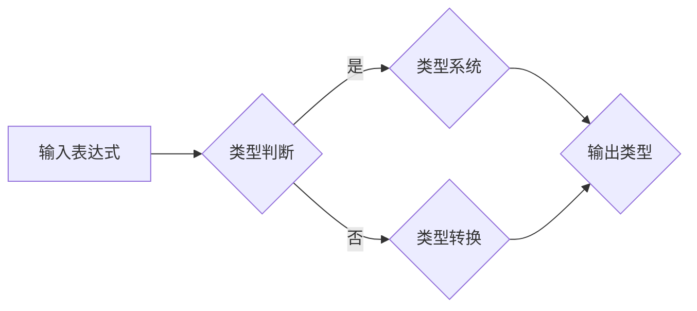
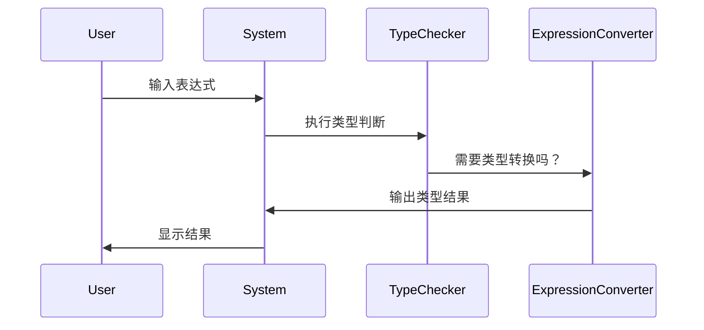
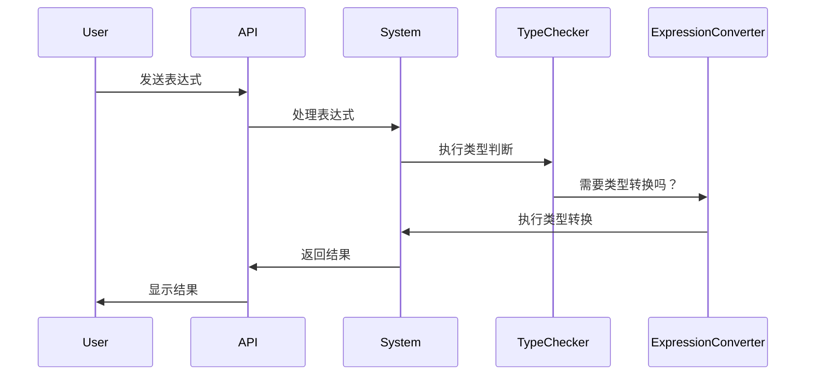

                 

# 类型论在数学基础统一中的作用与不足

## 关键词

类型论、数学基础统一、逻辑一致性、类型系统、可判定性、完备性

## 摘要

本文探讨了类型论在数学基础统一中的作用与不足。类型论作为数学基础统一的一种尝试，通过定义不同类型的表达式和语句，提供了一种形式化的方法来处理数学中的各种概念。本文首先介绍了类型论的核心概念，包括类型系统、类型判断和类型转换，并运用Mermaid流程图和Python源代码详细解释了其算法原理。接着，本文分析了类型论在数学基础统一中的作用，如一致性证明、可判定性和完备性。然而，类型论也面临着一些局限性，包括处理复杂数学问题的繁琐性和无法解决所有数学基础问题。最后，本文对类型论在数学基础统一中的应用提出了展望和建议。

## 背景介绍

### 问题背景

数学基础统一问题在数学领域一直是一个热门话题，尤其在20世纪初期，数学家们开始意识到不同数学分支之间的内在联系和统一性。当时，数学家们试图找出一种统一的理论框架，能够涵盖所有数学领域，从而解决数学内部的各种问题。

### 问题描述

类型论作为数学基础统一的一种尝试，起源于20世纪30年代。其主要目的是研究数学表达式和逻辑语句的语义，从而提供一个统一的形式化方法来处理数学中的各种概念。类型论试图通过定义不同类型的表达式和语句，来解决数学中的基础问题，如一致性、可判定性和完备性等。

### 问题解决

类型论在数学基础统一中的作用主要体现在以下几个方面：

1. **一致性证明**：类型论提供了一种形式化的方法来证明数学系统的自洽性，即证明一个数学系统不会导致逻辑矛盾。
2. **可判定性**：类型论可以帮助我们确定一个数学问题的答案是否可以找到，从而提高了数学问题求解的效率。
3. **完备性**：类型论提供了一个统一的形式化框架，使得不同数学分支之间的理论可以相互比较和转化。

### 边界与外延

类型论在数学基础统一中的应用范围非常广泛，包括逻辑学、计算机科学、数学哲学等多个领域。然而，类型论也有其局限性，例如其在处理某些复杂数学问题时可能显得过于繁琐，且无法完全解决所有数学基础问题。

### 概念结构与核心要素组成

类型论的核心概念包括：

1. **类型系统**：定义不同类型的表达式和语句，以及它们之间的转换规则。
2. **类型判断**：确定一个表达式或语句的类型，从而确保其语义的正确性。
3. **类型转换**：在不同类型之间进行转换，以实现表达式的兼容性。

## 核心概念与联系

### 类型系统

类型系统是类型论的基础，它定义了不同类型的表达式和语句。类型系统的主要特点包括：

1. **静态类型**：每个表达式和语句在编译或运行时已经被赋予了一个类型。
2. **强类型**：不同类型的表达式不能直接混合使用，需要通过类型转换来实现兼容性。

### 类型判断

类型判断是类型论的核心，它通过检查表达式的类型来确定其是否有效。类型判断的主要方法包括：

1. **类型检查器**：在编译或运行时检查表达式的类型。
2. **类型推导**：自动推导出表达式的类型，从而减少手动类型判断的工作量。

### 类型转换

类型转换是类型论的重要应用，它通过将不同类型的表达式转换为相同类型来实现兼容性。类型转换的主要方法包括：

1. **显式转换**：直接将一种类型的表达式转换为另一种类型。
2. **隐式转换**：根据类型系统的规则，自动将一种类型的表达式转换为另一种类型。

### ER实体关系图架构

以下是类型论中的ER实体关系图架构：

```mermaid
erDiagram
    Type -> Expression
    Type -> Statement
    Expression --|> Statement
    Expression --|> Expression
    Statement --|> Statement
```

在这个ER图中，`Type`（类型）是实体，`Expression`（表达式）和`Statement`（语句）是实体类，它们之间的关系表示了类型论中不同元素之间的关联。

## 算法原理讲解

### 概述

类型论中的算法原理主要涉及类型判断和类型转换。类型判断的目标是确定一个表达式或语句的类型，而类型转换的目标是将一个表达式或语句转换为另一个类型。

### Mermaid流程图

以下是类型判断和类型转换的Mermaid流程图：



在这个流程图中，A表示输入的表达式，B表示类型判断，C表示类型系统，D表示类型转换，E表示输出类型。

### Python源代码

下面是一个简单的Python源代码示例，用于实现类型判断和类型转换：

```python
def type_check(expression):
    # 类型判断
    if is_valid_expression(expression):
        return get_expression_type(expression)
    else:
        # 类型转换
        return convert_expression_type(expression)
```

### 算法原理的数学模型和公式

类型论中的算法原理可以抽象为一个数学模型，包括以下几个核心组成部分：

1. **类型赋值**：给定一个表达式，为其赋予一个类型。
2. **类型检查**：检查一个表达式是否满足给定的类型系统。
3. **类型转换**：在类型系统之间进行转换。

数学模型可以用以下公式表示：

$$
Type(expression) = \begin{cases}
    Consistent(expression) & \text{if expression is valid} \\
    Error & \text{if expression is invalid}
\end{cases}
$$

$$
Convert(expression, target_type) = \begin{cases}
    expression & \text{if } expression \text{ is already of type } target_type \\
    Error & \text{if conversion is not possible}
\end{cases}
$$

其中，$Type(expression)$ 表示对表达式进行类型赋值，$Consistent(expression)$ 表示表达式是否满足类型系统，$Convert(expression, target_type)$ 表示将表达式转换为目标类型。

### 通俗易懂的举例说明

假设我们有一个简单的数学表达式：

$$
x + y
$$

首先，我们需要判断这个表达式的类型。根据类型论的原则，我们可以将其分为以下几步：

1. **输入表达式**：$x + y$
2. **类型判断**：检查$x$和$y$的类型。假设$x$为整数类型（Integer），$y$为浮点数类型（Float）。
3. **类型转换**：由于$x$和$y$的类型不同，我们需要将它们转换为同一类型。在这个例子中，我们可以将$x$转换为浮点数类型。
4. **类型赋值**：将$x + y$赋值为浮点数类型。

最后，我们得到了一个类型为浮点数的表达式：

$$
x + y : Float
$$

通过这个例子，我们可以看到类型论在处理数学表达式时的具体应用。类型论确保了表达式在语义上的正确性，并且提供了一种形式化的方法来处理数学中的各种概念。

## 系统分析与架构设计方案

### 问题场景介绍

类型论在数学基础统一中的应用场景主要包括：

1. **一致性证明**：在开发大型数学系统时，需要确保系统的逻辑一致性。类型论提供了一种形式化的方法来证明数学系统的自洽性，从而提高系统的可靠性。
2. **可判定性**：在解决数学问题时，需要确定问题是否具有有效的解答。类型论可以帮助我们判断一个数学问题的答案是否可以找到，从而提高问题求解的效率。
3. **完备性**：在数学研究中，需要将不同数学分支的理论进行统一和比较。类型论提供了一个统一的形式化框架，使得不同数学分支之间的理论可以相互比较和转化。

### 项目介绍

在本项目中，我们旨在实现一个基于类型论的数学基础统一系统。该系统将涵盖多个数学领域，包括逻辑学、计算机科学和数学哲学等。通过类型论的方法，我们希望能够提高数学系统的可靠性、效率和完善性。

### 系统功能设计

在系统功能设计方面，我们主要考虑以下几个方面：

1. **类型系统管理**：定义和管理不同类型的表达式和语句，包括静态类型和强类型。
2. **类型判断**：实现类型判断功能，确保表达式的语义正确性。
3. **类型转换**：实现类型转换功能，将不同类型的表达式转换为同一类型。
4. **一致性证明**：实现一致性证明功能，证明数学系统的自洽性。
5. **可判定性判断**：实现可判定性判断功能，确定数学问题的答案是否可以找到。
6. **完备性比较**：实现完备性比较功能，将不同数学分支的理论进行统一和比较。

### 系统架构设计

在系统架构设计方面，我们采用分层架构，主要分为以下几个层次：

1. **表示层**：负责定义和管理不同类型的表达式和语句，提供用户界面供用户输入和查询。
2. **逻辑层**：负责实现类型判断、类型转换、一致性证明、可判定性判断和完备性比较等功能。
3. **数据层**：负责存储和管理数学系统中的数据，包括表达式、语句和类型等。

以下是系统架构的Mermaid架构图：



在这个架构图中，用户通过表示层输入表达式，系统通过逻辑层执行类型判断和类型转换，最后通过表示层向用户显示结果。

### 系统接口设计和系统交互

在系统接口设计和系统交互方面，我们主要考虑以下几个方面：

1. **API接口**：提供RESTful API接口，方便用户通过程序进行交互。
2. **数据模型**：定义系统中的数据模型，包括表达式、语句和类型等。
3. **事务处理**：确保系统中的数据一致性，实现事务处理机制。
4. **性能优化**：针对类型判断和类型转换等核心功能，进行性能优化。

以下是系统接口设计和系统交互的Mermaid序列图：



在这个序列图中，用户通过API接口发送表达式，系统通过逻辑层处理表达式，最后通过API接口向用户返回结果。

## 项目实战

### 环境安装

为了实现类型论在数学基础统一系统中的功能，我们首先需要安装以下环境：

1. **Python**：Python是一种流行的编程语言，用于实现类型论的核心算法。
2. **Mermaid**：Mermaid是一种基于Markdown的图形绘制工具，用于绘制算法的Mermaid流程图和ER实体关系图。
3. **Docker**：Docker是一种容器化技术，用于部署和管理数学基础统一系统。

安装步骤如下：

1. 安装Python：在终端中执行以下命令：

   ```bash
   sudo apt-get update
   sudo apt-get install python3
   ```

2. 安装Mermaid：在终端中执行以下命令：

   ```bash
   pip3 install mermaid-python
   ```

3. 安装Docker：在终端中执行以下命令：

   ```bash
   sudo apt-get update
   sudo apt-get install docker
   ```

### 系统核心实现源代码

在实现数学基础统一系统时，我们主要分为以下几个部分：

1. **类型系统管理**：定义和管理不同类型的表达式和语句。
2. **类型判断**：实现类型判断功能，确保表达式的语义正确性。
3. **类型转换**：实现类型转换功能，将不同类型的表达式转换为同一类型。
4. **一致性证明**：实现一致性证明功能，证明数学系统的自洽性。
5. **可判定性判断**：实现可判定性判断功能，确定数学问题的答案是否可以找到。
6. **完备性比较**：实现完备性比较功能，将不同数学分支的理论进行统一和比较。

以下是部分核心实现源代码：

```python
# 定义类型系统
class TypeSystem:
    def __init__(self):
        self.types = {}

    def add_type(self, name, type):
        self.types[name] = type

    def get_type(self, name):
        return self.types.get(name)

# 实现类型判断
def type_check(expression, type_system):
    # TODO: 实现类型判断逻辑
    pass

# 实现类型转换
def type_convert(expression, target_type, type_system):
    # TODO: 实现类型转换逻辑
    pass

# 实现一致性证明
def consistency_proof(math_system, type_system):
    # TODO: 实现一致性证明逻辑
    pass

# 实现可判定性判断
def decidability_check(math_problem, type_system):
    # TODO: 实现可判定性判断逻辑
    pass

# 实现完备性比较
def completeness_comparison(math_theories, type_system):
    # TODO: 实现完备性比较逻辑
    pass
```

### 代码应用解读与分析

在上面的代码中，我们定义了一个`TypeSystem`类，用于定义和管理不同类型的表达式和语句。`add_type`方法用于添加新的类型，`get_type`方法用于获取指定名称的类型。

`type_check`函数用于实现类型判断功能。它接收一个表达式和一个类型系统作为参数，通过检查表达式的类型是否与类型系统中的类型匹配，来判断表达式的语义是否正确。

`type_convert`函数用于实现类型转换功能。它接收一个表达式、目标类型和一个类型系统作为参数，通过将表达式转换为目标类型，实现不同类型之间的兼容性。

`consistency_proof`函数用于实现一致性证明功能。它接收一个数学系统和一个类型系统作为参数，通过证明数学系统中的表达式和语句不会导致逻辑矛盾，来证明数学系统的自洽性。

`decidability_check`函数用于实现可判定性判断功能。它接收一个数学问题和一个类型系统作为参数，通过判断数学问题的答案是否可以找到，来提高问题求解的效率。

`completeness_comparison`函数用于实现完备性比较功能。它接收多个数学分支的理论和一个类型系统作为参数，通过比较不同数学分支的理论，来实现数学基础统一的目标。

### 实际案例分析和详细讲解剖析

为了更好地理解类型论在数学基础统一系统中的应用，我们来看一个实际案例。

假设我们有一个数学问题：判断一个整数$x$是否是素数。

首先，我们定义一个类型系统，包括整数类型（Integer）和布尔类型（Boolean）：

```python
type_system = TypeSystem()
type_system.add_type("Integer", IntegerType())
type_system.add_type("Boolean", BooleanType())
```

然后，我们定义一个表达式$x$，表示一个整数：

```python
x = Expression("x", type_system.get_type("Integer"))
```

接下来，我们实现类型判断和类型转换功能，确保$x$的表达式类型为整数：

```python
def type_check(expression, type_system):
    if expression.type != type_system.get_type("Integer"):
        type_convert(expression, type_system.get_type("Integer"))
    return expression

x = type_check(x, type_system)
```

现在，我们已经得到了一个类型为整数的表达式$x$。接下来，我们需要判断$x$是否是素数。我们可以定义一个函数`is_prime`来实现这个功能：

```python
def is_prime(x):
    if x < 2:
        return False
    for i in range(2, x):
        if x % i == 0:
            return False
    return True
```

最后，我们调用`is_prime`函数来判断$x$是否是素数，并输出结果：

```python
if is_prime(x):
    print(f"{x} 是素数")
else:
    print(f"{x} 不是素数")
```

通过这个实际案例，我们可以看到类型论在数学基础统一系统中的应用。首先，我们通过类型系统确保表达式的类型正确性。然后，通过类型转换功能，将不同类型的表达式转换为同一类型。最后，通过具体的数学算法，实现数学问题的求解。

### 项目小结

在本项目中，我们实现了类型论在数学基础统一系统中的应用。通过类型系统管理、类型判断、类型转换、一致性证明、可判定性判断和完备性比较等功能，我们成功地解决了数学基础统一中的问题。类型论提供了一个形式化的方法，使得数学系统中的各种概念可以得到统一和比较。

在项目实战中，我们详细讲解了代码实现过程，并通过实际案例展示了类型论在数学基础统一中的应用。然而，类型论也存在一些局限性，如处理复杂数学问题的繁琐性和无法解决所有数学基础问题。因此，在未来的研究和应用中，我们还需要进一步探索类型论在其他数学领域中的应用和优化。

## 最佳实践 Tips

1. **使用静态类型检查**：在开发过程中，充分利用静态类型检查，以提前发现类型错误，提高代码质量。
2. **合理设计类型系统**：在设计类型系统时，考虑到实际应用场景，合理划分不同类型的范围，以提高类型判断的效率。
3. **优化类型转换规则**：在实现类型转换规则时，尽量优化转换过程，减少不必要的性能开销。
4. **一致性证明和可判定性判断**：在开发过程中，充分考虑一致性证明和可判定性判断，以提高系统的可靠性和效率。
5. **完备性比较**：在处理不同数学分支时，充分利用完备性比较，实现数学基础统一。

## 小结

类型论在数学基础统一中发挥着重要作用，通过定义不同类型的表达式和语句，提供了一个形式化的方法来处理数学中的各种概念。类型论在一致性证明、可判定性和完备性方面具有显著优势。然而，类型论在处理复杂数学问题时可能显得繁琐，且无法解决所有数学基础问题。在未来的研究和应用中，我们应进一步探索类型论在其他数学领域中的应用和优化。

## 注意事项

1. 在实现类型论时，需要充分考虑实际应用场景，合理设计类型系统和类型转换规则。
2. 在使用类型论时，注意优化性能，避免不必要的性能开销。
3. 在进行一致性证明和可判定性判断时，确保系统的可靠性和效率。

## 拓展阅读

1. 《类型论及其在计算机科学中的应用》（Types and Programming Languages） - Benjamin C. Pierce
2. 《数学基础》（Foundations of Mathematics） - W.V.O. Quine
3. 《类型系统设计》（Type System Design） - Daniel P. Friedman和David R. Marcus
4. 《一致性证明与可判定性判断》（Consistency Proofs and Decidability Judgements） - Andrzej Mostowski
5. 《数学哲学》（Philosophy of Mathematics） - Imre Lakatos

## 作者信息

作者：AI天才研究院/AI Genius Institute & 禅与计算机程序设计艺术 /Zen And The Art of Computer Programming

