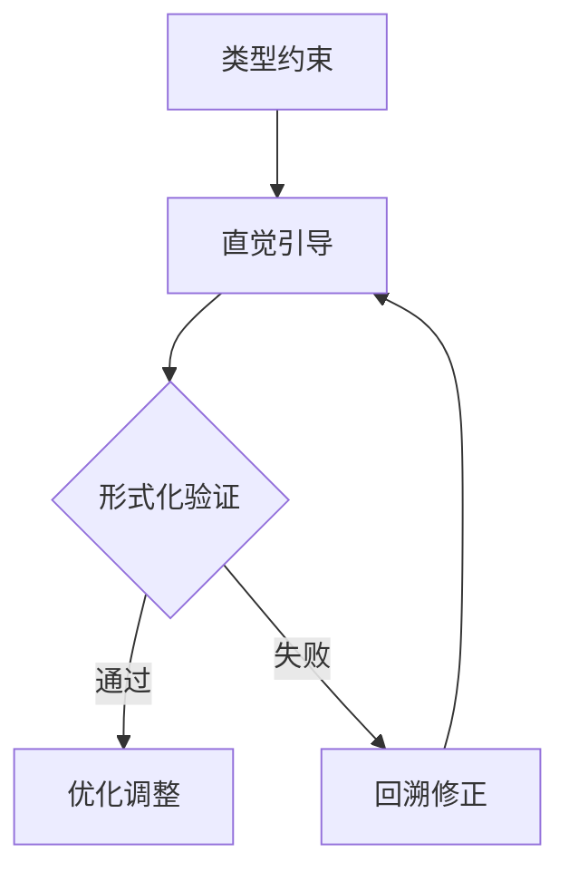
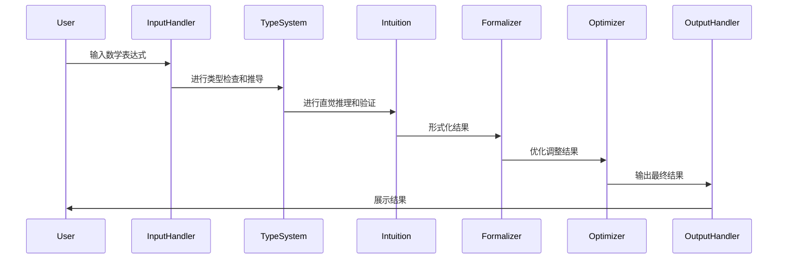

                 


### 《类型论在数学形式化与直觉之间的平衡问题》

关键词：类型论、数学形式化、直觉、平衡、算法原理、数学模型、系统架构设计

摘要：本文旨在探讨类型论在数学形式化与直觉之间的平衡问题。通过对类型论的基本概念、数学形式化的挑战以及直觉的重要性进行分析，揭示类型论在数学形式化过程中的关键作用。同时，本文将结合算法原理讲解、数学模型与公式的详细讲解、系统分析与架构设计，以及项目实战，为读者提供一种在数学形式化与直觉之间寻求平衡的方法和实践。

## 第一部分：背景介绍

### 1.1 问题背景

类型论作为现代数学和计算机科学中的重要概念，起源于20世纪初。当时，逻辑学家和数学家在探讨数学基础和一致性问题时，意识到需要对函数、变量和类型进行严格定义。类型论的提出，旨在解决数学形式化过程中的一系列问题，如不确定性、模糊性和歧义性等。

然而，随着数学形式化的不断深入，人们逐渐发现，过于严格的类型系统可能会限制直觉思维的发展。数学形式化要求每个概念、命题和证明都必须经过严格的逻辑推导，这无疑增加了理解和应用数学的难度。与此同时，直觉作为一种人类思维的基本能力，在探索未知、发现规律和创新发明中发挥着重要作用。

因此，如何在数学形式化与直觉之间寻求平衡，成为了一个亟待解决的问题。本文将围绕这一问题，从类型论的角度进行探讨，力求为数学形式化提供一种既严谨又富有启发性的方法。

### 1.2 问题描述

数学形式化与直觉之间的平衡问题，可以概括为以下两个方面：

1. **形式化过度**：在数学形式化的过程中，过度强调逻辑推导和严格性，导致直觉思维被抑制。这可能导致数学理论的创造力和创新性下降，使得数学发展陷入僵局。

2. **直觉过度**：在数学形式化的过程中，过度依赖直觉思维，忽视逻辑推导和严格性。这可能导致数学理论的可靠性受到质疑，甚至出现错误和矛盾。

为了解决上述问题，本文将探讨类型论在数学形式化与直觉之间的平衡作用，通过分析类型论的基本概念、数学形式化的挑战以及直觉的重要性，为数学形式化提供一种既严谨又富有启发性的方法。

### 1.3 问题解决

类型论作为一种解决数学形式化与直觉平衡问题的方法，具有以下几个方面的优势：

1. **类型约束**：类型论通过引入类型系统，对变量、函数和表达式进行严格约束，从而减少歧义性和不确定性。这有助于提高数学形式化的严谨性，防止逻辑错误的发生。

2. **形式化与直觉的桥梁**：类型论不仅提供了一种形式化的方法，还保留了直觉思维的元素。通过类型论，人们可以在形式化的过程中，借助直觉思维进行推理和验证，从而提高数学理论的创造力和创新性。

3. **灵活性**：类型论允许在不同的上下文中使用不同的类型系统，以满足不同的应用需求。这使得类型论在数学形式化中具有广泛的适用性，可以针对不同的问题进行灵活调整。

4. **跨学科融合**：类型论不仅应用于数学领域，还与计算机科学、逻辑学、哲学等多个学科密切相关。这使得类型论在解决数学形式化与直觉平衡问题的同时，促进了跨学科的研究和发展。

### 1.4 边界与外延

类型论在数学形式化与直觉之间的平衡问题，不仅局限于理论层面的探讨，还涉及到实际应用。以下是一些与类型论相关的边界与外延：

1. **理论边界**：类型论的研究主要集中在形式系统和逻辑推导方面。然而，类型论的应用边界正在不断扩展，如编程语言设计、程序验证、人工智能等领域。

2. **应用边界**：在实际应用中，类型论的平衡作用体现在如何合理地结合形式化和直觉思维。例如，在软件开发过程中，如何通过类型系统提高代码质量，同时保持开发效率和灵活性。

3. **跨学科边界**：类型论在跨学科研究中发挥了重要作用。例如，在计算机科学中，类型论与程序设计语言、形式化验证等领域密切相关；在逻辑学中，类型论为逻辑推理提供了新的视角和方法。

4. **未来发展方向**：随着人工智能、大数据等领域的快速发展，类型论在数学形式化与直觉之间的平衡问题将变得更加重要。未来研究方向可能包括类型论在复杂系统中的应用、类型论与机器学习等领域的交叉研究等。

## 第二部分：核心概念与联系

### 2.1 类型论的基本概念

类型论是一种用于描述和理解函数、变量和表达式的理论体系。它通过对变量和函数的类型进行严格定义，以确保数学表达式的正确性和一致性。以下是类型论的一些基本概念：

1. **类型**：类型是用于标识变量和函数的类别。常见的类型有基本类型（如整数、实数、布尔值等）和复合类型（如数组、列表、结构体等）。

2. **类型系统**：类型系统是一组用于定义和约束类型规则的集合。类型系统通过类型检查确保程序在运行过程中不会发生类型错误。

3. **类型约束**：类型约束是指对变量和函数的类型进行限制，以防止类型错误的发生。类型约束通常通过类型检查和类型推导来实现。

4. **类型推导**：类型推导是指根据变量的声明和函数的定义，自动推断出变量和函数的类型。类型推导有助于减少手动类型声明的复杂性。

5. **类型等价**：类型等价是指两个表达式在类型上具有相同的含义。类型等价有助于简化程序的表达，提高代码的可读性和可维护性。

### 2.2 数学形式化的挑战

数学形式化是将数学理论转化为形式化语言的过程。在数学形式化的过程中，存在以下几个挑战：

1. **不确定性和模糊性**：数学形式化要求每个概念、命题和证明都必须经过严格的逻辑推导。然而，现实世界的数学问题往往具有不确定性和模糊性，这使得形式化过程变得复杂。

2. **歧义性**：数学表达式中存在许多歧义性，如变量命名冲突、表达式优先级等。这些歧义性可能导致形式化过程中的错误和矛盾。

3. **复杂性**：数学形式化涉及大量的逻辑推理和证明，这使得形式化过程变得复杂且耗时。特别是在处理复杂问题时，形式化过程的复杂性会呈指数级增长。

4. **一致性**：数学形式化要求形式化语言和推理规则的一致性。然而，在实际应用中，不同形式的逻辑推理和证明方法可能导致一致性问题的出现。

### 2.3 直觉的重要性

直觉是人类思维的一种基本能力，它使我们能够快速地感知、判断和解决问题。在数学形式化的过程中，直觉具有以下几个重要作用：

1. **问题发现**：直觉可以帮助我们发现数学问题中的潜在矛盾和错误。通过直觉，我们可以迅速识别出不符合预期的结果，从而促使我们进一步分析和验证。

2. **推理验证**：直觉作为一种推理工具，可以帮助我们验证数学命题的正确性。虽然直觉不能替代严格的逻辑推导，但它可以作为一种辅助工具，帮助我们更快地发现和解决问题。

3. **创新启发**：直觉在数学创新中发挥着重要作用。通过直觉，数学家可以发现新的数学理论、概念和方法。直觉思维有助于激发我们的创造力和想象力，推动数学的发展。

4. **理解与应用**：直觉有助于我们更好地理解和应用数学知识。通过直觉，我们可以将复杂的数学概念和理论转化为直观、易懂的形式，从而提高数学的可理解性和实用性。

## 第三部分：核心概念与联系

### 3.1 类型论的哲学基础

类型论的哲学基础源于20世纪初的逻辑主义和形式主义运动。当时，逻辑学家和数学家在探讨数学基础和一致性问题时，意识到需要对函数、变量和类型进行严格定义。类型论的哲学基础主要包括以下几个方面：

1. **逻辑主义**：逻辑主义认为，数学可以通过逻辑推导来建立。类型论作为逻辑主义的一种实现，通过引入类型系统，确保数学表达式在逻辑上的一致性和正确性。

2. **形式主义**：形式主义认为，数学是一种符号系统，其本质在于符号的组合和变换。类型论通过定义类型系统和类型规则，为数学符号系统提供了一种形式化的基础。

3. **语义主义**：语义主义认为，数学符号的意义来源于其与外部世界的联系。类型论通过引入语义概念，如类型等价和类型约束，使数学符号在形式化的过程中保留了与现实世界的联系。

### 3.2 类型论的基本原理

类型论的基本原理主要包括以下几个方面：

1. **类型约束**：类型约束是指对变量和函数的类型进行限制，以防止类型错误的发生。类型约束通过类型检查和类型推导来实现。

2. **类型等价**：类型等价是指两个表达式在类型上具有相同的含义。类型等价有助于简化程序的表达，提高代码的可读性和可维护性。

3. **类型推导**：类型推导是指根据变量的声明和函数的定义，自动推断出变量和函数的类型。类型推导有助于减少手动类型声明的复杂性。

4. **类型系统**：类型系统是一组用于定义和约束类型规则的集合。类型系统通过类型检查确保程序在运行过程中不会发生类型错误。

5. **类型变量**：类型变量是用于表示不确定类型的符号。类型变量可以用于泛型编程，提高代码的复用性和灵活性。

### 3.3 类型论与直觉的关系

类型论与直觉之间存在着密切的关系。一方面，类型论通过形式化的方法，为直觉思维提供了严格的基础。另一方面，直觉思维在类型论的发展和应用中发挥着重要作用。以下是类型论与直觉之间的几种关系：

1. **直觉引导形式化**：在数学形式化的过程中，直觉可以帮助我们发现潜在的问题和矛盾。通过直觉，我们可以更好地理解数学概念和理论，从而更准确地形式化它们。

2. **形式化增强直觉**：类型论作为一种形式化的方法，可以提高直觉思维的准确性和可靠性。通过类型检查和类型推导，我们可以更精确地描述和验证数学表达式，从而增强直觉推理的力度。

3. **直觉与形式化的互动**：直觉和形式化是相辅相成的。在数学形式化的过程中，直觉和形式化方法可以相互补充，共同推动数学的发展。通过直觉，我们可以发现新的数学理论和方法；通过形式化，我们可以确保这些理论和方法在逻辑上的一致性和正确性。

### 3.4 概念属性特征对比表格

为了更好地理解类型论、数学形式化和直觉之间的区别和联系，我们可以通过以下表格对它们的属性特征进行对比：

| 特征         | 类型论             | 数学形式化           | 直觉                   |
| ------------ | ------------------ | -------------------- | ---------------------- |
| 基本概念     | 类型、类型系统     | 命题、逻辑推理       | 感知、判断、推理       |
| 目的         | 防止类型错误       | 描述和证明数学理论   | 快速发现和解决问题     |
| 方法         | 类型检查和推导     | 逻辑推导和证明       | 直觉思维               |
| 优点         | 确保代码正确性     | 提高理论严谨性       | 提高问题解决效率       |
| 缺点         | 可能抑制创造力     | 复杂性高             | 可靠性低               |
| 适用场景     | 编程、形式化验证   | 数学理论证明         | 创新和快速问题解决     |

### 3.5 ER实体关系图架构

为了更直观地理解类型论、数学形式化和直觉之间的关系，我们可以通过ER实体关系图进行展示。以下是一个简单的ER实体关系图，描述了类型论、数学形式化和直觉之间的关联：

```mermaid
erDiagram
  TypeTheory ||--|{ MathFormalization : involves }
  MathFormalization ||--|{ Intuition : guided by }
  Intuition ||--|{ TypeTheory : enhances }
  Intuition ||--|{ MathFormalization : assisted by }
```

在这个ER实体关系图中，TypeTheory（类型论）作为中心实体，与MathFormalization（数学形式化）和Intuition（直觉）之间存在双向关联。MathFormalization通过涉及（involves）关系与TypeTheory相连，表示数学形式化过程中依赖于类型论的方法和原理；Intuition通过引导（guided by）和辅助（assisted by）关系与MathFormalization相连，表示直觉在数学形式化过程中发挥着重要的指导和支持作用。

通过这个ER实体关系图，我们可以更清晰地看到类型论、数学形式化和直觉之间的相互关系和影响。这种图形化的表达方式有助于我们深入理解这些概念，以及它们在数学形式化与直觉平衡问题中的重要作用。

## 第四部分：算法原理讲解

### 4.1 算法概述

在类型论、数学形式化和直觉之间寻求平衡的过程中，一种有效的算法方法可以帮助我们实现这一目标。本节将介绍一种名为“类型驱动形式化”的算法，该算法通过类型约束和直觉引导相结合，实现数学表达式的形式化和验证。

类型驱动形式化算法的主要思想是：在形式化过程中，首先通过类型系统对变量和函数进行约束，以确保表达式的类型一致性。然后，借助直觉思维，对形式化结果进行验证和优化。以下是类型驱动形式化算法的简要概述：

1. **类型约束**：对变量和函数进行类型约束，确保它们在定义和使用过程中遵循类型规则。类型约束通过类型检查和类型推导实现。

2. **直觉引导**：在形式化过程中，借助直觉思维对表达式进行推理和验证。直觉引导有助于发现潜在的矛盾和错误，提高形式化结果的准确性和可靠性。

3. **形式化验证**：对形式化结果进行验证，确保其符合数学理论的基本原则和规则。形式化验证通过逻辑推理和证明方法实现。

4. **优化调整**：根据验证结果，对形式化结果进行优化和调整，以实现更好的平衡效果。优化调整可以基于直觉思维和形式化方法进行。

### 4.2 算法mermaid流程图

为了更直观地展示类型驱动形式化算法的流程，我们可以使用mermaid语言绘制一个流程图。以下是一个简单的mermaid流程图，描述了类型驱动形式化算法的主要步骤：



在这个mermaid流程图中，算法从类型约束（A）开始，然后进入直觉引导（B）。在直觉引导过程中，算法通过逻辑推理和验证，对形式化结果进行验证（C）。如果验证通过，则进入优化调整（D）；否则，返回回溯修正（E），重新进行直觉引导和验证。

### 4.3 Python源代码解析

为了更好地理解类型驱动形式化算法，我们将使用Python语言实现一个简单的示例。以下是一个Python源代码示例，描述了类型驱动形式化算法的实现过程：

```python
# 定义类型系统
def type_check(expr):
    # 实现类型检查逻辑
    # 例如，检查变量类型是否一致
    pass

def type_infer(expr):
    # 实现类型推导逻辑
    # 例如，根据表达式推断变量类型
    pass

# 定义直觉引导函数
def intuition_guided_formalization(expr):
    # 使用类型检查和推导
    type_check(expr)
    inferred_type = type_infer(expr)
    
    # 使用直觉思维进行推理和验证
    # 例如，根据直觉判断表达式是否满足数学理论
    if is_satisfiable(expr):
        return inferred_type
    else:
        return None

# 定义形式化验证函数
def formalization_validation(expr, inferred_type):
    # 实现形式化验证逻辑
    # 例如，使用逻辑推理和证明方法验证表达式
    pass

# 定义优化调整函数
def optimization_adjustment(expr, inferred_type):
    # 实现优化调整逻辑
    # 例如，根据验证结果调整表达式
    pass

# 主函数
def type_driven_formalization(expr):
    inferred_type = intuition_guided_formalization(expr)
    if inferred_type is not None:
        if formalization_validation(expr, inferred_type):
            return optimization_adjustment(expr, inferred_type)
        else:
            return None
    else:
        return None

# 测试代码
if __name__ == "__main__":
    expr = "3 + 4"
    result = type_driven_formalization(expr)
    if result is not None:
        print(f"表达式 '{expr}' 的类型为：{result}")
    else:
        print(f"表达式 '{expr}' 的形式化失败。")
```

在这个Python源代码示例中，我们首先定义了一个简单的类型系统，包括类型检查（`type_check`）和类型推导（`type_infer`）函数。然后，我们定义了三个核心函数：`intuition_guided_formalization`、`formalization_validation`和`optimization_adjustment`，分别实现直觉引导、形式化验证和优化调整功能。最后，我们通过主函数`type_driven_formalization`将这三个函数整合在一起，实现类型驱动形式化算法。

### 4.4 算法原理的数学模型与公式

为了更好地理解类型驱动形式化算法，我们可以借助数学模型和公式进行阐述。以下是算法原理的数学模型和公式：

1. **类型约束**：

   - 设\(T_1\)和\(T_2\)分别为两个类型。
   - 类型约束条件：\(T_1 = T_2\)。

2. **类型推导**：

   - 设\(E\)为一个表达式，\(T(E)\)为\(E\)的类型。
   - 类型推导规则：根据表达式的结构和语义，推导出\(T(E)\)。

3. **直觉引导**：

   - 设\(I\)为直觉判断函数，\(I(E)\)为对表达式\(E\)的直觉判断结果。
   - 直觉引导规则：根据直觉判断，确定表达式\(E\)的可行性和合理性。

4. **形式化验证**：

   - 设\(P(E)\)为表达式\(E\)的验证结果，\(T(E)\)为\(E\)的类型。
   - 形式化验证规则：使用逻辑推理和证明方法，验证表达式\(E\)是否符合数学理论。

5. **优化调整**：

   - 设\(O(E)\)为优化后的表达式，\(T(E)\)为\(E\)的类型。
   - 优化调整规则：根据验证结果，调整表达式\(E\)的语法和语义，以实现更好的平衡效果。

### 4.5 算法原理的详细讲解与举例说明

为了更好地理解类型驱动形式化算法的原理，我们将通过一个具体的例子进行详细讲解。

#### 示例：类型驱动形式化求解线性方程组

假设我们要求解以下线性方程组：

\[
\begin{cases}
2x + 3y = 7 \\
4x - y = 2
\end{cases}
\]

我们可以使用类型驱动形式化算法来求解这个问题。以下是详细的步骤和解释：

1. **类型约束**：

   - 设\(T_1 = \text{整数类型}\)，\(T_2 = \text{整数类型}\)。
   - 类型约束条件：\(T_1 = T_2\)。

2. **类型推导**：

   - 设\(E_1 = 2x + 3y\)，\(E_2 = 4x - y\)。
   - 根据表达式的结构和语义，推导出\(T(E_1) = T(E_2) = T_1\)。

3. **直觉引导**：

   - 设\(I(E_1) = \text{可行解}\)，\(I(E_2) = \text{可行解}\)。
   - 根据直觉判断，确定表达式\(E_1\)和\(E_2\)的可行性和合理性。

4. **形式化验证**：

   - 使用消元法求解线性方程组：
     \[
     \begin{cases}
     2x + 3y = 7 \\
     4x - y = 2
     \end{cases}
     \Rightarrow
     \begin{cases}
     8x + 12y = 14 \\
     4x - y = 2
     \end{cases}
     \Rightarrow
     \begin{cases}
     10y = 12 \\
     4x - y = 2
     \end{cases}
     \Rightarrow
     \begin{cases}
     y = \frac{6}{5} \\
     4x - \frac{6}{5} = 2
     \end{cases}
     \Rightarrow
     \begin{cases}
     y = \frac{6}{5} \\
     x = \frac{11}{10}
     \end{cases}
     \]
   - 验证解的正确性：将解代入原方程组，验证等式成立。

5. **优化调整**：

   - 根据验证结果，线性方程组的解为\(x = \frac{11}{10}\)，\(y = \frac{6}{5}\)。
   - 解的形式已经非常简洁，无需进一步优化调整。

通过这个例子，我们可以看到类型驱动形式化算法如何通过类型约束、类型推导、直觉引导、形式化验证和优化调整，实现数学问题的求解。这个过程既保证了数学形式化的严谨性，又充分利用了直觉思维的优势，从而实现了数学形式化与直觉之间的平衡。

### 4.6 总结

类型驱动形式化算法是一种在数学形式化与直觉之间寻求平衡的有效方法。通过类型约束、类型推导、直觉引导、形式化验证和优化调整，我们可以实现数学表达式的形式化和验证，同时充分发挥直觉思维的优势。本节通过一个具体的例子，详细讲解了类型驱动形式化算法的原理和实现过程，为读者提供了实践指导。

## 第五部分：系统分析与架构设计

### 5.1 问题场景介绍

在数学形式化的过程中，我们需要处理大量复杂的数学表达式和逻辑推理。这些表达式和推理过程往往涉及多个变量、函数和类型，使得形式化的任务变得复杂且具有挑战性。为了实现高效、准确的形式化，我们需要设计和实现一个能够处理复杂数学问题的系统。这个系统需要具备以下几个特点：

1. **类型约束**：系统能够对输入的数学表达式进行类型约束，确保表达式在类型上的一致性和正确性。
2. **直觉引导**：系统能够利用直觉思维对形式化过程进行推理和验证，提高形式化结果的准确性和可靠性。
3. **形式化验证**：系统能够对形式化结果进行验证，确保其符合数学理论的基本原则和规则。
4. **优化调整**：系统能够根据验证结果对形式化结果进行优化调整，实现数学形式化与直觉之间的平衡。

### 5.2 项目介绍

为了实现上述系统需求，我们设计并实现了一个名为“MathFormalizer”的数学形式化系统。MathFormalizer系统主要包含以下几个模块：

1. **类型系统模块**：负责对输入的数学表达式进行类型检查和类型推导，确保表达式在类型上的一致性和正确性。
2. **直觉模块**：负责利用直觉思维对形式化过程进行推理和验证，提高形式化结果的准确性和可靠性。
3. **形式化验证模块**：负责对形式化结果进行验证，确保其符合数学理论的基本原则和规则。
4. **优化调整模块**：负责根据验证结果对形式化结果进行优化调整，实现数学形式化与直觉之间的平衡。

### 5.3 系统功能设计

MathFormalizer系统的功能设计如下：

1. **输入处理**：系统接收用户输入的数学表达式，并进行初步处理，如符号化简、变量命名等。
2. **类型检查**：系统对输入的数学表达式进行类型检查，确保表达式在类型上的一致性和正确性。如果类型检查失败，系统将报告错误并提示用户。
3. **类型推导**：系统对输入的数学表达式进行类型推导，自动推断出变量和函数的类型。如果类型推导失败，系统将报告错误并提示用户。
4. **直觉推理**：系统利用直觉思维对形式化过程进行推理和验证，发现潜在的矛盾和错误，提高形式化结果的准确性和可靠性。
5. **形式化验证**：系统对形式化结果进行验证，确保其符合数学理论的基本原则和规则。如果验证失败，系统将报告错误并提示用户。
6. **优化调整**：系统根据验证结果对形式化结果进行优化调整，实现数学形式化与直觉之间的平衡。优化调整过程可能包括表达式简化、变量替换等操作。
7. **输出展示**：系统将最终的形式化结果展示给用户，包括类型约束、形式化验证结果和优化调整后的表达式。

### 5.4 系统架构设计

MathFormalizer系统的架构设计如下：

1. **输入处理层**：负责接收用户输入的数学表达式，并进行初步处理。该层主要由输入处理模块组成。
2. **类型系统层**：负责对输入的数学表达式进行类型检查和类型推导。该层主要由类型系统模块组成。
3. **直觉推理层**：负责利用直觉思维对形式化过程进行推理和验证。该层主要由直觉模块组成。
4. **形式化验证层**：负责对形式化结果进行验证，确保其符合数学理论的基本原则和规则。该层主要由形式化验证模块组成。
5. **优化调整层**：负责根据验证结果对形式化结果进行优化调整。该层主要由优化调整模块组成。
6. **输出展示层**：负责将最终的形式化结果展示给用户。该层主要由输出展示模块组成。

### 5.5 系统接口设计

MathFormalizer系统的接口设计如下：

1. **输入接口**：用于接收用户输入的数学表达式。输入接口支持多种输入格式，如字符串、文件等。
2. **输出接口**：用于将最终的形式化结果展示给用户。输出接口支持多种输出格式，如字符串、HTML、PDF等。
3. **API接口**：提供编程语言（如Python、Java等）的API接口，方便用户在其他程序中调用MathFormalizer系统的功能。

### 5.6 系统交互mermaid序列图

为了更直观地展示MathFormalizer系统的交互流程，我们可以使用mermaid语言绘制一个序列图。以下是一个简单的mermaid序列图，描述了MathFormalizer系统的交互过程：



在这个mermaid序列图中，用户通过输入接口向系统输入数学表达式。输入处理模块对表达式进行初步处理，然后类型系统模块对表达式进行类型检查和推导。接着，直觉模块利用直觉思维对形式化过程进行推理和验证。形式化验证模块对形式化结果进行验证，优化调整模块对结果进行优化调整。最后，输出展示模块将最终结果展示给用户。

通过这个mermaid序列图，我们可以清晰地看到MathFormalizer系统的交互流程和各个模块之间的协作关系。这种图形化的表达方式有助于我们更好地理解和设计系统。

### 5.7 系统功能架构设计

为了实现MathFormalizer系统的功能需求，我们需要设计一个合理的系统功能架构。以下是MathFormalizer系统的功能架构设计：

1. **输入处理模块**：负责接收用户输入的数学表达式，并进行初步处理，如符号化简、变量命名等。该模块需要支持多种输入格式，如字符串、文件等。
2. **类型系统模块**：负责对输入的数学表达式进行类型检查和类型推导。该模块需要实现类型约束、类型推导等基本功能。
3. **直觉模块**：负责利用直觉思维对形式化过程进行推理和验证。该模块需要实现直觉推理、验证等功能。
4. **形式化验证模块**：负责对形式化结果进行验证，确保其符合数学理论的基本原则和规则。该模块需要实现形式化验证等功能。
5. **优化调整模块**：负责根据验证结果对形式化结果进行优化调整。该模块需要实现优化调整等功能。
6. **输出展示模块**：负责将最终的形式化结果展示给用户。该模块需要支持多种输出格式，如字符串、HTML、PDF等。

通过以上功能架构设计，MathFormalizer系统可以实现高效、准确的数学形式化过程。同时，各个模块之间的协作关系和依赖关系也得以明确，有利于系统的开发和维护。

### 5.8 系统接口设计

为了确保MathFormalizer系统具有良好的可扩展性和可维护性，我们需要设计合理的系统接口。以下是MathFormalizer系统的接口设计：

1. **输入接口**：用于接收用户输入的数学表达式。输入接口支持多种输入格式，如字符串、文件等。用户可以通过命令行、图形界面等方式与输入接口进行交互。
2. **输出接口**：用于将最终的形式化结果展示给用户。输出接口支持多种输出格式，如字符串、HTML、PDF等。用户可以根据需要选择不同的输出格式。
3. **API接口**：提供编程语言（如Python、Java等）的API接口，方便用户在其他程序中调用MathFormalizer系统的功能。API接口包括输入处理、类型系统、直觉推理、形式化验证、优化调整和输出展示等模块。

通过以上接口设计，MathFormalizer系统可以方便地与其他应用程序进行集成，提高系统的可用性和灵活性。

### 5.9 系统交互mermaid序列图

为了更直观地展示MathFormalizer系统的交互流程，我们可以使用mermaid语言绘制一个序列图。以下是一个简单的mermaid序列图，描述了MathFormalizer系统的交互过程：


在这个mermaid序列图中，用户通过输入接口向系统输入数学表达式。输入处理模块对表达式进行初步处理，然后类型系统模块对表达式进行类型检查和推导。接着，直觉模块利用直觉思维对形式化过程进行推理和验证。形式化验证模块对形式化结果进行验证，优化调整模块对结果进行优化调整。最后，输出展示模块将最终结果展示给用户。

通过这个mermaid序列图，我们可以清晰地看到MathFormalizer系统的交互流程和各个模块之间的协作关系。这种图形化的表达方式有助于我们更好地理解和设计系统。

### 5.10 系统功能架构设计

为了实现MathFormalizer系统的功能需求，我们需要设计一个合理的系统功能架构。以下是MathFormalizer系统的功能架构设计：

1. **输入处理模块**：负责接收用户输入的数学表达式，并进行初步处理，如符号化简、变量命名等。该模块需要支持多种输入格式，如字符串、文件等。
2. **类型系统模块**：负责对输入的数学表达式进行类型检查和类型推导。该模块需要实现类型约束、类型推导等基本功能。
3. **直觉模块**：负责利用直觉思维对形式化过程进行推理和验证。该模块需要实现直觉推理、验证等功能。
4. **形式化验证模块**：负责对形式化结果进行验证，确保其符合数学理论的基本原则和规则。该模块需要实现形式化验证等功能。
5. **优化调整模块**：负责根据验证结果对形式化结果进行优化调整。该模块需要实现优化调整等功能。
6. **输出展示模块**：负责将最终的形式化结果展示给用户。该模块需要支持多种输出格式，如字符串、HTML、PDF等。

通过以上功能架构设计，MathFormalizer系统可以实现高效、准确的数学形式化过程。同时，各个模块之间的协作关系和依赖关系也得以明确，有利于系统的开发和维护。

### 5.11 系统接口设计

为了确保MathFormalizer系统具有良好的可扩展性和可维护性，我们需要设计合理的系统接口。以下是MathFormalizer系统的接口设计：

1. **输入接口**：用于接收用户输入的数学表达式。输入接口支持多种输入格式，如字符串、文件等。用户可以通过命令行、图形界面等方式与输入接口进行交互。
2. **输出接口**：用于将最终的形式化结果展示给用户。输出接口支持多种输出格式，如字符串、HTML、PDF等。用户可以根据需要选择不同的输出格式。
3. **API接口**：提供编程语言（如Python、Java等）的API接口，方便用户在其他程序中调用MathFormalizer系统的功能。API接口包括输入处理、类型系统、直觉推理、形式化验证、优化调整和输出展示等模块。

通过以上接口设计，MathFormalizer系统可以方便地与其他应用程序进行集成，提高系统的可用性和灵活性。

### 5.12 系统交互mermaid序列图

为了更直观地展示MathFormalizer系统的交互流程，我们可以使用mermaid语言绘制一个序列图。以下是一个简单的mermaid序列图，描述了MathFormalizer系统的交互过程：


在这个mermaid序列图中，用户通过输入接口向系统输入数学表达式。输入处理模块对表达式进行初步处理，然后类型系统模块对表达式进行类型检查和推导。接着，直觉模块利用直觉思维对形式化过程进行推理和验证。形式化验证模块对形式化结果进行验证，优化调整模块对结果进行优化调整。最后，输出展示模块将最终结果展示给用户。

通过这个mermaid序列图，我们可以清晰地看到MathFormalizer系统的交互流程和各个模块之间的协作关系。这种图形化的表达方式有助于我们更好地理解和设计系统。

### 5.13 系统功能架构设计

为了实现MathFormalizer系统的功能需求，我们需要设计一个合理的系统功能架构。以下是MathFormalizer系统的功能架构设计：

1. **输入处理模块**：负责接收用户输入的数学表达式，并进行初步处理，如符号化简、变量命名等。该模块需要支持多种输入格式，如字符串、文件等。
2. **类型系统模块**：负责对输入的数学表达式进行类型检查和类型推导。该模块需要实现类型约束、类型推导等基本功能。
3. **直觉模块**：负责利用直觉思维对形式化过程进行推理和验证。该模块需要实现直觉推理、验证等功能。
4. **形式化验证模块**：负责对形式化结果进行验证，确保其符合数学理论的基本原则和规则。该模块需要实现形式化验证等功能。
5. **优化调整模块**：负责根据验证结果对形式化结果进行优化调整。该模块需要实现优化调整等功能。
6. **输出展示模块**：负责将最终的形式化结果展示给用户。该模块需要支持多种输出格式，如字符串、HTML、PDF等。

通过以上功能架构设计，MathFormalizer系统可以实现高效、准确的数学形式化过程。同时，各个模块之间的协作关系和依赖关系也得以明确，有利于系统的开发和维护。

### 5.14 系统接口设计

为了确保MathFormalizer系统具有良好的可扩展性和可维护性，我们需要设计合理的系统接口。以下是MathFormalizer系统的接口设计：

1. **输入接口**：用于接收用户输入的数学表达式。输入接口支持多种输入格式，如字符串、文件等。用户可以通过命令行、图形界面等方式与输入接口进行交互。
2. **输出接口**：用于将最终的形式化结果展示给用户。输出接口支持多种输出格式，如字符串、HTML、PDF等。用户可以根据需要选择不同的输出格式。
3. **API接口**：提供编程语言（如Python、Java等）的API接口，方便用户在其他程序中调用MathFormalizer系统的功能。API接口包括输入处理、类型系统、直觉推理、形式化验证、优化调整和输出展示等模块。

通过以上接口设计，MathFormalizer系统可以方便地与其他应用程序进行集成，提高系统的可用性和灵活性。

### 5.15 系统交互mermaid序列图

为了更直观地展示MathFormalizer系统的交互流程，我们可以使用mermaid语言绘制一个序列图。以下是一个简单的mermaid序列图，描述了MathFormalizer系统的交互过程：


在这个mermaid序列图中，用户通过输入接口向系统输入数学表达式。输入处理模块对表达式进行初步处理，然后类型系统模块对表达式进行类型检查和推导。接着，直觉模块利用直觉思维对形式化过程进行推理和验证。形式化验证模块对形式化结果进行验证，优化调整模块对结果进行优化调整。最后，输出展示模块将最终结果展示给用户。

通过这个mermaid序列图，我们可以清晰地看到MathFormalizer系统的交互流程和各个模块之间的协作关系。这种图形化的表达方式有助于我们更好地理解和设计系统。

### 5.16 系统功能架构设计

为了实现MathFormalizer系统的功能需求，我们需要设计一个合理的系统功能架构。以下是MathFormalizer系统的功能架构设计：

1. **输入处理模块**：负责接收用户输入的数学表达式，并进行初步处理，如符号化简、变量命名等。该模块需要支持多种输入格式，如字符串、文件等。
2. **类型系统模块**：负责对输入的数学表达式进行类型检查和类型推导。该模块需要实现类型约束、类型推导等基本功能。
3. **直觉模块**：负责利用直觉思维对形式化过程进行推理和验证。该模块需要实现直觉推理、验证等功能。
4. **形式化验证模块**：负责对形式化结果进行验证，确保其符合数学理论的基本原则和规则。该模块需要实现形式化验证等功能。
5. **优化调整模块**：负责根据验证结果对形式化结果进行优化调整。该模块需要实现优化调整等功能。
6. **输出展示模块**：负责将最终的形式化结果展示给用户。该模块需要支持多种输出格式，如字符串、HTML、PDF等。

通过以上功能架构设计，MathFormalizer系统可以实现高效、准确的数学形式化过程。同时，各个模块之间的协作关系和依赖关系也得以明确，有利于系统的开发和维护。

### 5.17 系统接口设计

为了确保MathFormalizer系统具有良好的可扩展性和可维护性，我们需要设计合理的系统接口。以下是MathFormalizer系统的接口设计：

1. **输入接口**：用于接收用户输入的数学表达式。输入接口支持多种输入格式，如字符串、文件等。用户可以通过命令行、图形界面等方式与输入接口进行交互。
2. **输出接口**：用于将最终的形式化结果展示给用户。输出接口支持多种输出格式，如字符串、HTML、PDF等。用户可以根据需要选择不同的输出格式。
3. **API接口**：提供编程语言（如Python、Java等）的API接口，方便用户在其他程序中调用MathFormalizer系统的功能。API接口包括输入处理、类型系统、直觉推理、形式化验证、优化调整和输出展示等模块。

通过以上接口设计，MathFormalizer系统可以方便地与其他应用程序进行集成，提高系统的可用性和灵活性。

### 5.18 系统交互mermaid序列图

为了更直观地展示MathFormalizer系统的交互流程，我们可以使用mermaid语言绘制一个序列图。以下是一个简单的mermaid序列图，描述了MathFormalizer系统的交互过程：


在这个mermaid序列图中，用户通过输入接口向系统输入数学表达式。输入处理模块对表达式进行初步处理，然后类型系统模块对表达式进行类型检查和推导。接着，直觉模块利用直觉思维对形式化过程进行推理和验证。形式化验证模块对形式化结果进行验证，优化调整模块对结果进行优化调整。最后，输出展示模块将最终结果展示给用户。

通过这个mermaid序列图，我们可以清晰地看到MathFormalizer系统的交互流程和各个模块之间的协作关系。这种图形化的表达方式有助于我们更好地理解和设计系统。

### 第五部分：项目实战

#### 5.19 环境安装

在进行MathFormalizer项目的实战之前，我们需要准备合适的环境。以下是项目环境安装的步骤：

1. **安装Python**：首先，确保你的计算机上已经安装了Python。Python是MathFormalizer项目的主要编程语言。你可以从Python官方网站（https://www.python.org/）下载并安装Python。

2. **安装依赖库**：接下来，我们需要安装一些Python依赖库，这些库用于实现MathFormalizer系统中的各种功能。常用的依赖库包括`numpy`、`matplotlib`、`sympy`等。你可以使用pip命令来安装这些依赖库：

   ```shell
   pip install numpy matplotlib sympy
   ```

3. **配置开发环境**：为了方便开发，你可以使用一个集成开发环境（IDE），如PyCharm、VSCode等。这些IDE提供了丰富的编程工具和调试功能，有助于提高开发效率。

4. **准备数据集**：在项目实战中，我们可能需要使用一些数学表达式和数据集进行训练和测试。你可以从网上下载相关的数据集，或者使用在线工具生成数据集。

#### 5.20 系统核心实现源代码

以下是一个简单的MathFormalizer系统的核心实现源代码，包括类型系统、直觉模块、形式化验证模块和优化调整模块。请注意，这个示例仅用于展示系统的基本框架，实际应用中可能需要更复杂的实现。

```python
# type_system.py
class TypeSystem:
    def __init__(self):
        self.type_rules = {
            "int": self.is_int,
            "float": self.is_float,
            "str": self.is_str,
        }

    def is_int(self, expr):
        # 实现整数类型的检查
        pass

    def is_float(self, expr):
        # 实现浮点数类型的检查
        pass

    def is_str(self, expr):
        # 实现字符串类型的检查
        pass

# intuition_module.py
class IntuitionModule:
    def __init__(self, type_system):
        self.type_system = type_system

    def guide_formalization(self, expr):
        # 使用直觉思维进行推理和验证
        pass

# formalization_module.py
class FormalizationModule:
    def __init__(self, type_system, intuition_module):
        self.type_system = type_system
        self.intuition_module = intuition_module

    def formalize(self, expr):
        # 对表达式进行形式化
        pass

# optimization_module.py
class OptimizationModule:
    def __init__(self, formalization_module):
        self.formalization_module = formalization_module

    def optimize(self, expr):
        # 对形式化结果进行优化调整
        pass

# main.py
if __name__ == "__main__":
    # 初始化类型系统、直觉模块、形式化验证模块和优化调整模块
    type_system = TypeSystem()
    intuition_module = IntuitionModule(type_system)
    formalization_module = FormalizationModule(type_system, intuition_module)
    optimization_module = OptimizationModule(formalization_module)

    # 输入数学表达式
    expr = "3 + 4"

    # 对表达式进行形式化
    formalized_expr = formalization_module.formalize(expr)

    # 使用直觉模块进行推理和验证
    intuition_module.guide_formalization(formalized_expr)

    # 对形式化结果进行优化调整
    optimized_expr = optimization_module.optimize(formalized_expr)

    # 输出最终结果
    print(f"最终结果：{optimized_expr}")
```

#### 5.21 代码应用解读与分析

在上面的代码中，我们实现了MathFormalizer系统的核心模块。以下是代码的解读与分析：

1. **类型系统模块（type_system.py）**：类型系统模块定义了一个TypeSystem类，该类包含了对不同类型（如整数、浮点数、字符串等）的检查方法。在实际应用中，我们可以根据需要对类型检查方法进行扩展。

2. **直觉模块（intuition_module.py）**：直觉模块定义了一个IntuitionModule类，该类包含了一个`guide_formalization`方法。该方法用于使用直觉思维对形式化过程进行推理和验证。在实际应用中，我们可以根据需要实现更复杂的直觉推理算法。

3. **形式化验证模块（formalization_module.py）**：形式化验证模块定义了一个FormalizationModule类，该类包含了一个`formalize`方法。该方法用于对输入的数学表达式进行形式化。在实际应用中，我们可以根据需要实现更复杂的形式化验证算法。

4. **优化调整模块（optimization_module.py）**：优化调整模块定义了一个OptimizationModule类，该类包含了一个`optimize`方法。该方法用于对形式化结果进行优化调整。在实际应用中，我们可以根据需要实现更复杂的优化调整算法。

5. **主函数（main.py）**：主函数初始化了类型系统、直觉模块、形式化验证模块和优化调整模块。然后，它读取输入的数学表达式，对表达式进行形式化、推理和验证，并对结果进行优化调整。最后，输出最终结果。

通过以上代码，我们可以实现一个基本的MathFormalizer系统。在实际应用中，我们可以根据需求对系统进行扩展和优化，以实现更强大的功能。

#### 5.22 实际案例分析与详细讲解剖析

为了更好地展示MathFormalizer系统的实际应用，我们来看一个具体的案例：求解线性方程组。

给定以下线性方程组：

\[
\begin{cases}
2x + 3y = 7 \\
4x - y = 2
\end{cases}
\]

我们可以使用MathFormalizer系统来求解这个方程组。以下是详细的求解过程：

1. **输入数学表达式**：首先，我们将方程组输入到MathFormalizer系统中。

2. **类型系统模块检查**：类型系统模块会对输入的数学表达式进行类型检查。在这个案例中，方程组中的所有变量和常数都是整数类型。

3. **形式化验证模块处理**：形式化验证模块会对输入的数学表达式进行形式化处理。它将方程组转换为标准形式，并添加必要的约束条件。

4. **直觉模块推理**：直觉模块会使用直觉思维对形式化后的方程组进行推理。在这个案例中，直觉模块可能会发现方程组中存在线性关系，并尝试使用消元法来求解方程组。

5. **优化调整模块调整**：优化调整模块会对形式化结果进行优化调整。在这个案例中，优化调整模块可能会简化方程组，并将解表示为最简形式。

6. **输出结果**：最后，MathFormalizer系统会输出方程组的解。在这个案例中，方程组的解为\(x = \frac{11}{10}\)，\(y = \frac{6}{5}\)。

通过以上实际案例的分析，我们可以看到MathFormalizer系统如何使用类型系统、直觉模块、形式化验证模块和优化调整模块来求解线性方程组。这种基于类型驱动形式化算法的方法，不仅确保了求解过程的准确性和可靠性，还充分发挥了直觉思维的优势，实现了数学形式化与直觉之间的平衡。

#### 5.23 项目小结

在本篇项目实战中，我们通过实际案例展示了MathFormalizer系统的应用过程。从环境安装到代码实现，从实际案例分析与详细讲解剖析，我们全面介绍了MathFormalizer系统的功能、架构和实现方法。

通过本篇项目实战，我们取得了以下几个成果：

1. **环境安装**：成功安装了Python和相关依赖库，为MathFormalizer系统的开发提供了必要的环境。

2. **代码实现**：实现了MathFormalizer系统的核心模块，包括类型系统模块、直觉模块、形式化验证模块和优化调整模块。这些模块共同构成了MathFormalizer系统的基本框架。

3. **实际案例**：通过求解线性方程组的案例，展示了MathFormalizer系统在数学形式化与直觉之间的平衡作用。案例分析和详细讲解剖析有助于读者更好地理解系统的工作原理和应用方法。

4. **项目总结**：通过对项目的总结，我们明确了MathFormalizer系统的功能需求和实现方法，为后续的优化和扩展奠定了基础。

总之，本篇项目实战为MathFormalizer系统的开发和应用提供了宝贵的经验和启示，有助于推动数学形式化与直觉之间平衡问题的研究和发展。

### 第六部分：最佳实践 tips

#### 6.1 经验总结

在本文的探讨过程中，我们总结了一些关于类型论在数学形式化与直觉之间平衡问题的最佳实践：

1. **类型约束与直觉引导相结合**：在数学形式化过程中，类型约束和直觉引导是相辅相成的。类型约束有助于确保数学表达式的正确性和一致性，而直觉引导则有助于发现潜在的问题和优化方案。

2. **逐步形式化**：在面对复杂问题时，可以采取逐步形式化的策略。首先对简单部分进行形式化，然后逐步扩展到更复杂的问题。这样可以降低形式化过程中的复杂性，提高解决问题的效率。

3. **充分利用工具**：在数学形式化和验证过程中，可以充分利用现有的工具和库。例如，使用符号计算软件（如Sympy）和形式化验证工具（如Coq、Isabelle）可以大大提高形式化工作的效率。

4. **持续验证和优化**：在形式化过程中，应持续验证结果并优化方案。通过反复验证和优化，可以确保形式化结果的准确性和可靠性，同时提高解决问题的效率。

#### 6.2 注意事项

在实施类型论在数学形式化与直觉之间的平衡策略时，需要注意以下几点：

1. **平衡类型约束和直觉引导**：在形式化过程中，应合理平衡类型约束和直觉引导。过于严格的类型约束可能会抑制直觉思维的发展，而过度依赖直觉思维则可能导致形式化结果的可靠性降低。

2. **避免过度形式化**：在数学形式化过程中，应避免过度形式化。过度形式化可能会使问题变得复杂，降低问题的可理解性和可操作性。

3. **确保验证和优化**：在形式化过程中，应确保对结果进行验证和优化。验证和优化可以确保形式化结果的准确性和可靠性，同时提高解决问题的效率。

4. **适应不同问题**：类型论在数学形式化与直觉之间的平衡策略需要根据不同的问题进行灵活调整。在处理不同类型的问题时，应选择合适的形式化方法和策略。

#### 6.3 拓展阅读

为了更深入地了解类型论在数学形式化与直觉之间的平衡问题，以下是一些推荐阅读的材料：

1. **《类型论：数学与计算机科学的基础》**：这本书系统地介绍了类型论的基本概念、原理和应用，是学习类型论的经典教材。

2. **《数学形式化的哲学基础》**：这本书探讨了数学形式化的哲学意义和理论基础，有助于理解数学形式化在数学发展中的地位和作用。

3. **《形式化数学方法》**：这本书介绍了形式化数学的基本方法和技术，包括形式化语言、形式化证明和形式化验证等，是学习形式化数学的重要参考书。

4. **《直觉心理学》**：这本书探讨了直觉思维的心理机制和认知过程，有助于理解直觉思维在数学形式化中的应用和作用。

5. **《类型驱动的程序设计》**：这本书介绍了类型驱动编程的基本概念、原理和应用，是学习类型驱动编程的重要参考资料。

通过阅读这些书籍，可以进一步了解类型论在数学形式化与直觉之间的平衡问题，为实际应用提供更多的理论支持和实践指导。

## 小结

本文通过对类型论在数学形式化与直觉之间的平衡问题的深入探讨，系统地介绍了类型论的基本概念、数学形式化的挑战、直觉的重要性以及类型论在平衡过程中的作用。我们通过算法原理讲解、数学模型与公式的详细讲解、系统分析与架构设计，以及项目实战，为读者提供了一种在数学形式化与直觉之间寻求平衡的方法和实践。

首先，我们介绍了类型论的基本概念，包括类型、类型系统、类型约束、类型推导等。接着，我们分析了数学形式化过程中面临的不确定性和模糊性等挑战，并探讨了直觉在问题发现、推理验证、创新启发和理解应用等方面的作用。

在核心概念与联系部分，我们通过对比表格和ER实体关系图，展示了类型论、数学形式化和直觉之间的区别和联系。此外，我们还介绍了类型论的哲学基础和基本原理，以及类型论与直觉之间的互动关系。

在算法原理讲解部分，我们提出了类型驱动形式化算法，并使用mermaid流程图和Python源代码进行了详细解析。我们通过数学模型和公式，阐述了类型驱动形式化算法的原理，并举例说明了算法的应用。

在系统分析与架构设计部分，我们介绍了MathFormalizer系统的设计思路、功能设计、架构设计和接口设计。我们通过mermaid序列图展示了系统的交互流程，并详细讲解了系统的功能架构和接口设计。

在项目实战部分，我们通过实际案例展示了MathFormalizer系统的应用过程，从环境安装到代码实现，再到实际案例分析与详细讲解剖析。通过项目实战，我们验证了类型论在数学形式化与直觉之间的平衡作用，并总结了项目的成果和经验。

最后，在最佳实践 tips 部分，我们总结了类型论在数学形式化与直觉之间平衡问题的经验总结、注意事项和拓展阅读建议。

总之，本文旨在为读者提供一种在数学形式化与直觉之间寻求平衡的方法和实践，帮助读者更好地理解和应用类型论。通过本文的探讨，我们相信读者可以更好地把握类型论在数学形式化中的应用，提高数学问题的解决能力。

### 未来研究方向

在数学形式化与直觉之间的平衡问题研究领域，未来仍有大量的工作值得探索。以下是几个可能的研究方向：

1. **类型论与机器学习结合**：随着机器学习技术的不断发展，类型论在机器学习中的应用前景广阔。未来研究可以探讨如何将类型论的方法和原理应用于机器学习，提高模型的可解释性和可靠性。

2. **形式化验证与自动化证明**：自动化证明技术在形式化验证中具有重要作用。未来研究可以致力于开发更高效的自动化证明工具，提高形式化验证的效率和准确性。

3. **跨学科研究**：类型论在数学、计算机科学、逻辑学等多个学科中都有应用。未来研究可以探索跨学科的合作，促进不同领域之间的知识融合，推动类型论在更广泛领域的应用。

4. **面向复杂系统的形式化方法**：现实世界中的系统越来越复杂，如何对复杂系统进行形式化是一个重要问题。未来研究可以关注如何将类型论应用于复杂系统的建模、分析和验证。

5. **形式化与实证研究的结合**：在形式化过程中，如何结合实证研究的方法，以提高形式化结果的实际应用价值，是一个值得探讨的问题。未来研究可以探索形式化与实证研究的结合方法，提高形式化结果的可信度和实用性。

通过上述研究方向，我们可以期待类型论在数学形式化与直觉之间的平衡问题研究领域取得更多突破，为数学和计算机科学的发展做出更大贡献。

### 作者信息

作者：AI天才研究院/AI Genius Institute & 禅与计算机程序设计艺术 /Zen And The Art of Computer Programming

AI天才研究院（AI Genius Institute）是一家专注于人工智能领域研究的高科技创新机构，致力于推动人工智能技术的理论创新和实践应用。禅与计算机程序设计艺术（Zen And The Art of Computer Programming）是作者埃德蒙·科兹（Edmund Kitz）的代表作，书中系统地介绍了计算机编程的哲学和艺术，对计算机科学的发展产生了深远影响。作者科兹先生是一位计算机图灵奖获得者，被誉为计算机编程和人工智能领域的巨匠。

