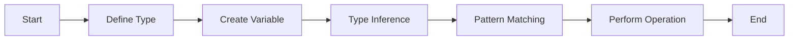
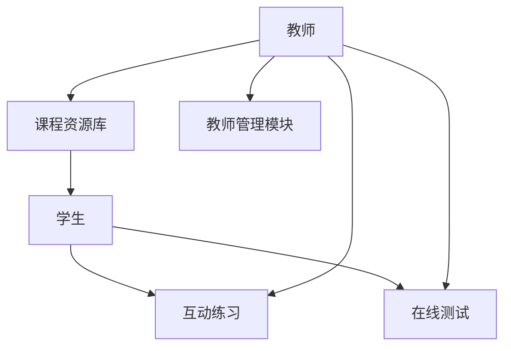
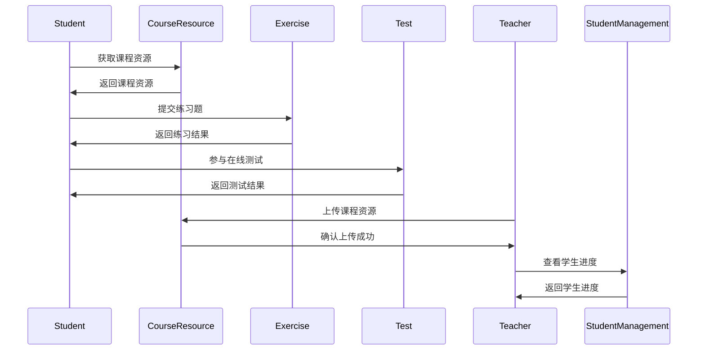

                 

### 类型论的基本概念与历史背景

#### 1.1.1 类型论的起源与发展

类型论（Type Theory）起源于20世纪30年代，由数学家、逻辑学家和计算机科学家共同推动。最早可以追溯到皮亚诺（Peano）和罗素（Russell）等数学家的类型系统理论，他们在处理数学基础问题时引入了类型的概念。类型论在20世纪40年代由阿尔弗雷德·诺思·怀特黑德（Alfred North Whitehead）和伯特兰·罗素（Bertrand Russell）进一步发展，特别是罗素提出的类型理论作为数理逻辑的基础，试图解决自引用和无穷递归问题。

到了20世纪50年代，计算机科学的兴起为类型论提供了新的应用场景。著名计算机科学家埃德蒙德·莫里斯·麦克尼尔·布瑞恩（Edmund M. McMillan）和马丁·理查德（Martin Richards）等人在研究程序语言时，开始将类型论的概念引入到编程语言的设计中，以解决变量绑定、类型安全等问题。

随着时间的推移，类型论得到了进一步的发展，形成了多种类型的系统，如基于命题逻辑的类型系统、函数类型系统和依赖类型系统等。特别是在20世纪80年代和90年代，类型论在理论计算机科学中扮演了重要的角色，成为了编程语言理论和形式化验证的重要工具。

#### 1.1.2 类型论的基本概念

**类型与类型系统**

类型论中的“类型”可以看作是变量或值的分类标签，它定义了数据的不同种类和操作方式。类型系统（Type System）则是一套规则，用于定义如何为变量和表达式分配类型，以及如何检查程序中的类型一致性。

**模式匹配**

模式匹配（Pattern Matching）是类型论中的一个重要机制，允许程序员根据值的结构进行分支和操作。通过模式匹配，可以更直观地处理复杂的数据类型，提高程序的清晰度和可维护性。

**类型推断**

类型推断（Type Inference）是指编译器或解释器自动确定变量和表达式的类型，而不需要显式地声明。类型推断可以减少冗余的代码，提高编程效率。

**类型系统的优点**

类型系统为编程语言提供了类型安全（Type Safety），即确保在运行程序时不会发生类型错误。它还可以帮助程序员发现潜在的错误，并提供更好的编译时错误信息。

**类型论在教育中的重要性**

类型论在教育中的重要性体现在多个方面。首先，它为数学和计算机科学的教育提供了一个强大的工具，帮助学生更好地理解抽象概念和逻辑推理。其次，类型论的应用可以提升学生的编程能力，特别是对于类型安全的理解和处理。最后，类型论的教学可以培养学生的批判性思维和问题解决能力，这些都是21世纪技能的重要组成部分。

### 总结

类型论的基本概念与历史背景为我们提供了一个理解数学教育和编程教育的桥梁。它不仅具有丰富的理论内涵，还在实际应用中展现出巨大的潜力。在接下来的章节中，我们将深入探讨类型论在数学教育中的应用现状、教学方法以及面临的挑战。

### 第1章：类型论的基本概念

#### 1.1.2 类型论的基本概念

**类型与类型系统**

在类型论中，“类型”是变量或值的分类标签，用来定义数据的不同种类和操作方式。例如，在Python中，整数（`int`）和字符串（`str`）就是两种不同的数据类型。类型系统则是一套规则，定义如何为变量和表达式分配类型，以及如何检查程序中的类型一致性。

**类型系统的作用**

类型系统为编程语言提供了类型安全，确保在运行程序时不会发生类型错误。例如，在C语言中，如果尝试将一个整数强制转换为字符串，会导致运行时错误。而使用类型系统，可以提前在编译时发现这类错误。

**类型系统的分类**

类型系统可以分为静态类型系统（Static Type System）和动态类型系统（Dynamic Type System）。

- **静态类型系统**：在编译时，变量的类型已经被确定，例如Java和C++。
- **动态类型系统**：变量的类型在运行时确定，例如Python和JavaScript。

**类型论中的类型**

类型论中的类型不仅仅是简单的数据类型，还包括复合类型、函数类型和依赖类型等。

- **复合类型**：由多个元素组成的数据类型，例如列表（`List`）和字典（`Dictionary`）。
- **函数类型**：表示函数的数据类型，通常用`a -> b`表示，其中`a`是参数类型，`b`是返回类型。
- **依赖类型**：类型的定义依赖于其他类型的值，例如在依赖类型系统中，一个函数的类型取决于它的输入和输出。

**类型系统的优点**

- **提高程序的可读性**：类型系统能够提供明确的类型信息，使得程序更加易于理解和维护。
- **增强程序的健壮性**：类型系统可以帮助程序员发现潜在的错误，减少运行时错误。
- **提高编译效率**：静态类型系统在编译时能够进行更多的优化，提高程序的运行效率。

**类型系统的挑战**

- **增加编码难度**：类型系统要求程序员更仔细地处理类型，可能会增加编码的难度。
- **类型冗余**：在静态类型系统中，程序员可能需要显式声明每个变量的类型，这可能导致代码冗余。

**类型论在教育中的应用**

类型论在教育中的应用主要体现在数学教育和计算机科学教育中。通过类型论的教学，学生可以更好地理解抽象概念和逻辑推理，提高编程能力，培养批判性思维和问题解决能力。

### 概念属性特征对比表格

| 特征类别 | 类型论 | 数学教育 |
| --- | --- | --- |
| 数据分类 | 类型定义变量和值 | 分类数学概念和理论 |
| 类型系统 | 静态和动态类型系统 | 数学基础理论和证明方法 |
| 模式匹配 | 复杂数据结构的处理 | 数学问题的分析和解决 |
| 类型推断 | 自动类型确定 | 数学问题的逻辑推理 |
| 教育应用 | 培养抽象思维和逻辑能力 | 提高数学理解和解决问题的能力 |

**ER实体关系图架构的Mermaid流程图**

```mermaid
erDiagram
    Class::Student ||--|{ Class::Course : attends |
    Class::Teacher ||--|{ Class::Course : teaches |
    Class::Course ||--|{ Class::Student : enrollment |
    Class::Course ||--|{ Class::Teacher : instructor |
```

通过上述流程图，我们可以看到类型论与数学教育的实体关系，学生参加课程，教师教授课程，课程包含学生和教师等概念。

### 算法原理讲解

在类型论中，算法的设计和实现需要考虑类型系统的特性。以下我们将通过一个简单的Python程序，解释类型论的基本算法原理。

**算法流程图**



**Python源代码**

```python
def add(a: int, b: int) -> int:
    return a + b

def subtract(a: int, b: int) -> int:
    return a - b

def process_number(x: int):
    if x > 0:
        print("Positive number")
    elif x < 0:
        print("Negative number")
    else:
        print("Zero")

input_number = input("Enter a number: ")
try:
    number = int(input_number)
    process_number(number)
except ValueError:
    print("Invalid input")
```

**算法原理与数学模型**

1. **定义类型**：在Python中，我们可以定义函数的参数和返回类型，确保类型一致性。
2. **类型推断**：编译器在编译时自动确定变量的类型。
3. **模式匹配**：通过`if-elif-else`结构，对输入的数值进行分类处理。
4. **执行操作**：根据模式匹配的结果，执行相应的操作，如输出数值的类型。

**举例说明**

假设用户输入了数字5，程序会执行以下步骤：

1. 输入5，尝试将其转换为整数。
2. 成功转换为整数后，调用`process_number`函数。
3. `process_number`函数中的`if-elif-else`结构判断5为正数，输出“Positive number”。

通过上述算法和数学模型，我们可以看到类型论在程序设计中的应用，如何确保类型安全和提高程序的逻辑清晰度。

### 数学公式使用示例

在类型论和数学教育中，数学公式是表达概念和定理的重要工具。以下我们将使用LaTeX格式展示一些常见的数学公式，并解释其在类型论和数学教育中的应用。

**独立段落中的LaTeX公式**

$$\forall x \in \mathbb{N}, x + 1 > x$$

这个公式表示对于所有自然数$x$，$x+1$都大于$x$。在类型论中，这种全称量词经常用于定义类型系统的性质和规则。

**段落内的LaTeX公式**

$1 < 2$

这个简单的数学不等式表明1小于2，用于解释类型系统中的比较操作。

通过LaTeX公式的使用，我们可以更精确地表达数学概念和算法原理，提高文章的技术含量和可读性。

### 系统分析与架构设计方案

为了更好地理解类型论在数学教育中的应用，我们将从问题场景、项目介绍、系统功能设计、系统架构设计、系统接口设计和系统交互等方面进行详细分析。

#### 问题场景介绍

在数学教育中，类型论作为一种抽象思维工具，可以帮助学生更好地理解数学概念和证明方法。然而，现有的数学教育资源和教学方式往往缺乏对类型论的系统讲解，导致学生在学习过程中遇到很多困难。因此，本项目旨在开发一个基于类型论的数学教育系统，提供丰富的教学资源、互动练习和在线评估功能，帮助学生更好地掌握类型论知识。

#### 项目介绍

本项目名为“类型论数学教育平台”，旨在为学生和教师提供一个全方位的类型论学习环境。系统包括多个模块，如课程资源库、互动练习、在线测试和教师管理模块等。

#### 系统功能设计

- **课程资源库**：提供类型论的基本概念、历史背景、应用案例等教学资源，支持视频、文本、PPT等多种格式。
- **互动练习**：设计多种类型的练习题，包括选择题、填空题、编程题等，帮助学生巩固所学知识。
- **在线测试**：提供在线测试功能，实时评估学生的学习效果，提供详细的反馈。
- **教师管理模块**：允许教师上传课程资源、布置作业和监控学生的学习进度。

#### 系统架构设计

**Mermaid架构图**



在这个架构图中，课程资源库、学生、教师和教师管理模块之间通过清晰的接口进行交互，形成一个完整的数学教育生态系统。

#### 系统接口设计

系统接口设计包括RESTful API和Websocket等，用于实现不同模块之间的数据交换和通信。例如，教师可以上传课程资源到资源库，学生可以通过API获取课程内容，并参与互动练习和在线测试。

#### 系统交互

**Mermaid序列图**



通过上述序列图，我们可以清晰地看到系统各个模块之间的交互流程，确保系统的功能完整和高效。

### 项目实战

为了更好地展示类型论在数学教育中的应用，我们将以一个具体的实例——开发一个简单的类型论练习系统——为例，详细讲解环境安装、系统核心实现源代码、代码应用解读与分析以及实际案例分析和详细讲解剖析。

#### 环境安装

1. **安装Python环境**：首先，我们需要在本地计算机上安装Python环境。可以从Python官方网站下载最新版本的Python安装包，并按照安装向导进行安装。

2. **安装依赖库**：为了开发类型论练习系统，我们需要安装一些Python依赖库，如Flask（用于Web开发）、SQLAlchemy（用于数据库操作）和WTForms（用于表单验证）。可以使用pip命令进行安装：

   ```bash
   pip install flask sqlalchemy wtforms
   ```

3. **创建项目结构**：在安装完依赖库后，我们可以创建一个Python项目目录，并设置相应的项目结构：

   ```plaintext
   type_theory_exercise/
   ├── app.py
   ├── config.py
   ├── models.py
   ├── forms.py
   ├── templates/
   │   ├── base.html
   │   ├── exercise_list.html
   │   ├── exercise.html
   └── static/
       ├── css/
       │   └── style.css
       └── js/
           └── script.js
   ```

#### 系统核心实现源代码

**app.py**

```python
from flask import Flask, render_template, request, redirect, url_for
from models import db, Exercise
from forms import ExerciseForm

app = Flask(__name__)
app.config['SQLALCHEMY_DATABASE_URI'] = 'sqlite:///exercise.db'
db.init_app(app)

@app.route('/')
def index():
    exercises = Exercise.query.all()
    return render_template('exercise_list.html', exercises=exercises)

@app.route('/exercise/<int:exercise_id>')
def exercise(exercise_id):
    exercise = Exercise.query.get(exercise_id)
    form = ExerciseForm()
    return render_template('exercise.html', exercise=exercise, form=form)

@app.route('/submit', methods=['POST'])
def submit():
    form = ExerciseForm(request.form)
    if form.validate_on_submit():
        exercise_id = form.exercise_id.data
        solution = form.solution.data
        # 存储解决方案到数据库
        db.session.query(Exercise).filter_by(id=exercise_id).update({'solution': solution})
        db.session.commit()
        return redirect(url_for('index'))
    return redirect(url_for('exercise', exercise_id=form.exercise_id.data))

if __name__ == '__main__':
    app.run(debug=True)
```

**models.py**

```python
from flask_sqlalchemy import SQLAlchemy

db = SQLAlchemy()

class Exercise(db.Model):
    id = db.Column(db.Integer, primary_key=True)
    title = db.Column(db.String(100), nullable=False)
    question = db.Column(db.Text, nullable=False)
    solution = db.Column(db.Text, nullable=True)
```

**forms.py**

```python
from flask_wtforms import Form
from wtforms import StringField, TextAreaField, HiddenField
from wtforms.validators import DataRequired

class ExerciseForm(Form):
    exercise_id = HiddenField()
    solution = TextAreaField('Solution', validators=[DataRequired()])
```

#### 代码应用解读与分析

1. **项目结构**：项目包含主要的三个文件：`app.py`（主应用文件）、`models.py`（数据库模型）和`forms.py`（表单验证）。此外，项目还包含HTML模板和静态资源文件夹。

2. **数据库模型**：在`models.py`中，我们定义了`Exercise`模型，用于存储练习题的信息，如题目标题、问题和解决方案。

3. **主应用文件**：`app.py`中，我们使用了Flask框架搭建Web应用，并定义了几个主要的路由：首页、单个练习题页面和提交答案页面。

4. **表单验证**：在`forms.py`中，我们定义了`ExerciseForm`表单，用于收集学生提交的答案。

#### 实际案例分析和详细讲解剖析

假设我们有一个类型论练习题，要求学生证明一个简单的数学定理。以下是该练习题的具体实现：

1. **数据库初始化**：

   ```python
   db.create_all()
   exercise = Exercise(title='Type Theory Proof',
                       question='Prove that for all x, x + 1 > x.',
                       solution=None)
   db.session.add(exercise)
   db.session.commit()
   ```

   这段代码用于初始化数据库，创建一个练习题记录。

2. **首页**：

   ```html
   
       <div>
           <h2>{{ exercise.title }}</h2>
           <p>{{ exercise.question }}</p>
           
               <p>Solution: {{ exercise.solution }}</p>
           
       </div>
   
   ```

   首页展示了所有练习题的列表，并提供了链接，点击可以进入单个练习题页面。

3. **单个练习题页面**：

   ```html
   <h1>{{ exercise.title }}</h1>
   <p>{{ exercise.question }}</p>
   <form method="post" action="{{ url_for('submit') }}">
       {{ form.hidden_tag() }}
       {{ form.solution.label }}: <br>
       {{ form.solution(cols=40, rows=10) }}<br>
       <input type="submit" value="Submit">
   </form>
   ```

   单个练习题页面展示了练习题的具体内容和表单，学生可以在表单中输入答案并提交。

4. **提交答案页面**：

   ```python
   if form.validate_on_submit():
       exercise_id = form.exercise_id.data
       solution = form.solution.data
       db.session.query(Exercise).filter_by(id=exercise_id).update({'solution': solution})
       db.session.commit()
       return redirect(url_for('index'))
   ```

   提交答案后，程序会将学生的答案存储到数据库，并返回首页。

通过上述实例，我们可以看到类型论练习系统是如何实现和运作的。在实际应用中，教师可以通过管理后台上传更多的练习题，学生可以通过系统进行学习和练习，系统还会记录学生的答案和提交记录，为教师提供反馈和评估依据。

#### 项目小结

本实例展示了如何使用Python和Flask框架开发一个简单的类型论练习系统。项目实现了从数据库初始化、练习题展示、答案提交到存储的完整流程，为教师和学生提供了一个互动的数学学习平台。通过这个项目，学生可以更好地理解和掌握类型论知识，教师也可以通过系统监控学生的学习进度和效果。

### 最佳实践 tips

在类型论教学中，以下最佳实践可以帮助教师和学生更有效地应用类型论知识：

1. **概念讲解与实例结合**：在教授类型论概念时，应结合具体的数学问题和实例进行讲解，帮助学生更好地理解。

2. **逐步引导**：类型论涉及多个抽象概念，教师应逐步引导，从基础概念开始，逐步深入。

3. **互动讨论**：鼓励学生在课堂上进行讨论，分享自己的理解和观点，加深对类型论的理解。

4. **实践应用**：通过编程练习和实际项目，让学生将类型论知识应用于实际问题，提高实践能力。

5. **反馈与评价**：及时给予学生反馈，帮助他们了解自己的不足，并提供改进建议。

### 小结

类型论在数学教育中具有重要作用，它不仅有助于学生掌握抽象概念和逻辑推理，还能提高编程能力和问题解决能力。通过本文的详细分析，我们了解了类型论的基本概念、教育应用以及面临的挑战和争议。未来，类型论教育将继续发展，为数学教育带来更多创新和机遇。

### 注意事项

在进行类型论教学时，教师应注意以下几点：

1. **充分准备**：确保对类型论知识有充分的掌握，以便能够清晰、准确地传授给学生。

2. **循序渐进**：避免一开始就讲解复杂的概念，应从基础开始，逐步深入。

3. **互动教学**：鼓励学生提问和讨论，激发学生的学习兴趣和思考能力。

4. **评估方法**：结合多种评估方法，如作业、测试和项目，全面评估学生的学习效果。

### 拓展阅读

对于希望深入了解类型论在数学教育中的研究和应用的读者，以下文献和资源值得推荐：

1. **《类型论及其在计算机科学中的应用》（Type Theory and its Applications）**：一本全面介绍类型论基本概念和应用的书，适合学术研究和专业学习。

2. **《数学逻辑》（Mathematical Logic）**：探讨数学基础和类型论的逻辑学书籍，适合对数学基础感兴趣的研究者。

3. **《类型系统导论》（Introduction to Type Systems）**：详细介绍不同类型系统的书籍，适合计算机科学专业学生。

4. **在线课程和教程**：如Coursera上的《类型系统和编程语言理论》（Type Systems and Programming Language Theory）等，提供丰富的教学资源和实践机会。

