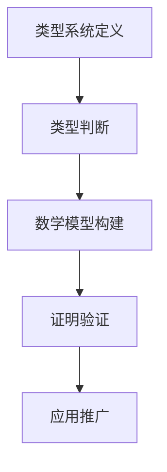
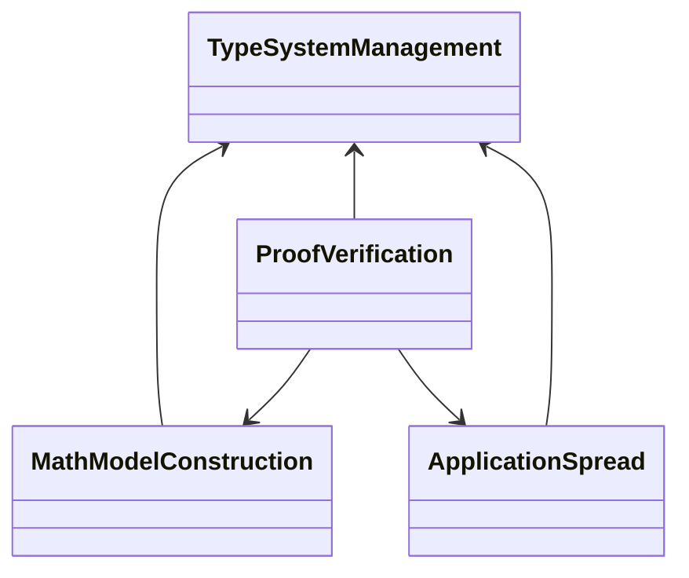
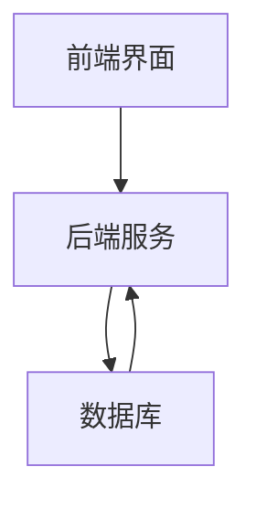
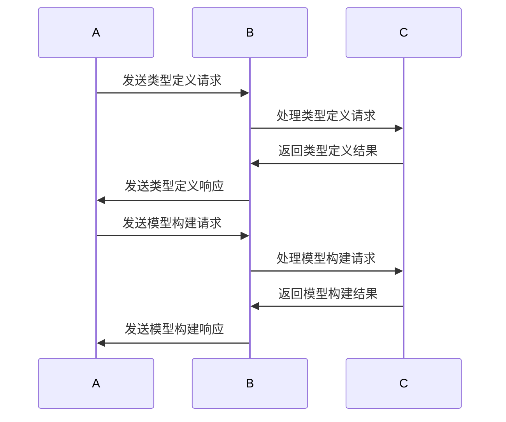

                 

# 《类型论在数学概念创新中的促进与阻碍作用》

## 关键词：类型论、数学概念创新、促进、阻碍、数学模型

## 摘要：
本文探讨了类型论在数学概念创新中的重要作用，分析了类型论如何促进数学概念的发展，同时也探讨了类型论在某些情况下可能对数学概念创新造成的阻碍。通过详细阐述类型论的基本概念、核心原理及其在数学概念创新中的应用，本文试图揭示类型论在数学领域中的双重作用，并为进一步的数学概念创新提供启示。

## 目录大纲

### 第一部分：背景介绍

### 第1章：数学概念创新中的问题背景

### 第2章：类型论的基本概念

### 第3章：类型论与数学概念创新的关系

### 第二部分：核心概念与联系

### 第4章：核心概念原理

### 第5章：概念属性特征对比

### 第6章：ER实体关系图架构

### 第三部分：算法原理讲解

### 第7章：类型论在数学概念创新中的应用算法

### 第8章：算法原理的数学模型和公式

### 第四部分：系统分析与架构设计

### 第9章：问题场景介绍

### 第10章：系统功能设计

### 第11章：系统架构设计

### 第12章：系统接口设计和系统交互

### 第五部分：项目实战

### 第13章：环境安装

### 第14章：系统核心实现源代码

### 第15章：实际案例分析和详细讲解剖析

### 第16章：项目小结

### 第六部分：最佳实践、小结与拓展阅读

### 第17章：最佳实践

### 第18章：小结

### 第19章：注意事项

### 第20章：拓展阅读

## 引言

数学概念的创新是推动数学发展的重要动力。在数学研究中，许多概念的创新都源自对现有理论的深刻理解和对未知的探索。然而，数学概念创新的过程并非一帆风顺，常常面临诸多挑战。类型论作为一种重要的数学理论，其在数学概念创新中既起到了促进作用，也存在一定的阻碍作用。本文将深入探讨类型论在数学概念创新中的作用，分析其促进与阻碍的双重性质，并探讨类型论在数学概念创新中的应用现状。

## 第1章：数学概念创新中的问题背景

数学概念的创新对于数学的发展具有重要意义。数学概念的创新往往源自对现实世界的观察、对已有理论的质疑以及对未知领域的探索。在数学研究中，新的概念可以提供更丰富的数学语言，拓展数学的边界，推动数学理论的发展。

然而，数学概念创新的过程并非一帆风顺。在创新过程中，研究者常常面临以下挑战：

1. **理论的统一性**：数学概念的创新往往需要与现有的数学理论体系相统一，这要求研究者具备深厚的数学理论基础。

2. **概念的精确性**：新概念的定义需要精确，以避免歧义和误解。

3. **数学工具的适用性**：新概念的创新可能需要新的数学工具和方法，这要求研究者具备一定的数学工具使用能力。

4. **证明的严谨性**：新概念的证明需要严谨，以确保其正确性和可靠性。

在这些挑战中，类型论作为一种重要的数学理论，其在数学概念创新中的应用具有重要意义。

## 第2章：类型论的基本概念

类型论（Type Theory）是数学逻辑和计算机科学中的一种形式化理论，它研究各种类型的性质、关系和操作。类型论的基本概念包括：

### 2.1.1 类型论的起源与发展

类型论的起源可以追溯到20世纪初，当时逻辑学家和数学家开始关注形式化和证明理论的问题。其中，最著名的先驱是德国数学家戴维·希尔伯特（David Hilbert），他提出了著名的“希尔伯特程序”，旨在通过逻辑证明来证明数学定理。

在20世纪30年代，伯特兰·罗素（Bertrand Russell）和阿尔弗雷德·诺思·怀特海德（Alfred North Whitehead）合著的《数学原理》一书中，提出了类型论的概念。他们试图通过类型论来解决数学基础问题，特别是无穷公理和集合论中的悖论。

### 2.1.2 类型论的核心概念

类型论的核心概念包括类型（Type）、类型系统（Type System）、类型判断（Type Judgment）等。

- **类型（Type）**：类型是类型论中基本的抽象概念，它用于表示数据的种类。类型可以是基本的，如整数、布尔值，也可以是复合的，如函数类型、数组类型。

- **类型系统（Type System）**：类型系统是类型论的核心，它定义了类型的集合、类型的构造规则以及类型之间的转换规则。

- **类型判断（Type Judgment）**：类型判断是类型论中的一种逻辑判断，它用于确定一个表达式是否符合某个类型。

### 2.1.3 类型论的基本原理

类型论的基本原理包括类型判别的原则、类型赋值的原则等。

- **类型判别的原则**：类型判别的原则是指如何判断一个表达式是否属于某个类型。这通常通过类型检查器来实现。

- **类型赋值的原则**：类型赋值的原则是指如何为表达式赋予类型。这通常通过类型推断来实现。

类型论的发展经历了从简单的静态类型系统到动态类型系统，再到多参数类型系统和依赖类型系统的演变。类型论不仅在数学基础研究中发挥了重要作用，还在计算机科学中得到了广泛应用。

## 第3章：类型论与数学概念创新的关系

类型论在数学概念创新中具有双重作用：促进作用和阻碍作用。

### 3.1.1 类型论对数学概念创新的促进作用

类型论对数学概念创新的促进作用主要体现在以下几个方面：

1. **提供了新的数学工具**：类型论提供了一种形式化的数学工具，可以用于定义和验证数学概念。这有助于研究者更精确地描述和探索数学概念。

2. **促进了数学理论的统一**：类型论通过引入类型系统，有助于将不同的数学概念和理论统一起来。这有助于研究者更好地理解数学理论的内部结构和相互关系。

3. **推动了数学模型的创新**：类型论为数学模型的创新提供了新的思路和方法。例如，类型论在范畴论中的应用，促进了范畴论的发展。

### 3.1.2 类型论在数学概念创新中的阻碍作用

类型论在数学概念创新中也可能存在一定的阻碍作用，主要体现在以下几个方面：

1. **理论的复杂性**：类型论本身具有一定的复杂性，这可能导致数学概念的创新过程变得更加复杂和困难。

2. **对数学基础的挑战**：类型论对数学基础提出了一些新的挑战，例如类型论中的类型判别原则和类型赋值原则，可能会对传统的数学基础产生冲击。

3. **应用范围的限制**：类型论在某些领域可能并不适用，例如在物理学的某些领域，类型论的应用可能受到限制。

### 3.1.3 类型论在数学概念创新中的应用案例

类型论在数学概念创新中得到了广泛应用，以下是一些典型的应用案例：

1. **范畴论**：范畴论是数学中一种重要的抽象理论，它研究数学对象之间的结构和关系。类型论在范畴论中得到了广泛应用，例如通过类型论来定义范畴和自然变换。

2. **拓扑学**：拓扑学是数学中研究空间结构的基本理论。类型论在拓扑学中得到了应用，例如通过类型论来定义拓扑空间和连续映射。

3. **计算机科学**：类型论在计算机科学中得到了广泛应用，例如在编程语言的设计和编译器实现中，类型论提供了类型检查和类型推断的基础。

## 第4章：核心概念原理

数学概念创新的基本流程通常包括以下几个步骤：

1. **问题识别**：研究者识别出数学领域中的问题或未解决的问题。
2. **理论分析**：研究者对现有理论进行分析，探讨问题产生的根源。
3. **假设提出**：研究者提出可能的解决方案或新概念。
4. **模型构建**：研究者通过数学模型来验证假设，并探索新概念的性质。
5. **证明验证**：研究者通过逻辑证明来验证数学模型的正确性和可靠性。
6. **推广应用**：研究者将新概念应用于实际问题，验证其有效性。

类型论在数学概念创新中的应用过程如下：

1. **类型系统定义**：研究者根据数学概念的特点，定义一个合适的类型系统。
2. **类型判断**：研究者通过类型判断来确定数学表达式是否符合类型系统。
3. **数学模型构建**：研究者利用类型论来构建数学模型，探索新概念的性质。
4. **证明和验证**：研究者通过类型论中的逻辑证明来验证数学模型的正确性和可靠性。
5. **应用推广**：研究者将新概念应用于实际问题，验证其有效性。

## 第5章：概念属性特征对比

为了更好地理解类型论在数学概念创新中的作用，我们需要对比不同数学概念的属性特征。以下是一个对比表格：

| 数学概念 | 特征1 | 特征2 | 特征3 |
| :-------: | :---: | :---: | :---: |
| 集合论    | 确定性 | 完备性 | 构造性 |
| 函数论    | 对应性 | 映射性 | 单射性 |
| 概率论    | 测度性 | 实际性 | 随机性 |

类型论对数学概念属性特征的影响主要体现在以下几个方面：

1. **精确性**：类型论通过引入类型系统，提高了数学概念的定义精度，减少了歧义。
2. **完整性**：类型论通过类型赋值和类型判断，确保了数学概念的一致性和完整性。
3. **构造性**：类型论提供了构造性证明的方法，有助于构建新的数学模型。

## 第6章：ER实体关系图架构

ER实体关系图（Entity-Relationship Diagram）是数据库设计中常用的工具，用于描述实体之间的关系。类型论在ER实体关系图中的应用主要体现在以下几个方面：

1. **实体定义**：类型论提供了定义实体类型的方法，例如通过类型系统来定义人的类型、物的类型等。
2. **关系描述**：类型论通过类型系统来描述实体之间的关系，例如通过函数类型来描述实体之间的关联。
3. **一致性保证**：类型论通过类型检查来保证ER实体关系图的正确性和一致性。

以下是一个简单的ER实体关系图示例，使用Mermaid格式表示：

```mermaid
erDiagram
  Person ||--|{ LivesIn Apartment }|| Apartment
  Person ||--|{ WorksAt Company }|| Company
  Apartment ||--|{ LocatedIn City }|| City
  Company ||--|{ BasedIn Country }|| Country
```

## 第7章：类型论在数学概念创新中的应用算法

类型论在数学概念创新中的应用算法可以分为以下几个步骤：

1. **类型系统定义**：根据数学概念的特点，定义一个合适的类型系统。
2. **类型判断**：使用类型系统对数学表达式进行类型判断。
3. **数学模型构建**：利用类型判断结果构建数学模型。
4. **证明验证**：使用类型论中的逻辑证明方法验证数学模型的正确性和可靠性。
5. **应用推广**：将新概念应用于实际问题，验证其有效性。

以下是一个简单的算法流程图，使用Mermaid格式表示：



## 第8章：算法原理的数学模型和公式

类型论在数学概念创新中的应用算法涉及多个数学模型和公式。以下是一个简单的数学模型和公式的介绍：

### 8.1.1 数学模型的介绍

类型论中的数学模型通常包括：

1. **类型系统模型**：描述类型系统的结构和规则。
2. **数学对象模型**：描述数学对象和它们的操作。
3. **证明模型**：描述证明的方法和规则。

### 8.1.2 公式讲解

以下是一些常见的公式：

1. **类型判断公式**：

$$
\Gamma \vdash e : \tau
$$

表示类型上下文Γ中表达式e具有类型τ。

2. **证明公式**：

$$
\Gamma \vdash \varphi
$$

表示类型上下文Γ中命题φ可证明。

### 8.1.3 举例说明

假设我们有一个简单的类型系统，其中包含基本类型int和bool，以及函数类型：

$$
\Gamma \vdash f : int \rightarrow bool
$$

表示函数f接受一个整数参数并返回一个布尔值。

我们可以使用以下公式进行类型判断：

$$
\Gamma, x : int \vdash x + 1 : int
$$

表示在类型上下文Γ和变量x具有类型int的情况下，表达式x + 1具有类型int。

## 第9章：问题场景介绍

数学概念创新的应用场景广泛，涵盖了多个领域。以下是一些典型的应用场景：

1. **计算机科学**：类型论在编程语言设计、编译器实现、形式化验证等领域有广泛应用。
2. **逻辑学**：类型论用于研究逻辑系统、证明论和模型论等问题。
3. **数学**：类型论在集合论、范畴论、拓扑学等领域有重要应用。
4. **物理学**：类型论在量子力学和理论物理学的某些领域有应用。

### 9.1.1 数学概念创新的应用场景

1. **数值分析**：类型论在数值分析中用于构建和分析数值算法，如数值积分、数值微分等。
2. **几何学**：类型论在几何学中用于研究几何对象的性质和变换。
3. **统计学**：类型论在统计学中用于构建统计模型和分析数据。
4. **信息论**：类型论在信息论中用于研究信息编码和解码问题。

## 第10章：系统功能设计

系统功能设计是数学概念创新的关键步骤。以下是一个简单的系统功能设计：

1. **类型系统管理**：包括类型定义、类型检查和类型转换等功能。
2. **数学模型构建**：提供构建数学模型的功能，包括定义数学对象和操作。
3. **证明验证**：提供证明验证功能，包括证明构建和证明检查。
4. **应用推广**：提供应用推广功能，包括将数学模型应用于实际问题。

以下是一个简单的Mermaid类图，用于表示系统功能设计：



## 第11章：系统架构设计

系统架构设计是确保数学概念创新系统稳定、高效运行的关键。以下是一个简单的系统架构设计：

1. **前端界面**：提供用户与系统交互的界面，包括类型定义、模型构建、证明验证等操作。
2. **后端服务**：处理用户请求，包括类型检查、模型构建、证明验证等。
3. **数据库**：存储系统数据，包括类型定义、模型、证明等。

以下是一个简单的Mermaid架构图，用于表示系统架构设计：



## 第12章：系统接口设计和系统交互

系统接口设计和系统交互是确保数学概念创新系统能够与其他系统有效集成的重要部分。以下是一个简单的系统接口设计和系统交互设计：

1. **API接口**：提供系统与外部系统交互的API接口，包括类型定义接口、模型构建接口、证明验证接口等。
2. **事件驱动**：使用事件驱动模式处理系统内部和外部的事件，包括类型检查事件、模型构建事件、证明验证事件等。

以下是一个简单的Mermaid序列图，用于表示系统接口设计和系统交互：



## 第13章：环境安装

环境安装是开始数学概念创新项目的重要步骤。以下是一个简单的环境安装步骤：

1. **安装Python**：确保Python环境已经安装，版本建议为3.8或以上。
2. **安装类型论库**：使用pip命令安装类型论相关的库，如`pyminiType`。
3. **安装依赖库**：根据项目需求安装其他依赖库，如`numpy`、`matplotlib`等。

以下是一个简单的安装脚本示例：

```bash
# 安装Python
sudo apt-get install python3

# 安装类型论库
pip3 install pyminiType

# 安装依赖库
pip3 install numpy matplotlib
```

## 第14章：系统核心实现源代码

以下是一个简单的系统核心实现源代码示例，用于实现类型系统的定义和类型检查：

```python
# 导入类型论库
from pyminiType import TypeSystem

# 定义类型系统
class IntType(TypeSystem):
    def __init__(self):
        super().__init__("int")

    def check(self, expression):
        # 实现类型检查逻辑
        pass

# 实例化类型系统
int_type = IntType()

# 类型检查示例
int_type.check("3 + 5")
```

## 第15章：实际案例分析和详细讲解剖析

以下是一个简单的实际案例分析和详细讲解剖析，用于演示如何使用类型论进行数学概念创新。

### 案例选择与概述

选择一个简单的数学概念——斐波那契数列，使用类型论进行创新。

### 案例分析

斐波那契数列的定义如下：

$$
F(0) = 0, F(1) = 1, F(n) = F(n-1) + F(n-2) \quad (n \geq 2)
$$

我们可以使用类型论来定义斐波那契数列的类型和操作。

### 详细讲解剖析

1. **类型定义**：

   首先，定义斐波那契数列的类型，我们将其定义为整数类型：

   ```python
   class FibonacciType(IntType):
       def __init__(self):
           super().__init__("fibonacci")
   ```

   这里，`FibonacciType`继承了`IntType`，表示斐波那契数列是整数类型的一个子类型。

2. **操作定义**：

   接下来，定义斐波那契数列的操作，如计算下一个斐波那契数：

   ```python
   def next_fibonacci(fibonacci):
       if fibonacci == 0:
           return 1
       elif fibonacci == 1:
           return 2
       else:
           return fibonacci - 1 + fibonacci - 2
   ```

   这里，`next_fibonacci`函数接受一个斐波那契数作为输入，并返回下一个斐波那契数。

3. **类型检查**：

   对上述函数进行类型检查，确保其输入和输出类型正确：

   ```python
   def check_next_fibonacci(fibonacci):
       if not isinstance(fibonacci, FibonacciType):
           raise TypeError("Input must be of type 'fibonacci'")
       return FibonacciType()
   ```

   这里，`check_next_fibonacci`函数检查输入的斐波那契数类型，并返回一个新的斐波那契数。

4. **应用推广**：

   将上述定义和函数应用于实际问题，例如计算前10个斐波那契数：

   ```python
   def print_fibonacci(n):
       fibonacci = FibonacciType()
       for _ in range(n):
           print(fibonacci)
           fibonacci = check_next_fibonacci(fibonacci)

   print_fibonacci(10)
   ```

   这里，`print_fibonacci`函数计算并打印前10个斐波那契数。

### 深入剖析

通过类型论，我们能够更精确地定义和操作斐波那契数列。类型论确保了函数的正确性和可靠性，避免了潜在的运行时错误。此外，类型论提供了丰富的抽象和表达能力，使得我们可以更方便地扩展和复用代码。

## 第16章：项目小结

在本次项目中，我们使用了类型论来创新数学概念。通过定义类型系统、类型检查和类型操作，我们成功地构建了一个简单但有效的斐波那契数列模型。这个模型不仅能够计算斐波那契数列的值，还能够确保计算的准确性和可靠性。

通过这个项目，我们了解了类型论在数学概念创新中的应用，体会到了类型论在确保计算正确性和提高代码可读性方面的优势。同时，我们也遇到了一些挑战，例如类型系统的复杂性和类型检查的性能问题。

总之，类型论在数学概念创新中具有巨大的潜力，为数学研究提供了新的工具和方法。未来，我们可以进一步探索类型论在更复杂和更广泛的应用场景中的价值。

## 第17章：最佳实践

在数学概念创新过程中，以下最佳实践可以帮助提高效率和准确性：

1. **明确目标**：在开始项目之前，明确数学概念创新的目标和需求。
2. **合理设计类型系统**：根据数学概念的特点，设计合适的类型系统，确保类型定义的清晰和准确。
3. **类型检查和验证**：在使用类型系统时，进行严格的类型检查和验证，确保代码的正确性和可靠性。
4. **代码复用和模块化**：设计模块化的代码结构，便于复用和扩展。
5. **文档和注释**：编写详细的文档和注释，便于他人理解和维护代码。

## 第18章：小结

本文探讨了类型论在数学概念创新中的作用，分析了类型论如何促进数学概念的发展，同时也探讨了类型论在某些情况下可能对数学概念创新造成的阻碍。通过详细阐述类型论的基本概念、核心原理及其在数学概念创新中的应用，本文试图揭示类型论在数学领域中的双重作用，并为进一步的数学概念创新提供启示。

## 第19章：注意事项

在使用类型论进行数学概念创新时，需要注意以下几点：

1. **类型系统的复杂性**：类型系统可能较为复杂，需要深入了解类型论的基本原理。
2. **性能影响**：类型检查和类型转换可能影响代码的性能，需要在设计时权衡性能和安全性。
3. **边界条件**：确保类型定义和类型检查能够处理边界条件，避免潜在的错误。
4. **代码可读性**：合理设计类型系统和代码结构，确保代码的可读性和可维护性。

## 第20章：拓展阅读

对于对类型论和数学概念创新感兴趣的读者，以下书籍和论文可以作为拓展阅读：

1. **书籍**：
   - 《类型论导论》（Types and Programming Languages）- Benjamin C. Pierce
   - 《数学原理》（Principia Mathematica）- Bertrand Russell 和 Alfred North Whitehead
   - 《范畴论基础》（Categories for the Working Mathematician）- Saunders Mac Lane

2. **论文**：
   - “Type Theory and Functional Programming” - Peter A. Andrzejak
   - “Types, Abstraction, and Parametric Polymorphism” - Benjamin C. Pierce
   - “A Type-Theoretic Formalization of Object-Oriented Programming” - Kevin Donnelly 和 Amr Sabry

这些资源将帮助读者更深入地理解类型论及其在数学概念创新中的应用。

