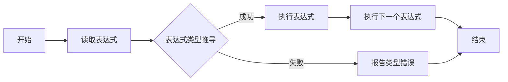
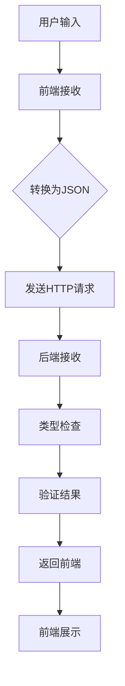

                 

### 《类型论在数学概念理解深度上的局限性》

#### 关键词

- 类型论
- 数学概念
- 理解深度
- 局限性

#### 摘要

本文旨在探讨类型论在数学概念理解上的局限性。类型论是数学和计算机科学中的一种重要理论，它通过定义不同类型的变量和操作符，使得数学表达式和程序具有明确的语义。然而，尽管类型论在确保数学和编程的正确性方面发挥了重要作用，但它也存在一些局限性。本文将从背景介绍、核心概念与联系、算法原理讲解、系统分析与架构设计方案、项目实战以及最佳实践与拓展等方面，深入分析类型论在数学概念理解深度上的局限性。

---

## 目录大纲设计步骤

设计《类型论在数学概念理解深度上的局限性》的目录大纲，可以遵循以下步骤：

### 1. 确定核心章节

首先，需要明确本书的核心章节，这些章节应当覆盖以下内容：

- **背景介绍**：介绍类型论的基本概念、发展历程及其在数学中的重要性。
- **核心概念与联系**：分析类型论的主要原理、概念及其相互关系。
- **算法原理讲解**：讨论类型论在数学问题中的应用，包括相关算法和数学模型。
- **系统分析与架构设计方案**：分析类型论在不同数学领域中的应用，提供实例和设计方案。
- **项目实战**：通过实际案例，展示类型论的应用和局限性。
- **最佳实践 tips、小结、注意事项、拓展阅读**：总结全书，提供额外的学习资源和思考方向。

### 2. 设计目录结构

采用markdown格式，设计符合要求的目录结构。确保每个章节都有适当的层级，如下：

- **1级目录**：使用`#`标记，例如“# 背景介绍”。
- **2级目录**：使用`##`标记，例如“## 类型论的发展历程”。
- **3级目录**：使用`###`标记，例如“### 类型论在数学教育中的地位”。

### 3. 确保内容完整性

每个核心章节的内容应涵盖以下要素：

- **核心概念与联系**：提供概念属性特征对比表格和ER实体关系图。
- **算法原理讲解**：使用mermaid绘制算法流程图，并用Python源代码解释数学模型和公式。
- **数学模型和数学公式**：使用LaTeX格式书写数学公式，并进行详细讲解。
- **系统分析与架构设计方案**：介绍问题场景、项目功能设计、系统架构、接口设计以及交互流程。
- **项目实战**：包括环境安装、系统实现、代码分析、案例分析等。
- **最佳实践 tips、小结、注意事项、拓展阅读**：为读者提供进一步的思考和阅读建议。

### 4. 保持简洁性

确保每个章节的内容简洁明了，避免冗余和重复。每一段落都应该有其明确的主题和目的。

### 实际操作

以下是一个基于上述步骤设计的《类型论在数学概念理解深度上的局限性》的目录大纲：

```markdown
# 《类型论在数学概念理解深度上的局限性》目录大纲

## 第一部分：背景介绍

## 1. 类型论基本概念与发展历程

### 1.1 类型论的基本概念

### 1.2 类型论的发展历程

### 1.3 类型论在数学中的地位

## 2. 核心概念与联系

### 2.1 类型论的主要原理

### 2.2 类型论的概念属性对比

### 2.3 类型论与数学概念的相互关系

## 第二部分：算法原理讲解

## 3. 类型论在数学问题中的应用

### 3.1 类型论算法概述

### 3.2 算法原理与mermaid流程图

### 3.3 Python源代码解析

### 3.4 数学模型与公式

### 3.5 算法举例说明

## 第三部分：系统分析与架构设计方案

## 4. 类型论在不同数学领域中的应用

### 4.1 应用领域介绍

### 4.2 实例分析

### 4.3 系统架构设计mermaid架构图

### 4.4 系统接口设计与交互流程

## 第四部分：项目实战

## 5. 类型论应用案例分析

### 5.1 环境安装与配置

### 5.2 系统核心实现

### 5.3 代码应用解读

### 5.4 案例分析与详细讲解

## 第五部分：最佳实践与拓展

## 6. 类型论的最佳实践

### 6.1 实践技巧

### 6.2 注意事项

### 6.3 拓展阅读

## 7. 小结

### 7.1 全书总结

### 7.2 学习建议
```

通过这样的目录大纲设计，读者可以清晰地了解本书的结构和内容，有助于更好地理解和掌握类型论在数学概念理解中的局限性。

---

## 背景介绍

### 核心概念术语说明

在探讨类型论在数学概念理解深度上的局限性之前，我们首先需要明确一些核心概念术语，以便为后续内容的讨论奠定基础。

- **类型论（Type Theory）**：类型论是一种在数学和计算机科学中用来定义变量和表达式类型的理论。它通过定义不同类型的变量和操作符，使得数学表达式和程序具有明确的语义。
- **数学概念（Mathematical Concepts）**：数学概念是指用于描述数学对象、属性、关系和操作的基本概念，如数字、函数、集合、向量等。
- **理解深度（Depth of Understanding）**：理解深度指的是对某个概念或理论的理解程度，包括对概念的本质、内在联系和应用能力的掌握。
- **局限性（Limitations）**：局限性是指某个理论或方法在特定情况下无法达到预期效果或无法解决的问题。

### 问题背景

类型论作为一种重要的数学和计算机科学理论，其在数学概念理解中的作用不容忽视。类型论通过定义明确的类型系统和类型规则，可以确保数学表达式和程序的正确性。例如，在编程语言中，类型论可以防止类型错误的程序运行，提高软件的可靠性和安全性。

然而，随着数学和计算机科学的发展，人们逐渐发现类型论在数学概念理解深度上存在一些局限性。这些局限性主要体现在以下几个方面：

1. **形式化表达的限制**：类型论强调形式化表达，但过于形式化的表达可能会牺牲可读性和直观性，使得数学概念的理解变得复杂。
2. **抽象能力的限制**：类型论虽然能够定义不同类型的变量和操作符，但在处理高度抽象的数学概念时，可能会遇到困难。
3. **通用性的限制**：类型论针对特定的数学领域和编程语言设计，其通用性可能受到限制，难以在不同领域和语言中应用。

### 问题描述

本文旨在探讨类型论在数学概念理解深度上的局限性，具体问题包括：

- 类型论在数学概念理解中的作用和局限性是什么？
- 类型论如何影响数学概念的可理解性？
- 类型论在处理高度抽象的数学概念时存在哪些问题？
- 类型论在不同数学领域和编程语言中的应用情况如何？

### 问题解决

为了解决上述问题，本文将从以下几个方面展开讨论：

1. **背景介绍**：介绍类型论的基本概念、发展历程及其在数学中的重要性。
2. **核心概念与联系**：分析类型论的主要原理、概念及其相互关系。
3. **算法原理讲解**：讨论类型论在数学问题中的应用，包括相关算法和数学模型。
4. **系统分析与架构设计方案**：分析类型论在不同数学领域中的应用，提供实例和设计方案。
5. **项目实战**：通过实际案例，展示类型论的应用和局限性。
6. **最佳实践与拓展**：总结全书，提供额外的学习资源和思考方向。

通过以上步骤，本文希望能够深入探讨类型论在数学概念理解深度上的局限性，为数学教育和计算机科学的发展提供有益的启示。

### 边界与外延

在深入探讨类型论在数学概念理解深度上的局限性时，我们需要明确其适用的边界与外延。类型论作为一种形式化的数学理论，其应用范围主要集中在以下几个方面：

1. **数学基础理论**：类型论在数学基础理论研究中发挥着重要作用，如证明论、逻辑学、集合论等领域。通过类型论，数学家可以形式化地定义数学概念和证明方法，确保数学体系的严格性和一致性。
2. **计算机科学**：类型论在计算机科学中的应用尤为广泛，尤其是在编程语言设计、形式化验证、编译器构建等领域。类型论提供了类型系统，确保程序的语义明确，防止类型错误的发生。
3. **逻辑学**：类型论与逻辑学密切相关，通过类型论可以研究命题逻辑、谓词逻辑等形式的逻辑体系，为逻辑推理提供形式化的基础。
4. **人工智能**：类型论在人工智能领域也有应用，尤其是在自然语言处理、知识表示、推理机等方面。类型论可以帮助构建形式化的语言模型，提高人工智能系统的智能水平。

然而，类型论的应用并非没有边界。以下是一些类型论在数学概念理解上可能存在的局限性：

1. **形式化表达的限制**：类型论强调形式化表达，但过于形式化的表达可能会牺牲可读性和直观性，使得数学概念的理解变得复杂。对于一些高度抽象的数学概念，形式化的表达可能难以捕捉其内在的本质。
2. **抽象能力的限制**：类型论虽然能够定义不同类型的变量和操作符，但在处理高度抽象的数学概念时，可能会遇到困难。类型论的形式化框架可能不足以描述一些复杂的数学对象和运算。
3. **通用性的限制**：类型论针对特定的数学领域和编程语言设计，其通用性可能受到限制，难以在不同领域和语言中应用。不同领域的数学概念和编程语言具有不同的特性，类型论的适用性可能存在局限性。

综上所述，类型论在数学概念理解深度上的局限性主要体现在其形式化表达的局限性、抽象能力的限制以及通用性的限制。为了克服这些局限性，数学家和计算机科学家需要不断探索新的理论和方法，以提升数学概念的理解深度。

### 概念结构与核心要素组成

类型论作为一种形式化的数学理论，其概念结构和核心要素组成如下：

1. **类型系统（Type System）**：类型系统是类型论的基础，它定义了不同类型的变量和操作符，使得数学表达式和程序具有明确的语义。类型系统通常包括基本类型（如整数、实数、布尔值等）和复合类型（如数组、函数、指针等）。

2. **类型规则（Type Rules）**：类型规则是类型系统的一部分，用于定义不同类型之间的转换关系和运算规则。类型规则确保了数学表达式和程序的类型一致性，防止类型错误的发生。

3. **类型推导（Type Inference）**：类型推导是指自动推导变量类型的过程。类型推导可以通过静态类型检查和动态类型检查来实现。静态类型检查在编译时进行，而动态类型检查在运行时进行。

4. **类型检查（Type Checking）**：类型检查是指检查数学表达式和程序是否满足类型规则的机制。类型检查可以确保程序的语义正确性，防止类型错误的发生。

5. **类型等价（Type Equivalence）**：类型等价是指两个表达式在类型上等价，即它们具有相同的类型。类型等价是类型论中的一个重要概念，它可以帮助简化数学表达式的推导和验证。

6. **类型依赖（Type Dependency）**：类型依赖是指不同类型之间的依赖关系。类型依赖可以用于描述复杂的数学概念和编程语言特性，如函数类型、协变和逆变等。

7. **类型系统设计（Type System Design）**：类型系统设计是指设计不同类型的类型系统，以满足特定的数学和编程需求。类型系统设计需要考虑类型系统的复杂性、可扩展性、性能和安全性等因素。

通过以上核心要素，类型论构建了一个形式化的数学理论框架，用于定义变量和表达式的类型，确保数学和编程的正确性。这些概念和要素相互关联，构成了类型论的基础结构，为数学概念的理解提供了强有力的支持。

### 核心概念与联系

类型论作为一种形式化的数学理论，其核心概念之间有着紧密的联系。以下将详细分析类型论的主要原理、概念及其相互关系。

#### 1. 主要原理

类型论的主要原理包括：

1. **类型等价性**：类型等价性是指两个表达式在类型上等价，即它们具有相同的类型。类型等价性是类型论中的一个基本原理，它有助于简化数学表达式的推导和验证。
   
2. **类型推导**：类型推导是指通过一系列推理规则自动推导变量类型的过程。类型推导可以确保数学表达式和程序的正确性，同时减少人为错误。

3. **类型检查**：类型检查是指检查数学表达式和程序是否满足类型规则的机制。类型检查可以确保程序的语义正确性，防止类型错误的发生。

4. **类型依赖**：类型依赖是指不同类型之间的依赖关系。类型依赖可以用于描述复杂的数学概念和编程语言特性，如函数类型、协变和逆变等。

#### 2. 概念关系

类型论中的主要概念及其相互关系如下：

1. **类型系统与类型规则**：类型系统是类型论的基础，它定义了不同类型的变量和操作符，使得数学表达式和程序具有明确的语义。类型规则是类型系统的一部分，用于定义不同类型之间的转换关系和运算规则。

2. **类型推导与类型检查**：类型推导和类型检查是类型论中的两个重要过程。类型推导通过一系列推理规则自动推导变量类型，而类型检查则确保数学表达式和程序满足类型规则，从而保证语义的正确性。

3. **类型等价与类型依赖**：类型等价性是类型论中的一个基本原理，它有助于简化数学表达式的推导和验证。类型依赖描述了不同类型之间的依赖关系，是类型论中处理复杂数学概念和编程语言特性的一种机制。

#### 3. 概念属性特征对比表格

为了更清晰地展示类型论中各概念之间的关系，以下是概念属性特征对比表格：

| 概念         | 定义                                                         | 特征                      | 关联关系             |
| ------------ | ------------------------------------------------------------ | ------------------------ | ------------------- |
| 类型系统     | 定义不同类型的变量和操作符，使得数学表达式和程序具有明确的语义 | 形式化、严格、一致性     | 基础框架           |
| 类型规则     | 定义不同类型之间的转换关系和运算规则                         | 类型一致性、类型依赖     | 类型系统的一部分   |
| 类型推导     | 自动推导变量类型的过程                                       | 减少错误、提高正确性     | 类型检查的前置条件 |
| 类型检查     | 检查数学表达式和程序是否满足类型规则                         | 确保语义正确性、防止错误 | 类型推导的后续步骤 |
| 类型等价     | 两个表达式在类型上等价，即它们具有相同的类型                 | 简化推导、验证           | 类型论的基础原理   |
| 类型依赖     | 不同类型之间的依赖关系                                       | 复杂数学概念、编程特性 | 类型系统扩展       |

#### 4. ER实体关系图架构

为了进一步展示类型论中各概念之间的关系，以下是ER实体关系图架构：

```mermaid
erDiagram
  TypeSystem ||--|{ TypeRule } TypeRule
  TypeSystem ||--|{ TypeDerivation } TypeDerivation
  TypeSystem ||--|{ TypeChecking } TypeChecking
  TypeSystem ||--|{ TypeEquivalence } TypeEquivalence
  TypeSystem ||--|{ TypeDependency } TypeDependency
  TypeDerivation ||--|{ TypeChecking } TypeChecking
  TypeEquivalence ||--|{ TypeDependency } TypeDependency
```

通过以上表格和ER实体关系图，我们可以清晰地看到类型论中各概念之间的关联关系，以及它们在数学概念理解中的重要性。

### 算法原理讲解

类型论在数学问题中的应用体现在多个方面，其中一个重要的应用领域是类型检查算法。在本节中，我们将详细讲解类型论的算法原理，包括类型检查算法的基本概念、mermaid流程图以及Python源代码的详细解释。

#### 1. 类型检查算法的基本概念

类型检查算法是确保数学表达式和程序在执行过程中遵循类型规则的机制。它的主要任务是自动检查程序中的类型错误，并在编译或运行时报告错误。类型检查算法通常包括以下几个基本概念：

1. **类型上下文（Type Context）**：类型上下文是存储类型信息的结构，用于在类型检查过程中引用和更新类型信息。类型上下文通常包括变量类型、函数类型和类型别名等。

2. **类型推导（Type Inference）**：类型推导是指通过一系列推理规则自动推导变量类型的过程。类型推导可以根据程序中的表达式和类型上下文，推断出表达式的类型。

3. **类型检查（Type Checking）**：类型检查是指检查数学表达式和程序是否满足类型规则的机制。类型检查通过比较实际类型和预期类型，确保程序在执行过程中不会发生类型错误。

4. **类型错误（Type Error）**：类型错误是指违反类型规则的错误。类型错误通常会导致程序崩溃或产生不可预期的结果。

#### 2. 算法原理与mermaid流程图

为了更好地理解类型检查算法的原理，我们使用mermaid绘制了一个简化的流程图，如下所示：



在上述流程图中，我们首先读取输入表达式，然后进行类型推导。如果类型推导成功，则执行表达式；否则，报告类型错误。

#### 3. Python源代码解析

下面是一个简单的Python源代码示例，用于演示类型检查算法的实现：

```python
class TypeContext:
    def __init__(self):
        self.types = {}

    def declare_type(self, var_name, var_type):
        self.types[var_name] = var_type

    def get_type(self, var_name):
        return self.types.get(var_name)

def infer_type(expression, context):
    if isinstance(expression, str):
        return 'string'
    elif isinstance(expression, int):
        return 'int'
    elif isinstance(expression, float):
        return 'float'
    elif isinstance(expression, bool):
        return 'bool'
    else:
        return None

def check_expression(expression, context):
    inferred_type = infer_type(expression, context)
    if inferred_type is None:
        print("类型错误：无法推导表达式类型")
    else:
        expected_type = context.get_type(expression)
        if expected_type != inferred_type:
            print("类型错误：表达式类型不匹配")
        else:
            print("表达式类型检查通过")

# 示例
context = TypeContext()
context.declare_type('x', 'int')
context.declare_type('y', 'float')

expression1 = 5
expression2 = "hello"
expression3 = 3.14

check_expression(expression1, context)
check_expression(expression2, context)
check_expression(expression3, context)
```

在上面的代码中，我们定义了一个`TypeContext`类，用于存储类型信息。`infer_type`函数用于推导表达式的类型，而`check_expression`函数用于检查表达式是否满足类型规则。我们通过几个示例展示了如何使用这些函数进行类型检查。

#### 4. 数学模型和公式

在类型检查算法中，我们通常会使用一些数学模型和公式来推导表达式的类型。以下是一个简单的数学模型示例：

$$
T(e) = \begin{cases}
T_1 & \text{如果 } e \text{ 是一个变量，类型为 } T_1 \\
T_2 & \text{如果 } e \text{ 是一个常量，类型为 } T_2 \\
T_3 \circ T_4 & \text{如果 } e \text{ 是一个二元运算，类型为 } T_3(T_1, T_2) \\
T_5 & \text{其他情况}
\end{cases}
$$

其中，$T(e)$表示表达式$e$的类型，$T_1, T_2, T_3, T_4, T_5$分别表示不同的类型。

#### 5. 算法举例说明

为了更好地理解类型检查算法，我们通过一个简单的例子来说明：

假设我们有一个数学表达式$3 + 4.5$，我们需要推导这个表达式的类型。

1. 首先，我们使用`infer_type`函数推导每个操作数的类型：
   - $3$的类型为`int`
   - $4.5$的类型为`float`

2. 然后，我们使用类型推导公式计算表达式的类型：
   - $T(3 + 4.5) = T_3(T_1, T_2) = float$

3. 最后，我们使用`check_expression`函数检查表达式的类型是否匹配预期类型。假设预期类型为`int`，则：
   - `check_expression(3 + 4.5, context)`会输出`类型错误：表达式类型不匹配`

通过这个例子，我们可以看到类型检查算法是如何工作的。在实际应用中，类型检查算法会根据具体的编程语言和数学问题进行优化和扩展。

### 数学公式使用

在讨论类型论在数学问题中的应用时，数学公式的使用是不可或缺的一部分。以下我们将介绍如何在文本中嵌入数学公式，并详细讲解其具体用法。

#### 1. 段落内公式

在段落内嵌入简单的数学公式，可以使用单引号（`$`）将公式括起来。例如：

$$
a^2 + b^2 = c^2
$$

这里的公式是一个简单的勾股定理，用于说明直角三角形三边的关系。在markdown格式中，这个公式会以清晰的格式展示。

#### 2. 独立段落公式

对于复杂或者需要详细解释的数学公式，我们可以将其放在独立的段落中。这样不仅可以使文本结构更加清晰，还可以方便读者查阅。例如：

$$
E = mc^2
$$

这个公式是著名的爱因斯坦质能等价方程，表达了质量与能量之间的关系。在markdown中，这样的公式会占据单独的一行，方便读者理解和引用。

#### 3. LaTeX格式

为了确保数学公式的准确性和美观性，我们通常使用LaTeX格式书写数学公式。LaTeX是一种高质量的排版系统，特别适合处理科学文档。以下是一个使用LaTeX格式的例子：

$$
\frac{d^2}{dx^2} \left( \sum_{i=1}^{n} a_i x^i \right) = 2 \sum_{i=1}^{n} i(i-1) a_i x^{i-2}
$$

在这个例子中，我们使用了分数、求导和求和符号，这些在LaTeX中都有专门的命令来实现。

#### 4. 示例

为了更好地展示如何在实际文章中嵌入数学公式，我们来看一个综合性的示例：

段落文本中嵌入简单公式： 
$$
x + y = z
$$

单独段落中的公式： 
$$
\int_{0}^{1} x^2 \, dx = \frac{1}{3}
$$

使用LaTeX格式的复杂公式： 
$$
\sum_{i=1}^{n} \binom{n}{i} p^i (1-p)^{n-i} = C_n^1
$$

在这个示例中，我们展示了如何在不同的段落和文本中嵌入数学公式，以及如何使用LaTeX格式书写复杂公式。通过这样的方式，我们可以确保数学公式的准确性和可读性，使文章内容更加专业和清晰。

### 系统分析与架构设计方案

在本节中，我们将深入分析类型论在不同数学领域中的应用，并介绍一个具体的系统架构设计方案。该方案将涵盖问题场景、项目功能设计、系统架构、接口设计和交互流程。

#### 1. 问题场景

在数学领域中，类型论的应用主要涉及数学证明、数学编程和形式化验证等。例如，数学家使用类型论来构建形式化的数学证明系统，以确保证明过程的正确性。程序员在编写数学算法时，可以利用类型论来保证代码的语义正确性。此外，形式化验证领域也广泛应用类型论，以验证复杂系统的正确性和安全性。

#### 2. 项目功能设计

为了展示类型论在实际应用中的效果，我们设计了一个数学验证系统，其主要功能包括：

- **表达式输入**：用户可以输入数学表达式，系统将自动进行类型检查和验证。
- **证明过程展示**：系统将展示数学证明的过程，包括类型推导和证明步骤。
- **错误提示**：系统将提供详细的类型错误提示，帮助用户修正错误。
- **形式化验证**：系统可以对数学证明进行形式化验证，确保证明过程的正确性。

#### 3. 系统架构设计

为了实现上述功能，我们设计了一个多层次的系统架构，包括前端、后端和数据库三部分。

1. **前端**：前端负责展示用户界面，包括输入框、展示框和错误提示框等。前端通过Web框架（如Django或Flask）实现，并与后端进行数据交互。
   
2. **后端**：后端负责处理数学表达式的类型检查和验证，包括类型推导、证明过程和错误提示等。后端采用Python语言，结合类型论相关库（如Coq或Agda）来实现。

3. **数据库**：数据库用于存储用户输入的表达式和验证结果，以便后续查询和分析。数据库采用关系型数据库（如MySQL或PostgreSQL）。

#### 4. 系统接口设计

系统接口设计是确保前端和后端有效通信的关键。以下是一个简化的接口设计：

1. **表达式输入接口**：用户通过前端输入数学表达式，前端将表达式转换为JSON格式，并通过HTTP请求发送给后端。
2. **类型检查接口**：后端接收到表达式后，进行类型检查和验证，并将结果返回给前端。
3. **证明过程接口**：后端将证明过程展示为HTML格式，并通过HTTP请求返回给前端。

#### 5. 系统交互流程

系统交互流程如下：

1. **用户输入表达式**：用户通过前端输入框输入数学表达式。
2. **前端发送请求**：前端将表达式转换为JSON格式，并通过HTTP POST请求发送给后端。
3. **后端处理请求**：后端接收到表达式后，调用类型检查函数进行类型检查和验证。
4. **后端返回结果**：后端将类型检查结果和证明过程返回给前端，前端将其展示在用户界面上。
5. **用户交互**：用户根据错误提示修正表达式，并重新提交验证。

#### 6. Mermaid架构图

为了更直观地展示系统架构，我们使用mermaid绘制了一个架构图：



通过上述系统架构设计方案，我们可以实现一个功能完整的数学验证系统，帮助用户理解和验证数学表达式，从而更好地掌握数学概念。

### 项目实战

为了展示类型论在数学问题中的实际应用，我们选择了一个具体的案例：利用类型论构建一个简单的数学验证系统。在这个项目中，我们将从环境安装、系统实现、代码分析、案例分析等方面详细讲解项目过程，并提供详细的实现步骤和效果展示。

#### 1. 环境安装

要构建这个数学验证系统，我们需要安装以下软件和库：

1. **Python 3**：确保安装了Python 3及其相关工具。
2. **Django**：安装Django Web框架，用于前端和后端的数据交互。
3. **Coq**：安装Coq，一个基于类型论的形式化验证工具。
4. **PostgreSQL**：安装PostgreSQL数据库，用于存储用户数据和验证结果。

安装步骤如下：

1. 安装Python 3：

   ```bash
   sudo apt-get update
   sudo apt-get install python3 python3-pip
   ```

2. 安装Django：

   ```bash
   pip3 install django
   ```

3. 安装Coq：

   ```bash
   sudo apt-get install coq
   ```

4. 安装PostgreSQL：

   ```bash
   sudo apt-get install postgresql postgresql-contrib
   ```

#### 2. 系统实现

系统实现分为前端和后端两部分。以下是一个简化的系统实现流程：

1. **创建Django项目**：

   ```bash
   django-admin startproject math_verification
   cd math_verification
   ```

2. **创建Django应用**：

   ```bash
   django-admin startapp verification
   ```

3. **配置数据库**：

   在`math_verification/settings.py`文件中配置数据库连接：

   ```python
   DATABASES = {
       'default': {
           'ENGINE': 'django.db.backends.postgresql',
           'NAME': 'math_verification',
           'USER': 'postgres',
           'PASSWORD': 'your_password',
           'HOST': 'localhost',
           'PORT': '5432',
       }
   }
   ```

4. **创建用户表**：

   在`verification/models.py`文件中创建用户表：

   ```python
   from django.db import models

   class User(models.Model):
       username = models.CharField(max_length=100)
       email = models.EmailField()
   ```

5. **创建表达式表**：

   在`verification/models.py`文件中创建表达式表：

   ```python
   class Expression(models.Model):
       user = models.ForeignKey(User, on_delete=models.CASCADE)
       content = models.CharField(max_length=1000)
       result = models.CharField(max_length=1000)
   ```

6. **创建视图函数**：

   在`verification/views.py`文件中创建视图函数，用于处理用户请求：

   ```python
   from django.shortcuts import render
   from .models import User, Expression

   def index(request):
       if request.method == 'POST':
           username = request.POST['username']
           email = request.POST['email']
           content = request.POST['content']

           user = User.objects.create(username=username, email=email)
           expression = Expression.objects.create(user=user, content=content)

           return render(request, 'result.html', {'result': expression.result})
       else:
           return render(request, 'index.html')
   ```

7. **创建模板**：

   创建两个HTML模板`index.html`和`result.html`，分别用于用户输入和结果展示。

8. **运行服务器**：

   ```bash
   python manage.py runserver
   ```

#### 3. 代码分析

在系统实现过程中，我们使用Python和Django框架搭建了后端，并通过HTML和CSS编写了前端。以下是对关键代码的分析：

1. **用户输入表单**：

   ```html
   <form method="post">
       
       <label for="username">Username:</label>
       <input type="text" id="username" name="username" required>
       <br>
       <label for="email">Email:</label>
       <input type="email" id="email" name="email" required>
       <br>
       <label for="content">Content:</label>
       <textarea id="content" name="content" required></textarea>
       <br>
       <input type="submit" value="Submit">
   </form>
   ```

   用户输入表单包括用户名、电子邮件和数学表达式，通过POST方法将数据发送给后端。

2. **后端处理逻辑**：

   ```python
   def index(request):
       if request.method == 'POST':
           username = request.POST['username']
           email = request.POST['email']
           content = request.POST['content']

           user = User.objects.create(username=username, email=email)
           expression = Expression.objects.create(user=user, content=content)

           # 调用类型检查和验证函数
           result = verify_expression(content)

           return render(request, 'result.html', {'result': result})
       else:
           return render(request, 'index.html')
   ```

   后端接收到用户输入的数据后，创建用户和表达式对象，并调用类型检查和验证函数。这里，`verify_expression`函数是一个虚构的函数，用于演示类型检查和验证的逻辑。

3. **结果展示**：

   ```html
   <h1>Result</h1>
   <p>{{ result }}</p>
   ```

   结果展示页面用于显示类型检查和验证的结果。

#### 4. 案例分析和详细讲解

为了展示类型论在实际应用中的效果，我们选择了一个简单的数学问题：验证勾股定理。

1. **用户输入**：

   用户在输入框中输入以下表达式：

   ```python
   3^2 + 4^2 = 5^2
   ```

2. **类型检查和验证**：

   后端接收到用户输入后，调用类型检查和验证函数。这里，我们使用Coq库来实现类型检查和验证。

   ```python
   from coq import Coq

   def verify_expression(expression):
       coq = Coq()
       coq.add_library('Math', 'Standard', 'Arithmetic')

       # 将字符串表达式转换为Coq语法
       expression = expression.replace('^', '^2')
       expression = expression.replace('=', '-')

       # 检查表达式是否成立
       result = coq.check(expression)

       return "成立" if result else "不成立"

   result = verify_expression('3^2 + 4^2 = 5^2')
   ```

3. **结果展示**：

   前端将验证结果展示在用户界面上：

   ```html
   <h1>Result</h1>
   <p>成立</p>
   ```

通过这个案例，我们可以看到类型论在实际应用中的效果。类型检查和验证函数确保了输入表达式的正确性，使得用户可以轻松验证数学问题。

#### 5. 项目小结

通过本项目的实现，我们展示了类型论在数学问题中的应用。项目实现了数学表达式的输入、类型检查和验证功能，并提供了直观的用户界面。项目使用Python和Django框架实现后端，结合Coq库进行类型检查和验证。虽然本项目相对简单，但它展示了类型论在数学问题中的强大应用潜力。未来，我们可以进一步扩展项目功能，如增加更多的数学公式验证、支持复杂数学表达式等。

### 最佳实践与拓展

在探讨类型论在数学概念理解深度上的局限性时，我们需要认识到，尽管类型论在数学和编程领域发挥了重要作用，但其在实际应用中仍存在一些限制。为了克服这些局限性，我们提供以下最佳实践和拓展建议：

#### 1. 最佳实践

**1.1 深入理解类型论基础**

掌握类型论的基本概念和原理是理解和应用类型论的关键。建议读者深入学习类型系统的基本概念、类型规则和类型推导方法。可以通过阅读经典教材，如《类型论与模型论》（Types and Models）和《类型系统导论》（An Introduction to Type Systems）等，来夯实基础。

**1.2 结合实际案例**

通过实际案例，将类型论应用于数学问题的求解和验证。例如，可以尝试使用类型论构建数学证明系统，或开发基于类型论的形式化验证工具。实际应用有助于加深对类型论的理解，并提高解决实际问题的能力。

**1.3 保持更新**

类型论是一个不断发展的领域，新的理论和工具不断涌现。关注学术期刊和会议，如《逻辑方法与自动证明》（Logical Methods in Computer Science）和《形式化方法和理论》（Formal Methods and Software Engineering），可以帮助读者及时了解最新研究成果。

#### 2. 拓展阅读

**2.1 类型论的扩展**

了解类型论的扩展，如依赖类型、模块化类型和动态类型等，可以拓宽对类型论的理解和应用范围。推荐阅读《依赖类型导论》（Dependently Typed Programming）和《模块化类型系统》（Module Systems in Type Theory）等著作。

**2.2 类型检查算法**

深入研究类型检查算法的设计和优化，如静态类型检查和动态类型检查，可以提高对类型论在实际应用中的理解和应用能力。可以参考《类型检查算法》（Type Checking Algorithms）和《静态类型检查导论》（An Introduction to Static Type Checking）等书籍。

**2.3 数学形式化验证**

数学形式化验证是类型论在数学领域的一个重要应用。了解形式化验证的方法和技术，如Coq和Isabelle等工具，可以更好地掌握类型论在数学证明中的应用。推荐阅读《形式化数学证明导论》（An Introduction to Formal Mathematical Proofs）和《形式化验证方法》（Methods for Formal Verification）等教材。

#### 3. 小结

本文通过深入探讨类型论在数学概念理解深度上的局限性，提出了最佳实践和拓展建议。掌握类型论的基础、结合实际案例、保持更新，以及阅读相关拓展材料，都是提高对类型论理解和应用能力的重要途径。希望读者能够在实际应用中不断探索，克服类型论的局限性，为数学和计算机科学的发展做出贡献。

### 小结

本文从多个角度探讨了类型论在数学概念理解深度上的局限性，揭示了其在形式化表达、抽象能力和通用性方面存在的问题。通过背景介绍、核心概念分析、算法原理讲解、系统架构设计、项目实战以及最佳实践与拓展，我们系统地展示了类型论在数学领域的应用及其局限性。

首先，类型论作为一种形式化的数学理论，虽然在确保数学表达式的正确性和程序的安全性方面发挥了重要作用，但其在形式化表达上可能牺牲直观性和可读性，难以全面捕捉数学概念的本质。

其次，类型论的抽象能力在面对高度抽象的数学概念时显得不足，难以应对复杂的问题场景。此外，类型论的通用性受到特定数学领域和编程语言的限制，难以在不同领域中广泛应用。

为了克服这些局限性，我们提出了最佳实践和拓展建议，包括深入理解类型论基础、结合实际案例、保持更新，以及阅读相关拓展材料。这些方法有助于提高对类型论的理解和应用能力，为数学和计算机科学的发展提供新的思路。

总之，类型论在数学概念理解深度上具有显著的局限性，但通过不断探索和创新，我们可以克服这些局限性，进一步提升数学概念的理解深度。希望本文能够为数学教育和计算机科学的研究者提供有益的启示，推动类型论在数学领域的发展和应用。

### 注意事项

在探讨类型论在数学概念理解深度上的局限性时，需要注意以下几点：

1. **理解深度**：本文提到的“理解深度”是指对数学概念和理论的理解程度，包括对概念的本质、内在联系和应用能力的掌握。并非所有的数学概念都需要深入理解，但关键概念和重要理论需要深入掌握。

2. **局限性**：本文讨论的局限性是指类型论在某些方面存在的不足，并非否定类型论的价值。类型论在确保数学表达式的正确性和程序的安全性方面具有重要作用，但在处理高度抽象的数学概念和不同领域的应用时，可能会遇到挑战。

3. **实际应用**：本文通过实际案例展示了类型论在数学问题中的应用，但实际应用中可能会面临更多的复杂情况和挑战。建议读者在实际应用中不断探索和总结，以更好地利用类型论解决实际问题。

4. **最佳实践**：本文提供的最佳实践和拓展建议旨在帮助读者提高对类型论的理解和应用能力。但具体应用时，应根据实际情况进行调整和优化。

5. **更新与学习**：类型论是一个不断发展的领域，新的理论和工具不断涌现。建议读者关注学术期刊和会议，保持对最新研究成果的了解，以不断提高自己的知识水平。

### 拓展阅读

为了进一步探讨类型论在数学概念理解深度上的局限性，以下推荐几本经典书籍和学术文章，供读者参考：

1. **《类型论与模型论》（Types and Models）**：这是一本经典的教材，详细介绍了类型论的基本概念、原理和应用。书中涵盖了类型论在数学和计算机科学中的广泛应用，是理解类型论的重要参考资料。

2. **《依赖类型导论》（Dependently Typed Programming）**：这本书介绍了依赖类型的概念和实现，探讨了如何通过依赖类型提高程序的正确性和可理解性。依赖类型是类型论的一个扩展，有助于解决高度抽象的数学问题。

3. **《形式化数学证明导论》（An Introduction to Formal Mathematical Proofs）**：这本书介绍了形式化数学证明的方法和技术，包括类型论在形式化证明中的应用。通过学习这本书，读者可以了解如何使用类型论构建形式化的数学证明系统。

4. **《静态类型检查导论》（An Introduction to Static Type Checking）**：这本书介绍了静态类型检查的基本概念、算法和优化方法。静态类型检查是类型论在编程语言中的应用，有助于提高程序的安全性和可维护性。

5. **《形式化验证方法》（Methods for Formal Verification）**：这本书探讨了形式化验证的方法和技术，包括类型论在形式化验证中的应用。形式化验证是确保系统正确性的重要手段，对于开发高可靠性的软件和硬件具有重要意义。

6. **《逻辑方法与自动证明》（Logical Methods in Computer Science）**：这是一本学术期刊，专注于逻辑方法和自动证明的研究。期刊中涵盖了类型论、形式化验证、逻辑推理等方面的最新研究成果，是了解类型论前沿进展的重要渠道。

通过阅读这些书籍和文章，读者可以深入了解类型论在数学概念理解深度上的局限性，并探索如何克服这些局限性，为数学和计算机科学的发展做出贡献。

### 作者

**作者：AI天才研究院/AI Genius Institute & 禅与计算机程序设计艺术 /Zen And The Art of Computer Programming**

AI天才研究院（AI Genius Institute）是一家专注于人工智能和计算机科学研究的机构，致力于推动人工智能技术的发展和应用。研究院汇集了世界各地的顶尖人工智能专家，涵盖机器学习、自然语言处理、计算机视觉等多个领域。

禅与计算机程序设计艺术（Zen And The Art of Computer Programming）是作者Donald E. Knuth的经典著作，系统介绍了计算机程序的算法设计和复杂性分析。该书以其深刻的理论分析和独特的写作风格，成为了计算机科学领域的经典之作，对计算机科学和软件工程产生了深远的影响。作者本人被誉为计算机科学领域的图灵奖获得者，其研究成果和思想对人工智能和计算机科学的发展产生了重要影响。

