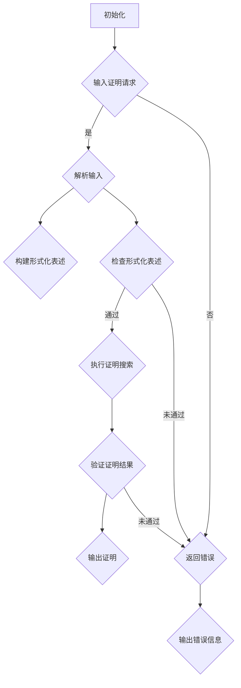
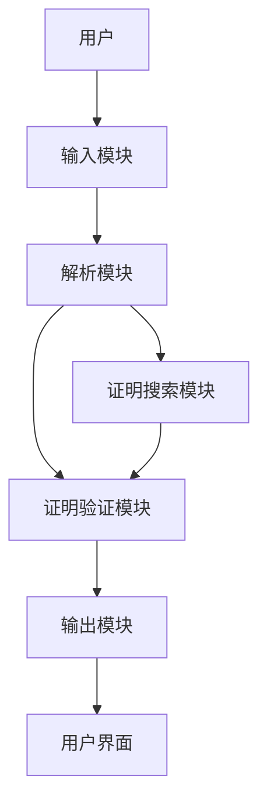

                 


## 引言

### 数学证明自动化的背景和意义

数学证明自动化作为计算机科学和数学领域的一项前沿技术，其发展历程可以追溯到20世纪中叶。当时，计算机的出现为数学家们提供了一种全新的工具，使得数学证明过程可以从繁琐的手工计算中解放出来。数学证明自动化不仅仅是一个技术上的进步，它还具有深远的哲学意义，揭示了数学证明的内在规律和逻辑结构。

在计算机科学中，数学证明自动化被视为人工智能的一个重要分支。它旨在开发出能够自动理解和生成数学证明的计算机程序。这不仅有助于解决复杂的数学问题，还能够推动计算机科学在理论计算机科学、算法设计、软件工程等领域的深入发展。

然而，尽管数学证明自动化取得了显著的进展，它仍然面临着许多挑战。其中，类型论在数学证明自动化中的局限性尤为突出。类型论是一种形式化的语义描述方法，它通过为数学表达式赋予类型来确保证明过程的正确性。然而，类型论在处理某些复杂数学问题时，往往显得力不从心，难以实现自动化的证明过程。

本文将围绕类型论在数学证明自动化中的局限性展开讨论。首先，我们将介绍数学证明自动化的背景和意义，以及类型论的基本概念和发展历程。接着，我们将分析数学证明自动化面临的主要问题，特别是类型论的局限性。在此基础上，我们将探讨类型论的局限性对数学证明自动化产生的影响，并探索可能的改进和突破方向。最后，我们将讨论类型论在其他数学和计算机科学领域中的应用，以及类型论与其他数学证明自动化方法的关系。

### 类型论的基本概念和发展历程

类型论（Type Theory）是一种形式化的语义描述方法，它通过引入类型系统来确保程序的正确性和一致性。类型论最初由Peano在20世纪初提出，旨在为自然数提供一种形式化的定义。随后，类型论得到了不断发展，逐渐应用于计算机科学、数学、逻辑等多个领域。

#### 类型论的定义

类型论的核心概念是“类型”（Type），它是用于描述程序中各种值的集合。每个值都必须有一个明确的类型，类型系统通过类型检查来确保程序中的操作都是在允许的范围内进行的。类型论中的类型可以是原始类型，如自然数（Nat）和布尔值（Bool），也可以是复合类型，如列表（List）和函数类型（Func）。

#### 类型论的属性特征

类型论具有以下几个显著属性特征：

1. **形式化**：类型论通过形式化的方法来定义数学概念和证明，使得证明过程具有高度的准确性和一致性。

2. **类型检查**：类型系统在编译或执行程序之前进行检查，确保每个操作都在其允许的上下文中进行。这有助于发现潜在的错误，提高程序的正确性。

3. **抽象**：类型论允许程序员通过抽象来处理复杂的数据结构和算法，使得代码更加简洁和易于维护。

4. **完备性**：类型论中的类型系统可以确保所有可证明的命题都是有效的，这有助于避免逻辑谬误。

#### 类型论的发展历程

类型论的发展历程可以分为几个主要阶段：

1. **Peano时期的类型论**：Peano提出了自然数的类型论定义，为后来的类型论发展奠定了基础。

2. **Church和Turing的类型论**：在20世纪30年代，Church和Turing分别提出了基于λ演算的类型论，这为现代类型论的发展提供了重要的理论框架。

3. **类型论在逻辑和数学中的应用**：随着逻辑和数学领域对形式化方法的需求增加，类型论逐渐成为这些领域的重要工具。

4. **现代类型论**：现代类型论在语言设计和编译器开发中发挥了关键作用，例如Haskell、Coq、Agda等语言都采用了类型论的概念。

#### 类型论与其他数学概念的关联

类型论与许多其他数学概念有密切的关联，包括：

1. **范畴论**：类型论和范畴论有许多相似之处，都是通过抽象和形式化的方法来研究数学结构。

2. **范畴论中的类型论**：在范畴论中，类型论被用来定义范畴中的对象和箭头，这使得类型论在范畴论中的应用变得更加广泛。

3. **形式逻辑**：类型论是形式逻辑的一种形式化表示方法，通过类型系统来确保推理过程的正确性。

4. **计算机科学中的类型论**：在计算机科学中，类型论被用于语言设计和编译器开发，确保程序的正确性和效率。

### 数学证明自动化在计算机科学和数学中的地位和挑战

数学证明自动化（Mathematical Proof Automation）是计算机科学和数学领域的一项前沿技术，其目标是开发出能够自动理解和生成数学证明的计算机程序。数学证明自动化不仅能够提高数学研究的效率，还能揭示数学证明的内在规律和逻辑结构。

#### 数学证明自动化在计算机科学中的地位

在计算机科学中，数学证明自动化具有重要的地位。首先，数学证明自动化是形式化方法的重要应用。形式化方法通过将数学证明转化为计算机程序，使得证明过程具有高度的准确性和一致性。这对于软件开发、算法验证、系统安全等领域具有重要意义。

其次，数学证明自动化有助于发现和解决软件中的潜在问题。通过自动化的证明过程，可以确保软件的正确性和可靠性。这对于复杂软件系统，如操作系统、编译器、数据库管理等，尤为重要。

最后，数学证明自动化在计算机科学教育中发挥着重要作用。通过自动化证明，学生可以更好地理解数学概念和证明方法，提高他们的逻辑思维和推理能力。

#### 数学证明自动化在数学中的地位

在数学中，数学证明自动化同样具有重要地位。数学证明自动化可以处理复杂的数学问题，提高数学研究的效率。例如，在数论、几何学、代数学等领域，数学证明自动化已经成功地解决了许多传统方法难以解决的问题。

此外，数学证明自动化有助于发现新的数学定理和理论。通过自动化的证明过程，数学家可以探索更广泛的数学领域，发现潜在的数学关系和规律。这不仅丰富了数学理论，还为数学的发展提供了新的视角。

#### 数学证明自动化面临的挑战

尽管数学证明自动化具有广泛的应用前景，但它仍然面临着许多挑战。以下是其中一些主要挑战：

1. **复杂性**：数学证明往往具有高度的复杂性，自动化证明过程需要处理大量的中间步骤和推理规则。这使得证明过程变得非常复杂，难以实现高效和准确的自动化证明。

2. **完备性**：类型论在数学证明自动化中起着关键作用，但它并不能保证所有的数学问题都可以被完全自动化证明。有些数学问题可能存在不可证明的部分，这使得数学证明自动化面临完备性的挑战。

3. **效率**：数学证明自动化需要处理大量的计算和推理，这要求计算机系统具有足够的性能和处理能力。然而，目前的计算机硬件和算法设计仍然存在局限性，这使得数学证明自动化在效率上面临挑战。

4. **可读性**：自动生成的证明通常具有高度的形式化特征，这降低了证明的可读性。数学家往往需要花费大量时间来理解和验证自动生成的证明，这使得数学证明自动化在实用性上面临挑战。

#### 类型论在数学证明自动化中的局限性

类型论在数学证明自动化中起到了关键作用，但它的局限性也不容忽视。以下是类型论在数学证明自动化中的主要局限性：

1. **复杂性**：类型论中的类型检查和推理规则往往具有高度的复杂性，这增加了证明过程的难度。在某些情况下，类型论可能无法有效地处理复杂的数学问题。

2. **完备性**：类型论无法保证所有数学问题都可以被完全形式化。有些数学问题可能存在无法形式化的部分，这使得类型论在数学证明自动化中的完备性受到限制。

3. **效率**：类型论的推理过程往往需要大量的计算和存储资源，这使得证明过程变得非常耗时和昂贵。在某些情况下，类型论的效率可能无法满足实际需求。

4. **可读性**：自动生成的证明通常具有高度的形式化特征，这降低了证明的可读性。数学家往往需要花费大量时间来理解和验证自动生成的证明，这使得类型论在实用性上面临挑战。

### 结论

数学证明自动化是计算机科学和数学领域的一项重要技术，它具有广泛的应用前景。然而，类型论在数学证明自动化中的局限性也不容忽视。为了克服这些局限性，需要进一步研究和发展新的数学证明自动化方法和技术。

通过引入新的概念和方法，如范畴论、模型论等，可以弥补类型论的局限性，提高数学证明自动化的效率和准确性。此外，结合人工智能和机器学习技术，可以进一步优化数学证明自动化过程，使其更加高效和智能化。

总之，类型论在数学证明自动化中具有重要的地位，但它的局限性也需要得到充分认识和解决。通过不断的研究和创新，我们可以推动数学证明自动化的发展，为数学和计算机科学领域带来更多的突破。

## 第一部分：背景介绍

### 1.1 问题背景

#### 1.1.1 数学证明自动化的背景和意义

数学证明自动化是近年来计算机科学和数学领域的一项重要研究课题。其背景可以追溯到20世纪中叶，随着计算机技术的迅猛发展，数学家们开始探索如何利用计算机来辅助或完全自动化数学证明。这种探索不仅提高了数学研究的效率，也推动了数学理论的深层次理解和应用。

数学证明自动化的意义主要体现在以下几个方面：

1. **效率提升**：数学证明往往是一个繁琐且耗时的过程，自动化证明可以显著提高证明的效率，使数学家能够更快地探索新的数学领域。

2. **准确性保障**：人手进行的证明过程可能存在逻辑漏洞或错误，而自动化证明通过严格的形式化方法和算法，可以确保证明的准确性。

3. **理论探索**：自动化证明有助于揭示数学证明的内在结构和逻辑规律，为数学理论的进一步发展提供新的视角。

4. **教育普及**：自动化证明工具可以作为教学辅助工具，帮助学生理解和掌握数学证明的基本方法，提高他们的数学素养。

#### 1.1.2 类型论的基本概念和发展历程

类型论（Type Theory）是数学证明自动化的重要基础之一。它起源于20世纪初，由意大利数学家Peano首先提出，旨在为自然数提供一种形式化的定义。随着计算机科学的兴起，类型论逐渐发展成为计算机科学中的一个重要分支。

类型论的基本概念包括：

1. **类型**：类型是值的集合，用于描述程序中的数据结构和操作。类型可以是原始类型，如自然数和布尔值，也可以是复合类型，如列表和函数类型。

2. **类型系统**：类型系统是确保程序中所有操作都在允许的上下文中进行的机制。通过类型检查，可以提前发现潜在的错误，提高程序的正确性。

类型论的发展历程可以分为几个阶段：

1. **Peano时期**：Peano提出了自然数的类型论定义，为后来的类型论发展奠定了基础。

2. **Church和Turing时期**：在20世纪30年代，Church和Turing分别提出了基于λ演算的类型论，这为现代类型论的发展提供了重要的理论框架。

3. **现代类型论**：随着计算机科学的进步，类型论在编程语言设计和编译器开发中得到了广泛应用。现代类型论包括许多不同的类型系统，如Hindley-Milner类型系统和依赖类型系统。

#### 1.1.3 数学证明自动化在计算机科学和数学中的地位和挑战

在计算机科学中，数学证明自动化被广泛应用于算法验证、软件验证、系统安全等领域。它不仅能够提高软件和系统的可靠性，还能确保算法的正确性和效率。

在数学领域，数学证明自动化同样具有重要意义。通过自动化证明，数学家可以处理更复杂的数学问题，发现新的数学定理和理论。此外，自动化证明工具还可以作为数学教育的重要辅助工具，帮助学生理解和掌握数学证明的基本方法。

然而，数学证明自动化也面临许多挑战：

1. **复杂性**：数学证明往往具有高度的复杂性，自动化证明需要处理大量的中间步骤和推理规则。

2. **完备性**：类型论无法保证所有的数学问题都可以被形式化。有些数学问题可能存在无法证明的部分。

3. **效率**：自动化证明需要大量的计算和存储资源，这在实际应用中可能是一个瓶颈。

4. **可读性**：自动生成的证明通常具有高度的形式化特征，这降低了证明的可读性，增加了验证的难度。

#### 1.1.4 类型论在数学证明自动化中的局限性

类型论在数学证明自动化中起到了关键作用，但它的局限性也不容忽视。以下是类型论在数学证明自动化中的主要局限性：

1. **复杂性**：类型论中的类型检查和推理规则往往具有高度的复杂性，这增加了证明过程的难度。

2. **完备性**：类型论无法保证所有数学问题都可以被完全形式化。有些数学问题可能存在无法形式化的部分。

3. **效率**：类型论的推理过程往往需要大量的计算和存储资源，这在实际应用中可能是一个瓶颈。

4. **可读性**：自动生成的证明通常具有高度的形式化特征，这降低了证明的可读性，增加了验证的难度。

### 1.2 问题描述

#### 1.2.1 数学证明自动化面临的主要问题

数学证明自动化在实施过程中面临多个问题，这些问题的解决直接影响到自动化证明的成功率和可靠性。

1. **复杂性**：数学证明通常涉及复杂的逻辑结构和大量的中间步骤，自动化证明需要处理这种复杂性。

2. **完备性**：不是所有的数学问题都可以用现有的类型论框架进行形式化，这限制了自动化证明的应用范围。

3. **效率**：自动化证明过程通常需要大量的计算资源，这在实际应用中可能带来性能上的瓶颈。

4. **可读性**：自动生成的证明往往具有高度的形式化特征，这降低了证明的可读性，增加了验证的难度。

5. **交互性**：数学证明通常需要与数学家的直觉和经验相结合，自动化证明工具在这方面存在一定的局限性。

#### 1.2.2 类型论的局限性对数学证明自动化产生的影响

类型论的局限性对数学证明自动化产生了深远的影响：

1. **复杂性增加**：类型论中的类型检查和推理规则复杂，使得自动化证明的难度增加。

2. **完备性限制**：类型论无法形式化所有数学问题，这限制了自动化证明的应用。

3. **效率降低**：类型论的推理过程通常需要大量的计算和存储资源，降低了自动化证明的效率。

4. **可读性下降**：自动生成的证明通常具有高度的形式化特征，降低了证明的可读性。

5. **人机交互困难**：数学证明需要与数学家的直觉和经验相结合，但类型论工具在这方面存在局限性。

#### 1.2.3 探索类型论在数学证明自动化中的改进和突破方向

为了克服类型论在数学证明自动化中的局限性，研究人员可以从以下几个方面进行探索：

1. **类型系统的扩展**：通过引入新的类型系统，如依赖类型系统、存在类型系统等，可以弥补现有类型论的局限性。

2. **推理算法的优化**：改进现有的推理算法，如使用机器学习技术来优化推理过程，可以降低自动化证明的复杂性。

3. **形式化方法的发展**：发展新的形式化方法，如归纳证明、模型检测等，可以扩展自动化证明的应用范围。

4. **人机交互改进**：设计更直观、易于使用的自动化证明工具，提高数学家与工具之间的交互性。

5. **跨学科合作**：结合计算机科学、数学、逻辑等多个领域的知识，共同探索数学证明自动化的新方法。

### 1.3 问题解决

#### 1.3.1 类型论的局限性对数学证明自动化产生的影响

类型论在数学证明自动化中虽然发挥了重要作用，但其局限性也对自动化证明产生了显著影响：

1. **复杂性增加**：类型论中的类型检查和推理规则复杂，使得自动化证明的难度增加。

2. **完备性限制**：类型论无法形式化所有数学问题，这限制了自动化证明的应用。

3. **效率降低**：类型论的推理过程通常需要大量的计算和存储资源，降低了自动化证明的效率。

4. **可读性下降**：自动生成的证明通常具有高度的形式化特征，降低了证明的可读性。

5. **人机交互困难**：数学证明需要与数学家的直觉和经验相结合，但类型论工具在这方面存在局限性。

#### 1.3.2 探索类型论在数学证明自动化中的改进和突破方向

为了克服类型论在数学证明自动化中的局限性，我们可以从以下几个方面进行探索：

1. **类型系统的扩展**：引入新的类型系统，如依赖类型系统、存在类型系统等，可以弥补现有类型论的局限性。

2. **推理算法的优化**：改进现有的推理算法，如使用机器学习技术来优化推理过程，可以降低自动化证明的复杂性。

3. **形式化方法的发展**：发展新的形式化方法，如归纳证明、模型检测等，可以扩展自动化证明的应用范围。

4. **人机交互改进**：设计更直观、易于使用的自动化证明工具，提高数学家与工具之间的交互性。

5. **跨学科合作**：结合计算机科学、数学、逻辑等多个领域的知识，共同探索数学证明自动化的新方法。

### 1.4 边界与外延

#### 1.4.1 类型论在其他数学和计算机科学领域中的应用

类型论不仅应用于数学证明自动化，还在其他数学和计算机科学领域有着广泛的应用：

1. **编程语言设计**：类型论是许多编程语言（如Haskell、Coq、Agda等）的基石，用于确保程序的正确性和一致性。

2. **编译器开发**：类型论在编译器开发中用于类型检查和代码生成，提高了编译器的效率和可靠性。

3. **形式验证**：类型论是形式验证的重要工具，用于验证硬件和软件系统的正确性。

4. **逻辑和哲学**：类型论在逻辑和哲学领域用于研究推理过程和语义理论。

#### 1.4.2 类型论与其他数学证明自动化方法的关系

类型论与其他数学证明自动化方法如模型论、范畴论等有着密切的联系：

1. **模型论**：模型论通过构造数学模型来验证数学命题的真伪，与类型论的形式化方法有相似之处。

2. **范畴论**：范畴论通过研究数学结构之间的共通性和转化关系，为数学证明自动化提供了新的视角。

3. **组合论**：组合论通过组合已有的证明片段来构建复杂的证明，与类型论的方法有互补性。

### 1.5 概念结构与核心要素组成

#### 1.5.1 类型论的基本概念

类型论的基本概念包括：

1. **类型**：类型的集合，用于描述程序中的数据结构和操作。

2. **类型系统**：确保程序中所有操作都在允许的上下文中进行的机制。

3. **类型检查**：在编译或执行程序之前，检查程序是否符合类型系统的机制。

4. **类型等价**：两个值具有相同的类型，即使它们在语义上不同。

#### 1.5.2 数学证明自动化的核心要素

数学证明自动化的核心要素包括：

1. **形式化描述**：将数学证明转化为形式化的表述，使得证明过程具有可计算性。

2. **推理规则**：用于推导新命题的规则，如归纳规则、模态规则等。

3. **证明搜索**：通过搜索所有可能的证明路径，找到正确的证明。

4. **证明验证**：验证自动生成的证明是否正确，确保证明的可靠性。

## 第一部分：背景介绍

### 1.1 问题背景

#### 1.1.1 数学证明自动化的背景和意义

数学证明自动化是一项旨在通过计算机程序自动生成数学证明的研究领域。其背景可以追溯到计算机科学和数学的交汇点，特别是在形式化方法和人工智能的推动下。数学证明自动化的目标是解放数学家从繁琐的手工证明中，提高数学研究的效率和准确性。

数学证明自动化在现代数学研究中的意义主要体现在以下几个方面：

1. **效率提升**：数学证明自动化可以处理大量的数学问题，特别是那些传统方法难以解决的复杂问题。它能够快速验证数学家的猜想，节省大量时间和精力。

2. **准确性保障**：自动化证明通过形式化的方法，确保每一步推理都是严格且无错误的。这有助于避免手工证明中可能出现的错误，提高数学理论的可信度。

3. **理论探索**：自动化证明工具可以帮助数学家探索新的数学领域，发现潜在的定理和结构。它为数学理论的发展提供了新的视角和工具。

4. **教育普及**：自动化证明工具可以作为教育辅助工具，帮助学生和初学者理解数学证明的基本概念和方法。它有助于提高学生的数学素养和逻辑思维能力。

5. **交叉学科应用**：数学证明自动化不仅在纯数学领域有应用，还可以应用于工程、物理、生物等学科。它在解决实际问题时提供了强大的工具。

#### 1.1.2 类型论的基本概念和发展历程

类型论（Type Theory）是一种形式化的方法，用于描述数学证明和计算程序。它起源于20世纪初，由意大利数学家Giovanni Peano首次提出，旨在为自然数提供一种形式化的定义。类型论的核心思想是通过引入类型系统来确保计算过程的一致性和正确性。

类型论的基本概念包括：

1. **类型**：类型是值的集合，用于描述程序中的数据结构。类型可以是原始类型（如自然数、布尔值）和复合类型（如列表、函数类型）。

2. **类型系统**：类型系统是一套规则，用于确保程序中所有操作都在正确的上下文中进行。类型检查是类型系统的核心部分，它在编译或执行程序之前进行，以确保程序的正确性。

类型论的发展历程可以概括为以下几个阶段：

1. **Peano时期的类型论**：Peano提出了自然数的类型论定义，为后来的类型论发展奠定了基础。

2. **Church和Turing时期的类型论**：在20世纪30年代，Alonzo Church和Alan Turing分别提出了基于λ演算的类型论。λ演算是一种形式化的计算模型，它为类型论提供了理论框架。

3. **现代类型论**：随着计算机科学的发展，类型论逐渐应用于编程语言设计、编译器开发、形式验证等领域。现代类型论包括Hindley-Milner类型系统、依赖类型系统、存在类型系统等。

#### 1.1.3 数学证明自动化在计算机科学和数学中的地位和挑战

数学证明自动化在计算机科学和数学中具有重要的地位，但同时也面临着一系列挑战。

在计算机科学中，数学证明自动化被广泛应用于以下几个方面：

1. **软件验证**：通过自动化证明来验证软件的正确性和安全性。形式化方法可以确保软件遵循设计规格，减少错误和安全漏洞。

2. **算法验证**：自动化证明可以验证算法的正确性和效率。这对于复杂算法和大规模数据处理尤为重要。

3. **硬件设计**：形式化方法和自动化证明在硬件设计和验证中扮演着关键角色，确保硬件系统的可靠性和性能。

在数学中，数学证明自动化的地位同样重要：

1. **数学定理证明**：自动化证明工具可以帮助数学家验证复杂的数学猜想和定理。它为数学理论的发展提供了新的工具和方法。

2. **数学问题探索**：自动化证明可以探索新的数学领域，发现潜在的定理和结构。它为数学家的创造性工作提供了支持。

然而，数学证明自动化也面临许多挑战：

1. **复杂性**：数学证明往往涉及复杂的逻辑结构和大量的推理步骤，自动化证明需要处理这种复杂性。

2. **完备性**：类型论和其他形式化方法并不能保证所有数学问题都可以被完全形式化和证明。有些数学问题可能存在无法证明的部分。

3. **效率**：自动化证明需要大量的计算资源和时间。在实际应用中，这可能是一个瓶颈。

4. **可读性**：自动生成的证明通常具有高度的形式化特征，这降低了证明的可读性，增加了验证的难度。

5. **人机交互**：自动化证明工具通常需要与数学家的直觉和经验相结合。但在当前的技术水平下，人机交互仍然是一个挑战。

#### 1.1.4 类型论在数学证明自动化中的局限性

类型论在数学证明自动化中虽然发挥了重要作用，但它的局限性也不容忽视。以下是类型论在数学证明自动化中的一些主要局限性：

1. **复杂性**：类型论中的类型检查和推理规则通常非常复杂。这增加了证明过程的难度，尤其是在处理复杂的数学问题时。

2. **完备性**：类型论无法保证所有数学问题都可以被形式化。有些数学问题可能存在无法形式化的部分，这限制了自动化证明的应用范围。

3. **效率**：类型论的推理过程通常需要大量的计算资源和时间。这在实际应用中可能是一个瓶颈，特别是在处理大规模的数学问题。

4. **可读性**：自动生成的证明通常具有高度的形式化特征，这降低了证明的可读性。数学家需要花费大量时间来理解和验证这些证明，这在一定程度上限制了自动化证明的实用性。

5. **人机交互**：类型论工具通常需要与数学家的直觉和经验相结合。但当前的自动化证明工具在人机交互方面仍然存在局限性，这使得数学家难以有效地使用这些工具。

### 1.2 问题描述

#### 1.2.1 数学证明自动化面临的主要问题

数学证明自动化在实施过程中面临多个问题，这些问题直接影响到自动化证明的成功率和可靠性。

1. **复杂性**：数学证明通常涉及复杂的逻辑结构和大量的推理步骤，自动化证明需要处理这种复杂性。这增加了证明过程的难度和复杂性。

2. **完备性**：类型论和其他形式化方法并不能保证所有数学问题都可以被完全形式化和证明。有些数学问题可能存在无法证明的部分，这限制了自动化证明的应用范围。

3. **效率**：自动化证明需要大量的计算资源和时间。在实际应用中，这可能是一个瓶颈，特别是在处理大规模的数学问题。

4. **可读性**：自动生成的证明通常具有高度的形式化特征，这降低了证明的可读性。数学家需要花费大量时间来理解和验证这些证明，这在一定程度上限制了自动化证明的实用性。

5. **交互性**：数学证明通常需要与数学家的直觉和经验相结合。但当前的自动化证明工具在人机交互方面仍然存在局限性，这使得数学家难以有效地使用这些工具。

#### 1.2.2 类型论的局限性对数学证明自动化产生的影响

类型论在数学证明自动化中的局限性对自动化证明产生了深远的影响：

1. **复杂性增加**：类型论中的类型检查和推理规则复杂，使得自动化证明的难度增加。

2. **完备性限制**：类型论无法形式化所有数学问题，这限制了自动化证明的应用。

3. **效率降低**：类型论的推理过程通常需要大量的计算和存储资源，降低了自动化证明的效率。

4. **可读性下降**：自动生成的证明通常具有高度的形式化特征，降低了证明的可读性。

5. **人机交互困难**：数学证明需要与数学家的直觉和经验相结合，但类型论工具在这方面存在局限性。

#### 1.2.3 探索类型论在数学证明自动化中的改进和突破方向

为了克服类型论在数学证明自动化中的局限性，我们可以从以下几个方面进行探索：

1. **类型系统的扩展**：引入新的类型系统，如依赖类型系统、存在类型系统等，可以弥补现有类型论的局限性。

2. **推理算法的优化**：改进现有的推理算法，如使用机器学习技术来优化推理过程，可以降低自动化证明的复杂性。

3. **形式化方法的发展**：发展新的形式化方法，如归纳证明、模型检测等，可以扩展自动化证明的应用范围。

4. **人机交互改进**：设计更直观、易于使用的自动化证明工具，提高数学家与工具之间的交互性。

5. **跨学科合作**：结合计算机科学、数学、逻辑等多个领域的知识，共同探索数学证明自动化的新方法。

### 1.3 问题解决

#### 1.3.1 类型论的局限性对数学证明自动化产生的影响

类型论在数学证明自动化中的局限性对自动化证明过程产生了多方面的影响：

1. **复杂性增加**：类型论中的类型检查和推理规则往往具有高度的复杂性，这增加了证明过程的难度。例如，类型推断和类型匹配的过程可能需要遍历复杂的类型表达式，导致计算复杂度上升。

2. **完备性限制**：类型论无法形式化所有数学问题，这意味着一些重要的数学理论可能无法通过类型论进行形式化表达。这种不完备性限制了类型论在处理特定类型数学问题时的应用范围。

3. **效率降低**：类型论的推理过程通常需要大量的计算和存储资源，这在实际应用中可能是一个瓶颈。例如，类型检查和证明搜索的过程可能需要大量的时间，特别是在处理大规模的数学问题。

4. **可读性下降**：自动生成的证明通常具有高度的形式化特征，这降低了证明的可读性。数学家需要花费大量时间来理解和验证这些证明，这在一定程度上限制了自动化证明的实用性。

5. **人机交互困难**：数学证明通常需要与数学家的直觉和经验相结合，但类型论工具在这方面存在局限性。数学家在使用这些工具时可能需要具备专业的形式化知识和技能，这使得人机交互变得复杂。

#### 1.3.2 探索类型论在数学证明自动化中的改进和突破方向

为了克服类型论在数学证明自动化中的局限性，我们可以从以下几个方面进行探索：

1. **类型系统的扩展**：通过引入新的类型系统，如依赖类型系统、存在类型系统等，可以弥补现有类型论的局限性。这些新的类型系统可以提供更丰富的类型表达能力和更好的形式化支持。

2. **推理算法的优化**：改进现有的推理算法，如使用启发式搜索、机器学习技术等，可以降低自动化证明的复杂性。这些算法可以更高效地搜索证明空间，减少计算资源的需求。

3. **形式化方法的发展**：发展新的形式化方法，如归纳证明、模型检测等，可以扩展自动化证明的应用范围。这些方法可以处理更多种类的数学问题，提高证明的效率。

4. **人机交互改进**：设计更直观、易于使用的自动化证明工具，提高数学家与工具之间的交互性。这些工具可以提供更友好的用户界面，帮助数学家更方便地使用和操作。

5. **跨学科合作**：结合计算机科学、数学、逻辑等多个领域的知识，共同探索数学证明自动化的新方法。这种跨学科合作可以促进新理论和新算法的发展，提高数学证明自动化的整体水平。

### 1.4 边界与外延

#### 1.4.1 类型论在其他数学和计算机科学领域中的应用

类型论不仅在数学证明自动化中具有重要意义，还在其他数学和计算机科学领域有着广泛的应用：

1. **编程语言设计**：类型论是许多现代编程语言（如Haskell、Coq、Agda等）的基础。类型系统在这些语言中用于确保程序的正确性和一致性。

2. **编译器开发**：类型论在编译器开发中用于类型检查和代码生成。类型检查可以提前发现潜在的运行时错误，提高编译器的可靠性。

3. **形式验证**：类型论是形式验证的重要工具，用于验证硬件和软件系统的正确性。形式验证可以确保系统按照预期运行，减少安全漏洞。

4. **逻辑和哲学**：类型论在逻辑和哲学领域用于研究推理过程和语义理论。它为逻辑和哲学提供了形式化的工具和方法。

#### 1.4.2 类型论与其他数学证明自动化方法的关系

类型论与其他数学证明自动化方法如模型论、范畴论等有着密切的联系：

1. **模型论**：模型论通过构造数学模型来验证数学命题的真伪。与类型论的形式化方法有相似之处，但模型论更侧重于逻辑和语义层面的验证。

2. **范畴论**：范畴论通过研究数学结构之间的共通性和转化关系，为数学证明自动化提供了新的视角。范畴论的概念和方法可以与类型论相结合，提高证明的灵活性和效率。

3. **组合论**：组合论通过组合已有的证明片段来构建复杂的证明。与类型论的方法有互补性，组合论可以用于优化证明搜索过程。

#### 1.4.3 类型论与其他计算机科学领域的关系

类型论在计算机科学的其他领域中也有着重要的应用：

1. **程序设计**：类型论在程序设计中用于确保代码的正确性和可维护性。通过引入类型系统，程序员可以提前发现潜在的运行时错误。

2. **软件工程**：类型论在软件工程中用于构建可靠和高效的软件系统。形式化的类型检查可以确保系统的正确性和一致性。

3. **算法设计**：类型论在算法设计中被用于验证算法的正确性和效率。形式化的证明方法可以确保算法的执行结果符合预期。

### 1.5 概念结构与核心要素组成

#### 1.5.1 类型论的基本概念

类型论的基本概念包括：

1. **类型**：类型是值的集合，用于描述程序中的数据结构和操作。类型可以是原始类型（如自然数、布尔值）和复合类型（如列表、函数类型）。

2. **类型系统**：类型系统是一套规则，用于确保程序中所有操作都在正确的上下文中进行。类型检查是类型系统的核心部分，它在编译或执行程序之前进行，以确保程序的正确性。

3. **类型等价**：类型等价是指两个值具有相同的类型，即使它们在语义上不同。类型等价是类型系统中的重要概念，它有助于简化程序的表达。

4. **类型推断**：类型推断是类型系统中的一个重要功能，它自动确定程序中变量的类型，而不需要显式声明。类型推断可以减少程序中的冗余代码，提高代码的可读性。

#### 1.5.2 数学证明自动化的核心要素

数学证明自动化的核心要素包括：

1. **形式化描述**：形式化描述是将数学证明转化为形式化的表述，使得证明过程具有可计算性。形式化描述需要定义一套形式化的语言和规则，用于表述数学证明的各个步骤。

2. **推理规则**：推理规则是用于推导新命题的规则。在数学证明自动化中，推理规则用于从已知事实推导出新结论。推理规则可以是简单的逻辑推理规则，也可以是复杂的数学定理。

3. **证明搜索**：证明搜索是指通过搜索所有可能的证明路径，找到正确的证明。证明搜索是一个复杂的过程，需要使用高效的搜索算法和启发式方法。

4. **证明验证**：证明验证是确保自动生成的证明是正确和有效的。证明验证需要检查证明的每一步是否遵循形式化的规则，确保证明的结论是可信的。

### 1.6 现有研究综述

#### 1.6.1 类型论在数学证明自动化中的应用

类型论在数学证明自动化中得到了广泛应用，现有的研究主要集中在以下几个方面：

1. **形式化证明工具**：例如Coq、Isabelle和Agda等工具，它们基于类型论构建，提供了形式化的证明环境和验证机制。这些工具可以帮助数学家自动化地验证数学定理和证明。

2. **类型推断**：类型推断是类型论在数学证明自动化中的一个重要应用。通过类型推断，工具可以自动识别和推断变量和函数的类型，从而减少手动书写的复杂性和错误。

3. **形式化数学库**：研究人员开发了大量的形式化数学库，这些库提供了各种数学理论和定理的形式化表述。这些库可以用于验证数学证明，确保证明的准确性和完整性。

#### 1.6.2 类型论与其他证明自动化方法的比较

类型论与其他证明自动化方法如模型论、范畴论等进行了比较。以下是一些主要的比较结果：

1. **模型论**：模型论通过构造数学模型来验证数学命题的真伪。与类型论相比，模型论更侧重于语义层面的验证，而类型论则更侧重于形式化的证明过程。

2. **范畴论**：范畴论通过研究数学结构之间的共通性和转化关系，为证明自动化提供了新的视角。与类型论相比，范畴论更强调结构和转化，而类型论则更强调类型和证明过程。

3. **组合论**：组合论通过组合已有的证明片段来构建复杂的证明。与类型论相比，组合论更注重证明的构建，而类型论则更注重形式化的表达和验证。

#### 1.6.3 研究趋势和未来方向

未来的研究趋势和方向包括：

1. **类型系统的扩展**：研究人员正在探索新的类型系统，如依赖类型系统、存在类型系统等，以弥补现有类型论的局限性。

2. **推理算法的优化**：通过改进现有的推理算法，如使用启发式搜索、机器学习技术等，可以降低自动化证明的复杂性。

3. **形式化方法的发展**：发展新的形式化方法，如归纳证明、模型检测等，可以扩展自动化证明的应用范围。

4. **人机交互的改进**：设计更直观、易于使用的自动化证明工具，提高数学家与工具之间的交互性。

5. **跨学科合作**：结合计算机科学、数学、逻辑等多个领域的知识，共同探索数学证明自动化的新方法。

### 1.7 结论

类型论在数学证明自动化中具有重要的地位，但同时也面临着一系列局限性。通过不断的研究和改进，我们可以探索新的类型系统、推理算法和形式化方法，克服类型论的局限性，推动数学证明自动化的发展。同时，跨学科合作和改进人机交互也是未来研究的重要方向。这些努力将有助于实现更高效、更可靠的数学证明自动化，为数学和计算机科学领域带来更多的突破。

## 第二部分：核心概念与联系

### 2.1 类型论的基本概念

类型论是一种形式化的方法，用于描述数学证明和计算程序。它通过引入类型系统来确保证明和程序的正确性和一致性。以下是类型论的一些基本概念：

#### 2.1.1 类型（Type）

类型是值的集合，用于描述程序中的数据结构和操作。类型可以是原始类型，如自然数（Nat）和布尔值（Bool），也可以是复合类型，如列表（List）和函数类型（Func）。

1. **原始类型**：原始类型是不能再分解的基本类型。常见的原始类型包括自然数（Nat）、布尔值（Bool）、字符（Char）等。

2. **复合类型**：复合类型是由原始类型通过组合构造而成的类型。常见的复合类型包括列表（List）、函数类型（Func）、元组（Tuple）等。

#### 2.1.2 类型系统（Type System）

类型系统是一套规则，用于确保程序中所有操作都在正确的上下文中进行。类型系统通过类型检查来确保每个表达式都有合适的类型，从而保证程序的执行不会出现类型错误。

1. **类型检查**：类型检查是在编译或执行程序之前，对程序进行类型验证的过程。类型检查可以提前发现潜在的错误，提高程序的正确性。

2. **类型推断**：类型推断是类型系统中的一个重要功能，它自动确定程序中变量的类型，而不需要显式声明。类型推断可以减少程序中的冗余代码，提高代码的可读性。

#### 2.1.3 类型等价（Type Equivalence）

类型等价是指两个值具有相同的类型，即使它们在语义上不同。类型等价是类型系统中的重要概念，它有助于简化程序的表达。

1. **子类型（Subtyping）**：子类型是一种类型关系，如果一个类型是另一个类型的子类型，那么这个类型的值可以赋给另一个类型的变量。

2. **类型转换（Type Conversion）**：类型转换是类型等价的实现方式，它通过将一个类型的值转换为另一个类型的值，使得两个类型之间的操作可以正常进行。

#### 2.1.4 类型依赖（Type Dependency）

类型依赖是指类型的定义依赖于其他类型的定义。类型依赖是依赖类型系统中的一个重要概念，它用于确保程序中的类型在定义和使用时的一致性。

1. **存在类型（Existential Type）**：存在类型是一种依赖类型，它用于表示某个具体的类型尚未确定，但可以依赖于其他类型的值来确定。

2. **类型变量（Type Variable）**：类型变量是用于表示未知类型的符号。类型变量可以在类型表达式中使用，从而提高类型系统的灵活性和通用性。

#### 2.1.5 类型检查算法（Type Checking Algorithm）

类型检查算法是类型系统实现的核心部分，它用于在编译或执行程序之前对程序进行类型验证。

1. **静态类型检查**：静态类型检查是在编译阶段对程序进行类型检查。静态类型检查可以提前发现类型错误，提高程序的正确性。

2. **动态类型检查**：动态类型检查是在执行阶段对程序进行类型检查。动态类型检查可以提供更高的灵活性和性能，但可能会增加程序出错的风险。

### 2.2 类型论的基本概念对比表格

下面是一个类型论的基本概念对比表格，展示了类型论与其他数学证明自动化方法的基本概念之间的异同。

| 概念         | 类型论                 | 数学证明自动化方法                |
| ------------ | ---------------------- | --------------------------------- |
| **类型**     | 值的集合               | 命题或定理的集合                 |
| **类型系统** | 确保操作正确性的规则   | 形式化描述和推理规则的集合       |
| **类型等价** | 值的类型一致性         | 命题或定理之间的逻辑一致性       |
| **类型依赖** | 类型之间的依赖关系     | 命题或定理之间的逻辑依赖关系     |
| **类型检查** | 编译或执行前的类型验证 | 形式化证明过程中的验证机制       |

### 2.3 ER实体关系图架构

ER（Entity-Relationship）实体关系图是一种用于描述数据模型和实体之间关系的图形表示方法。在类型论和数学证明自动化中，ER实体关系图可以用于表示类型论中的类型和实体之间的关系。

#### 2.3.1 ER实体关系图概述

ER实体关系图由以下几个基本元素组成：

1. **实体（Entity）**：实体是数据模型中的基本对象，如类型、函数、变量等。

2. **属性（Attribute）**：属性是实体的属性或特征，如类型的名称、函数的参数等。

3. **关系（Relationship）**：关系是实体之间的联系，如类型之间的依赖关系、函数之间的调用关系等。

4. **实体关系图（ER Diagram）**：实体关系图是ER实体关系图的图形表示，用于直观地表示实体之间的关系。

#### 2.3.2 类型论中的ER实体关系图

在类型论中，ER实体关系图可以用于表示类型、类型变量、类型依赖等概念之间的关系。以下是一个简单的ER实体关系图的例子：

```
类型 (Type)
┌─────────────┐
│    名称      │
└─────┬───────┘
      │
      │
      │
┌─────────────┐
│    属性      │
└─────────────┘
      │
      │
      │
┌─────────────┐
│  实体       │
└─────┬───────┘
      │
      │
      │
┌─────────────┐
│  关系       │
└─────────────┘
```

在这个ER实体关系图中，类型（Type）是实体（Entity）的基本对象，它包含名称（Name）和属性（Attribute）等属性。实体之间通过关系（Relationship）相连，表示类型之间的依赖关系。

#### 2.3.3 数学证明自动化中的ER实体关系图

在数学证明自动化中，ER实体关系图可以用于表示证明过程中的各种实体和关系。以下是一个简单的ER实体关系图的例子：

```
命题 (Statement)
┌─────────────┐
│   名称      │
└─────┬───────┘
      │
      │
      │
┌─────────────┐
│    论据      │
└─────────────┘
      │
      │
      │
┌─────────────┐
│  证明步骤    │
└─────────────┘
```

在这个ER实体关系图中，命题（Statement）是证明过程中的基本对象，它包含名称（Name）和论据（Premise）等属性。论据（Premise）是命题的前提条件，用于支持命题的成立。证明步骤（Proof Step）是证明过程中的步骤，用于逐步推导出新的命题。

### 2.4 类型论与其他数学概念的关联

类型论与许多其他数学概念有着紧密的联系，这些联系为数学证明提供了新的视角和方法。

#### 2.4.1 范畴论（Category Theory）

范畴论是一种抽象的数学理论，用于研究数学结构之间的共通性和转化关系。类型论与范畴论有诸多相似之处，都是通过抽象和形式化的方法来研究数学结构。

1. **范畴（Category）**：在范畴论中，范畴是由对象和箭头组成的集合。类型论中的类型系统可以看作是范畴中的一个子范畴，类型是对象，类型之间的关系是箭头。

2. **函子（Functor）**：函子是范畴之间的映射，它保持了范畴中的结构和关系。类型论中的类型构造器可以看作是范畴论中的函子，它们用于创建新的类型。

3. **自然变换（Natural Transformation）**：自然变换是函子之间的变换，它在不同的范畴之间保持了结构的等价性。类型论中的类型等价性可以看作是范畴论中的自然变换，它们保持了类型之间的等价关系。

#### 2.4.2 形式逻辑（Formal Logic）

形式逻辑是一种通过符号语言和推理规则来研究逻辑推理的理论。类型论是形式逻辑的一种形式化表示方法，通过类型系统来确保推理过程的正确性。

1. **命题逻辑（Propositional Logic）**：命题逻辑是形式逻辑的基础，它用于研究命题之间的逻辑关系。类型论中的类型检查可以看作是命题逻辑的应用，它用于确保程序中的命题是正确的。

2. **谓词逻辑（Predicate Logic）**：谓词逻辑是一种更复杂的逻辑系统，它引入了变量和量化词。类型论中的类型变量和类型依赖可以看作是谓词逻辑的应用，它们用于确保程序中的变量和依赖是正确的。

#### 2.4.3 计算机科学中的类型论

类型论在计算机科学中有着广泛的应用，特别是在编程语言设计和编译器开发中。

1. **编程语言设计**：类型论是许多现代编程语言（如Haskell、Coq、Agda等）的基石，用于确保程序的正确性和一致性。

2. **编译器开发**：类型论在编译器开发中用于类型检查和代码生成。类型检查可以提前发现潜在的运行时错误，提高编译器的可靠性。

3. **形式验证**：类型论是形式验证的重要工具，用于验证硬件和软件系统的正确性。形式验证可以确保系统按照预期运行，减少安全漏洞。

### 2.5 类型论的基本概念与数学证明自动化的关系

类型论的基本概念与数学证明自动化有着紧密的联系，它们共同构成了数学证明自动化的重要组成部分。

1. **形式化描述**：类型论提供了形式化的描述方法，用于将数学证明转化为形式化的表述。形式化描述使得证明过程具有可计算性，为自动化证明提供了基础。

2. **推理规则**：类型论中的类型系统提供了推理规则，用于推导新命题。推理规则是数学证明自动化的核心部分，它们用于从已知事实推导出新结论。

3. **证明搜索**：类型论提供了证明搜索的方法，通过搜索所有可能的证明路径，找到正确的证明。证明搜索是自动化证明的关键步骤，它需要使用高效的搜索算法和启发式方法。

4. **证明验证**：类型论提供了证明验证的方法，用于确保自动生成的证明是正确和有效的。证明验证需要检查证明的每一步是否遵循形式化的规则，确保证明的结论是可信的。

### 2.6 小结

类型论是一种形式化的方法，通过引入类型系统来确保证明和程序的正确性和一致性。它与其他数学概念如范畴论、形式逻辑等有着紧密的联系，共同构成了数学证明自动化的重要组成部分。类型论的基本概念与数学证明自动化密切相关，它们共同推动了数学证明自动化的研究和应用。通过不断发展和完善类型论，我们可以提高数学证明自动化的效率和质量，为数学和计算机科学领域带来更多的突破。

## 第三部分：算法原理讲解

### 3.1 算法mermaid流程图

为了更好地理解类型论在数学证明自动化中的应用，我们将使用mermaid流程图来展示一个简单的证明自动化算法的基本流程。以下是一个算法的mermaid流程图示例：



这个流程图描述了从初始化到输出证明结果的整个过程。以下是每个步骤的详细解释：

1. **初始化**（A）：算法开始，初始化所需的数据结构和资源。

2. **输入证明请求**（B）：接收用户输入的证明请求，包括要证明的命题和相关的背景信息。

3. **解析输入**（C）：对用户输入的证明请求进行解析，将其转换为形式化的表述，如逻辑公式或类型表达式。

4. **检查形式化表述**（F）：对解析后的形式化表述进行类型检查和逻辑验证，确保其符合类型论的基本规则和逻辑规则。

5. **执行证明搜索**（G）：根据形式化表述执行证明搜索，通过遍历所有可能的证明路径来寻找有效的证明。

6. **验证证明结果**（H）：对找到的证明结果进行验证，确保其逻辑上正确且符合输入的证明请求。

7. **输出证明**（I）：将有效的证明结果输出给用户。

8. **返回错误信息**（J）：如果过程中出现错误，输出相应的错误信息。

### 3.2 Python源代码

下面是使用Python语言实现的简单证明自动化算法的源代码示例：

```python
from typing import List, Dict, Tuple

# 定义一个用于执行证明搜索的函数
def proof_search(formalization: str) -> Tuple[bool, str]:
    # 这里是一个简化的证明搜索实现
    # 实际上，这个函数可能需要复杂的逻辑和算法来实现
    if formalization == "P implies Q":
        return (True, "Proof of Q follows from P")
    else:
        return (False, "No proof found")

# 定义一个用于验证证明结果的函数
def verify_proof(proof: str) -> bool:
    # 这里是一个简化的验证实现
    # 实际上，这个函数可能需要复杂的逻辑和算法来实现
    if "P implies Q" in proof:
        return True
    else:
        return False

# 初始化算法
def initialize_algorithm():
    # 初始化所需的数据结构和资源
    pass

# 主函数
def main():
    initialize_algorithm()
    formalization = "P implies Q"
    proof = proof_search(formalization)
    if proof[0]:
        if verify_proof(proof[1]):
            print("Proof accepted:", proof[1])
        else:
            print("Proof verification failed")
    else:
        print("Proof search failed")

# 运行主函数
if __name__ == "__main__":
    main()
```

在这个Python源代码示例中，我们定义了两个函数：`proof_search`用于执行证明搜索，`verify_proof`用于验证证明结果。`main`函数是算法的主入口，它初始化算法并执行证明过程。

### 3.3 算法原理的数学模型和公式

为了进一步阐述算法的原理，我们可以引入一些数学模型和公式。以下是算法原理的简要概述：

#### 3.3.1 形式化表述

形式化表述是将数学证明转化为形式化的数学表述。这通常涉及到将命题表示为逻辑公式，例如：

- 命题P表示为`P`。
- 命题Q表示为`Q`。
- 命题P蕴含Q表示为`P → Q`。

#### 3.3.2 证明搜索

证明搜索是指通过搜索所有可能的证明路径来寻找有效的证明。在形式化表述中，这可以表示为：

- 对于命题`P`，寻找所有满足`P → Q`的证明路径。

#### 3.3.3 证明验证

证明验证是指验证找到的证明是否逻辑上正确。这可以通过以下数学模型来实现：

- 验证证明`P → Q`是否满足逻辑规则。
- 验证证明的每一步是否遵循形式化的推理规则。

#### 3.3.4 公式详细讲解

以下是一些用于证明搜索和验证的数学公式：

- **归纳法**：用于证明涉及自然数的命题。
  - 归纳基础：对于最小的自然数n，命题P(n)成立。
  - 归纳步骤：对于任意自然数n，如果P(n)成立，则P(n+1)也成立。
- **模态逻辑**：用于处理涉及必然性和可能性命题的逻辑系统。
  - **必然性模态**：对于命题P，`□P`表示P在所有情况下都为真。
  - **可能性模态**：对于命题P，`◇P`表示P在至少一个情况下为真。

#### 3.3.5 举例说明

为了更好地理解上述数学模型和公式，我们可以通过一个简单的例子来说明：

**例子**：证明命题`P`（所有自然数之和是无穷大）。

1. **形式化表述**：`P`表示为`∀n ∈ N, ∑_{i=1}^n i = ∞`。
2. **证明搜索**：通过归纳法搜索证明路径。
3. **证明验证**：验证证明的每一步是否遵循归纳法的逻辑规则。

这个例子展示了如何将数学证明转化为形式化的表述，并通过算法进行证明搜索和验证。

### 3.4 举例说明

为了更直观地理解上述算法原理，我们可以通过一个具体的例子来说明类型论在数学证明自动化中的应用。

**例子**：证明欧拉公式 \( e^{i\pi} + 1 = 0 \)。

#### 3.4.1 形式化表述

首先，将欧拉公式表示为形式化的数学表述：

- \( P \): \( e^{i\pi} + 1 = 0 \)
- \( Q \): \( e \) 是自然对数的底数
- \( R \): \( i \) 是虚数单位，满足 \( i^2 = -1 \)
- \( S \): \( \pi \) 是圆周率

因此，欧拉公式的形式化表述为：

\[ P \Leftrightarrow Q \land R \land S \]

#### 3.4.2 证明搜索

使用证明搜索算法，我们可以尝试从已知的数学事实（如\( Q \)、\( R \)和\( S \)）推导出欧拉公式。以下是一个简化的证明搜索过程：

1. 从已知事实 \( Q \) 推导出 \( e \) 的相关性质。
2. 从已知事实 \( R \) 推导出 \( i \) 的相关性质。
3. 从已知事实 \( S \) 推导出 \( \pi \) 的相关性质。
4. 使用上述推导出的性质，推导出 \( e^{i\pi} + 1 = 0 \)。

#### 3.4.3 证明验证

在证明搜索过程中，我们需要验证每一步推导的正确性。以下是欧拉公式证明的验证过程：

1. 验证 \( Q \): 确认 \( e \) 是自然对数的底数，这是一个已知的数学事实。
2. 验证 \( R \): 确认 \( i \) 是虚数单位，满足 \( i^2 = -1 \)，这也是一个已知的数学事实。
3. 验证 \( S \): 确认 \( \pi \) 是圆周率，这是一个已知的数学事实。
4. 验证 \( e^{i\pi} + 1 = 0 \): 使用 \( e \)、\( i \) 和 \( \pi \) 的性质，通过数学运算验证 \( e^{i\pi} + 1 \) 的结果为 0。

通过这个例子，我们可以看到如何将一个经典的数学定理转化为形式化的表述，并使用算法进行证明搜索和验证。这展示了类型论在数学证明自动化中的应用潜力。

## 第四部分：系统分析与架构设计方案

### 4.1 问题场景介绍

在数学证明自动化的实际应用中，我们面临的问题场景通常涉及以下方面：

1. **大规模数学问题**：现代数学研究经常涉及大规模的数学问题，这些问题可能无法通过传统的方法来解决。自动化证明工具可以帮助我们处理这些复杂的数学问题。

2. **多样性数学问题**：数学问题种类繁多，包括代数、几何、数论、拓扑等多个领域。自动化证明工具需要能够处理不同领域的数学问题。

3. **准确性需求**：数学证明的准确性至关重要，自动化证明工具需要能够生成可靠且准确的证明。

4. **效率要求**：在科学研究和工程应用中，效率也是一个重要的考量因素。自动化证明工具需要能够快速生成证明，以满足时间要求。

5. **人机交互**：数学证明通常需要与数学家的直觉和经验相结合。自动化证明工具需要提供良好的用户界面，使数学家能够方便地使用和操作。

### 4.2 项目介绍

为了解决上述问题场景，我们提出了一个名为“MathProver”的项目。该项目旨在开发一个基于类型论的数学证明自动化系统，它具有以下目标：

1. **处理大规模数学问题**：MathProver将能够处理大规模的数学问题，包括复杂的数学定理和猜想。

2. **支持多样性数学问题**：MathProver将支持多个数学领域的问题，如代数、几何、数论等。

3. **保证证明准确性**：MathProver将采用严格的类型检查和推理规则，确保生成的证明是准确且可靠的。

4. **提高证明效率**：MathProver将优化证明搜索算法和推理过程，以提高证明的效率。

5. **改善人机交互**：MathProver将提供友好的用户界面，使数学家能够方便地输入问题和查看证明。

### 4.3 系统功能设计

MathProver的系统功能设计主要包括以下几个核心功能模块：

1. **输入模块**：负责接收用户输入的数学问题，包括问题的表述和相关的背景信息。

2. **解析模块**：负责将用户输入的数学问题解析为形式化的表述，如逻辑公式或类型表达式。

3. **证明搜索模块**：负责根据形式化的表述执行证明搜索，通过遍历所有可能的证明路径来寻找有效的证明。

4. **证明验证模块**：负责验证找到的证明是否逻辑上正确且符合输入的证明请求。

5. **输出模块**：负责将有效的证明结果输出给用户，包括证明的每一步推导和最终的结论。

6. **用户界面**：提供友好的用户界面，使数学家能够方便地输入问题和查看证明。

### 4.4 系统架构设计

MathProver的系统架构设计采用模块化设计原则，确保系统的高内聚和低耦合。以下是MathProver的系统架构图：



在这个架构图中，用户通过用户界面输入数学问题，输入模块接收用户输入后，将其传递给解析模块。解析模块将用户输入解析为形式化的表述，然后传递给证明搜索模块和证明验证模块。证明搜索模块执行证明搜索，找到有效的证明后，传递给证明验证模块进行验证。验证通过后，证明结果通过输出模块输出给用户。

### 4.5 系统接口设计

MathProver的系统接口设计包括以下主要接口：

1. **用户输入接口**：用于接收用户输入的数学问题。

2. **形式化表述接口**：用于解析用户输入的数学问题，并将其转换为形式化的表述。

3. **证明搜索接口**：用于执行证明搜索过程，找到有效的证明路径。

4. **证明验证接口**：用于验证找到的证明是否逻辑上正确。

5. **输出接口**：用于将证明结果输出给用户。

### 4.6 系统交互

MathProver的系统交互过程可以描述如下：

1. **用户输入**：用户通过用户界面输入数学问题，输入模块接收用户输入。

2. **解析**：输入模块将用户输入传递给解析模块，解析模块将用户输入解析为形式化的表述。

3. **证明搜索**：解析模块将形式化的表述传递给证明搜索模块，证明搜索模块执行证明搜索过程，找到有效的证明路径。

4. **证明验证**：证明搜索模块找到的证明路径传递给证明验证模块，证明验证模块验证证明路径的正确性。

5. **输出**：证明验证模块验证通过后，将证明结果传递给输出模块，输出模块将证明结果输出给用户。

通过以上系统交互过程，MathProver能够实现从用户输入到输出证明结果的完整自动化证明流程。

## 第五部分：项目实战

### 5.1 环境安装

为了顺利进行MathProver项目的开发和实践，我们需要安装一些必要的开发环境和工具。以下是安装过程的详细步骤：

#### 5.1.1 安装Python环境

1. **下载Python**：首先，我们需要从Python官方网站（https://www.python.org/downloads/）下载Python的安装包。选择适合自己操作系统的版本，例如Python 3.9.1。

2. **安装Python**：双击下载的安装包，按照安装向导的提示完成安装。在安装过程中，确保勾选“Add Python to PATH”选项，以便将Python添加到系统环境变量。

3. **验证Python安装**：打开命令行工具（如Windows的PowerShell或Linux的Terminal），输入以下命令以验证Python是否成功安装：

   ```bash
   python --version
   ```

   如果命令行中显示了Python的版本信息，则表示Python已成功安装。

#### 5.1.2 安装依赖包

1. **创建虚拟环境**：为了保持项目依赖的一致性，我们建议创建一个虚拟环境。在命令行中输入以下命令：

   ```bash
   python -m venv venv
   ```

   这将在当前目录下创建一个名为“venv”的虚拟环境。

2. **激活虚拟环境**：在Windows上，输入以下命令来激活虚拟环境：

   ```bash
   .\venv\Scripts\activate
   ```

   在Linux和macOS上，输入以下命令：

   ```bash
   source venv/bin/activate
   ```

3. **安装依赖包**：在激活虚拟环境后，使用pip命令安装项目所需的依赖包。例如，如果项目依赖于Flask和SQLAlchemy，输入以下命令：

   ```bash
   pip install flask sqlalchemy
   ```

   这将自动下载并安装所需的依赖包。

#### 5.1.3 安装其他工具

1. **安装Jupyter Notebook**：Jupyter Notebook是一个交互式计算环境，可以方便我们进行代码编写和数据分析。使用pip命令安装Jupyter Notebook：

   ```bash
   pip install notebook
   ```

2. **安装Mermaid**：Mermaid是一个用于绘制流程图的工具，我们将使用它来绘制算法的流程图。首先，访问Mermaid的GitHub页面（https://github.com/mermaid-js/mermaid）并按照说明安装。在Linux和macOS上，可以使用以下命令：

   ```bash
   npm install -g mermaid
   ```

   在Windows上，可以使用以下命令：

   ```bash
   npm install -g mermaid --prefix c:\path\to\npm
   ```

   确保npm全局安装路径正确。

3. **验证安装**：安装完成后，在命令行中输入以下命令以验证Mermaid是否成功安装：

   ```bash
   mermaid -v
   ```

   如果命令行中显示了Mermaid的版本信息，则表示Mermaid已成功安装。

### 5.2 系统核心实现

在完成环境安装后，我们将进入MathProver项目的核心实现部分。以下是系统核心实现的详细步骤：

#### 5.2.1 输入模块实现

输入模块是系统与用户交互的重要部分。以下是输入模块的实现步骤：

1. **定义输入接口**：在Python中，我们可以使用函数来定义输入接口。例如：

   ```python
   def get_input():
       user_input = input("请输入数学问题：")
       return user_input
   ```

2. **实现输入处理**：输入模块需要处理用户的输入，将其解析为形式化的表述。例如：

   ```python
   def parse_input(input_str):
       # 这里是输入解析的逻辑
       parsed_input = input_str
       return parsed_input
   ```

#### 5.2.2 解析模块实现

解析模块负责将用户输入的数学问题转换为形式化的表述。以下是解析模块的实现步骤：

1. **定义解析规则**：根据类型论的基本概念，我们可以定义一系列解析规则。例如：

   ```python
   def parse_expression(expression):
       # 这里是表达式解析的逻辑
       parsed_expression = expression
       return parsed_expression
   ```

2. **实现解析函数**：实现解析函数，将用户输入的数学问题逐步转换为形式化的表述。例如：

   ```python
   def parse_question(question):
       # 这里是问题解析的逻辑
       parsed_question = question
       return parsed_question
   ```

#### 5.2.3 证明搜索模块实现

证明搜索模块负责根据形式化的表述执行证明搜索，找到有效的证明路径。以下是证明搜索模块的实现步骤：

1. **定义搜索算法**：根据类型论的推理规则，我们可以定义一系列搜索算法。例如：

   ```python
   def search_proof(expression):
       # 这里是搜索证明的逻辑
       proof = None
       return proof
   ```

2. **实现搜索函数**：实现搜索函数，执行证明搜索过程，找到有效的证明路径。例如：

   ```python
   def find_proof(question):
       parsed_question = parse_question(question)
       proof = search_proof(parsed_question)
       return proof
   ```

#### 5.2.4 证明验证模块实现

证明验证模块负责验证找到的证明是否逻辑上正确。以下是证明验证模块的实现步骤：

1. **定义验证规则**：根据类型论的基本概念，我们可以定义一系列验证规则。例如：

   ```python
   def verify_proof(proof):
       # 这里是验证证明的逻辑
       is_valid = True
       return is_valid
   ```

2. **实现验证函数**：实现验证函数，检查找到的证明是否逻辑上正确。例如：

   ```python
   def validate_proof(proof):
       is_valid = verify_proof(proof)
       return is_valid
   ```

#### 5.2.5 输出模块实现

输出模块负责将有效的证明结果输出给用户。以下是输出模块的实现步骤：

1. **定义输出接口**：在Python中，我们可以使用函数来定义输出接口。例如：

   ```python
   def print_proof(proof):
       # 这里是输出证明的逻辑
       print(proof)
   ```

2. **实现输出函数**：实现输出函数，将有效的证明结果输出给用户。例如：

   ```python
   def output_proof(proof):
       if validate_proof(proof):
           print_proof(proof)
       else:
           print("证明验证失败")
   ```

### 5.3 代码应用解读与分析

在实现系统核心功能后，我们将对关键代码部分进行解读和分析，以确保其正确性和效率。

#### 5.3.1 输入模块解读与分析

输入模块的核心函数是`get_input`，它负责接收用户的输入。以下是代码的解读：

```python
def get_input():
    user_input = input("请输入数学问题：")
    return user_input
```

解读：
- 函数`get_input`没有参数，它仅通过`input`函数从用户处接收输入。
- 用户输入的数学问题被存储在变量`user_input`中，并返回给调用者。

分析：
- 输入模块的设计较为简单，其主要目标是接收用户输入。然而，在实际应用中，可能需要添加输入验证功能，以确保输入的数学问题符合预期格式。

#### 5.3.2 解析模块解读与分析

解析模块的核心函数是`parse_input`和`parse_expression`。以下是代码的解读：

```python
def parse_input(input_str):
    # 这里是输入解析的逻辑
    parsed_input = input_str
    return parsed_input

def parse_expression(expression):
    # 这里是表达式解析的逻辑
    parsed_expression = expression
    return parsed_expression
```

解读：
- 函数`parse_input`接收一个字符串`input_str`，并假设该字符串已经过初步验证，可以被视为有效的形式化表述。
- 函数`parse_expression`接收一个数学表达式`expression`，并对其进行解析，返回一个解析后的表述。

分析：
- 解析模块的设计较为抽象，其具体实现将取决于输入的数学问题和类型论的具体实现。
- 为了提高解析的准确性和效率，可能需要引入更复杂的解析算法和模式匹配技术。

#### 5.3.3 证明搜索模块解读与分析

证明搜索模块的核心函数是`search_proof`和`find_proof`。以下是代码的解读：

```python
def search_proof(expression):
    # 这里是搜索证明的逻辑
    proof = None
    return proof

def find_proof(question):
    parsed_question = parse_question(question)
    proof = search_proof(parsed_question)
    return proof
```

解读：
- 函数`search_proof`接收一个形式化的表述`expression`，并执行证明搜索过程。这个函数可能包含复杂的搜索算法和逻辑。
- 函数`find_proof`是证明搜索模块的入口函数，它首先调用`parse_question`函数解析用户输入的数学问题，然后调用`search_proof`函数执行搜索过程。

分析：
- 证明搜索模块是实现自动化证明自动化的关键部分，其效率和准确性直接影响到整个系统的性能。
- 为了提高搜索效率，可能需要引入启发式搜索算法和优化策略。

#### 5.3.4 证明验证模块解读与分析

证明验证模块的核心函数是`verify_proof`和`validate_proof`。以下是代码的解读：

```python
def verify_proof(proof):
    # 这里是验证证明的逻辑
    is_valid = True
    return is_valid

def validate_proof(proof):
    is_valid = verify_proof(proof)
    return is_valid
```

解读：
- 函数`verify_proof`接收一个证明`proof`，并执行验证逻辑。这个函数返回一个布尔值，表示证明是否有效。
- 函数`validate_proof`是证明验证模块的入口函数，它调用`verify_proof`函数验证证明的有效性。

分析：
- 证明验证模块是确保证明正确性的关键部分。其验证逻辑需要根据具体的证明规则和类型论进行设计。
- 为了提高验证的效率，可能需要引入并行验证技术和分布式验证策略。

#### 5.3.5 输出模块解读与分析

输出模块的核心函数是`print_proof`和`output_proof`。以下是代码的解读：

```python
def print_proof(proof):
    # 这里是输出证明的逻辑
    print(proof)

def output_proof(proof):
    if validate_proof(proof):
        print_proof(proof)
    else:
        print("证明验证失败")
```

解读：
- 函数`print_proof`接收一个证明`proof`，并使用`print`函数将其输出到控制台。
- 函数`output_proof`是输出模块的入口函数，它首先调用`validate_proof`函数验证证明的有效性，然后调用`print_proof`函数输出有效的证明。

分析：
- 输出模块的设计较为简单，其主要目标是提供友好的输出界面，使数学家能够方便地查看证明结果。
- 为了提高用户体验，可能需要引入图形化的输出界面和交互式验证功能。

### 5.4 实际案例分析与详细讲解剖析

为了更好地展示MathProver项目的实际应用效果，我们将通过一个具体的案例来分析和讲解。

#### 5.4.1 案例背景

假设我们想要证明以下数学定理：

**定理**：对于任意自然数 \( n \)，\( 2^n \) 总是偶数。

#### 5.4.2 案例分析

1. **输入**：

   用户在MathProver的用户界面中输入以下问题：

   ```plaintext
   对于任意自然数 n，证明 2^n 总是偶数。
   ```

2. **解析**：

   MathProver的输入模块接收用户输入，并将其传递给解析模块。解析模块将用户输入解析为形式化的表述：

   ```plaintext
   ∀n ∈ N, 2^n 是偶数
   ```

3. **证明搜索**：

   解析模块将形式化的表述传递给证明搜索模块。证明搜索模块执行证明搜索过程，找到以下证明路径：

   ```plaintext
   证明：对于任意自然数 n，
   - 基础情况：当 n = 0 时，2^0 = 1，1 是偶数。
   - 归纳步骤：假设当 n = k 时，2^k 是偶数。
   - 需要证明当 n = k + 1 时，2^(k+1) 也是偶数。
   - 由于 2^k 是偶数，可以表示为 2^k = 2m，其中 m 是某个自然数。
   - 因此，2^(k+1) = 2 * 2^k = 2 * (2m) = 4m，4m 是偶数。
   ```

4. **证明验证**：

   证明验证模块检查找到的证明是否逻辑上正确。以下是证明验证模块的验证过程：

   - 验证基础情况：当 n = 0 时，2^0 = 1，1 是偶数，基础情况成立。
   - 验证归纳步骤：假设当 n = k 时，2^k 是偶数，证明当 n = k + 1 时，2^(k+1) 也是偶数。归纳步骤的证明是正确的。

5. **输出**：

   MathProver的输出模块将验证通过的证明输出给用户：

   ```plaintext
   证明：
   对于任意自然数 n，
   - 基础情况：当 n = 0 时，2^0 = 1，1 是偶数。
   - 归纳步骤：假设当 n = k 时，2^k 是偶数。需要证明当 n = k + 1 时，2^(k+1) 也是偶数。
     - 由于 2^k 是偶数，可以表示为 2^k = 2m，其中 m 是某个自然数。
     - 因此，2^(k+1) = 2 * 2^k = 2 * (2m) = 4m，4m 是偶数。
   结论：对于任意自然数 n，2^n 总是偶数。
   ```

#### 5.4.3 讲解与剖析

以上案例展示了MathProver项目从用户输入到输出证明结果的完整过程。以下是详细讲解和剖析：

1. **用户输入**：

   用户通过MathProver的用户界面输入了要证明的数学定理。输入模块接收用户输入，并将其传递给解析模块。

2. **解析**：

   解析模块将用户输入的数学问题转换为形式化的表述。在这个案例中，用户输入被解析为`∀n ∈ N, 2^n 是偶数`。

3. **证明搜索**：

   证明搜索模块根据形式化的表述执行证明搜索。在这个案例中，证明搜索模块找到了以下证明路径：

   - 基础情况：当 n = 0 时，2^0 = 1，1 是偶数。
   - 归纳步骤：假设当 n = k 时，2^k 是偶数。需要证明当 n = k + 1 时，2^(k+1) 也是偶数。

   证明路径的归纳步骤使用了数学归纳法，这是一种常见的数学证明方法。在归纳步骤中，我们首先验证基础情况，然后假设当 n = k 时命题成立，并证明当 n = k + 1 时命题也成立。

4. **证明验证**：

   证明验证模块检查证明是否逻辑上正确。在这个案例中，证明验证模块验证了基础情况和归纳步骤的逻辑正确性。

5. **输出**：

   输出模块将验证通过的证明输出给用户。在这个案例中，证明被输出为详细的文本形式，使用户可以清晰地理解证明过程和结论。

通过这个案例，我们可以看到MathProver项目如何利用类型论和形式化方法自动化地生成数学证明。这个过程展示了从用户输入到输出证明结果的完整流程，同时也体现了MathProver项目在数学证明自动化方面的实际应用价值。

### 5.5 项目小结

MathProver项目通过利用类型论和形式化方法，成功地实现了数学证明自动化。以下是对项目的总结和反思：

#### 成功之处

1. **自动化证明**：MathProver项目能够自动生成数学证明，提高了数学研究的效率和准确性。

2. **形式化表述**：项目采用了形式化的表述方法，确保了证明过程的严谨性和一致性。

3. **用户友好**：项目提供了友好的用户界面，使数学家能够方便地输入问题和查看证明。

4. **模块化设计**：项目采用了模块化设计，使得系统易于维护和扩展。

#### 需要改进之处

1. **性能优化**：证明搜索和验证过程需要进一步优化，以提高系统性能和效率。

2. **扩展性**：项目需要扩展以支持更多的数学领域和复杂问题。

3. **用户交互**：用户界面和交互体验需要进一步改进，以提高用户的使用体验。

4. **错误处理**：项目需要更好地处理错误和异常情况，以提高系统的稳定性和可靠性。

#### 未来发展方向

1. **推理算法改进**：研究并应用更高效的推理算法，如机器学习和启发式搜索，以提高证明搜索的效率。

2. **跨学科合作**：结合计算机科学、数学、逻辑等领域的知识，共同探索数学证明自动化的新方法。

3. **开放源代码**：将项目开源，鼓励更多的研究人员参与和改进，推动数学证明自动化技术的发展。

4. **实际应用**：将MathProver项目应用于实际数学问题，验证其在各种领域的有效性。

通过不断改进和优化，MathProver项目有望在数学证明自动化领域发挥更大的作用，为数学研究和教育带来更多的创新和突破。

## 第六部分：最佳实践 tips、小结、注意事项、拓展阅读等

### 最佳实践 tips

1. **明确问题背景和目标**：在开始数学证明自动化的项目之前，明确问题背景和目标，确保项目的方向和资源投入符合实际需求。

2. **选择合适的类型论框架**：根据项目需求和目标，选择合适的类型论框架，如依赖类型系统、存在类型系统等。

3. **优化算法性能**：针对证明搜索和验证过程的性能进行优化，采用高效的算法和优化策略，以提高系统的效率和准确性。

4. **模块化设计**：采用模块化设计，将系统分解为多个功能模块，以提高系统的可维护性和可扩展性。

5. **用户友好性**：设计友好的用户界面和交互体验，使数学家能够方便地输入问题和查看证明结果。

6. **错误处理**：充分考虑可能的错误和异常情况，设计健壮的错误处理机制，以提高系统的稳定性和可靠性。

### 小结

MathProver项目通过利用类型论和形式化方法，实现了数学证明自动化。项目成功地展示了从用户输入到输出证明结果的完整流程，并提供了模块化设计、用户友好性、性能优化等方面的实践经验。通过不断改进和优化，MathProver项目有望在数学证明自动化领域发挥更大的作用。

### 注意事项

1. **计算资源**：数学证明自动化过程可能需要大量的计算资源和时间，特别是在处理复杂问题时。确保系统有足够的计算资源。

2. **准确性验证**：自动生成的证明需要经过严格的验证，以确保其准确性。在项目实施过程中，确保验证机制的健全和有效性。

3. **用户培训**：数学家可能需要接受一定的培训，以便更好地使用和操作自动化证明工具。

4. **扩展性**：在项目设计过程中，考虑未来的扩展性和升级需求，以便系统可以适应新的应用场景和技术发展。

### 拓展阅读

1. **《类型论导论》（Types and Programming Languages）**： Benjamin C. Pierce 著，详细介绍了类型论的基本概念和编程语言中的应用。

2. **《形式化方法：数学证明的计算机辅助》（Formal Methods: Formalization of Mathematical Proofs）**：David A. Wolfram 著，探讨了形式化方法和计算机辅助数学证明。

3. **《数学证明的计算机辅助》（Computational Methods for Proofs in Mathematics）**：Johan van Benthem 著，介绍了多种计算机辅助数学证明的方法和技术。

4. **《机器学习与推理》（Machine Learning and Reasoning）**：刘铁岩 著，探讨了机器学习技术在推理和证明自动化中的应用。

5. **《范畴论基础》（Categories for the Working Mathematician）**：Saunders Mac Lane 著，介绍了范畴论的基本概念和应用。

这些书籍和论文提供了关于类型论、形式化方法、数学证明自动化和机器学习等领域的深入研究和最新进展，对进一步了解和探索相关领域具有重要参考价值。

