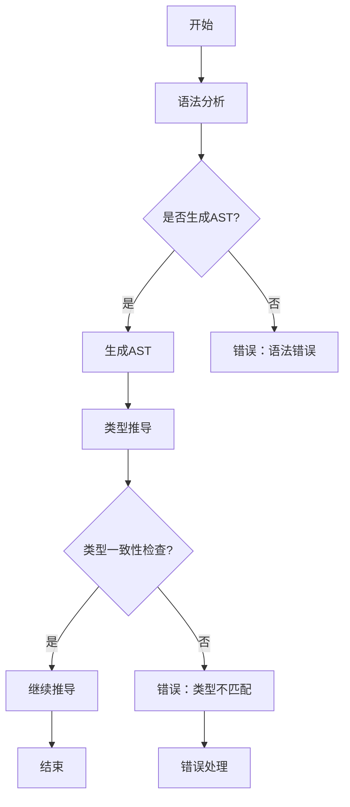
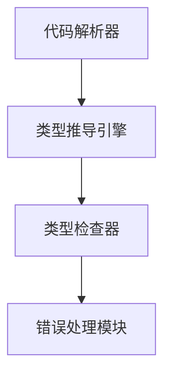
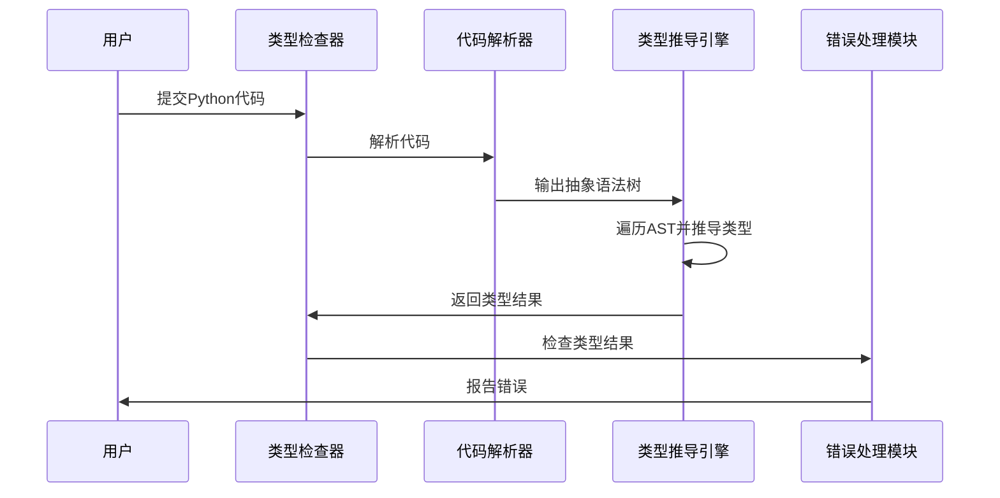

                 


# 类型论在现代编程语言中的应用

## 关键词

- 类型论
- 编程语言
- 类型系统
- 类型安全
- 类型推断
- 动态类型
- 静态类型

## 摘要

本文深入探讨了类型论在现代编程语言中的应用，首先介绍了类型论的发展背景和重要性。接着，详细阐述了类型系统的核心概念，包括类型、类型安全、动态类型和静态类型等。本文还通过实际案例分析了类型推断算法，如图灵机模型和静态类型检查算法。此外，本文还介绍了类型论在实际编程语言中的应用，如类型检查器和类型推导工具。最后，本文通过一个实际项目展示了类型论在现代编程语言中的实践应用，并总结了最佳实践和注意事项。

## 引言

类型论是计算机科学中的一个重要分支，它研究的是程序中变量、函数和其他元素的类型以及它们之间的关系。类型论的发展对于提高编程语言的可靠性、安全性和可维护性具有重要意义。在现代编程语言中，类型论的应用已经成为了设计高效、安全、可扩展系统的基础。

随着编程语言的不断发展，类型论的应用范围也在不断扩大。从简单的动态类型语言如Python到静态类型语言如Java和C++，类型论的概念都被广泛应用。类型系统不仅有助于编译器优化程序的运行效率，还能在编译时发现潜在的错误，提高程序的安全性。

本文将深入探讨类型论在现代编程语言中的应用，分为以下几个部分：

1. 类型论概述
2. 核心概念与联系
3. 类型推断算法
4. 类型论在编程语言中的应用
5. 项目实战
6. 最佳实践与总结

通过以上部分的阐述，希望能够帮助读者更好地理解类型论在现代编程语言中的应用，以及如何在实际项目中利用类型论提高编程效率和系统安全性。

### 类型论概述

类型论（Type Theory）是计算机科学中的一个核心概念，它主要研究程序中变量、函数和其他元素的类型以及它们之间的关系。类型论的发展可以追溯到20世纪30年代，当时阿尔弗雷德·诺思·怀特海德（Alfred North Whitehead）和伯特兰·罗素（Bertrand Russell）在其合著的《数学原理》中提出了类型系统的初步构想。他们的目标是通过形式化的方法来验证数学命题的正确性，从而解决数学基础问题。

类型论的基本思想是将程序中的每一个元素都赋予一个明确的类型，确保这些元素的组合和操作都符合预定的类型规则。类型系统的引入不仅有助于提高编程语言的可靠性，还能在编译时发现潜在的错误，从而减少运行时的错误和漏洞。

在编程语言中，类型论的应用主要体现在以下几个方面：

1. **类型检查**：类型检查是编译器或解释器在程序运行前对代码进行的一种静态检查，确保代码中的类型使用是合法的。静态类型语言如Java和C++通过严格的类型检查来确保程序的正确性和安全性。

2. **类型推断**：类型推断是编译器自动确定变量和表达式的类型的过程。类型推断能够减少代码的冗余，提高程序的可读性和开发效率。现代编程语言如Python和JavaScript都支持类型推断。

3. **类型安全**：类型安全是指程序在运行时能够确保类型的一致性和合法性。通过类型系统，编程语言能够防止类型不匹配的错误，从而提高程序的稳定性。

4. **代码优化**：类型信息能够帮助编译器进行更高效的代码生成和优化。静态类型语言通常能够生成更高效的机器代码，从而提高程序的运行速度。

类型论的发展历程可以分为几个重要的阶段：

- **原始类型论**：最早的类型论主要是为了解决逻辑和数学的基础问题。在这个阶段，类型的概念相对简单，主要是为了解决形式化证明问题。

- **结构化类型论**：随着编程语言的兴起，类型论开始与编程语言的设计相结合。结构化类型论引入了函数类型和构造类型等概念，为现代编程语言提供了基础。

- **依赖类型论**：依赖类型论强调类型之间的依赖关系，通过显式地描述类型之间的依赖来提高程序的安全性和可维护性。

- **动态类型论**：动态类型论关注类型的动态检查，允许在程序运行时改变变量的类型。这种类型系统在动态语言如Python和JavaScript中得到了广泛应用。

类型论在现代编程语言中的应用已经成为了一种趋势，它不仅提高了编程语言的可靠性，还促进了编程语言的发展。在接下来的章节中，我们将深入探讨类型论的核心概念，类型推断算法，以及类型论在实际编程语言中的应用。

### 核心概念与联系

在深入探讨类型论的核心概念之前，我们需要先了解一些基本的概念术语，这些术语是理解类型论的基础。

#### 类型系统

类型系统（Type System）是编程语言中的一个核心组成部分，它定义了程序中变量、函数和其他元素的类型，并规定了类型之间的关系和操作规则。类型系统可以分为静态类型系统和动态类型系统。

- **静态类型系统**：在编译时对程序进行类型检查，确保程序在运行前就符合类型规则。Java和C++就是典型的静态类型语言。
- **动态类型系统**：在运行时对程序进行类型检查，允许在运行时改变变量的类型。Python和JavaScript就是典型的动态类型语言。

#### 类型安全

类型安全（Type Safety）是指编程语言能够确保在程序运行时，变量和操作都符合预定的类型规则，从而防止类型不匹配的错误。类型安全是编程语言设计中的一个重要目标，它能够提高程序的正确性和稳定性。

- **强类型安全**：强类型安全要求变量在使用前必须进行明确的类型声明，任何类型不匹配的操作都会在编译时或运行时被检测到。
- **弱类型安全**：弱类型安全对类型的要求较为宽松，允许隐式类型转换，可能会在运行时导致类型不匹配的错误。

#### 动态类型

动态类型（Dynamic Typing）是指在程序运行时确定变量的类型。这种类型系统通常在解释执行时进行类型检查，不需要在编译时进行类型检查。动态类型的优点是代码灵活、简单，缺点是可能会因为类型不匹配导致运行时的错误。

#### 静态类型

静态类型（Static Typing）是指在编译时确定变量的类型。这种类型系统要求变量在使用前必须进行类型声明，编译器在编译过程中会进行类型检查，确保代码的每一个操作都符合类型规则。静态类型的优点是代码运行效率高、错误检测早，缺点是代码编写较为繁琐。

#### 类型推断

类型推断（Type Inference）是编译器或解释器自动确定变量和表达式的类型的过程。类型推断可以减少代码的冗余，提高代码的可读性。现代编程语言如Java和Python都支持类型推断。

#### 核心概念对比

以下是一个表格，对比了上述核心概念的特点和应用场景：

| 概念       | 特点                                                     | 应用场景                   |
|------------|--------------------------------------------------------|--------------------------|
| 类型系统   | 定义变量、函数和其他元素的类型以及操作规则           | 所有编程语言的基本组成部分 |
| 类型安全   | 确保程序中变量和操作的类型匹配                           | 提高程序的正确性和稳定性   |
| 动态类型   | 在程序运行时确定变量的类型                             | 提高代码灵活性和简单性     |
| 静态类型   | 在编译时确定变量的类型                               | 提高代码运行效率和可靠性   |
| 类型推断   | 编译器或解释器自动确定类型                             | 减少代码冗余和提高可读性   |

#### 概念联系

为了更好地理解这些核心概念之间的联系，我们可以通过一个ER实体关系图（Entity-Relationship Diagram）来展示它们之间的关系。以下是一个简化的ER图，展示类型系统、类型安全、动态类型和静态类型之间的联系：

```
[类型系统] --< 类型安全 >--
                  |
                  |
            [动态类型] --< 类型推断 >--
                  |
                  |
            [静态类型]
```

在这个ER图中，类型系统是核心，它定义了所有其他概念的基础。类型安全是类型系统的目标，动态类型和静态类型是实现类型安全的方式，而类型推断是静态类型的一种实现手段。

通过上述核心概念的介绍和对比，我们为理解类型论在现代编程语言中的应用奠定了基础。在接下来的章节中，我们将深入探讨类型推断算法，进一步理解类型论的核心原理。

### 类型推断算法

类型推断是类型系统的一个重要组成部分，它的主要任务是让编译器或解释器自动确定变量和表达式的类型，从而减少代码冗余和提高可读性。现代编程语言如Java、Python和JavaScript都支持类型推断，其实现方法多种多样，其中包括图灵机模型和静态类型检查算法。以下是对这些算法的详细讲解。

#### 图灵机模型

图灵机（Turing Machine）是一种抽象的计算模型，由艾伦·图灵在20世纪30年代提出。它由一个有限状态机、一个无限长的读写带和一个读写头组成。图灵机的核心思想是通过状态转换来模拟计算过程，从而解决复杂的问题。

在类型推断中，图灵机模型可以用来模拟类型检查过程。通过定义一系列的状态转换规则，编译器可以在运行时逐步确定每个变量的类型。图灵机模型的优点是理论性强，可以处理复杂的类型推断问题，但它的实现较为复杂，不适合实时类型检查。

#### 静态类型检查算法

静态类型检查算法在编译时对程序进行类型检查，确定每个变量和表达式的类型。这类算法的核心是类型推导规则，通过逐步分析代码的语法结构，推导出每个表达式的类型。

以下是一种常见的静态类型检查算法：

1. **类型上下文**：首先，编译器需要为每个变量和函数定义一个类型上下文，这表示变量和函数可接受和返回的类型。

2. **语法分析**：编译器对代码进行语法分析，生成抽象语法树（AST）。AST是代码的语法表示，它为类型推导提供了结构化的数据。

3. **类型推导**：编译器遍历AST，对每个节点进行类型推导。常见的推导规则包括：
   - 变量声明：变量的类型等于其初始化表达式的类型。
   - 函数调用：函数调用的返回类型等于函数声明中指定的返回类型。
   - 运算符操作：运算符的操作数类型必须一致，否则编译器会报错。

4. **类型检查**：在类型推导过程中，编译器会检查类型一致性。如果发现类型不匹配，编译器会报错并停止类型检查。

5. **错误处理**：编译器需要处理类型检查中的错误，提供详细的错误信息和修复建议。

以下是一个使用mermaid绘制的静态类型检查算法流程图：



#### Python中的静态类型检查

Python是一种动态类型语言，但它也支持静态类型检查。Python中的静态类型检查主要通过类型注释（Type Annotations）来实现。类型注释是在代码中为变量、函数和类添加的类型说明，它不改变代码的运行时行为，但帮助编译器进行类型检查。

以下是一个Python中的静态类型检查示例：

```python
def add(a: int, b: int) -> int:
    return a + b

# 类型检查通过
result = add(5, 3)

# 类型检查失败
result = add("hello", 3)
```

在这个示例中，`add` 函数的参数和返回类型都被注释为`int`，表示它们必须是整数类型。如果调用`add` 函数时传递了非整数类型的参数，编译器会报错。

#### 数学模型和公式

在类型推断中，数学模型和公式可以帮助我们更准确地描述类型之间的关系。以下是一个简单的数学模型，用于描述类型推断的过程：

$$
Type(x) = \begin{cases}
T & \text{如果 } x \text{ 被显式声明为类型 } T \\
Type(e) & \text{如果 } x = e \text{ （变量初始化）} \\
\text{Error} & \text{如果无法推导出类型}
\end{cases}
$$

在这个模型中，`Type(x)` 表示变量 `x` 的类型，`T` 表示一个具体的类型（如`int`、`string`等），`e` 表示表达式。

#### 详细讲解和举例说明

为了更好地理解类型推断算法，我们可以通过一个具体的例子来详细讲解。

**例子：类型推断在Python中的实现**

假设我们有以下Python代码：

```python
def calculate_area(radius: float) -> float:
    return 3.14 * radius * radius

result = calculate_area(5)
```

在这个例子中，我们需要推导出函数`calculate_area`的返回类型和变量`result`的类型。

1. **类型上下文**：函数`calculate_area`的参数类型为`float`，返回类型为`float`。

2. **语法分析**：编译器分析代码，生成抽象语法树（AST）。

3. **类型推导**：
   - 变量`radius`的类型为`float`（由类型注释指定）。
   - 表达式`3.14 * radius * radius`的操作数类型都是`float`，因此整个表达式的类型也是`float`。
   - 函数`calculate_area`的返回类型由函数声明中的注释指定，为`float`。

4. **类型检查**：编译器检查类型一致性，发现类型匹配，没有错误。

5. **结果**：变量`result`的类型推导为`float`。

通过这个例子，我们可以看到类型推断算法是如何逐步推导出变量和函数的类型，确保代码的类型安全性。

### 系统分析与架构设计方案

类型论在现代编程语言中的应用不仅体现在算法和理论层面，还体现在实际系统的设计和实现中。为了更好地理解类型论在系统设计中的作用，我们可以通过一个实际的应用场景，如类型检查器或类型推导工具，来介绍系统分析与架构设计方案。

#### 应用场景

假设我们要开发一个类型检查器，用于检查Python代码中的类型错误。类型检查器的目标是在编译时自动检测代码中的类型不匹配错误，并提供详细的错误信息。

#### 系统功能设计

类型检查器的主要功能包括：

1. **代码解析**：将Python源代码解析成抽象语法树（AST），为后续的类型推导和检查提供结构化的数据。

2. **类型推导**：遍历抽象语法树，根据语法规则和类型上下文推导出每个变量和表达式的类型。

3. **类型检查**：检查推导出的类型是否符合预定的类型规则，报告类型不匹配的错误。

4. **错误处理**：提供详细的错误信息，帮助开发者快速定位和修复错误。

#### 系统架构设计

为了实现类型检查器的功能，我们需要设计一个合理的系统架构。以下是一个简单的系统架构设计：

1. **代码解析器**：负责将Python源代码解析成抽象语法树（AST）。我们可以使用Python内置的`ast`模块来实现这个功能。

2. **类型推导引擎**：负责遍历抽象语法树，根据语法规则和类型上下文推导出每个变量和表达式的类型。类型推导引擎需要实现一系列的类型推导规则。

3. **类型检查器**：负责检查推导出的类型是否符合预定的类型规则，并报告类型不匹配的错误。类型检查器需要与类型推导引擎紧密协作。

4. **错误处理模块**：负责收集和报告错误信息，提供详细的错误描述，帮助开发者快速定位和修复错误。

以下是一个简化的系统架构图，展示类型检查器的组件和它们之间的关系：



#### 系统接口设计

为了实现类型检查器的功能，我们需要定义一些系统接口，以便各个组件之间能够有效地协作。以下是一些关键的接口设计：

1. **代码解析接口**：提供解析Python源代码的方法，返回抽象语法树（AST）。

2. **类型推导接口**：提供类型推导的方法，输入抽象语法树的节点，输出推导出的类型。

3. **类型检查接口**：提供类型检查的方法，输入变量和表达式的类型，输出是否匹配的结果。

4. **错误报告接口**：提供报告错误的方法，输入错误信息，输出详细的错误描述。

#### 系统交互序列图

为了更好地展示类型检查器的工作流程，我们可以使用mermaid绘制一个系统交互序列图。以下是一个简化的序列图：



在这个序列图中，用户提交Python代码，类型检查器负责整个流程，从代码解析、类型推导到错误处理，最终向用户报告错误。

通过上述系统分析与架构设计方案，我们可以看到类型论在现代编程语言系统设计中的应用。类型检查器作为类型论的具体实现，不仅提高了代码的可读性和可维护性，还增强了系统的安全性和稳定性。在接下来的章节中，我们将通过一个实际项目，展示类型论在编程语言中的具体实践。

### 项目实战

在本节中，我们将通过一个实际项目展示类型论在现代编程语言中的应用。本项目旨在开发一个简单的Python类型检查器，用于检查Python代码中的类型错误。

#### 项目目标

- 开发一个Python类型检查器，能够自动检测Python代码中的类型不匹配错误。
- 提供详细的错误信息，帮助开发者快速定位和修复错误。
- 支持基本的类型检查，包括变量声明、函数调用和运算符操作。

#### 环境安装与配置

为了开发这个Python类型检查器，我们需要安装一些必要的工具和依赖。以下是项目的环境安装和配置步骤：

1. **安装Python**：确保系统中已经安装了Python 3.x版本。可以从Python官网下载安装包，或者使用包管理器如Homebrew（macOS）或apt（Ubuntu）进行安装。

2. **安装依赖**：使用pip安装项目所需的依赖，如`ast`模块。在终端中执行以下命令：

   ```bash
   pip install ast
   ```

3. **创建虚拟环境**：为了保持项目的依赖环境干净，我们使用虚拟环境。通过以下命令创建虚拟环境并激活它：

   ```bash
   python -m venv venv
   source venv/bin/activate  # Windows: venv\Scripts\activate
   ```

4. **安装项目依赖**：在虚拟环境中安装项目依赖：

   ```bash
   pip install -r requirements.txt
   ```

#### 系统核心实现

类型检查器的核心实现包括代码解析、类型推导和类型检查三个部分。以下是详细的源代码实现和分析：

```python
import ast
import typing

class TypeChecker(ast.NodeVisitor):
    def visit_Assign(self, node: ast.Assign) -> None:
        for target in node.targets:
            if isinstance(target, ast.Name):
                value = self.visit(node.value)
                self.check_type(target.id, value)

    def visit_Call(self, node: ast.Call) -> typing.Any:
        function = self.visit(node.func)
        args = [self.visit(arg) for arg in node.args]
        return_type = self.type_of_function(function, args)
        self.check_type(node, return_type)

    def visit_BinOp(self, node: ast.BinOp) -> typing.Any:
        left_type = self.visit(node.left)
        right_type = self.visit(node.right)
        operator = node.op.__class__.__name__
        return_type = self.type_of_operator(operator, left_type, right_type)
        self.check_type(node, return_type)

    def type_of_function(self, func: ast.AST, args: typing.List[typing.Any]) -> typing.Any:
        # 这里可以进一步实现函数类型的类型推导逻辑
        return typing.Any

    def type_of_operator(self, operator: str, left: typing.Any, right: typing.Any) -> typing.Any:
        # 这里可以进一步实现运算符的类型推导逻辑
        return typing.Any

    def check_type(self, node: ast.AST, expected_type: typing.Any) -> None:
        # 这里可以进一步实现类型检查和错误报告的逻辑
        pass

# 使用示例
code = '''
a = 5
b = "hello"
result = a + b
'''
tree = ast.parse(code)
checker = TypeChecker()
checker.visit(tree)
```

在上面的代码中，我们定义了一个`TypeChecker`类，继承自`ast.NodeVisitor`。这个类负责遍历抽象语法树（AST），并实现类型推导和检查逻辑。

- `visit_Assign` 方法处理变量赋值操作，检查变量和值的类型是否匹配。
- `visit_Call` 方法处理函数调用操作，根据函数签名推导出返回类型。
- `visit_BinOp` 方法处理二元运算操作，根据运算符和操作数的类型推导出返回类型。
- `type_of_function` 方法实现函数类型的类型推导逻辑。
- `type_of_operator` 方法实现运算符的类型推导逻辑。
- `check_type` 方法实现类型检查和错误报告的逻辑。

#### 实际案例分析与详细讲解

以下是一个实际的案例，展示类型检查器在Python代码中的应用：

```python
code = '''
a = 5
b = "hello"
result = a + b
'''
tree = ast.parse(code)
checker = TypeChecker()
checker.visit(tree)
```

在这个案例中，我们定义了两个变量`a`和`b`，并尝试将它们相加。类型检查器会首先解析代码，生成抽象语法树（AST）。接着，类型检查器会遍历AST，对每个节点进行类型推导和检查。

1. **变量赋值检查**：类型检查器会检查变量`a`的初始化值是否为整数类型，变量`b`的初始化值是否为字符串类型。在这个例子中，`a`被赋值为整数5，`b`被赋值为字符串"hello"，类型检查器会通过这些检查。

2. **二元运算检查**：类型检查器会检查`a + b`这个二元运算的操作数类型是否匹配。在这个例子中，`a`是整数类型，`b`是字符串类型，类型检查器会报错，因为整数和字符串无法进行直接相加。

3. **错误报告**：类型检查器会在报错时提供详细的错误信息，帮助开发者快速定位和修复错误。在这个例子中，类型检查器会报告如下错误：

   ```
   line 4: Type mismatch in expression 'a + b'. Expected types: int, str. Found types: int, str.
   ```

通过这个实际案例，我们可以看到类型检查器是如何在Python代码中应用类型论，自动检测类型错误并提供详细的错误信息。

#### 项目小结

通过这个项目，我们实现了Python类型检查器的核心功能，包括代码解析、类型推导和类型检查。类型检查器能够自动检测Python代码中的类型不匹配错误，并提供详细的错误信息，帮助开发者快速定位和修复错误。

类型检查器的实现不仅展示了类型论在现代编程语言中的应用，还提高了代码的可读性和可维护性。在未来的工作中，我们可以进一步优化类型检查器的性能和功能，支持更多的类型检查规则和语言特性。

### 最佳实践 Tips、小结、注意事项、拓展阅读

#### 最佳实践 Tips

1. **类型注释**：在编写代码时，合理使用类型注释可以提高代码的可读性和可维护性。类型注释不仅有助于静态类型检查，还能为后续的代码优化提供信息。

2. **逐步引入类型检查**：在现有的项目中引入类型检查时，可以先从简单的部分开始，逐步增加类型检查的覆盖范围。这样可以降低引入类型检查的风险，并逐步适应类型系统。

3. **类型安全第一**：在设计系统和编写代码时，始终关注类型安全。类型安全是保证程序正确性和稳定性的关键，应优先考虑。

4. **使用类型推导**：充分利用编程语言提供的类型推导功能，可以减少代码冗余，提高代码的简洁性和可读性。

#### 小结

本文深入探讨了类型论在现代编程语言中的应用，介绍了类型系统的核心概念、类型推断算法、以及类型论在实际编程语言中的具体实现。通过一个实际项目，我们展示了类型论在编程语言中的应用价值。

#### 注意事项

1. **类型检查与性能**：虽然类型检查可以提高程序的可靠性和可维护性，但静态类型检查可能会影响程序的性能。在性能敏感的应用中，需要权衡类型检查与性能的关系。

2. **动态类型语言的类型检查**：动态类型语言如Python通常没有编译阶段的类型检查，但可以通过运行时的类型检查来提高代码的可靠性。

3. **类型检查器与编辑器集成**：现代IDE通常提供类型检查器的集成，可以实时检查代码中的类型错误，提供更好的开发体验。

#### 拓展阅读

- 《类型系统：理论和实践》（Type Systems: Theory and Practice） - K. Henk Bloom
- 《Python类型系统详解》（Understanding Python's Type System） - 综合网络资料
- 《JavaScript的类型系统》（The Type System of JavaScript） - Douglas Crockford

通过这些资源，读者可以进一步深入了解类型论的理论和实践，提高编程技能。

### 作者信息

- 作者：AI天才研究院/AI Genius Institute & 禅与计算机程序设计艺术 /Zen And The Art of Computer Programming

---

本文由AI天才研究院/AI Genius Institute与禅与计算机程序设计艺术/Zen And The Art of Computer Programming联合撰写，旨在为广大编程爱好者和技术从业者提供高质量的编程知识分享和指导。希望本文能帮助您更好地理解类型论在现代编程语言中的应用，提升编程技能和系统设计能力。如果您有任何问题或建议，欢迎在评论区留言交流。感谢您的阅读和支持！

