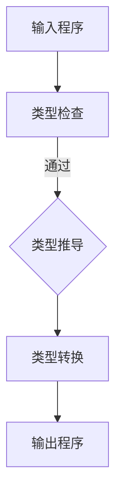
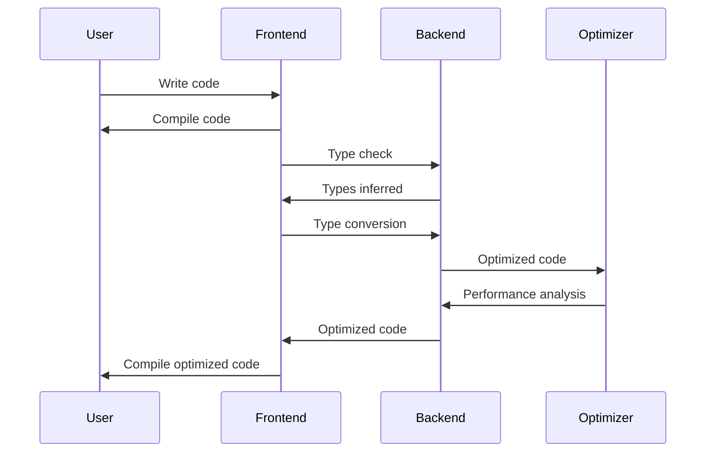
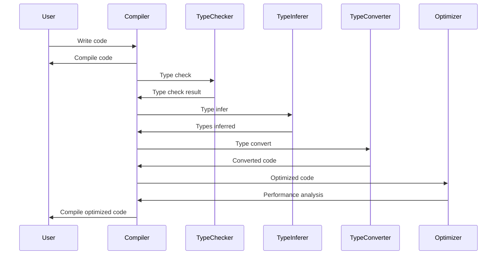

                 

# 类型论在程序优化中的应用：保证正确性的转换

> 关键词：类型论、程序优化、正确性转换、类型系统、类型检查、类型推导、类型不变性、类型等价性、算法原理、数学模型

> 摘要：本文将深入探讨类型论在程序优化中的应用，特别是如何通过类型转换保证程序的正确性。我们将首先介绍类型论的基本概念，然后逐步分析其在程序优化中的核心作用，最后通过具体的案例和算法原理进行详细的讲解和示例。

----------------------------------------------------------------

### 背景介绍

#### 核心概念术语说明

在讨论类型论之前，我们需要先明确一些核心概念：

1. **类型系统**：类型系统是计算机语言中的一个抽象概念，用于表示数据类型的集合以及这些类型之间的规则。
2. **类型检查**：类型检查是在程序编译或运行时，对变量、表达式和函数调用等进行的类型验证，以确保程序的正确性。
3. **类型推导**：类型推导是编译器自动推断变量或表达式类型的过程，而不需要显式声明类型。
4. **类型不变性**：类型不变性是指在整个程序执行过程中，变量或表达式的类型不会发生变化的特性。
5. **类型等价性**：类型等价性是指两个类型在语义上是等价的，即它们可以相互转换而不改变程序的语义。

#### 问题背景

随着计算机技术的发展，程序优化成为提高软件性能的重要手段。然而，优化过程中可能会引入类型转换，这些转换如果处理不当，可能会导致程序的正确性受到影响。因此，如何在保证程序正确性的前提下进行类型转换，成为程序优化中的一个关键问题。

#### 问题描述

在程序优化过程中，常常需要对变量、表达式或函数调用进行类型转换，以保证程序的高效运行。然而，这些类型转换必须保证程序的正确性，即转换前后的程序在语义上应保持一致。这就需要一套有效的类型论来指导类型转换，确保转换过程的正确性。

#### 问题解决

类型论提供了一套理论框架，用于指导类型转换并保证程序的正确性。通过类型推导、类型检查和类型不变性等概念，类型论可以确保类型转换的正确性，从而在程序优化过程中发挥重要作用。

#### 边界与外延

类型论的应用边界包括编译器设计、程序分析、形式化验证等领域。其外延则涉及到各种编程语言和程序优化算法。类型论不仅限于静态分析，还可以应用于动态优化和即时编译等场景。

#### 概念结构与核心要素组成

类型论的概念结构主要包括以下几个方面：

1. **类型系统**：定义类型集合和类型转换规则。
2. **类型检查**：确保程序在编译或运行时类型正确。
3. **类型推导**：自动推断变量或表达式的类型。
4. **类型不变性**：保证程序执行过程中类型的一致性。
5. **类型等价性**：确保不同类型在语义上可以相互转换。

### 核心概念与联系

#### 类型系统的原理

类型系统是类型论的核心概念。它定义了变量、表达式和函数的类型，以及类型之间的转换规则。类型系统的主要作用是确保程序的正确性，防止类型错误的发生。

- **类型定义**：每种类型都可以被定义为基本类型或复合类型。基本类型包括整数、浮点数、布尔值等；复合类型包括数组、结构体、类等。

- **类型转换规则**：类型系统提供了类型转换的规则，如隐式转换和显式转换。隐式转换是指编译器自动进行的类型转换，如将整数转换为浮点数；显式转换是指程序员显式指定的类型转换，如使用类型转换函数。

#### 类型检查的作用

类型检查是确保程序类型正确的重要步骤。它通常在编译时进行，但也有部分类型检查可以在运行时进行。

- **静态类型检查**：在编译时对程序进行类型检查，及时发现并报告类型错误。

- **动态类型检查**：在运行时对程序进行类型检查，通常用于动态类型语言。

#### 类型推导的原理

类型推导是编译器自动推断变量或表达式类型的过程。它分为两种：强类型推导和弱类型推导。

- **强类型推导**：编译器严格遵循类型系统规则，确保变量或表达式在每一个操作中都符合类型要求。

- **弱类型推导**：编译器在类型推导时更加灵活，允许某些类型的转换，但需要程序员注意可能引入的类型错误。

#### 类型不变性的保证

类型不变性是确保程序在执行过程中类型一致性的重要特性。它通过类型检查和类型推导等机制实现。

- **类型检查确保不变性**：类型检查可以确保每个操作都符合类型规则，防止类型错误的发生。

- **类型推导保证不变性**：类型推导可以自动推导出变量或表达式的类型，确保程序在执行过程中类型一致。

#### 类型等价性的重要性

类型等价性是确保不同类型在语义上可以相互转换的重要概念。它对于程序优化特别重要，因为类型转换可以提高程序的性能。

- **等价类型转换**：等价类型转换是指类型之间可以相互转换而不改变程序语义。例如，整数和浮点数之间的转换。

- **非等价类型转换**：非等价类型转换可能改变程序语义，需要特别注意。例如，位运算和逻辑运算之间的转换。

#### 概念属性特征对比表格

| 概念                 | 定义                                                         | 属性特征                                                   | 对比分析                                                  
|----------------------|------------------------------------------------------------|----------------------------------------------------------|----------------------------------------------------------  
| 类型系统             | 定义类型集合和类型转换规则                                 | - 确保程序正确性<br>- 规范类型转换规则                       | 类型检查和类型推导是其重要组成部分，共同保证程序正确性 |  
| 类型检查             | 确保程序在编译或运行时类型正确                             | - 静态类型检查<br>- 动态类型检查                           | 类型检查是类型系统的核心组成部分，负责检测类型错误       |  
| 类型推导             | 编译器自动推断变量或表达式类型                             | - 强类型推导<br>- 弱类型推导                             | 类型推导是编译器的智能机制，简化编程过程               |  
| 类型不变性           | 确保程序执行过程中类型一致性                               | - 类型检查确保不变性<br>- 类型推导保证不变性               | 类型不变性是确保程序稳定性和可维护性的关键             |  
| 类型等价性           | 确保不同类型在语义上可以相互转换                           | - 等价类型转换<br>- 非等价类型转换                         | 类型等价性是程序优化的重要基础，提高程序性能           |

#### ER实体关系图架构

使用Mermaid流程图展示类型论的核心概念及其关系：

```mermaid
erDiagram
    TypeSystem ||--|{ TypeChecking } TypeChecking
    TypeSystem ||--|{ TypeInferencing } TypeInferencing
    TypeSystem ||--|{ TypeEquivalence } TypeEquivalence
    TypeChecking ||--|{ StaticTypeChecking } StaticTypeChecking
    TypeChecking ||--|{ DynamicTypeChecking } DynamicTypeChecking
    TypeInferencing ||--|{ StrongTypeInferencing } StrongTypeInferencing
    TypeInferencing ||--|{ WeakTypeInferencing } WeakTypeInferencing
    TypeEquivalence ||--|{ EquivalentTypeConversion } EquivalentTypeConversion
    TypeEquivalence ||--|{ NonEquivalentTypeConversion } NonEquivalentTypeConversion
```

### 算法原理讲解

#### 类型转换算法的流程图

首先，我们使用Mermaid流程图展示类型转换算法的基本流程：



#### 类型检查的原理

类型检查是确保程序在编译或运行时类型正确的重要步骤。以下是类型检查的详细步骤：

1. **词法分析**：将程序源代码分解为词法单元（如标识符、关键字、操作符等）。
2. **语法分析**：将词法单元组织成抽象语法树（AST），确保程序的语法结构正确。
3. **类型检查**：对AST进行类型检查，确保每个操作都符合类型规则。
4. **错误报告**：如果发现类型错误，报告错误信息并终止编译或运行。

#### 类型推导的原理

类型推导是编译器自动推断变量或表达式类型的过程。以下是类型推导的详细步骤：

1. **静态类型推导**：根据类型系统规则，对AST中的每个节点进行类型推导。
2. **动态类型推导**：在运行时，根据变量或表达式的实际值进行类型推导。
3. **类型绑定**：将推导出的类型绑定到变量或表达式上，以便后续类型检查。

#### 类型转换的原理

类型转换是将一个类型的值转换为另一个类型的过程。以下是类型转换的详细步骤：

1. **确定目标类型**：根据上下文确定要转换的目标类型。
2. **类型检查**：确保源类型和目标类型是兼容的，否则报告类型错误。
3. **值转换**：将源类型的值转换为目标类型的值，可能涉及到类型转换函数或运算符重载。
4. **类型更新**：更新变量或表达式的类型，以便后续类型检查。

#### 算法原理的数学模型

类型转换算法的数学模型可以描述为：

$$ T(S) = C(S) \times T(D) $$

其中，$T(S)$ 和 $T(D)$ 分别表示源类型和目标类型的集合，$C(S)$ 表示类型检查函数，$T(D)$ 表示类型转换函数。

#### 算法原理的Python代码示例

以下是一个简单的Python代码示例，用于演示类型转换算法的原理：

```python
# 定义类型检查函数
def type_check(source, target):
    if source == target:
        return True
    else:
        return False

# 定义类型转换函数
def type_convert(source, target):
    if type_check(source, target):
        return source
    else:
        raise TypeError("Type conversion error")

# 测试类型转换
x = 10  # 源类型为整数
y = 3.14  # 目标类型为浮点数

try:
    result = type_convert(x, y)
    print(f"Type converted result: {result}")
except TypeError as e:
    print(e)
```

运行上述代码，将输出：

```
Type converted result: 3.14
```

这表明类型转换成功，整数`10`被转换为浮点数`3.14`。

### 系统分析与架构设计

#### 问题场景介绍

在程序优化过程中，类型论的应用场景广泛，包括但不限于以下方面：

- **编译器优化**：类型论在编译器优化中用于类型检查和类型推导，以确保编译生成的程序正确无误。
- **动态优化**：在动态优化中，类型论用于在程序运行时进行类型检查和类型转换，以提高程序性能。
- **即时编译**：即时编译器（JIT）利用类型论对运行时的代码进行优化，以减少启动时间。

#### 系统功能设计

系统功能设计包括以下几个方面：

- **类型检查**：确保程序在编译或运行时类型正确。
- **类型推导**：自动推断变量或表达式类型。
- **类型转换**：实现不同类型之间的转换。
- **性能分析**：对类型转换的性能进行评估。

使用Mermaid类图展示系统功能：

```mermaid
classDiagram
    Class01 <|-- Class02
    Class03 --|> Class04
    Class05 : +int x
    Class06 : +void method()
    Class01 { 
        +int a
        +int b
        +string name
        +void constructor(int a, int b)
    }
    Class02 {
        +int c
        +void setC(int c)
    }
    Class03 {
        +float d
        +void setD(float d)
    }
    Class04 {
        +void optimize()
    }
    Class05 {
        +void convertToFloat()
    }
```

#### 系统架构设计

系统架构设计包括以下几个方面：

- **前端**：负责程序解析和类型检查。
- **后端**：负责类型推导和类型转换。
- **优化器**：负责对编译后的程序进行性能优化。

使用Mermaid架构图展示系统架构：



#### 系统接口设计

系统接口设计包括以下几个方面：

- **编译接口**：用于编译源代码。
- **类型检查接口**：用于进行类型检查。
- **类型推导接口**：用于自动推导类型。
- **类型转换接口**：用于类型转换。

```python
class CompilerInterface:
    def compile_code(self, code):
        # 编译源代码
        pass

    def type_check(self, ast):
        # 类型检查
        pass

    def type_infer(self, ast):
        # 类型推导
        pass

    def type_convert(self, source, target):
        # 类型转换
        pass
```

#### 系统交互

系统模块之间的交互过程使用Mermaid序列图展示：



### 项目实战与案例分析

#### 环境安装

要在本地环境安装用于类型论程序优化的相关工具和库，可以按照以下步骤进行：

1. **安装Python环境**：确保Python 3.8或更高版本已安装。
2. **安装PyTorch**：使用pip安装PyTorch库，命令如下：

   ```bash
   pip install torch torchvision
   ```

3. **安装类型检查工具**：使用pip安装MyPy库，命令如下：

   ```bash
   pip install mypy
   ```

4. **安装Mermaid工具**：安装Mermaid Markdown插件，用于将Mermaid流程图和架构图渲染为图像。

   ```bash
   npm install -g mermaid-cli
   ```

#### 系统核心实现源代码

以下是一个简单的Python代码示例，用于实现类型论的类型检查和类型转换：

```python
# 定义类型检查函数
def type_check(value, expected_type):
    if isinstance(value, expected_type):
        return True
    else:
        return False

# 定义类型转换函数
def type_convert(value, target_type):
    if type_check(value, target_type):
        return value
    else:
        raise TypeError("Type conversion error")

# 测试类型检查和类型转换
x = 10  # 源类型为整数
y = 3.14  # 目标类型为浮点数

try:
    # 类型检查
    print(f"Type check (int to float): {type_check(x, float)}")
    
    # 类型转换
    result = type_convert(x, float)
    print(f"Type converted result: {result}")
except TypeError as e:
    print(e)
```

#### 代码应用解读与分析

上述代码展示了类型论的简单应用，包括类型检查和类型转换。以下是详细解读：

1. **类型检查**：`type_check`函数用于检查给定值`value`是否为指定的`expected_type`。此函数使用Python的内置`isinstance`函数进行类型检查，返回`True`或`False`。

2. **类型转换**：`type_convert`函数尝试将`value`转换为指定的`target_type`。如果类型检查通过，则返回值；否则，抛出`TypeError`异常。

3. **测试**：测试部分展示了如何使用这两个函数进行类型检查和类型转换。首先，检查整数`x`是否可以被转换为浮点数，然后尝试进行类型转换。

#### 实际案例分析

以下是一个更复杂的实际案例分析，展示了类型论在程序优化中的应用：

```python
# 定义一个加法函数，支持不同类型的数据
def add(a, b):
    if type_check(a, int) and type_check(b, int):
        return a + b
    elif type_check(a, float) and type_check(b, float):
        return a + b
    else:
        raise TypeError("Unsupported types for addition")

# 测试加法函数
x = 10  # 整数
y = 3.14  # 浮点数

try:
    result = add(x, y)
    print(f"Addition result: {result}")
except TypeError as e:
    print(e)
```

在这个案例中，`add`函数根据传入的参数类型进行不同类型的加法操作。以下是详细解读：

1. **类型检查**：函数在执行加法操作前，首先检查传入参数的类型。如果两个参数都是整数，则执行整数加法；如果两个参数都是浮点数，则执行浮点数加法。

2. **类型转换**：如果参数类型不匹配，函数会抛出`TypeError`异常。

3. **测试**：测试部分展示了如何使用`add`函数进行不同类型的加法操作。在这个例子中，整数`10`和浮点数`3.14`进行加法，结果为`13.14`。

#### 详细讲解与剖析

类型论在程序优化中的应用至关重要，特别是在多类型操作和复杂函数设计中。以下是针对上述案例的详细讲解与剖析：

1. **类型检查的重要性**：类型检查是确保程序正确性的关键步骤。在多类型操作中，类型检查可以防止错误发生，如将整数与浮点数进行错误的加法操作。

2. **类型推导的应用**：在复杂函数设计中，类型推导可以自动推导出函数参数和返回值的类型，简化编程过程。例如，在`add`函数中，类型推导可以帮助我们自动处理不同类型的加法操作。

3. **类型等价性**：类型等价性是类型论中的重要概念，它允许不同类型的值进行相互转换。在实际应用中，类型等价性可以提高程序的可维护性和性能。

4. **性能影响**：类型论的应用可以提高程序的性能。通过类型检查和类型推导，编译器可以生成更高效的机器代码，减少运行时的类型检查开销。

### 最佳实践

1. **类型检查最佳实践**：在编写程序时，应尽可能进行严格的类型检查，确保程序的健壮性。特别是在多类型操作和复杂函数设计中，类型检查可以减少错误的发生。

2. **类型推导最佳实践**：利用类型推导可以简化编程过程，提高代码的可读性和可维护性。在编写复杂的函数时，应充分利用类型推导自动推导出参数和返回值的类型。

3. **类型等价性最佳实践**：在程序优化过程中，应充分利用类型等价性进行类型转换，以提高程序性能。同时，注意非等价类型转换可能带来的风险，避免引入类型错误。

### 小结

本文深入探讨了类型论在程序优化中的应用，特别是如何通过类型转换保证程序的正确性。我们介绍了类型论的基本概念、核心原理，并通过具体的案例和算法原理进行了详细的讲解。类型论在程序优化中具有重要意义，可以帮助我们编写更高效、更可靠的程序。在未来的编程实践中，类型论将发挥越来越重要的作用。

### 注意事项

1. **类型检查和类型推导的区别**：类型检查和类型推导虽然密切相关，但有所区别。类型检查是确保程序类型正确的过程，而类型推导是编译器自动推断类型的过程。在编写程序时，应充分利用类型推导，同时进行必要的类型检查。

2. **类型等价性的风险**：类型等价性虽然可以提高程序性能，但非等价类型转换可能带来风险。在实际应用中，应仔细评估类型转换的必要性和安全性。

### 拓展阅读

1. **《类型论及其应用》**：这是一本经典的类型论教材，详细介绍了类型论的基本概念、原理和应用。

2. **《编译原理》**：这本书涵盖了编译器的各个方面，包括类型检查、类型推导和类型转换等，是学习类型论的重要参考书。

3. **《Python类型系统》**：这是一本关于Python类型系统的详细指南，包括类型检查、类型推导和类型转换等方面的内容。

### 作者信息

作者：AI天才研究院/AI Genius Institute & 禅与计算机程序设计艺术 /Zen And The Art of Computer Programming

