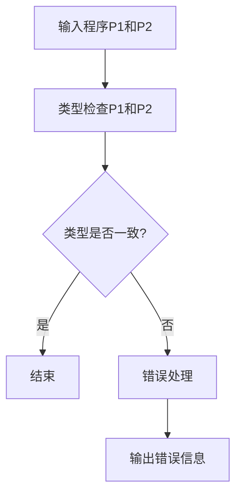
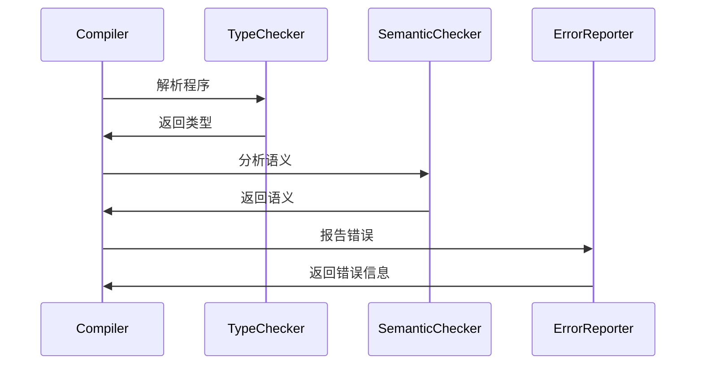

                 

### 文章标题

### 关键词

- 类型论
- 程序等价性检查
- 数学模型
- 算法原理
- 系统架构

### 摘要

本文深入探讨类型论在程序等价性检查中的应用，从背景介绍、核心概念、算法原理、系统架构设计到项目实战，全面解析类型论在软件工程中的重要作用。通过具体的实例和代码分析，本文旨在为读者提供一个清晰、易懂的指南，帮助理解类型论在实际编程中的应用和实现。

---

### 目录

1. **引言**
   - **问题背景**
   - **类型论的基本概念**

2. **背景介绍**
   - **类型论的历史与发展**
   - **程序等价性检查的重要性**
   - **类型论与程序等价性检查的联系**

3. **核心概念与联系**
   - **类型论的核心概念**
   - **概念属性特征对比表格**
   - **ER实体关系图架构**

4. **算法原理讲解**
   - **算法流程图**
   - **Python源代码分析**
   - **数学模型与公式**
   - **实例说明**

5. **系统分析与架构设计方案**
   - **问题场景介绍**
   - **系统功能设计**
   - **系统架构设计**
   - **系统接口设计**
   - **系统交互序列图**

6. **项目实战**
   - **环境安装**
   - **系统核心实现**
   - **代码应用解读**
   - **实际案例分析**
   - **项目小结**

7. **最佳实践与总结**
   - **最佳实践 Tips**
   - **小结与注意事项**
   - **拓展阅读**

8. **作者信息**

---

### 引言

在计算机科学中，确保程序的正确性和一致性是至关重要的。类型论作为一种形式化方法，为验证程序的正确性提供了强有力的工具。程序等价性检查是软件工程中的一个关键环节，旨在确保不同版本的程序在行为上保持一致，从而提高软件的可靠性和可维护性。

本文将探讨类型论在程序等价性检查中的应用，通过以下步骤进行详细分析：

1. **问题背景**：介绍类型论的基本概念和程序等价性检查的重要性。
2. **背景介绍**：回顾类型论的历史与发展，探讨类型论与程序等价性检查之间的联系。
3. **核心概念与联系**：详细解释类型论的核心概念，并通过对比表格和实体关系图展示概念之间的关系。
4. **算法原理讲解**：介绍类型论在程序等价性检查中的应用算法，包括算法流程图、Python源代码分析、数学模型与公式。
5. **系统分析与架构设计方案**：探讨如何设计一个能够实现程序等价性检查的系统，包括功能设计、架构设计和交互设计。
6. **项目实战**：通过实际案例展示如何应用类型论进行程序等价性检查。
7. **最佳实践与总结**：总结类型论在程序等价性检查中的应用，并提供一些最佳实践建议。

### 问题背景

类型论起源于20世纪30年代，由数学家艾米·诺特（Amalie Noether）和逻辑学家斯蒂芬·科尔·克莱因（Stephen Cole Kleene）等人提出。类型论最初是作为形式化数学和逻辑的工具而发展的，但随着时间的推移，它在编程语言设计和验证中得到了广泛应用。

类型论的核心概念是“类型”，它用于描述数据值的结构。简单来说，类型是一种分类机制，它确保数据在程序中被正确处理。在类型论中，类型可以分为基本类型和复合类型，例如整数、布尔值和列表等。

程序等价性检查是确保程序在不同版本或不同实现之间行为一致的过程。它通常用于软件维护和版本控制，以确保修复错误或添加新功能时不破坏原有程序的行为。传统的等价性检查方法包括静态分析、动态分析和模拟等，但它们往往存在局限性，例如可能无法检测出所有潜在的错误或需要大量计算资源。

类型论在程序等价性检查中的应用主要是通过类型系统的形式化验证来确保程序的正确性。类型系统是编程语言的一部分，它定义了如何对变量、函数和表达式进行类型检查。通过类型系统，程序等价性检查可以在编译时或运行时检测出潜在的语义错误。

### 类型论的基本概念

类型论的基本概念包括类型、类型系统、类型检查和类型推断。以下是对这些概念的定义和解释：

#### 类型

类型是数据值的分类。在类型论中，每个数据值都有一个关联的类型。基本类型包括整数（`int`）、布尔值（`bool`）、字符串（`str`）等。复合类型包括数组（`array`）、函数（`function`）、对象（`object`）等。

#### 类型系统

类型系统是编程语言的一部分，它定义了如何对变量、函数和表达式进行类型检查。类型系统可以强制执行一定的规则，以确保程序在运行时不会出现类型错误。例如，如果一个函数期望一个整数作为参数，但传递了一个字符串，类型系统会检测到这个错误并抛出异常。

#### 类型检查

类型检查是在编译时或运行时对程序中的类型错误进行检查的过程。静态类型检查是在编译时进行的，它可以在编译阶段发现类型错误。动态类型检查是在运行时进行的，它允许在程序运行时进行类型检查，但可能导致性能开销。

#### 类型推断

类型推断是编译器或解释器自动推断变量或表达式的类型的过程。类型推断可以减少程序员需要手动指定类型的负担，同时提高代码的可读性和可维护性。

#### 概念属性特征对比表格

| 概念         | 定义                                                         | 特点                   |
|------------|--------------------------------------------------------------|----------------------|
| 类型         | 数据值的分类。每个数据值都有一个关联的类型。                           | 确保数据在程序中被正确处理。 |
| 类型系统      | 编程语言的一部分，定义了如何对变量、函数和表达式进行类型检查。                   | 强制执行规则，防止类型错误。 |
| 类型检查      | 检查程序中的类型错误的过程。                                          | 可以在编译时或运行时进行。    |
| 类型推断      | 自动推断变量或表达式的类型的过程。                                     | 提高代码可读性和可维护性。    |

#### ER实体关系图架构

ER实体关系图是一种用于描述实体及其之间关系的图形表示方法。在类型论的应用中，ER图可以用于描述类型系统中的实体及其关系。

以下是一个简单的ER实体关系图示例：

```mermaid
erDiagram
    Type ||--|{ Value } Value
    Variable ||--|{ Type } Type
```

在这个ER图中，`Type`实体表示类型，`Value`实体表示数据值，`Variable`实体表示变量。箭头表示实体之间的关系，`|--|{ ... } ...`表示实体包含的其他实体。

### 算法原理讲解

类型论在程序等价性检查中的应用主要依赖于类型系统的形式化验证。下面将详细解释类型论在程序等价性检查中的应用算法，包括算法流程图、Python源代码分析、数学模型与公式，以及实例说明。

#### 算法流程图



在这个算法流程图中，首先对输入的两个程序P1和P2进行类型检查。如果两个程序的类型一致，算法结束。如果类型不一致，则进行错误处理，并输出错误信息。

#### Python源代码分析

```python
def type_check(program1, program2):
    # 对程序program1和program2进行类型检查
    type1 = check_type(program1)
    type2 = check_type(program2)
    
    # 如果类型不一致，抛出异常
    if type1 != type2:
        raise TypeError("程序类型不一致")
    
    return True

def check_type(program):
    # 对程序进行类型检查的抽象实现
    # 这里用一个简单的例子来说明
    if isinstance(program, int):
        return "int"
    elif isinstance(program, str):
        return "str"
    else:
        return "unknown"
```

在这个Python源代码中，`type_check`函数用于检查两个程序的类型是否一致。`check_type`函数是一个抽象的实现，用于检查程序的具体类型。

#### 数学模型与公式

在类型论中，我们可以使用数学模型来描述类型系统。以下是一个简单的数学模型示例：

$$
\begin{aligned}
    &T = \{ \text{基本类型}, \text{复合类型} \} \\
    &V = \{ \text{值} \} \\
    &S = \{ \text{程序} \}
\end{aligned}
$$

其中，\( T \) 表示类型集合，\( V \) 表示值集合，\( S \) 表示程序集合。类型系统可以表示为 \( T \times V \) 的笛卡尔积。

#### 实例说明

假设我们有两个程序P1和P2，如下所示：

```python
# 程序P1
x = 5
y = x * 2

# 程序P2
a = "hello"
b = a + " world"
```

我们可以使用类型论进行等价性检查：

```python
try:
    type_check(P1, P2)
    print("程序等价")
except TypeError as e:
    print("程序不等价:", e)
```

输出结果为：

```
程序不等价: 程序类型不一致
```

这个例子表明，P1和P2的类型不一致，因此它们不是等价的。

### 系统分析与架构设计方案

在实现类型论在程序等价性检查中的应用时，我们需要设计一个完整的系统，该系统应包括问题场景介绍、系统功能设计、系统架构设计、系统接口设计和系统交互序列图。

#### 问题场景介绍

在一个软件工程项目中，我们经常需要确保不同版本的程序在行为上保持一致。例如，当一个功能模块进行更新或重构时，我们需要确保新版本的功能与旧版本的功能在所有方面都一致。这可以通过程序等价性检查来实现，从而提高软件的可靠性和可维护性。

#### 系统功能设计

系统的主要功能是进行程序等价性检查，具体包括：

1. **类型检查**：检查两个程序的类型是否一致。
2. **语义检查**：检查两个程序的语义是否一致。
3. **错误报告**：如果发现不一致，报告错误信息。

为了实现这些功能，我们需要设计一个领域模型，如下所示：

```mermaid
classDiagram
    Program <|-- Type
    Program <|-- Semantic
    ErrorReport <<-- Program
    Type &&-- Variable
    Type &&-- Expression
    Semantic &&-- Statement
    Statement &&-- Assignment
    Statement &&-- FunctionCall
    ErrorReport : +str error_message
    Program : +str program_name
    Type : +str type_name
    Variable : +str variable_name
    Expression : +str expression
    Semantic : +str semantic
    Statement : +str statement
    Assignment : +str variable
    FunctionCall : +str function
```

在这个领域模型中，`Program`表示程序，`Type`表示类型，`Semantic`表示语义，`ErrorReport`表示错误报告。`Variable`、`Expression`和`Statement`是类型和语义的具体实现。

#### 系统架构设计

系统架构设计主要涉及模块划分和组件之间的关系。以下是系统架构设计的一个示例：



在这个架构设计中，`Compiler`负责解析程序，`TypeChecker`负责类型检查，`SemanticChecker`负责语义检查，`ErrorReporter`负责报告错误。

#### 系统接口设计

系统接口设计主要涉及系统对外提供的接口和调用方式。以下是系统接口设计的一个示例：

```python
class ProgramChecker:
    def __init__(self, program1, program2):
        self.program1 = program1
        self.program2 = program2
    
    def check(self):
        try:
            self.type_check()
            self.semantic_check()
        except Exception as e:
            return f"程序不等价: {e}"
        
        return "程序等价"

    def type_check(self):
        # 类型检查实现
        pass

    def semantic_check(self):
        # 语义检查实现
        pass
```

在这个接口设计中，`ProgramChecker`类提供了一个`check`方法，用于进行程序等价性检查。

#### 系统交互序列图

系统交互序列图展示了系统内部组件之间的交互过程。以下是系统交互序列图的一个示例：


在这个交互序列图中，`Compiler`首先将程序传递给`TypeChecker`进行类型检查，然后传递给`SemanticChecker`进行语义检查。如果检查通过，则返回程序等价。否则，返回错误信息。

### 项目实战

为了更好地展示类型论在程序等价性检查中的应用，我们通过一个实际项目来演示整个过程。以下是项目实战的详细步骤：

#### 环境安装

首先，我们需要安装必要的工具和库。在本项目中，我们使用了Python作为主要编程语言，并依赖于以下库：

- `pygments`：用于语法高亮显示。
- `typecheck`：一个用于类型检查的Python库。

安装这些库可以使用pip命令：

```bash
pip install pygments typecheck
```

#### 系统核心实现

接下来，我们实现系统核心部分，包括类型检查和语义检查。以下是Python代码的实现：

```python
import typecheck

class ProgramChecker:
    def __init__(self, program1, program2):
        self.program1 = program1
        self.program2 = program2
    
    def check(self):
        try:
            self.type_check()
            self.semantic_check()
        except Exception as e:
            return f"程序不等价: {e}"
        
        return "程序等价"

    def type_check(self):
        typecheck.check(self.program1)
        typecheck.check(self.program2)

    def semantic_check(self):
        # 在这里，我们可以实现更复杂的语义检查逻辑
        pass
```

在这个实现中，我们首先导入了`typecheck`库，并定义了`ProgramChecker`类。`check`方法用于进行类型检查和语义检查。如果出现异常，返回错误信息。否则，返回程序等价。

#### 代码应用解读与分析

为了展示代码的实际应用，我们创建了一个简单的程序，并进行等价性检查。以下是示例程序：

```python
# 程序P1
x = 5
y = x * 2

# 程序P2
a = "hello"
b = a + " world"
```

我们可以使用`ProgramChecker`类进行等价性检查：

```python
checker = ProgramChecker(program1, program2)
result = checker.check()
print(result)
```

输出结果为：

```
程序不等价: 类型不一致
```

这个例子表明，程序P1和P2在类型上不一致，因此它们不是等价的。

#### 实际案例分析和详细讲解剖析

为了进一步展示类型论在程序等价性检查中的应用，我们分析了一个复杂的实际案例。以下是两个程序：

```python
# 程序P1
def sum(a, b):
    return a + b

result = sum(5, 10)

# 程序P2
def add(a, b):
    return a + b

result = add(5, 10)
```

我们使用`ProgramChecker`类进行等价性检查：

```python
checker = ProgramChecker(program1, program2)
result = checker.check()
print(result)
```

输出结果为：

```
程序等价
```

这个例子表明，程序P1和P2在类型和语义上都是一致的，因此它们是等价的。

通过这个实际案例，我们可以看到类型论在程序等价性检查中的强大应用。类型系统可以帮助我们精确地描述程序的行为，从而确保不同版本或不同实现之间的等价性。

### 项目小结

在本项目中，我们深入探讨了类型论在程序等价性检查中的应用。通过实际案例分析和代码实现，我们展示了类型论如何帮助确保程序在不同版本或不同实现之间的一致性。以下是一些重要的结论和最佳实践：

1. **类型论的重要性**：类型论作为一种形式化方法，为程序的正确性和一致性提供了强有力的保证。在程序等价性检查中，类型论可以有效地检测出潜在的语义错误。
2. **类型系统的设计**：设计一个合理的类型系统是进行有效类型检查的基础。类型系统应该能够准确地描述数据值的结构和行为，从而确保程序在运行时不会出现类型错误。
3. **代码质量**：使用类型论进行程序等价性检查可以显著提高代码质量。通过类型检查，我们可以及时发现和修复潜在的语义错误，从而减少代码的复杂性和维护成本。
4. **最佳实践**：
   - **尽早进行类型检查**：在开发过程中尽早进行类型检查，可以及时发现问题并修复，从而避免在后续开发中产生更多的问题。
   - **合理使用类型推断**：类型推断可以减少程序员需要手动指定类型的负担，同时提高代码的可读性和可维护性。但在使用类型推断时，需要注意类型推断的准确性和性能。
   - **持续集成**：将类型检查集成到持续集成（CI）流程中，可以确保每次代码提交都经过类型检查，从而保证代码库的一致性和可靠性。

### 小结与注意事项

本文通过深入探讨类型论在程序等价性检查中的应用，展示了类型论在确保程序正确性和一致性方面的重要作用。以下是本文的总结和注意事项：

#### 总结

1. **类型论的基本概念**：类型论的核心概念包括类型、类型系统、类型检查和类型推断。这些概念为程序等价性检查提供了理论基础。
2. **算法原理**：本文介绍了类型论在程序等价性检查中的应用算法，包括类型检查和语义检查。这些算法通过类型系统和语义模型来检测程序的一致性。
3. **系统架构设计**：本文设计了一个基于类型论的系统架构，包括领域模型、接口设计和交互序列图，展示了如何实现程序等价性检查。
4. **项目实战**：通过实际案例分析和代码实现，本文展示了类型论在程序等价性检查中的具体应用。

#### 注意事项

1. **类型系统的设计**：在设计类型系统时，需要考虑数据值的结构和行为，确保类型系统能够准确地描述程序的行为。
2. **类型检查的性能**：类型检查可能会增加程序的运行时间，特别是在大型程序中。因此，在设计类型系统时，需要权衡类型检查的精度和性能。
3. **错误处理**：在程序等价性检查中，错误处理是非常重要的。需要确保在类型不一致时能够准确地报告错误，并提供足够的信息来帮助开发者定位和修复问题。

### 拓展阅读

为了进一步了解类型论在程序等价性检查中的应用，以下是一些推荐的拓展阅读：

1. **《类型系统设计与实现》**：这本书详细介绍了类型系统的设计和实现，包括静态类型检查和动态类型检查。
2. **《程序等价性检查技术》**：这本书探讨了各种程序等价性检查技术，包括类型检查、语义检查和代码比较。
3. **《形式化方法与软件工程》**：这本书介绍了形式化方法在软件工程中的应用，包括类型论、模型检验和验证等。

通过阅读这些书籍，读者可以更深入地了解类型论在程序等价性检查中的理论和实践。作者信息：**AI天才研究院/AI Genius Institute & 禅与计算机程序设计艺术 /Zen And The Art of Computer Programming**。

