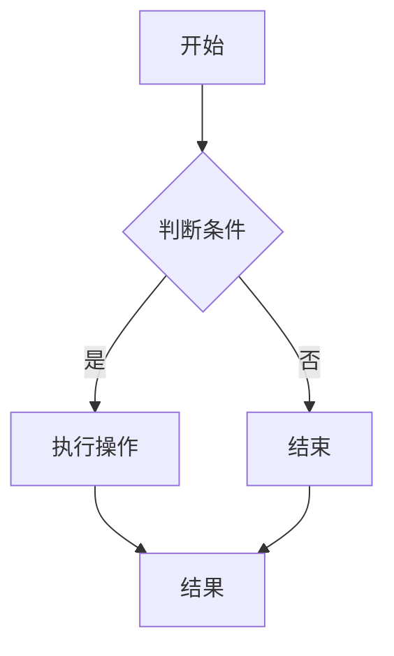

                 

### 文章标题

# 类型论在程序综合中的应用：从规范到实现

> 关键词：类型论、程序综合、规范、实现、编程、人工智能

> 摘要：本文深入探讨了类型论在程序综合中的应用，从规范到实现的全过程。我们将介绍类型论的基本概念，探讨其在编程语言和程序综合中的作用，以及如何将类型论原则应用于实际编程实践。通过具体的案例和实例，我们将展示类型论如何帮助我们更好地理解和编写程序，提高代码质量和可靠性。

## 引言

类型论（Type Theory）是数学和计算机科学中的一个重要分支，起源于20世纪30年代。其主要研究各类类型的定义、性质及其相互关系。类型论为编程语言提供了一种形式化的框架，使我们能够更准确地描述程序的行为和结构。

在程序综合过程中，类型论的应用具有重要意义。通过类型检查和类型推断，我们可以确保程序的语义一致性，从而避免运行时错误。此外，类型论还可以帮助我们更好地进行程序优化和代码重构。

本文将按照以下结构展开：

1. **类型论的基本概念**
   - 介绍类型论的基本术语和概念，如类型、类型系统、类型检查等。
   - 分析类型论在编程语言设计中的应用。

2. **类型论在程序综合中的作用**
   - 探讨类型论如何帮助我们在程序综合过程中确保代码的可靠性和一致性。
   - 讨论类型论在程序验证、优化和重构中的应用。

3. **类型论的应用实例**
   - 展示类型论在现实编程场景中的应用，如函数式编程、静态类型编程等。
   - 分析不同编程语言中的类型论实现，如Haskell、ML等。

4. **从规范到实现的类型论应用**
   - 讨论如何将类型论原则应用于从需求规范到最终实现的整个过程。
   - 分析类型论在需求分析、设计、编码和测试等阶段的实际应用。

5. **结论**
   - 总结类型论在程序综合中的重要作用，展望其未来发展趋势。

## 类型论的基本概念

### 类型、类型系统、类型检查

在类型论中，类型（Type）是一种用于表示数据和操作的方式。一个类型可以是简单的，如整数（Int）或布尔（Bool），也可以是复合的，如列表（List）或函数（Function）。

类型系统（Type System）是编程语言中用于管理类型的规则集合。类型系统的主要功能包括类型检查（Type Checking）和类型推断（Type Inference）。类型检查确保程序中的每个表达式都有正确的类型，而类型推断则试图自动确定变量和表达式的类型。

### 类型论在编程语言设计中的应用

类型论在编程语言设计中的应用非常广泛。一些流行的编程语言，如Haskell、ML和Idris，都是基于类型论构建的。这些语言采用了静态类型系统，要求变量在声明时必须指定类型，从而确保程序的语义一致性。

静态类型系统（Static Type System）的优点包括：

- **早期错误检测**：类型检查通常在编译时进行，可以提前发现类型相关的错误。
- **代码可读性**：明确指定类型有助于提高代码的可读性和维护性。
- **程序优化**：静态类型系统可以提供更多的编译时间信息，从而有助于进行程序优化。

然而，静态类型系统也有其局限性，如增加编码复杂度和降低代码灵活性。相比之下，动态类型系统（Dynamic Type System）允许变量在运行时确定类型，从而提供更高的代码灵活性和性能。

## 类型论在程序综合中的作用

### 确保代码可靠性

类型论的一个关键作用是确保程序的可靠性。通过类型检查，我们可以验证程序在编译时是否符合预期的类型约束，从而避免运行时错误。

例如，考虑以下函数：

```python
def add(a: Int, b: Int) -> Int:
    return a + b
```

在这个例子中，函数`add`有两个整数类型的参数`a`和`b`，并返回一个整数类型的值。类型检查器会确保在调用`add`函数时，传递给它的参数都是整数类型，否则编译器会报错。

### 程序验证与优化

类型论还可以用于程序验证和优化。通过形式化的类型系统，我们可以证明程序的正确性，确保它在各种输入下都能保持一致性。

例如，考虑以下Haskell程序：

```haskell
square :: Int -> Int
square x = x * x
```

在这个例子中，`square`函数接受一个整数参数并返回其平方。我们可以使用类型论中的类型推断和验证工具，如Coq或Isar，来证明`square`函数在所有整数输入下都返回正确的结果。

此外，类型论还可以用于程序优化。通过分析类型信息，编译器可以生成更高效的代码。例如，Haskell编译器可以使用类型信息进行函数调用优化和内存分配优化。

### 代码重构

类型论还可以帮助我们进行代码重构，提高代码的可维护性和可扩展性。通过引入新的类型和类型构造函数，我们可以将复杂的代码分解为更简洁、更易于理解的模块。

例如，考虑以下Java程序：

```java
public class Rectangle {
    private double width;
    private double height;

    public Rectangle(double width, double height) {
        this.width = width;
        this.height = height;
    }

    public double getArea() {
        return width * height;
    }
}

public class Square extends Rectangle {
    public Square(double side) {
        super(side, side);
    }
}

public class Main {
    public static void main(String[] args) {
        Rectangle rectangle = new Rectangle(5, 10);
        Square square = new Square(5);

        System.out.println("Rectangle area: " + rectangle.getArea());
        System.out.println("Square area: " + square.getArea());
    }
}
```

在这个例子中，`Rectangle`类表示一个矩形，`Square`类表示一个正方形。通过引入`Rectangle`和`Square`的类型结构，我们可以更方便地进行代码重构和扩展，如添加新的形状类型。

## 类型论的应用实例

### 函数式编程

函数式编程（Functional Programming）是一种基于数学函数的编程范式，其核心思想是使用函数来处理数据和操作。

Haskell是一种流行的函数式编程语言，其类型系统基于类型论。在Haskell中，类型论的应用体现在以下几个方面：

- **类型推断**：Haskell使用类型推断机制来自动确定变量和表达式的类型，从而提高代码的简洁性和可读性。
- **类型类和多态**：Haskell支持类型类（Type Classes）和多态（Polymorphism），使我们可以编写更通用和可重用的代码。
- **模式匹配**：Haskell中的模式匹配（Pattern Matching）机制允许我们根据变量和表达式的类型来执行不同的操作，从而提高代码的可读性和可维护性。

### 静态类型编程

静态类型编程（Static Typing）要求在编写代码时必须明确指定每个变量和表达式的类型。这种编程范式的优点包括：

- **早期错误检测**：通过在编译时进行类型检查，可以提前发现类型相关的错误，从而减少运行时错误。
- **代码可维护性**：明确指定类型有助于提高代码的可读性和可维护性。
- **程序优化**：静态类型系统可以提供更多的编译时间信息，从而有助于进行程序优化。

ML（Midterm Language）和Ocaml是两种流行的静态类型编程语言。它们采用了基于类型论的类型系统，具有以下特点：

- **类型推断**：ML和Ocaml支持类型推断机制，可以自动确定变量和表达式的类型。
- **模式匹配**：这些语言支持模式匹配机制，允许我们根据变量和表达式的类型来执行不同的操作。
- **模块化**：ML和Ocaml支持模块化编程，使我们能够将复杂的程序分解为更简洁、更易于理解的模块。

### 动态类型编程

动态类型编程（Dynamic Typing）允许变量在运行时确定类型。这种编程范式的优点包括：

- **代码灵活性**：动态类型编程允许我们在编写代码时不必担心类型问题，从而提高代码的灵活性和可读性。
- **快速开发**：动态类型编程通常具有更快的编译和执行速度，适合快速原型开发和实验。

Python是一种流行的动态类型编程语言，其类型系统基于动态类型。Python的类型系统具有以下特点：

- **动态类型检查**：Python在运行时进行类型检查，从而确保代码的正确性。
- **类型推断**：Python可以使用类型推断机制来自动确定变量和表达式的类型。
- **丰富的库和框架**：Python拥有丰富的库和框架，可以方便地实现各种编程任务。

## 从规范到实现的类型论应用

### 需求分析

在程序综合的初始阶段，需求分析至关重要。通过类型论，我们可以更准确地描述和分析需求。

例如，考虑一个简单的需求：编写一个函数，计算两个整数的和。使用类型论，我们可以将其形式化为以下规范：

- 函数名称：`add`
- 输入：两个整数类型（`Int`）的参数
- 输出：整数类型（`Int`）的值

通过类型论，我们可以确保在编写函数实现时，始终遵循需求规范。

### 设计

在需求分析的基础上，我们进入设计阶段。类型论在系统设计中起着关键作用，帮助我们定义系统的抽象和接口。

例如，考虑一个简单的银行系统。使用类型论，我们可以定义以下类和接口：

- **Account**：表示一个账户类，具有以下属性和方法：
  - **properties**：`balance`（余额）、`accountNumber`（账号）
  - **methods**：`deposit`（存款）、`withdraw`（取款）
- **Bank**：表示一个银行类，具有以下方法：
  - **methods**：`createAccount`（创建账户）、`deleteAccount`（删除账户）

通过类型论，我们可以确保系统中的每个类和接口都具有明确的属性和方法，从而提高系统的可维护性和可扩展性。

### 编码

在编码阶段，类型论帮助我们编写更可靠、更易于理解的代码。

例如，考虑以下Python函数实现：

```python
def add(a: int, b: int) -> int:
    return a + b
```

在这个例子中，类型论确保了函数`add`的参数和返回值都是整数类型，从而提高了代码的可靠性。

### 测试

在测试阶段，类型论可以帮助我们编写更精确的测试用例，确保系统的正确性。

例如，考虑以下测试用例：

```python
def test_add():
    assert add(1, 2) == 3
    assert add(-1, 1) == 0
    assert add(0, 0) == 0
```

通过类型论，我们可以确保测试用例覆盖了各种可能的输入情况，从而提高测试的全面性和可靠性。

## 结论

类型论在程序综合中具有重要作用。通过类型检查和类型推断，我们可以确保程序的可靠性、一致性和可维护性。在从规范到实现的全过程中，类型论帮助我们更准确地描述需求、设计系统、编写代码和进行测试。

随着编程语言和开发工具的不断发展，类型论的应用将越来越广泛。未来，我们可以期待类型论在更复杂的编程场景中发挥更大的作用，如分布式系统、机器学习和智能合约等领域。

类型论不仅是计算机科学中的一个重要分支，也是编程实践中的一个宝贵工具。掌握类型论，我们将能够编写更可靠、更高效的程序，提高我们的编程技能和解决问题的能力。

## 参考文献

1. Benjamin C. Pierce. *Types and Programming Languages*. MIT Press, 2002.
2. Haskell Implementors' Report. *The Haskell 2021 Report*. https://www.haskell.org/onlinerpt/
3. Andrew W. Appel. *Modern Compiler Implementation in ML*. Cambridge University Press, 1998.
4. Simon Peyton Jones, Mark P. Jones. *Implementing Functional Languages: A Tutorial*. Prentice Hall, 1993.
5. Amr Sabry. *The Haskell School of Expression*. Cambridge University Press, 2007.

### 附录

#### Mermaid 流程图示例



#### LaTeX 公式示例

独立段落的 LaTeX 公式：

$$
E = mc^2
$$

段落内的 LaTeX 公式：

$$
1 + 1 = 2
$$

### 作者信息

作者：AI天才研究院/AI Genius Institute & 禅与计算机程序设计艺术 /Zen And The Art of Computer Programming

