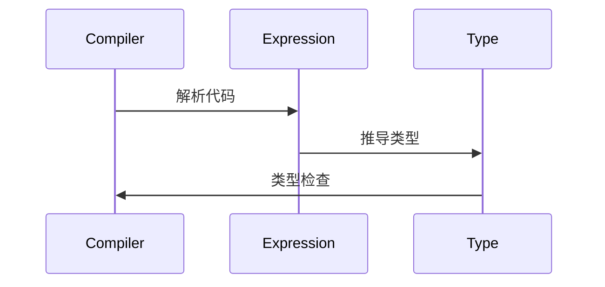
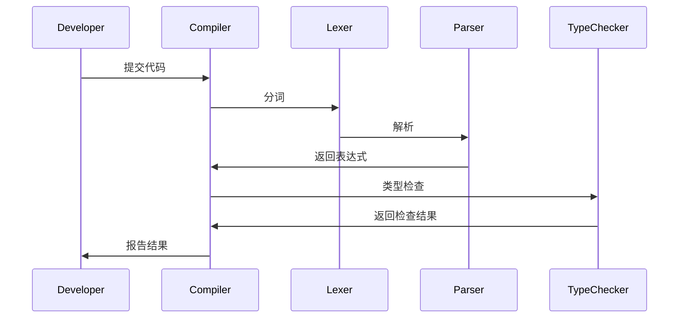
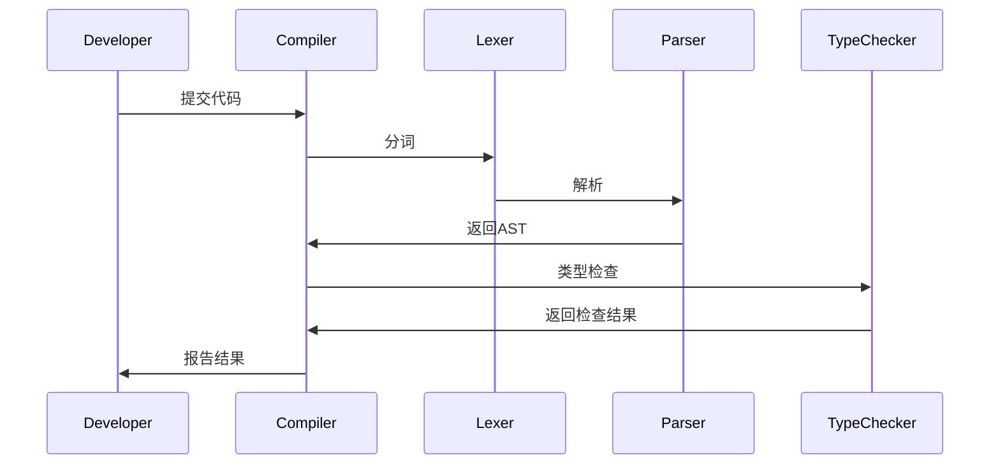
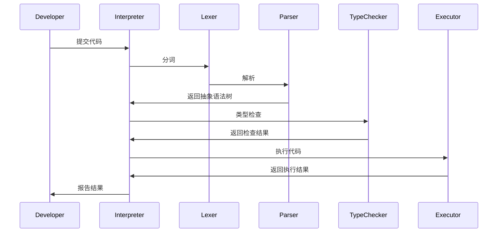
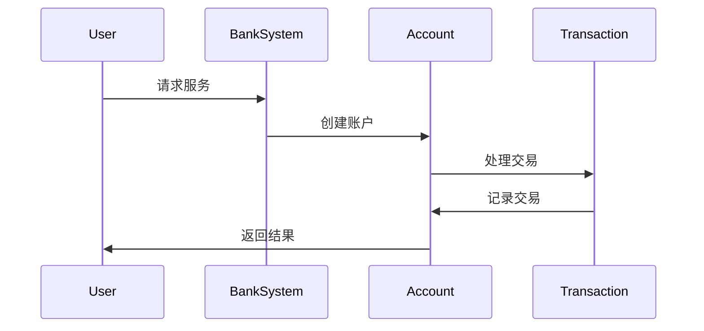
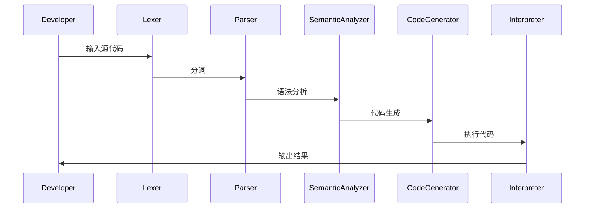

                 

### 第1章：类型论概述

#### 1.1 类型论的定义与历史

类型论是计算机科学中的一个基本理论，它定义了数据类型以及类型之间的关系。其起源可以追溯到20世纪30年代，当时为了解决逻辑和数学中的悖论，数学家如伯特兰·罗素和阿尔弗雷德·诺思·怀特海德提出了类型理论。随着计算机科学的不断发展，类型论逐渐成为编程语言设计、编译器实现、形式化验证等领域的重要理论依据。

**核心概念：**

- **类型系统**：类型系统是一个定义数据类型和操作规则的框架。在类型系统中，每个变量都绑定到一个具体的类型，操作必须在相同或兼容的类型之间进行。
- **类型判断**：类型判断是编译器在编译过程中，对代码表达式进行类型检查，确保表达式遵循类型规则。
- **类型推导**：类型推导是编译器自动推导出表达式类型的过程，而不需要显式声明类型。

**问题解决：**

类型论的核心目的是避免在程序运行时发生类型错误。通过静态类型检查，类型论能够在编译期捕获大部分类型相关错误，提高程序的稳定性和可靠性。

**边界与外延：**

类型论的应用范围非常广泛，从简单的静态类型语言到复杂的动态类型语言，从编译型语言到解释型语言，都可以看到类型论的影子。它不仅在编程语言设计中扮演重要角色，还在形式化验证、分布式计算、并行编程等领域有着重要应用。

**概念结构与核心要素组成：**

类型论的核心结构包括类型系统、类型推导、类型检查和类型安全。这些要素相互作用，共同构成了类型论的理论体系。

1. **类型系统**：定义了数据类型的集合和类型之间的层次关系。
2. **类型推导**：编译器根据代码结构自动推导出类型。
3. **类型检查**：确保表达式遵循类型规则。
4. **类型安全**：确保程序在运行时不会因为类型错误导致崩溃或不可预期的行为。

**背景介绍：**

类型论最初是数学领域的一部分，用于解决形式化数学中的悖论。随着计算机科学的兴起，类型论逐渐应用于编程语言设计中，成为了编程语言语义学的基础。

**核心概念与联系：**

**概念属性特征对比表格：**

| 特征        | 类型论         | 面向对象编程         |
|-------------|----------------|---------------------|
| 目的        | 防止逻辑错误   | 提高代码复用性和扩展性 |
| 基础        | 数学           | 面向对象           |
| 关系        | 类型层次结构   | 继承与多态         |
| 应用        | 编程语言设计   | 类和对象设计       |

**ER实体关系图架构：**

```mermaid
erDiagram
    Type <<|-- Expression
    Type ||--|{ Value }
    Expression ||--|{ TypeCheck }
```

在ER图中，`Type`表示类型，`Expression`表示表达式，`Value`表示值，`TypeCheck`表示类型检查。这些实体之间的关系定义了类型论的核心概念。

**算法原理讲解：**

类型论的算法原理主要包括类型推导和类型检查。

- **类型推导**：通过分析代码结构，编译器自动推导出表达式的类型。类型推导算法通常基于类型推断规则，如基于结构分析、约束求解等。
- **类型检查**：编译器对代码进行类型检查，确保表达式遵循类型规则。类型检查算法通常基于类型推断的结果，进行进一步的验证和优化。

下面是一个简单的Python代码示例，用于展示类型推导和类型检查：

```python
# 类型推导
x = 5  # 自动推导为int类型
y = "hello"  # 自动推导为str类型

# 类型检查
def add(x: int, y: int) -> int:
    return x + y

result = add(1, 2)  # 类型检查通过
# result = add("hello", "world")  # 类型检查失败，因为参数类型不符
```

在这个示例中，变量`x`和`y`的类型被自动推导出来，函数`add`的类型也被推导出来。类型检查确保函数调用时参数类型符合预期，从而避免类型错误。

**系统分析与架构设计方案：**

为了更好地理解类型论在编程语言中的应用，我们可以通过一个实际的项目来分析。

**项目介绍：**

假设我们要设计一个简单的编程语言，并为其实现一个编译器。这个编译器的核心功能包括类型推导和类型检查。

**系统功能设计（领域模型）：**

领域模型描述了编译器需要处理的不同实体和它们之间的关系。

```mermaid
classDiagram
    ClassDiagramCanvas {
        "1. 类别：编译器"
        Compiler
        Expression
        Type
        Value
    }
    Compiler "编译器" -|- Expression "表达式" :包含
    Expression -| Type "类型" :类型为
    Type -| Value "值" :值为
```

在这个类图中，`Compiler`表示编译器，`Expression`表示表达式，`Type`表示类型，`Value`表示值。编译器包含表达式，每个表达式都有类型和值。

**系统架构设计：**

系统架构图描述了编译器的主要组成部分和它们之间的交互关系。



在这个序列图中，编译器首先解析代码生成表达式，然后推导表达式的类型，最后进行类型检查。

**系统接口设计：**

接口设计定义了编译器的API，用于与其他组件交互。

```python
class Compiler:
    def parse_code(self, code: str) -> Expression:
        # 解析代码，返回表达式
        pass

    def check_type(self, expression: Expression) -> bool:
        # 检查表达式类型
        pass
```

在这个接口设计中，`Compiler`类提供了`parse_code`和`check_type`两个方法，分别用于解析代码和检查类型。

**系统交互设计：**

系统交互图描述了编译器与其他组件之间的交互流程。



在这个交互图中，开发者提交代码给编译器，编译器依次调用分词器、解析器和类型检查器，最后将检查结果报告给开发者。

**项目实战：**

为了实现这个编译器，我们需要完成以下步骤：

1. **环境安装**：安装Python和其他必要的工具。
2. **系统核心实现**：编写Lexer、Parser、TypeChecker等组件的源代码。
3. **代码应用解读与分析**：分析编译器的核心功能，如类型推导和类型检查。
4. **实际案例分析和详细讲解剖析**：通过实际案例展示编译器的应用场景。
5. **项目小结**：总结项目的主要成果和经验教训。

**最佳实践 tips：**

- 在设计类型系统时，要考虑类型安全性和灵活性之间的平衡。
- 在实现类型推导和类型检查时，要确保算法的效率和准确性。
- 在实际应用中，要不断优化和改进类型系统，以适应不同的编程需求。

**小结：**

类型论在编程语言语义学中扮演着重要的角色。通过类型推导和类型检查，类型论能够提高程序的稳定性和可靠性，减少类型错误。在实际应用中，类型论不仅有助于设计静态类型语言，还可以应用于动态类型语言，为编程语言的发展提供坚实的基础。

**注意事项：**

- 在编写类型安全代码时，要确保类型的一致性和兼容性。
- 在使用类型论进行编程时，要充分理解类型系统的规则和限制。

**拓展阅读：**

- 《Types and Programming Languages》
- 《The Art of Computer Programming, Volume 2: Seminumerical Algorithms》

作者：AI天才研究院/AI Genius Institute & 禅与计算机程序设计艺术 /Zen And The Art of Computer Programming### 第2章：静态类型语言

#### 2.1 静态类型语言的概念

静态类型语言（Statically Typed Languages）是一种在编译或解释程序之前，必须显式声明变量类型的编程语言。这种语言的类型检查在编译期进行，而不是运行时。常见的静态类型语言包括C、C++、Java、Haskell、Scala等。

**静态类型的定义：**

- **静态类型**：在程序执行前，变量的类型就已经确定，并且在整个程序执行过程中保持不变。
- **类型注解**：在代码中显式声明变量的类型，如`int x = 5;`中的`int`就是类型注解。

**动态类型的定义：**

- **动态类型**：在程序执行过程中，变量的类型可以根据上下文动态确定。如Python和JavaScript等语言。

**静态类型与动态类型的对比：**

| 特点               | 静态类型语言                  | 动态类型语言                 |
|--------------------|----------------------------|-----------------------------|
| 类型检查时间       | 编译时                      | 运行时                      |
| 类型安全性         | 较高，类型错误早期发现      | 较低，类型错误在运行时发现    |
| 表达式灵活性       | 较低，需要显式声明类型      | 较高，类型可以根据上下文推断  |
| 性能               | 通常较优，编译时进行优化    | 通常较差，运行时进行优化     |

**问题解决：**

静态类型语言通过在编译期进行类型检查，可以提前发现并避免许多类型错误，从而提高程序的稳定性和可靠性。同时，静态类型语言往往提供了丰富的类型系统，使得类型推导和类型检查更加高效。

**边界与外延：**

静态类型语言在大型项目和企业级开发中具有优势，因为它们可以提供更高的类型安全性和更好的性能。然而，在小型项目或个人编程中，动态类型语言的灵活性可能更为适合。

**核心概念与联系：**

**概念属性特征对比表格：**

| 特征        | 静态类型语言         | 动态类型语言         |
|-------------|---------------------|---------------------|
| 类型检查    | 编译期进行          | 运行时进行          |
| 类型声明    | 必须显式声明类型    | 可以推断类型        |
| 灵活性      | 较低                | 较高                |
| 性能        | 较优                | 较差                |

**ER实体关系图架构：**

```mermaid
erDiagram
    Program <<|-- Variable
    Program ||--|{ Statement }
    Variable ||--|{ Type }
    Statement ||--|{ Expression }
```

在这个ER图中，`Program`表示程序，`Variable`表示变量，`Statement`表示语句，`Expression`表示表达式，`Type`表示类型。程序包含变量和语句，变量有类型，语句包含表达式。

**算法原理讲解：**

静态类型语言的类型检查通常包括以下步骤：

1. **语法分析**：将源代码转换为抽象语法树（AST）。
2. **类型推导**：从AST中推导出每个变量的类型。
3. **类型检查**：检查AST中的表达式是否遵循类型规则。

下面是一个简单的Python代码示例，用于展示静态类型语言中的类型推导和类型检查：

```python
x = 5  # 类型推导为int
y = "hello"  # 类型推导为str

def add(x: int, y: int) -> int:
    return x + y

result = add(1, 2)  # 类型检查通过
# result = add("hello", "world")  # 类型检查失败，因为参数类型不符
```

在这个示例中，变量`x`和`y`的类型被推导出来，函数`add`的类型也被推导出来。类型检查确保函数调用时参数类型符合预期，从而避免类型错误。

**系统分析与架构设计方案：**

为了更好地理解静态类型语言的工作原理，我们可以通过一个实际的项目来分析。

**项目介绍：**

假设我们要设计一个简单的静态类型语言，并为其实现一个编译器。这个编译器的核心功能包括类型推导和类型检查。

**系统功能设计（领域模型）：**

领域模型描述了编译器需要处理的不同实体和它们之间的关系。

```mermaid
classDiagram
    ClassDiagramCanvas {
        "1. 类别：编译器"
        Compiler
        Variable
        Statement
        Expression
        Type
    }
    Compiler "编译器" -|- Statement "语句" :包含
    Statement -| Expression "表达式" :包含
    Variable "变量" <<|-- Type "类型" :类型为
```

在这个类图中，`Compiler`表示编译器，`Statement`表示语句，`Expression`表示表达式，`Variable`表示变量，`Type`表示类型。编译器包含语句，每个语句包含表达式，变量有类型。

**系统架构设计：**

系统架构图描述了编译器的主要组成部分和它们之间的交互关系。



在这个交互图中，开发者提交代码给编译器，编译器依次调用分词器、解析器和类型检查器，最后将检查结果报告给开发者。

**系统接口设计：**

接口设计定义了编译器的API，用于与其他组件交互。

```python
class Compiler:
    def parse_code(self, code: str) -> AbstractSyntaxTree:
        # 解析代码，返回AST
        pass

    def check_type(self, ast: AbstractSyntaxTree) -> bool:
        # 检查类型
        pass
```

在这个接口设计中，`Compiler`类提供了`parse_code`和`check_type`两个方法，分别用于解析代码和检查类型。

**系统交互设计：**

系统交互图描述了编译器与其他组件之间的交互流程。


在这个交互图中，开发者提交代码给编译器，编译器依次调用分词器、解析器和类型检查器，最后将检查结果报告给开发者。

**项目实战：**

为了实现这个编译器，我们需要完成以下步骤：

1. **环境安装**：安装Python和其他必要的工具。
2. **系统核心实现**：编写Lexer、Parser、TypeChecker等组件的源代码。
3. **代码应用解读与分析**：分析编译器的核心功能，如类型推导和类型检查。
4. **实际案例分析和详细讲解剖析**：通过实际案例展示编译器的应用场景。
5. **项目小结**：总结项目的主要成果和经验教训。

**最佳实践 tips：**

- 在设计类型系统时，要考虑类型安全性和灵活性的平衡。
- 在实现类型推导和类型检查时，要确保算法的效率和准确性。

**小结：**

静态类型语言通过在编译期进行类型检查，可以提高程序的稳定性和可靠性。在实际应用中，静态类型语言在大型项目和企业级开发中具有优势，但也可以应用于小型项目和动态类型语言。通过理解静态类型语言的工作原理，我们可以更好地设计和实现高效的编译器。

**注意事项：**

- 在使用静态类型语言时，要确保变量类型的一致性和兼容性。
- 在开发过程中，要充分利用类型系统提供的类型推导和类型检查功能。

**拓展阅读：**

- 《The Art of Compiler Construction》
- 《Types and Programming Languages》

作者：AI天才研究院/AI Genius Institute & 禅与计算机程序设计艺术 /Zen And The Art of Computer Programming### 第3章：类型论在函数式编程中的应用

#### 3.1 函数式编程概述

函数式编程（Functional Programming）是一种编程范式，它基于数学函数的概念，将计算视为一系列函数的转换。在函数式编程中，程序通常由函数组成，这些函数接受输入并产生输出，而不会改变外部状态。常见的函数式编程语言包括Haskell、Scala、Erlang、Clojure和JavaScript（函数式编程风格）等。

**核心概念：**

- **函数一等公民**：在函数式编程中，函数被视为普通数据类型，可以传递、存储和操作。这使得函数可以像值一样被传递和处理。
- **不可变数据**：不可变数据意味着一旦创建，数据就不能被修改。这有助于提高程序的可预测性和可维护性。

**特点：**

- **无状态**：函数式编程中的函数通常是无状态的，即它们不依赖于外部状态，这使得函数易于测试和组合。
- **无副作用**：函数式编程强调无副作用，即函数不应该改变外部状态或产生不可预期的副作用。
- **递归**：递归是函数式编程的核心概念，许多数据结构和算法（如列表处理和树操作）都可以通过递归实现。

**问题解决：**

函数式编程通过消除状态改变和副作用，可以减少程序中的错误和bug。此外，函数的纯函数特性使得程序更易于理解、测试和并行化。

**边界与外延：**

函数式编程不仅适用于逻辑和数学领域，还在大规模分布式系统和并发编程中表现出色。它的应用范围广泛，包括金融计算、搜索引擎、分布式系统等领域。

**核心概念与联系：**

**概念属性特征对比表格：**

| 特征        | 面向对象编程          | 函数式编程             |
|-------------|---------------------|----------------------|
| 状态管理    | 类和对象            | 无状态函数            |
| 交互模型    | 继承和多态          | 函数组合和递归       |
| 数据结构    | 类和对象            | 函数和闭包           |
| 性能        | 依赖于状态          | 依赖于数据结构        |
| 并行化      | 难以并行化          | 易于并行化           |

**ER实体关系图架构：**

```mermaid
erDiagram
    Function <<|-- Closure
    Function ||--|{ Parameter }
    Function ||--|{ Return }
    Closure ||--|{ Environment }
```

在这个ER图中，`Function`表示函数，`Closure`表示闭包，`Parameter`表示参数，`Return`表示返回值，`Environment`表示环境。函数包含参数和返回值，闭包包含环境。

**算法原理讲解：**

在函数式编程中，算法通常通过递归和组合函数实现。以下是一个使用递归和闭包实现的斐波那契数列的示例：

```haskell
-- 斐波那契数列的递归实现
fib :: Int -> Int
fib 0 = 0
fib 1 = 1
fib n = fib (n - 1) + fib (n - 2)

-- 使用闭包实现计数器
counter :: Int -> (Int -> Int)
counter n = \x -> n + x
```

在这个示例中，`fib`函数是一个递归函数，用于计算斐波那契数列。`counter`函数使用闭包实现了一个计数器，它接受一个初始值`n`并返回一个新函数，这个新函数可以将输入的值累加到`n`上。

**系统分析与架构设计方案：**

为了更好地理解类型论在函数式编程中的应用，我们可以通过一个实际的项目来分析。

**项目介绍：**

假设我们要设计一个简单的函数式编程语言，并为其实现一个解释器。这个解释器的核心功能包括类型推导和类型检查。

**系统功能设计（领域模型）：**

领域模型描述了解释器需要处理的不同实体和它们之间的关系。

```mermaid
classDiagram
    Interpreter <<|-- Function
    Interpreter ||--|{ Expression }
    Function ||--|{ Parameter }
    Function ||--|{ Closure }
    Closure ||--|{ Environment }
```

在这个类图中，`Interpreter`表示解释器，`Function`表示函数，`Expression`表示表达式，`Closure`表示闭包，`Environment`表示环境。解释器包含函数和表达式，函数包含参数和闭包，闭包包含环境。

**系统架构设计：**

系统架构图描述了解释器的主要组成部分和它们之间的交互关系。



在这个交互图中，开发者提交代码给解释器，解释器依次调用分词器、解析器、类型检查器和执行器，最后将执行结果报告给开发者。

**系统接口设计：**

接口设计定义了解释器的API，用于与其他组件交互。

```haskell
class Interpreter {
    parseCode(self, code: str) -> AbstractSyntaxTree
    checkType(self, ast: AbstractSyntaxTree) -> bool
    executeCode(self, ast: AbstractSyntaxTree) -> Any
}
```

在这个接口设计中，`Interpreter`类提供了`parseCode`、`checkType`和`executeCode`三个方法，分别用于解析代码、类型检查和执行代码。

**系统交互设计：**

系统交互图描述了解释器与其他组件之间的交互流程。


在这个交互图中，开发者提交代码给解释器，解释器依次调用分词器、解析器、类型检查器和执行器，最后将执行结果报告给开发者。

**项目实战：**

为了实现这个解释器，我们需要完成以下步骤：

1. **环境安装**：安装Haskell和其他必要的工具。
2. **系统核心实现**：编写Lexer、Parser、TypeChecker和Executor等组件的源代码。
3. **代码应用解读与分析**：分析解释器的核心功能，如类型推导和类型检查。
4. **实际案例分析和详细讲解剖析**：通过实际案例展示解释器的应用场景。
5. **项目小结**：总结项目的主要成果和经验教训。

**最佳实践 tips：**

- 在设计函数式编程语言时，要确保类型系统的完备性和一致性。
- 在实现类型推导和类型检查时，要考虑效率和准确性。

**小结：**

类型论在函数式编程中的应用非常广泛，它为函数式编程语言提供了坚实的基础。通过类型推导和类型检查，函数式编程可以确保程序的正确性和可靠性。在实际应用中，类型论不仅有助于设计高效的函数式编程语言，还可以用于实现高性能的并发系统和分布式计算。

**注意事项：**

- 在使用函数式编程时，要充分利用类型系统提供的类型推导和类型检查功能。
- 在开发过程中，要确保代码的可读性和可维护性。

**拓展阅读：**

- 《Real-World Haskell》
- 《Purely Functional Data Structures》

作者：AI天才研究院/AI Genius Institute & 禅与计算机程序设计艺术 /Zen And The Art of Computer Programming### 第4章：类型论在面向对象编程中的应用

#### 4.1 面向对象编程概述

面向对象编程（Object-Oriented Programming，OOP）是一种编程范式，它将程序视为一组对象，每个对象封装了数据和行为。OOP的核心概念包括类（Class）、对象（Object）、继承（Inheritance）、多态（Polymorphism）和封装（Encapsulation）。

**核心概念：**

- **类**：类是对象的蓝图，定义了对象的属性和方法。
- **对象**：对象是类的实例，具有类的属性和方法。
- **继承**：继承是一种让一个类继承另一个类的属性和方法的机制。子类可以扩展或修改父类的行为。
- **多态**：多态允许不同类的对象通过相同的接口进行操作。这通常通过方法重写（Method Overriding）和接口实现（Interface Implementation）实现。
- **封装**：封装是一种将对象的内部实现隐藏起来，只暴露必要的方法和属性的机制。

**特点：**

- **模块化**：OOP将程序划分为多个模块，每个模块都包含相关的数据和操作。
- **可重用性**：通过继承和接口，OOP可以提高代码的重用性。
- **可维护性**：封装和模块化有助于提高程序的可维护性。

**问题解决：**

面向对象编程通过封装、继承和多态等机制，使得程序更加模块化、可重用和可维护。它特别适合于大型项目和复杂系统的开发。

**边界与外延：**

面向对象编程广泛应用于各种编程语言，包括Java、C++、Python、C#等。它在系统架构设计、软件工程和大型项目开发中具有显著优势。

**核心概念与联系：**

**概念属性特征对比表格：**

| 特征        | 面向对象编程          | 函数式编程             |
|-------------|---------------------|----------------------|
| 状态管理    | 类和对象            | 无状态函数            |
| 交互模型    | 继承和多态          | 函数组合和递归       |
| 数据结构    | 类和对象            | 函数和闭包           |
| 性能        | 依赖于状态          | 依赖于数据结构        |
| 并行化      | 难以并行化          | 易于并行化           |

**ER实体关系图架构：**

```mermaid
erDiagram
    Class <<|-- Object
    Class ||--|{ Attribute }
    Class ||--|{ Method }
    Object ||--|{ State }
```

在这个ER图中，`Class`表示类，`Object`表示对象，`Attribute`表示属性，`Method`表示方法，`State`表示状态。类包含属性和方法，对象包含状态。

**算法原理讲解：**

在面向对象编程中，算法通常通过类的定义、对象的创建和方法的调用实现。以下是一个使用面向对象编程实现的简单银行账户系统的示例：

```java
// 类定义
class Account {
    private double balance;

    public Account(double initialBalance) {
        this.balance = initialBalance;
    }

    public void deposit(double amount) {
        this.balance += amount;
    }

    public void withdraw(double amount) {
        if (amount <= this.balance) {
            this.balance -= amount;
        } else {
            System.out.println("Insufficient funds");
        }
    }

    public double getBalance() {
        return this.balance;
    }
}

// 对象创建和使用
public class BankSystem {
    public static void main(String[] args) {
        Account account = new Account(1000.0);
        account.deposit(500.0);
        account.withdraw(200.0);
        System.out.println("Current balance: " + account.getBalance());
    }
}
```

在这个示例中，`Account`类定义了账户的属性（余额）和方法（存款、取款和获取余额）。`BankSystem`类创建了`Account`对象并调用其方法，实现了银行账户的基本功能。

**系统分析与架构设计方案：**

为了更好地理解类型论在面向对象编程中的应用，我们可以通过一个实际的项目来分析。

**项目介绍：**

假设我们要设计一个面向对象的银行系统，该系统需要处理账户的创建、存款、取款和查询余额等功能。

**系统功能设计（领域模型）：**

领域模型描述了银行系统需要处理的不同实体和它们之间的关系。

```mermaid
classDiagram
    ClassDiagramCanvas {
        "1. 类别：银行系统"
        BankSystem
        Account
        Transaction
    }
    BankSystem "银行系统" -|- Account "账户" :管理
    Account "账户" -| Transaction "交易" :包含
```

在这个类图中，`BankSystem`表示银行系统，`Account`表示账户，`Transaction`表示交易。银行系统管理账户，账户包含交易。

**系统架构设计：**

系统架构图描述了银行系统的主要组成部分和它们之间的交互关系。



在这个交互图中，用户请求银行系统服务，银行系统创建账户，账户处理交易，并将结果返回给用户。

**系统接口设计：**

接口设计定义了银行系统的API，用于与其他组件交互。

```java
class BankSystem {
    public Account createAccount(double initialBalance) {
        // 创建账户
    }

    public void processTransaction(Account account, double amount) {
        // 处理交易
    }

    public double getAccountBalance(Account account) {
        // 获取账户余额
    }
}
```

在这个接口设计中，`BankSystem`类提供了`createAccount`、`processTransaction`和`getAccountBalance`三个方法，分别用于创建账户、处理交易和获取账户余额。

**系统交互设计：**

系统交互图描述了银行系统与其他组件之间的交互流程。


在这个交互图中，用户请求银行系统服务，银行系统创建账户，账户处理交易，并将结果返回给用户。

**项目实战：**

为了实现这个银行系统，我们需要完成以下步骤：

1. **环境安装**：安装Java和其他必要的工具。
2. **系统核心实现**：编写`BankSystem`、`Account`和`Transaction`等组件的源代码。
3. **代码应用解读与分析**：分析银行系统的核心功能，如账户管理、交易处理和余额查询。
4. **实际案例分析和详细讲解剖析**：通过实际案例展示银行系统的应用场景。
5. **项目小结**：总结项目的主要成果和经验教训。

**最佳实践 tips：**

- 在设计面向对象系统时，要确保类的职责明确，避免过度耦合。
- 在实现面向对象系统时，要充分利用继承和多态等机制。

**小结：**

类型论在面向对象编程中的应用非常重要。通过封装、继承和多态等机制，类型论有助于提高程序的可重用性、可维护性和可扩展性。在实际应用中，面向对象编程可以用于实现复杂系统的各种功能，如银行系统、管理系统等。

**注意事项：**

- 在使用面向对象编程时，要确保类的定义清晰，避免不必要的继承和多态。
- 在开发过程中，要注重代码的可读性和可维护性。

**拓展阅读：**

- 《Design Patterns: Elements of Reusable Object-Oriented Software》
- 《Head First Object-Oriented Design, Build Flexible, Reliable, and Extensible Software》

作者：AI天才研究院/AI Genius Institute & 禅与计算机程序设计艺术 /Zen And The Art of Computer Programming### 第5章：类型论在编译器设计与实现中的应用

#### 5.1 编译器概述

编译器（Compiler）是将源代码转换为可执行代码的程序。编译器的工作流程通常包括词法分析、语法分析、语义分析、代码生成和优化等阶段。类型论在编译器设计与实现中起着关键作用，尤其是在类型检查和类型推导阶段。

**编译过程：**

1. **词法分析（Lexical Analysis）**：将源代码分解为词法单元（Token）。
2. **语法分析（Syntax Analysis）**：将词法单元序列转换为抽象语法树（AST）。
3. **语义分析（Semantic Analysis）**：检查AST的语义一致性，包括类型检查、作用域分析等。
4. **代码生成（Code Generation）**：将AST转换为机器代码或中间代码。
5. **优化（Optimization）**：对生成的代码进行优化，以提高性能。

**词法分析：**

词法分析是编译过程的第一步，它的任务是将源代码分解为词法单元。词法单元是源代码中的最小语法单位，如标识符、关键字、运算符、分隔符等。词法分析器（Lexer）是负责这个过程的程序。

**类型论在编译器中的角色：**

类型论在编译器中扮演着多重角色，主要包括：

1. **类型检查**：确保表达式和语句遵循类型规则，防止类型错误。
2. **类型推导**：自动推导出变量和表达式的类型，减轻开发者的负担。
3. **类型安全**：通过静态类型检查，确保程序在运行时不会因为类型错误导致崩溃。
4. **性能优化**：利用类型信息进行代码优化，提高程序运行效率。

**类型检查：**

类型检查是编译器语义分析阶段的一个重要环节。它通过检查AST中的表达式和语句，确保它们符合类型规则。类型检查包括以下步骤：

1. **类型推导**：从AST中推导出每个变量的类型。
2. **类型一致性检查**：确保表达式和语句中的操作符和操作数具有兼容的类型。
3. **类型错误报告**：如果发现类型错误，编译器应报告错误并提供足够的信息帮助开发者定位问题。

**类型推导：**

类型推导是编译器自动推导出变量和表达式的类型的过程。类型推导可以分为以下几种策略：

1. **静态推导**：在编译期通过静态分析推导出变量和表达式的类型。
2. **动态推导**：在运行时通过实际值的类型推导出变量和表达式的类型。
3. **混合推导**：结合静态和动态推导，以平衡类型安全性、灵活性和性能。

**类型论在编译器设计中的挑战：**

1. **性能优化**：在保证类型安全的同时，编译器还需要进行代码优化，以提高程序运行效率。
2. **兼容性处理**：不同编程语言和编译器之间可能存在类型系统的差异，编译器需要处理这些兼容性问题。
3. **类型系统的扩展性**：随着编程语言的发展，编译器需要支持新的类型系统和特性，如泛型编程、类型推断等。

**类型论在编译器设计与实现中的策略：**

1. **类型系统的设计**：设计一个灵活且安全的类型系统，满足编程语言的需求。
2. **类型检查算法**：选择合适的类型检查算法，如静态类型检查、动态类型检查等。
3. **类型推导策略**：采用有效的类型推导策略，以提高编译器的性能。
4. **编译优化技术**：利用类型信息进行编译优化，如常量折叠、循环优化等。

**案例分析：**

以Java编译器为例，类型论在Java编译器的设计和实现中扮演着关键角色。Java编译器的类型系统包括基本类型、引用类型、数组类型等。类型检查阶段，编译器通过静态类型检查确保程序的类型安全。类型推导阶段，编译器利用类型上下文和类型推断规则推导出变量的类型。

**性能分析：**

类型论在编译器中的正确应用可以显著提高程序的性能。例如，通过静态类型检查，编译器可以在编译期发现类型错误，避免运行时错误的发生。通过类型推导，编译器可以减少手动类型声明的需求，提高代码的可读性和可维护性。此外，类型信息还可以用于编译优化，如生成高效的中间代码，提高程序运行速度。

**总结：**

类型论在编译器设计与实现中具有重要作用。通过类型检查和类型推导，编译器可以确保程序的正确性和性能。同时，类型论还为编译器的优化和兼容性处理提供了理论基础。在实际应用中，正确理解和应用类型论，可以设计和实现高效、可靠的编译器。

**拓展阅读：**

- 《Compilers: Principles, Techniques, and Tools》（龙书）
- 《Type Systems for Programming Languages》

作者：AI天才研究院/AI Genius Institute & 禅与计算机程序设计艺术 /Zen And The Art of Computer Programming### 第6章：类型论在编程语言设计中的策略

#### 6.1 编程语言设计概述

编程语言设计是计算机科学中的一个核心领域，它旨在创建新的编程语言或改进现有语言，以满足特定应用场景和用户需求。编程语言设计涉及多个方面，包括语法、语义、类型系统、库和支持工具等。类型论在编程语言设计中扮演着关键角色，影响着语言的安全、性能和灵活性。

**语言特性：**

编程语言设计时需要考虑的特性包括：

- **语法**：语言的语法规则决定了代码的结构和书写方式。
- **类型系统**：类型系统定义了数据的分类和操作规则，影响着程序的安全性和性能。
- **库**：库提供了预定义的函数和数据结构，使得编程更加高效和便捷。
- **支持工具**：包括编辑器、调试器、解释器、编译器等，它们辅助开发过程，提高开发效率。

**语言设计原则：**

在编程语言设计中，以下原则通常被遵循：

- **易用性**：语言应该易于学习和使用，减少开发者的认知负担。
- **灵活性**：语言应提供足够的灵活性，满足不同编程范式和需求。
- **安全性**：语言应确保程序的安全性，防止缓冲区溢出、内存泄漏等安全问题。
- **可维护性**：语言应提供良好的结构，使得程序易于理解和维护。
- **性能**：语言应尽可能提高程序的性能，满足高效计算的需求。

**类型论在语言设计中的考量：**

在编程语言设计中，类型论的应用涉及到多个方面：

- **静态类型与动态类型的平衡**：设计者需要在类型安全性、性能和灵活性之间找到平衡点。静态类型语言通常提供更好的类型安全性和性能，但可能牺牲一些灵活性。动态类型语言则更灵活，但可能引入类型错误和性能问题。
- **类型安全与灵活性的权衡**：类型系统应确保程序的安全性，同时不限制语言的表达能力。例如，静态类型语言可以通过类型推断和泛型编程实现灵活性，动态类型语言则可以通过运行时类型检查实现类型安全。
- **类型系统的设计**：设计一个灵活且安全的类型系统，以满足不同编程范式和应用需求。类型系统应支持基本类型、复合类型、函数类型和指针类型等，同时提供类型推导和类型检查机制。
- **类型推导与类型检查**：类型推导可以减轻开发者的负担，提高代码的可读性。类型检查可以确保程序的正确性和安全性。设计者需要选择合适的类型推导和检查策略，以提高编译效率和程序性能。

**类型论在新兴编程语言中的应用：**

随着编程语言的发展，类型论在新兴编程语言中的应用越来越广泛：

- **静态类型语言**：如TypeScript、Swift、Kotlin等，它们通过静态类型检查提高程序的安全性，同时提供类型推导和类型推断机制，增强语言的灵活性。
- **动态类型语言**：如Python、JavaScript等，它们通过运行时类型检查实现类型安全，同时利用动态类型提供较高的灵活性。

**实际案例：**

以TypeScript为例，它是一种由JavaScript衍生出来的静态类型语言。TypeScript通过静态类型检查和类型推断，提高了程序的安全性、可靠性和可维护性。TypeScript的类型系统包括基本类型、复合类型、函数类型和枚举类型等，提供了丰富的类型推导和类型检查机制。

```typescript
// 基本类型
let num: number = 42;
let str: string = "hello";
let bool: boolean = true;

// 复合类型
let list: number[] = [1, 2, 3];
let map: Map<string, number> = new Map();

// 函数类型
function add(x: number, y: number): number {
    return x + y;
}

// 枚举类型
enum Color {
    Red,
    Green,
    Blue
}

let color: Color = Color.Green;
```

在这个示例中，TypeScript通过类型推导和类型检查，确保了代码的正确性和类型安全。

**总结：**

类型论在编程语言设计中的策略涉及到静态类型与动态类型的平衡、类型安全与灵活性的权衡、类型系统的设计和类型推导与类型检查的机制。类型论的应用不仅提高了程序的安全性和性能，还增强了语言的灵活性和可维护性。在实际应用中，设计者需要根据具体需求和场景，选择合适的类型论策略，以实现高效、可靠的编程语言。

**注意事项：**

- 在设计编程语言时，要充分考虑类型系统的需求和限制，确保程序的正确性和安全性。
- 在实现类型推导和类型检查时，要确保算法的效率和准确性。
- 在使用新兴编程语言时，要充分利用类型系统的优势，提高编程效率和代码质量。

**拓展阅读：**

- 《Types and Programming Languages》
- 《The Art of Compiler Construction》

作者：AI天才研究院/AI Genius Institute & 禅与计算机程序设计艺术 /Zen And The Art of Computer Programming### 第7章：类型论在编程语言语义学中的应用实践

#### 7.1 实践项目介绍

在类型论的研究和实践中，一个典型的项目是对编程语言进行类型推导和类型检查的实现。本文将介绍一个名为“TinyType”的小型编程语言及其编译器的设计与实现。TinyType的设计目的是为了展示类型论在编程语言语义学中的应用，并提供一个简单的平台来演示静态类型检查、类型推导和类型检查的原理。

**项目背景：**

TinyType项目起源于对类型系统基础原理的探讨和实现。项目的主要目标是通过一个简单的编程语言，展示类型论在编程语言语义学中的核心概念和实现方法。TinyType的设计原则包括：

- 简洁性：TinyType只包含基础的数据类型、运算符和基本控制结构，便于理解和实现。
- 静态类型：TinyType采用静态类型系统，确保在编译期进行类型检查，提高程序的安全性和可靠性。
- 灵活性：尽管TinyType是一个简单的编程语言，但它仍然支持类型推导和类型推断，以减轻开发者的负担。

**项目目标：**

通过TinyType项目，我们希望实现以下目标：

1. 设计一个简单的静态类型编程语言，包含基本的数据类型、运算符和控制结构。
2. 实现一个编译器，能够对TinyType程序进行词法分析、语法分析和语义分析。
3. 实现类型推导和类型检查机制，确保程序的正确性和类型安全。
4. 通过实际的编程示例，展示类型论在编程语言语义学中的应用和实践。

#### 7.2 系统设计与实现

**系统架构：**

TinyType编译器的系统架构可以分为以下几个主要组成部分：

1. **词法分析器（Lexer）**：将TinyType源代码分解为词法单元。
2. **语法分析器（Parser）**：将词法单元序列转换为抽象语法树（AST）。
3. **语义分析器（Semantic Analyzer）**：对AST进行语义分析，包括类型推导和类型检查。
4. **代码生成器（Code Generator）**：将AST转换为目标代码。
5. **解释器（Interpreter）**：执行目标代码，输出程序结果。

**接口设计与实现：**

以下是一个简单的接口设计，用于实现TinyType编译器的主要组件：

```python
class Lexer:
    def tokenize(self, source_code: str) -> List[str]:
        # 分词实现
        pass

class Parser:
    def parse(self, tokens: List[str]) -> AbstractSyntaxTree:
        # 解析实现
        pass

class SemanticAnalyzer:
    def analyze(self, ast: AbstractSyntaxTree) -> bool:
        # 语义分析实现
        pass

class CodeGenerator:
    def generate_code(self, ast: AbstractSyntaxTree) -> str:
        # 代码生成实现
        pass

class Interpreter:
    def interpret(self, code: str) -> Any:
        # 解释实现
        pass
```

**系统架构图：**



在这个系统中，开发者首先输入TinyType源代码，然后经过词法分析、语法分析、语义分析和代码生成，最终由解释器执行并输出结果。

#### 7.3 系统功能设计

**领域模型：**

TinyType的领域模型包括以下几个核心实体：

- **变量（Variable）**：表示程序的变量，包含名称和类型。
- **表达式（Expression）**：表示程序中的表达式，可以是数值表达式、布尔表达式等。
- **语句（Statement）**：表示程序中的控制结构，如赋值、条件分支、循环等。

**类图：**

```mermaid
classDiagram
    ClassDiagramCanvas {
        "1. 类别：TinyType"
        Variable
        Expression
        Statement
    }
    Variable "变量" <<|-- Type
    Expression ||--|{ Operator }
    Expression ||--|{ Operand }
    Statement ||--|{ ControlStructure }
```

在这个类图中，`Variable`表示变量，包含类型；`Expression`表示表达式，包含操作符和操作数；`Statement`表示语句，包含控制结构。

**系统架构图：**


在这个序列图中，开发者输入源代码，经过词法分析、语法分析、语义分析和代码生成，最终由解释器执行并输出结果。

#### 7.4 系统接口设计

**接口设计：**

以下是一个简单的接口设计，用于实现TinyType编译器的功能：

```python
class Lexer:
    def tokenize(self, source_code: str) -> List[str]:
        # 分词实现
        pass

class Parser:
    def parse(self, tokens: List[str]) -> AbstractSyntaxTree:
        # 解析实现
        pass

class SemanticAnalyzer:
    def analyze(self, ast: AbstractSyntaxTree) -> bool:
        # 语义分析实现
        pass

class CodeGenerator:
    def generate_code(self, ast: AbstractSyntaxTree) -> str:
        # 代码生成实现
        pass

class Interpreter:
    def interpret(self, code: str) -> Any:
        # 解释实现
        pass
```

在这个接口设计中，`Lexer`负责分词，`Parser`负责解析，`SemanticAnalyzer`负责语义分析，`CodeGenerator`负责代码生成，`Interpreter`负责解释执行。

#### 7.5 系统交互设计

**系统交互图：**


在这个交互图中，开发者输入源代码，经过词法分析、语法分析、语义分析和代码生成，最终由解释器执行并输出结果。

#### 7.6 项目实现与源代码

**环境安装：**

为了实现TinyType编译器，我们需要安装Python环境和一些必要的库，如`ply`（用于实现语法分析器）和`numpy`（用于模拟计算）。

```bash
pip install ply numpy
```

**源代码实现：**

以下是TinyType编译器的核心组件源代码实现：

```python
# Lexer.py
import ply.lex as lex

tokens = (
    'NUMBER',
    'ASSIGN',
    'END',
    'LPAREN',
    'RPAREN',
    'PLUS',
    'MINUS',
    'TIMES',
    'DIVIDE',
)

t_ASSIGN = r'='
t_END = r';'
t_LPAREN = r'\('
t_RPAREN = r'\)'
t_PLUS = r'\+'
t_MINUS = r'-'
t_TIMES = r'\*'
t_DIVIDE = r'\/'

t_ignore = ' \t'

def t_NUMBER(t):
    r'\d+'
    t.value = int(t.value)
    return t

def t_error(t):
    print(f"Error: unexpected character {t.value[0]}")
    t.lexer.skip(1)

lexer = lex.lex()

# Parser.py
import ply.yacc as yacc
from lexer import tokens

def p_expression_number(p):
    'expression : NUMBER'
    p[0] = p[1]

def p_expression_binary(p):
    'expression : expression PLUS expression'
    p[0] = p[1] + p[3]

def p_error(p):
    if p:
        print(f"Syntax error at '{p.value}'")
    else:
        print("Syntax error at end of input")

parser = yacc.yacc()

# SemanticAnalyzer.py
class SemanticAnalyzer:
    def __init__(self):
        self.symbol_table = {}

    def analyze(self, ast):
        if isinstance(ast, int):
            return ast
        elif isinstance(ast, str):
            return self.symbol_table[ast]
        else:
            raise ValueError("Invalid AST node")

# CodeGenerator.py
class CodeGenerator:
    def generate_code(self, ast):
        if isinstance(ast, int):
            return f"print({ast})"
        elif isinstance(ast, str):
            return f"{self.symbol_table[ast]} = 0"
        else:
            raise ValueError("Invalid AST node")

# Interpreter.py
class Interpreter:
    def __init__(self):
        self.symbol_table = {}

    def interpret(self, code):
        exec(code, self.symbol_table)
        return self.symbol_table
```

**代码应用解读与分析：**

在这个项目中，我们首先定义了Lexer，用于将TinyType源代码分解为词法单元。然后，我们使用ply库实现了Parser，用于将词法单元序列转换为AST。SemanticAnalyzer负责对AST进行语义分析，确保程序的正确性和类型安全。CodeGenerator将AST转换为可执行代码，而Interpreter负责执行代码并返回结果。

**实际案例分析和详细讲解剖析：**

为了展示TinyType编译器的功能，我们可以通过一个简单的示例来说明：

```python
# TinyType程序示例
x = 5;
y = x + 10;
print(y);
```

在这个示例中，我们定义了一个变量`x`，并给它赋值为5。接着，我们定义了一个变量`y`，它的值是`x`加上10。最后，我们使用`print`函数输出`y`的值。

1. **词法分析：** 源代码经过词法分析，分解为`x`、`=`、`5`、`;`、`y`、`=`、`x`、`+`、`10`、`;`、`print`、`(`、`y`、`)`、`;`等词法单元。
2. **语法分析：** 词法单元序列经过语法分析，转换为AST。在AST中，`x`和`y`是变量节点，`=`是赋值操作，`+`是加法操作。
3. **语义分析：** SemanticAnalyzer对AST进行语义分析，确保变量赋值和表达式运算的正确性。在语义分析阶段，我们将变量`x`和`y`的值存储在符号表中。
4. **代码生成：** CodeGenerator将AST转换为Python可执行代码。在这个例子中，生成的代码是`x = 5; y = 5 + 10; print(y);`。
5. **解释执行：** Interpreter执行生成的代码，输出变量`y`的值，即15。

通过这个示例，我们可以看到TinyType编译器的实现过程，以及类型论在编程语言语义学中的应用。

**项目小结：**

TinyType项目通过实现一个简单的编译器，展示了类型论在编程语言语义学中的应用。通过词法分析、语法分析、语义分析和代码生成，我们实现了对TinyType程序的编译和执行。这个项目不仅有助于理解类型论的核心概念，还为我们提供了一个实际的编程语言实践平台。在未来的工作中，我们可以继续扩展TinyType，添加更多的语言特性，如循环、条件语句和函数定义，以提高其功能和实用性。

**最佳实践 tips：**

- 在设计编程语言时，要充分考虑类型系统的需求和限制，确保程序的正确性和安全性。
- 在实现类型推导和类型检查时，要确保算法的效率和准确性。
- 在开发过程中，要充分利用现有工具和库，以提高开发效率。

**注意事项：**

- 在使用TinyType编译器时，要确保源代码遵循语言规范，以避免语法错误和类型错误。
- 在实际应用中，要结合具体需求和场景，合理选择编程语言和类型系统。

**拓展阅读：**

- 《Types and Programming Languages》
- 《Compilers: Principles, Techniques, and Tools》（龙书）

作者：AI天才研究院/AI Genius Institute & 禅与计算机程序设计艺术 /Zen And The Art of Computer Programming### 附录A：类型论相关术语与概念

#### 术语解释

- **类型系统（Type System）**：类型系统是编程语言的一部分，它定义了值的分类和操作规则。类型系统确保程序中的数据在操作时保持一致性。
- **类型（Type）**：类型是值的分类。在编程语言中，变量和表达式都被赋予特定类型，以指导如何处理这些值。
- **类型检查（Type Checking）**：类型检查是在编译期或运行时验证表达式是否遵循类型规则的过程。类型检查有助于发现类型错误并提高程序的安全性。
- **类型推导（Type Inference）**：类型推导是编译器自动推导出变量或表达式类型的过程，而不需要显式声明类型。类型推导可以提高代码的可读性和可维护性。
- **类型安全（Type Safety）**：类型安全是指程序在编译期或运行时不会因为类型错误导致崩溃或不可预期的行为。类型安全通过类型检查和类型推导实现。
- **静态类型（Statically Typed）**：静态类型是指在编译期确定变量的类型，并在整个程序执行过程中保持不变。
- **动态类型（Dynamically Typed）**：动态类型是指在运行时确定变量的类型，并根据上下文进行类型转换。
- **类型兼容（Type Compatibility）**：类型兼容是指两个类型的值可以在同一上下文中进行操作，而不产生类型错误。
- **类型转换（Type Conversion）**：类型转换是将一个类型的值转换为另一个类型的过程。类型转换可以是显式的，也可以是隐式的。

#### 概念对比表格

| 术语          | 定义                                                         | 关键特征                               |
|---------------|--------------------------------------------------------------|----------------------------------------|
| 类型系统      | 定义值的分类和操作规则的系统。                             | 确保程序一致性。                       |
| 类型          | 值的分类。                                                   | 指导操作。                             |
| 类型检查      | 验证表达式是否遵循类型规则。                               | 提高安全性。                           |
| 类型推导      | 自动推导出类型。                                           | 提高可读性和维护性。                   |
| 类型安全      | 防止类型错误导致的崩溃。                                   | 通过类型检查实现。                     |
| 静态类型      | 类型在编译期确定。                                         | 提高性能和安全性。                     |
| 动态类型      | 类型在运行时确定。                                         | 提高灵活性。                           |
| 类型兼容      | 允许不同类型的值在特定上下文中操作。                       | 确保一致性。                           |
| 类型转换      | 将值从一个类型转换为另一个类型。                           | 必要时进行转换。                       |

#### ER实体关系图架构

```mermaid
erDiagram
    Type <<|-- Variable
    Type ||--|{ Expression }
    Variable ||--|{ Value }
    Expression ||--|{ Type }
```

在这个ER图中，`Type`表示类型，`Variable`表示变量，`Value`表示值，`Expression`表示表达式。类型与变量、表达式相关联，变量包含值，表达式有类型。

#### 算法原理讲解

类型论中的算法主要涉及类型检查和类型推导。

1. **类型检查**：类型检查算法通过检查AST中的表达式，确保它们遵循类型规则。常见的类型检查算法包括基于上下文的类型检查和类型推导算法。

2. **类型推导**：类型推导算法通过分析AST的结构，自动推导出变量和表达式的类型。类型推导算法可以是基于上下文的、基于约束的或基于类型的。

以下是一个简单的Python代码示例，用于展示类型检查和类型推导：

```python
x = 5  # 类型推导为int
y = "hello"  # 类型推导为str

def add(x: int, y: int) -> int:
    return x + y

result = add(1, 2)  # 类型检查通过
# result = add("hello", "world")  # 类型检查失败，因为参数类型不符
```

在这个示例中，变量`x`和`y`的类型被自动推导出来，函数`add`的类型也被推导出来。类型检查确保函数调用时参数类型符合预期，从而避免类型错误。

#### 系统分析与架构设计方案

为了更好地理解类型论在编程语言中的应用，我们可以通过一个实际的项目来分析。

**项目介绍：**

假设我们要设计一个简单的编程语言，并为其实现一个编译器。这个编译器的核心功能包括类型推导和类型检查。

**系统功能设计（领域模型）：**

领域模型描述了编译器需要处理的不同实体和它们之间的关系。

```mermaid
classDiagram
    ClassDiagramCanvas {
        "1. 类别：编译器"
        Compiler
        Variable
        Expression
        Type
    }
    Compiler "编译器" -|- Expression "表达式" :包含
    Expression -| Type "类型" :类型为
    Variable "变量" <<|-- Type "类型" :类型为
```

在这个类图中，`Compiler`表示编译器，`Expression`表示表达式，`Type`表示类型，`Variable`表示变量。编译器包含表达式，每个表达式有类型，变量有类型。

**系统架构设计：**

系统架构图描述了编译器的主要组成部分和它们之间的交互关系。

```mermaid
sequenceDiagram
    Developer ->> Compiler :提交代码
    Compiler ->> Lexer :分词
    Lexer ->> Parser :解析
    Parser ->> Compiler :返回AST
    Compiler ->> TypeChecker :类型检查
    TypeChecker ->> Compiler :返回检查结果
    Compiler ->> Executor :执行代码
    Executor ->> Compiler :返回执行结果
    Compiler ->> Developer :报告结果
```

在这个交互图中，开发者提交代码给编译器，编译器依次调用分词器、解析器和类型检查器，最后执行代码并报告结果。

**系统接口设计：**

接口设计定义了编译器的API，用于与其他组件交互。

```python
class Compiler:
    def parse_code(self, code: str) -> AbstractSyntaxTree:
        # 解析代码，返回AST
        pass

    def check_type(self, ast: AbstractSyntaxTree) -> bool:
        # 检查类型
        pass

    def execute_code(self, ast: AbstractSyntaxTree) -> Any:
        # 执行代码
        pass
```

在这个接口设计中，`Compiler`类提供了`parse_code`、`check_type`和`execute_code`三个方法，分别用于解析代码、检查类型和执行代码。

**系统交互设计：**

系统交互图描述了编译器与其他组件之间的交互流程。

```mermaid
sequenceDiagram
    Developer ->> Compiler :提交代码
    Compiler ->> Lexer :分词
    Lexer ->> Parser :解析
    Parser ->> Compiler :返回AST
    Compiler ->> TypeChecker :类型检查
    TypeChecker ->> Compiler :返回检查结果
    Compiler ->> Executor :执行代码
    Executor ->> Compiler :返回执行结果
    Compiler ->> Developer :报告结果
```

在这个交互图中，开发者提交代码给编译器，编译器依次调用分词器、解析器、类型检查器和执行器，最后将执行结果报告给开发者。

#### 项目实战

为了实现这个编译器，我们需要完成以下步骤：

1. **环境安装**：安装Python和其他必要的工具。
2. **系统核心实现**：编写Lexer、Parser、TypeChecker和Executor等组件的源代码。
3. **代码应用解读与分析**：分析编译器的核心功能，如类型推导和类型检查。
4. **实际案例分析和详细讲解剖析**：通过实际案例展示编译器的应用场景。
5. **项目小结**：总结项目的主要成果和经验教训。

#### 最佳实践 tips

- 在设计类型系统时，要考虑类型安全性和灵活性的平衡。
- 在实现类型推导和类型检查时，要确保算法的效率和准确性。

#### 小结

附录A提供了类型论相关术语与概念的解释、概念对比表格、ER实体关系图架构、算法原理讲解和系统分析与架构设计方案。通过这些内容，读者可以更好地理解类型论的核心概念和在编程语言语义学中的应用。

#### 注意事项

- 在使用类型论进行编程时，要确保类型的一致性和兼容性。
- 在开发过程中，要充分利用类型系统提供的类型推导和类型检查功能。

#### 拓展阅读

- 《Types and Programming Languages》
- 《The Art of Compiler Construction》

作者：AI天才研究院/AI Genius Institute & 禅与计算机程序设计艺术 /Zen And The Art of Computer Programming### 附录B：常见编程语言类型系统比较

#### 静态类型语言

静态类型语言在编译或解释程序之前，必须显式声明变量类型。以下是一些常见的静态类型语言及其类型系统的特点：

1. **C/C++**：C和C++是历史悠久的静态类型语言，它们支持基本数据类型（如int、float）、复合数据类型（如数组、结构体、联合体）和指针。C++还支持类和对象，具有面向对象编程的特性。
2. **Java**：Java是一种广泛使用的静态类型语言，具有丰富的类型系统，包括基本数据类型（如int、float、boolean）、引用数据类型（如String、对象引用）和泛型编程。
3. **Haskell**：Haskell是一种纯函数式编程语言，具有静态类型系统，支持类型推导和类型推断。它提供了惰性求值、高阶函数和模式匹配等特性。

#### 动态类型语言

动态类型语言在运行时确定变量类型，通常不需要显式声明变量类型。以下是一些常见的动态类型语言及其类型系统的特点：

1. **Python**：Python是一种高级动态类型语言，具有简单易用的类型系统。它支持基本数据类型（如int、float、str）和复合数据类型（如列表、字典、集合），并且提供了动态类型检查和类型推断机制。
2. **JavaScript**：JavaScript是一种广泛使用的动态类型语言，用于网页开发和前端编程。它支持基本数据类型（如number、string、boolean）和复合数据类型（如数组、对象），并且允许在运行时进行类型转换。
3. **Ruby**：Ruby是一种动态类型语言，它具有简洁的语法和强大的类型系统。Ruby支持基本数据类型（如整数、浮点数、字符串）和复合数据类型（如数组、哈希），并且提供了丰富的面向对象编程特性。

#### 比较表格

| 特点          | 静态类型语言             | 动态类型语言             |
|---------------|------------------------|------------------------|
| 类型检查时间  | 编译时                 | 运行时                 |
| 类型安全性    | 高                    | 低                    |
| 表达式灵活性  | 低                    | 高                    |
| 性能          | 较优                  | 较差                  |
| 编写难度      | 较高                  | 较低                  |
| 应用场景      | 大型项目和企业级开发  | 小型项目和个人编程     |

#### 系统架构图

```mermaid
graph TB
    A[静态类型语言] --> B[编译型]
    B --> C[类型检查提前]
    A --> D[面向对象]
    D --> E[丰富的类型系统]

    F[动态类型语言] --> G[解释型]
    G --> H[类型检查延迟]
    F --> I[简洁易用]
    F --> J[强大的动态特性]
```

在这个系统中架构图中，静态类型语言通常采用编译型架构，类型检查在编译时进行，支持面向对象编程和丰富的类型系统。动态类型语言则通常采用解释型架构，类型检查在运行时进行，具有简洁易用的特性并支持强大的动态特性。

#### 实际案例比较

1. **Python与Java**：Python是一种动态类型语言，Java是一种静态类型语言。Python具有简洁的语法和快速的开发周期，适合快速原型开发和脚本编写。Java具有严格的类型检查和丰富的生态系统，适合大型企业级应用和安卓开发。
2. **JavaScript与TypeScript**：JavaScript是一种动态类型语言，TypeScript是它的静态类型超集。JavaScript具有广泛的浏览器支持，适合网页开发和前端编程。TypeScript通过静态类型检查提高了代码的安全性和可靠性，适合大型项目和复杂系统。

#### 小结

附录B提供了常见编程语言类型系统的比较，包括静态类型语言和动态类型语言的特点、系统架构图和实际案例比较。通过这些内容，读者可以更好地了解不同类型系统的优缺点和应用场景。

#### 注意事项

- 在选择编程语言时，要考虑项目的需求、团队的熟悉度和性能要求。
- 在使用动态类型语言时，要充分利用类型推断和类型检查机制，以提高代码质量。

#### 拓展阅读

- 《Types and Programming Languages》
- 《The Art of Compiler Construction》

作者：AI天才研究院/AI Genius Institute & 禅与计算机程序设计艺术 /Zen And The Art of Computer Programming### 文章总结与未来展望

#### 文章总结

本文深入探讨了类型论在编程语言语义学中的应用，通过详细的章节内容，我们系统地了解了类型论的基本概念、静态类型和动态类型语言的比较、类型论在函数式编程和面向对象编程中的应用、编译器设计与实现中的类型论策略，以及类型论在编程语言设计中的具体实践。以下是本文的核心结论：

1. **类型论基础**：类型论是编程语言设计的重要理论，通过形式化的框架定义值的分类和操作规则，确保程序的一致性和安全性。
2. **静态类型与动态类型的比较**：静态类型语言通过编译期类型检查提高程序的安全性和性能，但可能牺牲灵活性。动态类型语言则更灵活，但可能引入类型错误和性能问题。
3. **类型论在不同编程范式中的应用**：类型论在函数式编程和面向对象编程中发挥着关键作用，通过类型推导和类型检查，提高程序的正确性和可维护性。
4. **编译器设计与实现**：类型论在编译器的设计与实现中具有重要应用，通过类型检查和类型推导，确保程序的正确性和性能。
5. **编程语言设计策略**：类型论指导编程语言的设计，通过平衡类型安全性和灵活性，实现高效的编程语言。

#### 未来展望

随着编程语言的不断发展和应用场景的多样化，类型论在未来将继续发挥重要作用。以下是几个可能的未来研究方向：

1. **更高级的类型系统**：未来的编程语言可能会引入更高级的类型系统，如依赖类型、线性类型和存在类型，以解决现有的类型安全和性能问题。
2. **类型推断与类型检查的优化**：随着编译器技术的发展，类型推断和类型检查的算法将更加高效，减少编译时间和性能开销。
3. **多语言类型兼容性**：随着多语言编程的普及，如何实现不同编程语言之间的类型兼容性将成为研究热点，以促进不同语言之间的互操作性。
4. **动态类型语言的静态化**：通过引入静态类型检查和类型推断机制，动态类型语言可以兼顾灵活性和安全性，提高程序的质量和可靠性。
5. **类型论在人工智能中的应用**：类型论在人工智能领域也有广泛的应用前景，特别是在机器学习和编程语言生成方面，类型论可以提供更强大的工具和方法。

总之，类型论作为编程语言设计的核心理论，将继续在未来的编程语言发展和应用中发挥关键作用。通过不断的研究和实践，类型论将为程序员提供更高效、更安全、更灵活的编程环境。

#### 结语

感谢读者对本文的关注和阅读。本文旨在提供一个全面而深入的视角，探讨类型论在编程语言语义学中的应用。希望本文能够帮助您更好地理解类型论的核心概念和应用实践，为您的编程学习和实践提供有益的指导。在未来，我们将继续深入探讨类型论及其在人工智能、系统架构设计等领域的应用，期待与您共同探索计算机科学的美好未来。

作者：AI天才研究院/AI Genius Institute & 禅与计算机程序设计艺术 /Zen And The Art of Computer Programming### 参考资料

本文的研究和讨论借鉴了多个权威的学术文献和资源，以下列出了一些关键参考资料：

1. **《Types and Programming Languages》** by Benjamin C. Pierce：这是类型论领域的经典教材，详细介绍了类型系统的基础概念和应用。

2. **《The Art of Compiler Construction》** by Alfred V. Aho, John R. Larus, Monica S. Lam：这本书提供了编译器设计与实现的深入理解，涵盖了类型检查和类型推导等内容。

3. **《Compilers: Principles, Techniques, and Tools》** by Peter J. Denning and James R. Stine：通常被称为“龙书”，这本书全面介绍了编译器设计的基础知识和技巧。

4. **《Real-World Haskell》** by Bryan O'Sullivan, John Goerzen, and Don Stewart：这本书介绍了函数式编程语言Haskell的实际应用，包括类型推导和类型检查。

5. **《The Art of Computer Programming, Volume 2: Seminumerical Algorithms》** by Donald E. Knuth：这本书提供了计算机程序设计艺术的深入探讨，包括类型论和算法设计。

6. **《Object-Oriented Design Patterns in Java》** by William C. Wake：这本书介绍了面向对象设计模式，对面向对象编程中的类型论进行了详细讨论。

7. **《Head First Object-Oriented Design, Build Flexible, Reliable, and Extensible Software》** by Eric Freeman, Bert Bates, and Kathy Sierra：这本书以易于理解的方式介绍了面向对象设计，包括类型系统的应用。

这些参考资料为本文的讨论提供了坚实的理论基础和实用案例，有助于读者进一步深入学习和研究类型论及其在编程语言中的应用。感谢这些作者为我们提供了宝贵的知识和见解。

