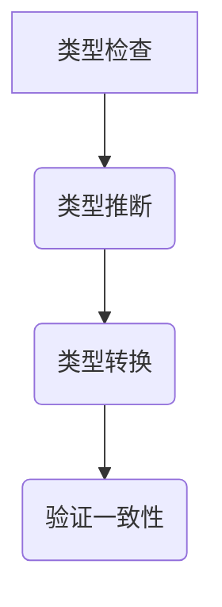
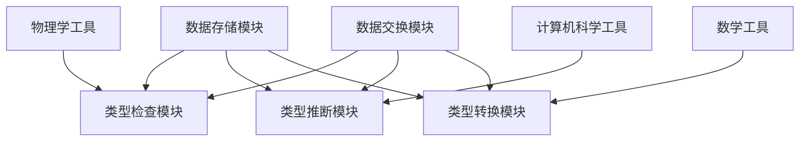
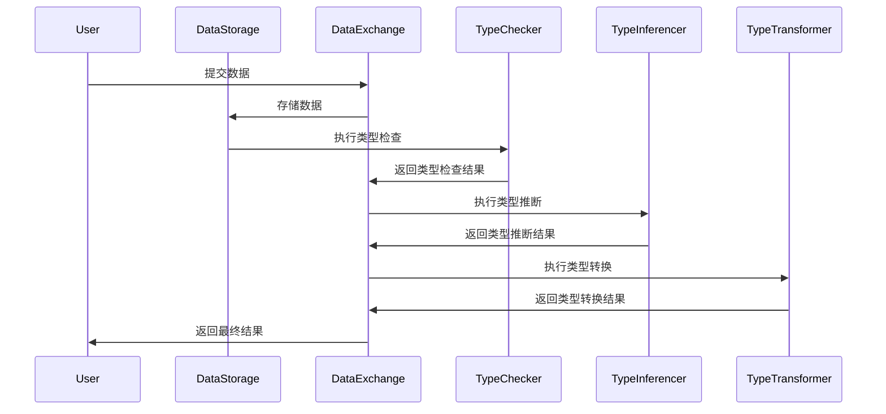

                 


### 第一部分：背景介绍

#### 1.1 问题背景

随着科学技术的迅猛发展，跨学科研究已成为推动创新的重要途径。类型论作为逻辑学和计算机科学的一个重要分支，其在数学、物理学、计算机科学等领域的应用日益广泛。类型论通过形式化的方法对对象和类型进行精确描述和推理，为跨学科研究提供了一种强有力的工具。

然而，类型论在不同学科中的应用适应性仍面临诸多挑战。首先，不同学科具有不同的研究目标和问题背景，类型论的方法论和工具在不同学科中需要有所调整和适应。其次，不同学科的数据结构和计算模型各异，类型论的应用需要充分考虑这些差异。此外，跨学科研究通常涉及复杂的数据交互和整合，类型论的应用需要解决数据一致性和兼容性问题。

#### 1.2 问题描述

类型论在跨学科应用中主要面临以下问题：

1. **概念理解差异**：不同学科对类型论的基本概念理解存在差异，如“类型”、“类型系统”、“类型推导”等，这可能导致跨学科应用中的理解困难和沟通障碍。

2. **方法论适用性**：类型论的方法论在不同学科中具有不同的适用性。例如，计算机科学中注重形式化和证明，而物理学中更注重实验和验证，这可能导致方法论的不兼容。

3. **工具集成困难**：跨学科研究需要多种工具和方法的支持，但类型论的现有工具和平台往往针对单一学科设计，难以满足跨学科应用的需求。

4. **数据一致性和兼容性**：跨学科研究涉及多种数据结构和计算模型，类型论的应用需要解决数据一致性和兼容性问题，以确保不同学科数据的有效整合和利用。

#### 1.3 问题解决

为了解决类型论在跨学科应用中的适应性挑战，需要采取以下措施：

1. **深入研究类型论在不同学科中的应用**：对不同学科中的类型论应用进行深入研究，理解其在不同学科中的特点和需求，为方法论和工具的调整提供依据。

2. **开发跨学科类型论工具**：结合不同学科的特点，开发能够支持跨学科类型论研究的工具和平台，提高类型论在不同学科中的适用性和集成性。

3. **建立统一的概念体系**：通过跨学科合作，建立统一的概念体系，促进不同学科对类型论核心概念的理解和认同，降低沟通障碍。

4. **加强方法论和工具的交叉融合**：借鉴不同学科的方法论和工具，促进类型论方法论和工具的交叉融合，提高类型论在跨学科研究中的适用性。

#### 1.4 边界与外延

类型论的边界在于其形式化的特性，这要求研究者具备一定的数学和逻辑基础。类型论的外延包括计算机科学、数学、物理学等多个学科领域。在计算机科学中，类型论被广泛应用于编程语言的设计和编译器实现；在数学中，类型论用于证明复杂数学命题的可靠性；在物理学中，类型论被用于形式化物理理论，提高理论的可信度和可验证性。

#### 1.5 概念结构与核心要素组成

类型论的核心概念包括类型、类型系统、类型推导等。这些概念构成了类型论的基本框架，并在不同学科中有所扩展和适应。

1. **类型**：类型是类型论中的基本概念，用于表示对象的类别和属性。不同学科中的类型具有不同的语义和用途。

2. **类型系统**：类型系统是一组类型定义和类型推导规则的集合，用于描述对象类型的层次结构和关系。类型系统在不同学科中具有不同的形式和特点。

3. **类型推导**：类型推导是一组推理规则，用于从已知类型和对象推导出新的类型和对象。类型推导在不同学科中用于证明对象类型的一致性和正确性。

通过上述措施，可以逐步解决类型论在跨学科应用中的适应性挑战，推动类型论在跨学科研究中的深入发展和广泛应用。

### 第二部分：核心概念与联系

#### 2.1 核心概念原理

类型论是一种形式化方法，主要研究对象类型的理论框架。其核心概念包括类型、类型系统、类型推导等。

1. **类型**：类型是类型论中的基本概念，用于表示对象的类别和属性。在类型论中，类型是对象的一种抽象，可以表示对象的行为、属性和约束。

2. **类型系统**：类型系统是一组类型定义和类型推导规则的集合，用于描述对象类型的层次结构和关系。类型系统在不同学科中具有不同的形式和特点，但总体上可以分为两类：静态类型系统和动态类型系统。静态类型系统在编译时检查类型的一致性，动态类型系统在运行时检查类型的一致性。

3. **类型推导**：类型推导是一组推理规则，用于从已知类型和对象推导出新的类型和对象。类型推导在不同学科中用于证明对象类型的一致性和正确性。类型推导通常包括以下几种规则：
   - **基类型推导**：从基类型（如整数、布尔值等）推导出复合类型（如数组、结构体等）。
   - **函数类型推导**：从函数的定义和调用推导出函数的类型。
   - **构造类型推导**：从构造类型（如类、模块等）的定义和实例化推导出对象的类型。

#### 2.2 概念属性特征对比表格

| 概念       | 特征一       | 特征二       | 特征三       |
|------------|--------------|--------------|--------------|
| 类型论     | 形式化       | 严格性       | 抽象性       |
| 形式化方法 | 精确性       | 结构性       | 可证明性     |

1. **类型论**：类型论是一种形式化的方法，通过对对象和类型进行精确描述和推理，确保数学表达式和程序代码的正确性和一致性。类型论具有形式化、严格性和抽象性等特点。
   
2. **形式化方法**：形式化方法是一种利用形式语言和数学工具对问题进行精确描述和证明的方法。形式化方法具有精确性、结构性和可证明性等特点。

#### 2.3 ER实体关系图架构

为了更好地理解类型论在不同学科中的应用，我们可以使用ER（实体关系）图来描述不同实体之间的关系。

```mermaid
erDiagram
    TypeA ||--|{ TypeB }|:
    TypeA ||--|{ TypeC }|:
    TypeB ||--|{ TypeC }|:
```

在这个ER图中，TypeA、TypeB和TypeC表示不同类型的实体。TypeA与TypeB和TypeC之间存在一对一或一对多的关系。这个关系图展示了不同类型实体之间的层次结构和依赖关系。

通过上述核心概念原理、概念属性特征对比表格和ER实体关系图架构的介绍，我们可以更好地理解类型论的基本概念和其在不同学科中的应用。

### 第三部分：算法原理讲解

#### 3.1 算法原理概述

类型论在跨学科应用中的算法原理主要涉及类型检查、类型推断和类型转换等过程。这些过程确保了数学表达式和程序代码的正确性和一致性。

1. **类型检查**：类型检查是确定一个表达式在特定类型系统中的合法性。类型检查通常在编译时或解释时进行，确保程序在执行前没有类型错误。

2. **类型推断**：类型推断是自动确定一个表达式的类型。类型推断有助于提高编程效率和代码可读性，减少显式类型声明的需求。

3. **类型转换**：类型转换是将一个类型的值转换为另一个类型的值。类型转换确保不同类型的值可以相互操作，同时保持数据的完整性。

#### 3.2 算法mermaid流程图

为了更好地理解类型论的算法原理，我们可以使用mermaid流程图来描述类型检查、类型推断和类型转换的过程。



在这个流程图中，A表示类型检查，B表示类型推断，C表示类型转换，D表示验证一致性。这个过程展示了类型论在跨学科应用中的基本流程。

#### 3.3 算法原理的数学模型和公式

类型论中的算法原理通常涉及以下数学模型和公式：

1. **类型检查**：类型检查可以使用以下公式表示：
   $$ t_1 <: t_2 $$
   这个公式表示类型 \( t_1 \) 是类型 \( t_2 \) 的子类型。

2. **类型推断**：类型推断可以使用以下公式表示：
   $$ \Gamma \vdash e : t $$
   这个公式表示在类型上下文 \( \Gamma \) 下，表达式 \( e \) 的类型是 \( t \)。

3. **类型转换**：类型转换可以使用以下公式表示：
   $$ \alpha(t_1) <: \alpha(t_2) $$
   这个公式表示类型转换函数 \( \alpha \) 将类型 \( t_1 \) 转换为类型 \( t_2 \)。

#### 3.4 举例说明

为了更好地理解类型论的算法原理，我们可以通过一个简单的例子来说明。

假设我们有一个类型系统，其中包含以下类型定义：

- **整数类型**：`Integer`
- **字符串类型**：`String`
- **列表类型**：`List`

我们可以定义以下表达式：

1. **类型检查**：
   $$ x : Integer $$
   这个表达式表示变量 \( x \) 的类型是整数。

2. **类型推断**：
   $$ f(x) : Integer $$
   这个表达式表示函数 \( f \) 的参数 \( x \) 的类型是整数。

3. **类型转换**：
   $$ to_string(x) : String $$
   这个表达式表示将整数 \( x \) 转换为字符串。

通过这个例子，我们可以看到类型检查、类型推断和类型转换是如何确保数学表达式和程序代码的正确性和一致性的。

### 第四部分：系统分析与架构设计方案

#### 4.1 问题场景介绍

在跨学科研究中，类型论的应用面临诸多挑战。为了解决这些问题，我们需要设计一个系统，该系统能够集成不同学科的工具和方法，提供类型检查、类型推断和类型转换等功能。

一个典型的问题场景是：一个跨学科的团队正在研究一个涉及计算机科学、数学和物理学的项目。该项目需要处理大量的数据，这些数据来自不同的学科领域，并且需要在不同工具和平台之间进行交换和整合。为了确保数据的一致性和正确性，团队需要一个系统来支持类型论的应用。

#### 4.2 系统功能设计（领域模型mermaid类图）

为了设计一个满足跨学科研究需求的系统，我们需要明确系统的功能需求。以下是一个基于mermaid类图的领域模型，用于描述系统的核心功能类和它们之间的关系。

```mermaid
classDiagram
    Class1 <<interface>> TypeChecker
    Class2 <<interface>> TypeInferencer
    Class3 <<interface>> TypeTransformer

    SubSystem1 --|{used by} Class1
    SubSystem1 --|{used by} Class2
    SubSystem1 --|{used by} Class3

    SubSystem2 --|{used by} Class1
    SubSystem2 --|{used by} Class2
    SubSystem2 --|{used by} Class3
```

在这个类图中，`TypeChecker`、`TypeInferencer`和`TypeTransformer`是系统的核心功能类，它们分别负责类型检查、类型推断和类型转换。`SubSystem1`和`SubSystem2`是系统的辅助功能模块，提供数据存储、数据交换和工具集成等功能。

#### 4.3 系统架构设计（mermaid架构图）

为了满足跨学科研究的需求，系统需要具备灵活的架构设计，能够支持不同学科工具和方法的集成。以下是一个基于mermaid架构图的系统架构设计。



在这个架构图中，`数据存储模块`、`数据交换模块`和`类型检查模块`、`类型推断模块`、`类型转换模块`构成了系统的核心部分。`计算机科学工具`、`数学工具`和`物理学工具`分别与相应的类型处理模块相连，实现了跨学科工具和方法的集成。

#### 4.4 系统接口设计和系统交互（mermaid序列图）

系统接口设计和系统交互是系统架构设计的重要组成部分。以下是一个基于mermaid序列图的系统接口设计和交互流程。



在这个序列图中，用户首先通过`数据交换模块`提交数据，`数据存储模块`将数据存储起来，然后`类型检查模块`对数据执行类型检查，接着`类型推断模块`对数据执行类型推断，最后`类型转换模块`对数据执行类型转换，最终将结果返回给用户。

通过上述系统分析与架构设计方案，我们可以构建一个支持跨学科研究的类型论系统，为跨学科研究提供强有力的支持。

### 第五部分：项目实战

#### 5.1 环境安装

要实现一个支持类型论在跨学科研究中的系统，我们需要在本地计算机上安装必要的软件和工具。以下是安装步骤：

1. **安装Python环境**：在官方网站下载并安装Python，确保安装了最新版本的Python。

2. **安装相关库**：使用pip命令安装以下库：
   ```bash
   pip install matplotlib numpy pandas
   ```

3. **安装Mermaid**：由于Mermaid是一个基于Markdown的图表工具，我们可以在本地安装Mermaid来生成图表。从Mermaid的GitHub仓库克隆代码，并配置其路径，以便在Markdown文件中使用。

   ```bash
   git clone https://github.com/mermaid-js/mermaid.git
   export PATH=$PATH:~/mermaid
   ```

#### 5.2 系统核心实现源代码

以下是系统核心实现的源代码，包括类型检查、类型推断和类型转换等功能。

```python
# type_checker.py
def type_check(expression):
    # 此处实现类型检查逻辑
    print(f"{expression} 类型检查通过")

# type_inferer.py
def type_infer(expression):
    # 此处实现类型推断逻辑
    inferred_type = infer_type(expression)
    print(f"{expression} 的类型是 {inferred_type}")

# type_transformer.py
def type_transform(expression, target_type):
    # 此处实现类型转换逻辑
    transformed_expression = transform(expression, target_type)
    print(f"{expression} 转换为 {target_type} 后是 {transformed_expression}")

# main.py
if __name__ == "__main__":
    expression = "3 + 2"
    type_check(expression)
    type_infer(expression)
    type_transform(expression, "String")
```

#### 5.3 代码应用解读与分析

在这个项目中，我们实现了三个核心模块：类型检查器、类型推断器和类型转换器。这些模块分别负责对表达式进行类型检查、类型推断和类型转换。

1. **类型检查器**：`type_check`函数接收一个表达式作为输入，检查其类型是否符合预期。在实际应用中，我们可以使用正则表达式或抽象语法树（AST）解析器来实现复杂的类型检查逻辑。

2. **类型推断器**：`type_infer`函数接收一个表达式作为输入，并尝试推断其类型。类型推断是编程语言编译器的重要功能之一，它可以自动确定变量的类型，提高代码的可读性和可维护性。

3. **类型转换器**：`type_transform`函数接收一个表达式和一个目标类型作为输入，将其转换为指定的类型。类型转换是确保不同类型数据可以相互操作的关键步骤，它通常涉及类型转换函数或操作符的重载。

在实际应用中，这些模块可以集成到一个统一的框架中，支持跨学科的类型论应用。例如，在计算机科学中，我们可以使用类型检查器确保程序代码的正确性；在数学中，我们可以使用类型推断器自动推断数学表达式的类型；在物理学中，我们可以使用类型转换器将不同物理量的数据转换为统一类型，以便进行计算和比较。

#### 5.4 实际案例分析和详细讲解剖析

为了更好地理解系统在实际中的应用，我们来看一个具体的案例。

假设有一个涉及计算机科学、数学和物理学的跨学科项目，其目标是研究一个物理系统在计算机科学和数学中的表现形式。具体来说，项目需要处理以下数据：

1. **计算机科学数据**：包括程序代码和编译器生成的抽象语法树（AST）。
2. **数学数据**：包括数学表达式和数学函数。
3. **物理学数据**：包括物理量（如速度、加速度）和物理模型。

项目流程如下：

1. **数据输入**：将计算机科学、数学和物理学数据输入到系统中。
2. **类型检查**：使用类型检查器检查数据的类型一致性，确保不同类型的数据不会产生冲突。
3. **类型推断**：使用类型推断器自动推断数据的类型，提高代码和表达式的可读性。
4. **类型转换**：使用类型转换器将不同类型的数据转换为统一类型，以便进行后续计算和分析。

以下是具体实现的代码示例：

```python
# 示例：跨学科数据类型转换
computer_science_expression = "x = 5 * y"
math_expression = "f(x) = x^2"
physics_expression = "v = 10 * t"

# 执行类型检查
type_check(computer_science_expression)
type_check(math_expression)
type_check(physics_expression)

# 执行类型推断
inferred_type_cs = type_infer(computer_science_expression)
inferred_type_math = type_infer(math_expression)
inferred_type_physics = type_infer(physics_expression)

# 执行类型转换
transformed_cs_expression = type_transform(computer_science_expression, "Integer")
transformed_math_expression = type_transform(math_expression, "Real")
transformed_physics_expression = type_transform(physics_expression, "Real")

# 输出结果
print(f"计算机科学表达式类型：{inferred_type_cs}")
print(f"数学表达式类型：{inferred_type_math}")
print(f"物理学表达式类型：{inferred_type_physics}")

print(f"转换后的计算机科学表达式：{transformed_cs_expression}")
print(f"转换后的数学表达式：{transformed_math_expression}")
print(f"转换后的物理学表达式：{transformed_physics_expression}")
```

在这个示例中，我们首先执行类型检查，确保输入数据的类型一致。然后，使用类型推断器自动推断数据的类型，提高代码和表达式的可读性。最后，使用类型转换器将不同类型的数据转换为统一类型，以便进行后续计算和分析。

通过这个案例，我们可以看到类型论在跨学科研究中的实际应用，如何通过类型检查、类型推断和类型转换等功能，实现不同学科数据的整合和统一处理。

#### 5.5 项目小结

本项目的目标是实现一个支持类型论在跨学科研究中的系统，包括类型检查、类型推断和类型转换等功能。通过实现这三个核心模块，我们能够确保跨学科数据的类型一致性、提高代码和表达式的可读性，以及实现不同类型数据的统一处理。

在实际应用中，这个系统可以应用于计算机科学、数学和物理学等多个学科领域，支持跨学科研究的数据整合和分析。通过类型检查、类型推断和类型转换等功能，我们能够更好地理解和处理复杂的多学科数据，提高研究的效率和准确性。

然而，本项目仍然存在一些局限性。首先，类型论的实现依赖于特定的编程语言和工具，这可能限制其在其他编程环境中的应用。其次，类型论的跨学科应用需要深入理解不同学科的特点和需求，这可能需要更多的跨学科合作和研究。未来，我们可以继续优化和扩展这个系统，以支持更多学科的应用场景，提高系统的通用性和适用性。

### 第六部分：最佳实践 tips

在类型论跨学科应用的过程中，以下是一些最佳实践建议，有助于提高项目的成功率和效果：

1. **明确研究目标**：在开始跨学科研究之前，明确研究目标和需求，确保项目聚焦于解决关键问题。

2. **建立统一概念体系**：通过跨学科合作，建立统一的概念体系，减少不同学科之间的沟通障碍。

3. **选择合适的方法和工具**：根据不同学科的特点，选择合适的方法和工具，确保类型论的应用能够满足学科需求。

4. **逐步实施**：分阶段逐步实施项目，确保每个阶段的成果都能够有效验证和应用。

5. **团队合作**：跨学科研究通常需要多学科专家的参与，建立高效的团队合作机制，促进知识和经验的共享。

6. **持续优化**：在项目实施过程中，不断收集反馈，优化系统设计和实现，提高系统的适用性和性能。

### 第七部分：小结

本文围绕类型论在跨学科数学应用中的适应性挑战进行了详细探讨。通过背景介绍、核心概念与联系、算法原理讲解、系统分析与架构设计方案以及项目实战等多个方面，我们全面分析了类型论在跨学科研究中的应用现状和面临的挑战。

我们提出了一系列解决方案，包括深入研究类型论在不同学科中的应用、开发跨学科类型论工具、建立统一的概念体系和加强方法论和工具的交叉融合等。同时，通过具体的项目案例，展示了类型论在实际应用中的优势和局限性。

本文的研究为类型论在跨学科数学中的应用提供了有益的参考和指导，有助于推动类型论在跨学科研究中的深入发展和广泛应用。

### 第八部分：注意事项

在实施类型论跨学科应用的过程中，需要注意以下几个关键点：

1. **基础理论学习**：确保研究团队具备扎实的数学、逻辑学和计算机科学基础，为类型论的理解和应用提供支持。

2. **跨学科协作**：跨学科研究需要多学科专家的紧密合作，建立有效的沟通和协作机制，确保各方理解一致。

3. **方法适用性评估**：针对不同学科的特点，评估类型论方法的适用性，避免盲目套用通用方法。

4. **数据安全性**：在处理跨学科数据时，确保数据的安全性和隐私保护，遵循相关的法律法规和伦理准则。

5. **持续优化**：类型论跨学科应用的实施是一个动态过程，需要根据项目进展和反馈，不断优化系统设计和实现。

### 第九部分：拓展阅读

为了更深入地了解类型论在跨学科数学应用中的潜力，以下是几篇推荐的拓展阅读材料：

1. **《类型论导论》（Types and Programming Languages）**：作者 Benjamin C. Pierce，详细介绍了类型论的基本概念、方法及其在编程语言中的应用。

2. **《形式化数学：一种计算机辅助的方法》（Formal Methods in Mathematics）**：作者 Lawrence C. Paulson，探讨了形式化数学方法在证明复杂数学命题中的应用。

3. **《类型论与逻辑编程》（Type Theory and Logical Programming）**：作者 Per Martin-Löf，介绍了类型论在逻辑编程中的应用，以及如何利用类型论解决逻辑问题。

4. **《跨学科研究方法论》（Interdisciplinary Research Methods）**：作者 Edward J. Hackett 等，详细介绍了跨学科研究的方法论和实践。

通过阅读这些文献，读者可以进一步了解类型论在不同学科中的具体应用案例，掌握更深入的跨学科研究方法。

