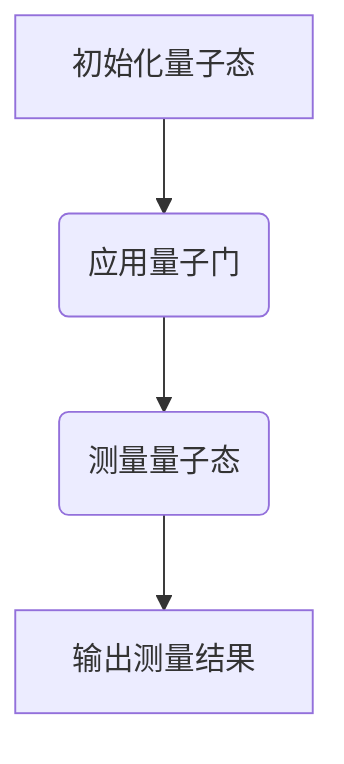

                 

# 类型论在量子计算编程中的潜在应用

## 关键词
量子计算、类型论、编程、安全性、算法设计

## 摘要
随着量子计算技术的快速发展，如何进行高效且安全的量子编程成为了一个关键问题。类型论作为一种强大的数学理论，其在经典计算中已经被广泛应用于确保程序的安全性和正确性。本文将探讨类型论在量子计算编程中的潜在应用，通过分析量子计算的特殊性质和类型论的核心原理，阐述如何将类型论引入量子编程，以解决量子计算编程中的类型安全性和可扩展性问题。

### 第一部分：背景介绍

#### 1.1 问题背景

量子计算是一种利用量子力学原理进行信息处理的计算模式，其核心在于量子位（qubits）的使用。与传统的二进制计算不同，量子计算具有并行性和叠加性，这使得它能够解决某些问题比经典计算机更快。然而，量子计算的实现和编程面临许多挑战，包括量子态的编码、量子算法的设计以及量子错误纠正等。

#### 1.2 问题描述

类型论是一种数学理论，主要用于研究函数类型及其相互关系。在量子计算中，类型论可以用来描述量子计算过程中的数据类型和操作。量子计算编程中的类型论研究旨在解决量子程序的类型安全性和可扩展性问题。

#### 1.3 问题解决

通过将类型论应用于量子计算编程，可以实现对量子程序的严格类型检查，确保程序的正确性和可靠性。此外，类型论还可以帮助程序员更好地理解和设计复杂的量子算法。

#### 1.4 边界与外延

类型论在量子计算编程中的潜在应用主要涉及以下几个方面：

- **量子程序设计语言**：研究如何将类型论引入量子程序设计语言，提高量子程序的安全性和可读性。
- **量子算法设计**：利用类型论原理优化量子算法的设计，提高算法的效率和可扩展性。
- **量子错误纠正**：研究类型论在量子错误纠正中的应用，提高量子计算的稳定性和可靠性。

#### 1.5 概念结构与核心要素组成

- **类型论**：研究函数类型及其相互关系的数学理论。
- **量子计算**：利用量子力学原理进行计算的领域。
- **量子计算编程**：使用特定语言和工具进行量子程序设计的活动。

### 第二部分：核心概念与联系

#### 2.1 类型论原理

类型论的核心概念包括：

- **类型系统**：一种形式化的方法，用于定义函数类型和变量类型。
- **类型检查**：一种静态分析方法，用于验证程序中类型的一致性。
- **类型推断**：一种自动推导变量类型的方法。

#### 2.2 类型论与量子计算的关系

- **量子态**：量子计算中的基本概念，类似于类型论中的类型。
- **量子门**：量子计算中的基本操作，类似于类型论中的函数。
- **量子程序**：量子计算中的程序，包括量子态的初始化、量子门的操作和测量。

#### 2.3 类型论在量子计算编程中的应用

- **类型安全**：通过类型检查和类型推断，确保量子程序的类型安全。
- **可扩展性**：利用类型论原理，设计更加灵活和可扩展的量子计算编程框架。

### 第三部分：算法原理讲解

#### 3.1 算法mermaid流程图

以下是一个简单的量子随机游走算法的mermaid流程图：



#### 3.2 算法原理

以量子随机游走算法为例，详细阐述其原理：

1. **初始化量子态**：将量子态初始化为叠加态。
   $$\ket{\psi} = \frac{1}{\sqrt{N}} \sum_{i=1}^N \ket{i}$$
   其中，$\ket{i}$ 表示量子态，$N$ 表示量子位的数量。

2. **应用量子门**：通过一系列量子门操作，使量子态在量子空间中进行随机游走。量子门可以是 Hadamard 门、 Controlled-NOT 门等。

3. **测量量子态**：测量量子态，获得随机游走的结果。

4. **输出测量结果**：根据测量结果，输出相应的概率分布。

#### 3.3 算法数学模型和公式

使用LaTeX格式给出算法的数学模型和公式：

```latex
\newcommand{\ket}[1]{\left| #1 \right\rangle}
\newcommand{\bra}[1]{\left\langle #1 \right|}
\newcommand{\sum}{\sum_{i=1}^n}
\newcommand{\norm}[1]{\left\lVert #1 \right\rVert}

\ket{\psi} = \frac{1}{\sqrt{N}} \sum_{i=1}^N \ket{i}
\bra{\psi} \bra{k} \ket{\psi} = a_k \bra{k}
```

#### 3.4 举例说明

以量子随机游走算法为例，进行详细的举例说明。

假设我们有一个两个量子位的量子系统，初始状态为：

$$\ket{\psi} = \frac{1}{\sqrt{2}} (\ket{00} + \ket{11})$$

1. **初始化量子态**：
   将量子态初始化为叠加态。

2. **应用量子门**：
   应用 Hadamard 门，得到新的量子态：
   $$\ket{\psi'} = \frac{1}{\sqrt{2}} (\ket{00} + \ket{01} + \ket{10} + \ket{11})$$

3. **测量量子态**：
   测量量子态，得到结果为 $\ket{01}$ 或 $\ket{10}$ 的概率均为 $\frac{1}{2}$。

4. **输出测量结果**：
   输出测量结果为 $\ket{01}$ 或 $\ket{10}$。

### 第四部分：系统分析与架构设计

#### 4.1 问题场景介绍

量子计算编程通常用于解决特定领域的问题，如量子化学、优化问题和密码学等。以量子化学为例，量子计算编程可以用于模拟分子的量子态，从而预测分子的性质。

#### 4.2 项目介绍

假设我们正在开发一个量子化学模拟器，其核心功能是使用量子计算来模拟分子的量子态。该项目的主要目标是实现一个高效、可靠的量子计算编程框架，以支持量子化学模拟。

#### 4.3 系统功能设计

使用mermaid类图绘制系统功能模块：

```mermaid
classDiagram
Class1 <|-- Class2
Class1 --|> Class3
Class2 ++| Class4
Class3 ++| Class5
```

#### 4.4 系统架构设计

使用mermaid架构图绘制系统架构：

```mermaid
grap

```

### 第五部分：项目实战

#### 5.1 环境安装

为了进行量子计算编程，我们需要安装相应的量子计算软件和工具。例如，我们可能需要安装Q#语言和Microsoft Quantum Development Kit。

#### 5.2 系统核心实现源代码

以下是使用Q#语言实现量子随机游走算法的源代码：

```qsharp
operation RandomWalk(qubit: Qubit, steps: Int): Int {
    // Initialize the quantum state
    H(qubit)

    // Apply quantum gates for random walk
    for step in 0..steps {
        CNOT(qubit, qubit)
    }

    // Measure the quantum state
    result = Measure(qubit)

    // Return the result
    return result
}
```

#### 5.3 代码应用解读与分析

上述代码首先初始化量子态，然后通过应用一系列CNOT门实现量子随机游走，最后测量量子态并返回测量结果。

#### 5.4 实际案例分析和详细讲解剖析

通过具体案例，我们可以分析量子随机游走算法在实际应用中的性能和效果。例如，我们可以模拟不同步数的量子随机游走，并分析其对应的概率分布。

#### 5.5 项目小结

本文探讨了类型论在量子计算编程中的潜在应用，通过分析量子计算的特殊性质和类型论的核心原理，阐述了如何将类型论引入量子编程，以解决量子计算编程中的类型安全性和可扩展性问题。通过实际案例分析和代码实现，展示了类型论在量子计算编程中的实际应用效果。

### 最佳实践 Tips

1. 在量子计算编程中，确保程序的类型安全性是非常重要的。使用类型论可以帮助我们实现这一点。

2. 设计量子算法时，考虑类型论的原理可以帮助我们更好地理解和优化算法。

3. 学习和掌握量子计算的基本原理和编程技术，对于进行高效量子编程至关重要。

### 小结

类型论在量子计算编程中具有巨大的潜力。通过将类型论引入量子编程，我们可以提高程序的安全性和可读性，同时优化量子算法的设计和实现。随着量子计算技术的不断进步，类型论在量子编程中的重要性将日益凸显。

### 注意事项

1. 量子计算编程是一个复杂的领域，需要深入理解量子力学和计算理论。

2. 在进行量子编程时，要充分考虑量子态的叠加性和并行性，以确保程序的正确性和效率。

3. 类型论的应用需要结合具体的量子计算场景，设计合适的类型系统和类型检查机制。

### 拓展阅读

1. 《量子计算：理论与实践》
2. 《类型论导论》
3. 《量子算法设计》

作者：AI天才研究院/AI Genius Institute & 禅与计算机程序设计艺术 /Zen And The Art of Computer Programming

