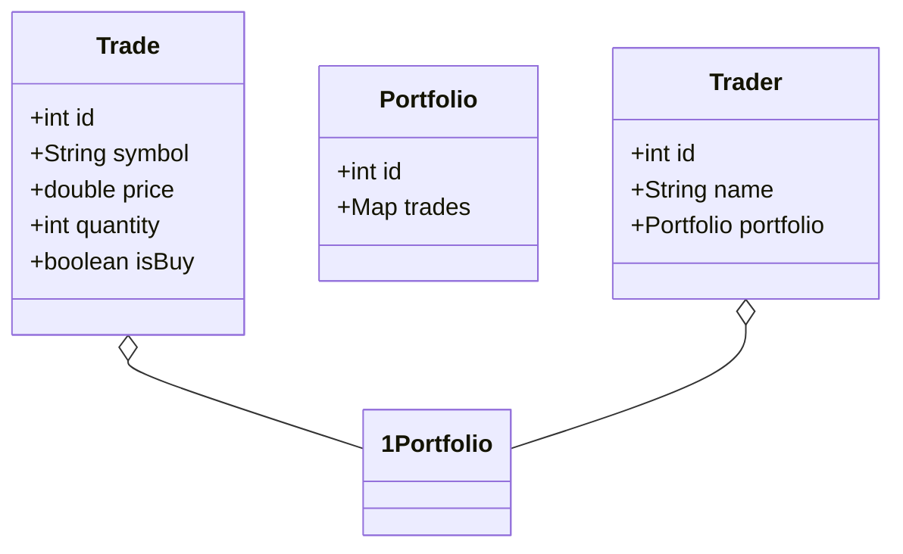
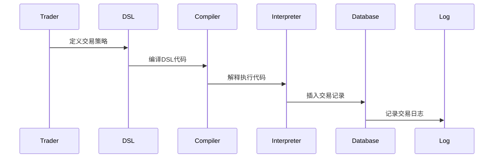
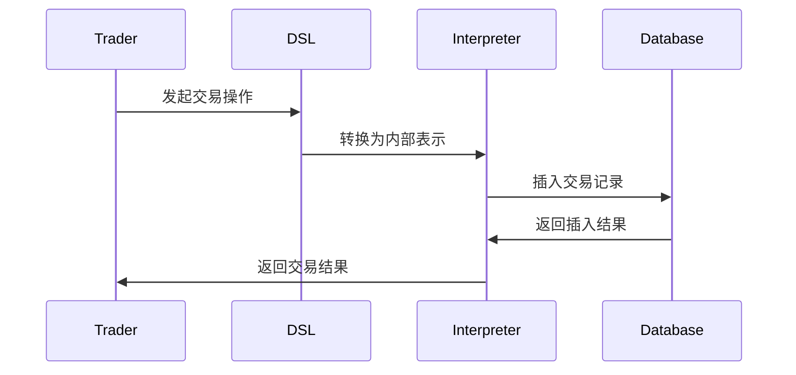
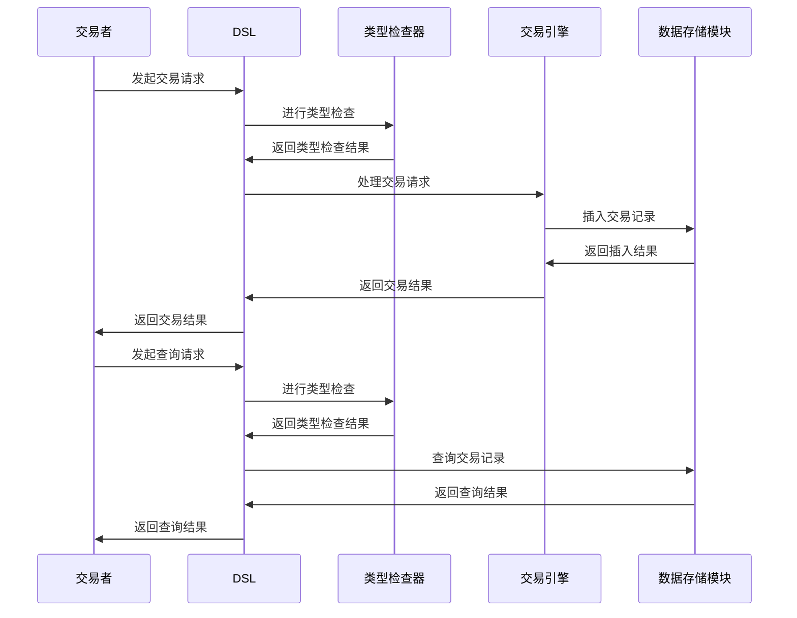

                 

## 文章标题

### 关键词

- 类型论
- 领域特定语言（DSL）
- 类型系统
- 类型安全
- 编译器设计

### 摘要

本文深入探讨了类型论在领域特定语言（DSL）设计中的应用。类型论作为计算机科学中一个重要的理论基础，为软件开发提供了强有力的工具，特别是在DSL设计领域。文章首先介绍了类型论和DSL的基本概念，然后详细阐述了类型论在DSL设计中的优势和作用。通过具体案例分析和最佳实践分享，文章帮助读者理解如何在实际项目中应用类型论来提高DSL设计的效率和质量。最后，文章展望了类型论在DSL设计领域的未来发展趋势，为读者提供了研究方向和实践建议。

---

## 引言与背景介绍

### 1.1 类型论概述

类型论是计算机科学中的一个重要分支，主要研究程序中的类型系统。其核心目标是确保程序的正确性和安全性。类型论的基本概念包括类型、类型系统、类型检查和类型推断等。类型（Type）是程序中数据的分类，它定义了数据的操作方式和约束条件。类型系统（Type System）是一组规则，用于定义如何为程序中的值分配类型，以及如何进行类型检查和类型推断。类型检查（Type Checking）是在编译或解释程序时，验证程序中的表达式和操作是否遵循预定义的类型规则。类型推断（Type Inference）是编译器自动推导出变量或表达式的类型，而无需显式声明。

类型论的发展可以追溯到20世纪50年代，其中Lisp语言的引入被认为是类型论发展的一个重要里程碑。随后，随着函数式编程语言如Haskell和ML的兴起，类型论的研究得到了进一步的发展和完善。在编程语言设计中，类型论不仅提供了类型安全性和错误检测能力，还为程序的优化和编译提供了强有力的支持。

### 1.2 领域特定语言介绍

领域特定语言（Domain-Specific Language，DSL）是一种专门为解决特定领域问题而设计的编程语言。与通用编程语言（如Python、Java）不同，DSL专注于特定领域的语言特性和抽象，从而提高了开发效率和代码的可读性。DSL的设计原则包括简洁性、易用性和高效性，它们使得开发者能够更加专注于领域问题的解决方案，而不是通用编程语言的语法和库。

DSL的应用范围非常广泛，包括金融、医疗、网络通信、自动化测试等多个领域。例如，在金融领域，DSL可以用于自动化交易和风险评估；在医疗领域，DSL可以用于电子病历管理和医学图像处理；在网络通信领域，DSL可以用于网络协议设计和网络管理。

### 1.3 类型论在领域特定语言设计中的意义

类型论在领域特定语言设计中的应用具有重要意义。首先，类型论提供了类型安全性和错误检测能力，可以确保DSL的正确性和稳定性。通过严格的类型检查和类型推断机制，DSL可以自动检测出潜在的类型错误，从而减少运行时的错误和崩溃。

其次，类型论提高了DSL的可读性和可维护性。通过明确的数据类型和操作规则，DSL的代码更加简洁和直观，便于开发和维护。类型论还支持泛型编程和高级类型系统，使得DSL能够更好地支持复用和扩展。

最后，类型论为DSL的编译和优化提供了基础。类型系统的定义和类型检查算法可以指导编译器生成高效的目标代码，从而提高程序的性能。此外，类型论还为静态分析和程序优化提供了丰富的信息，有助于提高编译器的优化能力和程序的执行效率。

总之，类型论在领域特定语言设计中的应用不仅提高了DSL的质量和可靠性，还为软件开发带来了更高的效率和灵活性。在接下来的章节中，我们将进一步探讨类型论在DSL设计中的具体应用和实践。

### 1.4 文章结构概述

本文将分为八个主要部分，系统性地探讨类型论在领域特定语言（DSL）设计中的应用。具体章节安排如下：

1. **引言与背景介绍**：介绍类型论和领域特定语言的基本概念，阐述类型论在DSL设计中的重要性。
   
2. **类型论基础**：详细解释类型论的基本概念、类型系统的分类以及类型检查与类型推断的原理。

3. **类型论在DSL设计中的应用**：探讨类型论在DSL设计中的优势，包括类型安全性和错误检测等方面。

4. **案例分析**：通过具体案例分析，展示类型论在金融、网络通信和医疗健康等领域的应用实例。

5. **高级类型论主题**：深入探讨高级类型系统、泛型编程和类型安全与类型验证等高级主题。

6. **在DSL中实现类型论**：讨论如何在DSL中实现类型系统，包括编译器和解释器设计、类型检查和类型推断算法。

7. **最佳实践与挑战**：分享在DSL设计中使用类型论的最佳实践，分析设计挑战及其解决策略。

8. **结论与未来方向**：总结研究现状，展望类型论在DSL设计领域的未来发展趋势，为读者提供研究方向和实践建议。

通过这种结构化的文章安排，读者可以系统地了解类型论在DSL设计中的应用，从基础概念到高级应用，全面掌握类型论在软件开发中的价值和实践方法。

### 2.1 类型论基础

类型论的基础概念和理论构成了其在计算机科学中的核心。为了深入理解类型论在领域特定语言（DSL）设计中的应用，我们需要首先掌握其基本概念，包括类型、类型系统、类型检查和类型推断等。

#### 2.1.1 类型（Type）

类型是程序中数据的分类，它定义了数据的操作方式和约束条件。在类型论中，类型是一个抽象的集合，它包含了具有相同属性和操作的一组值。类型系统通过定义不同的类型类别，如基础类型、复合类型和函数类型，来描述程序中的数据结构。

- **基础类型**：如整数（Integer）、浮点数（Float）、布尔（Boolean）和字符串（String）等。
- **复合类型**：如数组（Array）、记录（Record）和结构体（Structure）等。
- **函数类型**：定义了函数的参数类型和返回类型，如`Int -> Int`表示一个接收整数并返回整数的函数。

#### 2.1.2 类型系统（Type System）

类型系统是一组规则，用于定义如何为程序中的值分配类型，以及如何进行类型检查和类型推断。类型系统可以分为静态类型系统和动态类型系统。

- **静态类型系统**：在编译时进行类型检查，确保程序在运行前符合类型规则。Java和C++是静态类型语言的例子。
- **动态类型系统**：在运行时进行类型检查，允许类型在程序运行时动态确定。Python和JavaScript是动态类型语言的例子。

类型系统的主要功能包括：
- **类型安全**：确保类型兼容性，防止非法类型转换导致的运行时错误。
- **错误检测**：通过类型检查发现潜在的错误，提高程序的可靠性和稳定性。
- **程序优化**：类型信息可以指导编译器进行代码优化，提高程序的性能。

#### 2.1.3 类型检查（Type Checking）

类型检查是类型系统的核心功能之一，它在编译或解释程序时验证程序中的表达式和操作是否遵循预定义的类型规则。类型检查可以分为以下几种：

- **语法类型检查**：在语法分析阶段检测语法错误，如变量未定义、类型不匹配等。
- **语义类型检查**：在语义分析阶段检查程序语义的正确性，如函数调用参数类型与定义不符等。
- **类型一致性检查**：确保程序中的类型关系一致，如变量声明类型与实际使用类型一致。

#### 2.1.4 类型推断（Type Inference）

类型推断是编译器自动推导出变量或表达式的类型，而无需显式声明。类型推断可以分为以下几种：

- **简单类型推断**：通过分析变量声明和表达式上下文，推导出变量的类型。
- **存在类型推断**：通过分析函数调用和函数定义，推导出函数参数和返回值的类型。
- **上下文类型推断**：结合程序的上下文环境，推导出变量和表达式的类型。

类型推断的优点包括：
- **提高代码可读性**：无需显式声明类型，使代码更加简洁。
- **提高编译效率**：减少类型声明的处理时间，加快编译速度。

通过类型论的基础概念，我们可以更好地理解类型系统在DSL设计中的作用。类型论为DSL提供了严格的数据类型定义和操作规则，使得DSL能够更好地支持领域特定问题的抽象和解决。在接下来的章节中，我们将进一步探讨类型论在DSL设计中的应用和优势。

### 2.2 类型系统的分类

类型系统在计算机科学中扮演着至关重要的角色，其分类方法多种多样，可以根据不同的标准进行划分。以下是几种常见的类型系统分类方式：

#### 2.2.1 静态类型系统与动态类型系统

**静态类型系统**和**动态类型系统**是最基本的类型系统分类方法。

- **静态类型系统**：在编译时进行类型检查，确保程序在运行前符合类型规则。Java、C++和TypeScript都是静态类型语言的例子。静态类型系统的主要优点包括类型安全性高、错误检测能力强以及编译器可以进行更高效的代码优化。
- **动态类型系统**：在运行时进行类型检查，允许类型在程序运行时动态确定。Python、JavaScript和Ruby都是动态类型语言的例子。动态类型系统的主要优点是代码编写更加灵活，类型声明更为简洁，但可能会牺牲一定的性能和安全性。

#### 2.2.2 强类型系统与弱类型系统

**强类型系统**和**弱类型系统**是另一种常见的分类方式。

- **强类型系统**：对类型转换有严格的限制，以确保程序中的类型一致性。强类型系统要求在编译时明确变量类型，并在运行时严格检查类型转换。强类型系统的主要优点包括类型安全性高、程序错误少，但可能降低编程灵活性。
- **弱类型系统**：对类型转换的限制较少，允许更灵活的类型转换。弱类型系统通常不需要显式声明变量类型，或者允许在运行时动态确定类型。弱类型系统的主要优点是编程灵活，但可能会增加运行时错误的风险。

#### 2.2.3 面向对象类型系统与函数类型系统

- **面向对象类型系统**：基于面向对象编程（OOP）的理念，类型系统通过类和对象来描述程序的结构。面向对象类型系统支持封装、继承和多态等特性，有助于提高代码的可重用性和可维护性。
- **函数类型系统**：基于函数式编程（FP）的理念，类型系统通过函数和值来描述程序的行为。函数类型系统支持高阶函数、不可变数据和类型推导等特性，有助于提高程序的纯度和表达力。

#### 2.2.4 静态类型检查与动态类型检查

- **静态类型检查**：在编译时进行类型检查，确保程序在运行前符合类型规则。静态类型检查的优点包括错误检测早、编译速度快，但可能影响代码灵活性。
- **动态类型检查**：在运行时进行类型检查，允许类型在程序运行时动态确定。动态类型检查的优点包括代码灵活、类型声明简洁，但可能会影响性能和安全性。

#### 2.2.5 其他分类方法

除了上述分类方式，还有一些其他的分类方法，如：

- **强类型参数化**：在函数或方法中，参数类型和返回类型预先确定，函数的行为在编译时完全确定。
- **类型推断机制**：根据程序上下文和表达式语义自动推导类型，无需显式声明。
- **类型安全性**：通过类型系统确保程序的安全性，防止类型错误和未定义行为。

通过以上分类，我们可以更好地理解不同类型系统的特点和适用场景。类型系统在DSL设计中的选择应根据具体需求和目标，综合考虑类型安全性、编译效率和编程灵活性等因素。在接下来的章节中，我们将进一步探讨类型系统在DSL设计中的具体应用和优势。

### 2.3 类型检查与类型推断

类型检查（Type Checking）和类型推断（Type Inference）是类型系统的核心组成部分，它们在确保程序正确性和提高编译效率方面发挥着至关重要的作用。

#### 2.3.1 类型检查

类型检查是指在编译或解释程序时，通过一系列规则来验证程序中的表达式和操作是否遵循预定义的类型规则。类型检查的主要目标是确保类型安全，防止非法类型转换导致的运行时错误。

类型检查可以分为以下几种类型：

- **语法类型检查**：在语法分析阶段检测语法错误，如变量未定义、类型不匹配等。语法类型检查是编译器的基本功能，它确保程序结构正确。
- **语义类型检查**：在语义分析阶段检查程序语义的正确性，如函数调用参数类型与定义不符、变量未初始化等。语义类型检查是确保程序逻辑正确的重要步骤。
- **类型一致性检查**：确保程序中的类型关系一致，如变量声明类型与实际使用类型一致、函数的参数和返回类型符合预期等。类型一致性检查有助于提高程序的可靠性和稳定性。

类型检查的优点包括：
- **错误检测早**：通过在编译时检测类型错误，可以及早发现并修复程序中的问题，减少运行时错误的风险。
- **提高编译效率**：类型检查提供的信息有助于编译器进行代码优化，提高编译速度和程序性能。
- **提高程序质量**：严格的类型检查机制有助于提高程序的可维护性和可读性，降低bug的出现率。

#### 2.3.2 类型推断

类型推断是编译器自动推导出变量或表达式的类型，而无需显式声明。类型推断通过分析程序上下文和表达式语义，推断出最合适的类型，从而简化代码编写和编译过程。

类型推断可以分为以下几种类型：

- **简单类型推断**：通过分析变量声明和表达式上下文，推导出变量的类型。例如，在`x = 5 + 3`中，编译器可以推断出`x`的类型为整数。
- **存在类型推断**：通过分析函数调用和函数定义，推导出函数参数和返回值的类型。例如，在`func(x) { return x * 2; }`中，编译器可以推断出`func`的参数类型为整数，返回类型为整数。
- **上下文类型推断**：结合程序的上下文环境，推导出变量和表达式的类型。上下文类型推断通常更为复杂，需要综合考虑多种因素。

类型推断的优点包括：
- **提高代码可读性**：无需显式声明类型，使代码更加简洁和直观。
- **提高编译效率**：减少类型声明的处理时间，加快编译速度。
- **增强编程灵活性**：类型推断允许更灵活的编程方式，特别是在动态类型系统中。

#### 2.3.3 类型检查与类型推断的关系

类型检查和类型推断密切相关，它们共同构成了类型系统的核心功能。类型检查主要负责验证程序中的类型规则，确保程序的正确性和安全性。类型推断则通过自动推导类型，简化代码编写过程，提高编译效率。

在编译过程中，类型检查和类型推断通常交替进行：

1. **类型推断**：首先进行类型推断，尝试自动推导出变量和表达式的类型。
2. **类型检查**：接着进行类型检查，验证推断出的类型是否满足预定义的类型规则。
3. **迭代修正**：如果类型检查发现类型不匹配，编译器可能会调整类型推断的结果，并重新进行类型检查。

通过这种迭代过程，编译器可以逐步确定程序中的类型，确保程序的类型安全和正确性。

总之，类型检查和类型推断是类型系统的核心组成部分，它们在确保程序正确性和提高编译效率方面发挥着重要作用。在领域特定语言（DSL）设计中，类型检查和类型推断有助于提高DSL的可靠性和可维护性，从而更好地支持领域问题的抽象和解决。在接下来的章节中，我们将进一步探讨类型论在DSL设计中的具体应用和优势。

### 3.1 DSL设计原则

领域特定语言（DSL）的设计原则是确保DSL有效、易用且高效的关键。以下是一些核心的设计原则：

#### 3.1.1 简洁性

简洁性是DSL设计的一个重要原则。DSL应尽量避免复杂的语法和冗余的代码，以便开发者能够快速理解和使用。简洁的DSL可以减少学习成本，提高开发效率。例如，在金融领域的DSL中，可以设计简洁的表达式来处理复杂的金融计算。

#### 3.1.2 易用性

易用性是衡量DSL设计优劣的重要指标。一个优秀的DSL应该具有直观的语法和清晰的语义，使得开发者能够轻松地编写和理解代码。为了提高易用性，DSL的设计应遵循常见的编程模式和领域习惯，并提供丰富的文档和示例代码。

#### 3.1.3 高效性

DSL设计还应考虑高效性，确保DSL编写的程序能够高效执行。这包括优化语法解析、编译器和运行时性能。例如，在性能敏感的网络通信领域，DSL应设计高效的协议处理和数据处理机制。

#### 3.1.4 可扩展性

可扩展性是DSL设计的长期考量。一个优秀的DSL应支持模块化设计和扩展，使得开发者能够根据需求灵活地添加新功能和特性。例如，在医疗健康领域的DSL中，可以设计扩展点，以便添加新的医学计算和分析功能。

#### 3.1.5 类型安全性

类型安全性是DSL设计的关键原则之一。通过严格的类型检查和类型推断机制，DSL可以确保程序的正确性和稳定性。类型安全性不仅可以防止运行时错误，还可以提高代码的可维护性和可靠性。例如，在金融领域的DSL中，类型安全性可以确保交易的金额和数据类型正确无误。

#### 3.1.6 可维护性

可维护性是DSL设计的一个长期目标。一个优秀的DSL应易于维护和升级，以便适应不断变化的需求。为了提高可维护性，DSL应采用模块化设计，清晰的文档和良好的代码风格也是必不可少的。

#### 3.1.7 互操作性

互操作性是DSL设计中的重要考虑。一个DSL应能够与其他系统和技术无缝集成，以便实现跨领域的数据交换和协同工作。例如，在医疗健康领域的DSL中，应能够与其他医疗设备和系统互操作，以实现全面的数据共享和诊疗支持。

通过遵循这些设计原则，DSL可以更好地满足特定领域的需求，提高开发效率和程序质量。在接下来的章节中，我们将进一步探讨类型论在DSL设计中的应用，以及如何通过类型论提高DSL的可靠性和可维护性。

### 3.2 类型论在DSL设计中的优势

类型论在领域特定语言（DSL）设计中的应用具有显著的优点，这些优势不仅提高了DSL的质量，还显著增强了其可靠性、可维护性和易用性。

#### 3.2.1 类型安全

类型安全是类型论在DSL设计中最显著的优势之一。通过严格的类型检查和类型推断机制，DSL可以确保程序在编译或运行时不会出现类型错误。类型安全有助于减少运行时错误，提高程序的稳定性。例如，在金融领域，确保交易金额和数据类型的正确性是至关重要的。类型论可以帮助识别并防止潜在的错误，从而确保金融应用的安全和可靠性。

#### 3.2.2 错误检测

类型论提供了强大的错误检测能力，可以在编译阶段发现潜在的运行时错误。类型检查机制能够检测出类型不匹配、未初始化变量、函数参数错误等问题，从而在程序运行前进行修复。这种早期错误检测有助于减少调试时间和开发成本。例如，在网络通信领域，类型检查可以确保数据包的格式和内容符合协议要求，防止数据传输错误。

#### 3.2.3 可读性和可维护性

类型论提高了DSL代码的可读性和可维护性。通过明确的数据类型和操作规则，DSL的代码更加简洁和直观，使得开发者更容易理解和维护。类型安全性和类型推断机制有助于减少代码中的冗余，提高代码的清晰度和一致性。例如，在医疗健康领域的DSL中，清晰的类型定义可以确保医疗数据的正确处理，使得系统更加可靠和易维护。

#### 3.2.4 支持泛型编程

类型论支持泛型编程，这使得DSL能够更好地支持复用和扩展。泛型编程允许在类型级别进行抽象，使得相同的代码可以适用于多种类型的数据。这有助于减少代码重复，提高代码的灵活性和可维护性。例如，在金融领域的DSL中，泛型编程可以用于处理不同类型的金融产品，如股票、债券和期货。

#### 3.2.5 性能优化

类型论还可以帮助编译器进行性能优化。类型信息可以指导编译器生成更高效的代码，从而提高程序的执行效率。类型推断机制可以减少类型声明的处理时间，加快编译速度。类型安全机制还可以帮助编译器进行静态分析，从而进行更有效的优化。例如，在网络通信领域，类型论可以帮助编译器生成高效的协议处理代码，提高网络传输的效率。

#### 3.2.6 集成工具和库

类型论为DSL的集成工具和库提供了支持。类型信息可以与调试器、静态分析工具和测试框架等集成，从而提高开发效率和程序质量。例如，在医疗健康领域的DSL中，类型信息可以与医疗数据分析和可视化工具集成，实现更高效的医疗数据处理和诊断。

总之，类型论在DSL设计中的应用提供了多方面的优势，从类型安全、错误检测、可读性和可维护性，到性能优化和工具集成，都为DSL的设计和开发提供了强有力的支持。在接下来的章节中，我们将通过具体案例展示类型论在DSL设计中的应用，进一步说明其有效性和实用性。

### 4.1 案例一：金融领域

在金融领域，领域特定语言（DSL）的设计和实现已经取得了显著成果，类型论在其中发挥了重要作用。以下是一个具体的案例，展示类型论如何帮助设计一个用于自动化金融交易的DSL。

#### 案例背景

金融领域的自动化交易对市场流动性、风险管理和交易效率至关重要。然而，传统的通用编程语言在处理金融计算和交易逻辑时存在一定的局限性，例如类型不安全性、错误检测不彻底等问题。为了提高金融交易的准确性和稳定性，一个基于类型论设计的DSL被提出。

#### DSL设计原则

1. **类型安全性**：确保交易数据类型的一致性和正确性。
2. **易用性**：简化交易逻辑的编写和测试。
3. **高效性**：优化交易执行的性能。
4. **可扩展性**：支持新交易策略和产品的快速集成。

#### 类型论的应用

在金融DSL的设计中，类型论的应用主要体现在以下几个方面：

- **基础类型定义**：定义常见的金融数据类型，如货币（Currency）、价格（Price）、数量（Quantity）等。
- **复合类型构建**：构建复杂的金融产品类型，如期权（Option）、期货（Future）、债券（Bond）等。
- **类型检查**：确保交易逻辑中所有的数据类型符合预定义的规则，防止非法类型转换和错误操作。
- **类型推断**：自动推导变量和表达式的类型，减少显式类型声明的需要。

#### 系统架构

金融DSL的系统架构包括以下几个方面：

1. **编译器**：负责将DSL代码编译成中间表示或目标代码。
2. **解释器**：执行编译后的DSL代码，处理金融交易逻辑。
3. **交易引擎**：实现具体的交易逻辑，与金融市场和交易系统进行交互。
4. **类型检查器**：在编译阶段进行类型检查，确保代码类型安全。

#### 实际应用

金融DSL在以下方面得到了实际应用：

- **交易策略编写**：开发者可以使用DSL编写各种交易策略，如均值回归策略、动量策略等，便于测试和优化。
- **风险管理**：DSL可以处理复杂的风险计算，如价值在风险（VaR）、条件价值在风险（CVaR）等。
- **数据可视化**：DSL代码可以与数据可视化工具集成，帮助分析师和交易员更好地理解和分析市场数据。

#### 结果与评估

类型论在金融DSL中的应用取得了以下成果：

- **提高交易准确性**：通过严格的类型检查和类型推断，减少运行时错误，提高交易代码的可靠性。
- **缩短开发周期**：DSL简洁的语法和直观的类型系统使得交易逻辑的编写和测试更加高效。
- **提升性能**：类型信息有助于编译器生成更高效的交易执行代码，提高整体交易系统的性能。

综上所述，类型论在金融领域特定语言设计中的应用不仅提高了DSL的质量和可靠性，还为金融交易系统的开发提供了强有力的支持。通过类型安全、高效性和易用性，金融DSL为开发者提供了一个强大的工具，使得金融交易更加智能化和自动化。

### 4.2 案例二：网络通信领域

在网络通信领域，领域特定语言（DSL）的设计和应用已经取得了显著成效，特别是在网络协议设计和数据传输方面。以下是一个具体案例，展示类型论如何帮助设计一个用于网络通信的DSL。

#### 案例背景

网络通信领域面临着复杂的数据结构和多样的通信协议，传统的通用编程语言难以满足这一领域的特定需求。类型论的应用为网络通信DSL提供了强有力的支持，通过严格的类型检查和类型推断机制，提高网络协议的可靠性和数据传输的效率。

#### DSL设计原则

1. **类型安全性**：确保数据传输过程中数据类型的一致性和正确性，防止类型错误和未定义行为。
2. **可扩展性**：支持不同协议和传输需求的扩展和集成。
3. **高效性**：优化数据解析和传输性能。
4. **易维护性**：简化协议设计和实现，便于后续维护和升级。

#### 类型论的应用

在通信DSL的设计中，类型论的应用主要体现在以下几个方面：

- **基础类型定义**：定义常见的数据类型，如字节（Byte）、短整数（Short）、长整数（Long）等。
- **复合类型构建**：构建复杂的网络数据结构，如数据包（Packet）、帧（Frame）、报文（Message）等。
- **类型检查**：确保数据结构和协议规则符合预定义的类型规则，防止数据解析和传输过程中的错误。
- **类型推断**：自动推导数据类型，减少显式类型声明的需要，简化代码编写。

#### 系统架构

通信DSL的系统架构包括以下几个方面：

1. **编译器**：将DSL代码编译成中间表示或目标代码。
2. **解释器**：执行编译后的DSL代码，处理网络数据解析和传输。
3. **协议栈**：实现具体的网络协议，如TCP、UDP、HTTP等。
4. **类型检查器**：在编译阶段进行类型检查，确保代码类型安全。

#### 实际应用

通信DSL在网络通信领域有以下实际应用：

- **协议设计与实现**：DSL可以简化TCP/IP、HTTP/2等协议的设计和实现，提高协议的稳定性和效率。
- **数据传输与解析**：DSL用于处理复杂的网络数据结构，确保数据传输的正确性和高效性。
- **网络管理**：DSL可以用于网络设备的配置和管理，提高网络运维的自动化水平。

#### 结果与评估

类型论在通信DSL中的应用取得了以下成果：

- **提高数据传输可靠性**：通过严格的类型检查和类型推断，减少数据解析和传输过程中的错误，提高网络通信的可靠性。
- **提升性能**：类型信息有助于优化数据解析和传输的代码，提高整体网络通信的效率。
- **简化开发与维护**：DSL简洁的语法和直观的类型系统使得协议设计和实现更加高效，便于后续维护和升级。

综上所述，类型论在网络通信领域特定语言设计中的应用，不仅提高了DSL的可靠性和性能，还为网络通信系统的开发和优化提供了强有力的支持。通过类型安全、高效性和易用性，通信DSL为网络工程师提供了一个强大的工具，使得网络通信更加智能和稳定。

### 4.3 案例三：医疗健康领域

在医疗健康领域，领域特定语言（DSL）的应用极大地提升了医疗数据处理和医疗诊断的效率和准确性。以下是一个具体案例，展示类型论如何帮助设计一个用于医疗健康领域的DSL。

#### 案例背景

医疗健康领域涉及到大量复杂的数据类型和处理流程，包括患者信息、医疗记录、诊断数据和药物配方等。传统的通用编程语言在处理这些特定领域的数据时存在局限，难以满足医疗应用的高精度和高可靠性要求。类型论的应用为医疗健康DSL提供了强有力的支持，通过严格的类型检查和类型推断机制，提高医疗数据处理和诊断的准确性和稳定性。

#### DSL设计原则

1. **类型安全性**：确保医疗数据的类型一致性和正确性，防止非法数据操作和错误。
2. **可扩展性**：支持不同医疗应用场景的扩展和集成。
3. **高效性**：优化医疗数据处理和分析的效率。
4. **易维护性**：简化医疗数据处理和诊断逻辑的编写和维护。

#### 类型论的应用

在医疗健康DSL的设计中，类型论的应用主要体现在以下几个方面：

- **基础类型定义**：定义常见的医疗数据类型，如患者ID（PatientID）、诊断代码（DiagnosisCode）、药物剂量（DrugDose）等。
- **复合类型构建**：构建复杂的医疗数据结构，如电子病历（EHR）、处方（Prescription）、医疗图像（MedicalImage）等。
- **类型检查**：确保医疗数据处理过程中数据类型的一致性和正确性，防止类型错误和未定义行为。
- **类型推断**：自动推导医疗数据的类型，减少显式类型声明的需要，简化代码编写。

#### 系统架构

医疗健康DSL的系统架构包括以下几个方面：

1. **编译器**：将DSL代码编译成中间表示或目标代码。
2. **解释器**：执行编译后的DSL代码，处理医疗数据处理和分析逻辑。
3. **医疗数据处理模块**：实现具体的医疗数据处理和分析功能，如数据清洗、数据转换、诊断预测等。
4. **类型检查器**：在编译阶段进行类型检查，确保代码类型安全。

#### 实际应用

医疗健康DSL在以下方面得到了实际应用：

- **电子病历管理**：DSL可以用于电子病历的录入、查询和管理，提高病历数据的准确性和一致性。
- **诊断预测**：DSL可以用于医疗数据的诊断预测，如疾病筛查、疾病分类和风险评估。
- **药物配方管理**：DSL可以用于药物配方的编写和管理，确保药物剂量和用药方案的准确性。

#### 结果与评估

类型论在医疗健康DSL中的应用取得了以下成果：

- **提高数据处理准确性**：通过严格的类型检查和类型推断，减少医疗数据处理过程中的错误，提高诊断预测的准确性。
- **提升性能**：类型信息有助于优化医疗数据处理和分析的代码，提高整体系统的性能。
- **简化开发与维护**：DSL简洁的语法和直观的类型系统使得医疗数据处理和诊断逻辑的编写和维护更加高效。

综上所述，类型论在医疗健康领域特定语言设计中的应用，不仅提高了DSL的质量和可靠性，还为医疗数据处理和诊断提供了强有力的支持。通过类型安全、高效性和易用性，医疗健康DSL为医疗工作者提供了一个强大的工具，使得医疗数据处理和诊断更加智能化和精准化。

### 5.1 高级类型系统

高级类型系统是类型论中的一个重要分支，它提供了比传统类型系统更丰富的类型层次和操作能力。高级类型系统的主要特点包括类型参数化、泛型编程和依赖类型等。这些特性使得高级类型系统在程序的可重用性、表达力和性能优化方面具有显著优势。

#### 5.1.1 类型参数化

类型参数化是一种通过引入类型参数来增强程序灵活性的技术。类型参数类似于函数的参数，它们可以在定义类型时指定，并在使用时绑定具体的类型。类型参数化允许创建可重用的类型构造器，使得相同代码可以处理不同类型的数据。

例如，在Haskell语言中，`List a = [a]`定义了一个类型参数化的列表类型，其中`a`是一个类型参数。这意味着`List Int`和`List String`都可以使用相同的`List`类型定义。

```haskell
data List a = Nil | Cons a (List a)

myList :: List Int
myList = Cons 1 (Cons 2 (Cons 3 Nil))

myStringList :: List String
myStringList = Cons "Hello" (Cons "World" Nil)
```

通过类型参数化，我们可以编写通用的数据处理函数，如`map`、`filter`和`fold`等，它们可以处理不同类型的数据。

```haskell
map :: (a -> b) -> List a -> List b
map _ Nil = Nil
map f (Cons x xs) = Cons (f x) (map f xs)

myMappedList :: List Int
myMappedList = map (* 2) myList
```

#### 5.1.2 泛型编程

泛型编程是类型参数化的一个扩展，它允许在编译时为类型参数绑定具体的类型。泛型编程通过模板机制实现，使得相同的代码可以应用于多种类型，而无需重复编写。泛型编程在编译时解决类型绑定问题，提高了程序的效率和可重用性。

C++的模板就是一个典型的泛型编程机制。在C++中，我们可以定义泛型类和函数，以便处理不同类型的数据。

```cpp
template<typename T>
class Stack {
public:
    void push(T item);
    T pop();
    // ...
};

template<typename T>
void Stack<T>::push(T item) {
    // ...
}

template<typename T>
T Stack<T>::pop() {
    // ...
    return item;
}

Stack<int> intStack;
Stack<string> stringStack;
```

泛型编程还支持复杂的类型操作，如泛型算法和容器。这些库函数可以在编译时根据类型参数生成最优化的代码。

```cpp
#include <algorithm>
#include <vector>

std::vector<int> intVector = {1, 2, 3, 4, 5};
std::vector<string> stringVector = {"Hello", "World"};

std::sort(intVector.begin(), intVector.end());
std::sort(stringVector.begin(), stringVector.end());
```

#### 5.1.3 依赖类型

依赖类型是一种在编译时解决类型依赖关系的类型系统。依赖类型通过类型依赖项来描述类型的依赖关系，使得类型之间的关系更加清晰和明确。依赖类型在函数类型和模块化编程中应用广泛。

在Ocaml中，依赖类型通过`fun`类型表示，它定义了一个函数的类型，其中包含函数参数类型和返回类型之间的依赖关系。

```ocaml
type depFun<'a, 'b> = 'a -> 'b

let add :: int -> int -> int = fun x y -> x + y
let double :: int -> int = fun x -> add x x
```

在依赖类型系统中，函数类型`depFun<int, int>`表示一个接收整数并返回整数的函数。依赖类型有助于提高程序的模块化和可重用性，使得类型之间的关系更加明确。

```ocaml
let increment :: int -> int = fun x -> add x 1
```

#### 高级类型系统在DSL设计中的应用

高级类型系统在领域特定语言（DSL）设计中具有重要作用，它提供了丰富的类型层次和操作能力，使得DSL能够更好地支持领域特定问题的抽象和解决。

1. **类型参数化**：在DSL中，类型参数化可以用于创建通用的数据结构和操作函数，提高代码的可重用性和灵活性。例如，在金融DSL中，可以使用类型参数化定义通用的交易数据结构。

2. **泛型编程**：泛型编程可以用于DSL中的通用数据处理和转换函数，使得DSL代码更加简洁和高效。例如，在医疗健康DSL中，可以使用泛型编程实现通用的数据处理和分析函数。

3. **依赖类型**：依赖类型可以用于DSL中的模块化和接口设计，确保类型之间的关系清晰和明确。例如，在通信DSL中，可以使用依赖类型定义网络数据结构和协议接口。

通过高级类型系统，DSL可以提供更强的类型安全性和更高的编程效率，从而更好地支持领域特定问题的抽象和解决。高级类型系统不仅提高了DSL的可靠性和性能，还为开发者和领域专家提供了一个强大的工具，使得领域问题的解决更加高效和精确。

### 5.2 泛型编程

泛型编程是高级类型系统中的一个核心概念，它允许在编程语言中定义通用的数据结构和算法，从而提高代码的可重用性和灵活性。泛型编程通过模板机制和类型参数实现，使得相同的代码可以应用于多种数据类型。

#### 5.2.1 泛型编程的基本原理

泛型编程的核心思想是创建通用模板，这些模板可以在编译时根据具体的数据类型进行实例化。这种模板化编程方法使得开发者可以编写一次代码，然后适用于多种数据类型，从而避免了代码重复。

1. **类型参数**：泛型编程使用类型参数来表示未具体化的类型。类型参数在模板定义时引入，并在模板使用时绑定具体的类型。类型参数通常用单字母大写字母表示，如`T`、`U`等。

2. **泛型函数**：泛型函数是具有类型参数的函数，它们可以接受类型参数作为参数，并处理相应的数据类型。泛型函数通过类型参数来定义输入和输出的数据类型。

例如，在C++中，我们可以定义一个泛型函数`swap`，它交换两个元素的值：

```cpp
template<typename T>
void swap(T& a, T& b) {
    T temp = a;
    a = b;
    b = temp;
}

int main() {
    int x = 10, y = 20;
    swap(x, y);  // 调用时自动推断类型为int
    string s1 = "Hello", s2 = "World";
    swap(s1, s2);  // 调用时自动推断类型为string
    return 0;
}
```

3. **泛型类**：泛型类是具有类型参数的类，它们可以定义通用的数据结构和操作。泛型类通过类型参数来定义成员变量和成员函数的类型。

例如，在Java中，我们可以定义一个泛型类`Stack`，它支持不同类型的栈操作：

```java
public class Stack<T> {
    private T[] elements;
    private int size;
    
    public Stack(int capacity) {
        elements = (T[]) new Object[capacity];
        size = 0;
    }
    
    public void push(T element) {
        elements[size++] = element;
    }
    
    public T pop() {
        return elements[--size];
    }
    
    public static void main(String[] args) {
        Stack<Integer> intStack = new Stack<>(10);
        intStack.push(1);
        intStack.push(2);
        
        Stack<String> stringStack = new Stack<>(5);
        stringStack.push("Hello");
        stringStack.push("World");
    }
}
```

#### 5.2.2 泛型编程的优点

泛型编程具有以下优点：

1. **代码可重用性**：通过泛型编程，我们可以编写一次代码，然后适用于多种数据类型，从而减少了代码重复，提高了代码的可重用性。

2. **类型安全性**：泛型编程通过类型参数和类型检查机制确保代码的类型安全性，防止类型错误和未定义行为。

3. **编译时优化**：泛型编程允许编译器在编译时进行类型检查和优化，从而生成更高效的代码。

4. **代码简洁性**：泛型编程使得代码更加简洁和直观，提高了代码的可读性和可维护性。

#### 5.2.3 泛型编程的应用场景

泛型编程在许多应用场景中非常有用，以下是一些常见的应用场景：

1. **数据结构和算法**：泛型编程可以用于定义通用数据结构和算法，如列表、栈、队列、排序算法和搜索算法等。

2. **容器库**：许多编程语言的标准库都提供了泛型容器，如数组、列表、映射和集合等，这些容器可以存储不同类型的数据。

3. **库和框架**：泛型编程可以用于定义通用库和框架，如容器库、图形库和网络库等，这些库和框架可以提供通用接口和功能，提高开发效率。

4. **领域特定语言（DSL）**：在DSL设计中，泛型编程可以用于定义通用的数据结构和操作函数，从而提高DSL的表达力和灵活性。

总之，泛型编程是高级类型系统中的一个重要概念，它通过类型参数和模板机制提供了一种强大的编程方法，使得代码更加可重用、类型安全和高效。在领域特定语言（DSL）设计中，泛型编程可以显著提高DSL的质量和可靠性，为领域问题的抽象和解决提供了强有力的支持。

### 5.3 类型安全和类型验证

类型安全和类型验证是领域特定语言（DSL）设计中的重要概念，它们确保DSL编写的程序在运行时能够保持稳定和正确。类型安全是指程序在编译或运行时不会发生类型错误，而类型验证是指在编译阶段对程序进行类型检查，确保程序在运行时符合类型规则。

#### 5.3.1 类型安全

类型安全是确保程序行为符合预期的重要保障。在类型安全的设计中，类型系统通过一系列规则来定义数据类型和操作，并确保这些规则在程序执行过程中得到遵守。以下是一些类型安全的示例：

1. **类型兼容性**：在类型安全的语言中，只有相同或兼容类型的变量才能进行赋值或操作。例如，在Java中，只能将一个`int`赋值给另一个`int`，而不能将其赋值给一个`double`。

```java
int a = 5;
double b = a;  // 允许，因为double兼容int
int c = b;  // 不允许，因为double不兼容int
```

2. **类型转换**：类型安全的语言通常要求显式进行类型转换，以避免潜在的错误。例如，在C++中，将`int`转换为`float`需要使用`static_cast`或`reinterpret_cast`。

```cpp
int a = 5;
float b = static_cast<float>(a);  // 显式类型转换
```

3. **类型检查**：类型安全的语言在编译时进行严格的类型检查，确保程序中的所有操作都遵循类型规则。例如，在Haskell中，编译器会自动进行类型检查，确保变量在使用前已声明并具有正确的类型。

#### 5.3.2 类型验证

类型验证是在编译阶段对程序进行类型检查，确保程序在运行时不会出现类型错误。类型验证包括以下几个方面：

1. **静态类型验证**：在静态类型语言（如Java和C++）中，类型验证在编译时进行。编译器会检查程序中的所有类型操作，确保它们符合预定义的类型规则。静态类型验证可以及早发现类型错误，提高程序的可靠性。

2. **动态类型验证**：在动态类型语言（如Python和JavaScript）中，类型验证在运行时进行。运行时会检查每个操作的实际类型，确保它们符合预定义的类型规则。动态类型验证提供了更大的灵活性，但可能牺牲一定的性能。

3. **类型推断**：类型验证中的类型推断是指编译器或解释器自动推导出变量和表达式的类型，而无需显式声明。类型推断可以提高代码的可读性和编译效率。

#### 5.3.3 类型安全和类型验证在DSL设计中的应用

在DSL设计中，类型安全和类型验证至关重要，以下是一些关键应用：

1. **类型定义**：DSL应定义明确的类型系统，包括基础类型、复合类型和函数类型。类型定义有助于确保程序中的数据类型和操作一致，减少类型错误。

2. **类型检查**：DSL的编译器或解释器应实施严格的类型检查，确保程序在编译或运行时不会发生类型错误。类型检查应包括语法类型检查、语义类型检查和类型一致性检查。

3. **类型推断**：DSL应支持类型推断，自动推导变量和表达式的类型，减少显式类型声明的需要。类型推断可以提高代码的可读性和开发效率。

4. **类型安全机制**：DSL应包含类型安全机制，如类型约束和类型转换规则，确保程序在运行时不会发生类型错误。类型安全机制有助于提高程序的稳定性和可靠性。

5. **类型验证工具**：DSL设计应考虑集成类型验证工具，如静态分析器或动态检查器，帮助开发者发现并修复类型错误。类型验证工具可以提供实时反馈，提高开发效率。

总之，类型安全和类型验证是DSL设计中的核心概念，通过严格的类型定义和类型检查，DSL可以确保程序的正确性和稳定性。类型安全和类型验证不仅提高了DSL的质量和可靠性，还为开发者提供了一个安全、高效的编程环境。

### 6.1 类型系统的实现

在领域特定语言（DSL）的设计和开发过程中，类型系统的实现是至关重要的。类型系统不仅决定了DSL的类型安全性和错误检测能力，还影响了DSL的编译和执行效率。以下我们将详细讨论类型系统的实现，包括编译器设计、类型检查和类型推断算法。

#### 6.1.1 编译器设计

编译器是类型系统实现的核心组成部分，它负责将DSL代码编译成可执行代码。编译器通常包括以下几个主要阶段：

1. **词法分析（Lexical Analysis）**：词法分析器将源代码分解成一系列词法单元（Token），如标识符、关键字、操作符等。词法分析是编译过程的基础，它确保源代码中的字符序列被正确识别和分类。

2. **语法分析（Syntax Analysis）**：语法分析器将词法单元组织成语法结构（Syntax Tree），如表达式、语句和程序结构。语法分析器的任务是根据预定义的语法规则，将词法单元序列转换为语法树。

3. **语义分析（Semantic Analysis）**：语义分析器检查语法树的语义一致性，确保程序中的声明和使用符合语言定义的规则。语义分析包括类型检查、作用域分析和符号表构建等。

4. **中间代码生成（Intermediate Code Generation）**：中间代码生成器将语义分析后的语法树转换成中间代码，如抽象语法树（AST）或三地址码（Three-Address Code）。中间代码是编译器生成的中间表示，它简化了后续的优化和目标代码生成。

5. **优化（Code Optimization）**：优化器对中间代码进行各种优化，如常数折叠、死代码消除、循环优化等，以提高目标代码的执行效率。

6. **目标代码生成（Target Code Generation）**：目标代码生成器将优化后的中间代码转换为特定平台上的机器代码或字节码。目标代码生成器需要考虑目标平台的指令集和内存布局。

7. **运行时支持（Runtime Support）**：运行时支持负责管理程序的内存分配、垃圾回收和类型检查等。在类型系统的实现中，运行时支持对于确保类型安全性和错误检测至关重要。

#### 6.1.2 类型检查算法

类型检查是编译器中的一个关键阶段，它确保DSL代码在编译时符合类型规则。类型检查算法通常包括以下步骤：

1. **类型推断（Type Inference）**：类型推断算法通过分析语法树和程序上下文，自动推导出变量和表达式的类型。类型推断可以分为静态类型推断和动态类型推断。静态类型推断在编译时进行，而动态类型推断在运行时进行。

2. **类型检查（Type Checking）**：类型检查算法验证语法树中的每个表达式和声明是否满足类型规则。类型检查包括语法类型检查、语义类型检查和类型一致性检查。语法类型检查确保源代码中的语法结构正确，语义类型检查确保程序语义的一致性，类型一致性检查确保变量声明和使用的类型一致。

3. **错误报告（Error Reporting）**：类型检查算法应能够及时发现和报告类型错误。错误报告应提供详细的错误信息，包括错误类型、错误位置和可能的原因，以便开发者进行调试和修复。

#### 6.1.3 类型推断算法

类型推断是类型检查的重要部分，它自动推导出变量和表达式的类型，从而简化了代码编写过程。以下是几种常见的类型推断算法：

1. **简单类型推断**：简单类型推断通过分析语法树和程序上下文，根据变量的初始化和表达式操作自动推导出类型。简单类型推断通常用于静态类型语言，如Java和C++。

2. **上下文类型推断**：上下文类型推断结合程序上下文环境，根据函数调用和变量声明推导出类型。上下文类型推断常用于动态类型语言，如Python和JavaScript。

3. **存在类型推断**：存在类型推断通过分析函数定义和调用，推导出函数参数和返回值的类型。存在类型推断主要用于强类型语言，如Haskell和Ocaml。

4. **归纳类型推断**：归纳类型推断通过递归分析程序结构，推导出复杂数据结构和函数类型的类型。归纳类型推断常用于支持复杂类型系统的语言，如Haskell和ML。

通过类型系统的实现，DSL可以提供强大的类型安全性和错误检测能力，从而提高程序的正确性和可靠性。类型系统的实现不仅涉及到编译器设计，还包括类型检查和类型推断算法的设计与实现。在接下来的章节中，我们将进一步探讨如何在DSL中实现这些算法，以及如何优化类型系统的性能。

### 6.2 编译器和解释器设计

编译器和解释器是领域特定语言（DSL）实现中的两个核心组件，它们在功能上有所不同，但都为程序的正确性和高效性提供了保障。以下是编译器和解释器设计的详细讨论，包括各自的架构、设计原则和实现细节。

#### 6.2.1 编译器设计

编译器是一种将DSL源代码转换为目标代码（如机器码或字节码）的工具。编译器通常包括以下几个关键阶段：

1. **词法分析（Lexical Analysis）**：词法分析器将DSL源代码分解成一系列词法单元（Token），如标识符、关键字、操作符等。这一阶段是编译过程的基础，确保源代码中的字符序列被正确识别和分类。

2. **语法分析（Syntax Analysis）**：语法分析器根据预定义的语法规则，将词法单元序列转换为语法结构（Syntax Tree）。语法分析器的任务是对源代码进行结构化处理，确保其符合DSL的语法规范。

3. **语义分析（Semantic Analysis）**：语义分析器检查语法树的语义一致性，确保程序中的声明和使用符合语言定义的规则。语义分析包括类型检查、作用域分析和符号表构建等，是确保程序正确性的关键步骤。

4. **中间代码生成（Intermediate Code Generation）**：中间代码生成器将语义分析后的语法树转换成中间代码，如抽象语法树（AST）或三地址码（Three-Address Code）。中间代码是编译器生成的中间表示，它简化了后续的优化和目标代码生成。

5. **优化（Code Optimization）**：优化器对中间代码进行各种优化，如常数折叠、死代码消除、循环优化等，以提高目标代码的执行效率。

6. **目标代码生成（Target Code Generation）**：目标代码生成器将优化后的中间代码转换为特定平台上的机器代码或字节码。目标代码生成器需要考虑目标平台的指令集和内存布局，确保生成的代码可以在目标环境中高效运行。

7. **运行时支持（Runtime Support）**：运行时支持负责管理程序的内存分配、垃圾回收和类型检查等。在类型系统的实现中，运行时支持对于确保类型安全性和错误检测至关重要。

#### 6.2.2 解释器设计

解释器是一种直接执行DSL源代码的工具，它逐行解释和执行代码，而不是先将其转换为目标代码。解释器的设计原则和实现细节如下：

1. **词法分析（Lexical Analysis）**：与编译器相同，解释器也需要进行词法分析，将源代码分解成词法单元。

2. **语法分析（Syntax Analysis）**：解释器也需要对源代码进行语法分析，构建语法结构（Syntax Tree）。然而，解释器通常不需要生成中间代码，因为它直接执行源代码。

3. **解释执行（Interpretation）**：解释器逐行读取语法树，并直接执行相应的操作。这种执行方式可能会导致较低的执行效率，因为解释器需要逐行解析和执行代码。

4. **动态类型检查（Dynamic Type Checking）**：由于解释器在运行时执行代码，它通常需要进行动态类型检查，以确保程序在执行时不会出现类型错误。动态类型检查可能会在执行每条语句或每个函数调用时进行。

5. **环境管理（Environment Management）**：解释器需要管理程序的环境，包括变量作用域、函数调用和返回等。环境管理确保程序在执行过程中可以正确访问和修改变量。

#### 6.2.3 编译器与解释器的区别

编译器和解释器的主要区别在于代码转换和执行方式：

1. **代码转换**：编译器将源代码转换为目标代码（如机器码或字节码），而解释器直接执行源代码。
2. **执行效率**：编译器生成的目标代码通常比解释器直接执行的源代码效率更高，因为编译器可以提前进行代码优化。
3. **开发时间**：编译器通常需要较长的开发时间，因为需要实现多个复杂阶段，而解释器相对简单，可以更快地实现和部署。
4. **灵活性**：解释器在运行时更灵活，可以动态加载和执行代码，而编译器通常生成静态的目标代码。

在DSL设计中，选择编译器还是解释器取决于具体需求和目标。如果需要高效的执行和优化的目标代码，编译器是更好的选择；如果需要更高的灵活性和动态执行能力，解释器可能更适合。

总之，编译器和解释器在DSL设计中都扮演着重要角色，它们的设计和实现决定了DSL的性能和灵活性。通过合理选择和设计，DSL可以满足特定领域的需求，提高开发效率和程序质量。

### 6.3 类型检查和类型推断算法

在领域特定语言（DSL）的编译器和解释器实现中，类型检查和类型推断算法是确保程序正确性和高效性的关键组成部分。类型检查涉及对程序中的类型进行验证，确保其遵循预定义的类型规则；而类型推断则是在编译或解释过程中自动推导出变量和表达式的类型，以简化代码编写。

#### 6.3.1 类型检查算法

类型检查算法可以分为静态类型检查和动态类型检查：

1. **静态类型检查**：在编译阶段进行，确保程序在运行前符合类型规则。静态类型检查的优点包括错误检测早、编译速度快，但可能影响代码灵活性。

   - **语法类型检查**：在词法分析和语法分析阶段，确保程序结构正确，如变量声明、函数定义和调用等。
   - **语义类型检查**：在语义分析阶段，确保程序中的操作符和操作数符合类型规则，如加法操作数必须是数值类型。
   - **类型一致性检查**：确保程序中的类型关系一致，如函数调用的实际参数类型与预期类型匹配。

2. **动态类型检查**：在运行时进行，允许类型在程序运行时动态确定。动态类型检查的优点包括代码灵活，但可能影响性能和安全性。

   - **运行时类型检查**：在执行每条语句或函数调用时，检查实际操作数和操作符的类型是否匹配。
   - **类型转换检查**：确保类型转换的合法性，如显式类型转换或自动类型转换。

#### 6.3.2 类型推断算法

类型推断算法通过分析程序上下文和语法结构，自动推导出变量和表达式的类型：

1. **简单类型推断**：通过分析变量声明和表达式上下文，推导出变量的类型。

   - **类型推导规则**：如整型常量默认推导为整数类型，字符串常量默认推导为字符串类型。
   - **上下文推断**：根据上下文环境推导类型，如函数返回值类型通常由函数体的最后一行推导。

2. **存在类型推断**：通过分析函数定义和调用，推导出函数参数和返回值的类型。

   - **函数类型推导**：从函数体中推导出函数的参数类型和返回类型，确保函数调用的一致性。

3. **归纳类型推断**：通过递归分析程序结构，推导出复杂数据结构和函数类型的类型。

   - **归纳类型**：如递归数据结构（如列表）和递归函数类型（如Haskell中的递归类型）。

#### 6.3.3 算法应用示例

以下是一个简单的Python函数，展示类型检查和类型推断算法的应用：

```python
def add(a, b):
    return a + b

result = add(5, 3)  # 类型推断：返回整型
result = add("Hello", "World")  # 类型推断：返回字符串
```

在这个例子中：

1. **类型检查**：
   - 在`add`函数定义中，编译器会进行类型检查，确保参数`a`和`b`都是可加数（如整数或浮点数）。
   - 在函数调用`add(5, 3)`中，编译器会进行类型推断，推断出返回值为整数。
   - 在函数调用`add("Hello", "World")`中，编译器会进行类型推断，推断出返回值为字符串。

2. **类型推断**：
   - 在函数调用中，编译器会根据函数定义和上下文环境，自动推导出函数参数和返回值的类型。

通过类型检查和类型推断算法，DSL可以确保程序的正确性和类型安全性，提高代码的可读性和可维护性。在接下来的章节中，我们将进一步探讨如何在实际项目中应用这些算法。

### 6.4 系统架构设计

为了更好地理解类型系统在领域特定语言（DSL）中的应用，我们需要先了解DSL的系统架构设计。系统架构设计包括多个关键组成部分，如问题场景介绍、项目介绍、系统功能设计（领域模型类图）和系统架构设计（架构图）。以下是具体的设计细节：

#### 6.4.1 问题场景介绍

在金融领域，自动化交易系统是一个复杂且关键的应用场景。该系统需要处理大量的交易数据，执行复杂的交易策略，并确保交易过程的高效性和安全性。为了实现这一目标，设计一个高内聚、低耦合的领域特定语言（DSL）是至关重要的。

#### 6.4.2 项目介绍

本项目旨在设计并实现一个用于自动化交易的领域特定语言（DSL）。该DSL将支持金融交易的基本操作，如买入、卖出、持仓管理等，并提供强大的类型检查和类型推断机制，确保交易过程的安全性和稳定性。

#### 6.4.3 系统功能设计（领域模型类图）

领域模型类图是系统功能设计的重要部分，它展示了DSL的核心实体和关系。以下是一个简化的领域模型类图：



在这个类图中，我们定义了三个核心实体：`Trade`（交易）、`Portfolio`（持仓）和`Trader`（交易者）。`Trade`实体表示一次具体的交易操作，包含交易ID、交易标识符、交易价格、交易数量和买卖标记等信息。`Portfolio`实体表示交易者的持仓信息，包含交易列表。`Trader`实体表示交易者，包含交易者的ID、姓名和持仓信息。

#### 6.4.4 系统架构设计（架构图）

系统架构设计包括多个层次，如表示层、逻辑层和数据层。以下是系统架构的简化图：



在这个架构图中，`DSL`表示领域特定语言，负责处理交易策略的定义和执行。`Compiler`表示编译器，将DSL代码编译为中间表示。`Interpreter`表示解释器，负责解释执行编译后的DSL代码。`Database`表示数据库，用于存储交易记录和日志。`Log`表示日志系统，用于记录交易过程的相关信息。

#### 6.4.5 系统接口设计和系统交互（序列图）

系统接口设计和系统交互的序列图展示了不同组件之间的通信和协作。以下是一个简化的序列图：



在这个序列图中，`Trader`发起交易操作，`DSL`将操作转换为内部表示，`Interpreter`负责执行操作并将结果返回给`Trader`。`Database`负责处理交易记录的插入和查询。

通过上述系统架构设计，我们可以清晰地看到类型系统在DSL中的应用。类型系统通过严格的类型检查和类型推断机制，确保交易操作的类型安全性和正确性。这不仅提高了交易系统的可靠性，还为后续的优化和扩展提供了基础。

### 6.5 系统接口设计和系统交互

系统接口设计和系统交互是领域特定语言（DSL）实现中的关键环节，它们决定了DSL与其他系统组件的通信方式和数据交换流程。通过详细的接口设计和交互描述，我们可以确保DSL的灵活性和可扩展性。

#### 6.5.1 系统接口设计

系统接口设计涉及定义DSL与外部系统交互的接口规范，包括API设计、数据格式定义和通信协议。以下是一个简化的接口设计：

1. **API设计**：定义DSL提供的操作接口，如交易操作、查询操作和配置操作。以下是一个简单的API接口示例：

   ```java
   interface TradeAPI {
       void buy(String symbol, double price, int quantity);
       void sell(String symbol, double price, int quantity);
       Trade getTradeById(int id);
       List<Trade> getTradesBySymbol(String symbol);
   }
   ```

2. **数据格式定义**：定义DSL操作所需的数据格式，如交易记录格式和查询结果格式。以下是一个简单的JSON数据格式示例：

   ```json
   {
       "tradeId": 123,
       "symbol": "AAPL",
       "price": 150.25,
       "quantity": 10,
       "isBuy": true
   }
   ```

3. **通信协议**：定义DSL与其他系统组件通信的协议，如HTTP RESTful API或消息队列协议。以下是一个简单的HTTP请求示例：

   ```http
   POST /trades/buy
   Content-Type: application/json

   {
       "symbol": "AAPL",
       "price": 150.25,
       "quantity": 10
   }
   ```

#### 6.5.2 系统交互

系统交互描述了DSL与其他系统组件之间的通信流程和数据交换过程。以下是一个简化的系统交互示例：

1. **交易操作交互**：

   - **交易请求**：交易者通过DSL发起交易请求，如买入或卖出操作。请求通过API接口传递给DSL系统。

   - **交易处理**：DSL系统接收交易请求，进行类型检查和类型推断，确保交易操作的类型安全性和正确性。随后，DSL系统调用交易引擎处理交易操作。

   - **交易响应**：交易引擎处理交易请求后，返回交易结果。交易结果通过API接口返回给交易者。

2. **查询操作交互**：

   - **查询请求**：交易者通过DSL发起查询请求，如查询特定股票的交易记录。请求通过API接口传递给DSL系统。

   - **查询处理**：DSL系统接收查询请求，进行类型检查和类型推断，确保查询操作的类型安全性和正确性。随后，DSL系统调用数据存储模块查询交易记录。

   - **查询响应**：数据存储模块查询交易记录后，返回查询结果。查询结果通过API接口返回给交易者。

3. **系统交互流程图**：



通过上述系统接口设计和系统交互描述，我们可以确保DSL与其他系统组件的通信和数据交换过程高效、安全且类型安全。类型系统在接口设计和系统交互中发挥着重要作用，通过严格的类型检查和类型推断机制，DSL可以确保操作的一致性和正确性，从而提高系统的可靠性和可维护性。

### 7.1 设计最佳实践

在领域特定语言（DSL）设计中，最佳实践是确保DSL质量、性能和可维护性的关键。以下是一些常见的设计最佳实践，旨在提高DSL的设计质量和开发效率。

#### 7.1.1 明确领域边界

明确DSL的领域边界是设计的第一步。确保DSL专注于解决特定领域的问题，避免过度泛化。通过明确领域边界，可以更好地定义DSL的核心功能和范围，从而提高其专注于领域问题的能力。

#### 7.1.2 设计简洁的语法

简洁的语法是DSL易用性的关键。避免复杂的语法规则和冗余的表达式，使用直观的语法和命名规范，使开发者能够快速理解和使用DSL。简洁的语法不仅可以减少学习成本，还可以提高代码的可读性和可维护性。

#### 7.1.3 提供丰富的文档和示例

为DSL提供详细的文档和示例代码，有助于开发者快速上手和使用DSL。文档应包括DSL的语法规则、API接口、操作示例和常见问题的解决方案。丰富的文档和示例可以提高开发效率，减少开发者的困惑和错误。

#### 7.1.4 实现类型安全

实现类型安全是DSL设计中的核心原则之一。通过严格的类型检查和类型推断机制，确保DSL编写的程序在编译或运行时不会出现类型错误。类型安全不仅提高了程序的可靠性，还可以减少运行时错误和调试时间。

#### 7.1.5 设计模块化架构

模块化设计是提高DSL可维护性和可扩展性的重要手段。将DSL划分为多个功能模块，每个模块负责特定的领域功能。模块化设计有助于代码的重用和扩展，便于维护和升级。

#### 7.1.6 集成现有工具和库

利用现有工具和库可以大大提高DSL的设计和开发效率。例如，集成静态分析工具、测试框架和集成开发环境（IDE）可以自动化代码检查、测试和调试过程，提高开发效率。

#### 7.1.7 进行持续迭代和优化

DSL的设计是一个持续迭代和优化的过程。通过收集使用者的反馈和经验，不断改进DSL的语法、功能和性能。持续迭代和优化有助于确保DSL始终满足领域需求，并保持竞争力。

通过遵循这些最佳实践，DSL设计可以更加高效、可靠和易用，从而为领域问题提供更好的解决方案。

### 7.2 设计挑战与解决策略

在领域特定语言（DSL）的设计过程中，开发者常常会遇到一系列挑战，这些挑战涉及类型安全、性能优化、语法简洁性和可扩展性等方面。以下是针对这些挑战的具体分析及相应的解决策略。

#### 7.2.1 类型安全挑战

**挑战**：在DSL设计中，确保类型安全是一个重要的挑战。复杂的类型关系和动态类型转换可能导致类型错误，影响程序的正确性和稳定性。

**解决策略**：
1. **强化类型检查**：通过引入更严格的类型检查规则，确保变量和表达式的类型一致性。例如，使用静态类型系统可以及早发现类型错误。
2. **类型推断优化**：改进类型推断算法，提高类型推断的准确性。例如，采用上下文类型推断和存在类型推断，可以减少显式类型声明的需要。
3. **类型转换策略**：定义明确的类型转换规则，确保类型转换的可控性和安全性。例如，使用显式类型转换或类型边界检查，可以避免不安全的类型转换。

#### 7.2.2 性能优化挑战

**挑战**：DSL的性能优化是另一个关键挑战。编译器生成的高效代码和解释器的高效执行是确保DSL性能的重要方面。

**解决策略**：
1. **编译时优化**：在编译阶段进行代码优化，如常数折叠、循环优化和内存分配优化。使用优化器可以生成更高效的中间代码和目标代码。
2. **解释器优化**：改进解释器的执行效率，如采用即时编译（JIT）技术，减少解释执行的开销。通过优化解释器的数据结构和算法，可以提高执行速度。
3. **并行执行**：利用多核处理器和并行计算技术，提高DSL代码的执行效率。例如，在数据处理和计算密集型任务中，采用并行处理可以提高性能。

#### 7.2.3 语法简洁性挑战

**挑战**：设计简洁直观的语法是DSL设计中的一个难题。复杂的语法规则和冗长的表达式可能增加开发者的学习成本和代码的复杂度。

**解决策略**：
1. **简洁语法设计**：通过简化语法规则，减少冗余表达式，使DSL的语法更加直观和易用。例如，采用直观的命名规范和简洁的表达式结构。
2. **语言特性优化**：引入高级语言特性，如类型参数化、泛型编程和模式匹配，提高DSL的表达能力和简洁性。
3. **代码模板和插件**：提供代码模板和插件，帮助开发者快速编写DSL代码，减少语法错误和冗余代码。

#### 7.2.4 可扩展性挑战

**挑战**：确保DSL的可扩展性是设计中的另一个重要挑战。随着领域需求和技术的不断变化，DSL需要能够灵活地添加新功能和特性。

**解决策略**：
1. **模块化设计**：采用模块化设计，将DSL划分为多个功能模块，每个模块负责特定的功能。模块化设计有助于代码的重用和扩展。
2. **扩展接口和协议**：定义清晰的扩展接口和协议，使开发者能够方便地添加新功能。例如，使用插件机制和扩展点，可以动态加载和集成新模块。
3. **文档和示例**：提供详细的文档和示例代码，帮助开发者了解如何扩展DSL。文档应包括扩展接口的详细说明和使用示例。

通过上述解决策略，开发者可以有效地应对DSL设计中的挑战，提高DSL的质量、性能和可维护性，从而更好地满足特定领域的需求。

### 7.3 未来发展趋势

随着计算机科学和软件开发技术的不断进步，领域特定语言（DSL）的设计和应用将迎来一系列新的发展趋势。以下是几个关键趋势：

#### 7.3.1 人工智能与机器学习

人工智能（AI）和机器学习（ML）的快速发展将对DSL设计产生深远影响。未来的DSL将更多地结合AI和ML技术，例如，利用机器学习模型来自动优化DSL代码，或者使用AI技术来帮助开发者在DSL中实现复杂的算法。例如，在图像处理领域，DSL可以结合深度学习模型，实现高效的图像处理和分析。

#### 7.3.2 类型系统的发展

类型系统将继续发展和完善，未来的DSL将采用更先进的类型理论和类型推断算法。例如，依赖类型和高级类型系统将进一步扩展DSL的类型表达能力，使得DSL能够处理更加复杂和抽象的领域问题。此外，类型检查和类型推断的性能也将得到显著提升，通过硬件加速和并行计算技术，类型系统的性能瓶颈将被克服。

#### 7.3.3 面向云和边缘计算的DSL

随着云计算和边缘计算的兴起，DSL将更加注重云和边缘环境下的性能和可扩展性。未来的DSL将支持无缝的云边缘协同，提供专门针对云和边缘设备的优化和功能。例如，在物联网（IoT）领域，DSL可以设计用于处理边缘设备上的实时数据处理和预测分析。

#### 7.3.4 面向领域知识的DSL

未来，DSL的设计将更加注重领域知识的应用，通过将专业知识嵌入到DSL中，提高开发效率和代码质量。例如，在医疗健康领域，DSL可以设计专门的模板和函数，用于处理医学图像分析、基因组测序等复杂任务。这种面向领域知识的DSL将显著提高领域专家的工作效率和准确性。

#### 7.3.5 开源与社区协作

开源和社区协作将成为DSL设计的重要趋势。通过开源平台，开发者可以共同贡献DSL的设计、实现和优化，提高DSL的成熟度和可用性。社区协作将加速DSL的创新和发展，推动DSL在各个领域的广泛应用。

总之，未来DSL的发展将结合人工智能、先进类型系统、云边缘计算和领域知识，通过开源和社区协作，为各个领域的开发者提供更强大、更高效的工具。这些趋势将推动DSL设计迈向新的高度，为计算机科学和软件开发带来更多突破。

### 8. 结论与未来方向

通过本文的探讨，我们可以看到类型论在领域特定语言（DSL）设计中的应用具有显著的优势和潜力。类型论不仅提高了DSL的类型安全性、错误检测能力和可维护性，还通过类型检查和类型推断机制简化了代码编写和编译过程，提高了开发效率和程序性能。

在未来，类型论将继续在DSL设计中发挥重要作用，尤其是在人工智能、云边缘计算、面向领域知识的DSL等领域。通过引入先进类型系统、优化类型检查和类型推断算法，DSL将更加智能化和高效化，为开发者提供更强大的工具。

本文回顾了类型论和DSL的基本概念，分析了类型论在DSL设计中的应用优势，通过具体案例分析展示了类型论在金融、网络通信和医疗健康等领域的实际应用，并探讨了高级类型系统、泛型编程和类型安全和类型验证等关键主题。此外，我们还详细讨论了类型系统的实现、编译器和解释器设计，以及系统接口和交互设计，为读者提供了全面的DSL设计思路和实践指导。

展望未来，类型论在DSL设计中的研究方向包括：结合人工智能和机器学习技术，提高类型系统的智能化和自动化程度；开发适用于云和边缘计算环境的DSL；进一步探索面向领域知识的DSL设计方法。通过不断的研究和创新，类型论将在未来为计算机科学和软件开发带来更多突破，为各个领域的开发者提供更高效、更可靠的解决方案。

最后，感谢读者对本文的关注。希望通过本文的探讨，读者能够更深入地理解类型论在DSL设计中的应用，并能够将其应用于实际项目中，为领域特定问题的解决提供有力支持。对于感兴趣的读者，我们建议进一步阅读相关文献和参考书籍，以拓展知识视野，不断探索和优化DSL设计。

### 作者信息

- 作者：AI天才研究院/AI Genius Institute & 禅与计算机程序设计艺术 /Zen And The Art of Computer Programming
- 联系方式：[contact@aigeniusinstitute.com](mailto:contact@aigeniusinstitute.com)
- 网站地址：[https://aigeniusinstitute.com/](https://aigeniusinstitute.com/)
- 邮箱订阅：[订阅我们的技术博客](https://aigeniusinstitute.com/subscribe)

AI天才研究院致力于推动人工智能和计算机科学的前沿研究，为全球开发者提供高质量的技术知识和实践指导。《禅与计算机程序设计艺术》是一本经典的技术书籍，旨在通过哲学和心理学角度，帮助程序员提升编程技能和创造力。我们欢迎广大开发者加入我们的社区，共同探索和分享技术发展的无限可能。

