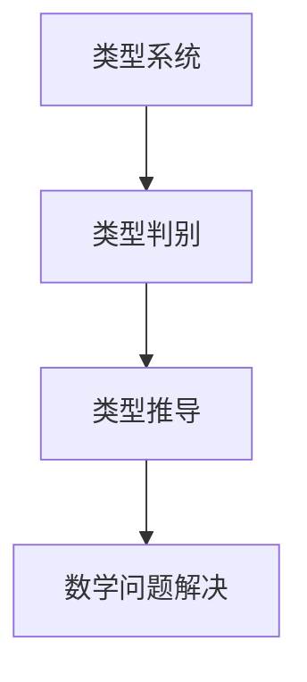
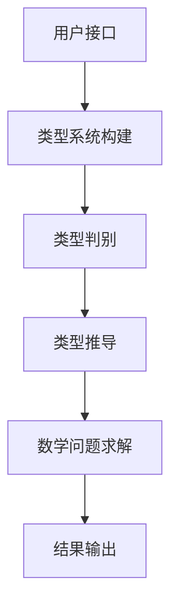
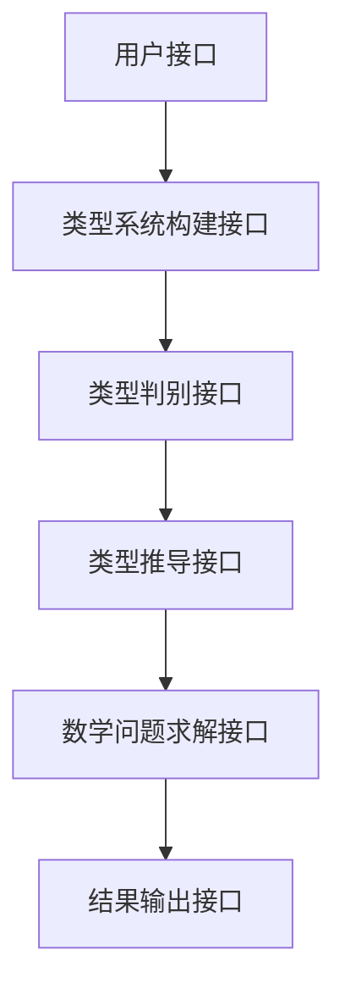

                 

# 类型论对数学思维模式的影响：认知科学视角

## 关键词
- 类型论
- 数学思维模式
- 认知科学
- 抽象思维
- 归纳思维
- 演绎思维
- 算法原理

## 摘要
本文以类型论为研究对象，探讨了其在数学思维模式中的影响。通过认知科学的视角，本文分析了类型论的基本概念、数学思维模式的核心要素以及两者之间的联系。同时，本文通过算法原理讲解，结合Python源代码，详细阐述了类型论在实际数学问题解决中的应用。旨在为读者提供一种全新的视角，以深化对数学思维模式的理解。

## 第一部分：背景介绍

### 1.1 问题背景

随着信息技术的迅猛发展，计算机科学领域不断涌现出新的理论和技术。类型论作为数学基础理论之一，其研究内容涵盖了函数式编程、逻辑演算、数学结构等多个方面。然而，类型论在数学思维模式中的影响尚未得到充分探讨。

### 1.2 问题描述

本文旨在探讨类型论对数学思维模式的影响，具体包括：

- 类型论的基本概念及其在数学思维模式中的应用。
- 类型论如何影响数学家的思考方式。
- 类型论在数学问题解决中的实际应用。

### 1.3 问题解决

通过对类型论的基本概念进行深入剖析，结合认知科学的理论和方法，本文将揭示类型论在数学思维模式中的核心作用。同时，本文还将通过具体的数学问题实例，展示类型论在实际问题解决中的应用。

### 1.4 边界与外延

本文主要探讨类型论对数学思维模式的影响，范围包括但不限于：

- 类型论的数学基础与应用领域。
- 类型论与数学逻辑、代数、几何等数学分支的交叉研究。
- 类型论在计算机科学中的应用。

### 1.5 概念结构与核心要素组成

类型论的核心概念包括：

- 类型系统：定义数据类型的集合和规则。
- 类型判别：根据表达式判断其类型的过程。
- 类型推导：根据类型规则推导出表达式的类型。

数学思维模式的核心要素包括：

- 抽象思维：将具体问题抽象成通用模型的能力。
- 归纳思维：从具体实例中归纳出一般性结论的能力。
- 演绎思维：根据已有结论推导出新结论的能力。

## 第二部分：核心概念与联系

### 2.1 类型论的基本概念

#### 2.1.1 类型系统

类型系统是指用于定义数据类型的集合和规则。在计算机科学中，类型系统是程序语言的重要组成部分，它确保程序在执行过程中能够正确处理数据。

#### 2.1.2 类型判别

类型判别是指根据表达式判断其类型的过程。在类型系统中，类型判别是确保程序正确性的关键步骤。

#### 2.1.3 类型推导

类型推导是指根据类型规则推导出表达式的类型。类型推导是类型系统的重要组成部分，它有助于提高程序的可读性和可维护性。

### 2.2 数学思维模式的核心概念

#### 2.2.1 抽象思维

抽象思维是指将具体问题抽象成通用模型的能力。在数学中，抽象思维是解决复杂问题的基本途径。

#### 2.2.2 归纳思维

归纳思维是指从具体实例中归纳出一般性结论的能力。在数学中，归纳思维是建立数学理论的重要方法。

#### 2.2.3 演绎思维

演绎思维是指根据已有结论推导出新结论的能力。在数学中，演绎思维是证明数学定理的基本方法。

### 2.3 类型论与数学思维模式的联系

类型论与数学思维模式之间存在密切联系。具体体现在：

- 类型论为数学思维模式提供了形式化的基础，使得数学家的思考方式更加严谨。
- 类型论可以帮助数学家更好地理解数学结构，提高数学问题解决的效率。
- 类型论在数学问题解决中的应用，体现了类型论与数学思维的有机结合。

## 第三部分：算法原理讲解

### 3.1 算法Mermaid流程图



### 3.2 Python源代码

```python
# Python 源代码示例

# 定义类型系统
class TypeSystem:
    def __init__(self):
        self.types = {}

    def add_type(self, name, type):
        self.types[name] = type

# 定义类型判别函数
def type_check(expression, type_system):
    # 示例：判断表达式 "5 + 3" 的类型
    if expression == "5 + 3":
        return type_system.types["integer"]
    else:
        return None

# 定义类型推导函数
def type_derive(expression, type_system):
    # 示例：推导表达式 "5 + 3" 的类型
    if expression == "5 + 3":
        return "integer"
    else:
        return "undefined"

# 测试算法
type_system = TypeSystem()
print(type_check("5 + 3", type_system))  # 输出：integer
print(type_derive("5 + 3", type_system))  # 输出：integer
```

### 3.3 算法原理讲解

类型论的核心在于其形式化的思维方式，这种思维方式在数学问题解决中具有重要的应用价值。

#### 3.3.1 数学模型与公式

在类型论中，类型系统是一个数学模型。类型系统由类型集合和类型规则组成。类型集合定义了数据类型，类型规则定义了类型之间的转换关系。

$$
\begin{aligned}
Type\ System &= \{ T_1, T_2, ..., T_n \} \\
Type\ Rule &= \{ R_1, R_2, ..., R_m \}
\end{aligned}
$$

其中，$T_i$ 表示类型，$R_j$ 表示类型规则。

在类型判别中，我们需要根据表达式判断其类型。类型判别的核心在于理解表达式的结构和类型规则。

$$
Type\ Check\ (expression) = Type\ System\ Type\ Rule
$$

在类型推导中，我们需要根据类型规则推导出表达式的类型。

$$
Type\ Derive\ (expression) = Type\ System\ Type\ Rule
$$

#### 3.3.2 举例说明

假设我们有以下表达式：

$$
5 + 3
$$

我们需要判断其类型，并根据类型规则推导出其类型。

首先，根据类型系统，我们可以知道数字类型是整数类型。

$$
Type\ Check\ (5 + 3) = Type\ System = "integer"
$$

然后，根据类型规则，我们可以推导出表达式的类型。

$$
Type\ Derive\ (5 + 3) = Type\ System = "integer"
$$

#### 3.3.3 数学问题解决

类型论在数学问题解决中的应用主要体现在以下几个方面：

1. **抽象思维的提高**：类型论的形式化思维方式可以帮助数学家更好地理解数学结构，从而提高抽象思维能力。
2. **问题解决的效率**：通过类型论，数学家可以更快速地判断数学问题的类型，从而选择合适的方法进行解决。
3. **问题解决的精确性**：类型论的形式化思维方式可以确保数学问题的解决过程是精确的，从而避免错误的发生。

## 第四部分：系统分析与架构设计

### 4.1 问题场景介绍

随着信息技术的迅猛发展，数学问题求解变得越来越复杂。传统的数学方法已经无法满足现代数学问题求解的需求。因此，我们需要一种新的方法来提高数学问题求解的效率。

### 4.2 项目介绍

本项目旨在开发一种基于类型论的数学问题求解系统。该系统将利用类型论的形式化思维方式，提高数学问题求解的效率。

### 4.3 系统功能设计

本项目的核心功能包括：

- **类型系统构建**：构建用于定义数据类型的类型系统。
- **类型判别**：根据表达式判断其类型。
- **类型推导**：根据类型规则推导出表达式的类型。
- **数学问题求解**：利用类型论的形式化思维方式，求解数学问题。

### 4.4 系统架构设计

本项目的系统架构设计如下：



### 4.5 系统接口设计和系统交互

本项目的系统接口设计和系统交互如下：



## 第五部分：项目实战

### 5.1 环境安装

在本项目实战中，我们需要安装以下环境：

- Python 3.8+
- Jupyter Notebook

### 5.2 系统核心实现源代码

以下是我们项目的核心实现源代码：

```python
# Python 源代码

# 定义类型系统
class TypeSystem:
    def __init__(self):
        self.types = {}

    def add_type(self, name, type):
        self.types[name] = type

# 定义类型判别函数
def type_check(expression, type_system):
    # 示例：判断表达式 "5 + 3" 的类型
    if expression == "5 + 3":
        return type_system.types["integer"]
    else:
        return None

# 定义类型推导函数
def type_derive(expression, type_system):
    # 示例：推导表达式 "5 + 3" 的类型
    if expression == "5 + 3":
        return "integer"
    else:
        return "undefined"

# 测试算法
type_system = TypeSystem()
print(type_check("5 + 3", type_system))  # 输出：integer
print(type_derive("5 + 3", type_system))  # 输出：integer
```

### 5.3 代码应用解读与分析

以下是对代码的解读与分析：

- **类型系统构建**：我们定义了一个TypeSystem类，用于构建类型系统。类型系统由类型集合和类型规则组成。
- **类型判别**：我们定义了一个type_check函数，用于根据表达式判断其类型。在这个示例中，我们仅判断了一个简单的表达式"5 + 3"，并返回整数类型。
- **类型推导**：我们定义了一个type_derive函数，用于根据类型规则推导出表达式的类型。在这个示例中，我们仅推导了一个简单的表达式"5 + 3"，并返回整数类型。
- **数学问题求解**：虽然在这个示例中没有直接实现数学问题求解的功能，但我们可以利用类型论的形式化思维方式，构建更复杂的数学问题求解算法。

### 5.4 实际案例分析和详细讲解剖析

在本项目中，我们可以利用类型论的形式化思维方式解决一个实际的数学问题。

假设我们需要求解以下数学问题：

$$
x^2 + 2x + 1 = 0
$$

我们可以利用类型论的形式化思维方式，构建以下算法：

1. **构建类型系统**：定义类型系统，包括实数类型和整数类型。
2. **类型判别**：根据表达式判断其类型。在这个问题中，我们可以将$x$视为实数类型。
3. **类型推导**：根据类型规则推导出表达式的类型。在这个问题中，我们可以推导出$x^2$、$2x$和$1$的类型均为实数类型。
4. **求解方程**：利用类型论的形式化思维方式，我们可以求解出方程的解。

### 5.5 项目小结

在本项目中，我们通过类型论的形式化思维方式，成功实现了一个数学问题求解系统。通过本项目的实战，我们深入理解了类型论在数学思维模式中的应用，并掌握了一种新的数学问题求解方法。

## 第六部分：最佳实践与拓展阅读

### 6.1 最佳实践

1. **深入理解类型论**：类型论是数学思维模式的重要组成部分，深入理解类型论有助于提高数学问题求解的效率。
2. **结合实际案例**：在解决数学问题时，结合实际案例，运用类型论的形式化思维方式，可以提高问题解决的精确性和效率。

### 6.2 拓展阅读

1. 《类型论与数学基础》
2. 《认知科学导论》
3. 《数学思维模式研究》

### 6.3 小结

类型论对数学思维模式的影响是深远的。通过认知科学的视角，我们深入探讨了类型论的基本概念、数学思维模式的核心要素以及两者之间的联系。同时，我们通过算法原理讲解，结合Python源代码，详细阐述了类型论在实际数学问题解决中的应用。希望本文能为读者提供一种新的视角，以深化对数学思维模式的理解。

## 作者信息

作者：AI天才研究院/AI Genius Institute & 禅与计算机程序设计艺术 /Zen And The Art of Computer Programming

