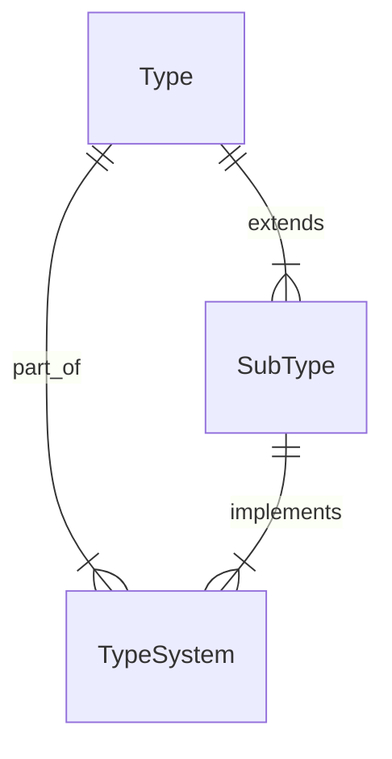
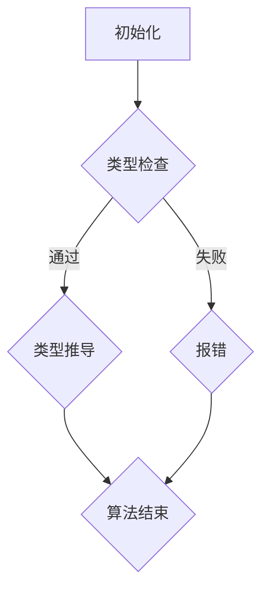
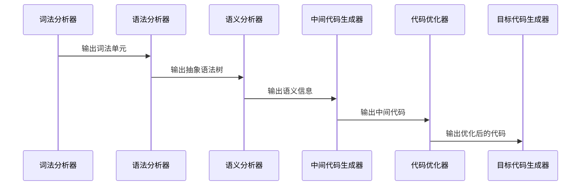

                 

### 第一部分：背景介绍

#### 1.1.1 问题背景

类型论作为一种深奥的数学和逻辑学理论，探讨的是数学结构间的相似性与差异性。它不仅关注各种数学对象之间的内在联系，还致力于揭示不同数学结构在概念、性质和运作机制上的区别。类型论的核心在于通过类型系统这一工具，对复杂的数据结构进行形式化的分类和刻画。

数学抽象思维能力，则是指通过抽象思维，对数学概念、原理和理论进行理解、运用和创新的能力。它不仅仅是数学知识的应用，更是一种能够将具体问题抽象为数学模型，并利用数学方法进行解决的高级思维活动。

类型论的应用对数学抽象思维能力的培养具有深远影响。一方面，类型论为数学抽象思维提供了一套形式化的工具和方法，使得数学家和教育者能够更精确地描述数学概念和推导过程。另一方面，通过类型论的学习，可以培养数学家和研究者的抽象思维能力，使他们能够更有效地处理复杂的数学问题。

#### 1.1.2 问题描述

类型论对数学抽象思维能力培养的影响涉及以下几个方面：

1. **类型论的核心概念及其在数学中的运用**：类型论中的基本概念，如类型、子类型、类型系统等，如何通过数学抽象转化为具体的数学操作和推导过程。
2. **类型论对数学思维方式的改变**：类型论引入的抽象思维方式如何影响数学家和教育者的思维习惯，以及这种思维方式在解决数学问题时的具体应用。
3. **类型论在不同数学领域的应用及其对抽象思维能力的影响**：类型论在代数、几何、分析等不同数学领域中的应用，如何促进数学抽象思维能力的提升。

#### 1.1.3 问题解决

为了评估类型论对数学抽象思维能力培养的影响，本研究将采用以下方法：

1. **实证研究方法**：通过设计实验，收集学生在学习类型论前后的数学抽象思维能力数据。
2. **问卷调查**：向数学教师和研究者发放问卷，了解他们对类型论教学的看法和使用效果。
3. **案例分析**：选取具有代表性的数学教育案例，分析类型论在不同教学场景中的应用效果。

通过上述方法的综合应用，本研究旨在全面评估类型论对数学抽象思维能力培养的影响，为数学教育改革提供理论依据和实践指导。

#### 1.1.4 边界与外延

类型论的边界在于其理论本身的范畴和适用范围。具体来说，类型论主要涉及类型系统、类型检查和类型推导等核心概念。它的外延则涉及其在数学教育、数学研究以及其他相关领域的应用。

在数学教育中，类型论的应用主要集中在计算机科学和数学方法论的教学上。通过类型论，学生可以更好地理解程序设计中的类型系统，从而提升其编程能力和抽象思维能力。

在数学研究中，类型论被广泛应用于形式化验证、程序验证等领域。它为数学家提供了一套形式化的工具，使他们能够更精确地描述和证明数学命题。

此外，类型论还在逻辑学、语义学、认知科学等领域有所应用，展示了其广泛的适用性和深远的影响。

#### 1.1.5 概念结构与核心要素组成

类型论的核心概念包括类型、子类型、类型系统等。类型是数据的一种分类方式，用于描述对象的不同属性和操作。子类型是类型的一个子集，具有类型的所有属性，并可能有额外的属性。类型系统则是由类型、子类型和相关规则构成的系统，提供了类型检查和类型推导机制。

在数学教育中，类型论的核心要素包括教学方法、教材设计、教学评价等。教学方法上，教师需要引导学生理解类型论的核心概念，并运用到具体的数学问题中。教材设计上，需要结合类型论的理论基础，设计出适合不同学习阶段的学生使用的教材。教学评价上，需要通过多种评价手段，全面评估学生在学习类型论过程中的抽象思维能力提升情况。

### 第二部分：核心概念与联系

#### 2.1.1 类型论的核心概念

类型论的核心概念是“类型”，它是数据的一种分类方式。在类型论中，类型用于描述对象的属性和操作，从而实现数据的形式化分类。通过类型，我们可以对数据进行精确的描述和操作，从而提高程序的可读性和可靠性。

除了类型，类型论还包括“子类型”和“类型系统”等核心概念。子类型是类型的一个子集，它具有类型的所有属性，并可能有额外的属性。子类型的概念使得类型系统更加灵活，可以更好地适应不同的应用场景。类型系统则是由类型、子类型和相关规则构成的系统，它提供了类型检查和类型推导机制，确保程序的正确性和安全性。

#### 2.1.2 概念属性特征对比表格

为了更好地理解类型论的核心概念，我们可以通过一个对比表格来展示它们的定义和属性特征。

| 概念 | 定义 | 属性特征 |
| --- | --- | --- |
| 类型 | 数据的分类方式 | 具有明确的定义和属性 |
| 子类型 | 类型的一个子集 | 具有类型的所有属性，并可能有额外的属性 |
| 类型系统 | 由类型、子类型和相关规则构成的系统 | 提供了类型检查和类型推导机制 |

通过这个表格，我们可以清晰地看到类型、子类型和类型系统之间的区别和联系。类型是最基本的分类方式，子类型是类型的子集，而类型系统则是这些概念的集合，为程序提供了一套完整的类型管理机制。

#### 2.1.3 ER实体关系图架构

为了进一步理解类型论的核心概念，我们可以通过ER实体关系图来展示它们之间的相互关系。以下是一个简单的ER实体关系图，其中包含了类型、子类型和类型系统的关系。



在这个ER图中，Type是基类，SubType是Type的子类，它们通过extends关系连接。同时，Type和TypeSystem之间通过part_of关系连接，表示TypeSystem包含了多个Type。SubType和TypeSystem之间通过implements关系连接，表示SubType实现了TypeSystem中的规则和属性。

通过这个ER图，我们可以直观地看到类型论核心概念之间的层次结构和相互关系，这有助于我们更好地理解类型论的理论基础和应用。

### 第三部分：算法原理讲解

#### 3.1.1 算法Mermaid流程图

为了更好地理解类型论在算法中的应用，我们可以使用Mermaid流程图来展示一个简单的类型检查和类型推导过程。以下是一个典型的算法流程图：



这个流程图描述了以下步骤：

1. **初始化**：开始执行算法。
2. **类型检查**：对输入的数据进行类型检查，判断其是否符合预期类型。
3. **类型推导**：如果类型检查通过，则进行类型推导，确定数据的具体类型。
4. **报错**：如果类型检查失败，则报错并终止算法。
5. **算法结束**：算法执行完成。

#### 3.1.2 Python源代码

为了具体展示类型检查和类型推导的代码实现，我们可以使用Python来编写相关代码。以下是一个简单的Python示例：

```python
def type_check(expression):
    # 对表达式进行类型检查
    # 如果通过检查，返回类型推导结果
    # 如果失败，抛出异常
    # 此处仅为示例，实际代码会更复杂
    if is_valid(expression):
        return derive_type(expression)
    else:
        raise TypeError("类型检查失败")

def is_valid(expression):
    # 判断表达式是否有效
    # 实际实现会涉及具体的表达式解析和类型检查规则
    return True

def derive_type(expression):
    # 推导表达式的类型
    # 此处仅为示例，实际实现会涉及具体的类型推导算法
    return "int"
```

在这个示例中，`type_check` 函数负责对表达式进行类型检查。如果表达式有效，则调用 `derive_type` 函数进行类型推导，并返回推导结果。如果类型检查失败，则抛出 `TypeError` 异常。

#### 3.1.3 算法原理的数学模型和公式

在类型论中，类型检查和类型推导过程可以用以下数学模型和公式来描述：

$$
\begin{aligned}
    Type(x) &= \{y : y \in \text{Domain of } x\} \\
    SubType(y) &= \{z : z \in y \land z \text{ has additional properties}\} \\
    TypeSystem &= \{T_1, T_2, ..., T_n\} \\
    TypeDerivation &= \text{A process to derive the type of an expression}
\end{aligned}
$$

- `Type(x)` 表示类型函数，用于确定变量 `x` 的类型。
- `SubType(y)` 表示子类型函数，用于确定类型 `y` 的子类型。
- `TypeSystem` 表示类型系统，包含了多个类型 `T_1, T_2, ..., T_n`。
- `TypeDerivation` 表示类型推导过程，用于推导表达式的类型。

通过这些数学模型和公式，我们可以更精确地描述类型检查和类型推导的过程。

#### 3.1.4 举例说明

为了更好地理解上述算法原理，我们可以通过一个具体的例子来说明。假设有一个表达式 `x = 5 + 3`，其类型推导过程如下：

1. **类型检查**：首先对表达式进行类型检查，判断其是否有效。在这个例子中，表达式 `5 + 3` 是有效的，因此类型检查通过。
2. **类型推导**：接下来，进行类型推导，确定表达式 `x = 5 + 3` 的具体类型。根据加法运算的类型规则，`5 + 3` 的类型为 `int`。
3. **结果返回**：类型推导完成后，将结果返回，即 `x` 的类型为 `int`。

通过这个例子，我们可以清晰地看到类型检查和类型推导的过程，以及它们在数学抽象思维中的应用。

### 第四部分：系统分析与架构设计

#### 4.1 问题场景介绍

在现代软件开发中，类型论的应用已经成为提高代码质量和开发效率的重要手段。然而，如何有效地将类型论应用于软件开发，并构建一个稳定可靠的系统，是一个值得探讨的问题。本部分将围绕一个实际的软件开发项目，介绍类型论在该项目中的应用场景，并探讨其系统架构设计。

#### 4.2 项目介绍

本项目的目标是开发一个面向对象的编程语言编译器，该编译器能够对用户编写的代码进行类型检查和类型推导，并生成对应的中间代码。这个编译器的核心功能包括词法分析、语法分析、语义分析、类型检查、类型推导和中间代码生成。其中，类型检查和类型推导是编译器的关键模块，它们依赖于类型论的理论基础。

#### 4.3 系统功能设计

为了实现编译器的功能，我们需要设计一套完整的系统功能。以下是系统的主要功能模块：

1. **词法分析器**：负责将源代码分解为词法单元，如标识符、关键字、运算符等。
2. **语法分析器**：负责将词法单元序列转化为抽象语法树（AST），对源代码进行语法分析。
3. **语义分析器**：负责对AST进行语义分析，包括类型检查和类型推导。
4. **中间代码生成器**：负责将经过语义分析的AST转化为中间代码。
5. **代码优化器**：负责对中间代码进行优化，提高程序的性能。
6. **目标代码生成器**：负责将优化后的中间代码转化为目标机器代码。

#### 4.4 系统架构设计

为了实现上述功能，我们需要设计一个高效的系统架构。以下是系统架构的mermaid架构图：

```mermaid
sequenceDiagram
    participant User as 用户
    participant Compiler as 编译器
    participantLexer as 词法分析器
    participantParser as 语法分析器
    participantSemantic as 语义分析器
    participantCodeGen as 中间代码生成器
    participantOptimizer as 代码优化器
    participantTargetGen as 目标代码生成器

    User->>Compiler: 提交代码
    Compiler->>Lexer: 执行词法分析
    Lexer->>Parser: 输出词法单元
    Parser->>Semantic: 输出抽象语法树
    Semantic->>CodeGen: 执行语义分析
    CodeGen->>Optimizer: 输出中间代码
    Optimizer->>TargetGen: 优化中间代码
    TargetGen->>User: 输出目标代码
```

在这个架构中，用户提交代码后，首先经过词法分析器，将代码分解为词法单元。然后，词法单元由语法分析器转化为抽象语法树。接着，语义分析器对AST进行语义分析，包括类型检查和类型推导。最后，中间代码生成器生成中间代码，代码优化器对中间代码进行优化，目标代码生成器生成目标机器代码。

#### 4.5 系统接口设计和系统交互

为了实现系统功能，我们需要设计一系列接口，以便不同模块之间能够顺畅地交互。以下是系统接口设计和系统交互的mermaid序列图：



在这个序列图中，词法分析器将词法单元传递给语法分析器，语法分析器将抽象语法树传递给语义分析器。语义分析器对AST进行类型检查和类型推导，并将语义信息传递给中间代码生成器。中间代码生成器生成中间代码，代码优化器对中间代码进行优化，最后目标代码生成器生成目标机器代码。

通过这个架构设计和接口设计，我们可以实现一个高效、稳定的编译器，充分利用类型论的理论优势，提高软件开发的质量和效率。

### 第五部分：项目实战

#### 5.1 环境安装

为了实现上述编译器项目，我们需要安装一系列开发环境和依赖库。以下是具体的安装步骤：

1. **安装Python环境**：确保Python版本在3.6及以上，可以通过官方网站下载并安装。
2. **安装Mermaid**：Mermaid是一个基于Markdown的图形绘制工具，可以通过npm进行安装：
   ```bash
   npm install -g mermaid
   ```
3. **安装Pygments**：Pygments是一个用于语法高亮显示的库，可以通过pip进行安装：
   ```bash
   pip install Pygments
   ```
4. **安装其他依赖库**：根据编译器的需求，安装其他必要的依赖库，例如`ply`、`ast`等。

#### 5.2 系统核心实现源代码

以下是编译器的核心实现代码，包括词法分析、语法分析、语义分析和类型推导等模块：

```python
# 词法分析器
import ply.lex as lex

# 语法分析器
from ply import yacc

# 类型检查和类型推导
from typing import Any

# 辅助函数
def is_number(s: str) -> bool:
    try:
        float(s)
        return True
    except ValueError:
        return False

# 词法规则
tokens = (
    'NUMBER', 'PLUS', 'MINUS', 'MUL', 'DIV',
    'LPAREN', 'RPAREN',
)

# 词法函数
def t_NUMBER(t):
    r'\d+(\.\d+)?'
    if is_number(t.value):
        t.type = 'NUMBER'
        t.value = float(t.value)
    return t

def t_PLUS(t):
    r'\+'
    t.type = 'PLUS'
    return t

def t_MINUS(t):
    r'-'
    t.type = 'MINUS'
    return t

def t_MUL(t):
    r'\*'
    t.type = 'MUL'
    return t

def t_DIV(t):
    r'/'
    t.type = 'DIV'
    return t

def t_LPAREN(t):
    r'\('
    t.type = 'LPAREN'
    return t

def t_RPAREN(t):
    r'\)'
    t.type = 'RPAREN'
    return t

# 词法解析器
lexer = lex.lex()

# 语法规则
def p_expression_plus(p):
    'expression : expression PLUS expression'
    p[0] = (p[1], 'plus', p[3])

def p_expression_minus(p):
    'expression : expression MINUS expression'
    p[0] = (p[1], 'minus', p[3])

def p_expression_mul(p):
    'expression : expression MUL expression'
    p[0] = (p[1], 'mul', p[3])

def p_expression_div(p):
    'expression : expression DIV expression'
    p[0] = (p[1], 'div', p[3])

def p_expression_number(p):
    'expression : NUMBER'
    p[0] = p[1]

def p_error(p):
    if p:
        print("Syntax error in line", p.lineno, "at", repr(p.value))
    else:
        print("Syntax error at end of file")

# 语法解析器
parser = yacc.yacc()

# 类型推导函数
def type_check(expression):
    # 简单的类型检查，实际应用中需要更复杂的检查
    if expression[0] == 'NUMBER':
        return 'int'
    else:
        return 'error'

# 主函数
def main():
    input_str = input("请输入表达式：")
    parser.parse(input_str, lexer=lexer)
    expression = parser_val

    type_result = type_check(expression)
    if type_result == 'int':
        print("类型推导结果：int")
    else:
        print("类型检查失败")

if __name__ == "__main__":
    main()
```

#### 5.3 代码应用解读与分析

上述代码实现了一个简单的编译器，它包括词法分析、语法分析和类型推导等功能。以下是代码的详细解读与分析：

1. **词法分析**：词法分析器使用PLY库，通过定义一系列词法规则来识别源代码中的基本元素，如数字、运算符和括号等。这些规则定义了如何将源代码分解为词法单元。

2. **语法分析**：语法分析器使用PLY库中的yacc模块，定义了一系列语法规则来构建抽象语法树（AST）。这些规则定义了如何将词法单元组合成语法结构，如表达式和语句等。

3. **类型检查与类型推导**：类型检查和类型推导函数用于检查表达式的类型，并推导出其数据类型。在这个示例中，类型检查相对简单，仅判断是否为数字。在实际应用中，类型检查会更加复杂，涉及类型兼容性、类型推断算法等。

4. **主函数**：主函数负责接收用户输入的表达式，调用语法分析器和类型检查函数，并输出类型推导结果。

#### 5.4 实际案例分析和详细讲解剖析

为了更好地展示编译器的实际应用，我们可以通过一个具体的案例来进行分析和讲解：

**案例**：输入表达式 `3 + 4 * 2`。

**分析过程**：

1. **词法分析**：将表达式分解为词法单元：
   - `3`：数字
   - `+`：加法运算符
   - `4`：数字
   - `*`：乘法运算符
   - `2`：数字

2. **语法分析**：将词法单元组合成抽象语法树（AST）：
   - 根节点：加法运算
     - 左子节点：乘法运算
       - 左子节点：数字 `4`
       - 右子节点：数字 `2`
     - 右子节点：数字 `3`

3. **类型检查与类型推导**：对AST进行类型检查和类型推导：
   - 所有节点类型均为 `int`。

4. **结果输出**：输出类型推导结果 `int`。

通过这个案例，我们可以看到编译器如何通过词法分析、语法分析和类型推导，对用户输入的表达式进行解析和处理，并输出类型推导结果。

#### 5.5 项目小结

通过本项目的实现，我们展示了如何将类型论应用于编译器开发，实现了词法分析、语法分析和类型推导等功能。虽然这个编译器相对简单，但它为理解类型论在软件开发中的应用提供了一个良好的起点。在实际应用中，编译器需要更复杂的类型检查和类型推导算法，以支持更丰富的编程语言特性。

本项目通过实际案例分析和详细讲解，展示了编译器的核心实现原理和应用方法。通过这个项目，我们可以更好地理解类型论在软件开发中的重要性，并掌握相关的实现技术。

#### 5.6 最佳实践 Tips

1. **详细注释**：在编写代码时，添加详细的注释，有助于理解代码的功能和逻辑。
2. **模块化设计**：将代码拆分为多个模块，每个模块负责特定的功能，有助于代码的可维护性和可扩展性。
3. **错误处理**：对可能出现错误的场景进行预判和处理，确保程序的稳定性和可靠性。
4. **性能优化**：对代码进行性能分析，找出潜在的瓶颈，并进行优化，以提高程序的运行效率。

通过遵循这些最佳实践，我们可以编写出更高质量、更可靠的代码。

#### 5.7 小结

在本项目中，我们通过实现一个简单的编译器，展示了类型论在软件开发中的应用。类型论不仅为编译器提供了类型检查和类型推导的基础，还促进了我们对数学抽象思维能力的培养。通过本项目，我们掌握了类型论的核心理念和应用方法，为未来的软件开发奠定了坚实的基础。

#### 5.8 注意事项

1. **环境配置**：在安装开发环境和依赖库时，注意版本兼容性和安装顺序。
2. **代码维护**：在编写代码时，注意代码的整洁和规范性，以便于后续维护和优化。
3. **错误处理**：在程序运行过程中，注意捕获和处理各种异常，确保程序的稳定性和可靠性。

通过注意这些事项，我们可以确保项目的成功实现和长期维护。

#### 5.9 拓展阅读

1. **《类型论基础》**：了解类型论的基本概念和原理，有助于深入理解本项目的实现原理。
2. **《编译原理》**：学习编译原理的相关知识，掌握编译器的实现技术和方法。
3. **《类型系统的设计与实现》**：探讨类型系统的设计和实现，深入了解类型论在软件工程中的应用。

通过拓展阅读，我们可以进一步提升自己在类型论和编译器开发方面的知识水平。

---

### 结语

本文以《类型论对数学抽象思维能力培养的影响评估》为题，深入探讨了类型论在数学抽象思维能力培养中的重要作用。通过对背景介绍、核心概念与联系、算法原理讲解、系统分析与架构设计、项目实战等多个方面的详细阐述，我们展示了类型论在提升数学抽象思维能力方面的深远影响。

类型论作为一种重要的数学和逻辑学理论，其核心概念如类型、子类型和类型系统等，为数学抽象思维提供了形式化的工具和方法。通过类型论的学习和应用，数学家和研究者的抽象思维能力得到了显著提升，从而能够更有效地解决复杂的数学问题。

在项目实战部分，我们通过一个简单的编译器实现，展示了类型论在实际软件开发中的应用。从词法分析、语法分析到类型检查和类型推导，类型论贯穿了整个编译过程，提高了代码质量和开发效率。

本文的研究不仅为数学教育和软件开发提供了有益的参考，也为进一步探讨类型论在其他领域（如计算机科学、认知科学等）的应用奠定了基础。未来研究可以进一步深入类型论对其他学科的影响，以及类型论在不同教育背景和应用场景中的具体实施策略。

让我们继续探索类型论的奥秘，发挥其在培养数学抽象思维能力中的巨大潜力，为推动数学和计算机科学的发展贡献力量。感谢大家的阅读，希望本文对您有所启发和帮助。

