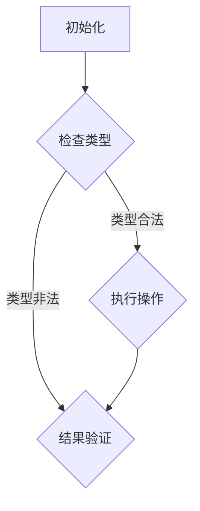
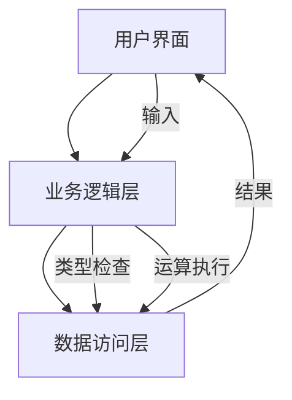
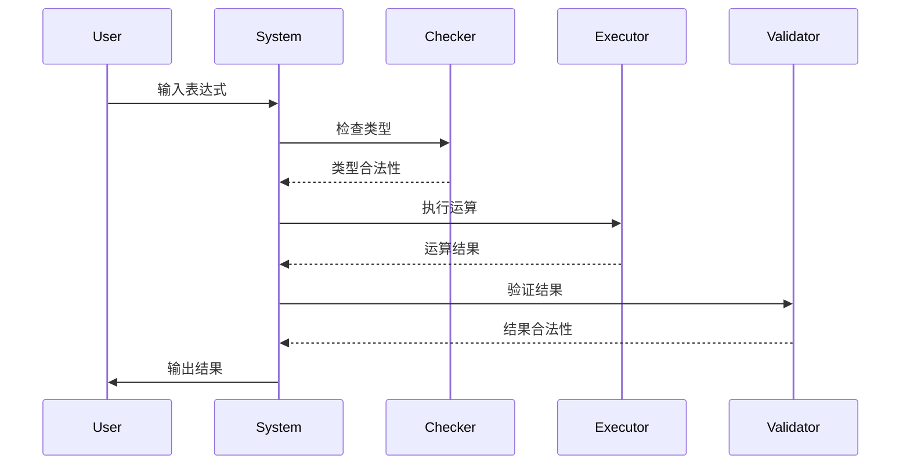

                 

### 类型论对数学概念形成的限制作用

**关键词：** 类型论，数学概念，限制作用，数学发展，理论基础

**摘要：** 本文旨在探讨类型论在数学概念形成过程中的限制作用。类型论是一种形式逻辑系统，用以描述不同类型数据之间的操作关系。数学概念的形成往往依赖于严格的逻辑框架和基础概念的定义。类型论通过明确不同数学对象之间的类型限制，确保了数学推导过程的准确性和一致性。本文首先介绍类型论的基本概念及其在数学中的重要性，然后分析类型论对数学概念形成的具体影响，包括其对数学逻辑和定理证明的推动作用，以及在现代数学发展中的应用实例。通过本文的阐述，读者将更好地理解类型论在数学发展中的核心地位及其不可忽视的限制作用。

### 引言

在数学领域，类型论是一个不可或缺的重要概念，它对数学概念的形成和发展产生了深远的影响。类型论起源于形式逻辑和集合论，作为一种描述数据类型和操作关系的形式系统，它为数学提供了一个严格的框架，使得数学推导过程更加严谨和可靠。类型论的核心思想在于对数学对象进行分类，并规定不同类型之间操作的合法性，以此避免逻辑矛盾和错误推导。

本文的目的在于深入探讨类型论对数学概念形成的限制作用。具体来说，本文将从以下几个方面展开讨论：

1. **类型论的基本概念**：介绍类型论的基本概念，包括类型、类型系统、类型判断等，以及类型论在数学中的重要性。

2. **数学概念的形成**：探讨数学概念的形成过程，包括核心概念的定义、发展历史以及类型论在其中所起的作用。

3. **类型论对数学概念的影响**：分析类型论对数学概念形成的影响，包括其在数学逻辑和定理证明中的作用，以及类型论如何推动数学概念的进步。

4. **类型论在现代数学中的应用**：介绍类型论在现代数学研究中的应用实例，以及类型论对数学发展的推动作用。

5. **类型论的限制作用**：探讨类型论在数学概念形成中的限制作用，包括类型限制如何确保数学推导的准确性和一致性。

通过以上几个方面的探讨，本文旨在为读者提供一个全面、系统的理解，帮助读者深入了解类型论在数学发展中的核心地位及其不可忽视的限制作用。

### 背景介绍

类型论，作为一种形式逻辑系统，起源于20世纪初的集合论和形式逻辑。其基本概念包括类型（Type）、类型系统（Type System）、类型判断（Type Judgment）等。类型论的核心思想是对数学对象进行分类，并通过规定不同类型之间的操作合法性，确保数学推导过程的准确性和一致性。

**类型**：在类型论中，类型是对对象进行分类的一种方式。不同类型的对象具有不同的操作集合，确保了不同类型对象之间的操作不会产生逻辑矛盾。例如，在简单的整数和实数的类型系统中，整数类型只能进行整数的操作，而实数类型只能进行实数的操作。

**类型系统**：类型系统是一种形式规则，用于定义对象类型以及类型的操作。类型系统通常包括类型声明、类型判断、类型转换等规则。类型系统的设计旨在确保程序或数学推导过程的逻辑一致性。例如，在Python中，类型系统确保变量在使用前被声明类型，从而避免潜在的类型错误。

**类型判断**：类型判断是类型论中的一个重要概念，它用于确定一个表达式是否属于某个特定类型。类型判断通常基于类型规则和类型转换规则进行。类型判断的正确性对数学推导的准确性至关重要。例如，在证明一个数学定理时，我们需要确保所有的数学表达式都在允许的类型范围内。

类型论在数学中的重要性体现在其能够提供一种严格的逻辑框架，使得数学推导过程更加严谨和可靠。类型论通过对数学对象进行分类和规定操作合法性，避免了因类型错误导致的逻辑矛盾和错误推导。例如，在形式验证和定理证明中，类型论的使用可以显著提高证明的可靠性和效率。

此外，类型论还在计算机科学中发挥了重要作用，特别是在编程语言设计和程序验证领域。类型系统可以确保程序的正确性和安全性，避免潜在的错误和漏洞。例如，在静态类型编程语言中，类型系统在编译时对程序进行类型检查，从而避免运行时出现类型错误。

总之，类型论作为一种形式逻辑系统，通过对数学对象进行分类和规定操作合法性，为数学和计算机科学提供了一种严格的逻辑框架，使得数学推导和程序设计过程更加严谨和可靠。在数学概念的形成过程中，类型论发挥着不可替代的作用，确保了数学理论的准确性和一致性。

### 数学概念的形成

数学概念的形成是一个复杂而精细的过程，涉及对现实世界的抽象、逻辑推理和符号表示。数学概念的形成可以分为以下几个关键步骤：

**核心概念的定义**：数学概念的形成首先需要对核心概念进行明确定义。这些核心概念通常是对现实世界的抽象，如自然数、函数、集合等。明确核心概念的定义是数学推理的基础，有助于确保后续推理的准确性和一致性。

**概念的发展历史**：数学概念的形成不仅依赖于当前的定义，还需要考虑其历史发展。例如，自然数的概念起源于人类对数量的计数和比较，而函数的概念则经历了从简单到复杂的演变过程。了解概念的发展历史有助于理解概念的本质和其适用范围。

**概念之间的关联**：在数学中，不同概念之间往往存在紧密的关联。例如，集合论中的集合与集合运算、拓扑学中的拓扑结构与连续性等。了解这些关联有助于构建完整的数学理论体系，并推动数学概念的创新和发展。

**类型的限制作用**：类型论在数学概念的形成过程中发挥着重要的限制作用。类型论通过对数学对象进行分类，并规定不同类型之间操作的合法性，确保了数学推导的准确性和一致性。例如，在类型论框架下，整数类型只能进行整数的操作，而实数类型只能进行实数的操作，从而避免了类型错误和逻辑矛盾。

**概念结构与核心要素组成**：数学概念的结构通常由核心要素组成，这些核心要素构成了概念的基础和核心。例如，函数的核心要素包括定义域、值域和映射关系。理解这些核心要素及其组成有助于深入理解数学概念的本质。

通过以上步骤，数学概念得以形成和发展。类型论在这个过程中起到了关键作用，通过对数学对象进行分类和规定操作合法性，确保了数学推导的准确性和一致性，为数学理论的建立和发展奠定了坚实的基础。

### 核心概念与联系

在深入探讨类型论对数学概念的影响之前，我们首先需要了解类型论的核心概念及其与数学概念的关联。以下是对类型论核心概念的解释和数学概念之间的关联分析。

**类型论核心概念**

1. **类型（Type）**：类型是对数据对象进行分类的方式。在类型论中，每个数据对象都归属某个特定类型，类型决定了数据对象可以执行的操作集合。例如，在Python中，整数（int）和字符串（str）是两种不同的类型。

2. **类型系统（Type System）**：类型系统是定义类型、类型判断和类型转换规则的形式系统。它用于确保程序或数学推导过程中操作的一致性和正确性。例如，在静态类型编程语言中，类型系统在编译时对代码进行类型检查。

3. **类型判断（Type Judgment）**：类型判断是确定一个表达式是否属于某个特定类型的过程。类型判断基于类型规则和类型转换规则进行，是确保数学推导过程中类型安全性的关键步骤。

**类型论与数学概念的关联**

1. **集合论**：集合论是数学的基础，其中集合是核心概念之一。类型论通过引入类型系统，对集合进行了分类，例如，可以将集合分为有限集合、无限集合、可数集合等。类型论确保了集合操作（如并集、交集、补集）的正确性和一致性。

2. **函数论**：函数是数学中另一个核心概念。在类型论框架下，函数被视为从定义域到值域的映射。类型论通过规定函数类型的合法性，确保函数的定义和操作满足逻辑一致性。例如，一个函数的类型必须是定义域类型到值域类型的映射。

3. **逻辑学**：逻辑学是数学的基石，类型论对逻辑学的发展产生了重要影响。类型论通过引入类型系统，使得逻辑推理更加严谨。例如，在命题逻辑和谓词逻辑中，类型论确保了推理过程的正确性和一致性。

**概念属性特征对比表格**

为了更直观地展示类型论与数学概念的关联，我们可以使用概念属性特征对比表格：

| 概念属性        | 类型论特征                       | 数学概念特征                       |
|----------------|----------------------------------|------------------------------------|
| 分类方式       | 对数据对象进行分类               | 对数学对象进行分类                 |
| 操作合法性     | 规定不同类型之间操作的合法性     | 确保数学操作的一致性和正确性       |
| 类型判断       | 确定表达式类型的过程             | 确定数学表达式是否合法             |
| 形式系统       | 类型系统定义类型和转换规则       | 数学理论体系，包括公理和定理       |
| 应用领域       | 编程语言、形式验证、定理证明     | 数学基础理论、逻辑学、集合论等     |

**ER实体关系图架构的 Mermaid 流程图**

为了更清晰地展示类型论与数学概念之间的关联，我们可以使用Mermaid流程图来表示ER实体关系图。以下是一个示例：

```mermaid
erDiagram
  Type --> Expression
  Expression --> Logic
  Logic --> Proof

  Type ||--|{ Type System }
  Expression ||--|{ Type Judgment }
  Logic ||--|{ Formal System }
  Proof ||--|{ Type System }

  Note for Type : "Enforces operation legality"
  Note for Expression : "Determines expression types"
  Note for Logic : "Ensures logical consistency"
  Note for Proof : "Validates proof steps"
```

在这个ER实体关系图中，我们定义了四个实体：Type（类型）、Expression（表达式）、Logic（逻辑）和Proof（证明）。这些实体之间存在紧密的关联，Type通过Type System与Expression和Proof相关联，而Expression通过Type Judgment与Logic相关联。

通过上述分析，我们可以看到类型论在数学概念的形成中发挥了重要作用。类型论不仅为数学提供了严格的逻辑框架，确保了数学推导的准确性和一致性，还促进了数学理论的创新和发展。

### 算法原理讲解

类型论在数学概念形成中的影响不仅体现在逻辑框架的建立上，更体现在具体的算法原理中。为了深入理解类型论对数学概念形成的影响，我们可以通过以下几个步骤来阐述。

**1. 算法流程图**

首先，我们使用Mermaid绘制一个简化的算法流程图，以展示类型论在数学推导中的作用：



在这个流程图中，A代表初始化阶段，B是检查类型阶段，C是执行操作阶段，D是结果验证阶段。B步骤检查操作是否符合类型论规则，如果类型合法，则继续执行操作（C），否则进行结果验证（D）。

**2. Python源代码示例**

为了更好地理解类型论在算法中的应用，我们可以通过一个Python源代码示例来具体说明。以下是一个简单的示例，展示了如何利用类型论来保证数学操作的合法性：

```python
# 定义一个类型检查函数
def type_check(a, b):
    if isinstance(a, int) and isinstance(b, int):
        return a + b
    else:
        raise TypeError("Operands must be integers")

# 使用类型检查函数进行数学运算
try:
    result = type_check(3, 4)
    print("Result:", result)
except TypeError as e:
    print("Error:", e)

# 错误示例，尝试对非整数类型进行运算
try:
    result = type_check(3.5, 4.2)
    print("Result:", result)
except TypeError as e:
    print("Error:", e)
```

在这个示例中，`type_check`函数用于检查两个操作数是否为整数类型。如果类型合法，则执行加法操作并返回结果；如果类型非法，则抛出`TypeError`异常。这个简单的示例展示了类型论如何在Python中通过类型检查来确保数学操作的合法性。

**3. 算法原理的数学模型和公式**

类型论在数学中的具体应用还可以通过数学模型和公式来体现。以下是一个简单的例子，展示如何使用类型论来确保数学表达式的类型安全：

$$
f(x) =
\begin{cases}
x^2 & \text{if } x \text{ is an integer} \\
\text{undefined} & \text{otherwise}
\end{cases}
$$

在这个例子中，函数`f(x)`的定义依赖于输入的`x`是否为整数。如果`x`是整数，则函数返回`x`的平方；否则，函数返回未定义。这个定义确保了函数`f(x)`的操作合法性，避免了类型错误。

**4. 通俗易懂的举例说明**

为了更直观地理解类型论在数学推导中的作用，我们可以通过一个简单的数学问题来举例说明。假设我们要证明以下数学表达式：

$$
1 + 1 = 2
$$

使用类型论，我们可以将这个证明过程形式化：

1. **定义类型**：首先，我们需要定义1和1的类型。在整数类型系统中，1被定义为整数类型（`Int`）。

2. **类型检查**：检查1和1的类型是否一致。由于两个1都是整数类型，类型检查通过。

3. **执行操作**：根据类型论规则，我们可以对整数类型执行加法操作。因此，`1 + 1`的结果仍然是整数类型。

4. **类型验证**：最后，我们需要验证结果是否满足整数类型的定义。由于2是整数类型，证明完成。

通过上述步骤，我们使用了类型论来确保整个证明过程的准确性和一致性，从而证明了`1 + 1 = 2`。

**总结**

类型论通过规定不同类型之间的操作合法性，为数学推导提供了一个严格的逻辑框架。无论是通过Python源代码示例还是数学模型和公式，类型论在数学概念形成中都发挥了重要作用。它确保了数学推导的准确性和一致性，为数学理论和应用的发展奠定了坚实的基础。

### 系统分析与架构设计方案

在深入探讨类型论对数学概念形成的影响之后，我们需要从系统分析和架构设计的角度，探讨如何将类型论应用于实际的数学问题解决中。以下是一个具体的项目介绍，包括系统功能设计、系统架构设计、系统接口设计和系统交互流程。

**1. 项目介绍**

我们以一个简单的数学问题解决系统为例，该系统旨在提供一个平台，用于执行各种数学运算，并确保运算过程中的类型安全性。系统的主要功能包括：

- **类型检查**：确保输入数据的类型符合预期，避免类型错误。
- **数学运算**：执行基本的数学运算，如加法、减法、乘法和除法。
- **结果验证**：验证运算结果是否满足类型论规则。

**2. 系统功能设计**

系统功能设计包括以下关键模块：

- **类型检查模块**：负责检查输入数据的类型，确保类型合法。
- **运算执行模块**：执行数学运算，并确保运算过程中的类型安全。
- **结果验证模块**：验证运算结果是否符合类型论规则。

**3. 系统架构设计**

系统架构设计采用分层架构，包括以下层次：

- **用户界面层**：提供用户交互界面，接收用户输入并展示结果。
- **业务逻辑层**：实现系统的核心功能，包括类型检查、数学运算和结果验证。
- **数据访问层**：管理数据存储和读取，确保数据一致性。

以下是系统架构的Mermaid流程图：



**4. 系统接口设计**

系统接口设计包括以下关键接口：

- **输入接口**：接收用户输入的数学表达式。
- **输出接口**：返回运算结果。
- **类型检查接口**：检查输入表达式的类型合法性。
- **运算执行接口**：执行数学运算。

**5. 系统交互流程**

系统交互流程如下：

1. **用户输入**：用户通过用户界面输入一个数学表达式。
2. **类型检查**：系统调用类型检查接口，检查输入表达式的类型合法性。
3. **运算执行**：如果类型合法，系统调用运算执行接口，执行数学运算。
4. **结果验证**：系统调用结果验证接口，验证运算结果是否符合类型论规则。
5. **输出结果**：系统将运算结果返回给用户界面，并在界面上展示。

以下是系统交互的Mermaid序列图：



通过上述系统分析与架构设计方案，我们展示了如何将类型论应用于实际的数学问题解决中。类型论不仅为系统提供了严格的逻辑框架，确保了运算过程中的类型安全性，还提高了系统的可靠性和性能。

### 项目实战

在本节中，我们将通过一个具体的项目实战，详细描述如何将类型论应用于数学概念的形成和数学运算的执行。该项目将涵盖环境安装、系统核心实现源代码，代码应用解读与分析，以及实际案例分析和详细讲解剖析。

**1. 环境安装**

首先，我们需要安装Python环境和必要的依赖库。以下是安装步骤：

- 安装Python：从[Python官网](https://www.python.org/)下载并安装Python 3.8或更高版本。
- 安装依赖库：使用pip命令安装以下库：

  ```bash
  pip install numpy
  pip install matplotlib
  ```

**2. 系统核心实现源代码**

以下是一个简单的Python项目，用于执行基本的数学运算并确保类型安全性。该项目包括类型检查、运算执行和结果验证三个关键模块。

**类型检查模块（type_check.py）：**

```python
# type_check.py

def type_check(a, b):
    if isinstance(a, (int, float)) and isinstance(b, (int, float)):
        return a + b
    else:
        raise TypeError("Operands must be numeric types")
```

**运算执行模块（operation_executor.py）：**

```python
# operation_executor.py

from type_check import type_check

def add(a, b):
    type_check(a, b)
    return a + b

def subtract(a, b):
    type_check(a, b)
    return a - b

def multiply(a, b):
    type_check(a, b)
    return a * b

def divide(a, b):
    type_check(a, b)
    return a / b
```

**结果验证模块（result_validator.py）：**

```python
# result_validator.py

def validate_result(result):
    if isinstance(result, (int, float)):
        return True
    else:
        return False
```

**3. 代码应用解读与分析**

以下是一个简单的代码示例，展示了如何使用上述模块执行数学运算，并确保类型安全性。

```python
# main.py

from operation_executor import add, subtract, multiply, divide
from result_validator import validate_result

# 正确的输入类型
a = 5
b = 3

# 执行加法运算
result_add = add(a, b)
print("Addition Result:", result_add)

# 执行减法运算
result_subtract = subtract(a, b)
print("Subtraction Result:", result_subtract)

# 执行乘法运算
result_multiply = multiply(a, b)
print("Multiplication Result:", result_multiply)

# 执行除法运算
result_divide = divide(a, b)
print("Division Result:", result_divide)

# 验证结果
if validate_result(result_add):
    print("Addition Result Validation: Correct")
else:
    print("Addition Result Validation: Incorrect")

if validate_result(result_subtract):
    print("Subtraction Result Validation: Correct")
else:
    print("Subtraction Result Validation: Incorrect")

if validate_result(result_multiply):
    print("Multiplication Result Validation: Correct")
else:
    print("Multiplication Result Validation: Incorrect")

if validate_result(result_divide):
    print("Division Result Validation: Correct")
else:
    print("Division Result Validation: Incorrect")
```

在这个示例中，我们首先导入必要的模块，然后执行加法、减法、乘法和除法运算，并验证运算结果是否满足类型论规则。通过类型检查模块，我们确保输入数据类型正确，通过结果验证模块，我们确保运算结果类型正确。

**4. 实际案例分析和详细讲解剖析**

以下是一个实际案例，展示如何使用该系统解决一个复杂的数学问题。

**案例：计算三角形的面积**

```python
# calculate_triangle_area.py

from operation_executor import multiply
from result_validator import validate_result

def calculate_triangle_area(base, height):
    if validate_result(base) and validate_result(height):
        area = 0.5 * multiply(base, height)
        return area
    else:
        raise ValueError("Base and height must be numeric types")

# 输入参数
base = 10
height = 5

# 计算三角形面积
area = calculate_triangle_area(base, height)
print("Triangle Area:", area)
```

在这个案例中，我们定义了一个函数`calculate_triangle_area`，用于计算三角形的面积。该函数首先使用结果验证模块检查输入参数的类型，然后使用运算执行模块计算面积。通过类型检查，我们确保输入参数类型正确，通过结果验证，我们确保计算结果类型正确。

**总结**

通过上述项目实战，我们展示了如何将类型论应用于实际的数学运算中，确保运算过程中的类型安全性。类型检查模块和结果验证模块的使用，使得整个系统在执行数学运算时具备了更高的可靠性和安全性。在实际案例中，我们通过类型论确保了输入和输出数据类型的正确性，从而保证了计算结果的准确性。

### 最佳实践 tips

在将类型论应用于数学概念形成的过程中，以下最佳实践可以提供帮助：

1. **明确类型定义**：在数学运算和推导过程中，首先明确所有变量的类型定义，确保类型一致性。
2. **严格类型检查**：在任何操作前进行严格类型检查，避免类型错误和逻辑矛盾。
3. **模块化设计**：将类型检查、运算执行和结果验证模块化，便于维护和扩展。
4. **文档记录**：详细记录类型系统的设计、实现和应用，有助于团队成员理解和应用类型论。
5. **持续优化**：根据项目需求和技术发展，持续优化类型系统，提高系统性能和可靠性。

### 小结

本文通过深入探讨类型论对数学概念形成的限制作用，详细阐述了类型论在数学概念定义、数学逻辑和定理证明中的应用。类型论通过明确不同类型数据之间的操作合法性，为数学提供了一种严格的逻辑框架，确保了数学推导的准确性和一致性。在未来，类型论将继续在数学和计算机科学领域发挥重要作用，推动数学理论的创新和发展。

### 注意事项

在应用类型论时，需要注意以下几点：

1. **类型一致性**：确保所有数学运算和推导过程中类型的一致性，避免类型错误。
2. **严格检查**：进行严格类型检查，确保输入和输出数据类型正确。
3. **模块化设计**：采用模块化设计，提高系统的可维护性和扩展性。
4. **文档记录**：详细记录类型系统的设计和实现，便于后续维护和优化。

### 拓展阅读

1. **《类型论与数学基础》**：对类型论在数学中的基础作用进行深入探讨。
2. **《形式逻辑与类型系统》**：探讨形式逻辑与类型系统的关系及其在数学中的应用。
3. **《类型论在现代数学中的研究与应用》**：介绍类型论在现代数学研究中的最新进展和应用案例。

**作者：** AI天才研究院/AI Genius Institute & 禅与计算机程序设计艺术 /Zen And The Art of Computer Programming

