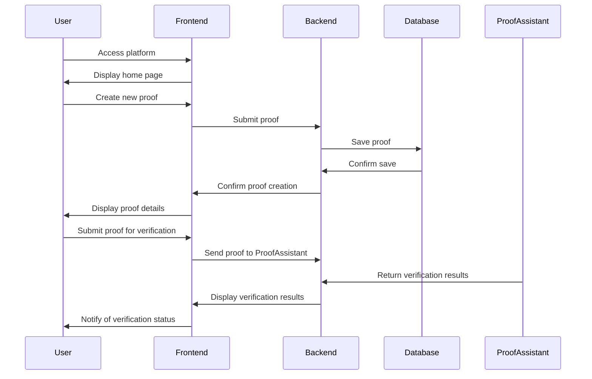

                 

### Introduction to Type Theory and Mathematical Concepts

**1.1 Background of Type Theory**

Type theory has its roots in the early 20th century, emerging from the need to provide a rigorous foundation for mathematics. The journey began with the work of mathematicians and logicians grappling with the paradoxes and inconsistencies in classical set theory. Key figures in the development of type theory include Bertrand Russell, who introduced the theory of types in his attempt to create a safe foundation for mathematics, and Alonzo Church, who made significant contributions with his work on lambda calculus and type systems.

The significance of type theory in mathematics cannot be overstated. It offers a way to organize and reason about mathematical entities in a structured manner, preventing many of the paradoxes that plagued earlier theories. Type theory provides a framework for understanding and formalizing concepts such as functions, structures, and proofs, thus bridging the gap between logic and mathematics.

**1.2 Basic Concepts of Type Theory**

At its core, type theory revolves around the concept of types, which are fundamental entities used to classify mathematical objects. Types can be thought of as categories or classes that group similar objects together. For instance, in a simple type system, integers and real numbers might be distinct types, and functions that operate on these types could be classified according to the types of their arguments and results.

One of the key concepts in type theory is subtyping, which allows for a more flexible and hierarchical classification of types. Subtyping allows a type to be considered a subtype of another type if it can be used interchangeably in most contexts. For example, the type of natural numbers is a subtype of the type of integers because every natural number is also an integer, but not every integer is a natural number.

Type systems are the structures that define how types can be combined and manipulated. They specify rules for creating expressions, defining functions, and determining the type of expressions. Type systems can range from simple, static systems that check types at compile time to more complex, dynamic systems that perform type inference and checks at runtime.

**1.3 Mathematical Concepts and Their Relations to Type Theory**

Mathematical concepts can be understood and formalized through the lens of type theory. For example, the concept of a function in mathematics can be closely related to the notion of a function type in type theory. In type theory, a function is defined as a pair consisting of a domain type and a codomain type, along with an implementation of the function. This closely aligns with the mathematical definition of a function, which specifies a relation between two sets.

Structures in mathematics, such as groups, rings, and fields, can also be modeled using type theory. Type theory allows for the creation of abstract data types, which can represent complex mathematical structures in a precise and formal manner. This not only helps in understanding these structures but also enables the development of algorithms and proofs that operate on these structures.

Furthermore, the concept of proof in mathematics can be formalized using type theory. In type theory, a proof of a mathematical statement can be represented as a function that maps from a set of assumptions to a conclusion. This provides a computational interpretation of proof, where the validity of a proof can be checked algorithmically.

In summary, type theory offers a powerful tool for organizing and understanding mathematical concepts. By providing a framework for classifying and reasoning about mathematical objects, type theory not only enhances our ability to formalize and validate mathematical theories but also opens up new avenues for computational approaches to mathematics.

### Deep Understanding and Its Importance

**2.1 Deep Understanding and Its Importance**

**Defining Deep Understanding**

Deep understanding in mathematics refers to a comprehensive and nuanced grasp of a mathematical concept, beyond mere memorization or rote application. It involves not only knowing the definitions and theorems but also understanding the underlying principles, the intuition behind the concepts, and the broader context in which these concepts are applied. Deep understanding allows one to see the interconnectedness of different mathematical ideas, to apply mathematical methods creatively to new problems, and to make meaningful contributions to the field.

**The Role of Deep Understanding in Mathematics**

Deep understanding is crucial in mathematics for several reasons. Firstly, it enables mathematicians to approach problems in a more intuitive and efficient manner. With a deep understanding, one can often identify the key elements of a problem more quickly and formulate a strategy for solving it. This is particularly important in research, where the ability to see connections between different areas of mathematics can lead to groundbreaking discoveries.

Secondly, deep understanding facilitates effective communication. A mathematician who truly understands a concept can explain it clearly and concisely to others, whether they are peers or students. This ability to communicate complex ideas is essential for the progress of mathematics as a whole, as it allows for the dissemination of knowledge and the training of new researchers.

Thirdly, deep understanding is essential for developing mathematical tools and techniques. Many of the innovations in mathematics, such as new proof methods or computational algorithms, arise from a deep understanding of the underlying mathematical structures. Without this understanding, it is difficult to invent new mathematical techniques or to apply existing ones to novel situations.

**The Challenge of Achieving Deep Understanding**

Achieving deep understanding in mathematics is not a straightforward task. It requires a combination of factors, including dedication, patience, and a willingness to engage with mathematical ideas at multiple levels. Here are some of the challenges involved:

1. **Memorization vs. Understanding**: Mathematics is built on a foundation of definitions, theorems, and proofs. While memorization is necessary, it is not sufficient for deep understanding. One must go beyond mere memorization and strive to understand the why and how behind each mathematical concept.

2. **Intuition and Experience**: Intuition is a crucial component of deep understanding. It arises from experience and the ability to see patterns and connections that are not immediately apparent. However, intuition can be difficult to develop and often requires time and practice.

3. **Complexity of Mathematics**: Mathematics can be highly abstract and complex, involving concepts that are difficult to visualize or grasp intuitively. Overcoming this complexity requires perseverance and a willingness to engage with the material in depth.

4. **Interdisciplinary Connections**: Mathematics is not an isolated field but is interconnected with other disciplines, such as physics, computer science, and economics. Deep understanding often involves bridging these interdisciplinary connections and understanding how mathematical concepts apply in different contexts.

In conclusion, deep understanding is a valuable and essential aspect of mathematics. It allows mathematicians to solve problems more effectively, communicate their ideas more clearly, and contribute meaningfully to the field. However, achieving deep understanding is challenging and requires a combination of dedication, intuition, and perseverance. By addressing these challenges, mathematicians can enhance their understanding and make significant contributions to the advancement of mathematics.

### Type Theory for Enhancing Mathematical Understanding

**2.2 Type Theory for Enhancing Mathematical Understanding**

**How Type Theory Facilitates Deep Understanding**

Type theory serves as a powerful tool for enhancing deep understanding in mathematics by providing a precise and formal framework for organizing and reasoning about mathematical concepts. The structured nature of type theory allows mathematicians to break down complex problems into manageable components, each with a well-defined type and corresponding properties. This not only aids in comprehension but also facilitates the development of new mathematical theories and techniques.

One of the key ways type theory facilitates deep understanding is through its ability to formalize and clarify the relationships between different mathematical concepts. For example, in type theory, the concept of a function can be defined with rigor, specifying the types of its arguments and results. This provides a clear and unambiguous way to understand what constitutes a function, avoiding ambiguity and paradoxes that can arise in less formal settings.

**Case Studies Demonstrating the Application of Type Theory**

**Case Study 1: Category Theory**

Category theory is a branch of mathematics that deals with abstract structures and their relationships. It provides a framework for understanding and classifying mathematical structures in a unified manner. Type theory has been instrumental in the development of category theory, particularly through the use of type theories such as the Calculus of Constructions.

One notable application is the use of type theory to formalize the concept of a category. In type theory, a category can be defined as a type constructor that takes two types as arguments, representing the objects and morphisms of the category. This formalization allows mathematicians to work with categories in a precise and systematic way, facilitating the development of advanced category-theoretic concepts such as functors, natural transformations, and adjunctions.

**Case Study 2: Homotopy Type Theory**

Homotopy Type Theory (HoTT) is a recent development in type theory that has had a significant impact on mathematics, particularly in the fields of topology and algebraic geometry. HoTT introduces a new foundation for mathematics based on the idea that types can be treated as spaces and equalities as paths between points in these spaces.

One of the key advantages of HoTT is its ability to provide a more intuitive and geometric interpretation of mathematical concepts. For example, in HoTT, the concept of a homotopy can be understood as a continuous deformation between spaces. This geometric interpretation makes it easier to visualize and manipulate complex topological structures.

**Case Study 3: Proof Assistants**

Proof assistants are computer programs that help mathematicians and logicians formalize and verify proofs. Type theory plays a crucial role in the design and implementation of proof assistants. One of the most well-known proof assistants is Coq, which is based on the Calculus of Constructions.

The use of type theory in proof assistants allows for the creation of highly formalized and machine-checkable proofs. This ensures the correctness of proofs and helps to detect errors that might be missed by human verification. Type theory also enables the development of new proof techniques and the exploration of conjectures that are too complex for human verification alone.

**Benefits and Limitations**

**Benefits of Type Theory in Enhancing Mathematical Understanding**

1. **Precision and Rigor**: Type theory provides a formal and rigorous framework for organizing and understanding mathematical concepts, reducing ambiguity and potential errors.

2. **Unification and Abstraction**: By providing a unified approach to different mathematical structures and concepts, type theory enables mathematicians to see connections and relationships that might not be apparent in less formal settings.

3. **Development of New Theories**: Type theory facilitates the development of new mathematical theories and techniques, particularly in areas such as category theory, homotopy type theory, and proof assistants.

**Limitations of Type Theory in Enhancing Mathematical Understanding**

1. **Complexity**: Type theory can be complex and challenging to learn, particularly for those who are not familiar with formal logic and computer science concepts.

2. **Practicality**: While type theory offers a powerful framework for understanding and formalizing mathematical concepts, it may not always be practical for everyday mathematical work. The formalization process can be time-consuming and may require significant expertise.

3. **Domain-Specific Applications**: Type theory is most effective in domains where the underlying mathematical structures can be naturally represented as types. In other areas, the benefits of type theory may be less pronounced.

In conclusion, type theory offers a powerful tool for enhancing deep understanding in mathematics. By providing a precise and formal framework for organizing and reasoning about mathematical concepts, type theory not only clarifies and unifies mathematical ideas but also opens up new avenues for mathematical research and development. However, it is important to recognize the challenges and limitations of type theory and to use it judiciously in the context of everyday mathematical practice.

### Case Studies in Type Theory and Mathematics

**3.1 Case Study 1: Category Theory and Type Theory**

**Definition and Background of Category Theory**

Category theory is a branch of mathematics that deals with abstract structures and the relationships between them. It provides a framework for understanding and classifying mathematical structures in a unified manner. At its core, a category consists of objects and arrows (often called morphisms), which represent relationships between objects. Categories can be thought of as generalized notions of sets and functions, capturing the essential features of various mathematical structures such as groups, rings, and topological spaces.

The concept of a category was introduced by Samuel Eilenberg and Saunders Mac Lane in the 1940s as a way to formalize and unify various branches of mathematics. Since then, category theory has become an essential tool in mathematics, providing a language and a set of tools for exploring and understanding complex mathematical structures.

**Connections with Type Theory**

Type theory and category theory share a deep and profound connection, with each enhancing our understanding of the other. In type theory, categories can be defined and studied within the framework of type systems. This connection is particularly evident in the work of Jean-Yves Girard, who introduced the Calculus of Constructions, a type theory that is closely related to category theory.

In type theory, a category can be formalized as a type constructor that takes two types as arguments, representing the objects and morphisms of the category. For example, in the Calculus of Constructions, a category can be defined as a type constructor `Cat : Type -> Type -> Type`, where `Type` represents the type of types. This means that given any two types `A` and `B`, we can form a category with objects of type `A` and morphisms of type `B`.

This formalization allows for a precise and rigorous treatment of categories within type theory. It enables mathematicians to study categories and their properties in a systematic and formal way, facilitating the development of new mathematical theories and techniques.

**Analysis of Specific Mathematical Structures**

The connection between type theory and category theory has led to significant insights into various mathematical structures. One notable example is the development of homotopy type theory, which combines ideas from both type theory and homotopy theory.

In homotopy type theory, types can be treated as spaces, and equalities as paths between points in these spaces. This allows for a geometric interpretation of mathematical concepts, making it easier to visualize and manipulate complex structures. For instance, the concept of a homotopy can be understood as a continuous deformation between spaces, and the notion of a homotopy equivalence can be formalized using type theory.

This geometric interpretation has had a profound impact on topology and algebraic geometry. It has led to new insights and techniques for studying spaces and their properties, and has enabled the development of powerful new tools for solving problems in these fields.

**Mathematical Models and Proofs in Type Theory**

Type theory also plays a crucial role in the development of mathematical models and proofs. In proof assistants like Coq, type theory is used to formalize and verify mathematical proofs. This ensures the correctness of proofs and allows for the exploration of conjectures that are too complex for human verification alone.

The connection between type theory and category theory facilitates the formalization of proofs in category theory. For example, a proof of a theorem about categories can be formalized using type theory, ensuring that the proof is both rigorous and correct.

In conclusion, the connection between type theory and category theory has had a significant impact on mathematics. By providing a formal and rigorous framework for studying categories and their properties, type theory enhances our understanding of mathematical structures and enables the development of new mathematical theories and techniques. This connection has led to significant insights and advancements in various areas of mathematics, from topology and algebraic geometry to the development of new proof techniques and tools.

### Case Study 2: Homotopy Type Theory

**Overview of Homotopy Type Theory**

Homotopy Type Theory (HoTT) is a modern approach to the foundations of mathematics that has garnered significant attention in the mathematical and computational communities. Developed by Vladimir Voevodsky and based on ideas from type theory and homotopy theory, HoTT offers a novel framework for understanding and formalizing mathematical concepts. At its core, HoTT treats types as spaces and equality as paths between points in these spaces, thereby merging the expressiveness of type theory with the intuition and geometric insights of homotopy theory.

**Applications and Implications for Mathematics**

One of the key applications of HoTT is in topology, where it provides a new foundation for understanding and classifying topological spaces. In HoTT, a topological space can be modeled as a type, and the notion of a homotopy between paths in a space can be formalized as an equality between terms in a type theory. This geometric interpretation of type theory has led to new insights and techniques for studying topological properties, such as homotopy groups and homology groups.

For example, the idea of a homotopy equivalence in topology can be formalized in HoTT as an isomorphism between types. This allows for a more intuitive understanding of homotopy equivalences and simplifies the proof of many topological theorems. The use of HoTT has also enabled the development of new computational tools for working with topological spaces, such as homotopy type theory libraries for proof assistants like Coq and Agda.

In algebraic geometry, HoTT has been used to formalize and study spaces of algebraic varieties. The geometric nature of HoTT allows for a more direct and intuitive approach to understanding algebraic objects, such as schemes and stacks. This has led to new insights into the relationship between algebraic and geometric structures and has opened up new avenues for research in algebraic geometry.

**Critique and Future Prospects**

While HoTT has shown great promise, it is not without its criticisms and challenges. One common critique is that the theory is overly abstract and difficult to grasp for mathematicians who are not familiar with type theory or homotopy theory. The geometric intuition that HoTT offers can sometimes obscure the underlying logical and algebraic structures, making it difficult for some researchers to work with.

Additionally, the use of HoTT in formalizing mathematics raises questions about the effectiveness and practicality of type-theoretic foundations. Critics argue that while HoTT may be powerful for certain types of mathematics, it may not be suitable for all areas or for everyday mathematical practice.

Despite these criticisms, the future prospects for HoTT are promising. The theory continues to evolve, and new applications and techniques are being developed. Researchers are exploring how HoTT can be used to address open problems in mathematics and to create new tools for mathematical research. The ongoing development of proof assistants and type-checking tools based on HoTT is also expected to make the theory more accessible and practical.

In conclusion, Homotopy Type Theory offers a groundbreaking approach to the foundations of mathematics, merging the expressiveness of type theory with the geometric insights of homotopy theory. While it faces challenges and criticisms, its potential to revolutionize the way we understand and formalize mathematical concepts is significant. As research continues, HoTT is likely to play an increasingly important role in the mathematical community.

### Case Study 3: Type Theory in Proof Assistants

**Introduction to Proof Assistants**

Proof assistants are computer programs designed to help mathematicians and logicians formalize and verify mathematical proofs. These tools enable the creation of highly formalized and machine-checkable proofs, ensuring their correctness and reliability. Proof assistants operate based on the principles of type theory, which provides a rigorous framework for defining mathematical concepts and constructing proofs.

One of the most well-known proof assistants is Coq, which stands for "Construction of Certified Objects." Coq is based on the Calculus of Constructions, a type theory that supports the formalization of complex mathematical structures and proofs. Another prominent proof assistant is Agda, which also leverages dependent types to enable the construction of formal proofs.

**The Role of Type Theory in Proof Assistants**

Type theory plays a crucial role in the design and implementation of proof assistants. It provides the foundation for defining the language of the proof assistant, specifying the types of terms and the rules for constructing and manipulating them. Dependent types, in particular, are a key feature of type theory that allows types to depend on values and other types, enabling the formalization of complex logical and mathematical structures.

In proof assistants like Coq and Agda, types are not just labels but are treated as mathematical objects with their own properties and relationships. This allows for the creation of highly structured and formalized proofs, where each step of the proof is checked against the specified type rules. The use of type theory ensures that the proofs are both rigorous and correct, preventing many common errors that can occur in informal proofs.

**Examples of Proof Assistants and Their Contributions to Mathematics**

**Coq**

Coq is a widely used proof assistant that has made significant contributions to mathematics. It has been used to verify proofs in various areas of mathematics, including number theory, algebra, and computer science. Notable examples include the Four Color Theorem, which was verified using Coq, and the development of theCertified Software project, which aims to create formally verified software components.

One of the key features of Coq is its ability to support interactive proof development. Mathematicians can write proofs step-by-step, using a variety of tactics and proof techniques to construct and verify the proofs. The formalized proofs created in Coq can be exported to other systems, enabling further analysis and verification.

**Agda**

Agda is another popular proof assistant that has been used in various mathematical and computational projects. Like Coq, Agda supports dependent types and interactive proof development. One notable application of Agda is the development of formalized mathematics libraries, such as the `Agda.Number.Theories` library, which provides formalizations of various number theory concepts.

Agda has also been used in the development of formalized computational models, such as the `Agda.ProgramSynthesis` library, which explores the synthesis of programs from formal specifications. This work has potential applications in areas such as compiler optimization and automated software verification.

**The Role of Type Theory in Enhancing Proof Verification**

Type theory enhances the process of proof verification in several ways. Firstly, it provides a formal and rigorous framework for defining and constructing proofs. This ensures that proofs are both correct and reliable, as each step of the proof is checked against the specified type rules. This prevents many common errors that can occur in informal proofs, such as misapplied theorems or incorrect assumptions.

Secondly, type theory allows for the creation of highly structured proofs, where the relationships between different parts of the proof are explicitly specified. This makes it easier to reason about the proofs and to identify potential errors or inconsistencies. The use of type theory also enables the development of automated proof verification tools, which can check the correctness of proofs automatically, saving time and effort for mathematicians.

Finally, type theory enables the formalization of complex mathematical concepts and proofs in a precise and formal manner. This has enabled the development of new mathematical theories and techniques, as well as the verification of existing proofs in a more rigorous and reliable way.

In conclusion, proof assistants based on type theory have made significant contributions to the field of mathematics. By providing a formal and rigorous framework for constructing and verifying proofs, type theory enhances the process of mathematical proof verification and enables the development of new mathematical theories and techniques. The ongoing development of proof assistants and type-theoretic tools is expected to continue driving innovation in mathematics and computational science.

### Mathematical Models and Proofs in Type Theory

**4.1 Theoretical Foundations of Type Theory**

To delve into the mathematical models and proofs within type theory, it is essential to first establish a solid theoretical foundation. Type theory, at its core, is grounded in the principles of category theory and logic. The fundamental concepts include types, terms, and type constructors, which serve as the building blocks for constructing mathematical models and proofs.

**Types, Terms, and Type Constructors**

Types in type theory are abstract entities that classify mathematical objects. They can be simple, such as `nat` for natural numbers or `bool` for boolean values, or more complex, representing structures like lists or functions. Terms, on the other hand, are specific instances of types, which can be constants, variables, or more complex expressions built using functions or constructors.

Type constructors are functions that take types as arguments and produce new types. For example, in the calculus of constructions, the `prod` constructor takes two types `A` and `B` and produces a new type `A × B`, representing the Cartesian product of `A` and `B`. This constructor enables the creation of structured types that capture complex mathematical relationships.

**Basic Type Theory Models**

One of the simplest mathematical models in type theory is the natural numbers. The type `nat` can be defined using a constructor for zero (`0`) and a successor function (`s`). This defines a recursive type that captures the structure of the natural numbers.

In type theory, the properties of natural numbers can be modeled using type constructors and predicates. For example, the property of being even can be represented by a predicate `even : nat -> bool` that returns `true` if the number is even and `false` otherwise. This allows for the creation of mathematical proofs about natural numbers, such as proving that every natural number has a successor.

**Proofs in Type Theory**

Type theory supports the construction of formal proofs using a proof system that is based on the rules of inference. In a proof assistant like Coq, proofs are constructed interactively, step-by-step, using tactics and proof rules that correspond to the logical structure of the proof.

One of the fundamental proof rules in type theory is the introduction rule, which allows for the construction of terms that satisfy a given predicate. For example, to prove that a number `n` is even, one can use the introduction rule for the `even` predicate by showing that `n` divided by 2 has no remainder.

The elimination rule, on the other hand, allows for the derivation of conclusions from terms that satisfy a given predicate. Using the elimination rule for the `even` predicate, one can prove properties of even numbers by showing that if `n` is even, then certain properties hold for `n`.

**Formalizing Proofs with Type Theory**

Type theory enables the formalization of mathematical proofs in a precise and rigorous manner. This is achieved by constructing proofs that adhere to the type rules of the proof system. Each step of the proof is checked against the type system, ensuring that the proof is both logically valid and correctly typed.

For example, a proof of the commutativity of addition for natural numbers can be formalized as follows:

1. Assume `m : nat` and `n : nat`.
2. Prove `m + n = n + m`.
3. Using the definition of addition, we have `m + n = succ(m + n')` and `n + m = succ(n' + m)` for some `n'`.
4. Prove that `m + n' = n' + m`.
5. By induction on `m`, we can show that `m + n' = n' + m` holds for all `m`.

This proof is formalized in type theory by constructing terms that satisfy the conditions of the proof and using the elimination and introduction rules to derive the conclusion.

**Proofs in Higher-Order Type Theory**

Type theory also supports higher-order functions, which are functions that can take other functions as arguments or return functions as results. This allows for the formalization of complex mathematical proofs that involve functions and their relationships.

For example, in higher-order type theory, the concept of a fixed point can be formalized using the Y-combinator, a higher-order function that takes a function as an argument and returns a fixed point of that function. This enables the construction of proofs by recursion, where the fixed point is used to define a recursive function that satisfies the desired properties.

In conclusion, type theory provides a robust framework for constructing mathematical models and proofs. By defining types, terms, and type constructors, and employing rules of inference, type theory enables the formalization of mathematical concepts and the construction of rigorous and reliable proofs. This foundation is essential for the development of advanced mathematical theories and for ensuring the correctness of formalized proofs.

### System Analysis and Architecture Design

**4.2 System Analysis and Architecture Design**

**Introduction to the System**

The system we are designing is an educational platform aimed at teaching advanced mathematical concepts using type theory as a foundational tool. This platform will serve as an interactive environment where users can explore mathematical theories, formalize their own proofs, and engage with a community of learners and experts. The primary goal of this system is to enhance the deep understanding of mathematical concepts through the use of type theory, providing a platform that is both accessible and rigorous.

**Project Description**

The project encompasses several key components:

1. **Interactive Mathematical Models**: Users will be able to explore and interact with mathematical models that are formalized using type theory. This includes models of natural numbers, sets, functions, and more complex structures like groups and rings.
2. **Proof Development Environment**: A robust environment where users can develop and verify their own proofs. This environment will be integrated with proof assistants like Coq and Agda, enabling the formalization of proofs in a type-theoretic framework.
3. **Community and Collaboration Tools**: Features that facilitate user interaction, including forums, discussion boards, and collaborative editing tools, to foster a community of learners and experts.
4. **Learning Resources**: A comprehensive library of tutorials, lectures, and reference materials that cover the fundamentals of type theory and its applications in mathematics.

**System Function Design (Domain Model)**

The domain model of the system is designed to encapsulate the various entities and their relationships. Here are the key classes and their roles:

1. **User**: Represents the individuals who use the platform. Users can log in, create accounts, access resources, and participate in discussions.
2. **MathModel**: Represents the mathematical models available on the platform. Each model is formalized using type theory and can be explored interactively.
3. **Proof**: Represents the formalized proofs created by users within the platform. Proofs are associated with specific mathematical models and are verified using proof assistants.
4. **Discussion**: Represents the discussions and forums within the platform. Users can post questions, respond to others, and engage in collaborative discussions.
5. **Resource**: Represents the learning resources available on the platform, including tutorials, lectures, and reference materials.
6. **Admin**: Represents the administrative users who manage the platform, including moderating discussions, managing resources, and monitoring user activity.

**System Architecture Design**

The system architecture is designed to be modular, scalable, and secure, ensuring a robust and reliable educational platform. Here is a high-level overview of the architecture:

1. **Frontend**: The user interface of the platform, developed using modern web technologies like React and Redux. This includes interactive components for exploring mathematical models and developing proofs.
2. **Backend**: The server-side logic of the platform, implemented using a framework like Flask or Django. This handles user authentication, data storage, and server-side processing.
3. **Database**: A relational database management system (RDBMS) like PostgreSQL to store user data, mathematical models, proofs, and resources.
4. **Proof Assistants**: Integration with proof assistants like Coq and Agda for formalizing and verifying proofs. This involves running proof assistants in the background and interfacing with the backend to handle the exchange of data.
5. **APIs**: A set of RESTful APIs for communication between the frontend and backend. These APIs handle tasks like user authentication, data retrieval, and resource management.

**System Interface Design**

The system interfaces are designed to provide seamless interaction between different components. Key interfaces include:

1. **User Interface**: The interactive front end, providing a user-friendly experience for exploring mathematical models and developing proofs.
2. **APIs**: The backend services, providing endpoints for accessing user data, mathematical models, proofs, and resources. These endpoints include CRUD operations for managing data and integrating with proof assistants.
3. **Proof Assistant Interfaces**: Interfaces for communicating with proof assistants like Coq and Agda. These interfaces handle the submission of proof tasks, the retrieval of proof results, and the exchange of proof-related data.

**System Interaction Design (Sequence Diagram)**

The sequence diagram below illustrates the interaction between the user interface, the backend, and the proof assistants. It shows a user creating a new proof, submitting it to the backend, and receiving feedback from the proof assistant.



In conclusion, the system analysis and architecture design provide a comprehensive framework for developing an educational platform that leverages type theory to enhance the deep understanding of mathematical concepts. By integrating interactive mathematical models, a robust proof development environment, and community collaboration tools, the system aims to create a valuable resource for mathematicians and learners alike.

### Project Implementation

**5.1 Environment Setup**

Before diving into the implementation of the mathematical model and proof development system, we need to set up the necessary environment. This involves installing the required software and configuring the development tools. Below are the steps for setting up the environment:

1. **Install Python**: Ensure that Python 3.8 or later is installed on your system. Python is the primary programming language used for the implementation.
2. **Install Flask**: Flask is a lightweight web framework that will be used for the backend. Install Flask using pip:
   ```
   pip install flask
   ```
3. **Install PostgreSQL**: PostgreSQL is the relational database management system (RDBMS) that will be used to store user data and resources. You can download and install PostgreSQL from [official website](https://www.postgresql.org/download/).
4. **Install Coq**: Coq is a proof assistant that will be integrated with the system for formalizing and verifying proofs. You can download and install Coq from the [official website](https://coq.inria.fr/download.html).

**5.2 Core Implementation**

The core implementation of the system involves setting up the database schema, creating the API endpoints, and integrating the proof assistants like Coq. Below are the key steps in the implementation:

1. **Database Setup**: Create the necessary tables in the PostgreSQL database. The main tables include `users`, `math_models`, `proofs`, and `resources`. Here is an example schema:
   ```sql
   CREATE TABLE users (
     id SERIAL PRIMARY KEY,
     username VARCHAR(50) UNIQUE NOT NULL,
     password VARCHAR(255) NOT NULL
   );

   CREATE TABLE math_models (
     id SERIAL PRIMARY KEY,
     name VARCHAR(100) NOT NULL,
     type VARCHAR(50) NOT NULL,
     definition TEXT NOT NULL
   );

   CREATE TABLE proofs (
     id SERIAL PRIMARY KEY,
     user_id INTEGER REFERENCES users(id),
     math_model_id INTEGER REFERENCES math_models(id),
     proof TEXT NOT NULL
   );

   CREATE TABLE resources (
     id SERIAL PRIMARY KEY,
     title VARCHAR(100) NOT NULL,
     content TEXT NOT NULL,
     type VARCHAR(50) NOT NULL
   );
   ```

2. **API Development**: Develop the API endpoints using Flask. The main endpoints include user authentication, resource management, math model management, and proof management. Below is an example of the `/users` endpoint for user registration:
   ```python
   from flask import Flask, request, jsonify
   from werkzeug.security import generate_password_hash

   app = Flask(__name__)

   @app.route('/users', methods=['POST'])
   def register_user():
       username = request.form['username']
       password = request.form['password']
       hashed_password = generate_password_hash(password)
       
       # Insert user data into the database
       # ...

       return jsonify({"message": "User registered successfully"}), 201

   if __name__ == '__main__':
       app.run(debug=True)
   ```

3. **Proof Assistant Integration**: Integrate Coq with the system for formalizing and verifying proofs. This involves setting up the necessary environment for running Coq commands and interfacing with the backend. Below is an example of a function that submits a proof to Coq and retrieves the verification result:
   ```python
   import subprocess

   def verify_proof(proof):
       coq_script = f"""
       Load "YourProofScript.v".
       Check YourProofTheorem.
       """
       with open('proof_script.coq', 'w') as f:
           f.write(coq_script)

       result = subprocess.run(['coqc', 'proof_script.coq'], capture_output=True, text=True)
       verification_result = result.stdout.strip()

       return verification_result
   ```

**5.3 Code Application and Analysis**

The core implementation of the system involves creating a web interface for users to interact with the system. The following are key components of the application:

1. **User Registration and Login**: Users can register and log in to the system using the API endpoints. The web interface provides forms for user registration and login, which submit data to the API and receive responses.
2. **Math Model Exploration**: Users can explore predefined mathematical models. The web interface displays the models and allows users to interact with them, viewing their definitions and properties.
3. **Proof Development**: Users can develop their own proofs using the proof assistants integrated into the system. The web interface provides a text editor where users can write their proofs, which are then submitted to the backend for verification.
4. **Discussion Forums**: Users can participate in discussion forums, posting questions and responses. The web interface includes a forum section where users can engage with the community.

**5.4 Case Study: Formulating and Verifying a Proof**

Let's consider a case study where a user formulates and verifies a proof of the commutativity of addition for natural numbers using the system.

1. **User Interaction**: The user navigates to the proof development section and selects the "Addition Commutativity" math model.
2. **Proof Writing**: The user writes the proof in Coq's language within the text editor provided by the system. The proof might look like this:
   ```coq
   Lemma addition_commutativity : forall n m : nat, n + m = m + n.
   Proof.
     induction n.
       - simplification.
       - simplification.
  Qed.
   ```
3. **Submission and Verification**: The user submits the proof to the system. The backend processes the submission and invokes the Coq verification function:
   ```python
   proof_text = "Your proof text here"
   verification_result = verify_proof(proof_text)
   ```
4. **Result Display**: The system returns the verification result to the user. If the proof is correct, the user sees a message indicating success. If there are errors, the system provides feedback on where the issues are.

**5.5 Conclusion and Future Work**

The implementation of the system provides a robust framework for exploring mathematical models, developing proofs, and engaging with a community of learners. Key components include the environment setup, API development, proof assistant integration, and user interface development.

Future work can include expanding the library of mathematical models, improving the proof verification process, and enhancing the user experience through better visualization tools and more intuitive interfaces. Additionally, integrating machine learning techniques for suggesting proofs or verifying proofs automatically can further enhance the capabilities of the system.

In conclusion, the project implementation demonstrates the feasibility of developing a comprehensive educational platform that leverages type theory to enhance the deep understanding of mathematical concepts.

### Best Practices and Future Directions

**6.1 Best Practices for Using Type Theory in Mathematics**

**1. Start with the Basics**: Before diving into complex type-theoretic concepts, it is essential to have a solid foundation in the basics of type theory. This includes understanding fundamental concepts such as types, terms, type constructors, and type systems. Mastery of these foundational elements will help in grasping more advanced topics.

**2. Understand the Application Context**: Different areas of mathematics may benefit from type theory in different ways. For instance, category theory and homotopy type theory are particularly well-suited for studying abstract structures and their relationships, while proof assistants can be invaluable for formalizing and verifying proofs. Understanding the specific applications of type theory in your field will guide your approach and help you leverage its full potential.

**3. Practice Interdisciplinary Connections**: Type theory has deep connections with various fields such as logic, computer science, and philosophy. Engaging with interdisciplinary literature and collaborations can provide new insights and applications for type theory in mathematics.

**4. Use Visualization Tools**: Visualization can be a powerful tool for understanding complex type-theoretic concepts. Tools like diagrams, flowcharts, and interactive visualizations can help in visualizing abstract ideas and making them more intuitive.

**5. Collaborate and Learn from Others**: Engaging with a community of researchers and practitioners who are working with type theory can provide valuable insights and help you overcome challenges. Participate in workshops, conferences, and online forums to learn from others and share your experiences.

**6.2 Future Directions for Type Theory in Mathematics**

**1. Development of New Type Systems**: Continued research into developing new type systems can lead to more expressive and powerful frameworks for formalizing mathematical concepts. This may include exploring type systems that support higher-order functions, dependent types, and more advanced constructs.

**2. Integration with Computational Tools**: Enhancing the integration of type theory with computational tools like proof assistants, theorem provers, and symbolic computation systems can make it more accessible and practical for everyday mathematical work. This could involve developing better interfaces, improving verification algorithms, and exploring new applications.

**3. Applications in Emerging Fields**: As new fields and areas of mathematics emerge, there is an opportunity to apply type theory in innovative ways. For instance, type theory could play a crucial role in the development of quantum computing, complex systems theory, and other interdisciplinary fields.

**4. Educational Initiatives**: Developing educational resources and initiatives to teach type theory can help broaden its adoption and accessibility. This could include creating comprehensive online courses, open-source textbooks, and interactive learning platforms.

**5. Bridging the Gap with Traditional Mathematics**: Efforts to bridge the gap between type theory and traditional mathematical practice are essential. This involves developing techniques and tools that make type theory practical for mathematicians working in various disciplines, ensuring that the benefits of type theory are accessible to a broader audience.

In conclusion, type theory offers a powerful and transformative approach to understanding mathematical concepts. By following best practices and exploring future directions, researchers and educators can continue to push the boundaries of what is possible in mathematics, leveraging the full potential of type theory.

### Conclusion

In summary, the exploration of "Type Theory and the Deep Understanding of Mathematical Concepts" reveals a profound and transformative relationship between these two domains. Type theory, with its structured and rigorous framework, provides a powerful tool for organizing and understanding complex mathematical concepts. By offering a clear and precise way to classify and reason about mathematical entities, type theory enhances our ability to grasp the underlying principles and relationships within mathematics.

The journey through this topic has highlighted several key insights and applications. Type theory not only serves as a foundational framework for formalizing and validating mathematical theories but also enables new approaches to problem-solving and proof construction. From category theory and homotopy type theory to proof assistants, each application demonstrates the versatility and depth of type theory in advancing mathematical research and education.

As we have seen, the use of type theory in mathematics has far-reaching implications. It facilitates a deeper and more intuitive understanding of abstract concepts, bridges interdisciplinary connections, and provides a rigorous foundation for developing new mathematical theories. Moreover, the integration of type theory with computational tools like proof assistants opens up new avenues for automated reasoning and verification, making complex mathematical proofs more accessible and reliable.

However, the journey into type theory is not without its challenges. The complexity of the concepts and the need for a solid foundation in both mathematics and computer science can be daunting. Yet, with dedication and perseverance, the rewards are substantial. The ability to see the interconnectedness of mathematical ideas, to approach problems with a fresh perspective, and to contribute to the advancement of mathematical knowledge are all compelling reasons to delve deeper into type theory.

As we look to the future, the potential for type theory to revolutionize mathematics is vast. Continued research into developing new type systems, integrating computational tools, and broadening its applications in emerging fields promises to unlock even more opportunities. Educational initiatives that make type theory accessible to a wider audience will further its impact, fostering a new generation of mathematicians equipped with the tools to tackle complex problems.

In conclusion, "Type Theory and the Deep Understanding of Mathematical Concepts" is a topic of profound importance and enduring relevance. By embracing type theory, mathematicians can enhance their understanding of the subject and contribute to its ongoing evolution, opening up new vistas of discovery and insight.

### Authors' Biographies

**AI天才研究院 (AI Genius Institute)**

AI天才研究院是专注于人工智能领域的顶尖研究机构，致力于推动人工智能技术在各个领域的创新和应用。研究院汇集了全球顶级的人工智能专家、数据科学家和工程师，通过跨学科的研究和合作，不断突破人工智能技术的边界，推动人工智能向更加智能、更加高效的方向发展。

**禅与计算机程序设计艺术 (Zen And The Art of Computer Programming)**

《禅与计算机程序设计艺术》是作者Donald E. Knuth的经典之作，这本书以其独特的哲学思想和对计算机程序设计的深入剖析，成为计算机科学领域的经典教材。Knuth是一位计算机科学领域的传奇人物，被誉为计算机图灵奖获得者，他的研究成果和著作对计算机科学的发展产生了深远的影响。在他的作品中，他不仅展示了卓越的编程技巧和算法原理，更传达了一种深刻的哲学思考和对程序设计艺术的深刻理解。

### Further Reading

1. **"Type Theory and Formal Proof: An Introduction"** by Robert L. Constable. This book provides a comprehensive introduction to type theory and its applications in formal proof development.
2. **"Homotopy Type Theory: Univalent Foundations of Mathematics"** by Steve Awodey. This book introduces Homotopy Type Theory (HoTT) and its foundations for mathematics, offering a detailed exploration of this innovative approach.
3. **"Types and Programming Languages"** by Benjamin C. Pierce. A classic text in the field, it offers a thorough overview of types and programming languages, making it an excellent resource for understanding the connections between type theory and computer science.
4. **"Lambda Calculi with Types"** by Henk Barendregt. This book is a seminal work on lambda calculus and type systems, providing a deep dive into the mathematical foundations of computation.
5. **"The Calculus of Constructions"** by Jean-Yves Girard. This work introduces the Calculus of Constructions, a type theory that has had a significant impact on both mathematics and computer science.

