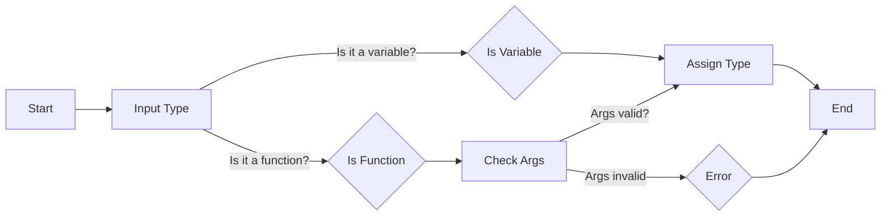

                 


### Introduction to Type Theory and Intuitive Understanding of Mathematical Concepts

**Keywords: Type Theory, Mathematical Concepts, Intuitive Understanding**

**Abstract:**
This article delves into the impact of type theory on the intuitive understanding of mathematical concepts. We will explore the foundational concepts, examine their implications, and discuss the practical applications of type theory in mathematics. By following a structured approach, we aim to provide a comprehensive evaluation of how type theory shapes our comprehension of mathematical ideas.

## Background

**Core Concepts Terms Explanation:**
- **Type Theory:** A branch of mathematical logic that deals with the classification and properties of types, which are used to classify objects and their operations in various formal systems.
- **Mathematical Intuition:** The ability to understand and visualize mathematical concepts, often through a process of abstraction and pattern recognition.

### Problem Background

The traditional approach to teaching and learning mathematics often relies heavily on formal definitions and rigorous proofs. However, this approach can sometimes lack clarity and intuition, making it difficult for learners to grasp fundamental concepts. Type theory offers a different perspective, providing a framework that can help bridge the gap between abstract definitions and intuitive understanding.

### Problem Description

The problem we aim to address is the lack of intuitive understanding of mathematical concepts, particularly among learners who struggle with abstract thinking and formal proofs. How can type theory be used to enhance this understanding and make mathematical concepts more accessible?

### Problem Solution

Type theory provides a set of tools and concepts that can help simplify complex mathematical ideas. By classifying objects and operations into distinct types, it becomes easier to understand how different concepts are related and how they can be combined to form more complex structures.

### Boundary and Scope

This article focuses on the impact of type theory on the intuitive understanding of mathematical concepts, particularly in areas such as set theory, category theory, and type theory in programming languages. We will not delve into the technical details of type theory but will instead focus on its broader implications for mathematical intuition.

## Core Concepts and Their Relationships

### Core Concepts

The core concepts of type theory include types, terms, and operations. These concepts can be defined and analyzed using various formal systems, such as the typed lambda calculus and the type theory in programming languages.

### Concept Attributes Comparison Table

| Concept       | Definition                                                      | Relationship to Other Concepts | Example |
|---------------|----------------------------------------------------------------|-----------------------------|---------|
| Types         | Classifications of objects and operations                         | Base for terms and operations | Natural numbers, functions |
| Terms         | Expressions made up of types and operations                     | Represent concepts           | 1 + 2   |
| Operations    | Functions that manipulate types                                 | Apply transformations        | Addition |

### ER Entity Relationship Diagram

A typical ER diagram for a simple type theory system might include entities such as "Types," "Terms," and "Operations," with relationships indicating how these entities interact.

```mermaid
erDiagram
  Types ||--|{ Terms }|>>
  Terms ||--|{ Operations }|>>
  Operations ||--|{ Types }|>>
```

## Mathematical Models and Formulas

### Mathematical Model Overview

Type theory provides a mathematical model for reasoning about types and their relationships. The typed lambda calculus is a prominent example, where types are represented by variables, terms by functions, and operations by lambda expressions.

### Formula Explanation and Examples

Let's consider a simple example from the typed lambda calculus: the function that adds two natural numbers. The type of this function can be represented as $\lambda m : \mathbb{N} . \lambda n : \mathbb{N} . m + n$, where $\mathbb{N}$ represents the type of natural numbers.

$$
\begin{align*}
(\lambda m : \mathbb{N} . \lambda n : \mathbb{N} . m + n) [2] [3] &= 2 + 3 \\
&= 5
\end{align*}
$$

In this example, the function is applied to two arguments, 2 and 3, resulting in the sum 5. This simple formula illustrates how type theory can be used to represent and reason about mathematical operations in a clear and intuitive way.

## Algorithm Principles

### Algorithm Flowchart

To understand how type theory can be applied in algorithms, let's consider a simple algorithm for type checking. The following Mermaid flowchart illustrates the process:



### Python Code Implementation

Here's a Python code snippet that demonstrates type checking using the concept of a simple type checker:

```python
def type_check(expr):
    if isinstance(expr, str):  # Assume string expressions are variables
        return "Variable"
    elif callable(expr):  # Assume callable expressions are functions
        return "Function"
    else:
        return "Invalid Expression"

# Example usage
expr = lambda x, y: x + y
print(type_check(expr))  # Output: Function
```

### Mathematical Model and Formula Explanation

In the context of type checking, the mathematical model involves defining a set of rules that determine the type of an expression based on its structure. For example, a function expression has a specific type based on the types of its arguments and the type of its body.

$$
\begin{align*}
Type(\lambda x : T_1 . \lambda y : T_2 . f(x, y)) &= (T_1 \rightarrow T_2) \rightarrow T_3
\end{align*}
$$

Here, $T_1$ and $T_2$ represent the types of the arguments, and $T_3$ represents the return type of the function. This formula provides a clear way to determine the type of a function expression based on its structure and the types of its components.

## Case Study: Type Theory in Programming Languages

### Case Introduction

Type theory has had a significant impact on programming languages, influencing the design and implementation of type systems. One notable example is the development of Haskell, a purely functional programming language with a strong type system based on type theory.

### Case Analysis and Explanation

Haskell's type system uses type inference to automatically determine the types of expressions, making it easier for developers to write correct and type-safe code. By employing type theory, Haskell can detect type errors at compile-time, reducing the likelihood of runtime errors.

### Case Summary

Type theory in Haskell provides a robust foundation for ensuring type safety and improving the clarity of code. It allows developers to express complex abstractions in a concise and intuitive way, making it easier to understand and reason about the behavior of programs.

## Best Practices and Tips

### Best Practices

- **Use Type Inference:** Leverage the power of type inference in programming languages like Haskell to reduce the amount of boilerplate code.
- **Explicit Typing:** When working with less expressive type systems, use explicit type annotations to ensure clarity and prevent errors.
- **Type-Safe Development:** Adopt type-safe development practices to catch errors early in the development process.

### Common Issues and Solutions

- **Type Errors:** To avoid type errors, ensure that all expressions have well-defined types and that the types of function arguments match the expected types.
- **Complexity:** Type theory can be complex, especially for beginners. Start with simpler concepts and gradually build up your understanding.

## Conclusion

In conclusion, type theory has a profound impact on the intuitive understanding of mathematical concepts. By providing a structured framework for classifying objects and operations, it simplifies complex mathematical ideas and enhances intuitive understanding. The examples and case studies presented in this article demonstrate the practical applications of type theory in mathematics and programming languages. As we continue to explore the boundaries of type theory, we can expect to uncover new ways to improve our understanding of mathematical concepts and their applications.

## Future Research Directions

As type theory continues to evolve, several research directions present themselves:

- **Integration with Category Theory:** Investigating how type theory can be integrated with category theory to create a unified framework for understanding mathematical structures.
- **Type Theory in Artificial Intelligence:** Exploring the potential of type theory in the development of artificial intelligence systems, particularly in areas such as automated reasoning and machine learning.
- **Type Inference Algorithms:** Developing more sophisticated type inference algorithms that can handle increasingly complex type systems.

By addressing these future research directions, we can continue to expand the scope and impact of type theory in mathematics and beyond.

