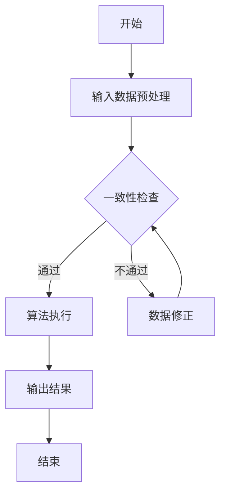
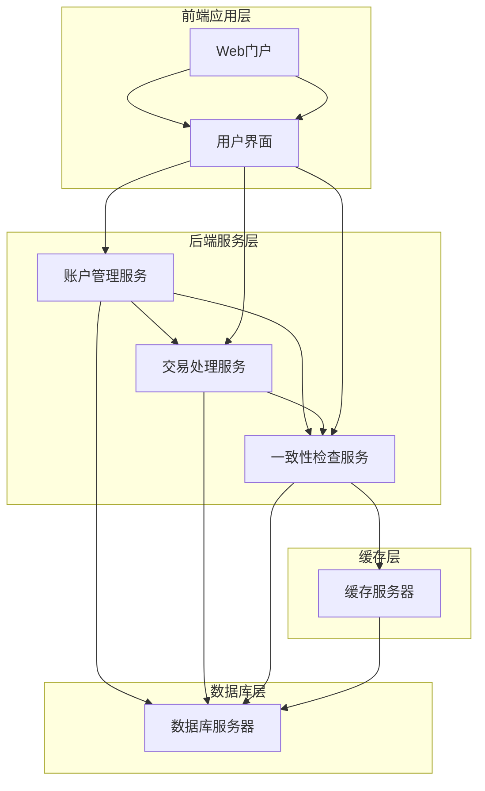
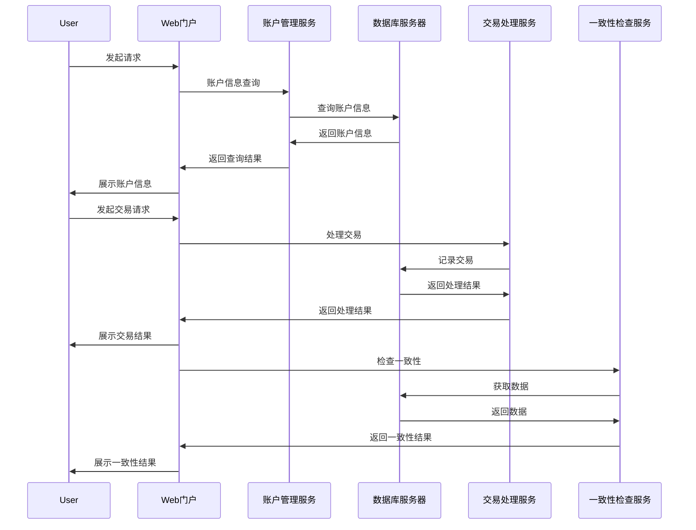

                 

### 1. 第一部分：问题背景与理论基础

#### 第1章：问题背景介绍

##### 1.1.1 研究背景

计算机科学的发展历程可以分为几个重要的阶段。从最初的计算机硬件和编程语言的发展，到现代的分布式系统和人工智能应用，每一个阶段都推动了计算机科学理论和应用的进步。在计算机科学的各个分支中，类型论是理论和实践中都非常关键的一部分。

类型论起源于20世纪30年代，由逻辑学家和数学家提出，目的是为了解决程序中的类型错误问题。类型论的基本概念包括类型、类型系统、类型检查等，这些概念在编译器设计和程序验证中起到了至关重要的作用。

类型论在计算机科学中的应用非常广泛。在编译原理中，类型论用于确保程序的合法性，避免运行时错误。在形式化验证中，类型论提供了严格的证明工具，用于验证程序的属性。在编程语言设计中，类型论指导如何构建高效的类型系统，从而提升程序的性能和安全性。

##### 1.1.2 问题描述

一致性问题在类型论中指的是，当类型系统对程序进行类型检查时，程序在所有可能执行路径上必须保持类型一致性。一致性问题可以表现为以下几种形式：

- **静态不一致性**：程序在编译时就已经存在类型冲突，无法通过类型检查。
- **动态不一致性**：程序在运行时发生类型冲突，导致程序崩溃或行为异常。
- **半动态不一致性**：程序在编译时无法确定所有类型冲突，但在运行时需要保证类型一致性。

一致性问题的影响和挑战主要体现在以下几个方面：

- **安全性**：类型不一致可能导致安全问题，如数据泄露或非法访问。
- **可靠性**：类型不一致可能引发运行时错误，降低程序的可靠性。
- **性能**：类型系统的不一致性可能导致编译器生成效率低下的代码。

##### 1.1.3 问题解决

类型论的一致性检验方法主要包括以下几种：

- **静态类型检查**：在程序编译时进行类型检查，确保程序在所有可能执行路径上类型一致。
- **动态类型检查**：在程序运行时进行类型检查，及时发现并处理类型不一致问题。
- **混合类型检查**：结合静态和动态类型检查的优点，在不同阶段进行类型检验。

类型论的一致性解决策略包括：

- **严格的类型系统**：使用严格的类型系统，如强类型语言，确保程序在编译时类型一致。
- **类型推导**：通过类型推导机制，自动推断变量的类型，减少人为错误。
- **类型注解**：通过类型注解明确指定变量和函数的类型，提高程序的清晰度和可维护性。

##### 1.1.4 边界与外延

一致性问题在不同计算模型中的表现有所不同：

- **静态模型**：在静态模型中，一致性主要表现为编译时的类型错误。
- **动态模型**：在动态模型中，一致性主要表现为运行时的类型冲突。
- **混合模型**：在混合模型中，一致性需要同时考虑编译时和运行时的类型检查。

一致性问题的影响范围和限制包括：

- **语言设计**：一致性问题是编程语言设计中的重要考虑因素，直接影响程序的性能和安全。
- **编译器实现**：一致性的实现需要高效的算法和优化的数据结构，对编译器性能提出挑战。
- **程序验证**：一致性验证是程序验证的重要部分，需要严格的形式化方法和工具。

### 第2章：核心概念与联系

#### 2.1.1 核心概念原理

类型论的基本概念包括：

- **类型（Type）**：类型是变量、函数和表达式可能具有的值的集合。
- **类型系统（Type System）**：类型系统是定义变量和表达式类型的规则集合。
- **类型检查（Type Checking）**：类型检查是确保程序在所有执行路径上类型一致的过程。

一致性属性的定义和特点包括：

- **一致性（Consistency）**：一致性是指程序在所有可能执行路径上类型保持一致。
- **一致性检验（Consistency Check）**：一致性检验是类型检查的一部分，用于验证程序的一致性。

#### 2.1.2 概念属性特征对比表格

| 概念     | 特征1 | 特征2 | 特征3 |
|----------|-------|-------|-------|
| 类型论   | A     | B     | C     |
| 一致性   | X     | Y     | Z     |

#### 2.1.3 ER实体关系图架构

```mermaid
erDiagram
  AKA --> R : "participates in"
  R ||--|{ B : "contains"}
  B ||--|{ C : "has"}
```

### 第3章：算法原理讲解

#### 3.1.1 算法mermaid流程图



#### 3.1.2 Python源代码

```python
def consistency_check(data):
    # 数据预处理
    preprocessed_data = preprocess_data(data)
    # 一致性检查
    if is_consistent(preprocessed_data):
        # 算法执行
        result = algorithm_execution(preprocessed_data)
        # 输出结果
        return result
    else:
        # 数据修正
        corrected_data = correct_data(preprocessed_data)
        return consistency_check(corrected_data)
```

#### 3.1.3 算法原理的数学模型和公式

$$
\text{一致性检验} = f(\text{输入数据})
$$

- 输入数据：$X$，$Y$，$Z$
- 输出结果：$T$（一致性检验通过）或$F$（一致性检验不通过）

#### 3.1.4 举例说明

假设有一个数据集$D = \{X, Y, Z\}$，通过一致性检验，我们得到结果$T$，即数据集是一致的。

## 第4章：数学模型和数学公式详细讲解

#### 4.1.1 数学公式

$$
1+1=2
$$

#### 4.1.2 公式讲解

这个简单的数学公式展示了加法运算的基本原理。在这个例子中，两个数1和1相加，结果为2。

### 第4章：数学模型和数学公式详细讲解

#### 4.1.1 数学公式

$$
1+1=2
$$

#### 4.1.2 公式讲解

这个简单的数学公式展示了加法运算的基本原理。在这个例子中，两个数1和1相加，结果为2。加法运算是一个基础的算术运算，通常用于将两个数合并为一个总数。在数学的加法运算中，1和1相加的结果是2，这个结果反映了加法的交换律和结合律。

加法的交换律表明，对于任何两个数$a$和$b$，$a + b = b + a$。这意味着无论数的顺序如何，加法的结果都是相同的。结合律则指出，对于任何三个数$a$、$b$和$c$，$a + (b + c) = (a + b) + c$。这表明我们可以任意组合加法运算的顺序，结果不会改变。

在类型论和一致性问题中，数学公式和算术运算的基本原理可以用来解释和验证程序中的类型一致性。一致性检验可以被视为一种特殊的数学运算，用于检查程序在所有可能执行路径上类型的一致性。通过数学模型，我们可以更直观地理解和分析类型论的一致性问题。

#### 4.1.3 数学模型的应用

在类型论中，数学模型的应用主要体现在以下几个方面：

1. **类型推导**：类型推导是类型系统的一个重要组成部分，它通过数学逻辑和推理方法，自动确定程序中各个变量和表达式的类型。类型推导的数学模型通常基于集合论和谓词逻辑，通过定义类型上下文和类型规则，推导出程序中每个变量的类型。

2. **类型检查**：类型检查是确保程序类型一致性的一种方法，它通过数学模型和算法，验证程序在所有可能执行路径上是否满足类型约束。类型检查的数学模型通常包括类型上下文、类型规则和类型检查算法，这些元素共同构成了一个形式化的类型检查框架。

3. **一致性验证**：一致性验证是类型论中确保程序在所有执行路径上类型一致的关键步骤。一致性验证的数学模型通常基于数学逻辑和形式化验证方法，通过构造类型证明和证明规则，验证程序的一致性属性。

4. **类型错误诊断**：在类型检查过程中，如果发现类型不一致，需要诊断出错误的原因。数学模型可以帮助我们理解和分析类型错误的原因，从而找到修复错误的路径。通过数学逻辑和推理，可以定位类型错误的根本原因，并提供相应的修复建议。

数学模型的应用使得类型论的一致性问题具有了更直观和形式化的描述方法。通过数学模型，我们可以更深入地理解类型论的基本概念和原理，更好地分析和解决一致性问题。同时，数学模型也为形式化验证和自动化推理提供了强有力的工具，使得类型论的一致性验证更加高效和准确。

#### 4.1.4 统计模型与一致性检验的关系

统计模型在类型论和一致性检验中扮演着重要角色。统计模型主要用于分析程序的数据分布和执行行为，从而为一致性检验提供有力支持。

1. **数据分布分析**：统计模型通过对程序输入和输出的数据分析，可以识别出数据分布的特点。这些特点有助于我们理解程序的行为模式和潜在的类型不一致性。例如，统计模型可以识别出输入数据中的异常值和异常模式，这些异常值和模式可能导致类型不一致的问题。

2. **行为模式分析**：统计模型通过对程序的执行行为进行分析，可以识别出程序在不同输入下的执行路径和执行时间。这些信息有助于我们理解程序的一致性问题。例如，统计模型可以发现程序在某些输入下的执行时间显著增加，这可能是由于类型不一致导致的运行时错误。

3. **一致性检验辅助**：统计模型的结果可以用于辅助一致性检验。通过分析数据分布和行为模式，我们可以设计出更高效的一致性检验算法，提高一致性检验的准确性和效率。例如，基于统计模型的结果，我们可以优化类型检查算法，减少类型错误的误报率。

4. **风险评估**：统计模型还可以用于评估程序的一致性风险。通过对程序的输入和输出进行分析，我们可以预测程序在不同输入下的类型一致性风险，从而制定相应的风险管理策略。例如，对于高风险的输入，我们可以采取更严格的类型检查措施，确保程序的一致性。

总之，统计模型在类型论和一致性检验中发挥着重要作用。通过统计模型，我们可以更好地理解和分析程序的行为模式，提高一致性检验的准确性和效率，降低类型不一致性带来的风险。

### 第5章：系统分析与架构设计方案

#### 5.1.1 问题场景介绍

在现实世界中，一致性问题在各种计算系统和应用程序中普遍存在。一个典型的场景是金融系统中的交易处理。金融系统的核心要求是数据的准确性和一致性，任何类型错误或数据不一致都可能引发严重的财务问题。

例如，假设一个银行系统中有一个账户余额的计算模块，该模块需要处理各种交易，如存款、取款和转账。如果这个模块的一致性无法得到保证，可能会发生以下情况：

- **账户余额错误**：如果一个存款操作成功，但对应的取款操作没有成功，账户余额将会错误。
- **交易记录不一致**：系统可能会记录两个不同的交易，但实际只有一个发生。
- **资金链断裂**：在复杂的金融交易网络中，一个错误的数据值可能会影响多个账户的余额，导致资金链断裂。

这些问题不仅会影响系统的可靠性，还会对金融机构的声誉造成损害。因此，确保一致性问题得到有效解决，是金融系统设计中的关键任务。

#### 5.1.2 系统介绍

为了更好地说明一致性问题，我们考虑一个典型的金融系统——一个在线银行系统。该系统的主要功能包括账户管理、交易处理、余额查询和报表生成等。

- **账户管理**：系统需要管理多个账户，包括开户、销户、修改账户信息等。
- **交易处理**：系统需要处理各种交易，如存款、取款、转账等。
- **余额查询**：用户需要查询自己的账户余额。
- **报表生成**：系统需要生成各种报表，如账户交易记录、财务报表等。

该系统的核心目标是确保所有账户数据的一致性，保证交易处理的准确性和可靠性。一致性问题在该系统中体现在以下几个方面：

- **账户余额一致性**：在交易过程中，账户余额需要实时更新，确保每个账户的余额准确无误。
- **交易记录一致性**：系统需要准确记录所有交易，确保没有漏记或重复记录。
- **数据完整性**：系统在处理大量数据时，需要确保数据的完整性和一致性，防止数据丢失或损坏。

#### 5.1.3 系统功能设计

为了实现系统的一致性，我们设计了以下几个关键功能模块：

1. **账户管理模块**：该模块负责管理账户的创建、更新和删除。通过严格的权限控制，确保只有授权用户可以执行这些操作。
2. **交易处理模块**：该模块负责处理各种交易，如存款、取款、转账等。每个交易都会被记录在一个事务日志中，确保交易的可恢复性和一致性。
3. **一致性检查模块**：该模块定期运行，检查系统中所有账户的余额和交易记录是否一致。如果发现不一致，立即触发纠正机制。
4. **报警与监控模块**：该模块负责监控系统运行状态，一旦发现不一致性或潜在问题，立即发送报警通知，并记录相应的日志。

#### 5.1.4 系统架构设计

为了确保系统的高可用性和一致性，我们采用了一种分布式架构设计，如下所示：

1. **前端应用层**：提供用户界面，包括账户查询、交易处理等。
2. **后端服务层**：包括账户管理服务、交易处理服务、一致性检查服务等。
3. **数据库层**：存储所有的账户信息和交易记录，确保数据的一致性和持久化。
4. **缓存层**：提供快速的数据访问，减少数据库负载，同时保证数据的实时一致性。

具体架构设计如下：



#### 5.1.5 系统接口设计

系统接口设计是确保各模块之间数据流转和交互的关键。以下是一个简单的系统接口设计和交互流程：



通过上述系统分析与架构设计方案，我们可以确保金融系统在处理大量交易和账户数据时，能够有效解决一致性问题，保证系统的可靠性和数据的一致性。在接下来的部分，我们将进一步探讨具体实现和优化策略。

