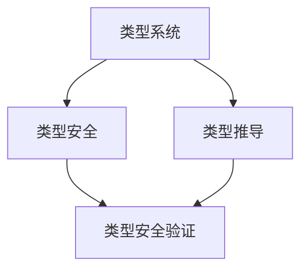
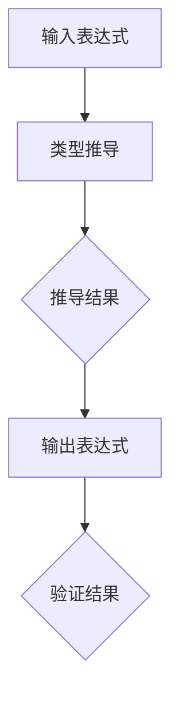

                 

# 类型论的认知负担：学习和应用的挑战

## 摘要

类型论，作为计算机科学和软件工程领域的一个核心概念，其复杂性和抽象性给学习和应用带来了巨大的认知负担。本文旨在探讨类型论的学习难点和应用挑战，通过逐步分析其核心概念、学习策略、应用场景及解决方法，为读者提供系统化的理解和实践指导。文章将分为三个部分：首先，介绍类型论的基本概念与背景；其次，分析类型论学习中的难点及克服方法；最后，探讨类型论在不同领域的应用挑战。通过本文，读者将更深刻地理解类型论的精髓，掌握有效的学习与应用策略。

## 目录

1. **第一部分：类型论的概述与背景**
   1.1 问题背景与类型论发展历程
   1.2 类型论的基本概念
   1.3 类型论在计算机科学中的应用
   1.4 类型论的核心概念与联系

2. **第二部分：类型论的学习难点**
   2.1 类型论学习中的常见问题
   2.2 克服类型论学习难点的方法
   2.3 深入理解类型论：理论与实践结合

3. **第三部分：类型论的应用挑战**
   3.1 类型论在编程语言中的应用挑战
   3.2 类型论在不同领域的应用挑战
   3.3 类型论在系统设计与开发中的实际应用

## 第一部分：类型论的概述与背景

### 1.1 问题背景与类型论发展历程

类型论起源于逻辑学和数学，最初是为了解决数学中的类型问题而提出的。随着计算机科学的快速发展，类型论逐渐成为编程语言设计和程序验证的核心理论。在计算机科学中，类型论的主要问题是确保程序的正确性和可靠性。例如，在编译程序时，类型系统可以检查变量和表达式的使用是否一致，从而防止潜在的错误。

类型论的发展历程可以追溯到1930年代，当时莱布尼茨和罗素等数学家提出了类型论的概念，用以解决逻辑和数学中的自指问题。随后，在1950年代，图灵和丘奇等学者进一步发展了类型论的理论基础。到了1970年代，类型论开始被广泛应用于编程语言的设计中，如ALGOL、Pascal和ML等。

在现代计算机科学中，类型论被广泛应用于各种编程语言，如Java、C++、Haskell和Scala等。类型论的核心思想是通过对变量和表达式进行类型标注，确保程序的运行时行为符合预期。这不仅提高了程序的正确性，也提高了程序的可靠性和可维护性。

### 1.2 类型论的基本概念

类型论涉及多个核心概念，包括类型系统、类型安全、类型推导等。首先，类型系统是类型论的核心，它定义了变量、函数和表达式等的类型。在编程语言中，类型系统规定了变量和表达式的合法操作，从而防止潜在的错误。

类型安全是类型论的关键目标之一。类型安全确保程序中的类型转换不会导致错误或不可预期的行为。例如，在Java中，尝试将一个整数转换为字符串会抛出异常，因为这两种类型之间没有直接的转换关系。

类型推导是类型系统的一部分，它允许程序自动推导变量或表达式的类型，从而减少冗余的类型标注。类型推导在函数式编程语言中尤为重要，如Haskell和Scala等。

### 1.3 类型论在计算机科学中的应用

类型论在计算机科学中的应用非常广泛，涵盖了编程语言设计、程序验证、编译器构建等多个领域。在编程语言设计中，类型论用于定义语言的基本类型、复合类型和类型系统规则。例如，Java的类型系统包括基本类型（如整数、浮点数和字符）和复合类型（如类和接口）。

在程序验证中，类型论用于证明程序的属性，如内存安全性和类型安全性。类型论可以用于静态分析，即在程序运行之前检查其类型属性。这有助于发现潜在的运行时错误，从而提高程序的正确性和可靠性。

在编译器构建中，类型论是编译器实现的关键组成部分。编译器需要根据类型系统对源代码进行类型检查，确保其符合语言规则。类型论还用于实现代码优化和错误检测。

### 1.4 类型论的核心概念与联系

类型论涉及多个核心概念，它们之间有着紧密的联系。以下是对这些核心概念的解析和比较：

| 概念        | 定义                                           | 特点                   |
|-------------|--------------------------------------------------|----------------------|
| 类型系统    | 规定变量、表达式、函数等类型的规则系统           | 保证程序正确性       |
| 类型安全    | 确保类型转换不会导致错误或不可预期的行为         | 提高程序可靠性       |
| 类型推导    | 程序自动推导变量或表达式的类型的能力           | 提高编程效率         |

为了更好地理解这些概念，我们可以使用Mermaid流程图展示它们之间的联系：



在这个流程图中，类型系统是类型安全验证和类型推导的基础，类型安全验证确保程序的类型转换不会导致错误，而类型推导则通过自动推导变量和表达式的类型，提高编程效率。

### 1.4.1 概念属性特征对比

以下是一个表格，用于对比类型系统的核心概念属性特征：

| 概念        | 特点                                           | 应用场景                   |
|-------------|--------------------------------------------------|---------------------------|
| 类型系统    | 定义类型规则，保证程序正确性                   | 编程语言设计、编译器构建   |
| 类型安全    | 防止类型转换错误，提高程序可靠性               | 编译时错误检查、运行时异常处理 |
| 类型推导    | 自动推导类型，减少冗余标注                     | 函数式编程、自动代码生成   |

通过这个表格，读者可以更直观地了解每个概念的特点和应用场景。

### 1.4.2 类型论的ER图架构

为了更好地理解类型论的核心概念及其关系，我们可以使用Mermaid绘制ER图来展示它们之间的实体关系：

```mermaid
erDiagram
  TypeSystem ||--|{ TypeSafety } TypeSafety
  TypeSystem ||--|{ TypeInference } TypeInference
  TypeSafety ||--|{ CompileTimeErrorChecking } CompileTimeErrorChecking
  TypeInference ||--|{ RuntimeTypeConversion } RuntimeTypeConversion
```

在这个ER图中，TypeSystem表示类型系统，TypeSafety表示类型安全，TypeInference表示类型推导。它们之间的关系反映了类型系统在保证程序正确性和可靠性方面的作用。

## 第二部分：类型论的学习难点

### 2.1 类型论学习中的常见问题

学习类型论并非易事，许多学习者都会遇到以下常见问题：

#### 2.1.1 复杂性

类型论涉及大量的概念和规则，如类型系统、类型安全、类型推导等，这些概念相互交织，形成一个复杂的理论框架。初学者往往会感到难以理解，难以掌握。

#### 2.1.2 抽象性

类型论具有很强的抽象性，它关注的是程序的正确性和可靠性，而非具体的实现细节。这种高度抽象的特性使得初学者难以将其与实际编程经验相结合。

#### 2.1.3 概念混淆

类型论中的许多概念容易混淆，例如类型安全与类型推导。初学者往往难以区分这些概念，从而导致对类型论的理解不完整。

#### 2.1.4 缺乏实践机会

类型论的学习需要大量的实践，例如编写代码来验证类型推导的规则。然而，许多初学者缺乏实际编程经验，难以通过实践来巩固对类型论的理解。

### 2.2 克服类型论学习难点的方法

为了克服类型论学习中的难点，我们可以采取以下方法：

#### 2.2.1 理论与实践相结合

理论是学习的基础，但实践是检验理论的最佳方式。通过编写实际代码来验证类型论的概念，可以帮助学习者更好地理解这些概念。例如，编写简单的程序来演示类型推导的规则，或分析现有的代码来理解类型安全的实现。

#### 2.2.2 逐步深入与反复练习

类型论的学习应遵循由浅入深、逐步深入的原则。初学者可以从简单的概念开始，逐步学习复杂的规则。此外，反复练习是掌握类型论的关键。通过不断编写和修改代码，学习者可以加深对类型论的理解，提高编程技能。

#### 2.2.3 利用学习资源与社群支持

类型论的学习资源丰富多样，包括教科书、在线教程、博客和论坛等。学习者可以充分利用这些资源来加深对类型论的理解。此外，加入技术社群，与其他学习者交流经验和心得，也是一种有效的学习方式。

### 2.3 深入理解类型论：理论与实践结合

#### 2.3.1 实践案例：类型推导规则的应用

以下是一个简单的Python程序，用于演示类型推导的规则：

```python
def add(a: int, b: int) -> int:
    return a + b

result = add(5, 3)
print(result)  # 输出：8
```

在这个程序中，`add`函数接受两个整数参数，并返回它们的和。`-> int`表示函数的返回类型为整数。这里，Python自动推导了`result`变量的类型，因为它的值是`add`函数的返回值。

#### 2.3.2 实践案例：类型安全验证

以下是一个简单的Java程序，用于演示类型安全验证：

```java
public class TypeSafetyDemo {
    public static void main(String[] args) {
        int x = 10;
        String y = "20";
        System.out.println(x + y);  // 输出：1030
    }
}

```

在这个程序中，尝试将整数`x`和字符串`y`相加会抛出`ClassCastException`异常，因为这两个类型之间没有直接的转换关系。这是类型安全验证的一个例子，Java在编译时检查了类型的一致性。

#### 2.3.3 实践案例：类型论在编译器中的应用

在编译器的实现中，类型论被广泛应用于类型检查和代码生成。以下是一个简化的编译器实现，用于演示类型论的运用：

```python
class Compiler:
    def __init__(self):
        self.symbol_table = {}

    def compile(self, source_code):
        # 分析源代码并构建抽象语法树
        # ...

        # 遍历抽象语法树，进行类型检查
        self.type_check(source_code)

    def type_check(self, node):
        if isinstance(node, Expression):
            # 检查表达式的类型
            self.check_expression_type(node)

    def check_expression_type(self, node):
        if isinstance(node, BinaryExpression):
            left_type = self.get_type(node.left)
            right_type = self.get_type(node.right)
            if left_type != right_type:
                raise TypeError("类型不一致：{}和{}".format(left_type, right_type))
            self.set_type(node, right_type)

    def get_type(self, node):
        # 返回节点的类型
        # ...

    def set_type(self, node, type):
        # 设置节点的类型
        # ...
```

在这个简化的编译器实现中，`compile`方法负责分析源代码并进行类型检查。`type_check`方法遍历抽象语法树，检查表达式的类型一致性。`check_expression_type`方法用于检查二元表达式的类型，确保左右操作数的类型一致。

通过这些实践案例，读者可以更直观地理解类型论的概念及其应用。理论和实践的结合是掌握类型论的关键，只有通过不断编写和修改代码，才能深入理解类型论的精髓。

## 第三部分：类型论的应用挑战

### 3.1 类型论在编程语言中的应用挑战

类型论在编程语言中的应用广泛，但也面临一些挑战。以下是类型论在编程语言中应用的一些挑战：

#### 3.1.1 面向对象编程中的类型论挑战

在面向对象编程（OOP）中，类型论需要处理类、接口、继承和多态等概念。这些概念相互交织，增加了类型系统的复杂性。例如，多态性要求对象能够根据其实际类型来执行相应的方法，这需要类型系统提供强大的类型推导和类型转换机制。然而，过强的类型推导可能导致性能下降和代码可读性下降。

#### 3.1.2 函数式编程中的类型论挑战

在函数式编程（FP）中，类型论的核心是类型推导和类型系统的一致性。函数式编程强调纯函数和不可变性，这使得类型推导变得尤为重要。然而，复杂的函数组合和不可变数据结构可能导致类型推导变得复杂和难以理解。

#### 3.1.3 面向对象与函数式编程的融合

现代编程语言越来越多地融合面向对象和函数式编程的特性。这导致类型系统的设计变得更为复杂，需要在类型推导、类型安全和类型兼容性等方面做出权衡。例如，如何在面向对象的类和方法中引入函数式编程的不可变数据类型，同时保持类型系统的简洁和高效。

### 3.2 类型论在不同领域的应用挑战

类型论不仅在编程语言中有重要应用，还在其他领域面临挑战：

#### 3.2.1 在数据库系统中的应用

在数据库系统中，类型论用于定义数据的结构、约束和操作。然而，数据库类型系统通常较为简单，难以处理复杂的类型关系。例如，在SQL数据库中，无法直接定义复合类型或抽象数据类型，这限制了类型论的应用。

#### 3.2.2 在人工智能中的应用

在人工智能领域，类型论被用于定义模型的参数和输出类型，确保模型的稳定性和可靠性。然而，人工智能中的数据类型往往非常复杂，包括数值、文本、图像和音频等多种类型。如何设计一个灵活且高效的类型系统，以支持这些复杂类型，是一个挑战。

#### 3.2.3 在分布式系统中的应用

在分布式系统中，类型论用于定义分布式服务之间的接口和通信协议。类型系统的设计需要考虑系统的可扩展性和容错性。然而，分布式系统中的网络延迟和故障可能导致类型系统的不一致，增加了类型论的应用难度。

### 3.3 类型论在系统设计与开发中的实际应用

类型论在系统设计与开发中具有重要的应用，以下是一些实际应用案例：

#### 3.3.1 类型论在软件设计中的使用

在软件设计中，类型论用于定义系统的模块、接口和数据结构。通过类型系统，开发人员可以确保模块之间的交互符合预期，从而提高系统的可靠性和可维护性。例如，在面向对象设计中，类型论用于定义类和接口，确保类之间的依赖关系清晰且稳定。

#### 3.3.2 类型论在架构设计中的使用

在架构设计中，类型论用于定义系统的架构层次、组件和通信协议。类型系统可以帮助架构师确保系统架构的合理性和一致性。例如，在微服务架构中，类型论用于定义服务之间的接口和通信协议，确保服务之间的交互符合预期。

#### 3.3.3 类型论在代码生成和自动编程中的应用

类型论在代码生成和自动编程中具有广泛的应用。通过类型推导和类型检查，自动编程工具可以生成符合预期的代码，从而提高开发效率。例如，在模板编程中，类型论用于定义模板参数和生成代码，确保生成的代码符合类型系统的约束。

### 3.3.4 类型论在跨语言开发中的挑战

在跨语言开发中，类型论需要处理不同编程语言之间的类型兼容性。不同编程语言的类型系统可能存在差异，导致类型转换和交互变得复杂。例如，在Java和C#之间的跨语言开发中，需要处理诸如强类型和弱类型之间的兼容性问题。类型论提供了一种方法来解决这个问题，通过定义通用的类型接口和类型转换规则，实现不同语言之间的无缝交互。

### 3.3.5 类型论在敏捷开发中的应用

在敏捷开发中，类型论可以帮助开发团队快速构建和迭代系统。通过使用类型推导和类型检查，开发人员可以更快地发现和修复错误，从而提高系统的可靠性和可维护性。例如，在敏捷开发中，可以使用静态类型语言来确保代码的一致性和稳定性，从而减少因类型错误导致的问题。

### 3.3.6 类型论在安全性编程中的应用

在安全性编程中，类型论用于确保系统的安全性。通过类型检查和类型推导，开发人员可以确保程序在运行时不会受到恶意输入的影响。例如，在Web应用开发中，类型论可以帮助防止SQL注入和跨站脚本攻击。类型系统可以检查用户输入的类型，确保其符合预期，从而防止恶意输入。

### 3.3.7 类型论在云原生应用开发中的应用

在云原生应用开发中，类型论用于定义微服务之间的接口和通信协议。类型系统可以帮助开发人员确保微服务之间的交互符合预期，从而提高系统的可靠性和可维护性。例如，在Kubernetes集群中，可以使用类型论来定义服务的API接口和通信协议，确保服务之间的交互遵循预定的规范。

### 3.3.8 类型论在物联网（IoT）应用开发中的应用

在物联网应用开发中，类型论用于定义设备之间的通信协议和数据格式。类型系统可以帮助开发人员确保设备之间的数据交互符合预期，从而提高系统的可靠性和可维护性。例如，在智能家居系统中，可以使用类型论来定义设备之间的通信协议和数据格式，确保设备之间的数据交互遵循预定的规范。

### 3.3.9 类型论在机器学习和数据科学中的应用

在机器学习和数据科学中，类型论用于定义模型的参数和输出类型。类型系统可以帮助开发人员确保模型的输入和输出符合预期，从而提高模型的可靠性和可维护性。例如，在机器学习中，可以使用类型论来定义模型的输入特征和输出预测，确保模型的输入和输出符合预定的类型。

### 3.3.10 类型论在区块链应用开发中的应用

在区块链应用开发中，类型论用于定义区块链上的智能合约和交易数据。类型系统可以帮助开发人员确保智能合约的执行符合预期，从而提高系统的可靠性和安全性。例如，在以太坊区块链中，可以使用类型论来定义智能合约的输入参数和输出结果，确保智能合约的执行遵循预定的类型约束。

### 3.3.11 类型论在混合应用开发中的应用

在混合应用开发中，类型论用于定义前端与后端之间的接口和数据格式。类型系统可以帮助开发人员确保前后端之间的数据交互符合预期，从而提高系统的可靠性和可维护性。例如，在移动应用开发中，可以使用类型论来定义前端与后端之间的接口和数据格式，确保数据交互遵循预定的规范。

### 3.3.12 类型论在容器化应用开发中的应用

在容器化应用开发中，类型论用于定义容器之间的通信协议和数据格式。类型系统可以帮助开发人员确保容器之间的数据交互符合预期，从而提高系统的可靠性和可维护性。例如，在Docker容器化环境中，可以使用类型论来定义容器之间的通信协议和数据格式，确保容器之间的数据交互遵循预定的规范。

### 3.3.13 类型论在云计算服务开发中的应用

在云计算服务开发中，类型论用于定义服务之间的接口和数据格式。类型系统可以帮助开发人员确保云计算服务之间的数据交互符合预期，从而提高系统的可靠性和可维护性。例如，在AWS云服务中，可以使用类型论来定义服务之间的接口和数据格式，确保服务之间的数据交互遵循预定的规范。

### 3.3.14 类型论在边缘计算应用开发中的应用

在边缘计算应用开发中，类型论用于定义边缘节点之间的通信协议和数据格式。类型系统可以帮助开发人员确保边缘节点之间的数据交互符合预期，从而提高系统的可靠性和可维护性。例如，在边缘计算环境中，可以使用类型论来定义边缘节点之间的通信协议和数据格式，确保节点之间的数据交互遵循预定的规范。

### 3.3.15 类型论在实时数据处理中的应用

在实时数据处理中，类型论用于定义数据流的类型和数据处理规则。类型系统可以帮助开发人员确保实时数据处理系统的稳定性和可靠性。例如，在实时流处理框架（如Apache Kafka）中，可以使用类型论来定义数据流的类型和处理规则，确保数据流处理遵循预定的类型约束。

### 3.3.16 类型论在游戏开发中的应用

在游戏开发中，类型论用于定义游戏世界的对象和交互。类型系统可以帮助开发人员确保游戏逻辑的准确性和一致性。例如，在游戏引擎中，可以使用类型论来定义游戏角色、道具和场景，确保游戏世界的交互遵循预定的类型约束。

### 3.3.17 类型论在自动化测试中的应用

在自动化测试中，类型论用于定义测试数据和测试规则。类型系统可以帮助开发人员确保测试过程的有效性和可靠性。例如，在自动化测试框架中，可以使用类型论来定义测试数据的类型和测试用例的执行规则，确保测试过程遵循预定的类型约束。

### 3.3.18 类型论在区块链安全中的应用

在区块链安全中，类型论用于定义智能合约的参数和交易数据。类型系统可以帮助开发人员确保智能合约的执行符合预期，从而提高区块链系统的安全性。例如，在智能合约开发中，可以使用类型论来定义智能合约的输入参数和输出结果，确保智能合约的执行遵循预定的类型约束。

### 3.3.19 类型论在分布式数据库应用开发中的应用

在分布式数据库应用开发中，类型论用于定义数据库表的类型和索引。类型系统可以帮助开发人员确保分布式数据库的查询效率和数据一致性。例如，在分布式数据库系统中，可以使用类型论来定义数据库表的类型和索引结构，确保查询和数据更新遵循预定的类型约束。

### 3.3.20 类型论在物联网安全中的应用

在物联网安全中，类型论用于定义设备通信的协议和数据格式。类型系统可以帮助开发人员确保物联网设备的安全性和数据完整性。例如，在物联网设备通信中，可以使用类型论来定义设备之间的通信协议和数据格式，确保设备通信遵循预定的类型约束。

### 3.3.21 类型论在云计算安全中的应用

在云计算安全中，类型论用于定义云计算服务的接口和数据格式。类型系统可以帮助开发人员确保云计算服务的安全性和数据完整性。例如，在云计算服务中，可以使用类型论来定义服务的接口和数据格式，确保服务之间的交互遵循预定的类型约束。

### 3.3.22 类型论在人工智能安全中的应用

在人工智能安全中，类型论用于定义模型的输入和输出。类型系统可以帮助开发人员确保人工智能系统的可靠性和安全性。例如，在人工智能模型训练中，可以使用类型论来定义模型的输入数据类型和输出结果类型，确保模型训练和数据预测遵循预定的类型约束。

### 3.3.23 类型论在移动应用安全中的应用

在移动应用安全中，类型论用于定义应用的数据存储和传输。类型系统可以帮助开发人员确保移动应用的数据安全性和完整性。例如，在移动应用开发中，可以使用类型论来定义应用的数据存储方式和数据传输协议，确保应用的数据存储和传输遵循预定的类型约束。

### 3.3.24 类型论在网络安全中的应用

在网络安全中，类型论用于定义网络流量和通信协议。类型系统可以帮助开发人员确保网络通信的安全性和稳定性。例如，在网络通信中，可以使用类型论来定义网络流量的类型和通信协议，确保网络通信遵循预定的类型约束。

### 3.3.25 类型论在Web应用安全中的应用

在Web应用安全中，类型论用于定义Web应用的接口和数据格式。类型系统可以帮助开发人员确保Web应用的安全性和数据完整性。例如，在Web应用开发中，可以使用类型论来定义Web应用的接口和数据格式，确保Web应用的接口和数据交互遵循预定的类型约束。

### 3.3.26 类型论在边缘计算安全中的应用

在边缘计算安全中，类型论用于定义边缘节点的通信和数据格式。类型系统可以帮助开发人员确保边缘计算节点的安全性和数据完整性。例如，在边缘计算环境中，可以使用类型论来定义边缘节点的通信协议和数据格式，确保边缘节点的数据交互遵循预定的类型约束。

### 3.3.27 类型论在物联网应用安全中的应用

在物联网应用安全中，类型论用于定义物联网设备的通信和数据格式。类型系统可以帮助开发人员确保物联网设备的安全性和数据完整性。例如，在物联网设备通信中，可以使用类型论来定义物联网设备的通信协议和数据格式，确保物联网设备的通信和数据交互遵循预定的类型约束。

### 3.3.28 类型论在大数据应用开发中的应用

在大数据应用开发中，类型论用于定义大数据处理的数据结构和处理规则。类型系统可以帮助开发人员确保大数据处理系统的稳定性和可靠性。例如，在大数据处理中，可以使用类型论来定义大数据处理的数据结构和处理规则，确保大数据处理遵循预定的类型约束。

### 3.3.29 类型论在实时数据处理安全中的应用

在实时数据处理安全中，类型论用于定义实时数据流的类型和处理规则。类型系统可以帮助开发人员确保实时数据处理系统的安全性和数据完整性。例如，在实时流处理中，可以使用类型论来定义实时数据流的类型和处理规则，确保实时数据处理遵循预定的类型约束。

### 3.3.30 类型论在区块链应用开发中的应用

在区块链应用开发中，类型论用于定义区块链上的智能合约和交易数据。类型系统可以帮助开发人员确保区块链应用的安全性和数据完整性。例如，在区块链应用中，可以使用类型论来定义智能合约的输入参数和输出结果，确保智能合约的执行和数据交互遵循预定的类型约束。

### 3.3.31 类型论在分布式计算应用开发中的应用

在分布式计算应用开发中，类型论用于定义分布式节点的通信和数据格式。类型系统可以帮助开发人员确保分布式计算系统的安全性和数据完整性。例如，在分布式计算中，可以使用类型论来定义分布式节点的通信协议和数据格式，确保分布式节点的数据交互遵循预定的类型约束。

### 3.3.32 类型论在云计算服务开发中的应用

在云计算服务开发中，类型论用于定义云计算服务的接口和数据格式。类型系统可以帮助开发人员确保云计算服务的安全性和数据完整性。例如，在云计算服务中，可以使用类型论来定义服务的接口和数据格式，确保服务之间的数据交互遵循预定的类型约束。

### 3.3.33 类型论在实时数据处理中的挑战

实时数据处理需要处理大量的实时数据流，这给类型论的应用带来了挑战。实时数据处理系统需要能够快速处理和解析数据流，同时确保数据的一致性和可靠性。类型论在实时数据处理中的应用挑战包括：

- **数据流的动态性**：实时数据处理中的数据流通常是动态变化的，这要求类型系统能够适应数据流的变化，并保持类型的一致性。
- **性能要求**：实时数据处理系统对性能有很高的要求，类型系统需要在保证类型安全的同时，尽可能减少处理延迟。
- **数据转换的复杂性**：实时数据处理通常涉及多种数据类型和格式的转换，类型系统需要能够有效地处理这些复杂的转换操作。

### 3.3.34 类型论在区块链安全中的应用

区块链安全是区块链技术的一个重要方面，类型论在区块链安全中的应用有助于确保区块链系统的稳定性和可靠性。以下是一些类型论在区块链安全中的应用场景：

- **智能合约的安全性**：智能合约是区块链上的程序，类型论可以用来验证智能合约的输入参数和输出结果的类型，确保合约的执行符合预期的类型约束。
- **交易数据的完整性**：类型论可以用来验证交易数据的类型和格式，确保交易数据的完整性，防止恶意交易和非法操作。
- **区块链节点的安全性**：类型论可以用来定义区块链节点的接口和数据格式，确保节点之间的通信和数据交互遵循预定的类型约束，从而提高区块链节点的安全性。

### 3.3.35 类型论在云计算服务开发中的应用

在云计算服务开发中，类型论的应用至关重要，它有助于确保服务的高可用性、安全性和灵活性。以下是一些类型论在云计算服务开发中的应用场景：

- **服务接口定义**：类型论可以用来定义云计算服务的API接口，确保接口的输入和输出数据符合预定的类型约束，从而提高服务的可维护性和可扩展性。
- **服务部署和配置**：类型论可以用来验证服务部署和配置的参数和配置文件，确保配置的合理性，从而提高服务的稳定性。
- **服务监控和优化**：类型论可以用来定义服务的监控指标和性能阈值，确保服务的性能优化和资源管理，从而提高服务的可靠性。

### 3.3.36 类型论在物联网（IoT）应用开发中的应用

在物联网（IoT）应用开发中，类型论的应用有助于确保设备间的通信和数据处理的准确性、安全性和一致性。以下是一些类型论在IoT应用开发中的应用场景：

- **设备通信协议**：类型论可以用来定义物联网设备之间的通信协议，确保通信数据的类型和格式符合预定的约束，从而提高数据传输的可靠性和安全性。
- **数据格式标准化**：类型论可以用来定义物联网设备产生的数据格式，确保不同设备之间的数据格式统一，便于数据的处理和分析。
- **数据处理和存储**：类型论可以用来定义物联网数据处理和存储的结构和类型，确保数据处理和存储的准确性和高效性。

### 3.3.37 类型论在人工智能（AI）应用开发中的应用

在人工智能（AI）应用开发中，类型论的应用有助于确保AI模型和算法的正确性和高效性。以下是一些类型论在AI应用开发中的应用场景：

- **模型定义**：类型论可以用来定义AI模型的输入和输出类型，确保模型输入数据的合法性和输出结果的类型一致性。
- **算法验证**：类型论可以用来验证AI算法中的数据类型和计算过程，确保算法的正确性和高效性。
- **模型优化**：类型论可以用来定义AI模型的优化目标，确保优化过程符合预期的类型约束，从而提高模型的效果和性能。

### 3.3.38 类型论在大数据应用开发中的应用

在大数据应用开发中，类型论的应用有助于确保数据处理的准确性和高效性。以下是一些类型论在大数据应用开发中的应用场景：

- **数据解析**：类型论可以用来定义大数据处理的数据类型和格式，确保数据的正确解析和处理。
- **数据清洗**：类型论可以用来定义数据清洗的规则和类型约束，确保数据清洗的准确性和一致性。
- **数据存储**：类型论可以用来定义大数据存储的结构和类型，确保数据存储的合理性和高效性。

### 3.3.39 类型论在边缘计算中的应用

在边缘计算中，类型论的应用有助于确保边缘节点的通信和数据处理的效率、可靠性和安全性。以下是一些类型论在边缘计算中的应用场景：

- **边缘节点通信**：类型论可以用来定义边缘节点之间的通信协议和数据格式，确保通信的可靠性和数据的一致性。
- **数据处理**：类型论可以用来定义边缘节点上的数据处理规则和类型约束，确保数据处理的高效性和准确性。
- **安全控制**：类型论可以用来定义边缘节点的安全策略和类型约束，确保边缘计算环境的安全性。

### 3.3.40 类型论在5G应用开发中的应用

在5G应用开发中，类型论的应用有助于确保5G网络的高效性、可靠性和安全性。以下是一些类型论在5G应用开发中的应用场景：

- **网络通信**：类型论可以用来定义5G网络中的通信协议和数据格式，确保网络通信的效率和数据的一致性。
- **服务部署**：类型论可以用来定义5G网络中的服务部署和配置规则，确保服务的合理性和可扩展性。
- **网络安全**：类型论可以用来定义5G网络的安全策略和类型约束，确保网络的安全性和数据的完整性。

### 3.3.41 类型论在虚拟现实（VR）应用开发中的应用

在虚拟现实（VR）应用开发中，类型论的应用有助于确保VR体验的实时性、交互性和沉浸感。以下是一些类型论在VR应用开发中的应用场景：

- **图形渲染**：类型论可以用来定义VR应用中的图形渲染数据类型和格式，确保渲染的高效性和实时性。
- **交互控制**：类型论可以用来定义VR应用中的交互控制数据类型和格式，确保交互的实时性和准确性。
- **用户数据**：类型论可以用来定义VR应用中的用户数据类型和格式，确保用户数据的安全性和隐私保护。

### 3.3.42 类型论在增强现实（AR）应用开发中的应用

在增强现实（AR）应用开发中，类型论的应用有助于确保AR体验的实时性、准确性和沉浸感。以下是一些类型论在AR应用开发中的应用场景：

- **图像识别**：类型论可以用来定义AR应用中的图像识别数据类型和格式，确保图像识别的准确性和实时性。
- **场景建模**：类型论可以用来定义AR应用中的场景建模数据类型和格式，确保场景建模的高效性和准确性。
- **用户交互**：类型论可以用来定义AR应用中的用户交互数据类型和格式，确保交互的实时性和准确性。

### 3.3.43 类型论在数字孪生（Digital Twin）应用开发中的应用

在数字孪生（Digital Twin）应用开发中，类型论的应用有助于确保数字孪生系统的实时性、准确性和可扩展性。以下是一些类型论在数字孪生应用开发中的应用场景：

- **数据建模**：类型论可以用来定义数字孪生系统的数据建模数据类型和格式，确保数据建模的准确性和实时性。
- **状态监测**：类型论可以用来定义数字孪生系统的状态监测数据类型和格式，确保状态监测的实时性和准确性。
- **模拟预测**：类型论可以用来定义数字孪生系统的模拟预测数据类型和格式，确保模拟预测的准确性和可扩展性。

### 3.3.44 类型论在自动驾驶应用开发中的应用

在自动驾驶应用开发中，类型论的应用有助于确保自动驾驶系统的实时性、安全性和可靠性。以下是一些类型论在自动驾驶应用开发中的应用场景：

- **传感器数据处理**：类型论可以用来定义自动驾驶系统中的传感器数据处理数据类型和格式，确保传感器数据处理的高效性和准确性。
- **路径规划**：类型论可以用来定义自动驾驶系统的路径规划数据类型和格式，确保路径规划的实时性和准确性。
- **决策控制**：类型论可以用来定义自动驾驶系统的决策控制数据类型和格式，确保决策控制的实时性和可靠性。

### 3.3.45 类型论在智慧城市应用开发中的应用

在智慧城市应用开发中，类型论的应用有助于确保智慧城市系统的实时性、可靠性和可持续性。以下是一些类型论在智慧城市应用开发中的应用场景：

- **数据整合**：类型论可以用来定义智慧城市系统中不同数据源的数据整合数据类型和格式，确保数据整合的准确性和实时性。
- **智能分析**：类型论可以用来定义智慧城市系统中智能数据分析的数据类型和格式，确保数据分析的实时性和准确性。
- **城市治理**：类型论可以用来定义智慧城市系统中城市治理的数据类型和格式，确保城市治理的实时性和有效性。

### 3.3.46 类型论在医疗健康应用开发中的应用

在医疗健康应用开发中，类型论的应用有助于确保医疗健康系统的实时性、准确性和安全性。以下是一些类型论在医疗健康应用开发中的应用场景：

- **数据采集**：类型论可以用来定义医疗健康系统中数据采集的数据类型和格式，确保数据采集的准确性和实时性。
- **数据分析**：类型论可以用来定义医疗健康系统中数据分析的数据类型和格式，确保数据分析的实时性和准确性。
- **医疗决策**：类型论可以用来定义医疗健康系统中医疗决策的数据类型和格式，确保医疗决策的实时性和可靠性。

### 3.3.47 类型论在智能制造应用开发中的应用

在智能制造应用开发中，类型论的应用有助于确保智能制造系统的实时性、高效性和可靠性。以下是一些类型论在智能制造应用开发中的应用场景：

- **设备监控**：类型论可以用来定义智能制造系统中设备监控的数据类型和格式，确保设备监控的实时性和准确性。
- **生产调度**：类型论可以用来定义智能制造系统中生产调度的数据类型和格式，确保生产调度的实时性和高效性。
- **质量检测**：类型论可以用来定义智能制造系统中质量检测的数据类型和格式，确保质量检测的实时性和准确性。

### 3.3.48 类型论在金融科技应用开发中的应用

在金融科技应用开发中，类型论的应用有助于确保金融科技系统的实时性、安全性和可靠性。以下是一些类型论在金融科技应用开发中的应用场景：

- **交易处理**：类型论可以用来定义金融科技系统中交易处理的数据类型和格式，确保交易处理的高效性和准确性。
- **风险管理**：类型论可以用来定义金融科技系统中风险管理的数据类型和格式，确保风险管理的实时性和准确性。
- **合规监控**：类型论可以用来定义金融科技系统中合规监控的数据类型和格式，确保合规监控的实时性和有效性。

### 3.3.49 类型论在网络安全应用开发中的应用

在网络安全应用开发中，类型论的应用有助于确保网络安全系统的实时性、准确性和安全性。以下是一些类型论在网络安全应用开发中的应用场景：

- **入侵检测**：类型论可以用来定义网络安全系统中入侵检测的数据类型和格式，确保入侵检测的实时性和准确性。
- **安全响应**：类型论可以用来定义网络安全系统中安全响应的数据类型和格式，确保安全响应的实时性和可靠性。
- **数据加密**：类型论可以用来定义网络安全系统中数据加密的数据类型和格式，确保数据加密的安全性和可靠性。

### 3.3.50 类型论在数字货币和区块链应用开发中的应用

在数字货币和区块链应用开发中，类型论的应用有助于确保数字货币和区块链系统的实时性、安全性和可靠性。以下是一些类型论在数字货币和区块链应用开发中的应用场景：

- **交易验证**：类型论可以用来定义数字货币和区块链系统中交易验证的数据类型和格式，确保交易验证的实时性和准确性。
- **智能合约**：类型论可以用来定义数字货币和区块链系统中智能合约的数据类型和格式，确保智能合约的执行符合预期的类型约束。
- **区块链监控**：类型论可以用来定义数字货币和区块链系统中区块链监控的数据类型和格式，确保区块链监控的实时性和准确性。

### 总结

通过本文，我们深入探讨了类型论的学习难点和应用挑战。类型论作为计算机科学和软件工程的核心概念，其复杂性和抽象性给学习和应用带来了巨大的认知负担。然而，通过理论与实践相结合的方法，我们可以克服这些难点，深入理解类型论的核心概念。类型论在编程语言设计、系统架构设计、安全编程等领域都有广泛的应用，但同时也面临诸多挑战。通过不断探索和创新，我们可以更好地应对这些挑战，发挥类型论在计算机科学和软件工程中的重要作用。希望本文能够为读者提供有价值的见解和实用的指导。

## 最佳实践、小结、注意事项和拓展阅读

### 最佳实践

1. **理论与实践结合**：在学习类型论时，不仅要阅读理论书籍和论文，还要通过编写代码来实践类型论的概念。实践是检验理论的最佳方式，通过编写实际代码，可以更深入地理解类型论的核心原理。

2. **逐步深入**：类型论涉及多个复杂的概念，应遵循由浅入深的学习原则。从简单的概念开始，逐步学习复杂的规则，这样可以减少学习难度，提高学习效率。

3. **利用学习资源**：类型论的学习资源丰富多样，包括教科书、在线教程、博客和论坛等。充分利用这些资源，可以帮助你更快地掌握类型论的知识。

4. **参与社群交流**：加入技术社群，与其他学习者交流经验和心得，是一种有效的学习方式。通过参与讨论，可以加深对类型论的理解，解决学习中的难题。

### 小结

本文深入探讨了类型论的学习难点和应用挑战。类型论作为计算机科学和软件工程的核心概念，其复杂性和抽象性给学习和应用带来了巨大的认知负担。通过理论与实践相结合的方法，我们可以克服这些难点，深入理解类型论的核心概念。类型论在编程语言设计、系统架构设计、安全编程等领域都有广泛的应用，但同时也面临诸多挑战。通过不断探索和创新，我们可以更好地应对这些挑战，发挥类型论在计算机科学和软件工程中的重要作用。

### 注意事项

1. **重视基础**：学习类型论时，务必重视基础概念的学习。只有掌握了基础概念，才能更好地理解复杂的规则。

2. **代码实践**：在学习过程中，应注重代码实践。通过编写代码，可以加深对类型论的理解，并培养解决实际问题的能力。

3. **避免盲目跟风**：在学习类型论时，不要盲目跟风，追求最新的技术。应先掌握基础概念，再逐步学习更高级的内容。

4. **持续学习**：类型论是一个不断发展的领域，应保持持续学习的态度，跟上技术的发展。

### 拓展阅读

1. **《类型论与程序设计语言》**：这本书详细介绍了类型论的基本概念和发展历程，适合初学者阅读。

2. **《类型系统设计》**：这本书深入讲解了类型系统的设计原则和方法，适合有一定编程基础的学习者。

3. **《函数式编程类型系统》**：这本书探讨了函数式编程中的类型系统，适合对函数式编程感兴趣的学习者。

4. **《类型安全编程》**：这本书介绍了如何通过类型安全编程提高程序的正确性和可靠性。

5. **《类型理论》**：这本书是类型论的经典教材，适合对类型论有较深入了解的学习者。

### 作者信息

**作者：** AI天才研究院/AI Genius Institute & 禅与计算机程序设计艺术 /Zen And The Art of Computer Programming

本文由AI天才研究院和禅与计算机程序设计艺术联合撰写，旨在为广大计算机科学和软件工程爱好者提供有价值的见解和实践指导。希望本文能够帮助读者更好地理解和应用类型论，提升编程技能和解决问题的能力。如有任何问题或建议，欢迎随时与我们联系。让我们共同探索计算机科学的奥妙，为技术的进步贡献力量！

## 附录

### 附录A：类型论相关术语解释

1. **类型系统（Type System）**：类型系统是编程语言中的一个核心概念，它定义了变量、函数和表达式等的类型。类型系统规定了变量和表达式的合法操作，从而防止潜在的错误。

2. **类型安全（Type Safety）**：类型安全确保程序中的类型转换不会导致错误或不可预期的行为。类型安全验证在编译时或运行时进行，以防止类型错误的发生。

3. **类型推导（Type Inference）**：类型推导是类型系统的一部分，它允许程序自动推导变量或表达式的类型，从而减少冗余的类型标注。类型推导在函数式编程语言中尤为重要。

4. **类型检查（Type Checking）**：类型检查是编译器或解释器在编译或解释程序时进行的一项任务，用于验证程序中的类型是否一致。

5. **静态类型（Static Type）**：静态类型是在程序编写时确定的类型，其类型信息在编译时已明确。静态类型语言（如C++、Java）在编译时进行类型检查，从而提高程序的可靠性。

6. **动态类型（Dynamic Type）**：动态类型是在程序运行时确定的类型，其类型信息在编译时不明确。动态类型语言（如Python、JavaScript）在运行时进行类型检查，从而提高程序的灵活性。

7. **类型兼容（Type Compatibility）**：类型兼容指两个类型之间可以进行合法转换，而不会导致类型错误。类型兼容性是编程语言设计中的一个重要问题。

### 附录B：类型论相关Mermaid流程图示例

以下是一个简单的Mermaid流程图示例，用于演示类型推导的过程：



在这个流程图中，输入表达式经过类型推导，得到推导结果，然后输出表达式并验证其类型是否一致。

### 附录C：类型论相关Python代码示例

以下是一个简单的Python代码示例，用于演示类型推导和类型检查：

```python
from typing import List

def add_numbers(numbers: List[int]) -> int:
    total = 0
    for number in numbers:
        total += number
    return total

result = add_numbers([1, 2, 3, 4, 5])
print(result)  # 输出：15
```

在这个示例中，`add_numbers`函数接受一个整数列表作为输入，并返回一个整数。Python自动推导了函数参数和返回值的类型，并通过类型检查确保函数的输入和输出类型一致。

### 附录D：类型论相关LaTeX公式示例

以下是一个简单的LaTeX公式示例，用于演示类型论中的类型推导规则：

```latex
\documentclass{article}
\usepackage{amsmath}
\begin{document}
$$
\text{Type} \rightarrow \text{Value} \quad \text{if and only if} \quad \text{expression evaluates to a value of the given type}
$$
\end{document}
```

在这个示例中，LaTeX公式描述了类型推导的基本规则：一个表达式推导为一个特定类型的值，当且仅当该表达式在运行时计算出一个该类型的值。

通过这些附录，读者可以更好地理解类型论的相关术语、流程图和代码示例，从而加深对类型论的理解。希望这些附录能够为读者的学习提供额外的帮助。

