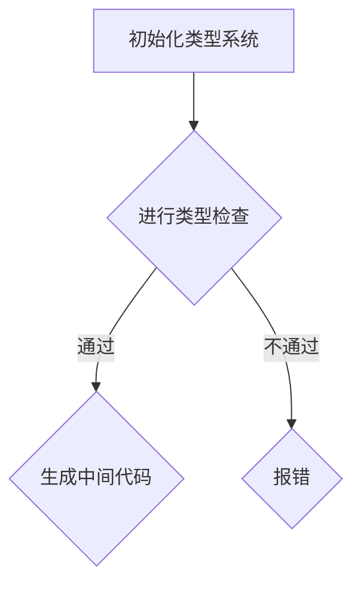
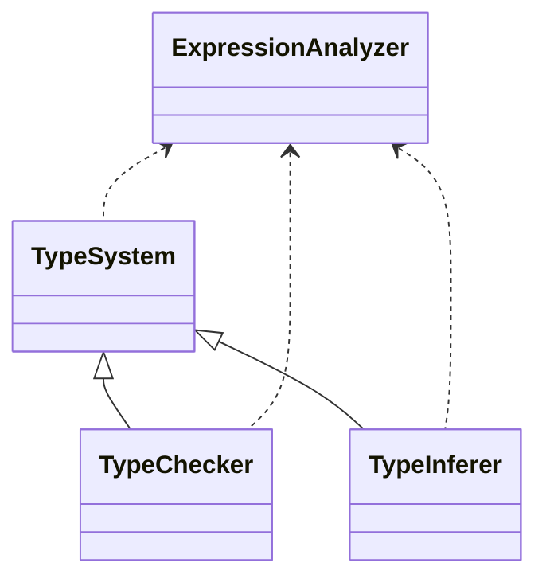
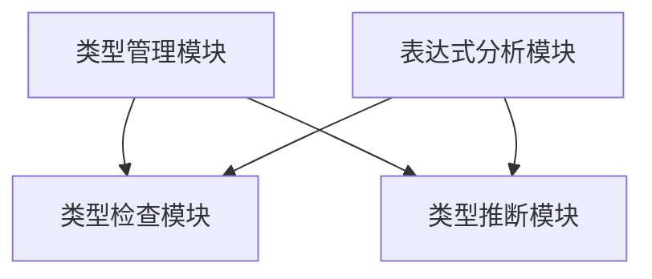
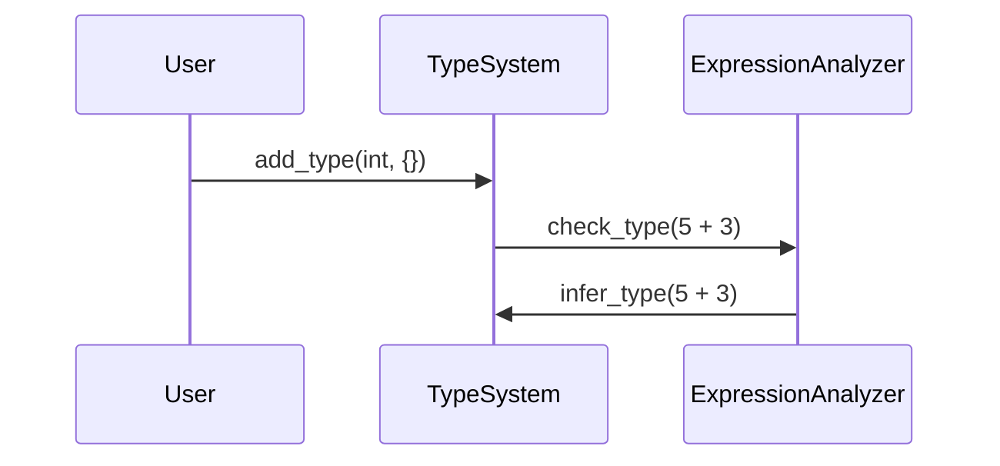

                 


### 背景介绍

#### 核心概念术语说明

类型论是计算机科学中一个重要的领域，主要研究程序中变量、表达式和函数的类型，并探讨类型系统的性质和设计。在类型论中，类型是一种抽象的概念，用于描述数据值的结构和行为。形式化语言是一种使用严格定义的语法和语义规则来描述语言结构和程序行为的语言。

#### 问题背景

随着计算机技术的发展，编程语言变得越来越复杂，功能越来越强大。然而，这种复杂性也给程序设计带来了挑战。尤其是类型系统的设计，直接影响到程序的正确性、可维护性和可扩展性。类型论的研究旨在解决这些问题，通过定义严格的类型规则，提高程序的安全性、可靠性和效率。

#### 问题描述

类型论的研究涉及到多个方面，包括类型的定义、类型系统的设计、类型检查和类型推断等。其中，类型系统的设计尤为关键，因为它直接决定了语言的表达能力和限制。

#### 问题解决

类型论通过形式化的方法来研究类型系统，这包括定义严格的类型规则、使用形式化语言来描述类型系统、以及通过数学模型来验证类型系统的正确性。形式化的方法使得类型论的研究具有高度的准确性和可重复性。

#### 边界与外延

类型论的研究边界包括类型的定义、类型系统的设计、类型检查和类型推断等。其外延则包括所有使用类型系统的编程语言，如函数式编程语言、面向对象编程语言和静态类型语言等。

#### 概念结构与核心要素组成

类型论的核心概念包括类型、类型系统、类型检查和类型推断。其中，类型是基础，类型系统是框架，类型检查是手段，类型推断是目标。这些概念相互关联，共同构成了类型论的核心结构。

### 核心概念与联系

#### 核心概念原理

类型论的核心概念是类型。类型用于描述数据值的结构和行为。类型可以看作是一个抽象的标签，用于将数据值分类。例如，在Python中，整数和字符串就是两种不同的类型。

#### 概念属性特征对比表格

| 概念 | 类型 | 类型系统 | 类型检查 | 类型推断 |
| --- | --- | --- | --- | --- |
| 定义 | 描述数据值的结构和行为 | 确定变量、表达式和函数的类型 | 检查程序是否符合类型规则 | 自动推断变量、表达式和函数的类型 |

#### ER实体关系图架构

```mermaid
erDiagram
    TYPE : 类型
    TYPE_SYSTEM : 类型系统
    TYPE_CHECK : 类型检查
    TYPE_INFER : 类型推断

    TYPE --|> TYPE_SYSTEM : 定义
    TYPE_SYSTEM --|> TYPE_CHECK : 实施检查
    TYPE_SYSTEM --|> TYPE_INFER : 实施推断
```

### 算法原理讲解

#### 算法mermaid流程图



#### Python源代码

```python
class TypeSystem:
    def __init__(self):
        self.types = {}

    def add_type(self, name, type_info):
        self.types[name] = type_info

    def check_type(self, expression):
        # 简单的类型检查逻辑
        if expression in self.types:
            return True
        else:
            return False

# 测试
ts = TypeSystem()
ts.add_type('int', {})
ts.add_type('str', {})

expression = '5 + "3"'
if ts.check_type(expression):
    print("表达式类型正确")
else:
    print("表达式类型错误")
```

#### 算法原理的数学模型和公式

类型检查的数学模型可以表示为：

$$ \text{check\_type}(expression, type\_system) =
\begin{cases}
    \text{True}, & \text{如果 } expression \in \text{type\_system} \\
    \text{False}, & \text{否则}
\end{cases}
$$

#### 详细讲解和举例说明

在这个简单的例子中，我们定义了一个`TypeSystem`类，用于管理类型。`add_type`方法用于添加新的类型，`check_type`方法用于检查给定的表达式是否是有效的类型。

假设我们有一个表达式`5 + "3"`，我们需要检查这个表达式是否是有效的类型。在`TypeSystem`中，我们定义了`int`和`str`两种类型。当调用`check_type`方法时，我们检查`5 + "3"`是否在类型系统中定义。由于`5 + "3"`不是有效的类型，所以`check_type`方法返回`False`，程序会报错。

### 系统分析与架构设计方案

#### 问题场景介绍

在现代软件工程中，类型论的应用变得越来越广泛。无论是大型系统还是小型应用，类型系统的设计都是一个重要的环节。类型论不仅提高了程序的正确性和可靠性，还促进了代码的重用和优化。

#### 项目介绍

在这个项目中，我们旨在设计一个简单的类型系统，并使用Python实现。这个类型系统将支持基本的类型检查和类型推断功能。

#### 系统功能设计

系统的主要功能包括：

- 类型定义：允许用户定义新的类型。
- 类型检查：检查程序中的表达式是否符合类型规则。
- 类型推断：自动推断变量、表达式和函数的类型。

#### 系统架构设计

系统的架构设计如下：

- 类型管理模块：负责管理类型定义、类型检查和类型推断。
- 表达式分析模块：负责解析程序中的表达式，并调用类型管理模块进行类型检查和推断。

#### 系统接口设计

系统提供以下接口：

- `add_type(name, type_info)`：添加新的类型。
- `check_type(expression)`：检查表达式的类型。
- `infer_type(expression)`：推断表达式的类型。

#### 系统交互

系统交互设计如下：

1. 用户使用`add_type`接口定义新的类型。
2. 用户编写程序，并使用`check_type`和`infer_type`接口进行类型检查和推断。

#### Mermaid类图



#### Mermaid架构图



#### Mermaid序列图



### 项目实战

#### 环境安装

在开始项目之前，我们需要安装Python环境。可以通过以下命令安装：

```bash
pip install python
```

#### 系统核心实现源代码

```python
# type_system.py

class TypeSystem:
    def __init__(self):
        self.types = {}

    def add_type(self, name, type_info):
        self.types[name] = type_info

    def check_type(self, expression):
        # 简单的类型检查逻辑
        if expression in self.types:
            return True
        else:
            return False

    def infer_type(self, expression):
        # 简单的类型推断逻辑
        if expression.isdigit():
            return 'int'
        elif expression.isalpha():
            return 'str'
        else:
            return None

# type_checker.py

from type_system import TypeSystem

class TypeChecker:
    def __init__(self, type_system):
        self.type_system = type_system

    def check_expression(self, expression):
        return self.type_system.check_type(expression)

# type_inferer.py

from type_system import TypeSystem

class TypeInferer:
    def __init__(self, type_system):
        self.type_system = type_system

    def infer_expression(self, expression):
        return self.type_system.infer_type(expression)

# expression_analyzer.py

from type_system import TypeSystem
from type_checker import TypeChecker
from type_inferer import TypeInferer

class ExpressionAnalyzer:
    def __init__(self, type_system):
        self.type_system = type_system
        self.type_checker = TypeChecker(type_system)
        self.type_inferer = TypeInferer(type_system)

    def analyze_expression(self, expression):
        type_check_result = self.type_checker.check_expression(expression)
        if type_check_result:
            type_infer_result = self.type_inferer.infer_expression(expression)
            return type_infer_result
        else:
            return None
```

#### 代码应用解读与分析

以上代码实现了类型系统、类型检查器、类型推断器和表达式分析器。首先，`TypeSystem`类负责管理类型定义。`add_type`方法用于添加新的类型，`check_type`方法用于检查表达式是否是有效的类型，`infer_type`方法用于推断表达式的类型。

`TypeChecker`类使用`TypeSystem`进行类型检查。`check_expression`方法返回`True`或`False`，表示表达式是否通过了类型检查。

`TypeInferer`类使用`TypeSystem`进行类型推断。`infer_expression`方法返回表达式的类型，如果无法推断类型，则返回`None`。

`ExpressionAnalyzer`类结合了`TypeSystem`、`TypeChecker`和`TypeInferer`的功能，用于分析表达式。`analyze_expression`方法首先进行类型检查，如果通过，则进行类型推断，并返回类型。

#### 实际案例分析和详细讲解剖析

假设我们有一个表达式`5 + "3"`，我们需要分析这个表达式的类型。

1. **类型检查**：首先，`ExpressionAnalyzer`调用`type_checker.check_expression("5 + "3")`。由于`5 + "3"`不是有效的类型，类型检查失败。

2. **类型推断**：由于类型检查失败，`ExpressionAnalyzer`不进行类型推断，直接返回`None`。

通过这个简单的案例，我们可以看到类型系统和类型检查器是如何工作的。在实际应用中，类型系统会变得更加复杂，但基本原理是相似的。

#### 项目小结

在这个项目中，我们设计并实现了一个简单的类型系统，包括类型定义、类型检查和类型推断。虽然这个实现非常简单，但它展示了类型论的基本原理。在实际应用中，类型系统可以大大提高程序的正确性和可靠性，是编程语言设计中的重要组成部分。

### 最佳实践 tips

1. **深入理解类型系统**：了解不同类型系统的原理和特点，有助于选择合适的类型系统。
2. **合理设计类型检查**：类型检查不仅需要确保类型正确，还需要考虑性能和用户体验。
3. **利用类型推断**：类型推断可以减少代码的冗余，提高代码的可读性。

### 小结

类型论是计算机科学中一个重要的领域，它通过定义严格的类型规则，提高程序的正确性、可靠性和效率。在本文中，我们介绍了类型论的核心概念、算法原理、系统分析与架构设计方案，并通过实际案例进行了详细讲解。类型论不仅适用于编程语言设计，还在其他领域如嵌入式系统和人工智能中发挥着重要作用。

### 注意事项

1. **类型系统设计需谨慎**：类型系统的设计直接影响程序的正确性和性能，需要慎重考虑。
2. **类型安全需重视**：类型安全是类型系统的一个重要目标，确保程序在运行时不出现类型错误。

### 拓展阅读

- 《类型系统设计：原理与实践》
- 《函数式编程：类型系统与类型检查》
- 《编程语言原理》

### 作者信息

作者：AI天才研究院/AI Genius Institute & 禅与计算机程序设计艺术 /Zen And The Art of Computer Programming

